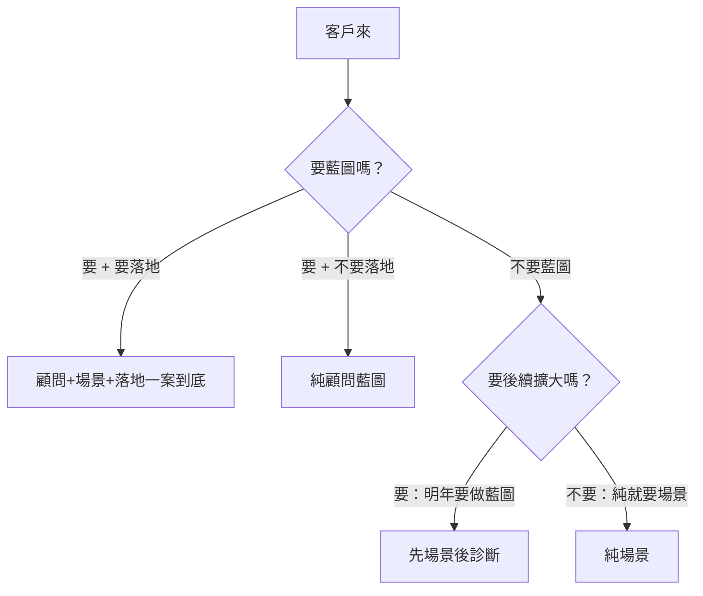
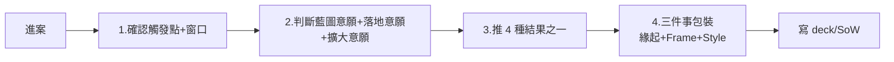

# AI at Scale 賣法

> v1.0 · 2026-05-04 · 對人類友善版

---

## 核心一句話

**成熟度低的客戶聽不下完整藍圖，成熟度高的客戶要 frontier 對齊全景。** 所以同一套 7 元件 solution 要切成 4 種「可賣結果」，光譜兩端配不同包裝。

---

## 4 種可賣結果

> 直接照 Livia 口述

| 結果 | 賣的東西 | 規模估算 | 適合 |
|---|---|---|---|
| **先場景後診斷** | 今年場景 1-2 個 + 明年顧問藍圖 hook | 50-150 人月 / 6-12 個月 | 中型客戶想長期但今年只能小步 |
| **純顧問藍圖** | 完整顧問，不直接落地（落地交給 SI / 客戶 / 下案）| 100-400 人月 / 6-12 個月 | 要全景、落地給別人 |
| **顧問+場景+落地一案到底** | 完整顧問 + 同案內挑場景 + 真實落地 | 500-1500 人月 / 12-24 個月 | 旗艦級大型客戶（CTBC 型）|
| **純場景** | 1-N 個場景，無顧問 | 30-200 人月 / 3-12 個月 | 預算單薄 / 場景明確 / 不要顧問 |

---

## 進案路徑（觸發點 + 窗口）

進案路徑 = 為什麼進案 × 從誰進案。同一個觸發點配不同窗口賣法不同。

**常見觸發點**：

1. **高層自發轉型**——CEO/CDO 主動找 IBM、董事會喊話
2. **競爭驅動**——同業先做了 / 客戶被市場逼
3. **IBM 既有大案延伸**——已有 IBM Consulting / Software 案
4. **集團 / M&A 重整**——母公司或併購後要統一
5. **業務 BU 痛點**——具體場景（譬如客服命中率 / 理專效率）
6. **IT 預算主動立案**——CIO 自己有預算想做

**常見窗口**：CEO / CDO / CIO / CFO / 業務 BU 主管 / 董事會

---

## 決策樹

判斷的關鍵訊號：
- **藍圖意願**：要 / 不要
- **落地意願**（要藍圖時）：要 / 不要
- **後續擴大意願**（不要藍圖時）：要 / 不要

---

## 包裝三件事

### A. 緣起痛點（開場 hook）

按觸發點對應：

- 高層自發轉型：「3 年後您想跟 frontier 對齊嗎？/ 競爭對手 X 已經到 T3」
- 競爭驅動：「您的競爭對手 X 已經做了 Y...」
- IT 預算驅動：「您 IT 預算 30% 花在重複資料整備嗎？」
- 業務 BU 痛點：「您客服 AI 命中率還停在 40% 嗎？」

### B. 售賣 Frame（IBM 在案子裡是誰）

**同一個「顧問+場景+落地」案，對不同客戶 IBM 角色完全不同：**

- 對 CTBC frontier CEO → **AI Lab Partner**：「我們和您共建 AI-native 銀行」
- 對 NSL 型保守大型客戶 → **轉型陪跑夥伴**：「我們陪您 3 年做完整轉型」
- 對 YAGEO 型集團 → **集團統合者**：「我們幫您拉齊 12 個 BU」
- 對中型客戶 → **顧問藍圖**：「IBM 顧問幫您想清楚 3 年怎麼做」

主要 5 種 Frame：

| Frame | 客戶心裡買的 | 適配窗口 |
|---|---|---|
| 顧問藍圖 | 戰略清晰 + 第三方 validate | CEO / CDO / 董事會 |
| 轉型陪跑夥伴 | 長期 partner + 知識轉移 | CEO / CDO |
| AI Lab Partner | frontier 認知 + 研發共創 | CEO / CDO（讀 frontier）|
| 集團統合者 | 集團一致性 | 集團 CEO / CFO |
| 平台選型專家 | 中立選型 + 整合能力 | CIO / CDO |

### C. 語氣 Style（怎麼說話）

光譜兩端對應你原始洞察：

| Style | 適配客戶 | 詞彙 | 避免 |
|---|---|---|---|
| **IBM 經典**（保守端）| 傳統大型銀行 / 保守製造業 | capability map / target operating model / roadmap / 八橫四縱 | frontier 詞彙 / engineering-coded 動詞 |
| **Frontier 工程師**（激進端）| CTBC / 讀 frontier 的 CEO | Agent Engineering / Ontology / Harness / Evals / Y1-Y3 time-axis | transformation / blueprint / 顧問鬼話 |

中間還可加：
- **集團整合 Style**（YAGEO 型）
- **業務 ROI Style**（業務 BU 主導）

---

## 工作流（進案 30 分鐘判斷）

---

## 與 AI Governance 的搭配

多數 AI at Scale 案會搭配對應的 governance 套餐：

| AI at Scale 結果 | 自然搭配的 Governance 套餐 |
|---|---|
| 純場景 | 一次性技術檢測 |
| 先場景後診斷 | 治理工具棧 |
| 純顧問藍圖 | 看客戶治理成熟度 → 內規重構 / 全套新建 |
| 顧問+場景+落地 | 看客戶治理成熟度 → 對應套餐 |

詳細 governance 賣法見 `SALES_AI_GOVERNANCE.md`。

---

## 待 Livia 補

1. 每個結果的客戶 anchor（哪些案落到哪個結果？）
2. 進案路徑你常走哪幾條？哪幾條是死區？
3. Frame 5 個對嗎？要砍 / 補嗎？
4. 「支柱二、三」是什麼？
