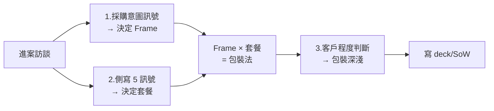

# AI Governance 賣法

> v1.6 · 2026-05-04 · 加「純工具對 Consulting 沒贏面」+ 抽絲剝繭問句

---

## 核心一句話

**治理本身不直接賺錢——所以賣治理 = 找剛性需求附身。**

7 條進案路徑（A/B/C 三組）→ Frame 與套餐**獨立決定**：客戶嘴上說的決定 Frame（怎麼包裝），治理成熟度決定套餐（實際範圍）。

---

## ⭐ 重要 insight：客戶嘴巴 ≠ 實際需求

> **客戶心智模型 vs IBM 實際做的可能落差很大**——但 IBM 用客戶熟悉的詞彙包裝。

| 客戶嘴上說 | 客戶心智模型 | IBM 實際做的 |
|---|---|---|
| 「我要直接買工具全包，買了再請 IBM 教用、技術移轉，我的人就會用了」 | 工具供應商思維（簡化版）| 完整 operating model 導入：M1-M9 包括組織、Playbook、PDCA、四階文件、工具棧、技術移轉 |
| 「我要顧問藍圖」 | Operating Model 思維 | 同樣的 M1-M9，但用客戶聽得懂的 operating model 語言包裝 |

**客戶最終一樣得到完整治理，只是理解角度不同。**

→ 因此：**客戶嘴上的訊號決定 Frame（怎麼包裝），不決定套餐（實際範圍）。**

---

## 5 種可賣套餐

> Livia ASSET MAP「依客戶成熟度組合套餐」

| 客戶現況 | 套餐 | 主打模組 | 規模 |
|---|---|---|---|
| 高成熟：已有完整內規、已實施 | **補強升級包** | M3 機制補強 + M5 工具升級 | 50-150 人月 |
| 中成熟：零散內規寫不好 | **內規重構 + 落地包** | 基於 M4 既有內規 + M1-M9 | 200-500 人月 |
| 低成熟：沒內規從零 | **全套新建 + 落地包** | M1-M9 全 | 300-800 人月 |
| 工具型（罕見）：真小案、純工具買賣 | **治理工具棧** | M5 為主 | 50-150 人月 |
| 單案型：只要技術檢測 | **一次性技術檢測** | M8-M9 技術控制項 | 30-80 人月 |

⚠️ 單案型 corner case：若內規不清 → 回到中成熟或低成熟方案。
⚠️ 工具型 corner case：絕大多數「要工具」客戶實際需要 GV-A/B/C，只是嘴上說要工具——這時用工具供應商 Frame 包裝其他套餐。**純工具 GV-D 對 IBM Consulting 沒贏面，是 fallback 不是 default**——詳見決策樹一第 3 步。

---

## 7 條進案路徑

### A 組：IBM 既有關係結合（IBM 主動帶）

| 進案路徑 | 主窗口 | Frame 預設 | 默認套餐 | 開場 hook |
|---|---|---|---|---|
| **IBM 內部 AI 工具品質保證** | CIO / IT | 工具供應商 | 看 5 訊號 | 「IBM 顧問用 AI 工具效果未知，所以內部都需要治理保證」|
| **IBM AI 專案結合（要工具）** | CIO | 工具供應商 | 看 5 訊號 | 「您的 AI 案 / watsonx 順勢加治理」|
| **IBM AI 專案結合（要藍圖）** | CDO / 董事會 | Operating Model 導入夥伴 | 看 5 訊號（偏中-低成熟）| 「治理是規模化前提」|
| **三朵雲合作** | CIO + 雲商 | 工具供應商 | 看 5 訊號 | 「補雲商不擅長的合規 mapping」|

### B 組：客戶端剛性需求

| 進案路徑 | 主窗口 | Frame 預設 | 默認套餐 | 開場 hook |
|---|---|---|---|---|
| **法規驅動** | CRO / 法遵長 | 法遵伴侶（常態）| 看 5 訊號 | 「金管會 / EU AI Act / ISO 42001...」|
| **危機事件後** | CEO 直線 | 法遵伴侶（加速版）| 補強 / 內規重構 | 「您看 X 公司上週 AI 出事...」|
| **M&A 集團整合** | 集團 CEO / CFO | 集團統合者 | 內規重構 / 全套新建 | 「併購後 12 個 BU 各做各的...」|
| **認證取證** | CMO / CEO | 法遵伴侶 | 內規重構 / 全套新建 | 「ISO 42001 是您出海前必拿的...」|

### C 組：技術前沿驅動

| 進案路徑 | 主窗口 | Frame 預設 | 默認套餐 | 開場 hook |
|---|---|---|---|---|
| **新技術觸發**（multiagent / Claude Code 怎麼治理）| CTO / RAI | 工具供應商 或 Operating Model | 補強 / 一次性檢測 | 「您要落地 X 新技術，治理還沒跟上...」|

---

## 決策樹一（修正版）：Frame 與套餐分開決定

### 第 1 步：採購意圖訊號 → 決定 Frame（不是套餐！）

| 客戶嘴上說 / 採購行為 | 鎖定的 Frame |
|---|---|
| 「我要工具」/「我要 watsonx」/「我要 model registry」 | 工具供應商 |
| 「我要顧問」/「我要藍圖」/「我要 3 年規劃」 | Operating Model 導入夥伴 |
| 「我要解決法規」/「金管會檢查」 | 法遵伴侶 |
| 「我們剛出事 / 被罰」 | 法遵伴侶（加速版）|
| 「集團要統一」/「子公司亂」 | 集團統合者 |
| 「multiagent / 新技術怎麼治理」 | 工具供應商 或 Operating Model |
| 模糊 / 沒明確 | 由進案路徑表帶（進案路徑 Frame 預設）|

> ⚠️ **這層只決定 Frame，不決定套餐！**「我要工具」≠ GV-D。

### 第 2 步：5 訊號 → 決定套餐

| 客戶側寫訊號 | 低成熟 → 全套新建 | 中成熟 → 內規重構 | 高成熟 → 補強升級 |
|---|---|---|---|
| **AI 應用面積** | 無 / 少 PoC | 中（5-10 production）| 多（跨多 BU）|
| **AI 治理組織** | 無 / 散落 | 有專責角色但無組織 | RAI office / 委員會 |
| **內規 / 政策狀態** | 沒 / ML 老政策硬套 | patchy 寫不好 | 完整 Playbook 在執行 |
| **客戶詞彙** | 「合規」「風險」 | 「治理」「PDCA」「藍圖」| 「frontier」「Agent」「Ontology」 |
| **採購行為**（補充判斷）| 法規 RFP / 對標壓力 | 主動問治理 | 升級 / frontier 對齊 |

> 5 訊號多數落哪欄就推那個套餐。

### 第 3 步：少數真小案的特例

> ⚠️ **銷售策略**：純工具買賣（GV-D）對 IBM Consulting 沒大贏面——沒人月、沒 operating model 導入、沒後續案，license 分成是 Software 拿。**GV-D 是 fallback 不是 default**。客戶說「要工具」時應該先抽絲剝繭主動往上推。

#### 抽絲剝繭追問範例

| 追問問題 | 客戶答得出來 → | 客戶答不出來 → |
|---|---|---|
| 「工具上線後誰負責讓它跑起來？」 | 有專責角色 / RAI office | 沒人 → 升級 GV-A/B/C |
| 「您的內規 / SOP 寫了 AI 治理流程嗎？」 | 完整 SOP 在執行 | 沒 SOP → 升級 GV-A/B/C |
| 「AI 應用上線決策由誰拍板？」 | 有治理委員會 | 沒人 → 升級 GV-A/B/C |
| 「工具監控的指標誰看？看了會做什麼？」 | 明確的責任鏈 | 沒人看 → 升級 GV-A/B/C |

#### 結論

| 條件 | 套餐 |
|---|---|
| 抽絲剝繭都答得出來 + 真的只缺工具 | GV-D 治理工具棧（罕見，等於 GV-A 退化版）|
| 抽絲剝繭答不出來 | 升級到 Step 2 對應的 GV-A/B/C，用工具供應商 Frame 包裝 |
| 客戶要單案驗證 + 內規清楚可依循 | GV-E 一次性技術檢測 |
| 客戶要單案驗證 + 內規不清 | 回 Step 2 跑套餐 |

---

## Frame × 套餐 = 包裝法

| Frame | 鋪陳的核心故事 |
|---|---|
| **工具供應商** | 客戶腦袋簡化版：買工具 + IBM 教用 + 技術移轉 + 客戶的人會用了。**IBM 內部其實導入完整 operating model**——但不在客戶語言中說 |
| **Operating Model 導入夥伴** | 客戶懂 operating model 重要性。表裡一致。3 年願景 + AI at Scale 全景 + 治理是規模化前提 |
| **法遵伴侶（常態 + 危機加速版）** | 監理機關視角。法規 mapping → 三道防線 → 取證 milestone。**速度可調**。危機加上止血→根因→經驗轉化 |
| **集團統合者** | 集團一致性 + 子公司拉齊 + 政治可行性 + 中立第三方 |

**特殊：AI Lab Partner**——99% 案不適用。只在 tier 1 客戶（CTBC / Wistron 等）主動提出新治理觀念時走。

---

## 客戶程度（sophistication）→ 包裝深淺

| 客戶程度 | 包裝方式 |
|---|---|
| **高（讀 frontier）** | 直接 frontier shorthand、跳過教育 |
| **中（需要橋接）** | 用比喻 + 簡化術語 |
| **低（要 educate）** | 從基礎觀念講起 + step-by-step + 案例 |

---

## 同套餐對不同客戶（範例 GV-C 全套新建，4 種包裝）

> ⭐ 同樣是 M1-M9 完整新建，4 種完全不同的講法：

| 客戶 | 嘴上說 | Frame | 程度 | 開場 + 鋪陳 |
|---|---|---|---|---|
| 玉山 | 「金管會檢查」 | 法遵伴侶 | 中 | 「金管會 AI 治理檢查週期...」+ 法規 mapping → 三道防線 → 取證 |
| YAGEO | 「集團要統一」 | 集團統合者 | 中 | 「併購後 12 個 BU...」+ 集團一致性 → 子公司拉齊 |
| 大型製造業 | 「我要藍圖」 | Operating Model 導入夥伴 | 中-高 | 「3 年讓您 AI 工廠跑起來」+ Operating Model 全景 + roadmap |
| 中型銀行 | **「我要工具」** | **工具供應商** | 低 | 「您的 watsonx 順勢加治理」+ **買工具 + IBM 教用 + 技術移轉**——但 IBM 內部仍跑完整 M1-M9（用比喻）|

**4 個客戶都是 GV-C 全套新建套餐，但 4 種完全不同的 Frame 與包裝深淺。**

---

## 工作流（進案 30 分鐘）

---

## 待 Livia 補

1. 每個套餐的客戶 anchor（玉山 / Wistron / 各是哪個套餐？）
2. 7 條進案路徑你親身打過哪幾條？
3. Frame 跟套餐分開決定的設計對嗎？
4. 抽絲剝繭問句你會問哪些？（這 4 條我推的）
5. 「支柱二、三」是什麼？
