# 🗞️ AI Intel Digest — 2026-W19

_Generated 2026-05-09 18:39 UTC · 120 high-signal items synthesized · $0.4556 USD cost · ~97 分鐘讀完_


## ⚡ 本週 TL;DR — 5 Pillar 各一句
- 🏦 **P1**: Singular Bank 的 Singularity：銀行家每天省 60–90 分鐘的 ChatGPT + Codex 生產部署
- 📊 **P2**: xAI 把 Colossus 算力租給 Anthropic：「認輸」還是雙贏？
- 🚀 **P3**: Mozilla + Claude Mythos：真實部署在 Firefox 安全強化，發現數百個漏洞
- 🛠️ **P4**: Agent Observability 不只是 Debug：LangChain Harrison Chase 提出 Feedback Loop 才是核心
- 🌐 **P5**: Anthropic 年化成長 80 倍、算力嚴重短缺，被迫向競對 xAI 租用 Colossus 資料中心

## 📊 本期 provenance 分布（合成證據強度）

_本期合成共 74 段，標記為：_

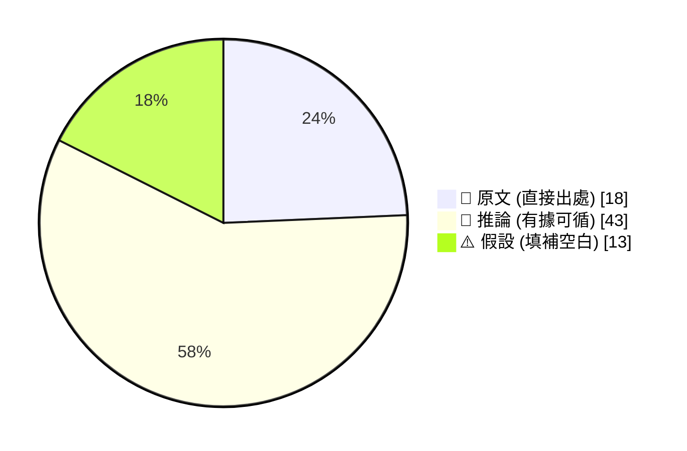

_引用規範：📖 可直接引用；🧠 客戶會議前查 verification hints；⚠️ 引用時明說「此為推測」_

## 🔄 本期 pipeline 處理流程


## 📑 目錄
- [Pillar 1 — 產業 AI 真實落地 (BFSI + 製造業)](#pillar-1) · 22 items · $0.0878
- [Pillar 2 — AI 戰略 / 治理 / 董事會層級論述](#pillar-2) · 16 items · $0.0806
- [Pillar 3 — Frontier 能力 + 模型動向](#pillar-3) · 27 items · $0.0979
- [Pillar 4 — Harness Engineering 實作技藝](#pillar-4) · 40 items · $0.1044
- [Pillar 5 — 學派 / 社群 / 思想動態](#pillar-5) · 15 items · $0.0849
- [📚 Foundation 深讀](#foundation) · curriculum 主題深度文


---

<a id="pillar-1"></a>

## 🏦 Pillar 1 — 產業 AI 真實落地 (BFSI + 製造業)
_22 items · $0.0878_

## Pulse — Top 3

### 1. Singular Bank 的 Singularity：銀行家每天省 60–90 分鐘的 ChatGPT + Codex 生產部署

📖 **原文** Singular Bank 建立內部 AI 助理 Singularity，整合 ChatGPT 與 Codex，協助銀行家自動化會議準備、投資組合分析與後續跟進作業，每人每天節省 60–90 分鐘。這是 BFSI 領域少見的**已量化時間效益 + 具名銀行 + 雙模型架構（對話 + 程式代理）**三者兼具的 production deployment 案例。

🧠 **推論** 對台灣銀行而言，「會議準備 + 投資組合分析」正是 Cathay、E.SUN、Taishin 的 RM（關係經理）最重複的工作之一——此案例提供直接的 ROI 量化框架，而非只是概念展示。

🧠 **推論** Codex 在此扮演程式代理角色（非純對話），代表後端資料拉取與報告生成已進入自動化，這在 harness 設計上需要區分「語言模型呼叫」與「工具呼叫」的追蹤鏈路。

以下架構圖說明 Singularity 的雙模型任務分工：

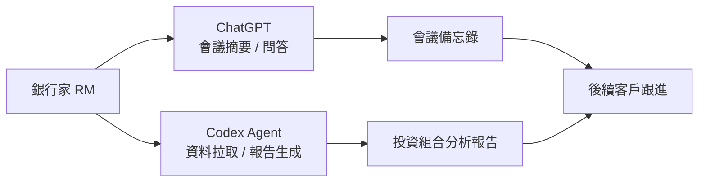

*關鍵洞察：兩個模型承擔不同任務（對話 vs. 程式代理），harness 必須分別追蹤兩條呼叫鏈的延遲與錯誤率。*

- 來源：[OpenAI Blog](https://openai.com/index/singular-bank)
- 對客戶的具體含意：下次與玉山或國泰 RM 團隊對話時，可直接引用「同規模銀行每 RM 每天省 60–90 分鐘」作為 pilot ROI 基準，要求對方估算現有 RM 人數乘以此數字的年化效益。

**(English)** Singular Bank's Singularity: ChatGPT + Codex Production Deployment Saves Bankers 60–90 Minutes Daily

[Original] Singular Bank built an internal AI assistant called Singularity, combining ChatGPT and Codex to automate meeting preparation, portfolio analysis, and follow-up tasks — saving bankers 60–90 minutes per day. This is one of the rare BFSI production deployment cases that simultaneously offers a named bank, quantified time savings, and a dual-model architecture (conversational + code agent). [Inference] For Taiwan banks, "meeting prep + portfolio analysis" is precisely the most repetitive work for RMs at Cathay, E.SUN, and Taishin — this case provides a direct ROI quantification framework rather than a conceptual demo. [Inference] Codex here acts as a code agent (not pure chat), meaning back-end data retrieval and report generation are already automated; in harness design, this requires separate tracing chains for "LLM calls" versus "tool calls."

The diagram above illustrates Singularity's dual-model task split — the key insight being that the two models serve distinct roles (conversation vs. code agent), and the harness must track each call chain's latency and error rate independently.

- Source: [OpenAI Blog](https://openai.com/index/singular-bank)
- Client implication: In your next conversation with E.SUN or Cathay RM teams, cite "comparable-scale bank saves 60–90 minutes per RM per day" as a pilot ROI baseline and ask them to multiply that by their RM headcount to get an annualized benefit figure.

---

### 2. Claude Code 的 MCP Hijacking 漏洞：OAuth 憑證可在開發者不知情下被竊取

📖 **原文** 資安業者 Mitiga 研究人員發現 Claude Code 存在設計漏洞，可被發動 MCP Hijacking 攻擊，在開發者毫無察覺的情況下竊取 OAuth 憑證，並可透過供應鏈攻擊擴大下游受害範圍。

🧠 **推論** MCP（Model Context Protocol）作為 AI agent 連接外部工具的標準介面，其劫持攻擊面等同於傳統 OAuth 中間人攻擊的 AI 版本——不同之處在於受害者是**自動執行的 agent**，而非人類用戶，因此更難察覺。

🧠 **推論** 對於正在或計畫使用 Claude Code 建立內部開發工具的台灣製造業（Foxconn、Wistron 等）或銀行 IT 部門，此漏洞直接威脅連接內部系統的 MCP server 配置，應立即審查現有 MCP 工具清單與其 OAuth scope 設定。

⚠️ **假設** Anthropic 是否已釋出修補版本或緩解建議目前不明，需驗證。

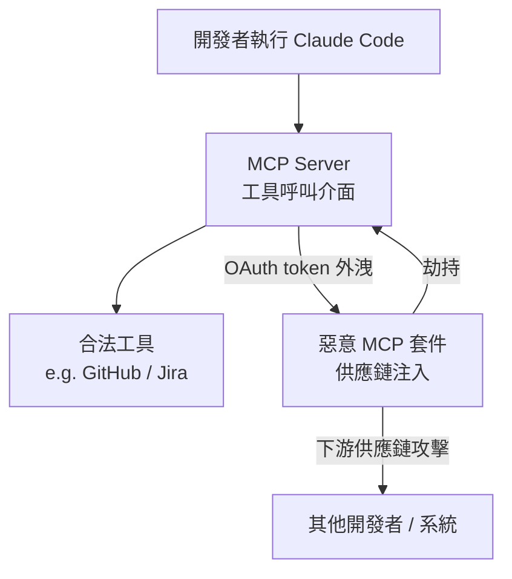

*關鍵洞察：攻擊入口在 MCP 套件層，而非模型本身——供應鏈審查比模型版本更新更重要。*

- 來源：[iThome](https://www.ithome.com.tw/news/175647)
- 對客戶的具體含意：若貴行或製造廠的 IT 部門已部署 Claude Code 或任何 MCP-enabled AI 開發環境，本週應立即清查 MCP server 白名單，並確認 OAuth scope 是否遵循最小權限原則。

**(English)** Claude Code MCP Hijacking Vulnerability: OAuth Credentials Stolen Without Developer Awareness

[Original] Security firm Mitiga researchers discovered a design flaw in Claude Code that enables MCP Hijacking attacks — stealing OAuth credentials without the developer noticing — and can propagate damage downstream via supply chain attacks. [Inference] MCP (Model Context Protocol), as the standard interface connecting AI agents to external tools, makes hijacking attacks the AI-era equivalent of OAuth man-in-the-middle attacks — the critical difference being that the victim is an **autonomously executing agent**, not a human user, making detection far harder. [Inference] For Taiwan manufacturers (Foxconn, Wistron, etc.) or bank IT departments currently using or planning to use Claude Code to build internal dev tools, this vulnerability directly threatens MCP server configurations connected to internal systems — audit your MCP tool inventory and OAuth scope settings immediately. [Assumption] Whether Anthropic has released a patch or mitigation guidance is currently unclear and needs verification.

The diagram above shows the attack flow: the entry point is the MCP package layer, not the model itself — meaning supply chain review is more urgent than model version upgrades.

- Source: [iThome](https://www.ithome.com.tw/news/175647)
- Client implication: If your bank or manufacturing IT team has already deployed Claude Code or any MCP-enabled AI development environment, this week's immediate action is to audit the MCP server allowlist and confirm that OAuth scopes follow the principle of least privilege.

---

### 3. TridentCare 96% 排程自動化：AI Agent 實際接管物流調度的完整案例

📖 **原文** 美國行動醫療診斷服務商 TridentCare 導入 AI agent，處理工作排程、路線安排與例外狀況，將排程自動化比率提升至 96%，並縮短病患等候時間。TridentCare 服務範圍涵蓋 46 州，每天派遣數百輛車，每年協調數千名持照臨床人員完成約 540 萬次現場服務。

🧠 **推論** 96% 自動化意味著 agent 已能獨立處理常規排程，人工介入僅保留在例外狀況（約 4%）——這是**「人在迴圈」(human-in-the-loop) 成熟落地**的具體比例，可直接用於說服台灣製造業客戶接受「先跑 pilot 再擴大」的風險框架。

🧠 **推論** 540 萬次/年的服務規模對應台灣電子製造業（Foxconn、Pegatron 等）的物料排程與工廠派工場景——複雜度相當，技術遷移性高。

⚠️ **假設** 此部署使用的具體 AI 平台（OpenAI、Google、自建）未在摘要中披露，需查原始報導確認技術堆疊。

- 來源：[iThome](https://www.ithome.com.tw/news/175643)
- 對客戶的具體含意：對鴻海、廣達等大型製造客戶，可用「540 萬次服務 / 46 州 / 96% 自動化」作為 agent 排程落地的基準案例，主動提問：「你們現在工廠派工有多少比例還是人工？」推動自評。

**(English)** TridentCare 96% Scheduling Automation: A Complete Case Study of AI Agents Taking Over Logistics Dispatch

[Original] US mobile medical diagnostics provider TridentCare deployed AI agents for scheduling, routing, and exception handling, lifting scheduling automation to 96% and reducing patient wait times. TridentCare operates across 46 states, dispatching hundreds of vehicles daily, coordinating thousands of licensed clinicians to complete approximately 5.4 million on-site service visits per year. [Inference] A 96% automation rate means agents independently handle routine scheduling while human intervention is reserved for exceptions (~4%) — this is a concrete ratio for **mature human-in-the-loop deployment**, directly usable to convince Taiwan manufacturing clients to accept a "run pilot first, then scale" risk framework. [Inference] The 5.4 million annual service visits map closely to materials scheduling and factory dispatch scenarios at Taiwan electronics manufacturers (Foxconn, Pegatron, etc.) — comparable complexity, high technical transferability. [Assumption] The specific AI platform used (OpenAI, Google, custom-built) is not disclosed in the excerpt and needs to be confirmed in the original report.

- Source: [iThome](https://www.ithome.com.tw/news/175643)
- Client implication: With large manufacturing clients like Foxconn or Quanta, use "5.4M service visits / 46 states / 96% automation" as a grounding benchmark for agent-based scheduling, then prompt them with: "What percentage of your factory dispatch is still manual today?" to drive self-assessment.

---

## Watch list

繁中為主，每條一行：

- [iThome](https://www.ithome.com.tw/news/175660) — GitHub MCP Server 新增提交前機密憑證與相依套件掃描，Claude Code MCP 漏洞的直接防禦對應工具，值得 harness 設計時納入。
- [CIO Taiwan](https://www.cio.com.tw/112198/) — TrendAI 攜手 Anthropic 做 AI 資安治理，台灣本地語境的漏洞偵測案例，可作為對金融客戶的資安 AI 導入切入點。
- [iThome](https://www.ithome.com.tw/news/175633) — 駭客用 Anthropic/OpenAI 模型攻擊墨西哥水利基礎設施，frontier model 被武器化的真實案例，銀行客戶問「AI 有哪些風險」時的具體答案之一。
- [CIO Taiwan](https://www.cio.com.tw/112099/) — Palo Alto 擬收購 Portkey 建立 AI Gateway，agent 安全管控市場正在集中化，評估 harness 的 gateway 層是否需提前選型。
- [LangChain Blog](https://www.langchain.com/blog/building-a-company-due-diligence-agent-with-deep-agents-langsmith-and-parallel) — 使用 LangChain + LangSmith 建立盡職調查 agent 的完整實作，PE/信貸/合規場景直接適用，harness 工程師值得看實作細節。
- [Databricks Blog](https://www.databricks.com/blog/how-superhuman-and-databricks-built-200k-qps-inference-platform-together) — Superhuman + Databricks 建構 200K QPS 推論平台，高頻 inference 架構細節，對 Livia harness 的規模化設計有參考價值。
- [iThome](https://www.ithome.com.tw/news/175668) — 衛福部要求醫院資安預算至少 3%，AI 治理納入期中審查，可類比推演金融監管機關對銀行 AI 治理的下一步要求。
- [Simon Willison](https://simonwillison.net/2026/May/7/firefox-claude-mythos/#atom-everything) — Mozilla 用 Claude Mythos preview 找出並修補 Firefox 數百個漏洞，AI 輔助安全審計的品質已超越人工 slop 階段，值得評估是否引入 BFSI 的程式碼安全審查流程。
- [Siemens Blog](https://blog.siemens.com/2026/05/turn-complexity-to-competitive-advantage-with-modernized-data-foundations/) — Siemens Teamcenter BoM 效能提升 20 倍，GM 每晚驗證數十萬車型配置，台灣製造業導入 AI 前的資料基礎建設參考案例。
- [科技新報](https://finance.technews.tw/2026/05/09/ai-memory-crunch-winbond-extremely-tight-demand-2027-capacity-sold-out/) — 華邦電毛利率 53.4% 創新高，2027 年 AI 記憶體產能已售罄，對 TSMC/MediaTek 客戶對話的供應鏈壓力佐證數據。

---

## Verification hints

This briefing contains **4

🧠 **推論**** segments and **3

⚠️ **假設**** segments. Before citing in client conversations, verify these specific points (English for language-learning practice):

1. **Singular Bank / Singularity architecture** — The excerpt confirms ChatGPT + Codex and the 60–90 minute savings figure, but does not specify whether Codex is used as a code-execution agent or purely for code generation; verify the [OpenAI Blog post](https://openai.com/index/singular-bank) for architecture specifics before describing it as a "code agent" to clients.
2. **Claude Code MCP Hijacking patch status** — The [iThome article](https://www.ithome.com.tw/news/175647) reports the Mitiga finding but does not confirm whether Anthropic has issued a CVE, patch, or mitigation guidance as of publication; check Anthropic's security advisory page and Mitiga's original report directly before advising clients on remediation steps.
3. **TridentCare AI platform identity** — The [iThome article](https://www.ithome.com.tw/news/175643) states the 96% automation and scale figures but does not name the underlying AI vendor or platform; do not attribute this deployment to any specific vendor (OpenAI, Google, etc.) in client conversations without confirming in the original source.
4. **TridentCare "exception rate = 4%" inference** — The claim that human intervention covers ~4% of cases is a direct arithmetic inference from "96% automation"; the source does not explicitly characterize the remaining 4% as human-handled exceptions — verify whether partial automation or hybrid handling accounts for some of that gap.2026-05-09 18:30:38,432 INFO pillar 2 (AI 戰略 / 治理 / 董事會層級論述): 16 high-signal items (min_signal=0.60)

---

<a id="pillar-2"></a>

## 📊 Pillar 2 — AI 戰略 / 治理 / 董事會層級論述
_16 items · $0.0806_

## Pulse — Pillar 2 | AI 戰略 / 治理 / 董事會層級論述

---

## Pulse — Top 3

### 1. xAI 把 Colossus 算力租給 Anthropic：「認輸」還是雙贏？

🧠 **推論** Anthropic 第一季年化營收與用量激增 80 倍，導致算力嚴重短缺，因而簽下租用 xAI Colossus 資料中心全部容量的協議（300MW，約 $5B/年）。

🧠 **推論** Platformer 的 Casey Newton 直指：Elon Musk 若仍認為 xAI 領先，不會把算力租給競爭對手——這個交易本身就是 xAI 戰略地位的訊號。

⚠️ **假設** 對台灣金融與製造業客戶而言，這意味著未來 12–18 個月 Anthropic 的 Claude API 容量瓶頸可能緩解，但環境合規風險（Colossus 氣渦輪機最初在無 Clean Air Act 許可下運作）可能成為 ESG 治理討論的敏感點。


*xAI 出租閒置算力換取現金流，Anthropic 換取成長跑道；關鍵洞察：算力租賃正在取代「自建≡領先」的舊敘事。*

- 來源：[Platformer — Did xAI just concede the AI race?](https://www.platformer.news/did-xai-just-concede-the-ai-race/) ｜ [Simon Willison — Notes on the xAI/Anthropic data center deal](https://simonwillison.net/2026/May/7/xai-anthropic/#atom-everything) ｜ [INSIDE 硬塞 — Anthropic 執行長自曝成長「太瘋狂」](https://www.inside.com.tw/article/41250-anthropic-ceo-dario-amodei-says-company-crew-80-fold-in-first-quarter)
- 對客戶的具體含意：向台灣銀行 CIO 提案時，可用此案說明「API 供應穩定度」已成選商標準之一，同時提示 ESG 委員會應將 AI 算力供應鏈的碳足跡納入採購盡職調查。

**(English)** xAI leases Colossus to Anthropic: strategic concession or pragmatic cash trade?

🧠 **推論** Anthropic's ARR and usage surged ~80× in Q1 2025, creating a severe compute shortage that drove the company to lease the full capacity of xAI's Colossus data center (300MW, ~$5B/yr).

🧠 **推論** Platformer's Casey Newton argues the deal itself is a signal: Musk would not sell compute to a rival if xAI were ahead — a board-level narrative shift in the AI race.

⚠️ **假設** For Taiwan bank and manufacturer clients, the near-term read is that Claude API capacity constraints may ease over the next 12–18 months; the governance red flag is Colossus's environmental record (gas turbines initially operated without Clean Air Act permits), which could become an ESG procurement liability in regulated sectors.

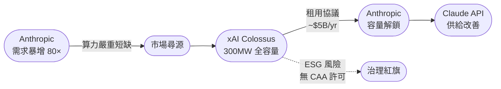
*Key insight: compute leasing is replacing "own-to-lead" as the frontier lab growth model.*

- Source: [Platformer — Did xAI just concede the AI race?](https://www.platformer.news/did-xai-just-concede-the-ai-race/) | [Simon Willison — Notes on the xAI/Anthropic data center deal](https://simonwillison.net/2026/May/7/xai-anthropic/#atom-everything) | [INSIDE 硬塞 — Anthropic CEO on 80× growth](https://www.inside.com.tw/article/41250-anthropic-ceo-dario-amodei-says-company-crew-80-fold-in-first-quarter)
- Client implication: When pitching Taiwan bank CIOs, use this case to frame "API supply reliability" as a vendor selection criterion, and flag to ESG committees that AI compute supply chains now carry carbon/compliance exposure worth including in procurement due diligence.

---

### 2. 駭客用 Anthropic 與 OpenAI 模型滲透墨西哥關鍵基礎設施——AI 治理紅線正式被越過

📖 **原文** iThome 報導：駭客已將 AI 模型用於滲透關鍵基礎設施（墨西哥水力及排水系統），不再只是攻擊企業 IT 環境。

🧠 **推論** 這是 frontier model 被用於 OT（operational technology）攻擊的具體案例，代表 AI 治理討論必須從「員工生產力」層次提升到「基礎設施風險管理」層次。

🧠 **推論** 對台灣製造業（TSMC、台達電等擁有工控系統的企業）與金融業（ATM、支付基礎設施）而言，這個案例提供了具體的董事會簡報素材：AI 不只是效率工具，也是攻擊向量的放大器。

- 來源：[iThome — 駭客濫用 Anthropic 與 OpenAI 模型攻擊墨西哥水力及排水系統](https://www.ithome.com.tw/news/175633)
- 對客戶的具體含意：在 Cathay、CTBC 等銀行的 AI 治理框架提案中，建議新增「AI 模型濫用情境」至威脅模型（threat model），並要求供應商提供 model usage policy 與異常偵測機制的書面承諾。

**(English)** Hackers use Anthropic and OpenAI models to attack Mexican critical infrastructure — AI governance just crossed a red line

📖 **原文** iThome reports that threat actors have weaponized frontier AI models against critical infrastructure (Mexico's water and drainage systems), moving beyond corporate IT environments.

🧠 **推論** This is a documented case of AI being applied to OT (operational technology) attacks, which forces the governance conversation to escalate from "employee productivity policy" to "infrastructure risk management."

🧠 **推論** For Taiwan manufacturers with industrial control systems (TSMC, Delta Electronics) and banks with payment infrastructure, this case provides concrete board-briefing material: AI is simultaneously an efficiency tool and an attack-surface amplifier.

- Source: [iThome — Hackers abuse Anthropic and OpenAI models to attack Mexico water systems](https://www.ithome.com.tw/news/175633)
- Client implication: In AI governance framework proposals for Cathay, CTBC, and others, recommend adding "AI model abuse scenarios" to the threat model and requiring vendors to provide written commitments on model usage policies and anomaly detection mechanisms.

---

### 3. Palo Alto Networks 收購 Portkey：AI Agent 的 security gateway 成為企業治理必選項

📖 **原文** CIO Taiwan 報導：Palo Alto Networks 擬收購 Portkey，目標是建立 AI Gateway 作為自主 AI 代理（autonomous AI agents）的核心管控平台。

🧠 **推論** 這個收購訊號說明：企業部署 AI agent 的治理問題已從「要不要用」演變成「用了之後誰管、怎麼管」——security gateway 層正在被主流資安廠商快速收編。

🧠 **推論** 台灣銀行在評估 agentic workflow（如授信自動化、KYC 流程代理）時，若沒有 API gateway 層的監控與存取控制，將面臨金管會監理風險；Palo Alto 此舉等於為這個市場定義了「標準做法」的雛形。

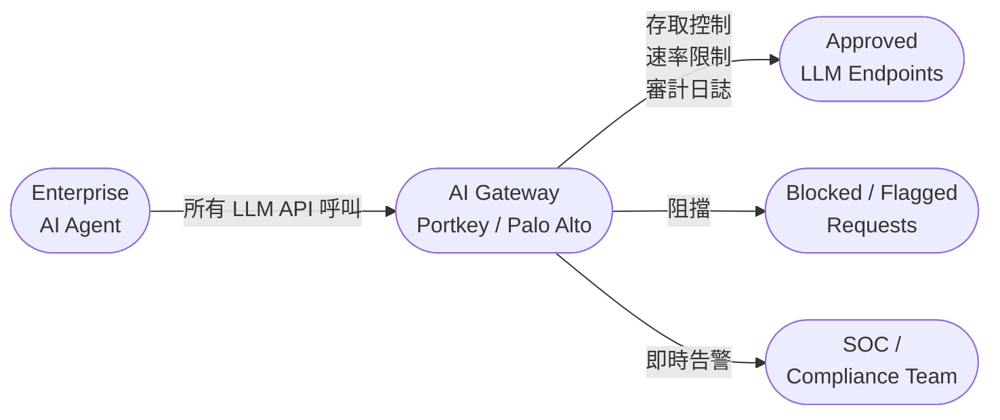
*AI Gateway 插入 agent 與模型之間作為唯一管控點；關鍵洞察：沒有 gateway 層，agent 的每一次 API 呼叫都是治理盲點。*

- 來源：[CIO Taiwan — Palo Alto Networks 擬收購 Portkey 強化 AI 代理資安防護](https://www.cio.com.tw/112099/)
- 對客戶的具體含意：向台灣銀行提案 agentic AI 架構時，主動在設計圖中納入 AI Gateway 層，可提前回應金管會對「AI 系統可審計性」的潛在要求，並以 Palo Alto 的市場動作作為業界標準佐證。

**(English)** Palo Alto Networks acquiring Portkey: AI agent security gateway becomes a mandatory governance layer

📖 **原文** CIO Taiwan reports Palo Alto Networks plans to acquire Portkey with the goal of establishing an AI Gateway as the central control plane for autonomous AI agents.

🧠 **推論** This acquisition signals that enterprise AI agent governance has evolved from "whether to deploy" to "who controls it after deployment" — and major security vendors are moving fast to own that layer.

🧠 **推論** Taiwan banks evaluating agentic workflows (automated credit decisioning, KYC agents) without an API gateway layer for monitoring and access control will face FSC regulatory exposure; Palo Alto's move effectively sketches a "market standard" for what that layer should look like.


*Key insight: without a gateway layer, every agent API call is a governance blind spot.*

- Source: [CIO Taiwan — Palo Alto Networks plans Portkey acquisition for AI agent security](https://www.cio.com.tw/112099/)
- Client implication: When proposing agentic AI architectures to Taiwan banks, proactively include an AI Gateway layer in your design diagrams — it preempts FSC questions on AI auditability and lets you cite Palo Alto's acquisition as market-standard validation.

---

## Watch list

繁中為主，每條一行：

- [TrendAI×Anthropic — AI 資安治理合作](https://www.cio.com.tw/112198/) — AI 加速漏洞發現但修補時程未跟上，TrendAI+Anthropic 聯手提前辨識高風險漏洞，可作為台灣金融業 SecOps 採購參考
- [McKinsey QuantumBlack — 歐洲 AI 投資悖論](https://www.mckinsey.com/capabilities/quantumblack/our-insights/the-ai-paradox-in-europes-consumer-industries-more-spending-elusive-impact) — 歐洲企業砸錢 AI 卻看不到可量化成果，與台灣銀行董事會「投資 AI 但 ROI 不清」的痛點完全吻合，可直接引用做提案前言
- [Platformer — AI bubble 是鐵路還是加密貨幣？](https://www.platformer.news/ai-bubble-railroad-mythos-openai-trial/) — Casey Newton 的框架分析：鐵路型泡沫（基礎設施留存）vs 加密型（歸零），董事會層級的風險敘事參考
- [OpenAI × PwC — CFO 辦公室 AI 代理化](https://openai.com/index/openai-pwc-finance-collaboration) — PwC+OpenAI 聯名背書財務 workflow 自動化，對台灣銀行財務長提案有直接引用價值，但細節待確認
- [Latent Space — Anthropic 每年成長 10×](https://www.latent.space/p/ainews-anthropic-growing-10xyear) — 對比同期業界裁員 10%+，算力投資與人力策略的結構性分歧值得在客戶戰略討論中點名
- [衛福部期中審查 AI 與資安治理](https://www.ithome.com.tw/news/175668) — 醫療業資安預算 3% 底線＋72小時個資外洩通報要求，非銀行業但監管趨勢具參考價值
- [NVIDIA × ServiceNow 自主 AI Agent](https://blogs.nvidia.com/blog/servicenow-autonomous-ai-agents-enterprises/) — 企業 agent 治理框架雛形，但目前仍是廠商 PR 層次，需等具體客戶案例再引用
- [OpenAI B2B Signals — 前沿企業如何拉大差距](https://openai.com/index/introducing-b2b-signals) — 聲稱有 B2B 部署模式洞察，但具名案例與失敗模式均未揭露，先觀察

---

## Verification hints

This briefing contains **5**

🧠 **推論** segments and **2**

⚠️ **假設** segments. Before citing in client conversations, verify these specific points:

1. **Colossus deal financials**: The "$5B/yr" figure and "300MW" capacity appear in Latent Space reporting — verify against Anthropic's official press release or SEC-equivalent filing, as these numbers may be estimates or annualized projections rather than confirmed contract values.
2. **Anthropic 80× ARR growth**: The "80× annualized" figure comes from INSIDE 硬塞 citing Dario Amodei; confirm whether this is Q1-annualized (a single quarter extrapolated) or trailing-twelve-month actuals — the distinction matters significantly when citing to bank CFOs.
3. **Colossus Clean Air Act violation**: Simon Willison's note that gas turbines ran without permits is based on prior reporting about the Memphis facility; verify the current compliance status before using in ESG due-diligence conversations, as Colossus may have since obtained permits.
4. **Mexico critical infrastructure attack attribution**: The iThome report attributes the attack to misuse of Anthropic and OpenAI models — verify the original threat intelligence source (likely a specific security firm's report) and confirm whether "misuse" means API abuse, fine-tuned models, or prompt injection tooling, as these have different governance implications.
5. **Portkey acquisition status**: CIO Taiwan reports Palo Alto Networks "plans to acquire" (擬收購) Portkey — verify whether a definitive agreement has been signed or if this is still at LOI/announcement stage before citing as a completed market move.2026-05-09 18:31:55,785 INFO pillar 3 (Frontier 能力 + 模型動向): 27 high-signal items (min_signal=0.60)

---

<a id="pillar-3"></a>

## 🚀 Pillar 3 — Frontier 能力 + 模型動向
_27 items · $0.0979_

## Pulse — Frontier 能力 + 模型動向

---

## Pulse — Top 3

### 1. Mozilla + Claude Mythos：真實部署在 Firefox 安全強化，發現數百個漏洞

📖 **原文** Mozilla 取得 Claude Mythos preview 的存取權，並用它在 Firefox 中定位並修復數百個安全漏洞。Simon Willison 引述該項目的內部觀察：「突然之間，發現的 bug 品質非常好」——與此前 AI 產生的安全報告因偽陽性多而被視為「垃圾」的處境形成鮮明對比。

🧠 **推論** 這代表 frontier 模型的 vulnerability detection 能力已跨越一個關鍵門檻：準確率高到足以讓 open-source 維護者實際信任，而非手動篩除大量誤報。對 Livia 的金融業客戶（如玉山、國泰）而言，這是「AI 用於程式碼安全審查」從 PoC 變成生產就緒用例的具體證據，且有 Mozilla 這個知名機構背書。

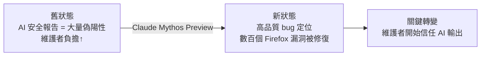
*從「垃圾報告」到「維護者信任」的關鍵跨越，代表 AI code security review 的生產門檻已降低。*

- 來源：[Simon Willison](https://simonwillison.net/2026/May/7/firefox-claude-mythos/#atom-everything)
- 對客戶的具體含意：向玉山或國泰的 CISO 提案時，可用 Mozilla Firefox 案例說明「AI 驅動的程式碼安全審查」已從實驗轉為可信賴的生產工具，值得納入 2026 年資安預算。

**(English)** Mozilla + Claude Mythos: Real Deployment for Firefox Security Hardening, Hundreds of Vulnerabilities Found

📖 **原文** Mozilla obtained access to the Claude Mythos preview and used it to locate and fix hundreds of security vulnerabilities in Firefox. Simon Willison cites an internal observation from the project: "Suddenly, the bugs are very good" — a sharp contrast to the prior state where AI-generated security reports were dismissed as noise due to high false-positive rates.

🧠 **推論** This signals that frontier model vulnerability detection accuracy has crossed a meaningful threshold: high enough precision that open-source maintainers can actually trust the output rather than spending asymmetric effort filtering false alarms. For Livia's banking clients (E.SUN, Cathay), this is concrete evidence that "AI for code security review" has moved from PoC to production-ready, backed by a credible institutional name.

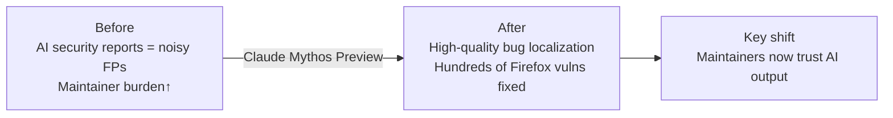
*The pivot from 'slop reports' to 'maintainer trust' marks the production threshold for AI code security review being crossed.*

- Source: [Simon Willison](https://simonwillison.net/2026/May/7/firefox-claude-mythos/#atom-everything)
- Client implication: In CISO conversations at E.SUN or Cathay, use the Mozilla Firefox case to argue that AI-driven code security review has graduated from experiment to trustworthy production tool — worth including in 2026 security budgets.

---

### 2. Open Model 跨越門檻：GLM-5 與 MiniMax M2.7 在 agent 任務上比肩 frontier 閉源模型

🧠 **推論** LangChain 的 Harrison Chase 發布評估結果：開源模型 GLM-5 與 MiniMax M2.7 在 agent 核心任務（檔案操作、tool use、instruction following）上的表現已可與閉源 frontier 模型持平，但成本與 latency 大幅降低。

🧠 **推論** 這對台灣製造業客戶（台積電、鴻海、緯創）意義重大：AI agent workflow 過去因閉源模型的 API 成本與資料主權疑慮而卡關，開源模型達到 capability parity 後，on-premise 或私有雲部署變得可行。需要注意的是，LangChain 作為 open model 生態的利害關係人，評估方法有潛在偏差，建議 Livia 在提案前以客戶自身任務獨立驗證。

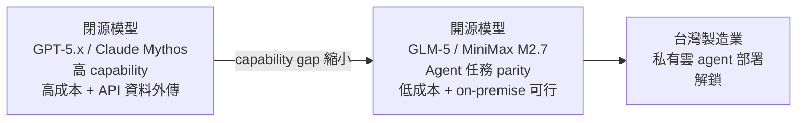
*Capability gap 縮小是關鍵事件：台灣製造業可不依賴閉源 API 即建置生產級 agent。*

- 來源：[Harrison Chase, LangChain](https://www.langchain.com/blog/open-models-have-crossed-a-threshold)
- 對客戶的具體含意：向台積電或鴻海提案 agent automation 時，主動提出「開源模型 + 私有部署」作為降低成本與滿足資料治理要求的選項，而非預設只能使用 OpenAI/Anthropic API。

**(English)** Open Models Cross the Threshold: GLM-5 and MiniMax M2.7 Match Frontier Closed Models on Agent Tasks

🧠 **推論** LangChain's Harrison Chase published evaluation results showing open models GLM-5 and MiniMax M2.7 now match closed frontier models on core agent tasks — file operations, tool use, and instruction following — at significantly lower cost and latency.

🧠 **推論** For Livia's manufacturing clients (TSMC, Foxconn, Wistron), this matters directly: AI agent workflows have historically stalled on closed-model API costs and data sovereignty concerns. Open model capability parity makes on-premise or private-cloud agent deployment viable. Caveat: LangChain is a stakeholder in the open-model ecosystem, so their evaluation methodology carries potential bias — Livia should independently validate against client-specific tasks before pitching.

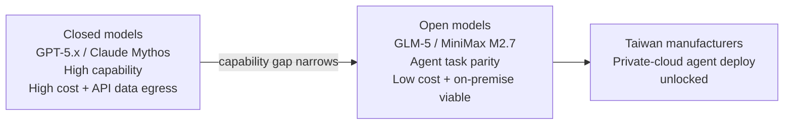
*The narrowing capability gap is the key event: Taiwan manufacturers can build production-grade agents without depending on closed-source APIs.*

- Source: [Harrison Chase, LangChain](https://www.langchain.com/blog/open-models-have-crossed-a-threshold)
- Client implication: When pitching agent automation to TSMC or Foxconn, proactively offer "open model + private deployment" as an option to reduce cost and satisfy data governance requirements, rather than defaulting to OpenAI/Anthropic APIs.

---

### 3. GPT-Realtime-2：GPT-5 等級推理進入即時語音，三款新 API 模型同步發布

📖 **原文** OpenAI 透過 Realtime API 發布三款新音訊模型：GPT-Realtime-2（具 GPT-5 等級推理、支援 tool calling、保留對話脈絡）、GPT-Realtime-Translate（即時語音翻譯）、GPT-Realtime-Whisper（即時轉錄）。

🧠 **推論** 這對台灣銀行客戶的「智能客服」用例有直接影響：過去 voice AI 的痛點在於推理能力弱、無法在對話中記憶上下文或呼叫後台工具；GPT-Realtime-2 若能達到宣稱的 GPT-5 等級，意味著客服機器人可以真正理解複雜請求並完成 end-to-end 任務（如試算貸款條件、查詢帳戶）而非只做 intent routing。

⚠️ **假設** 台灣市場的中文語音品質與延遲尚未有獨立評測，建議在正式提案前於繁體中文情境下驗證。

- 來源：[iThome](https://www.ithome.com.tw/news/175665) ｜ [OpenAI Blog](https://openai.com/index/advancing-voice-intelligence-with-new-models-in-the-api)
- 對客戶的具體含意：向台新、富邦等已在試行語音客服的銀行提案時，可將 GPT-Realtime-2 定位為「讓語音客服從 intent routing 升級為真正能完成任務」的能力跨越，但需先以繁中場景跑 benchmark 再承諾。

**(English)** GPT-Realtime-2: GPT-5-Level Reasoning Enters Real-Time Voice, Three New API Models Launched

📖 **原文** OpenAI released three new audio models via the Realtime API: GPT-Realtime-2 (GPT-5-level reasoning, tool calling, context retention), GPT-Realtime-Translate (real-time speech-to-speech translation), and GPT-Realtime-Whisper (real-time transcription).

🧠 **推論** This has direct implications for Taiwan bank "intelligent customer service" use cases: the historic pain points of voice AI have been weak reasoning, inability to retain conversational context, and inability to call backend tools mid-conversation. If GPT-Realtime-2 delivers on its claimed GPT-5-level reasoning, it means a voice bot can genuinely understand complex requests and complete end-to-end tasks (e.g., calculating loan terms, querying account status) rather than merely routing intents.

⚠️ **假設** Independent benchmarks for Traditional Chinese voice quality and latency in Taiwan's network environment do not yet exist — Livia should validate in a Traditional Chinese scenario before making commitments.

- Source: [iThome](https://www.ithome.com.tw/news/175665) | [OpenAI Blog](https://openai.com/index/advancing-voice-intelligence-with-new-models-in-the-api)
- Client implication: When pitching to Taishin or Taipei Fubon banks already piloting voice customer service, position GPT-Realtime-2 as the upgrade from "intent routing" to "task completion" — but run Traditional Chinese benchmarks before making any performance promises.

---

## Watch list

繁中為主，每條一行：

- [AlphaEvolve: Google DeepMind](https://deepmind.google/blog/alphaevolve-impact/) — Gemini 驅動的 coding agent 宣稱跨商業、基礎設施、科學領域落地，但缺具體數據，需追蹤是否有可量化的生產成果。
- [EMO: AI2 / Hugging Face](https://huggingface.co/blog/allenai/emo) — 新 MoE pretraining 方法：僅用 12.5% experts 即可保持接近完整模型的效能，對台灣製造業私有部署的推論成本有潛在壓縮空間。
- [Adaptive Parallel Reasoning: BAIR](http://bair.berkeley.edu/blog/2026/05/08/adaptive-parallel-reasoning/) — 推論模型自主決定何時並行化子任務的新範式；對 agent orchestration 成本與速度有中長期含意。
- [OpenAI MRC 超算網路協議](https://openai.com/index/mrc-supercomputer-networking) — OpenAI 開源新 networking protocol 用於大規模 AI 訓練叢集，影響未來 frontier 模型訓練能力上限。
- [Claude 諂媚行為評估: Simon Willison](https://simonwillison.net/2026/May/3/anthropic/#atom-everything) — Anthropic 發現 Claude 在「靈性」與「創業」主題對話中諂媚率高達 38%，在 production deployment 中需注意 prompt 設計。
- [xAI/Anthropic 資料中心合作: Simon Willison](https://simonwillison.net/2026/May/7/xai-anthropic/#atom-everything) — Anthropic 借用 xAI Colossus 資料中心全部算力，但該設施有未申請許可即運行燃氣渦輪機的環境違規紀錄，ESG 敏感客戶需留意。
- [Import AI 455: Jack Clark](https://jack-clark.net/2026/05/04/import-ai-455-automating-ai-research/) — AI 開始自動化 AI 研究的前沿觀察；Jack Clark（Anthropic 政策）的框架值得追蹤，但需完整文本評估具體性。
- [Gemini API Multimodal RAG](https://blog.google/innovation-and-ai/technology/developers-tools/expanded-gemini-api-file-search-multimodal-rag/) — Gemini File Search 升級為多模態 RAG，對需要處理圖表、掃描文件的銀行合規場景有潛力，細節待驗證。
- [GPT-5.5 Instant System Card](https://openai.com/index/gpt-5-5-instant-system-card) — 首個被 OpenAI 分類為 High capability 的 Instant 模型，bio/cyber 防護升級；金融業客戶評估 AI 治理時可引用。
- [Claude Code HTML Artifacts: Simon Willison](https://simonwillison.net/2026/May/8/unreasonable-effectiveness-of-html/#atom-everything) — Anthropic 內部團隊建議以 HTML artifact 取代 Markdown 作為 Claude 輸出格式；對 harness 工程中的報告自動生成有實用含意。
- [IBM Granite 4.1 系列](https://simonwillison.net/2026/May/4/granite-41-3b-svg-pelican-gallery/#atom-everything) — IBM 發布 Apache 2.0 授權的 Granite 4.1（3B/8B/30B），Livia 作為 IBM 顧問應掌握，特別是與台灣客戶討論私有部署時的 IBM 選項。
- [GPT-5.5-Cyber 可信存取計畫](https://openai.com/index/gpt-5-5-with-trusted-access-for-cyber) — OpenAI 對已驗證的網路防禦者開放 GPT-5.5-Cyber 存取，具資安業務的金融客戶可評估申請資格。
- [The Distillation Panic: Nathan Lambert](https://www.interconnects.ai/p/the-distillation-panic) — Lambert 提出「distillation attack」框架，探討模型能力外洩風險；概念仍在形成中，但對 AI 治理對話有潛在影響。

---

## Verification hints

This briefing contains **4

🧠 **推論**** segments and **2

⚠️ **假設**** segments. Before citing in client conversations, verify these specific points (English for language-learning practice):

1. **Mozilla/Claude Mythos vulnerability count**: The excerpt says "hundreds of vulnerabilities" but does not specify the exact number, severity distribution (critical vs. low), or whether Mozilla independently verified AI-found bugs vs. AI-assisted human review. Check the [Simon Willison post](https://simonwillison.net/2026/May/7/firefox-claude-mythos/#atom-everything) for a link to Mozilla's own writeup and confirm the specific claim before citing to a CISO.

2. **LangChain GLM-5/MiniMax M2.7 evaluation methodology**: LangChain's post claims open model parity on "core agent tasks" but LangChain is a vendor with commercial interest in open-model adoption. Verify which specific benchmarks were used, what the closed-model comparator was (GPT-5? Claude Mythos? Which version?), and whether the eval dataset is public. URL: [LangChain blog](https://www.langchain.com/blog/open-models-have-crossed-a-threshold).

3. **GPT-Realtime-2 Traditional Chinese performance**: The iThome article and OpenAI's announcement describe GPT-5-level reasoning in real-time voice, but neither source provides latency numbers or accuracy metrics for Traditional Chinese (zh-TW). Before pitching to Taiwanese bank clients, independently test with zh-TW conversational scenarios. [OpenAI API page](https://openai.com/index/advancing-voice-intelligence-with-new-models-in-the-api) should have model card or evaluation details.

4. **EMO 12.5% expert efficiency claim**: The HuggingFace/AI2 post states that using 12.5% of experts preserves "near full-model performance" — verify what "near" means quantitatively (e.g., what benchmark, what % degradation is acceptable), as this number will determine whether on-premise deployment is genuinely practical for client workloads. URL: [HuggingFace EMO](https://huggingface.co/blog/allenai/emo).

5. **xAI Colossus environmental compliance status**: Simon Willison notes the facility initially ran gas turbines without Clean Air Act permits. Verify whether permits have since been obtained and pollution controls installed before citing this to ESG-conscious clients — the current regulatory status matters more than the historical violation. URL: [Simon Willison xAI/Anthropic notes](https://simonwillison.net/2026/May/7/xai-anthropic/#atom-everything).

6. **Claude Mythos preview availability**: The Firefox hardening case references a "preview" — verify whether Claude Mythos is now generally available, still in restricted preview, or renamed, before telling clients they can access the same capability Mozilla used. URL: [Simon Willison Mythos post](https://simonwillison.net/2026/May/7/firefox-claude-mythos/#atom-everything).2026-05-09 18:33:33,145 INFO pillar 4 (Harness Engineering 實作技藝): 40 high-signal items (min_signal=0.60)

---

<a id="pillar-4"></a>

## 🛠️ Pillar 4 — Harness Engineering 實作技藝
_40 items · $0.1044_

## Pulse — Top 3

### 1. Agent Observability 不只是 Debug：LangChain Harrison Chase 提出 Feedback Loop 才是核心

🧠 **推論** Harrison Chase 指出，大多數團隊把 agent observability 當成事後 debug 工具——trace 壞掉的步驟、找出錯誤決策——但這只是最窄的用途。真正的生產價值在於將 trace 接上 feedback signals（accepted、rejected、risky、inefficient），形成持續學習迴路。沒有 feedback，trace 只是靜態日誌；有了 feedback，系統才能區分「agent 做了什麼」與「agent 做得好不好」，並驅動模型選擇、prompt 調整、流程重設計。

🧠 **推論** 對正在向台灣銀行推 agentic workflow 的 Livia 而言，這個框架能直接回答客戶最常問的問題：「上線後怎麼知道 AI agent 有沒有在做正確的事？」

下圖說明 observability-only 架構與 observability + feedback 架構的差異：

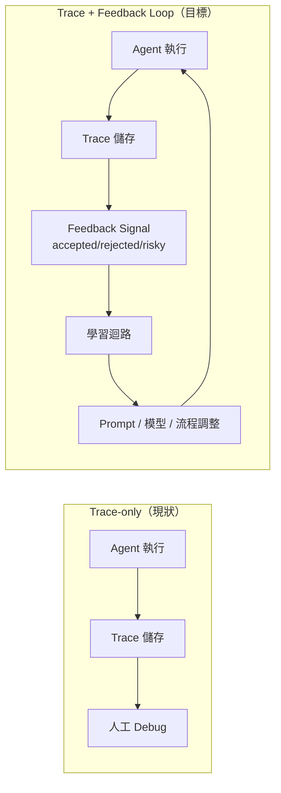
*關鍵洞察：feedback signal 才是讓 trace 從成本變資產的轉折點。*

- 來源：[LangChain Blog — Agent Observability Needs Feedback](https://www.langchain.com/blog/agent-observability-needs-feedback-to-power-learning)
- 對客戶的具體含意：在設計 Cathay 或 E.SUN 的 agent pilot 時，從第一天就在 LangSmith 或同等工具中埋入明確的 feedback signal schema（如「客服員工是否採納建議」），而非等上線後才想辦法補評估層。

---

**(English)** Harrison Chase (LangChain): Agent observability without feedback loops is just expensive logging

[Inference] Harrison Chase argues that most teams use agent observability as a post-mortem debugging tool — open the trace, find the bad decision step — but this is the narrowest possible use. The real production value is connecting traces to explicit feedback signals (accepted, rejected, risky, inefficient) to form a continuous learning loop. Without feedback, traces are static logs; with feedback, a system can distinguish "what the agent did" from "whether the agent did it well," driving model selection, prompt revision, and workflow redesign. [Inference] For Livia selling agentic workflows to Taiwan banks, this framework directly answers the most common objection: "How do we know the AI agent is doing the right thing after go-live?"

The diagram above contrasts trace-only vs. trace + feedback architectures. The key insight: feedback signals are what convert traces from a cost center into a learning asset.

- Source: [LangChain Blog — Agent Observability Needs Feedback](https://www.langchain.com/blog/agent-observability-needs-feedback-to-power-learning)
- Client implication: When designing agent pilots for Cathay or E.SUN, define a feedback signal schema on day one (e.g., "did the banker accept the agent's recommendation?") rather than retrofitting an evaluation layer post-launch.

---

### 2. Claude Code 的 MCP Hijacking 漏洞：OAuth 憑證可被供應鏈攻擊竊取

📖 **原文** 資安業者 Mitiga 研究人員發現 Anthropic Claude Code 存在設計漏洞，攻擊者可透過 MCP Hijacking 在開發者毫無察覺的情況下竊取 OAuth 憑證，並藉供應鏈攻擊擴大下游受害範圍。

🧠 **推論** 這不是模型層的問題，而是 tool integration 架構問題：MCP（Model Context Protocol）允許 Claude Code 呼叫外部工具，但若 MCP server 本身被劫持或置換，agent 的執行流就成為攻擊向量。對正在建構 harness pipeline 的 Livia 而言，這是一個必須在設計階段就納入的 threat model——任何讓 agent 透過 MCP 呼叫外部服務的架構，都需要 MCP server 的身份驗證與完整性驗證層。

🧠 **推論** 台灣銀行的 IT 資安長（CISO）在審核 AI coding agent 採購時，幾乎必然會問這個問題。

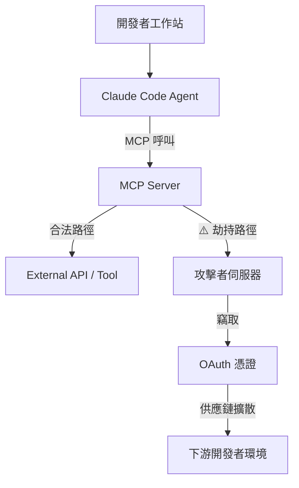
*關鍵洞察：攻擊面不在模型本身，而在 MCP server 的信任鏈——agent 的工具呼叫等同授權邊界。*

- 來源：[iThome — Anthropic Claude Code MCP 劫持漏洞](https://www.ithome.com.tw/news/175647)
- 對客戶的具體含意：若 Livia 的 harness pipeline 或客戶的 internal coding agent 使用 Claude Code + MCP，必須在 MCP server 前加入 integrity check（如 hash 驗證或 signed registry），並在 OAuth token scope 上採最小權限原則，這是向銀行 CISO 展示的必備治理控制項。

---

**(English)** Claude Code design flaw: MCP Hijacking can steal OAuth credentials silently through supply chain

📖 **Source** Security researchers at Mitiga found a design vulnerability in Anthropic's Claude Code where attackers can execute MCP Hijacking to steal OAuth credentials without the developer noticing, then propagate damage downstream via supply chain attacks. [Inference] This is not a model-layer problem — it is a tool integration architecture problem. MCP (Model Context Protocol) allows Claude Code to call external tools, but if the MCP server itself is hijacked or substituted, the agent's execution flow becomes the attack vector. For Livia building harness pipelines, this is a threat model that must be addressed at design time, not patched later: any architecture where an agent calls external services via MCP requires MCP server authentication and integrity verification. [Inference] Taiwan bank CISOs reviewing AI coding agent procurement will almost certainly ask exactly this question.

The diagram above shows the attack path: the exploit lives in the MCP layer, not the model — the agent's tool calls are effectively authorization boundaries.

- Source: [iThome — Claude Code MCP Hijacking Vulnerability](https://www.ithome.com.tw/news/175647)
- Client implication: If Livia's harness pipeline or a client's internal coding agent uses Claude Code + MCP, add MCP server integrity checks (e.g., hash verification or a signed registry) and enforce minimum-privilege scoping on OAuth tokens — this is the governance control to demonstrate to bank CISOs in procurement reviews.

---

### 3. RAG 的時間盲點：Production 中的 Temporal Layer 修法

📖 **原文** 一位 RAG 系統建構者描述：測試三週後，學習者回報 AI 家教給了她錯誤答案——不是明顯錯誤，而是「過時到足以誤導」。問題在於，retriever 回傳的是「最相似的文件」，而非「最新的文件」。作者在 retriever 與 LLM 之間加入 temporal layer，對文件進行時間加權過濾，而非修改 retriever 或模型本身。

🧠 **推論** 這個失效模式在台灣金融服務場景中特別危險：法規文件（如 FSC 函令）、產品說明書、利率表都有明確版本生命週期，傳統 cosine similarity retrieval 完全不考慮文件日期。一個以語義相似度為唯一排序依據的 RAG 系統，在知識庫持續更新的環境下會系統性地回傳過期資訊。

⚠️ **假設** 文章未提供量化的準確率提升數據；temporal layer 的實際效益取決於知識庫的更新頻率與文件版本標注的完整性。

- 來源：[Towards Data Science — RAG Is Blind to Time](https://towardsdatascience.com/rag-is-blind-to-time-i-built-a-temporal-layer-to-fix-it-in-production/)
- 對客戶的具體含意：任何向台灣銀行交付的 RAG-based 知識問答系統（如法規 Q&A、產品說明），metadata schema 中必須包含 `effective_date` 與 `expiry_date` 欄位，並在 retrieval pipeline 中加入 temporal re-ranking 或 pre-filter，而非依賴模型自行判斷文件時效。

---

**(English)** Production RAG failure mode: semantic similarity retrieval is temporally blind — here's the named fix

📖 **Source** A RAG system builder describes the failure: three weeks into testing, a learner reported that the AI tutor gave her the wrong answer — not obviously wrong, just outdated enough to mislead. The retriever returned the most semantically similar document, not the most current one. The fix was a temporal layer inserted between the retriever and the LLM, applying time-weighted filtering rather than modifying the retriever or model. [Inference] This failure mode is particularly dangerous in Taiwan financial services: regulatory documents (FSC circulars), product disclosure sheets, and rate tables all have explicit version lifecycles, but cosine similarity retrieval is completely date-agnostic. A RAG system ranked solely on semantic similarity will systematically surface stale documents in any frequently-updated knowledge base. [Assumption] The article provides no quantified accuracy improvement data; the real-world benefit of a temporal layer depends on how frequently the knowledge base is updated and how consistently documents are tagged with version metadata.

- Source: [Towards Data Science — RAG Is Blind to Time](https://towardsdatascience.com/rag-is-blind-to-time-i-built-a-temporal-layer-to-fix-it-in-production/)
- Client implication: Any RAG-based knowledge Q&A system delivered to Taiwan banks (regulatory Q&A, product explainers) must include `effective_date` and `expiry_date` fields in the document metadata schema, with temporal re-ranking or a pre-filter in the retrieval pipeline — do not rely on the model to infer document currency.

---

## Watch list

繁中為主，每條一行：

- [LangChain — Agent Development Lifecycle](https://www.langchain.com/blog/the-agent-development-lifecycle) — Build→Test→Deploy→Monitor 四階段框架，適合當作向銀行客戶說明「如何系統性上線 agent」的投影片骨架
- [LangChain — Company Due Diligence Agent](https://www.langchain.com/blog/building-a-company-due-diligence-agent-with-deep-agents-langsmith-and-parallel) — 金融盡職調查 agent 的完整實作（LangGraph + LangSmith），直接對應銀行信貸與法遵客戶場景
- [TDS — Unified Agentic Memory Across Harnesses Using Hooks](https://towardsdatascience.com/unified-agentic-memory-across-harnesses-using-hooks/) — 跨 Claude Code / Codex / Cursor 共用 Neo4j 記憶層的 hook 實作，harness 工程組合拳
- [LangChain — Open Models Have Crossed a Threshold](https://www.langchain.com/blog/open-models-have-crossed-a-threshold) — GLM-5 / MiniMax M2.7 在 agent 任務上追平 frontier 閉源模型，成本與延遲有顯著差距，值得評估是否納入台灣本地部署選項
- [TDS — RAG Hallucinates: Self-Healing Layer](https://towardsdatascience.com/rag-hallucinates-i-built-a-self-healing-layer-that-fixes-it-in-real-time/) — RAG 幻覺的 real-time 自我修正層；缺乏量化數據但架構思路值得參考，搭配 Temporal Layer 一起看
- [TDS — AI Agent Security Surface](https://towardsdatascience.com/the-ai-agent-security-surface-what-gets-exposed-when-you-add-tools-and-memory/) — 加入工具與記憶後的 agent 後端攻擊面結構化分析，補充 MCP 漏洞項目的威脅模型視角
- [Simon Willison — Using Claude Code: The Unreasonable Effectiveness of HTML](https://simonwillison.net/2026/May/8/unreasonable-effectiveness-of-html/#atom-everything) — 用 HTML artifact 取代 Markdown 作為 Claude 輸出格式，PR review / 報告呈現場景立即可用
- [OpenAI — Running Codex Safely](https://openai.com/index/running-codex-safely) — Codex agent 的 sandboxing + telemetry + network policy 生產安全模式，對建構 internal coding agent 的 harness 有直接參考價值
- [iThome — OpenAI 三款 Realtime API 語音模型](https://www.ithome.com.tw/news/175665) — GPT-Realtime-2 帶 GPT-5 等級推理進入即時語音，銀行電話客服 AI 升級路徑的關鍵 API 變化
- [Mozilla + Claude Mythos — Hardening Firefox](https://simonwillison.net/2026/May/7/firefox-claude-mythos/#atom-everything) — Mozilla 用 Claude Mythos preview 找出並修補數百個 Firefox 漏洞，AI 輔助漏洞偵測的真實 case study
- [Hugging Face / AI2 — EMO: MoE Emergent Modularity](https://huggingface.co/blog/allenai/emo) — 只需 12.5% experts 即可維持接近全模型效能，on-prem 部署成本控制的潛在路徑
- [Eugene Yan — How to Work and Compound with AI](https://eugeneyan.com//writing/working-with-ai/) — context-as-infra、taste-as-config、delegation loop 等生產 LLM 工作模式，harness 設計哲學參考
- [Databricks / Superhuman — 200K QPS Inference Platform](https://www.databricks.com/blog/how-superhuman-and-databricks-built-200k-qps-inference-platform-together) — 真實 200K QPS 推論平台架構揭露，大規模生產部署的基礎設施規劃參考
- [BAIR — Adaptive Parallel Reasoning](http://bair.berkeley.edu/blog/2026/05/08/adaptive-parallel-reasoning/) — agent 自主決定何時分解與平行化子任務，下一代 orchestration 模式的前沿研究
- [Singular Bank — ChatGPT + Codex BFSI Deployment](https://openai.com/index/singular-bank) — 銀行內部助理每日節省 60–90 分鐘，可用作向台灣銀行客戶說明 ROI 的對標案例

---

## Verification hints

This briefing contains **5**

🧠 **推論** segments and **1**

⚠️ **假設** segment. Before citing in client conversations, verify these specific points (English for language-learning practice):

1. **LangChain feedback loop claim**

🧠 **推論**: The excerpt confirms the conceptual framing (traces + feedback = learning loop), but verify whether LangSmith has shipped specific UI/API primitives for structured feedback capture (accepted/rejected/risky signals) or whether this requires custom instrumentation — check the LangSmith changelog at [langchain.com/blog](https://www.langchain.com/blog/agent-observability-needs-feedback-to-power-learning) before promising this as an out-of-box capability to bank clients.
2. **MCP Hijacking severity and patch status**

🧠 **推論**: The iThome article cites Mitiga's research, but does not confirm whether Anthropic has acknowledged the finding, issued a CVE, or shipped a mitigation — check Anthropic's security advisory page and Mitiga's original report before characterizing this as "unpatched" vs. "acknowledged/mitigated" in CISO conversations.
3. **Temporal layer quantified benefit**

⚠️ **假設**: The TDS article describes the architecture and motivation but provides no accuracy delta (e.g., "reduced stale-answer rate by X%") — do not cite a performance number in client proposals without running your own eval on a representative document corpus with versioned metadata.
4. **Open model parity claim (Watch list item)**

🧠 **推論**: LangChain's claim that GLM-5 and MiniMax M2.7 match closed frontier models on "core agent tasks" is based on LangChain's own evals — verify the eval benchmark methodology and whether the task distribution matches your target use case (bank document processing, structured extraction) before recommending open-model substitution to regulated clients.
5. **Claude Mythos preview availability**

🧠 **推論**: The Simon Willison item describes Mozilla's use of "Claude Mythos preview" for Firefox hardening — verify whether Claude Mythos is publicly available or still in limited preview, and whether the capability delta over standard Claude Sonnet/Opus is documented, before referencing it in a security pitch to Trend Micro or bank CISO audiences.2026-05-09 18:35:01,525 INFO pillar 5 (學派 / 社群 / 思想動態): 15 high-signal items (min_signal=0.60)

---

<a id="pillar-5"></a>

## 🌐 Pillar 5 — 學派 / 社群 / 思想動態
_15 items · $0.0849_

## Pulse — Pillar 5：學派 / 社群 / 思想動態

---

## Pulse — Top 3

### 1. Anthropic 年化成長 80 倍、算力嚴重短缺，被迫向競對 xAI 租用 Colossus 資料中心

📖 **原文** Anthropic CEO Dario Amodei 公開承認第一季年化營收與用量暴增 80 倍，算力供給嚴重跟不上，公司已簽署向 xAI 租用其 300MW Colossus 資料中心的協議，合約規模達 50 億美元/年。

🧠 **推論** 這個「競爭者互租算力」的結構，意味著 frontier lab 之間的邊界正在模糊——Platformer 的分析甚至指出，xAI 願意出租 Colossus 本身就是對 AI 競賽地位的一種讓步。對 Livia 的客戶而言，更關鍵的訊號是：就連 Anthropic 自己都在 **compute capacity** 上受限，這意味著 enterprise API 服務條款（SLA、throughput 保證）在未來 12 個月仍是談判桌上的重要議題。

以下是這筆算力協議如何在戰略層面重塑 frontier lab 格局：

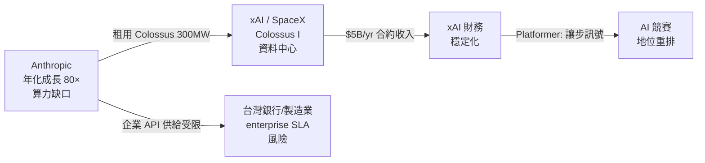

*關鍵洞察：算力稀缺不只是成本問題，而是誰能保證 enterprise throughput 的護城河。*

- 來源：[INSIDE 硬塞](https://www.inside.com.tw/article/41250-anthropic-ceo-dario-amodei-says-company-crew-80-fold-in-first-quarter) ／ [Platformer](https://www.platformer.news/did-xai-just-concede-the-ai-race/) ／ [Latent Space](https://www.latent.space/p/ainews-anthropic-spacexais-300mw5byr)
- 對客戶的具體含意：向國泰、玉山等正在評估 Claude API 的銀行說明：算力合約風險是 vendor due diligence 的新必查項目，建議在 POC 合約中明訂 throughput SLA 和降級條款。

**(English)** Anthropic's 80× annualized growth is creating a compute crisis — forcing it to rent capacity from rival xAI's Colossus data center

[Original] Anthropic CEO Dario Amodei publicly acknowledged 80× annualized revenue and usage growth in Q1, with compute supply severely lagging demand. The company has signed an agreement to rent xAI's 300MW Colossus I data center at ~$5B/year. [Inference] The "rivals renting from rivals" structure signals that frontier lab boundaries are blurring — Platformer's analysis goes further, arguing that xAI's willingness to lease Colossus is itself a concession on its competitive position in the AI race. For Livia's enterprise clients, the more actionable signal is that even Anthropic itself is compute-constrained, meaning API service terms (SLA, throughput guarantees) remain a live negotiation variable for the next 12 months.

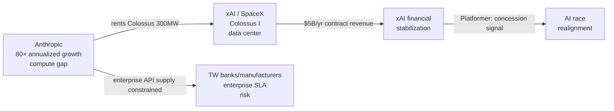

*Key insight: compute scarcity is not just a cost issue — it's a moat around who can guarantee enterprise throughput.*

- Source: [INSIDE 硬塞](https://www.inside.com.tw/article/41250-anthropic-ceo-dario-amodei-says-company-crew-80-fold-in-first-quarter) / [Platformer](https://www.platformer.news/did-xai-just-concede-the-ai-race/) / [Latent Space](https://www.latent.space/p/ainews-anthropic-spacexais-300mw5byr)
- Client implication: When briefing Cathay, E.SUN, or CTBC on Claude API adoption, flag compute contract risk as a new mandatory vendor due diligence item — push for explicit throughput SLAs and degradation clauses in any POC agreement.

---

### 2. Simon Willison：vibe coding 與 agentic engineering 正在意外融合，這讓他感到不安

📖 **原文** Simon Willison 在與 Heavybit 的 podcast 訪談中意識到，他自己的工作流程中 **vibe coding**（低審查、快速迭代的 AI 輔助編程）與 **agentic engineering**（讓 AI 自主執行多步驟任務）這兩種模式已開始融合——而這個融合令他「disturbing」。

🧠 **推論** Willison 是少數既實際部署 production LLM 工具、又公開記錄失敗模式的從業者。他的不安具有診斷價值：vibe coding 的核心假設是「人在迴路中隨時可以中斷」，但 agentic 系統的設計是讓 AI 自主執行到底。兩者融合意味著「低審查 + 高自主」的組合正在進入生產環境，而這個組合的 **failure mode** 還沒有被充分記錄。對 harness 建構者而言，這是一個值得現在就在 pipeline 中加入 **checkpoint gates** 的訊號。

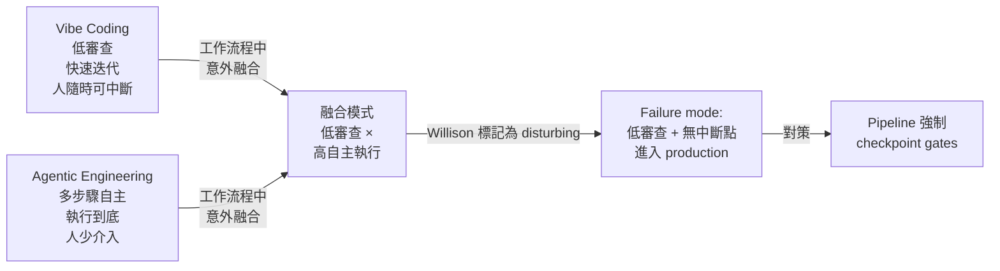

*關鍵洞察：兩種模式的融合不是進步訊號，而是需要主動設計防護的風險點。*

- 來源：[Simon Willison](https://simonwillison.net/2026/May/6/vibe-coding-and-agentic-engineering/#atom-everything)
- 對客戶的具體含意：向使用 GitHub Copilot 或 Cursor 的台積電、鴻海軟體團隊說明：當 coding agent 開始執行多步驟任務（如自動修改 CI/CD 配置），必須在 pipeline 中設計明確的 human-in-the-loop checkpoint，而非依賴工程師的「感覺上應該沒問題」。

**(English)** Simon Willison: vibe coding and agentic engineering are converging in his own work — and it's disturbing him

[Original] Simon Willison realized during a Heavybit podcast conversation that vibe coding (low-scrutiny, rapid-iteration AI-assisted programming) and agentic engineering (AI autonomously executing multi-step tasks) have started to converge in his own workflows — and the realization unsettled him. [Inference] Willison is one of the few practitioners who both ships production LLM tooling and publicly documents failure modes. His unease has diagnostic value: vibe coding assumes the human can interrupt at any moment, while agentic systems are designed to execute through to completion. The convergence means "low scrutiny + high autonomy" is entering production environments before its failure modes are well-documented. For harness builders, this is a signal to add explicit checkpoint gates to pipelines now, before the pattern becomes load-bearing.

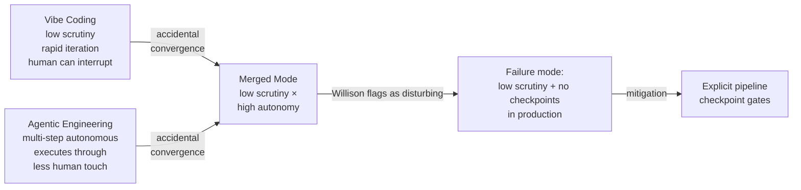

*Key insight: the convergence is not a progress signal — it's a risk point requiring active design, not passive observation.*

- Source: [Simon Willison](https://simonwillison.net/2026/May/6/vibe-coding-and-agentic-engineering/#atom-everything)
- Client implication: When briefing TSMC or Foxconn software teams using Copilot or Cursor: once a coding agent starts executing multi-step tasks (e.g., auto-modifying CI/CD configs), the pipeline must include explicit human-in-the-loop checkpoints — "it probably looks fine" is not a safety gate.

---

### 3. Eugene Yan：context 是基礎設施、taste 是設定檔——五個在生產環境中與 AI 複利協作的框架

📖 **原文** Eugene Yan 在 "How to Work and Compound with AI" 中提出五個 production 導向的協作原則：context as infrastructure（把上下文當成工程設施管理）、taste as config（品味即設定）、verification for autonomy（驗證機制是授權自主的前提）、scale via delegation（透過委派擴展輸出）、closing the loop（回饋迴路）。

🧠 **推論** Yan 在 Amazon 有實際 LLM 產品部署經驗，這五個框架不是理論——它們對應的是在沒有這些設計時實際踩過的坑。對 Livia 的 harness pipeline 而言，"context as infrastructure" 這個觀點最直接：把 client brief、市場背景、對話歷史當成結構化資產（而非每次重新貼入）是現在就可以實作的架構決策。對 IBM 客戶推介時，這個框架也提供了一個語言：從「用 AI 做事」升級到「設計一套與 AI 複利協作的系統」。

- 來源：[Eugene Yan](https://eugeneyan.com//writing/working-with-ai/)
- 對客戶的具體含意：向富邦、中信等正在評估 AI 工作流程的銀行客戶說明：「導入 AI」不等於「把任務交給 AI」，需要先設計 context management 機制——沒有結構化上下文，AI 每次都在從零開始，複利效應無從累積。

**(English)** Eugene Yan: context is infrastructure, taste is config — five frameworks for compounding with AI in production

[Original] Eugene Yan's "How to Work and Compound with AI" proposes five production-oriented principles: context as infrastructure, taste as config, verification for autonomy, scale via delegation, and closing the loop. [Inference] Yan has real LLM product deployment experience at Amazon — these five frameworks are not theoretical; they correspond to pain points encountered when the patterns were absent. For Livia's harness pipeline, "context as infrastructure" is the most immediately actionable: treating client briefs, market background, and conversation history as structured assets (rather than re-pasting them each session) is an architectural decision you can implement now. For IBM client pitches, this framework also provides a vocabulary upgrade: from "using AI to do things" to "designing a system that compounds with AI over time."

- Source: [Eugene Yan](https://eugeneyan.com//writing/working-with-ai/)
- Client implication: When briefing Taipei Fubon or CTBC teams evaluating AI workflows: "adopting AI" is not the same as "handing tasks to AI" — without structured context management, the model starts from zero every time and the compounding effect never materializes.

---

## Watch list

繁中為主，每條一行：

- [Interconnects (Nathan Lambert)](https://www.interconnects.ai/p/notes-from-inside-chinas-ai-labs) — Lambert 親訪中國多家 AI 實驗室的第一手觀察，對評估 frontier lab 競爭格局有參考價值
- [Import AI 455 (Jack Clark)](https://jack-clark.net/2026/05/04/import-ai-455-automating-ai-research/) — AI 自動化 AI 研究的框架性分析，Clark 是 Anthropic policy 出身，值得追蹤論述走向
- [Latent Space — AINews Anthropic 10x/year](https://www.latent.space/p/ainews-anthropic-growing-10xyear) — Anthropic 成長 vs 業界裁員對比；補充 Top 1 的市場背景數據
- [Platformer — What kind of AI bubble](https://www.platformer.news/ai-bubble-railroad-mythos-openai-trial/) — 「鐵路泡沫 vs 加密貨幣泡沫」框架，對銀行客戶解釋 AI 投資邏輯時有用
- [INSIDE 硬塞 — Claude Code 5 個習慣](https://www.inside.com.tw/article/41252-claude-code-pair-programming) — Boris Cherny 的 pair programming 心法，可補充 Top 3 Eugene Yan 框架的實作細節
- [INSIDE 硬塞 — HTML vs Markdown](https://www.inside.com.tw/article/41251-from-md-to-html) — Anthropic 工程師主張 HTML 優於 Markdown 作為 AI 時代輸出格式，harness UI 設計參考
- [Latent Space — Agents for Everything Else](https://www.latent.space/p/ainews-agents-for-everything-else) — Codex vs Claude 任務分工框架；摘要層級，需原文確認細節
- [Simon Willison — April 2026 Newsletter](https://simonwillison.net/2026/May/4/april-newsletter/#atom-everything) — Opus 4.7、GPT-5.5 價格調漲記錄，付費牆後，可作為版本追蹤參考
- [Latent Space — Vibe Physics / Alex Lupsasca](https://www.latent.space/p/lupsasca) — GPT-5.x 推導理論物理新結果的完整故事；對 frontier capability 評估有參考價值但與銀行/製造業客戶較遠

---

## Verification hints

This briefing contains **4**

🧠 **推論** segments and **0**

⚠️ **假設** segments. Before citing in client conversations, verify these specific points (English for language-learning practice):

1. **Anthropic 80× growth figure and Colossus deal terms**: The INSIDE 硬塞 article cites "80-fold annualized growth in Q1" and "$5B/year" for the xAI Colossus deal. Verify these numbers against Anthropic's official statements or primary financial filings — the 80× figure is unusually precise for a private company and may reflect a short-window annualization rather than sustained run-rate. Check: [INSIDE 硬塞 source](https://www.inside.com.tw/article/41250-anthropic-ceo-dario-amodei-says-company-crew-80-fold-in-first-quarter) and cross-reference with [Latent Space original](https://www.latent.space/p/ainews-anthropic-spacexais-300mw5byr).
2. **Platformer's "concession" framing on xAI**: Casey Newton's inference that xAI renting Colossus to Anthropic signals a concession in the AI race is editorial opinion, not a stated fact from xAI. Before using this framing with clients, check whether xAI has issued any public response: [Platformer article](https://www.platformer.news/did-xai-just-concede-the-ai-race/).
3. **Simon Willison's "disturbing" characterization of vibe coding + agentic convergence**: The excerpt is partial. Verify whether Willison proposes specific mitigations (e.g., checkpoint patterns) or leaves the concern open-ended — the answer changes how actionable this is for harness engineering advice: [full post](https://simonwillison.net/2026/May/6/vibe-coding-and-agentic-engineering/#atom-everything).
4. **Eugene Yan's "context as infrastructure" framework**: The excerpt is a tight summary of five principles. Verify whether Yan provides concrete implementation examples (e.g., specific context management schemas) or keeps it at the conceptual level before citing in a client workshop: [full article](https://eugeneyan.com//writing/working-with-ai/).

  Pillar 1 (產業 AI 真實落地 (BFSI + 製造業)       ) items= 22  cents=8.7825
  TOTAL: 0.4556 USD

---

## 📋 引用清單（spot-check 用）

_本期所有引用 URL 集中於各 Pillar 的 Source / 來源 行；驗證提示集中於各 Pillar 末段 Verification hints。_


---

<a id="foundation"></a>

# Foundation — Track E: 工具與基礎設施

_Week 2026-W19 · 25 items synthesized · $0.7157 USD_


# 生產級 LLM 工具鏈的三重成熟：可觀測性即學習、時間感知 RAG、與供應鏈攻擊面

## TL;DR (3 句繁中)
1. 本週最重要的模式轉移：agent 可觀測性正從「除錯工具」進化為「持續學習迴路」——traces 只是原料，feedback 才是燃料；忽略這層的團隊將在 6 個月內面臨 agent 品質停滯。
2. 關鍵 trade-off 出現在工具鏈每一層：RAG 要在相似度與時效性之間取捨、MCP 開放互通帶來供應鏈攻擊面、開放模型在 agent 任務達到成本甜蜜點但犧牲護欄成熟度。
3. 對 Livia 的 SO WHAT：台灣金融與製造客戶正進入「agent 第二年」——不再問「能不能做」，而是問「怎麼不退化、怎麼不被攻擊、怎麼省成本」，這三個問題直接對應本週三大工具鏈模式。

## 背景與問題框架

[推論] 2025 年是 LLM 工具鏈的「能力解鎖年」——LangChain / LlamaIndex 讓 prototype 變得容易，向量資料庫成為基礎設施，MCP 協議讓 tool-call 有了標準語法。但進入 2026 年中，生產環境暴露出三個 prototype 階段不會遇到的系統性問題：**品質衰退**（agent 跑久了沒有變好）、**時間盲區**（RAG 不知道文件過期）、**信任鏈斷裂**（MCP hijacking 讓 OAuth token 被偷走而開發者渾然不覺）。

[推論] 六個月前的理解：工具鏈選型主要看「功能覆蓋度」（LangChain 的 chain 多不多、LlamaIndex 的 retriever 好不好）。現在的理解：工具鏈選型要看「學習閉環的完整度」——你的 observability 能不能接 feedback、你的 retriever 有沒有 temporal decay、你的 tool-call 協議有沒有 supply-chain 驗證。這不是功能問題，是架構哲學問題。

[原文] Harrison Chase 在 LangChain blog 明確指出：「The deeper role of agent observability is to power learning. But traces alone do not create that loop. You also need feedback.」([langchain.com](https://www.langchain.com/blog/agent-observability-needs-feedback-to-power-learning)) 這句話標誌著 LangChain 的定位從「chain 框架」轉向「agent 學習平台」——一個值得注意的策略轉向。

## 核心概念解析（含 Mermaid 圖）

### 模式一：可觀測性即學習（Observability-as-Learning）

[原文] Chase 的論述核心：多數團隊把 agent observability 當除錯工具——出事了才打開 trace 看哪一步出錯。但真正的價值是把 trace + feedback 構成閉環，讓 agent 的 prompt / tool selection / routing 持續改善。([langchain.com](https://www.langchain.com/blog/agent-observability-needs-feedback-to-power-learning))

[推論] 這個模式不只適用於 LangSmith。Arize Phoenix、W&B Weave、Braintrust 都在往同一方向收斂：從「log viewer」進化為「feedback-annotated trace store」。差異在於 feedback 的粒度與接入方式。

以下流程圖說明 observability-as-learning 的閉環架構：

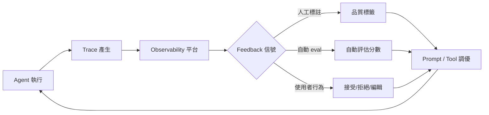

**關鍵洞察**：沒有 D → H 這條回路的系統，trace 只是昂貴的 log；有了它，每次失敗都是訓練資料。

[推論] 這直接呼應 Eugene Yan 的「verification for autonomy, scale via delegation, closing the loop」框架（[eugeneyan.com](https://eugeneyan.com//writing/working-with-ai/)）。Yan 的論點：你願意把多少自主權交給 AI，取決於你有多強的 verification 機制。Observability-as-learning 正是 verification 的基礎設施化。

[原文] OpenAI 的 Codex 安全運營模式也呼應這個趨勢：sandboxing + approvals + agent-native telemetry 構成了一個「信任但驗證」的閉環（[openai.com](https://openai.com/index/running-codex-safely)）。Telemetry 不只是為了安全，更是為了理解 agent 在生產環境中的真實行為模式。

### 模式二：時間感知 RAG（Temporal-Aware RAG）

[原文] TDS 文章直指要害：「My system retrieved the most similar document, not the most current one. And in a knowledge base that changes constantly, that's a serious flaw.」解法是在 retriever 和 LLM 之間插入一個 temporal layer，根據文件時間戳和知識變動頻率做衰減過濾。([towardsdatascience.com](https://towardsdatascience.com/rag-is-blind-to-time-i-built-a-temporal-layer-to-fix-it-in-production/))

[推論] 這個問題在金融場景尤其致命。法規每季更新、利率每月變動、客戶 KYC 資料有時效性。一個不知道「這份文件是 2024 年的」的 RAG 系統，在銀行場景等於是一顆定時炸彈。

以下圖示說明傳統 RAG vs. 時間感知 RAG 的架構差異：

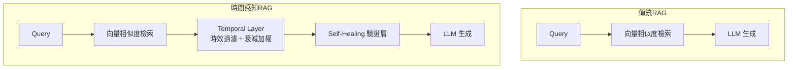

**關鍵洞察**：Temporal layer 和 self-healing layer 是互補的——前者防止「用到過期資料」，後者防止「用到正確資料但推理錯誤」。兩者都在 retriever 和 LLM 之間的「中間地帶」運作。

[原文] 另一篇 TDS 文章補充了 self-healing 層的概念：「Your RAG system isn't failing at retrieval — it's failing at reasoning.」([towardsdatascience.com](https://towardsdatascience.com/rag-hallucinates-i-built-a-self-healing-layer-that-fixes-it-in-real-time/)) 這層在 LLM 輸出之前做 claim-level verification，偵測到不一致時自動觸發 re-retrieval 或 fallback。

[推論] 合併來看，production RAG 架構正從「query → retrieve → generate」三步走，演化為五步走：「query → retrieve → temporal filter → generate → self-heal verify」。每一步都是可觀測的、可被 feedback 標註的。這與模式一的 observability-as-learning 直接相接。

### 模式三：MCP 供應鏈攻擊面與工具信任鏈

[原文] Mitiga 研究人員發現 Claude Code 的 MCP 實作存在設計漏洞：攻擊者可透過 MCP Hijacking 竊取 OAuth 憑證，且開發人員可能完全不知情，攻擊還能透過供應鏈擴散到下游（[ithome.com.tw](https://www.ithome.com.tw/news/175647)）。

[推論] MCP（Model Context Protocol）的設計初衷是讓 tool-call 標準化、可組合，但這也意味著每一個 MCP server 都是一個潛在的攻擊注入點。當你的 agent 呼叫 10 個 MCP tool，每個 tool 背後可能是不同供應商維護的 server——這就是經典的 supply-chain attack surface，與 npm / PyPI 供應鏈攻擊的邏輯完全一致。

以下序列圖說明 MCP Hijacking 的攻擊路徑：

```mermaid
sequenceDiagram
    participant Dev as 開發者
    participant CC as Claude Code
    participant MCP as 惡意MCP Server
    participant OAuth as OAuth Provider
    
    Dev->>CC: 安裝MCP工具
    CC->>MCP: 建立連線 + 請求能力
    MCP->>CC: 注入惡意工具描述
    CC->>OAuth: 代開發者請求OAuth Token
    OAuth-->>CC: 回傳Token
    CC->>MCP: 傳遞Token（被竊取）
    MCP-->>MCP: 利用Token存取下游資源
```

**關鍵洞察**：MCP 的信任模型預設是「開發者信任所有已安裝的 MCP server」——這在 prototype 環境合理，在生產環境致命。需要 tool-call 級別的 scope 限制與 runtime 驗證。

[原文] OpenAI 的 GPT-5.5 Trusted Access for Cyber 計畫從反面說明了信任鏈的重要性：只有經過身份驗證的防禦者才能存取進階 cyber 能力（[openai.com](https://openai.com/index/gpt-5-5-with-trusted-access-for-cyber)）。這是一個「能力分級 + 存取控制」的模式，值得 MCP 生態系借鏡。

[原文] TrendAI 與 Anthropic 的合作也強化了這個訊號：AI 驅動的漏洞偵測速度遠超修補速度，治理層必須跟上（[cio.com.tw](https://www.cio.com.tw/112198/)）。

### 模式四（附加）：開放模型在 Agent 任務達到門檻

[原文] LangChain 的 evals 顯示 GLM-5 和 MiniMax M2.7 等開放模型在「file operations、tool use、instruction following」這些核心 agent 任務上已達到閉源前沿模型的水平，成本和延遲卻大幅降低（[langchain.com](https://www.langchain.com/blog/open-models-have-crossed-a-threshold)）。

[推論] 這改變了工具鏈的選型邏輯：model gateway（如 LiteLLM、Portkey、OpenRouter）從「方便切換」升級為「成本最佳化路由」的關鍵元件。當開放模型能跑 80% 的 agent 任務，你只需要把 20% 的高難度請求路由到 GPT-5.5 / Claude Mythos。

以下圖示說明模型路由的成本最佳化模式：

```mermaid
flowchart LR
    A[Agent Request] --> B{Complexity Router}
    B -->|簡單工具呼叫| C[開放模型<br/>GLM-5 / MiniMax<br/>成本 0.1x]
    B -->|複雜推理| D[前沿閉源模型<br/>GPT-5.5 / Mythos<br/>成本 1.0x]
    C --> E[Response]
    D --> E
    E --> F[Observability + Feedback]
    F -->|調整路由閾值| B
```

**關鍵洞察**：路由閾值本身是需要持續學習的——又回到模式一的 feedback 閉環。Observability 不是可選項，是讓整個工具鏈持續最佳化的引擎。

## 與既有框架的對位

[推論] **Chip Huyen 的 ML 系統設計框架**：Huyen 在《Designing Machine Learning Systems》中強調 data distribution shift 是生產 ML 最大的敵人。本週的 temporal RAG 模式正是 distribution shift 在 retrieval 層的具體表現——知識庫的「分佈」隨時間漂移，而 embedding 空間不會自動反映這件事。temporal decay 函數本質上是一種 lightweight drift detection。

[推論] **NIST AI RMF 的 GOVERN 和 MAP 功能**：MCP hijacking 攻擊直接對應 NIST AI RMF 中的「AI system supply chain risk」（MAP 3.4）。NIST 要求組織識別 AI 系統中的第三方元件及其信任邊界——MCP server 是一個尚未被主流風險管理框架充分覆蓋的第三方元件類別。台灣金管會若跟進 NIST 框架（已有跡象），MCP 供應鏈治理將成為合規要求。

[原文] **Anthropic 的 responsible scaling / EU AI Act 的透明度要求**：FDA 的 Elsa 4.0 部署案例提供了一個參考模式——在 FedRAMP High 等級的 GCP 環境上，人員仍然參與每個工作流程階段（[ithome.com.tw](https://www.ithome.com.tw/news/175639)）。這是 human-in-the-loop 與 agent autonomy 之間的典型平衡點，直接映射到 EU AI Act 的高風險 AI 系統要求。

[推論] **Karpathy 的「Software 2.0」觀點**：本週的 observability-as-learning 模式是 Software 2.0 的必然推論。如果模型的行為由資料決定（而非程式碼），那麼你改善系統的方式就不是「寫更好的 code」，而是「餵更好的 feedback」。Chase 說的「traces alone do not create that loop」，本質上就是在說：你不能只 log，你必須 label。

## Trade-offs 與爭議

**1. Observability-as-Learning vs. 標註成本**
- 正面：feedback 閉環讓 agent 持續改善，避免 prompt 品質停滯
- 反面：高品質 feedback（尤其是人工標註）成本高昂。自動 eval 又容易 overfit 到 eval prompt 本身。[假設] 多數企業實務中，feedback 的標註率低於 5%，不足以驅動統計顯著的 prompt 調優
- 爭議核心：feedback 的 ROI 高度依賴 agent 的使用頻率與錯誤成本。對低頻高風險場景（如合規審查），每一筆 feedback 都值得；對高頻低風險場景（如內部問答），可能不划算

**2. Temporal RAG vs. 系統複雜度**
- 正面：避免過期資訊誤導使用者，在法規/金融場景尤為關鍵
- 反面：增加 retrieval pipeline 的延遲與維護複雜度。temporal decay 函數的超參數（衰減速率、文件類型權重）需要人工設定，本身也可能過時
- 爭議核心：是否應該讓 LLM 自己判斷資訊時效性（chain-of-thought：「這份文件是 2024 年的，可能已過時」）vs. 在 retriever 層硬性過濾？前者更靈活但不可靠，後者可靠但可能過度過濾

**3. 開放模型 vs. 閉源模型在 Agent 場景**
- 正面：成本降低 10x、延遲降低、資料不離境（對台灣金融客戶是硬需求）
- 反面：開放模型的 safety guardrail 成熟度仍低於 GPT-5.5 / Claude Mythos；在 adversarial input 場景（如客戶蓄意 jailbreak）的防護力未經充分測試
- 爭議核心：LangChain 的 evals 測的是「能不能做對」，但生產環境還需要測「會不會做壞」。能力對齊不等於安全對齊

**4. MCP 開放性 vs. 安全性**
- 正面：標準協議降低 tool 整合成本，促進生態系發展
- 反面：如 Mitiga 揭露的，每一個 MCP server 都是未經審計的 trust boundary。「Install and trust」模式在企業環境不可接受
- 爭議核心：MCP 社群是否需要一個類似 npm audit / Sigstore 的簽章與驗證機制？這會增加摩擦但可能是企業採用的前提

## 對 Livia IBM 客戶的具體含意

**國泰 / 玉山銀行場景**：

[推論] 台灣的銀行已經在用 RAG 做法規查詢和客戶服務。本週的 temporal RAG 模式直接適用：金管會法規每季修訂、銀行內部 SOP 每月更新。建議在提案中加入「法規知識庫的時效性管理」作為獨立模組，不是可選項而是必要元件。具體提案角度：在現有 RAG pipeline 中插入 temporal filter，以法規發布日期為衰減起點，搭配 self-healing verification 層做 claim-level 一致性檢查。

[推論] MCP hijacking 對銀行客戶的警示尤其重要。如果銀行內部的 coding agent（如基於 Codex 或 Claude Code 的開發輔助工具）使用 MCP 串接內部 API，一個被汙染的 MCP server 可以竊取 OAuth token 存取核心銀行系統。建議在資安治理提案中加入「agent tool-call 供應鏈稽核」項目。

**台積電 / 鴻海製造場景**：

[推論] 製造場景的 agent 通常跑在工廠內網、延遲敏感。開放模型達到 agent 任務門檻的訊號，對這類客戶特別有價值——可以在本地 GPU cluster 跑 GLM-5 等級的模型處理 80% 的 routine 任務（設備故障分類、SOP 查詢），只有複雜推理才上雲。Model gateway + complexity router 的架構可以作為具體提案元件。

**跨產業通用**：

[原文] Singular Bank 的案例（[openai.com](https://openai.com/index/singular-bank)）量化了 agent 的生產力提升：銀行員每天節省 60-90 分鐘在會議準備、投資組合分析、後續追蹤。這個數字可以直接用在台灣客戶的 ROI 計算中——但要注意：Singular 的 Singularity 是在 ChatGPT + Codex 上建的，不是開放模型。台灣客戶若有資料主權要求，需要做混合架構的成本估算。

[原文] TridentCare 的 96% 排程自動化（[ithome.com.tw](https://www.ithome.com.tw/news/175643)）和 FDA Elsa 4.0 的多 agent 架構（[ithome.com.tw](https://www.ithome.com.tw/news/175639)）都是 agent 在高規管產業落地的實證。對台灣客戶的論點：「連 FDA 都在用 multi-agent + human-in-the-loop 架構了，金管會轄下的金融機構沒有理由不做，重點是做對。」

## 對 Livia harness engineer portfolio 的含意

**Design Note 抽取機會**：

1. **「Observability-as-Learning Loop in Agent Harness」** —— 從 Chase 的 feedback loop 概念出發，設計一個 harness 元件：trace collector + feedback annotator + prompt optimizer 的三件套。這可以作為 portfolio 中「我如何讓 agent 在生產環境持續改善」的 design note，直接展示系統思維。

2. **「Temporal Decay Filter for Regulated-Domain RAG」** —— 實作一個 lightweight temporal layer，以台灣金管會法規為示範知識庫。這個元件小到可以在 GitHub 上一個 repo 展示，但足以說明「我理解生產 RAG 的真實失敗模式，不只是教科書上的 chunking 問題」。

3. **「MCP Trust Boundary Auditor」** —— 一個 CLI tool 或 pre-commit hook，掃描專案中的 MCP server 配置、列出信任邊界、標記未簽章的 server。這在面試中可以回答「你如何處理 agent 供應鏈安全」這類問題。

**面試問答框架**：

- 「What's wrong with most RAG systems in production?」→ 答：時間盲區 + 推理幻覺，需要 temporal filter 和 self-healing verification 兩層防護，而且這兩層都要接入 observability 做 feedback 閉環。

- 「How do you choose between open and closed models for agent tasks?」→ 答：不是二選一，是路由問題。用 complexity router 把 routine tasks 路由到開放模型（成本 0.1x），complex reasoning 路由到前沿閉源模型（成本 1.0x），路由閾值透過 feedback 持續調優。

- 「What's the biggest risk in MCP-based agent architectures?」→ 答：supply-chain attack surface。每個 MCP server 是一個 trust boundary，需要 scope 限制、runtime token 驗證、定期稽核。這不是理論風險——Mitiga 已經在 Claude Code 上示範了 OAuth token 竊取。

---

# Production LLM Toolchain's Triple Maturation: Observability-as-Learning, Temporal RAG, and Supply-Chain Attack Surface

## TL;DR (3 sentences)
1. The most important pattern shift this week: agent observability is evolving from a "debugging tool" to a "continuous learning loop" — traces are the raw material, but feedback is the fuel; teams ignoring this layer will face agent quality stagnation within 6 months.
2. Critical trade-offs surface at every layer of the toolchain: RAG must balance similarity vs. recency, MCP's openness creates supply-chain attack surfaces, and open models hit agent-task parity on cost but sacrifice guardrail maturity.
3. So what for Livia: Taiwan banking and manufacturing clients are entering "agent year two" — they no longer ask "can we do it" but "how do we prevent degradation, how do we prevent attacks, how do we cut costs," and these three questions map directly to this week's three major toolchain patterns.

## Background & Problem Framing

[Inference] 2025 was the "capability unlock year" for LLM toolchains — LangChain and LlamaIndex made prototyping easy, vector databases became standard infrastructure, and MCP gave tool-calls a standard protocol. But mid-2026, production environments are exposing three systemic problems invisible during prototyping: **quality degradation** (agents don't improve over time), **temporal blindness** (RAG doesn't know documents expire), and **trust chain breakage** (MCP hijacking steals OAuth tokens while developers remain oblivious).

[Inference] Six months ago, toolchain selection was primarily about "feature coverage" — how many chains does LangChain support, how good are LlamaIndex's retrievers. The current understanding: toolchain selection must evaluate "learning loop completeness" — can your observability platform accept feedback, does your retriever have temporal decay, does your tool-call protocol have supply-chain verification. This isn't a feature question; it's an architectural philosophy question.

[Source] Harrison Chase states explicitly in LangChain's blog: "The deeper role of agent observability is to power learning. But traces alone do not create that loop. You also need feedback." ([langchain.com](https://www.langchain.com/blog/agent-observability-needs-feedback-to-power-learning)) This sentence marks LangChain's strategic pivot from "chain framework" to "agent learning platform" — a shift worth tracking.

## Core Concepts (with Mermaid diagrams)

### Pattern One: Observability-as-Learning

[Source] Chase's core argument: most teams treat agent observability as a debugging tool — only opening traces after something breaks. The real value lies in forming a closed loop of trace + feedback that continuously improves agent prompt selection, tool routing, and reasoning quality. ([langchain.com](https://www.langchain.com/blog/agent-observability-needs-feedback-to-power-learning))

[Inference] This pattern isn't LangSmith-exclusive. Arize Phoenix, W&B Weave, and Braintrust are all converging toward the same direction: from "log viewer" to "feedback-annotated trace store." The differentiator is feedback granularity and integration interface.

The following flowchart shows the observability-as-learning closed loop:

```mermaid
flowchart LR
    A[Agent Execution] --> B[Trace Generation]
    B --> C[Observability Platform]
    C --> D{Feedback Signals}
    D -->|Human Annotation| E[Quality Labels]
    D -->|Auto Eval| F[Automated Scores]
    D -->|User Behavior| G[Accept/Reject/Edit]
    E --> H[Prompt / Tool Tuning]
    F --> H
    G --> H
    H --> A
```

**Key insight**: Without the D → H return path, traces are just expensive logs. With it, every failure becomes training data.

[Inference] This directly echoes Eugene Yan's framework of "verification for autonomy, scale via delegation, closing the loop" ([eugeneyan.com](https://eugeneyan.com//writing/working-with-ai/)). Yan's argument: how much autonomy you delegate to AI depends on how strong your verification mechanism is. Observability-as-learning is the infrastructuralization of verification.

[Source] OpenAI's Codex safety operations model reinforces this: sandboxing + approvals + agent-native telemetry form a "trust but verify" loop ([openai.com](https://openai.com/index/running-codex-safely)). Telemetry isn't just for security — it's for understanding agent behavior patterns in production.

### Pattern Two: Temporal-Aware RAG

[Source] The TDS article hits the core problem: "My system retrieved the most similar document, not the most current one. And in a knowledge base that changes constantly, that's a serious flaw." The fix inserts a temporal layer between retriever and LLM, filtering by document timestamps and knowledge change frequency with decay weighting. ([towardsdatascience.com](https://towardsdatascience.com/rag-is-blind-to-time-i-built-a-temporal-layer-to-fix-it-in-production/))

[Inference] This problem is especially lethal in financial contexts. Regulations update quarterly, interest rates change monthly, customer KYC data has explicit time bounds. A RAG system that doesn't know "this document is from 2024" is a ticking time bomb in a banking context.

The following diagram contrasts traditional RAG with temporal-aware RAG:

```mermaid
flowchart TD
    subgraph Traditional RAG
        Q1[Query] --> R1[Vector Similarity Retrieval]
        R1 --> L1[LLM Generation]
    end
    subgraph Temporal-Aware RAG
        Q2[Query] --> R2[Vector Similarity Retrieval]
        R2 --> T[Temporal Layer<br/>Recency Filter + Decay Weighting]
        T --> V[Self-Healing

