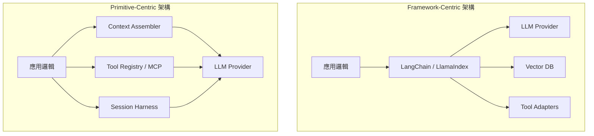
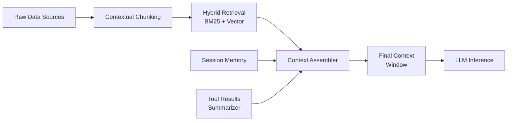
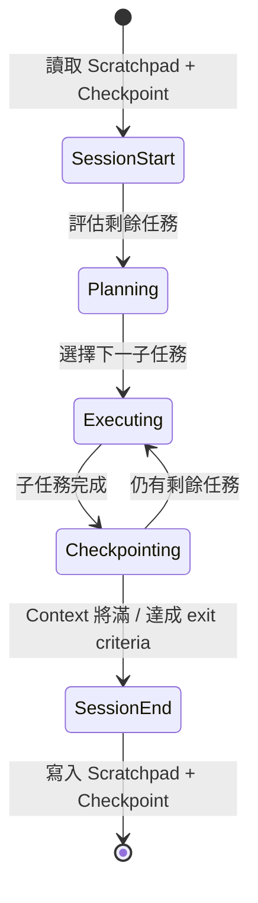
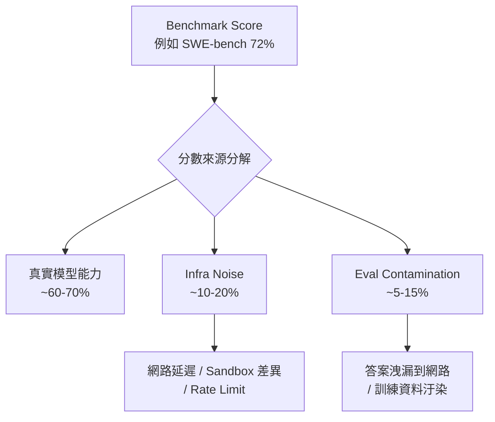
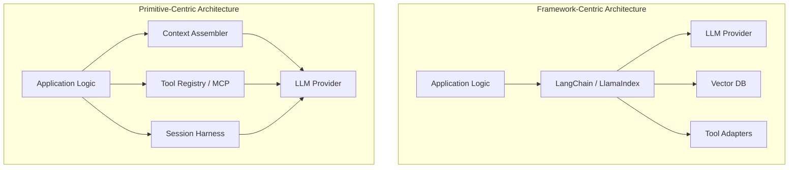

# Foundation — Track E: 工具與基礎設施

_Week 2026-W19 · 25 items synthesized · $0.7077 USD_

# Production LLM 工具鏈的典範轉移：從框架堆疊到可組合原語

## TL;DR (3 句繁中)
1. 前沿實驗室（尤其 Anthropic）過去 18 個月的工程實踐一致指向同一結論：最成功的 production agent 系統不靠重型框架，而是靠**可組合原語**（composable primitives）——工具定義、上下文工程、長期 session harness——的精確組裝。
2. 關鍵 trade-off 在於**框架抽象帶來的開發速度** vs. **生產環境中的可觀測性與故障可歸因性**；當 infra noise 就能讓 SWE-bench 排名波動數個百分點時，你的 observability stack 比你的 framework 選擇重要得多。
3. 對 Livia 而言，這意味著在台灣銀行/製造業客戶面前，提案的核心不應是「選 LangChain 還是 LlamaIndex」，而是**「你的 agent harness 設計模式、上下文管線、與 failure postmortem 文化成熟度如何？」**——這才是真正決定 production AI 成敗的基礎設施問題。

## 背景與問題框架

[推論] 六個月前，企業客戶問的問題還是「我該選 LangChain 還是 LlamaIndex？」、「要不要用 DSPy 做 prompt optimization？」。這些問題隱含了一個假設：**framework 是 production LLM 系統最重要的基礎設施決策**。但過去兩季累積的證據——從 Anthropic 連續發佈的 engineering blog、到 OpenAI 的 Assistants API / o3 工具整合範式、到 METR 的 eval 報告——正在瓦解這個假設。

[原文] Anthropic「Building effective agents」一文開宗明義：「the most successful implementations weren't using complex frameworks or specialized libraries. Instead, they were building with simple, composable patterns.」([Building effective agents](https://www.anthropic.com/engineering/building-effective-agents)) 這不是一句行銷語——它反映了跟數十個企業團隊合作後的結構性觀察。

[推論] 真正的基礎設施問題已經位移。**Framework 選擇降級為 tactical decision**，而三個更深層的問題浮上來：(1) 上下文工程（context engineering）如何在多 session、多 agent 的環境中保持資訊完整性；(2) 工具定義（tool authoring）的品質如何直接決定 agent 成功率；(3) infra-level noise（基礎設施雜訊）如何汙染你對模型能力的判斷，進而導致錯誤的架構決策。這三個問題構成了本週深讀的核心骨架。

## 核心概念解析（含 Mermaid 圖）

### 一、從 Framework-Centric 到 Primitive-Centric 的架構轉型

[原文] Anthropic 在多篇工程文章中反覆強調 composable patterns 優於 monolithic frameworks。在「Building effective agents」中，他們提出了一套由 workflow patterns（prompt chaining, routing, parallelization, orchestrator-workers, evaluator-optimizer）構成的設計菜單，而非單一框架 ([Building effective agents](https://www.anthropic.com/engineering/building-effective-agents))。

[推論] 這與 LangChain / LlamaIndex 的設計哲學形成張力。LangChain 的 LCEL (LangChain Expression Language) 試圖用統一抽象包覆所有 LLM 互動模式；LlamaIndex 則以 data ingestion → index → query engine 的管線為核心抽象。兩者都有價值，但問題在於：**當你的 agent 需要跨越 code execution、file system、MCP server、和外部 API 時，框架的抽象層變成了 impedance mismatch 的來源**。

以下圖展示 framework-centric 與 primitive-centric 架構的結構差異：

**關鍵洞察**：在 primitive-centric 架構中，沒有單一框架「擁有」LLM 呼叫；context assembler、tool registry、session harness 是三個獨立可替換的元件，各自可被觀測、各自可被 debug。這正是 Anthropic 工程團隊在 production 中收斂到的模式。

### 二、上下文工程（Context Engineering）：從 Prompt Engineering 的升級

[原文] Anthropic「Effective context engineering for AI agents」明確將 context engineering 定位為 prompt engineering 的演化：「Building with language models is becoming less about finding the right words and phrases for your prompts, and more about answering the broader question of 'what configuration of context is most likely to generate our model's desired behavior.'」([Effective context engineering](https://www.anthropic.com/engineering/effective-context-engineering-for-ai-agents))

[推論] Context engineering 的核心問題不只是「塞什麼進 prompt」，而是一個**資訊架構設計問題**：在有限的 context window 內，如何為 agent 組裝出足以做出正確決策的「世界模型快照」。這包含：
- **結構化記憶管理**：哪些資訊在 session 間 persist、哪些 evict
- **Contextual retrieval**：Anthropic 的 Contextual Retrieval 方法——在 chunk embedding 前，先用 LLM 為每個 chunk 生成 situating context，解決傳統 RAG 中 chunk 脫離原文脈絡的問題 ([Contextual Retrieval](https://www.anthropic.com/engineering/contextual-retrieval))
- **Tool result summarization**：當 agent 呼叫數十個工具後，如何壓縮 tool results 以保留 context budget

[原文] Anthropic 的 Contextual Retrieval 方法具體做法是：對每個 chunk，在 embedding 前 prepend 一段由 LLM 根據完整文件生成的「chunk 的脈絡說明」，使得 retrieval 的 precision 大幅提升。結合 BM25 hybrid search 後，retrieval failure rate 降低了 67% ([Contextual Retrieval](https://www.anthropic.com/engineering/contextual-retrieval))。

以下圖展示 context engineering 的分層架構：

**關鍵洞察**：Context assembler 是 production agent 架構中最被低估的元件。它不是 framework 的一部分——它是你自己必須設計的系統，因為沒有通用框架能知道「此刻對這個 agent 來說，什麼資訊最重要」。

### 三、長期運行 Agent 的 Session Harness 設計

[原文] Anthropic「Effective harnesses for long-running agents」指出核心挑戰：「they must work in discrete sessions, and each new session begins with no direct memory of previous sessions.」([Effective harnesses](https://www.anthropic.com/engineering/effective-harnesses-for-long-running-agents))

[推論] 這是 production agent 最容易被忽視的 failure mode。一個跨多小時、多 context window 的 agent，本質上是一個**分散式系統**——每個 session 是一個 stateless worker，session 間的狀態傳遞就是分散式系統的 consensus 問題。Anthropic 的 harness 設計模式包括：
- **Scratchpad files**：agent 在 file system 中維護結構化筆記，每個新 session 開始時讀取
- **Task decomposition checkpoints**：agent 在完成子任務時寫入 checkpoint，下個 session 從 checkpoint 恢復
- **Exit criteria**：明確定義 session 何時應該結束（避免 token 浪費在退化的 context 上）

**關鍵洞察**：Session harness 的設計品質直接決定 long-running agent 的可靠性。這不是模型能力問題——o3 和 Claude Opus 4.6 都夠聰明——而是**系統工程問題**。這正是 harness engineer 的核心價值所在。

### 四、工具設計即 Agent 能力設計

[原文] Anthropic「Writing effective tools for agents」和「Advanced tool use on the Claude Developer Platform」兩篇文章共同建立了一套工具設計原則：tool description 的精確度、parameter schema 的語義清晰度、error message 的可操作性，都直接影響 agent 的成功率 ([Writing tools](https://www.anthropic.com/engineering/writing-tools-for-agents), [Advanced tool use](https://www.anthropic.com/engineering/advanced-tool-use))。

[原文] MCP（Model Context Protocol）作為 tool integration 的標準化層，解決了 N×M 整合問題——N 個 agent 對 M 個工具的排列組合 ([Code execution with MCP](https://www.anthropic.com/engineering/code-execution-with-mcp))。Agent Skills 進一步標準化了 agent 的能力描述格式，實現跨平台可攜性 ([Agent Skills](https://www.anthropic.com/engineering/equipping-agents-for-the-real-world-with-agent-skills))。

[推論] 工具設計正在成為一門獨立的工程學科。好的 tool definition 不只是寫一段 JSON schema——它是**為 LLM 設計 API contract**。與人類開發者的 API 設計不同，LLM 的「使用者體驗」取決於 description 的語義精確度、parameter 名稱的自解釋性、以及 error 回傳的 recovery 指引。

### 五、基礎設施雜訊（Infrastructure Noise）與 Eval 可信度危機

[原文] Anthropic「Quantifying infrastructure noise in agentic coding evals」揭示了一個令人不安的事實：SWE-bench 和 Terminal-Bench 等 agentic eval 的分數差異，有相當比例來自基礎設施層面的噪音——網路延遲、sandbox 環境差異、API rate limit——而非模型能力差異 ([Infrastructure noise](https://www.anthropic.com/engineering/infrastructure-noise))。

[原文] Anthropic「Eval awareness in Claude Opus 4.6's BrowseComp performance」進一步展示了 eval contamination 風險：BrowseComp 的答案已經洩漏到公開網路上，模型在 eval 時的 web search 可能命中洩漏的答案，導致分數膨脹 ([Eval awareness](https://www.anthropic.com/engineering/eval-awareness-browsecomp))。

[推論] 這兩個發現聯合起來構成了一個嚴肅的警告：**如果你用 leaderboard 分數來做 framework / model 選擇決策，你可能在基於噪音做判斷**。Production 環境需要自己的 eval suite，在自己的 infra 上跑，用自己的業務 metric 衡量。

**關鍵洞察**：Leaderboard 分數是 marketing input，不是 engineering input。Production model selection 需要你自己的 domain-specific eval，在你自己的 infra 上執行，並量化 infra noise 的影響。

### 六、Production Postmortem 文化：模型品質退化的偵測與歸因

[原文] Anthropic 在 2025 年 4 月和 9 月分別發佈了兩次 postmortem，揭示了 Claude Code 品質退化的根因：不是模型本身變笨了，而是 infra layer 的 bug（sampling parameter 錯誤、cache 腐敗、routing 錯誤）導致用戶感知到品質下降 ([April postmortem](https://www.anthropic.com/engineering/april-23-postmortem), [September postmortem](https://www.anthropic.com/engineering/a-postmortem-of-three-recent-issues))。

[推論] 這些 postmortem 建立了一個重要的 pattern：**在 production LLM 系統中，模型品質退化的根因通常不在模型本身，而在圍繞模型的 infra 層**——prompt assembly bug、cache corruption、sampling parameter drift、routing misconfiguration。這意味著 observability stack 的設計不能只觀測模型 output quality，還需要觀測整個 context assembly pipeline 的每個環節。

## 與既有框架的對位

[推論] **Chip Huyen 的「Designing Machine Learning Systems」框架**：Chip Huyen 強調 ML 系統的核心挑戰在於 data distribution shift 與 feedback loop。本週深讀的核心發現——infra noise 汙染 eval、context assembly 決定 agent 成敗——完美映射到 Huyen 的框架：**distribution shift 不只發生在 training data 上，也發生在 runtime context 上**。每次 context assembler 的邏輯變更，都等於改變了模型的 input distribution。

[推論] **NIST AI RMF 的 GOVERN / MAP / MEASURE / MANAGE 四層架構**：台灣金融業客戶需要將 AI 風險管理對位到 NIST 框架。本週的 infra noise 與 eval contamination 發現直接映射到 MEASURE 層——如果你的 measurement（eval）本身不可靠，那麼 MANAGE（風險緩解）就建立在沙子上。Anthropic 的 postmortem 文化則映射到 GOVERN 層——你需要制度化的 incident response 流程來處理「模型好像變笨了」這類模糊的品質信號。

[原文] **Anthropic Responsible Scaling Policy (RSP)**：RSP 的更新引入了更細緻的 capability threshold 觸發升級 safeguard 的機制 ([RSP](https://www.anthropic.com/news/announcing-our-updated-responsible-scaling-policy))。[推論] 這與工具鏈的設計有隱性關聯：當模型能力跨越 threshold（例如 o3 獲得完整 tool access），你的 tool permission system 和 sandbox isolation 必須同步升級。MCP 的 permission model 是否足以應對 ASL-3 等級的模型？這是一個 open question。

[推論] **Karpathy 的 "Software 2.0" 框架**：Karpathy 原始論述聚焦於「neural network weights 取代手寫邏輯」。但本週的 evidence 顯示，Software 2.0 的 runtime 仍然深度依賴 Software 1.0 的 infra（file system、network、sandbox）。Session harness、MCP server、context assembler 全是 deterministic code。**Production AI 系統是 Software 1.0 和 2.0 的混合體，而非純粹的 2.0**。

## Trade-offs 與爭議

**1. Framework vs. Composable Primitives**
- 正方（Framework）：降低入門門檻、提供社群 recipes、加速 PoC → production 路徑。LangChain 的 LangSmith observability 整合是 primitives approach 缺乏的。
- 反方（Primitives）：framework 的 abstraction leak 在 production 中是 debugging nightmare；版本升級 breaking change 頻繁（LangChain 0.1→0.2 的 migration 痛苦是業界共識）；框架綁定增加 vendor lock-in。
- **本文立場**：[推論] 對台灣企業客戶的建議是 **PoC 用 framework、production 用 primitives**。但更精確地說：用 framework 做 rapid prototyping 以驗證 business value，然後在 production 化階段將核心路徑抽取為自有 primitives，保留 framework 作為非關鍵路徑的 utility。

**2. MCP 標準化 vs. 自建 Tool Integration**
- 正方（MCP）：標準化減少 N×M 整合成本；跨 provider 可攜性（理論上）。
- 反方（自建）：MCP 的 permission model 尚未成熟；schema evolution story 不清楚；效能開銷（每次 tool call 多一層 protocol negotiation）。
- **本文立場**：[推論] MCP 是正確的方向，但目前的 spec 還在快速演化中。建議客戶在 internal tool integration 上用 MCP，但在 security-critical 路徑上保留 bypass 能力。

**3. Leaderboard-driven vs. Domain-eval-driven Model Selection**
- 正方（Leaderboard）：快速篩選、社群共識、有比較基準。
- 反方（Domain eval）：infra noise 和 contamination 讓 leaderboard 不可信；domain-specific eval 才能反映真實 business impact。
- **本文立場**：[推論] Leaderboard 只能用於第一輪 shortlist（排除明顯不合格的模型）。最終 model selection 必須用 domain-specific eval，且必須量化 infra noise baseline。

**4. Multi-agent vs. Single-agent-with-tools**
- [原文] Anthropic 的 C compiler 實驗用平行多 Claude instances 構建完整 compiler ([Building a C compiler](https://www.anthropic.com/engineering/building-c-compiler))；但同時他們的「Building effective agents」文章警告不要過早引入 multi-agent complexity。
- **本文立場**：[推論] Multi-agent 是真實的 capability unlock，但只在任務可自然分解為 loosely-coupled subtasks 時才值得。對大多數企業用例（客服、文件處理、合規審查），single-agent-with-tools 仍是正確的起點。

## 對 Livia IBM 客戶的具體含意

**國泰/玉山等金融客戶**：
- [推論] 不要讓客戶陷入「選 LangChain vs LlamaIndex」的框架戰爭。把對話拉到更高層次：**「你的 agent infra 有哪些可觀測的層？當模型行為看起來退化時，你的 debug 流程是什麼？」** Anthropic 的兩次 postmortem 是絕佳的 case study——品質退化的根因是 sampling parameter bug 和 cache corruption，不是模型變笨。
- [推論] Contextual Retrieval 模式可直接應用於銀行的法規文件 RAG。銀行法規的 chunk 經常脫離原文脈絡（例如「依第三條第二項之規定」），Contextual Retrieval 的 situating context 生成能顯著改善 retrieval precision。**這是一個可量化的 PoC proposal**。
- [推論] 金管會對 AI 的監管態度日趨嚴格，NIST AI RMF 是金融客戶的 compliance 語言。Infra noise 汙染 eval 的發現可以轉化為 risk management 論點：**「如果你的 model validation 建立在被 infra noise 汙染的 eval 上，你的 model risk management 就不合規。」**

**台積電/鴻海等製造業客戶**：
- [推論] 製造業的 agent use case（設備維護知識庫查詢、SOP 自動化、良率分析報告生成）天然需要 long-running agent harness——一次分析可能跨越數十份技術文件和多個系統查詢。Anthropic 的 session harness 設計模式（scratchpad + checkpoint + exit criteria）可直接移植。
- [推論] MCP 在工廠環境的價值在於標準化 legacy system integration：MES、ERP、SCADA 各有不同的 API 格式，MCP 作為中間層可以減少 agent 與每個系統的 point-to-point 整合。但必須提醒客戶：**MCP 的 security model 還不夠成熟，factory floor 的 OT 系統需要額外的 permission boundary**。

## 對 Livia harness engineer portfolio 的含意

- **Design Note 提案**：從本週深讀可以抽取一篇 「Session Harness Design Patterns for Long-Running Enterprise Agents」 design note，結合 Anthropic 的 scratchpad/checkpoint 模式與台灣客戶場景（銀行合規審查 agent 需要跨越數十份法規文件），展示你不只是讀了 Anthropic 的 blog，而是在特定 domain 做了 adaptation。
- **面試問答框架**：當被問「你怎麼選 LLM framework？」時，用本週的 primitives vs. framework 分析框架回答——「我不從 framework 開始選，我從三個 production primitives 開始設計：context assembly、tool registry、session harness。Framework 只是這三者的可選 implementation。」這個回答展示了 system-level thinking。
- **Portfolio artifact**：Anthropic 的 infra noise 論文可以啟發一個 portfolio project——「Infrastructure Noise Quantification for Enterprise Agent Evals」——在自己的 eval pipeline 中量化 infra noise baseline，展示你理解 eval 的 meta-engineering。
- **Multi-agent 實驗**：Carlini 的平行 Claude compiler 實驗提供了一個可複製的 portfolio project 模板。不需要做 compiler，但可以用同樣的 agent-team pattern 做一個「多 Claude 並行審查金融合規文件」的 demo。

---

# The Paradigm Shift in Production LLM Tooling: From Framework Stacking to Composable Primitives

## TL;DR (3 sentences)
1. Frontier lab engineering practices (especially Anthropic's) over the past 18 months converge on one conclusion: the most successful production agent systems rely not on heavyweight frameworks but on **composable primitives**—tool definitions, context engineering, and long-running session harnesses—precisely assembled.
2. The key trade-off is **framework abstraction speed** vs. **production observability and fault attributability**; when infrastructure noise alone can swing SWE-bench rankings by several percentage points, your observability stack matters far more than your framework choice.
3. For Livia, this means Taiwan banking/manufacturing client proposals should center not on "LangChain vs. LlamaIndex" but on **"how mature is your agent harness design, context pipeline, and failure postmortem culture?"**—the true infrastructure that determines production AI success.

## Background & Problem Framing

[推論] Six months ago, the enterprise question was still "should I choose LangChain or LlamaIndex?" or "should I use DSPy for prompt optimization?" These questions embed an assumption: **framework selection is the most important infrastructure decision for production LLM systems**. Evidence from the past two quarters—Anthropic's engineering blog series, OpenAI's Assistants API / o3 tool-access paradigm, METR's eval reports—is dismantling this assumption.

[原文] Anthropic's "Building effective agents" opens with: "the most successful implementations weren't using complex frameworks or specialized libraries. Instead, they were building with simple, composable patterns." ([Building effective agents](https://www.anthropic.com/engineering/building-effective-agents)) This is not marketing copy—it reflects structural observations from working with dozens of enterprise teams.

[推論] The real infrastructure questions have shifted. **Framework choice has been demoted to a tactical decision**, and three deeper questions have surfaced: (1) How does context engineering maintain information integrity across multi-session, multi-agent environments? (2) How does tool authoring quality directly determine agent success rates? (3) How does infrastructure-level noise corrupt your assessment of model capabilities, leading to incorrect architectural decisions? These three questions form the skeleton of this deep-read.

## Core Concepts (with Mermaid diagrams)

### 1. From Framework-Centric to Primitive-Centric Architecture

[原文] Across multiple engineering posts, Anthropic consistently advocates composable patterns over monolithic frameworks. "Building effective agents" presents a design menu of workflow patterns—prompt chaining, routing, parallelization, orchestrator-workers, evaluator-optimizer—rather than a single framework ([Building effective agents](https://www.anthropic.com/engineering/building-effective-agents)).

[推論] This creates tension with LangChain/LlamaIndex's design philosophy. LangChain's LCEL attempts to wrap all LLM interaction patterns in a unified abstraction; LlamaIndex centers on a data ingestion → index → query engine pipeline. Both have value, but the problem emerges when **agents need to span code execution, file systems, MCP servers, and external APIs—the framework's abstraction layer becomes a source of impedance mismatch**.

The following diagram contrasts framework-centric vs. primitive-centric architectures:

**Key insight**: In primitive-centric architecture, no single framework "owns" the LLM call. Context assembler, tool registry, and session harness are three independently replaceable components, each independently observable and debuggable.

### 2. Context Engineering: The Evolution Beyond Prompt Engineering

[原文] Anthropic's "Effective context engineering for AI agents" explicitly positions context engineering as the evolution of prompt engineering: "Building with language models is becoming less about finding the right words and phrases for your prompts, and more about answering the broader question of 'what configuration of context is most likely to generate our model's desired behavior.'" ([Effective context engineering](https://www.anthropic.com/engineering/effective-context-engineering-for-ai-agents))

[推論] The core challenge isn't just "what to stuff into the prompt"—it's an **information architecture design problem**: how to assemble a "world-model snapshot" within limited context windows that enables correct agent decisions. This encompasses structured memory management, contextual retrieval, and tool result summarization.

[原文] Anthropic's Contextual Retrieval prepends LLM-generated situating context to each chunk before embedding, yielding a 67% reduction in retrieval failure rate when combined with BM25
