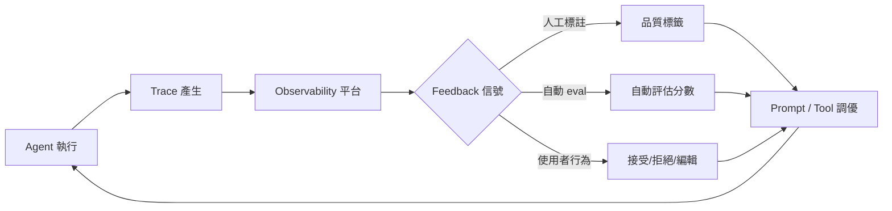
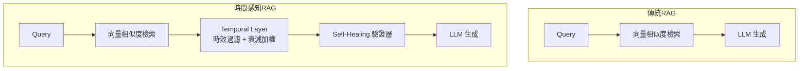
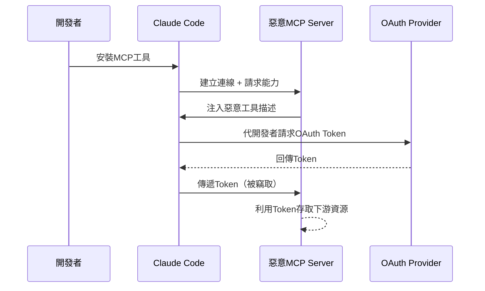
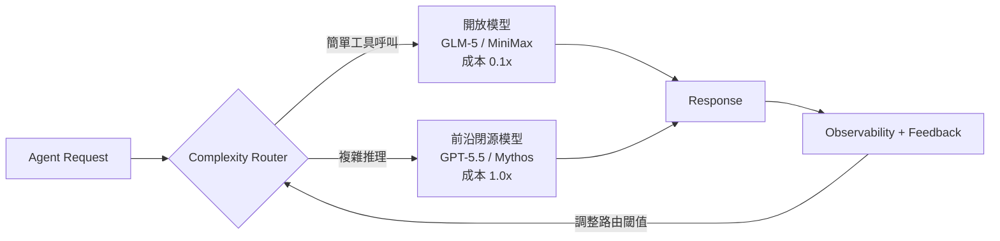
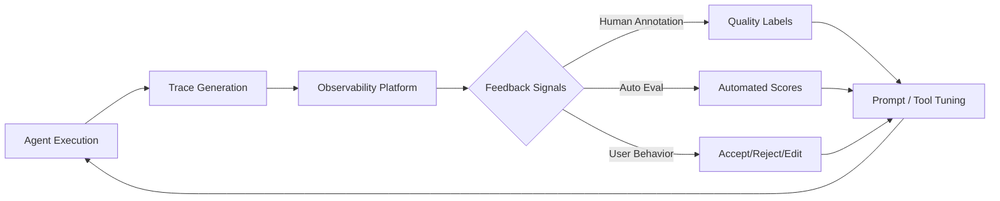

# Foundation — Track E: 工具與基礎設施

_Week 2026-W19 · 25 items synthesized · $0.7157 USD_


# 生產級 LLM 工具鏈的三重成熟：可觀測性即學習、時間感知 RAG、與供應鏈攻擊面

## TL;DR (3 句繁中)
1. 本週最重要的模式轉移：agent 可觀測性正從「除錯工具」進化為「持續學習迴路」——traces 只是原料，feedback 才是燃料；忽略這層的團隊將在 6 個月內面臨 agent 品質停滯。
2. 關鍵 trade-off 出現在工具鏈每一層：RAG 要在相似度與時效性之間取捨、MCP 開放互通帶來供應鏈攻擊面、開放模型在 agent 任務達到成本甜蜜點但犧牲護欄成熟度。
3. 對 Livia 的 SO WHAT：台灣金融與製造客戶正進入「agent 第二年」——不再問「能不能做」，而是問「怎麼不退化、怎麼不被攻擊、怎麼省成本」，這三個問題直接對應本週三大工具鏈模式。

## 背景與問題框架

[推論] 2025 年是 LLM 工具鏈的「能力解鎖年」——LangChain / LlamaIndex 讓 prototype 變得容易，向量資料庫成為基礎設施，MCP 協議讓 tool-call 有了標準語法。但進入 2026 年中，生產環境暴露出三個 prototype 階段不會遇到的系統性問題：**品質衰退**（agent 跑久了沒有變好）、**時間盲區**（RAG 不知道文件過期）、**信任鏈斷裂**（MCP hijacking 讓 OAuth token 被偷走而開發者渾然不覺）。

[推論] 六個月前的理解：工具鏈選型主要看「功能覆蓋度」（LangChain 的 chain 多不多、LlamaIndex 的 retriever 好不好）。現在的理解：工具鏈選型要看「學習閉環的完整度」——你的 observability 能不能接 feedback、你的 retriever 有沒有 temporal decay、你的 tool-call 協議有沒有 supply-chain 驗證。這不是功能問題，是架構哲學問題。

[原文] Harrison Chase 在 LangChain blog 明確指出：「The deeper role of agent observability is to power learning. But traces alone do not create that loop. You also need feedback.」([langchain.com](https://www.langchain.com/blog/agent-observability-needs-feedback-to-power-learning)) 這句話標誌著 LangChain 的定位從「chain 框架」轉向「agent 學習平台」——一個值得注意的策略轉向。

## 核心概念解析（含 Mermaid 圖）

### 模式一：可觀測性即學習（Observability-as-Learning）

[原文] Chase 的論述核心：多數團隊把 agent observability 當除錯工具——出事了才打開 trace 看哪一步出錯。但真正的價值是把 trace + feedback 構成閉環，讓 agent 的 prompt / tool selection / routing 持續改善。([langchain.com](https://www.langchain.com/blog/agent-observability-needs-feedback-to-power-learning))

[推論] 這個模式不只適用於 LangSmith。Arize Phoenix、W&B Weave、Braintrust 都在往同一方向收斂：從「log viewer」進化為「feedback-annotated trace store」。差異在於 feedback 的粒度與接入方式。

以下流程圖說明 observability-as-learning 的閉環架構：



**關鍵洞察**：沒有 D → H 這條回路的系統，trace 只是昂貴的 log；有了它，每次失敗都是訓練資料。

[推論] 這直接呼應 Eugene Yan 的「verification for autonomy, scale via delegation, closing the loop」框架（[eugeneyan.com](https://eugeneyan.com//writing/working-with-ai/)）。Yan 的論點：你願意把多少自主權交給 AI，取決於你有多強的 verification 機制。Observability-as-learning 正是 verification 的基礎設施化。

[原文] OpenAI 的 Codex 安全運營模式也呼應這個趨勢：sandboxing + approvals + agent-native telemetry 構成了一個「信任但驗證」的閉環（[openai.com](https://openai.com/index/running-codex-safely)）。Telemetry 不只是為了安全，更是為了理解 agent 在生產環境中的真實行為模式。

### 模式二：時間感知 RAG（Temporal-Aware RAG）

[原文] TDS 文章直指要害：「My system retrieved the most similar document, not the most current one. And in a knowledge base that changes constantly, that's a serious flaw.」解法是在 retriever 和 LLM 之間插入一個 temporal layer，根據文件時間戳和知識變動頻率做衰減過濾。([towardsdatascience.com](https://towardsdatascience.com/rag-is-blind-to-time-i-built-a-temporal-layer-to-fix-it-in-production/))

[推論] 這個問題在金融場景尤其致命。法規每季更新、利率每月變動、客戶 KYC 資料有時效性。一個不知道「這份文件是 2024 年的」的 RAG 系統，在銀行場景等於是一顆定時炸彈。

以下圖示說明傳統 RAG vs. 時間感知 RAG 的架構差異：



**關鍵洞察**：Temporal layer 和 self-healing layer 是互補的——前者防止「用到過期資料」，後者防止「用到正確資料但推理錯誤」。兩者都在 retriever 和 LLM 之間的「中間地帶」運作。

[原文] 另一篇 TDS 文章補充了 self-healing 層的概念：「Your RAG system isn't failing at retrieval — it's failing at reasoning.」([towardsdatascience.com](https://towardsdatascience.com/rag-hallucinates-i-built-a-self-healing-layer-that-fixes-it-in-real-time/)) 這層在 LLM 輸出之前做 claim-level verification，偵測到不一致時自動觸發 re-retrieval 或 fallback。

[推論] 合併來看，production RAG 架構正從「query → retrieve → generate」三步走，演化為五步走：「query → retrieve → temporal filter → generate → self-heal verify」。每一步都是可觀測的、可被 feedback 標註的。這與模式一的 observability-as-learning 直接相接。

### 模式三：MCP 供應鏈攻擊面與工具信任鏈

[原文] Mitiga 研究人員發現 Claude Code 的 MCP 實作存在設計漏洞：攻擊者可透過 MCP Hijacking 竊取 OAuth 憑證，且開發人員可能完全不知情，攻擊還能透過供應鏈擴散到下游（[ithome.com.tw](https://www.ithome.com.tw/news/175647)）。

[推論] MCP（Model Context Protocol）的設計初衷是讓 tool-call 標準化、可組合，但這也意味著每一個 MCP server 都是一個潛在的攻擊注入點。當你的 agent 呼叫 10 個 MCP tool，每個 tool 背後可能是不同供應商維護的 server——這就是經典的 supply-chain attack surface，與 npm / PyPI 供應鏈攻擊的邏輯完全一致。

以下序列圖說明 MCP Hijacking 的攻擊路徑：



**關鍵洞察**：MCP 的信任模型預設是「開發者信任所有已安裝的 MCP server」——這在 prototype 環境合理，在生產環境致命。需要 tool-call 級別的 scope 限制與 runtime 驗證。

[原文] OpenAI 的 GPT-5.5 Trusted Access for Cyber 計畫從反面說明了信任鏈的重要性：只有經過身份驗證的防禦者才能存取進階 cyber 能力（[openai.com](https://openai.com/index/gpt-5-5-with-trusted-access-for-cyber)）。這是一個「能力分級 + 存取控制」的模式，值得 MCP 生態系借鏡。

[原文] TrendAI 與 Anthropic 的合作也強化了這個訊號：AI 驅動的漏洞偵測速度遠超修補速度，治理層必須跟上（[cio.com.tw](https://www.cio.com.tw/112198/)）。

### 模式四（附加）：開放模型在 Agent 任務達到門檻

[原文] LangChain 的 evals 顯示 GLM-5 和 MiniMax M2.7 等開放模型在「file operations、tool use、instruction following」這些核心 agent 任務上已達到閉源前沿模型的水平，成本和延遲卻大幅降低（[langchain.com](https://www.langchain.com/blog/open-models-have-crossed-a-threshold)）。

[推論] 這改變了工具鏈的選型邏輯：model gateway（如 LiteLLM、Portkey、OpenRouter）從「方便切換」升級為「成本最佳化路由」的關鍵元件。當開放模型能跑 80% 的 agent 任務，你只需要把 20% 的高難度請求路由到 GPT-5.5 / Claude Mythos。

以下圖示說明模型路由的成本最佳化模式：



**關鍵洞察**：路由閾值本身是需要持續學習的——又回到模式一的 feedback 閉環。Observability 不是可選項，是讓整個工具鏈持續最佳化的引擎。

## 與既有框架的對位

[推論] **Chip Huyen 的 ML 系統設計框架**：Huyen 在《Designing Machine Learning Systems》中強調 data distribution shift 是生產 ML 最大的敵人。本週的 temporal RAG 模式正是 distribution shift 在 retrieval 層的具體表現——知識庫的「分佈」隨時間漂移，而 embedding 空間不會自動反映這件事。temporal decay 函數本質上是一種 lightweight drift detection。

[推論] **NIST AI RMF 的 GOVERN 和 MAP 功能**：MCP hijacking 攻擊直接對應 NIST AI RMF 中的「AI system supply chain risk」（MAP 3.4）。NIST 要求組織識別 AI 系統中的第三方元件及其信任邊界——MCP server 是一個尚未被主流風險管理框架充分覆蓋的第三方元件類別。台灣金管會若跟進 NIST 框架（已有跡象），MCP 供應鏈治理將成為合規要求。

[原文] **Anthropic 的 responsible scaling / EU AI Act 的透明度要求**：FDA 的 Elsa 4.0 部署案例提供了一個參考模式——在 FedRAMP High 等級的 GCP 環境上，人員仍然參與每個工作流程階段（[ithome.com.tw](https://www.ithome.com.tw/news/175639)）。這是 human-in-the-loop 與 agent autonomy 之間的典型平衡點，直接映射到 EU AI Act 的高風險 AI 系統要求。

[推論] **Karpathy 的「Software 2.0」觀點**：本週的 observability-as-learning 模式是 Software 2.0 的必然推論。如果模型的行為由資料決定（而非程式碼），那麼你改善系統的方式就不是「寫更好的 code」，而是「餵更好的 feedback」。Chase 說的「traces alone do not create that loop」，本質上就是在說：你不能只 log，你必須 label。

## Trade-offs 與爭議

**1. Observability-as-Learning vs. 標註成本**
- 正面：feedback 閉環讓 agent 持續改善，避免 prompt 品質停滯
- 反面：高品質 feedback（尤其是人工標註）成本高昂。自動 eval 又容易 overfit 到 eval prompt 本身。[假設] 多數企業實務中，feedback 的標註率低於 5%，不足以驅動統計顯著的 prompt 調優
- 爭議核心：feedback 的 ROI 高度依賴 agent 的使用頻率與錯誤成本。對低頻高風險場景（如合規審查），每一筆 feedback 都值得；對高頻低風險場景（如內部問答），可能不划算

**2. Temporal RAG vs. 系統複雜度**
- 正面：避免過期資訊誤導使用者，在法規/金融場景尤為關鍵
- 反面：增加 retrieval pipeline 的延遲與維護複雜度。temporal decay 函數的超參數（衰減速率、文件類型權重）需要人工設定，本身也可能過時
- 爭議核心：是否應該讓 LLM 自己判斷資訊時效性（chain-of-thought：「這份文件是 2024 年的，可能已過時」）vs. 在 retriever 層硬性過濾？前者更靈活但不可靠，後者可靠但可能過度過濾

**3. 開放模型 vs. 閉源模型在 Agent 場景**
- 正面：成本降低 10x、延遲降低、資料不離境（對台灣金融客戶是硬需求）
- 反面：開放模型的 safety guardrail 成熟度仍低於 GPT-5.5 / Claude Mythos；在 adversarial input 場景（如客戶蓄意 jailbreak）的防護力未經充分測試
- 爭議核心：LangChain 的 evals 測的是「能不能做對」，但生產環境還需要測「會不會做壞」。能力對齊不等於安全對齊

**4. MCP 開放性 vs. 安全性**
- 正面：標準協議降低 tool 整合成本，促進生態系發展
- 反面：如 Mitiga 揭露的，每一個 MCP server 都是未經審計的 trust boundary。「Install and trust」模式在企業環境不可接受
- 爭議核心：MCP 社群是否需要一個類似 npm audit / Sigstore 的簽章與驗證機制？這會增加摩擦但可能是企業採用的前提

## 對 Livia IBM 客戶的具體含意

**國泰 / 玉山銀行場景**：

[推論] 台灣的銀行已經在用 RAG 做法規查詢和客戶服務。本週的 temporal RAG 模式直接適用：金管會法規每季修訂、銀行內部 SOP 每月更新。建議在提案中加入「法規知識庫的時效性管理」作為獨立模組，不是可選項而是必要元件。具體提案角度：在現有 RAG pipeline 中插入 temporal filter，以法規發布日期為衰減起點，搭配 self-healing verification 層做 claim-level 一致性檢查。

[推論] MCP hijacking 對銀行客戶的警示尤其重要。如果銀行內部的 coding agent（如基於 Codex 或 Claude Code 的開發輔助工具）使用 MCP 串接內部 API，一個被汙染的 MCP server 可以竊取 OAuth token 存取核心銀行系統。建議在資安治理提案中加入「agent tool-call 供應鏈稽核」項目。

**台積電 / 鴻海製造場景**：

[推論] 製造場景的 agent 通常跑在工廠內網、延遲敏感。開放模型達到 agent 任務門檻的訊號，對這類客戶特別有價值——可以在本地 GPU cluster 跑 GLM-5 等級的模型處理 80% 的 routine 任務（設備故障分類、SOP 查詢），只有複雜推理才上雲。Model gateway + complexity router 的架構可以作為具體提案元件。

**跨產業通用**：

[原文] Singular Bank 的案例（[openai.com](https://openai.com/index/singular-bank)）量化了 agent 的生產力提升：銀行員每天節省 60-90 分鐘在會議準備、投資組合分析、後續追蹤。這個數字可以直接用在台灣客戶的 ROI 計算中——但要注意：Singular 的 Singularity 是在 ChatGPT + Codex 上建的，不是開放模型。台灣客戶若有資料主權要求，需要做混合架構的成本估算。

[原文] TridentCare 的 96% 排程自動化（[ithome.com.tw](https://www.ithome.com.tw/news/175643)）和 FDA Elsa 4.0 的多 agent 架構（[ithome.com.tw](https://www.ithome.com.tw/news/175639)）都是 agent 在高規管產業落地的實證。對台灣客戶的論點：「連 FDA 都在用 multi-agent + human-in-the-loop 架構了，金管會轄下的金融機構沒有理由不做，重點是做對。」

## 對 Livia harness engineer portfolio 的含意

**Design Note 抽取機會**：

1. **「Observability-as-Learning Loop in Agent Harness」** —— 從 Chase 的 feedback loop 概念出發，設計一個 harness 元件：trace collector + feedback annotator + prompt optimizer 的三件套。這可以作為 portfolio 中「我如何讓 agent 在生產環境持續改善」的 design note，直接展示系統思維。

2. **「Temporal Decay Filter for Regulated-Domain RAG」** —— 實作一個 lightweight temporal layer，以台灣金管會法規為示範知識庫。這個元件小到可以在 GitHub 上一個 repo 展示，但足以說明「我理解生產 RAG 的真實失敗模式，不只是教科書上的 chunking 問題」。

3. **「MCP Trust Boundary Auditor」** —— 一個 CLI tool 或 pre-commit hook，掃描專案中的 MCP server 配置、列出信任邊界、標記未簽章的 server。這在面試中可以回答「你如何處理 agent 供應鏈安全」這類問題。

**面試問答框架**：

- 「What's wrong with most RAG systems in production?」→ 答：時間盲區 + 推理幻覺，需要 temporal filter 和 self-healing verification 兩層防護，而且這兩層都要接入 observability 做 feedback 閉環。

- 「How do you choose between open and closed models for agent tasks?」→ 答：不是二選一，是路由問題。用 complexity router 把 routine tasks 路由到開放模型（成本 0.1x），complex reasoning 路由到前沿閉源模型（成本 1.0x），路由閾值透過 feedback 持續調優。

- 「What's the biggest risk in MCP-based agent architectures?」→ 答：supply-chain attack surface。每個 MCP server 是一個 trust boundary，需要 scope 限制、runtime token 驗證、定期稽核。這不是理論風險——Mitiga 已經在 Claude Code 上示範了 OAuth token 竊取。

---

# Production LLM Toolchain's Triple Maturation: Observability-as-Learning, Temporal RAG, and Supply-Chain Attack Surface

## TL;DR (3 sentences)
1. The most important pattern shift this week: agent observability is evolving from a "debugging tool" to a "continuous learning loop" — traces are the raw material, but feedback is the fuel; teams ignoring this layer will face agent quality stagnation within 6 months.
2. Critical trade-offs surface at every layer of the toolchain: RAG must balance similarity vs. recency, MCP's openness creates supply-chain attack surfaces, and open models hit agent-task parity on cost but sacrifice guardrail maturity.
3. So what for Livia: Taiwan banking and manufacturing clients are entering "agent year two" — they no longer ask "can we do it" but "how do we prevent degradation, how do we prevent attacks, how do we cut costs," and these three questions map directly to this week's three major toolchain patterns.

## Background & Problem Framing

[Inference] 2025 was the "capability unlock year" for LLM toolchains — LangChain and LlamaIndex made prototyping easy, vector databases became standard infrastructure, and MCP gave tool-calls a standard protocol. But mid-2026, production environments are exposing three systemic problems invisible during prototyping: **quality degradation** (agents don't improve over time), **temporal blindness** (RAG doesn't know documents expire), and **trust chain breakage** (MCP hijacking steals OAuth tokens while developers remain oblivious).

[Inference] Six months ago, toolchain selection was primarily about "feature coverage" — how many chains does LangChain support, how good are LlamaIndex's retrievers. The current understanding: toolchain selection must evaluate "learning loop completeness" — can your observability platform accept feedback, does your retriever have temporal decay, does your tool-call protocol have supply-chain verification. This isn't a feature question; it's an architectural philosophy question.

[Source] Harrison Chase states explicitly in LangChain's blog: "The deeper role of agent observability is to power learning. But traces alone do not create that loop. You also need feedback." ([langchain.com](https://www.langchain.com/blog/agent-observability-needs-feedback-to-power-learning)) This sentence marks LangChain's strategic pivot from "chain framework" to "agent learning platform" — a shift worth tracking.

## Core Concepts (with Mermaid diagrams)

### Pattern One: Observability-as-Learning

[Source] Chase's core argument: most teams treat agent observability as a debugging tool — only opening traces after something breaks. The real value lies in forming a closed loop of trace + feedback that continuously improves agent prompt selection, tool routing, and reasoning quality. ([langchain.com](https://www.langchain.com/blog/agent-observability-needs-feedback-to-power-learning))

[Inference] This pattern isn't LangSmith-exclusive. Arize Phoenix, W&B Weave, and Braintrust are all converging toward the same direction: from "log viewer" to "feedback-annotated trace store." The differentiator is feedback granularity and integration interface.

The following flowchart shows the observability-as-learning closed loop:



**Key insight**: Without the D → H return path, traces are just expensive logs. With it, every failure becomes training data.

[Inference] This directly echoes Eugene Yan's framework of "verification for autonomy, scale via delegation, closing the loop" ([eugeneyan.com](https://eugeneyan.com//writing/working-with-ai/)). Yan's argument: how much autonomy you delegate to AI depends on how strong your verification mechanism is. Observability-as-learning is the infrastructuralization of verification.

[Source] OpenAI's Codex safety operations model reinforces this: sandboxing + approvals + agent-native telemetry form a "trust but verify" loop ([openai.com](https://openai.com/index/running-codex-safely)). Telemetry isn't just for security — it's for understanding agent behavior patterns in production.

### Pattern Two: Temporal-Aware RAG

[Source] The TDS article hits the core problem: "My system retrieved the most similar document, not the most current one. And in a knowledge base that changes constantly, that's a serious flaw." The fix inserts a temporal layer between retriever and LLM, filtering by document timestamps and knowledge change frequency with decay weighting. ([towardsdatascience.com](https://towardsdatascience.com/rag-is-blind-to-time-i-built-a-temporal-layer-to-fix-it-in-production/))

[Inference] This problem is especially lethal in financial contexts. Regulations update quarterly, interest rates change monthly, customer KYC data has explicit time bounds. A RAG system that doesn't know "this document is from 2024" is a ticking time bomb in a banking context.

The following diagram contrasts traditional RAG with temporal-aware RAG:

```mermaid
flowchart TD
    subgraph Traditional RAG
        Q1[Query] --> R1[Vector Similarity Retrieval]
        R1 --> L1[LLM Generation]
    end
    subgraph Temporal-Aware RAG
        Q2[Query] --> R2[Vector Similarity Retrieval]
        R2 --> T[Temporal Layer<br/>Recency Filter + Decay Weighting]
        T --> V[Self-Healing
