# 🗞️ AI Intel Digest — 2026-W20

_Generated 2026-05-14 23:46 UTC · 112 high-signal items synthesized · $0.4022 USD cost · ~99 分鐘讀完_


## ⚡ 本週 TL;DR — 5 Pillar 各一句
- 🏦 **P1**: 微軟 MDASH 多模型代理安全系統：真實找出 16 個 Windows 漏洞，不是 demo
- 📊 **P2**: 「影子代理人」威脅：Agentic AI 正在瓦解企業傳統資安邊界
- 🚀 **P3**: AI2 EMO：12.5% 的 experts 保留近乎完整模型效能——MoE 架構的部署典範轉移
- 🛠️ **P4**: LangChain Interrupt 2026：Delta Channel、SmithDB、LLM Gateway、Managed Deep Agents 一週內全部 GA
- 🌐 **P5**: Nathan Lambert 親赴中國 AI 實驗室：第一手觀察中國 AI 社群的戰略邏輯

## 📊 本期 provenance 分布（合成證據強度）

_本期合成共 64 段，標記為：_

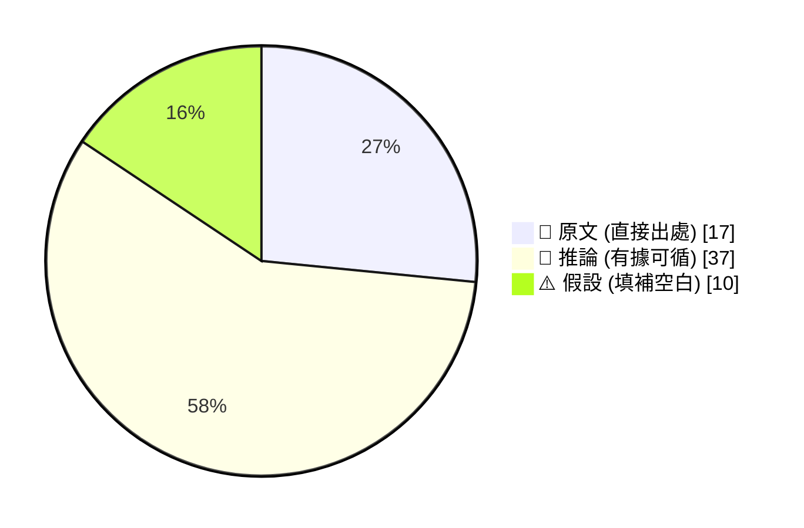

_引用規範：📖 可直接引用；🧠 客戶會議前查 verification hints；⚠️ 引用時明說「此為推測」_

## 🔄 本期 pipeline 處理流程

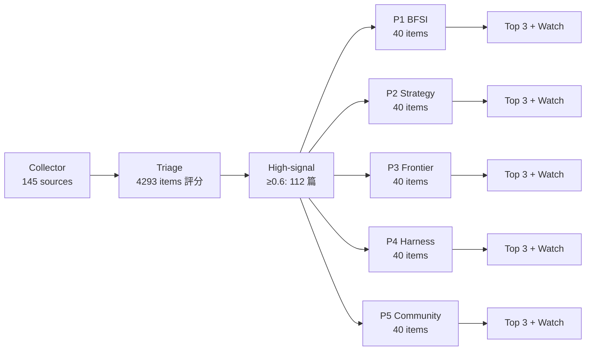

## 📑 目錄
- [Pillar 1 — 產業 AI 真實落地 (BFSI + 製造業)](#pillar-1) · 25 items · $0.0948
- [Pillar 2 — AI 戰略 / 治理 / 董事會層級論述](#pillar-2) · 13 items · $0.0688
- [Pillar 3 — Frontier 能力 + 模型動向](#pillar-3) · 23 items · $0.0779
- [Pillar 4 — Harness Engineering 實作技藝](#pillar-4) · 40 items · $0.1028
- [Pillar 5 — 學派 / 社群 / 思想動態](#pillar-5) · 11 items · $0.0579
- [📚 Foundation 深讀](#foundation) · curriculum 主題深度文


---

<a id="pillar-1"></a>

## 🏦 Pillar 1 — 產業 AI 真實落地 (BFSI + 製造業)
_25 items · $0.0948_

## Pulse — Top 3

### 1. 微軟 MDASH 多模型代理安全系統：真實找出 16 個 Windows 漏洞，不是 demo

📖 **原文** 微軟本週公開代號 MDASH（Multi-model Defensive Agentic Security Harness）的系統，由多個 AI 模型協同運作，成功找出 Windows 網路與驗證功能的 16 項新漏洞——時間點緊接在 Anthropic Claude Mythos 及 OpenAI Daybreak 之後，三家頂級廠商同週展示 AI 找漏洞能力絕非巧合。

🧠 **推論** 對台灣銀行與製造業 IT 團隊而言，這個 pattern 的意義是：agentic security scanning 已從研究階段進入可交付成果的 production，意味著現有的 penetration testing 預算與流程必須重新評估。

🧠 **推論** MDASH 的「多模型」架構（推測為 orchestrator + specialist agents 分工）與 LangChain 的 due diligence agent 設計邏輯一致，顯示 multi-agent orchestration 正在快速成為企業安全的標準 deployment pattern。

以下為 MDASH 推測架構流程：

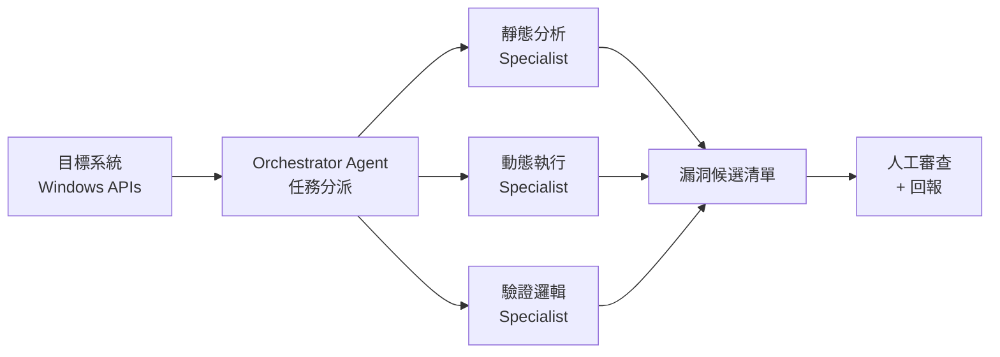

*多模型分工讓各 specialist agent 聚焦單一攻擊面，orchestrator 彙整結果後才進入人工審查——關鍵洞察：人工介入點後移，但並未消失。*

- 來源：[iThome](https://www.ithome.com.tw/news/175802)（供應鏈攻擊）及 [iThome](https://www.ithome.com.tw/news/175805)（MDASH）
- 對客戶的具體含意：向國泰、中信、台新資安長提案時，可以用「微軟自己的 production 系統已找到 16 個真實漏洞」作為 agentic security 投資的具體錨點，而非理論可行性。

**(English)** Microsoft MDASH multi-model agentic security system finds 16 real Windows vulnerabilities — not a demo

📖 **原文** Microsoft this week disclosed MDASH, a multi-model agentic security system that found 16 new vulnerabilities in Windows networking and authentication — released in the same week as Anthropic Claude Mythos and OpenAI Daybreak, making the timing clearly coordinated.

🧠 **推論** For Taiwan bank and manufacturer IT teams, the signal is that agentic security scanning has moved from research to deliverable production: existing penetration testing budgets and workflows need re-evaluation.

🧠 **推論** MDASH's multi-model architecture (likely orchestrator + specialist agents) mirrors LangChain's due diligence agent design logic, suggesting multi-agent orchestration is rapidly becoming the default enterprise security deployment pattern.

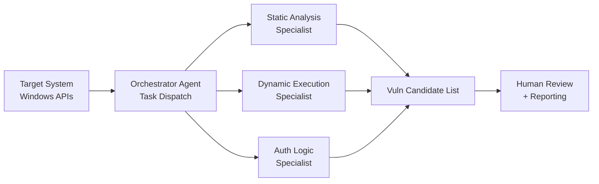

*Multi-model division of labour lets each specialist agent focus on one attack surface; the orchestrator consolidates before human review — key insight: human-in-the-loop moves later in the chain, but does not disappear.*

- Source: [iThome — Mistral supply-chain attack](https://www.ithome.com.tw/news/175802) and [iThome — MDASH](https://www.ithome.com.tw/news/175805)
- Client implication: When pitching to Cathay, CTBC, or Taishin CISOs, use "Microsoft's own production system found 16 real vulnerabilities" as a concrete ROI anchor for agentic security investment, not a theoretical promise.

---

### 2. LangChain 金融盡職調查 Agent：PE、信貸、合規、保險核保四大場景的 production orchestration 範本

📖 **原文** LangChain 發布以 Deep Agents、LangSmith 與 parallel orchestration 構建的企業盡職調查 agent，明確點名四個金融服務場景：PE 分析師篩選交易、銀行信貸團隊評估借款人、合規團隊新實體 onboarding、保險核保評估商業客戶。每個場景的流程結構相同：輸入公司名稱 → 多維度調查 → 輸出結構化情報報告，所有 claim 均附來源。

🧠 **推論** 這份 blog 的價值不在新概念，而在於它是一份可直接搬進 Livia 客戶提案的 reference architecture——台灣銀行的 KYC/AML 流程、企業金融授信審查、與 insurance underwriting 都可以對號入座。

🧠 **推論** Parallel orchestration 在此的意義是：多個 web intelligence sub-agents 同時執行，最後彙整為結構化報告，比序列式 RAG pipeline 快且覆蓋面廣，但 hallucination 控制需要 LangSmith 的 trace-level monitoring 配套。

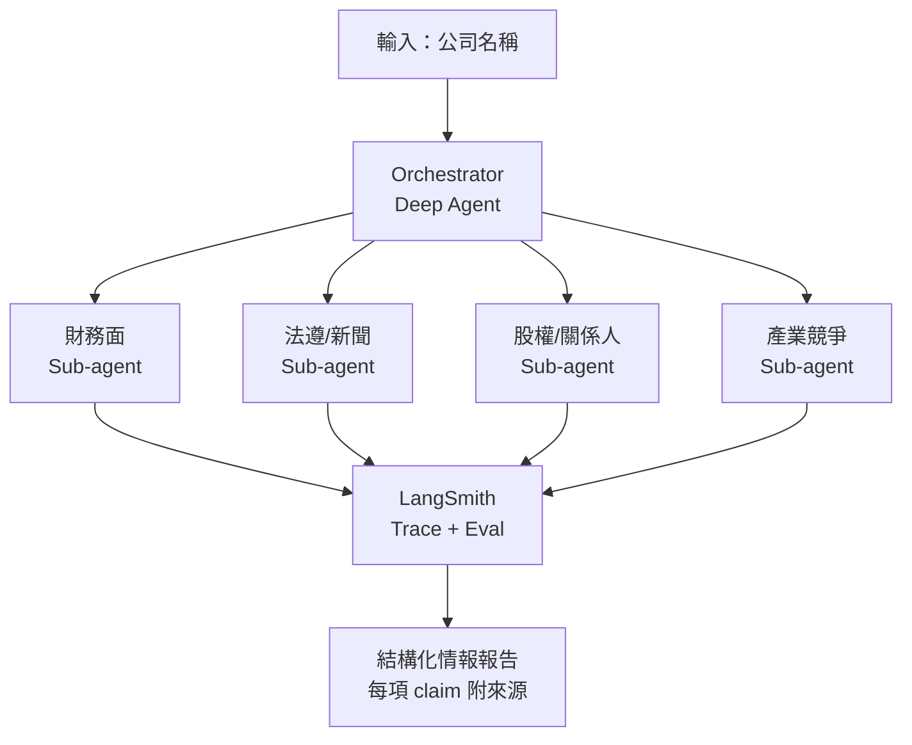

*Parallel sub-agents 同步執行後由 LangSmith 統一 trace，關鍵洞察：結構化輸出 + 可稽核的 claim 鏈是金融合規場景的最低門檻，缺一不可。*

- 來源：[LangChain Blog](https://www.langchain.com/blog/building-a-company-due-diligence-agent-with-deep-agents-langsmith-and-parallel)
- 對客戶的具體含意：對 E.SUN 或台北富邦企金團隊，直接用這個架構圖說明「AI 授信調查 agent」的 MVP 設計，強調 LangSmith trace 是法遵可稽核性的技術解，而非可選配件。

**(English)** LangChain financial due diligence agent: production orchestration reference for PE, credit, compliance, and insurance underwriting

📖 **原文** LangChain published a due diligence agent built with Deep Agents, LangSmith, and parallel orchestration, explicitly naming four financial services scenarios: PE deal screening, bank credit team borrower assessment, compliance entity onboarding, and insurance underwriting. The pattern is identical across all four: input a company name → multi-dimensional investigation → structured intelligence report with sourced claims.

🧠 **推論** The value of this blog post is not novelty but reference architecture — Taiwan banks' KYC/AML workflows, corporate credit review, and insurance underwriting all map directly onto this pattern.

🧠 **推論** Parallel orchestration here means multiple web intelligence sub-agents run concurrently before consolidation, which is faster and broader than sequential RAG pipelines, but hallucination control requires LangSmith trace-level monitoring as a non-negotiable companion.

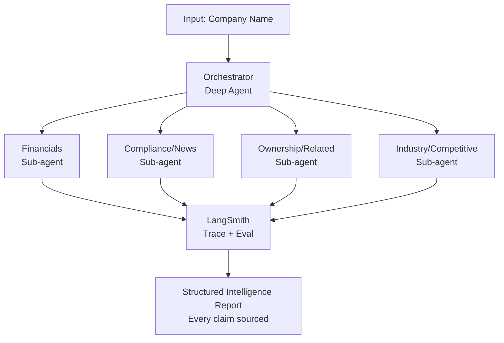

*Parallel sub-agents execute concurrently, consolidated through LangSmith tracing — key insight: structured output + auditable claim chains are the minimum bar for financial compliance use cases, not optional.*

- Source: [LangChain Blog](https://www.langchain.com/blog/building-a-company-due-diligence-agent-with-deep-agents-langsmith-and-parallel)
- Client implication: With E.SUN or Taipei Fubon corporate banking teams, use this architecture diagram directly to define an "AI credit investigation agent" MVP, and position LangSmith tracing as the technical solution for regulatory auditability — not a nice-to-have.

---

### 3. 台積電 CoWoS 產能逾 80% 供 AI，N2 首年良率優於 N3——AI 硬體供應鏈的真實錨點數據

📖 **原文** 台積電在 2026 Tech Symposium 公開表示，CoWoS 先進封裝產能目前已有超過 80% 用於 AI 相關應用；同場次亦揭示 N2 製程首年產出優於 N3 當年同期表現，並展示從 CPO（Co-Packaged Optics）封裝到矽光子 COUPE 技術的路徑圖，以光電整合突破 AI 伺服器資料傳輸的銅線物理極限。

🧠 **推論** 對 Livia 在台灣製造業客戶（Foxconn、Wistron、Quanta 等 ODM）的對話而言，這兩個數據是有力的現實錨點：AI 伺服器需求已結構性吃掉先進封裝產能，代工廠與 ODM 的資本支出決策不是「是否要跟 AI」而是「如何搶到台積電的封裝產能配額」。

🧠 **推論** CoWoS 供不應求的狀態持續，意味著 NVIDIA GB200/B300 系列的出貨仍受封裝產能制約，這對台灣 ODM 的 AI server 毛利率有直接影響——產能稀缺時議價能力往上游集中。

- 來源：[INSIDE 硬塞 — TSMC Tech Symposium](https://www.inside.com.tw/article/41294-tsmc-2026-tech-symposium)、[科技新報 — CPO/矽光子](https://technews.tw/2026/05/14/tsmc-reveals-its-technology-layout-from-cpo-packaging-to-silicon-photonics-coupe/)
- 對客戶的具體含意：與 Foxconn 或 Quanta AI server BU 討論 AI 轉型路徑時，CoWoS >80% AI 佔比是具體的投資優先序佐證，可用於說明為何 AI infrastructure 布局不能等。

**(English)** TSMC CoWoS capacity >80% for AI, N2 first-year yield beats N3 — concrete anchor data for the AI hardware supply chain

📖 **原文** TSMC disclosed at the 2026 Tech Symposium that over 80% of CoWoS advanced packaging capacity is now allocated to AI applications; the same event revealed N2 first-year production yields exceed N3's at the same stage, and a roadmap from CPO (Co-Packaged Optics) packaging to silicon photonic COUPE technology to overcome copper interconnect limits for AI server data transfer.

🧠 **推論** For Livia's conversations with Taiwan manufacturing clients (Foxconn, Wistron, Quanta and other ODMs), these two data points are powerful reality anchors: AI server demand has structurally consumed advanced packaging capacity, and the question for contract manufacturers and ODMs is no longer "whether to follow AI" but "how to secure a CoWoS capacity allocation from TSMC."

🧠 **推論** With CoWoS remaining supply-constrained, NVIDIA GB200/B300 series shipments continue to be gated by packaging throughput, which directly impacts Taiwan ODM AI server margins — when capacity is scarce, pricing power concentrates upstream.

- Source: [INSIDE 硬塞 — TSMC Tech Symposium](https://www.inside.com.tw/article/41294-tsmc-2026-tech-symposium), [TechNews — CPO/Silicon Photonics](https://technews.tw/2026/05/14/tsmc-reveals-its-technology-layout-from-cpo-packaging-to-silicon-photonics-coupe/)
- Client implication: When discussing AI transformation roadmaps with Foxconn or Quanta AI server BUs, the CoWoS >80% AI allocation figure is concrete investment prioritisation evidence — use it to make the case that AI infrastructure positioning cannot wait.

---

## Watch list

繁中為主，每條一行：

- [iThome — AI 自主網攻能力每 4.7 個月翻倍](https://www.ithome.com.tw/news/175789) — 英國 AISI 量化 AI 資安任務自主能力成長率，Claude Mythos / GPT-5.5 已超出預測趨勢，對銀行資安評估框架直接相關
- [UiPath for Coding Agents](https://www.ithome.com.tw/news/175769) — 將 Claude Code / OpenAI Codex 納入企業 governance 流程（測試、部署、稽核），是製造業 RPA 升級為 agentic 的實際落地路徑
- [Anthropic Agent SDK 計費調整](https://www.ithome.com.tw/news/175787) — 6/15 起 programmatic 用量改走獨立月額度，影響所有正在 PoC agent 的企業客戶成本試算
- [iThome — Mistral PyPI 套件供應鏈攻擊](https://www.ithome.com.tw/news/175802) — 2.4.6 版被植入惡意程式，ML 團隊若有 Mistral 相依需立即檢查 pip 環境
- [CIO Taiwan — 影子代理人威脅](https://www.cio.com.tw/112930/) — 企業未授權 agentic AI 部署風險框架，適合作為董事會級 AI governance 簡報素材
- [漢翔 AIxSISAS 供應鏈資安評級系統](https://www.ithome.com.tw/news/175813) — 台灣國防製造商將 CMMC 2.0 合規轉為可執行系統，對 TSMC / Foxconn 供應鏈合規有參考價值
- [Pathors 亞洲語音 AI 基礎設施](https://www.inside.com.tw/article/41271-2026-pathors-interview) — 針對亞洲電信整合與地端部署痛點的語音 AI，銀行客服場景直接適用
- [工研院 90 分鐘 AI 模型檢測技術](https://technews.tw/2026/05/14/itri-technology-90-minutes-ai-model-testing-reduces-enterprise-costs/) — 原需兩週的 AI 評測縮至 90 分鐘，台灣製造業採購 AI 模型時的驗收成本大幅下降
- [OpenAI Codex 金融團隊應用](https://openai.com/academy/how-finance-teams-use-codex) — MBR、variance bridge、model check 具體場景，可直接用於銀行財務報告自動化提案
- [Shopify River coding agent 全公開頻道設計](https://simonwillison.net/2026/May/11/learning-on-the-shop-floor/#atom-everything) — 強制公開對話的 organizational transparency pattern，對企業 AI adoption 文化設計有借鑒意義
- [Amazon Alexa for Shopping agentic 購物](https://www.inside.com.tw/article/41293-amazon-alexa-ai-shopping-assistant) — 消費端 agentic commerce 正式上線，對台灣零售金融與支付場景的影響值得追蹤
- [Siemens Teamcenter BoM 效能提升 20X](https://blog.siemens.com/2026/05/turn-complexity-to-competitive-advantage-with-modernized-data-foundations/) — 製造業 AI 採用的資料基礎建設前提，GM 等 OEM 的案例可用於說服台灣 ODM 優先整頓資料底層

---

## Verification hints

This briefing contains **6

🧠 **推論** segments** and **0

⚠️ **假設** segments**. Before citing in client conversations, verify these specific points:

1. **MDASH architecture specifics**: The iThome article confirms MDASH exists and found 16 vulnerabilities, but does not describe internal architecture. The "orchestrator + specialist agents" model is inferred from general multi-model agent patterns — verify against Microsoft's own MDASH technical writeup or Security Blog before presenting the flowchart as fact to clients.
2. **MDASH naming**: "Multi-model Defensive Agentic Security Harness" is an expansion inferred from the acronym and context — the iThome source uses "多模型代理式AI安全系統" but does not confirm the English expansion. Do not use the spelled-out name in client presentations without checking Microsoft's official release.
3. **TSMC CoWoS >80% figure**: Sourced from INSIDE 硬塞 reporting on TSMC Tech Symposium — verify the exact quote and whether "80%" refers to capacity utilisation, revenue share, or wafer allocation before using in financial analysis contexts with manufacturing clients.
4. **N2 yield vs N3 comparison**: The INSIDE article states N2 first-year output exceeds N3 at same stage — verify the specific metric (wafer yield rate vs. volume output vs. revenue per wafer) and the baseline date for "first year" in TSMC's official symposium materials.
5. **LangChain "parallel orchestration" claim**: The blog post title references parallel execution but the excerpt does not detail the concurrency model. The claim that sub-agents run truly in parallel (vs. pseudo-parallel with async calls) should be verified in the actual LangSmith trace documentation before presenting latency benefits to clients.
6. **AI autonomous cybersecurity task doubling rate (4.7 months)**: Sourced from iThome reporting on UK AISI's "Cyber Time Horizons" benchmark — verify the methodology (what counts as a "task length," how human expert baseline is measured) at the [original AISI report](https://www.ithome.com.tw/news/175789) before citing the doubling rate in board-level risk briefings.2026-05-14 23:38:32,072 INFO pillar 2 (AI 戰略 / 治理 / 董事會層級論述): 13 high-signal items (min_signal=0.60)

---

<a id="pillar-2"></a>

## 📊 Pillar 2 — AI 戰略 / 治理 / 董事會層級論述
_13 items · $0.0688_

## Pulse — Pillar 2: AI 戰略 / 治理 / 董事會層級論述

---

## Pulse — Top 3

### 1. 「影子代理人」威脅：Agentic AI 正在瓦解企業傳統資安邊界

🧠 **推論** 隨著 Agentic AI 快速滲透企業流程，傳統以邊界防禦（perimeter defense）為核心的資安架構已無法應對「影子代理人（shadow agents）」——即未經 IT 核准、自主執行任務的 AI agent。CIO Taiwan 的報導指出，agentic AI 帶來的風險不只是資料外洩，而是整個授權邊界的崩解：agent 可以在無人監督下呼叫 API、存取資料庫、甚至代表企業簽署動作。對 Livia 的台灣銀行客戶（如國泰、玉山、中信）而言，這直接碰觸到 FSC（金管會）對 AI 部署的監理要求，亦是董事會層級必須正視的 operational risk 議題。對 harness 實作而言，runtime governance 工具（如 LangSmith LLM Gateway，見 item 406）應被納入 agent pipeline 的標準配備。

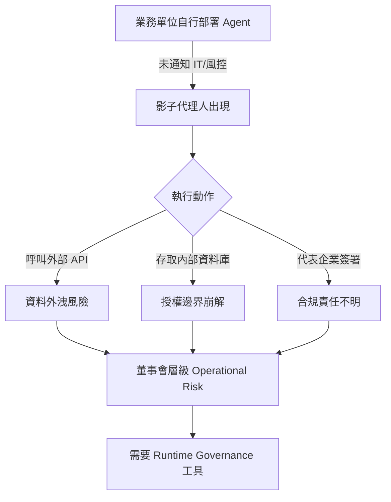

上圖說明影子代理人的三條風險路徑最終匯聚為董事會無法迴避的 operational risk，關鍵洞察：風險源頭是部署流程缺乏治理，而非模型本身。

- 來源：[CIO Taiwan](https://www.cio.com.tw/112930/)
- 對客戶的具體含意：向國泰、玉山等銀行 CISO 提案時，以「影子代理人」作為切入點——要求任何 AI agent 上線前必須通過 IT 審查與 runtime monitoring 閘道，可直接對應金管會 AI 治理指引中的可問責性要求。

**(English)** **"Shadow Agents" Threat: Agentic AI Is Dissolving Enterprise Security Perimeters**

🧠 **推論** As Agentic AI rapidly penetrates enterprise workflows, traditional perimeter-based security architectures can no longer handle "shadow agents" — AI agents deployed without IT authorization that execute tasks autonomously. CIO Taiwan's report argues the risk extends beyond data leakage to a complete collapse of the authorization boundary: agents can call APIs, access databases, and take actions on behalf of the enterprise with no human oversight. For Livia's Taiwan bank clients (Cathay, E.SUN, CTBC), this directly intersects with FSC regulatory requirements for AI deployment and is an operational risk topic that cannot stay below board level. For harness engineering, runtime governance tooling (e.g., LangSmith LLM Gateway, item 406) should be standard equipment in any agent pipeline.


The diagram shows three risk pathways from shadow agents converging into board-level operational risk; the key insight is that the root cause is governance gaps in deployment processes, not model behavior.

- Source: [CIO Taiwan](https://www.cio.com.tw/112930/)
- Client implication: When pitching to Cathay or E.SUN CISOs, use "shadow agents" as the entry point — requiring any AI agent to pass IT review and a runtime monitoring gateway maps directly to the accountability requirements in the FSC's AI governance guidelines.

---

### 2. EU AI Act Article 50 透明度規定：2026 年 8 月截止，台灣出口企業不可忽視

📖 **原文** EU AI Act Article 50 要求 AI 系統的 providers 與 deployers 在 2026 年 8 月前完成透明度合規義務，包括向用戶揭露其正在與 AI 互動、deepfake 內容標記等。

🧠 **推論** 對 Livia 的製造業客戶（如台積電、鴻海、和碩）而言，凡是向歐洲客戶或市場部署的 AI 系統——不論是客服 bot、銷售工具或合約自動化——均在規管範圍內。這不是遙遠的監管風險，而是三個月後的 hard deadline。值得注意的是，Article 50 的合規成本相對低（主要是 disclosure 標籤與 metadata），但若未遵守，品牌風險與潛在罰款可能遠高於合規投資。這也是向董事會提案「AI 治理基礎建設」預算的現成理由。

- 來源：[EU AI Act Tracker](https://artificialintelligenceact.eu/transparency-rules-article-50/)
- 對客戶的具體含意：建議台灣製造業客戶立即盤點所有面向歐洲市場的 AI 部署，對照 Article 50 checklist，並在 Q2 董事會提出合規報告，以免 2026 年 8 月後的查核措手不及。

**(English)** **EU AI Act Article 50 Transparency Rules: August 2026 Deadline That Taiwan Export-Facing Firms Cannot Ignore**

📖 **原文** The EU AI Act's Article 50 requires AI system providers and deployers to fulfill transparency obligations by August 2026, including disclosing to users that they are interacting with AI and labeling deepfake content.

🧠 **推論** For Livia's manufacturing clients (TSMC, Foxconn, Pegatron), any AI system deployed toward European customers or markets — whether a customer service bot, sales tool, or contract automation system — falls within scope. This is not a distant regulatory risk; it is a hard deadline three months away. Notably, Article 50 compliance costs are relatively low (primarily disclosure labels and metadata), but non-compliance carries brand risk and potential fines far exceeding the compliance investment. This is also a ready-made justification for proposing an "AI governance infrastructure" budget line to the board.

- Source: [EU AI Act Tracker](https://artificialintelligenceact.eu/transparency-rules-article-50/)
- Client implication: Advise Taiwan manufacturing clients to immediately audit all AI deployments facing European markets against the Article 50 checklist, and to table a compliance report at Q2 board meetings before the August 2026 deadline catches them unprepared.

---

### 3. OpenAI 成立 DeployCo：前沿 AI 正式進入企業「最後一哩路」競爭

📖 **原文** OpenAI 宣布成立 DeployCo，一個專注於協助企業將前沿 AI 帶入 production、轉化為可量化商業成果的獨立部署公司。

🧠 **推論** 這是一個值得董事會關注的市場結構信號：OpenAI 不再只賣 API，而是直接進入企業整合與 change management 的領域——過去這是 IBM、Accenture、系統整合商的核心地盤。對 Livia 而言，這既是威脅（競爭者直接切入她的顧問角色），也是機會（DeployCo 的存在驗證了市場對「AI 落地專業服務」的真實需求，有助於向銀行 CIO 說明為何需要外部 AI 轉型顧問）。目前尚無公開的客戶名單或具體架構案例，DeployCo 的實際交付能力需觀察後續公告。

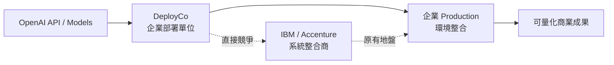

上圖顯示 DeployCo 插入傳統 SI（系統整合商）與企業客戶之間的位置；關鍵洞察：OpenAI 正在垂直整合 model 層與 deployment 層，壓縮中間商空間。

- 來源：[OpenAI Blog](https://openai.com/index/openai-launches-the-deployment-company)
- 對客戶的具體含意：向台灣銀行 CIO 提案時，可以 DeployCo 的成立為佐證——連 OpenAI 自己都認為 AI 落地需要專屬部署能力，這正是聘用具備本地監理知識與行業 know-how 的 AI 顧問的理由。

**(English)** **OpenAI Launches DeployCo: Frontier AI Enters the Enterprise "Last Mile" Race**

📖 **原文** OpenAI announced DeployCo, a new enterprise deployment company focused on helping organizations bring frontier AI into production and convert it into measurable business outcomes.

🧠 **推論** This is a market structure signal worth board-level attention: OpenAI is no longer only selling APIs — it is moving directly into enterprise integration and change management, which has historically been the core territory of IBM, Accenture, and system integrators. For Livia, this is simultaneously a threat (a competitor moving into her consulting role) and a validation (DeployCo's existence confirms real market demand for "AI productionization services," which helps justify to bank CIOs why they need an external AI transformation advisor). No public client list or concrete architecture case studies have been announced yet; DeployCo's actual delivery capability warrants watching.


The diagram shows DeployCo inserting itself between traditional SIs and enterprise clients; the key insight is that OpenAI is vertically integrating the model layer with the deployment layer, compressing the middleman space.

- Source: [OpenAI Blog](https://openai.com/index/openai-launches-the-deployment-company)
- Client implication: When pitching to Taiwan bank CIOs, use DeployCo's launch as evidence — even OpenAI recognizes that AI productionization requires dedicated deployment capability, which is precisely the argument for engaging an advisor with local regulatory knowledge and industry know-how.

---

## Watch list

繁中為主，每條一行：
- [LangSmith LLM Gateway (LangChain)](https://www.langchain.com/blog/introducing-llm-gateway) — runtime governance 直接整合 agent lifecycle：spend limits、PII redaction、trace continuity，harness 實作者應評估納入標準工具鏈
- [Import AI 456 (Jack Clark)](https://jack-clark.net/2026/05/11/import-ai-456-rsi-and-economic-growth-radical-optionality-for-ai-regulation-and-a-neural-computer/) — 「Radical Optionality」監管框架：政府應現在就投資危機工具，而非等待立法，為台灣科技政策對話提供論述彈藥
- [xAI/Anthropic Colossus 資料中心協議 (Simon Willison)](https://simonwillison.net/2026/May/7/xai-anthropic/#atom-everything) — Anthropic 使用 xAI Colossus 算力，但該設施有違反 Clean Air Act 前科，對有 ESG 承諾的企業客戶是採購風險信號
- [Did xAI concede the AI race? (Platformer)](https://www.platformer.news/did-xai-just-concede-the-ai-race/) — Musk 與 Anthropic 的協議被解讀為 xAI 落後承認，戰略格局重組信號，影響客戶對 AI 供應商長期押注的判斷
- [Anthropic 10x 成長 vs. 業界裁員 (Latent Space)](https://www.latent.space/p/ainews-anthropic-growing-10xyear) — AI 勞動市場兩極分化：Anthropic 大幅擴張、其他業者裁員逾 10%，暗示 frontier model 公司正在集中市場影響力
- [NVIDIA + SAP Specialized Agents (NVIDIA Blog)](https://blogs.nvidia.com/blog/sap-specialized-agents/) — SAP Sapphire 發布 enterprise agent governance 協作方案，但 shipped vs. roadmap 界線不清，需追蹤後續
- [GitLab Act 2 (Simon Willison)](https://simonwillison.net/2026/May/11/gitlab-act-2/#atom-everything) — GitLab 以「agentic era」為由裁員並縮減國家覆蓋，是 AI 驅動組織重組的真實案例，可作為董事會討論勞動力策略的參照
- [OpenAI Codex 安全運行 (OpenAI Blog)](https://openai.com/index/running-codex-safely) — sandboxing、approvals、network policies 的 production safety pattern，製造業與銀行 IT 治理的具體參考
- [ChatGPT 敏感對話情境辨識更新 (OpenAI Blog)](https://openai.com/index/chatgpt-recognize-context-in-sensitive-conversations) — context-aware 風險偵測的 safety governance 更新，銀行客服 bot 部署的相關性待確認

---

## Verification hints

This briefing contains **4

🧠 **推論**** segments and **0

⚠️ **假設**** segments. Before citing in client conversations, verify these specific points (English for language-learning practice):

1. **CIO Taiwan "shadow agents" article (item 2658)**: The article references Agentic AI risk frameworks, but does not specify which regulatory body (FSC or otherwise) has issued formal guidance on shadow agents in Taiwan. Before citing FSC alignment to bank clients, verify whether the FSC has published explicit AI agent governance guidance and cross-reference with the article's actual sourcing.
2. **EU AI Act Article 50 August 2026 deadline (item 2303)**: The EU AI Act Tracker states the deadline applies to "providers and deployers" — verify whether Taiwan-headquartered manufacturers deploying AI *only* to B2B European enterprise clients (not end consumers) fall within the Article 50 scope, as B2B vs. B2C applicability has nuances in the Act's definitions.
3. **OpenAI DeployCo (item 112)**: The announcement excerpt describes DeployCo's mandate but contains no confirmed client names, pricing model, or geographic focus (e.g., whether Taiwan/Asia-Pacific is in scope). Before using this to frame competitive positioning against IBM in Taiwan bank pitches, verify whether DeployCo has announced any Asia operations or partners.
4. **Anthropic Colossus environmental record (item 368, Watch list)**: Simon Willison's note states gas turbines ran without Clean Air Act permits "initially" — verify the current compliance status of the Colossus facility before citing this as an ongoing ESG risk to clients with active Anthropic procurement discussions.2026-05-14 23:39:46,499 INFO pillar 3 (Frontier 能力 + 模型動向): 23 high-signal items (min_signal=0.60)

---

<a id="pillar-3"></a>

## 🚀 Pillar 3 — Frontier 能力 + 模型動向
_23 items · $0.0779_

## Pulse — Top 3

### 1. AI2 EMO：12.5% 的 experts 保留近乎完整模型效能——MoE 架構的部署典範轉移

📖 **原文** Allen Institute for AI 發布 EMO（Emergent Modularity），一個端對端預訓練的 mixture-of-experts 模型，其模組化結構完全從資料中自然湧現，無需人工定義 expert 分組。關鍵數據：只需啟用 **12.5% 的 experts** 即可在特定任務上維持接近完整模型的效能，同時整體模型仍可作為強力通用模型使用。

🧠 **推論** 對 Livia 的金融與製造業客戶而言，這代表同一個 base model 可依任務動態縮減推論成本，不必在「專用小模型 vs. 通用大模型」之間二選一——這正是 on-premises 或 private cloud 部署場景中最常被提出的 cost/capability trade-off 問題。

以下架構說明 EMO 如何在單一模型內實現「按需啟用」的 expert 子集選擇：

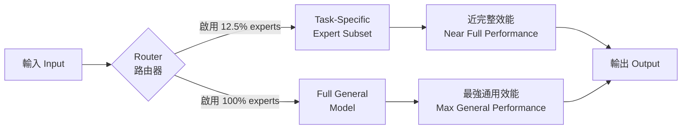

*關鍵洞察：同一個 EMO 模型可在「任務專精低成本」與「通用高效能」之間動態切換，無需分開部署兩套系統。*

- 來源：[Hugging Face Blog — EMO](https://huggingface.co/blog/allenai/emo) / [AI2 Blog — EMO](https://allenai.org/blog/emo)
- 對客戶的具體含意：向 Cathay 或 E.SUN 提案時，EMO 架構可直接回應「為何不直接 fine-tune 小模型就好」的質疑——答案是：EMO 讓你用一套模型同時覆蓋法規摘要、客服、風控等多任務，且推論成本可按任務動態調低至 12.5%。

**(English)** AI2 EMO: 12.5% of experts preserves near-full model performance — a deployment paradigm shift for MoE

[Original] Allen Institute for AI has released EMO (Emergent Modularity), a mixture-of-experts model trained end-to-end so that modular expert groupings emerge directly from data, without any human-defined priors. The headline number: activating just **12.5% of total experts** is sufficient to match near full-model performance on task-specific workloads, while the complete model remains usable as a strong general-purpose system. [Inference] For Livia's banking and manufacturing clients, this means a single base model can dynamically reduce inference cost per task type — eliminating the classic "dedicated small model vs. large general model" binary. That trade-off is exactly the friction point in on-premises or private-cloud deployments at institutions like CTBC or Foxconn.


*Key insight: one EMO model dynamically switches between low-cost task-specific and high-performance general modes — no separate deployments required.*

- Source: [Hugging Face Blog — EMO](https://huggingface.co/blog/allenai/emo) / [AI2 Blog — EMO](https://allenai.org/blog/emo)
- Client implication: When a Taiwan bank asks "why not just fine-tune a smaller model," EMO's architecture gives a concrete answer — one model covers compliance summarization, customer service, and credit risk with dynamically adjustable inference cost down to 12.5%.

---

### 2. Mozilla 用 Claude Mythos Preview 找到並修復 Firefox 中「數百個」漏洞——frontier model 安全實戰驗證

📖 **原文** Mozilla 透過 Claude Mythos（Anthropic 的 frontier preview 模型）存取權限，在 Firefox 中定位並修復了數百個漏洞。Simon Willison 的報導引述原文：「Suddenly, the bugs are very good」——對比幾個月前 AI 生成的安全報告大多是「看起來合理但實際上錯的 slop」，這代表模型能力發生了質變。

🧠 **推論** 這個案例之所以對 Livia 的銀行客戶高度相關，在於它是 **production codebase + frontier model + security domain** 三者結合的真實驗證，而非 benchmark 分數。台灣銀行的 IT 部門長期面臨 legacy system 漏洞清查的人力瓶頸，這個模式直接對應該場景。

🧠 **推論** Mythos 尚未公開發布，但 Mozilla 的結果暗示下一代 Claude 在 code reasoning 上有顯著躍升——值得在 Anthropic 客戶對話中主動提出。

- 來源：[Simon Willison — Behind the Scenes Hardening Firefox with Claude Mythos Preview](https://simonwillison.net/2026/May/7/firefox-claude-mythos/#atom-everything)
- 對客戶的具體含意：對正在評估 AI 用於 legacy core banking system 安全審計的 Mega Bank 或 First Bank IT 主管，Mozilla/Firefox 案例是可直接引用的同類型（大型 codebase、高安全要求）先例。

**(English)** Mozilla used Claude Mythos Preview to find and fix "hundreds" of Firefox vulnerabilities — frontier model security capability validated in production

[Original] Mozilla, with early access to Claude Mythos (Anthropic's frontier preview model), located and fixed hundreds of vulnerabilities in Firefox. Simon Willison's write-up quotes the original report: "Suddenly, the bugs are very good" — a qualitative leap from just months earlier when AI-generated security reports were mostly "plausible-looking slop" that imposed asymmetric cost on maintainers to triage. [Inference] This case is highly relevant to Livia's banking clients precisely because it represents a real-world validation of **production codebase + frontier model + security domain** — not a benchmark score. Taiwan banks' IT teams routinely face a staffing bottleneck in legacy system vulnerability audits; this pattern maps directly to that scenario. [Inference] Mythos is not yet publicly available, but Mozilla's results signal a meaningful step-change in Claude's code reasoning capability — worth raising proactively in Anthropic-track client conversations.

- Source: [Simon Willison — Behind the Scenes Hardening Firefox with Claude Mythos Preview](https://simonwillison.net/2026/May/7/firefox-claude-mythos/#atom-everything)
- Client implication: For Mega Bank or First Bank IT heads evaluating AI for legacy core banking security audits, the Mozilla/Firefox case is a directly citable precedent with the same profile — large codebase, high-stakes security requirements.

---

### 3. Thinking Machines Lab（Mira Murati）發布 Interaction Models：multimodal 即時協作不再靠 external scaffolding

📖 **原文** Mira Murati 創辦的 Thinking Machines Lab 宣布 **interaction models** 的 research preview：模型原生處理 audio、video、text 的即時輸入，持續思考、回應與行動，而非透過外部 scaffolding 拼湊多模態能力。核心主張：「interactivity should scale alongside intelligence」——互動能力應與模型智能同步提升，而非事後加上去。

🧠 **推論** 對 harness 工程師 Livia 而言，這個架構意涵很直接：目前需要靠 orchestration layer 串接 speech-to-text → LLM → text-to-speech 的 pipeline，未來可能被單一 interaction model 取代，大幅降低 latency 與 failure surface。

⚠️ **假設** 此為 research preview，商業可用時程與 API 設計細節尚未公開，實際部署架構需待正式文件。

以下比較現有 scaffolded 架構與 native interaction model 的差異：

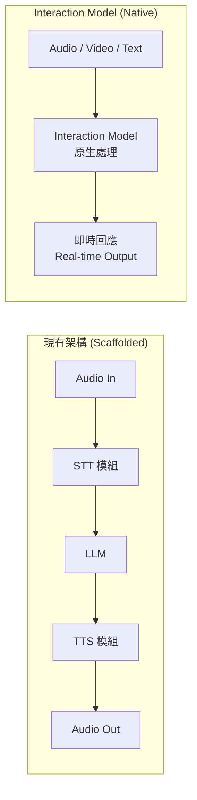

*關鍵洞察：原生互動模型消除了 scaffolded pipeline 中每個接縫處的 latency 與錯誤傳播點。*

- 來源：[Thinking Machines Lab — Interaction Models](https://thinkingmachines.ai/blog/interaction-models/)
- 對客戶的具體含意：台灣銀行正在評估的語音客服 AI 方案若採用 interaction model 架構，可跳過 STT/TTS 拼接的整合複雜度，是值得在 RFP 需求書中預留「原生多模態」選項的理由。

**(English)** Thinking Machines Lab (Mira Murati) releases Interaction Models: native multimodal real-time collaboration without external scaffolding

[Original] Thinking Machines Lab, founded by Mira Murati, announced a research preview of **interaction models**: models that natively process audio, video, and text in real time — continuously thinking, responding, and acting — rather than stitching multimodal capability together through external scaffolding. The core claim: "interactivity should scale alongside intelligence," meaning interaction capability should be a first-class training objective, not an afterthought. [Inference] For Livia as a harness engineer, the architectural implication is direct: today's orchestration-layer pipelines that chain speech-to-text → LLM → text-to-speech could be replaced by a single interaction model, substantially reducing latency and failure surface. [Assumption] This is a research preview; commercial availability timelines and API design details have not been published — actual deployment architecture requires waiting for official documentation.


*Key insight: native interaction models eliminate the latency and error propagation at every seam in a scaffolded pipeline.*

- Source: [Thinking Machines Lab — Interaction Models](https://thinkingmachines.ai/blog/interaction-models/)
- Client implication: Taiwan banks evaluating voice-based customer service AI should include "native multimodal" as a forward-looking requirement in RFPs — interaction model architecture removes the STT/TTS integration complexity that inflates today's project timelines.

---

## Watch list

繁中為主，每條一行：

- [OpenAI — GPT-5.5-Cyber](https://openai.com/index/gpt-5-5-with-trusted-access-for-cyber) — GPT-5.5-Cyber 專為漏洞研究設計並設 gating 機制，對 TSMC/銀行資安團隊的採購評估有直接參考價值
- [BAIR — Adaptive Parallel Reasoning](http://bair.berkeley.edu/blog/2026/05/08/adaptive-parallel-reasoning/) — 模型自主決定何時拆解並行子任務，inference scaling 新典範，影響 agentic pipeline 設計
- [Simon Willison — HTML over Markdown for Claude](https://simonwillison.net/2026/May/8/unreasonable-effectiveness-of-html/#atom-everything) — Anthropic 內部工程師主張用 HTML artifact 取代 Markdown 輸出，有具體 prompt 範例可直接用於 harness 實作
- [Latent Space — The End of Finetuning](https://www.latent.space/p/ainews-the-end-of-finetuning) — Shawn Wang 對 fine-tuning 存廢的立場文，與 EMO/instruction-following 趨勢合看有對話價值
- [IBM Granite Embedding Multilingual R2](https://huggingface.co/blog/ibm-granite/granite-embedding-multilingual-r2) — Apache 2.0、32K context、200+ 語言、97M 參數 MTEB 第一，台灣中文 RAG 場景可直接試用
- [NVIDIA + Ineffable Intelligence RL Infrastructure](https://blogs.nvidia.com/blog/ineffable-intelligence-reinforcement-learning-infrastructure/) — AlphaGo 設計者 David Silver 的新實驗室與 NVIDIA 合作 RL 基礎設施，值得追蹤下一代 agent 訓練方向
- [Simon Willison — xAI/Anthropic Data Center Deal](https://simonwillison.net/2026/May/7/xai-anthropic/#atom-everything) — Anthropic 取用 Colossus 全部算力，但該設施有未取得 Clean Air Act 許可的爭議，ESG 敏感的董事會需留意
- [OpenAI — New Voice Models in API](https://openai.com/index/advancing-voice-intelligence-with-new-models-in-the-api) — 新增具備 reasoning、translation、transcription 的 realtime voice API，語音客服 AI 評估時的 baseline 已提升
- [AI2 — IFBench Instruction Following Eval](https://allenai.org/blog/ifbench-artificial-analysis) — 捕捉多步驟指令遵循能力的 open eval，比較模型時比 MMLU 更貼近 production 場景

---

## Verification hints

This briefing contains **4

🧠 **推論**** segments and **1

⚠️ **假設**** segment. Before citing in client conversations, verify these specific points (English for language-learning practice):

1. **EMO's 12.5% expert figure**: Confirm from the [Hugging Face EMO post](https://huggingface.co/blog/allenai/emo) that the 12.5% activation number applies consistently across task types — or only on specific benchmark subsets. The excerpt does not specify which tasks were tested, and "near full-model performance" is a qualitative claim without a stated percentage drop.
2. **Mozilla/Firefox vulnerability count**: Simon Willison's post links to Mozilla's original report. Verify the actual number of vulnerabilities found and fixed, and whether "hundreds" was Mozilla's characterization or Willison's summary. Also confirm whether Mythos is Claude 4 or a distinct model line before using the name with clients.
3. **Thinking Machines Lab commercial timeline**: The post is explicitly labeled "research preview." Before including this in any bank RFP recommendation, verify from [thinkingmachines.ai](https://thinkingmachines.ai/blog/interaction-models/) whether an API access path, pricing, or production timeline has been announced — the excerpt and site may have been updated since triage.
4. **GPT-5.5-Cyber gating model**: The [OpenAI announcement](https://openai.com/index/gpt-5-5-with-trusted-access-for-cyber) describes a "Trusted Access" program. Before citing to bank security teams, verify eligibility criteria — whether Taiwan-based institutions qualify, and whether the gating is organization-type or geography-based.
5. **xAI/Colossus environmental compliance status**: Simon Willison notes the facility "initially ran without Clean Air Act permits." Verify from the [original post](https://simonwillison.net/2026/May/7/xai-anthropic/#atom-everything) whether permits have since been obtained — the compliance status may have changed, and citing outdated ESG risk to a board-level audience requires current facts.2026-05-14 23:41:06,532 INFO pillar 4 (Harness Engineering 實作技藝): 40 high-signal items (min_signal=0.60)

---

<a id="pillar-4"></a>

## 🛠️ Pillar 4 — Harness Engineering 實作技藝
_40 items · $0.1028_

## Pulse — Top 3

### 1. LangChain Interrupt 2026：Delta Channel、SmithDB、LLM Gateway、Managed Deep Agents 一週內全部 GA

🧠 **推論** LangChain 在 Interrupt 2026 會議密集發布生產級工具堆疊：DeltaChannel（LangGraph 1.2，O(N²) → O(N) checkpointing）、SmithDB（agent observability 專用分散式資料庫，宣稱最高 12x 效能提升）、LangSmith LLM Gateway（runtime 層的 spend limit + PII redaction + trace continuity），以及 Managed Deep Agents（durable execution + sandbox + LangSmith 一體化，private beta）。這不是功能迭代，而是 LangChain 把 Build → Test → Deploy → Monitor 整個 agent development lifecycle 的每個節點都補上了生產基礎建設。對正在評估 agent 架構的 Livia 而言，這代表 2026 H2 的 PoC 可以直接在這個堆疊上跑，不需要自建 observability 或 checkpoint 邏輯。

下圖說明 LangChain 新堆疊如何覆蓋 agent lifecycle 四個節點：

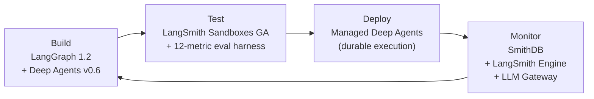

關鍵洞察：四個節點現在都有受管基礎建設支撐，PoC 到生產的摩擦點從「自建」轉為「選配」。

- 來源：[LangChain Interrupt 2026 Overview](https://www.langchain.com/blog/interrupt-2026-overview) ／ [Delta Channels](https://www.langchain.com/blog/delta-channels-evolving-agent-runtime) ／ [SmithDB](https://www.langchain.com/blog/introducing-smithdb) ／ [LLM Gateway](https://www.langchain.com/blog/introducing-llm-gateway) ／ [Managed Deep Agents](https://www.langchain.com/blog/introducing-managed-deep-agents)
- 對客戶的具體含意：向 Cathay、E.SUN 等銀行推 agent PoC 時，可以直接引用 LangSmith LLM Gateway 的 PII redaction + spend limit 作為內控合規答案，縮短法遵審查週期。

---

**(English)** LangChain Interrupt 2026: Delta Channels, SmithDB, LLM Gateway, and Managed Deep Agents all shipped in one week

🧠 **推論** LangChain shipped a coordinated production toolstack at Interrupt 2026: DeltaChannel (LangGraph 1.2, checkpointing complexity drops from O(N²) to O(N) by persisting only diffs), SmithDB (purpose-built distributed database for agent observability, claiming up to 12x performance improvement over general-purpose stores), LangSmith LLM Gateway (runtime-layer spend limits, PII redaction, and trace continuity), and Managed Deep Agents (durable execution + sandboxes + integrated LangSmith observability, in private beta). This is not incremental feature work — LangChain has now placed managed infrastructure at every node of the Build → Test → Deploy → Monitor agent development lifecycle. For Livia building harness demos, this means H2 2026 PoCs can be scaffolded on this stack without hand-rolling checkpoint logic or a bespoke observability layer.

The diagram above shows how the new stack covers all four lifecycle nodes; the key insight is that friction has shifted from "build it yourself" to "opt in or out."

- Source: [LangChain Interrupt 2026 Overview](https://www.langchain.com/blog/interrupt-2026-overview) / [Delta Channels](https://www.langchain.com/blog/delta-channels-evolving-agent-runtime) / [SmithDB](https://www.langchain.com/blog/introducing-smithdb) / [LLM Gateway](https://www.langchain.com/blog/introducing-llm-gateway) / [Managed Deep Agents](https://www.langchain.com/blog/introducing-managed-deep-agents)
- Client implication: The LLM Gateway's PII redaction and spend-limit controls are a direct answer to the compliance objections Cathay and E.SUN legal teams will raise in the first PoC review meeting — lead with it.

---

### 2. Mistral PyPI 套件供應鏈攻擊：mistralai 2.4.6 植入惡意程式碼，偽裝成 Hugging Face Transformers 下載第二階段 payload

📖 **原文** 根據 iThome 引述微軟威脅情報團隊 5/12 警告：mistralai PyPI 套件 2.4.6 版遭入侵，駭客在 `mistralai/client/__init__.py` 植入惡意程式碼，安裝後即執行，從 `83[.]142[.]209[.]194` 下載第二階段 payload `transformers.pyz`，檔名刻意模仿 Hugging Face Transformers 以規避偵測。

🧠 **推論** 這個攻擊向量直接命中 ML 工程師最習慣的工作流程——`pip install mistralai` 是 LLM harness 建構的標準第一步，且 CI/CD pipeline 中往往不會對 Python 套件做 hash pinning 或 SBOM 驗證。對 Livia 的 harness portfolio 而言，這個事件是個強力論據：所有 LLM SDK 依賴都應該 hash-pin 並走 private mirror，而不是直接打 PyPI。

- 來源：[iThome — Mistral PyPI 供應鏈攻擊](https://www.ithome.com.tw/news/175802)
- 對客戶的具體含意：向台灣銀行或製造商客戶（TSMC、Foxconn）推 LLM 導入方案時，優先在 ML 工具鏈的 dependency management 加入 hash pinning + private mirror 要求，這是最容易被忽略、也最容易在資安稽核中被放大的漏洞。

---

**(English)** Mistral PyPI supply-chain attack: mistralai 2.4.6 planted malicious code disguised as Hugging Face Transformers to deliver a second-stage payload

📖 **原文** Per iThome citing Microsoft Threat Intelligence's May 12 advisory: the mistralai PyPI package version 2.4.6 was compromised; attackers injected malicious code into `mistralai/client/__init__.py` that executes on install and downloads a second-stage payload `transformers.pyz` from `83[.]142[.]209[.]194`. The filename deliberately mimics the widely used Hugging Face Transformers library to blend into ML environments.

🧠 **推論** This attack vector hits ML engineers exactly where they are most complacent — `pip install mistralai` is a standard first step in any LLM harness build, and CI/CD pipelines rarely enforce hash pinning or SBOM validation on Python packages. For Livia's harness portfolio, this incident is a strong argument for hash-pinning all LLM SDK dependencies and routing installs through a private package mirror rather than hitting PyPI directly.

- Source: [iThome — Mistral PyPI supply-chain attack](https://www.ithome.com.tw/news/175802)
- Client implication: When pitching LLM adoption to Taiwan banks or manufacturers (TSMC, Foxconn), add hash pinning + private mirror requirements to the ML toolchain dependency management checklist — this is the easiest gap for security auditors to flag and the easiest for dev teams to overlook.

---

### 3. Towards Data Science：100+ 企業部署淬煉出 12 項指標的 agent evaluation harness 框架

🧠 **推論** Towards Data Science 的這篇文章宣稱從 100 件以上企業 agent 部署中整理出 12 個生產評估指標，涵蓋 retrieval、generation、agent behavior、production health 四個維度。

⚠️ **假設** 原文未揭露這 100+ 部署的產業分布或方法論細節，指標清單的代表性需要獨立驗證，但框架本身的四維分類對 harness 設計有直接參考價值。對 Livia 建構 portfolio 而言，一個有明確指標命名的 eval harness 比「我們做了測試」更容易在客戶簡報中取得信任；對銀行客戶而言，production health 維度（latency、error rate、cost per task）直接對應 IT 部門的 SLA 語言。

下圖說明四個評估維度與它們在 harness 中的對應位置：

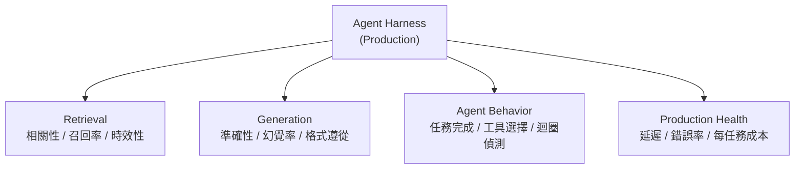

關鍵洞察：四個維度對應四個不同的 stakeholder——retrieval 是 ML 工程師、generation 是業務驗收方、agent behavior 是 QA 團隊、production health 是 IT/FinOps，把指標分層就能讓不同受眾各自有抓手。

- 來源：[Towards Data Science — 12-Metric Eval Harness](https://towardsdatascience.com/building-an-evaluation-harness-for-production-ai-agents-a-12-metric-framework-from-100-deployments/)
- 對客戶的具體含意：在 Cathay 或 E.SUN 的 agent PoC 提案中，直接呈現這四個維度的指標矩陣，比空談「AI 準確率」更容易讓 IT 主管與業務主管同時買單。

---

**(English)** Towards Data Science: 12-metric agent evaluation harness framework distilled from 100+ enterprise deployments

🧠 **推論** This Towards Data Science post claims to have distilled 12 production evaluation metrics from 100+ enterprise agent deployments, organized across four dimensions: retrieval, generation, agent behavior, and production health.

⚠️ **假設** The original article does not disclose the industry breakdown of those 100+ deployments or detail the methodology for metric selection, so the representativeness of the list requires independent verification — but the four-dimension taxonomy is directly useful for harness design regardless. For Livia's portfolio, an eval harness with named metrics is significantly more persuasive in client briefings than "we ran tests"; for bank clients specifically, the production health dimension (latency, error rate, cost per task) maps directly onto the SLA language IT departments already use.

The diagram above maps the four evaluation dimensions to their positions within the harness; the key insight is that each dimension aligns to a different stakeholder, which makes it easier to get cross-functional sign-off in enterprise reviews.

- Source: [Towards Data Science — 12-Metric Eval Harness](https://towardsdatascience.com/building-an-evaluation-harness-for-production-ai-agents-a-12-metric-framework-from-100-deployments/)
- Client implication: In PoC proposals for Cathay or E.SUN, present the four-dimension metric matrix explicitly — it gives IT leadership and business stakeholders each a concrete handle rather than an abstract accuracy number.

---

## Watch list

繁中為主，每條一行：

- [LangSmith Sandboxes GA](https://www.langchain.com/blog/langsmith-sandboxes-generally-available) — kernel-isolated microVM + snapshot + parallel fork，coding agent 與 CI agent 的安全執行環境正式 GA，值得在 harness 架構評估中列為標準選項
- [The Anatomy of an Agent Harness](https://www.langchain.com/blog/the-anatomy-of-an-agent-harness) — LangChain 對 agent harness 核心元件（filesystem、sandbox、memory）的命名與分類，portfolio 敘事框架的語彙參考
- [Agent Development Lifecycle](https://www.langchain.com/blog/the-agent-development-lifecycle) — Build → Test → Deploy → Monitor 四階段框架，LangChain 官方版本，可直接用於客戶簡報的結構化敘事
- [LangSmith Engine](https://www.langchain.com/blog/introducing-langsmith-engine) — 自動從 production traces 中 cluster 失敗模式並提出修復建議，解決 agent 手動 triage 的痛點
- [RAG Temporal Layer](https://towardsdatascience.com/rag-is-blind-to-time-i-built-a-temporal-layer-to-fix-it-in-production/) — RAG 系統無時序感知的具體失敗案例 + 生產修復模式，知識庫頻繁更新的金融客戶（法規、利率）特別相關
- [LangChain Due Diligence Agent](https://www.langchain.com/blog/building-a-company-due-diligence-agent-with-deep-agents-langsmith-and-parallel) — 金融 KYC/盡職調查的 multi-step agent 模式，含結構化輸出，直接對應台灣銀行信貸與法遵工作流
- [OpenAI Codex Safety — sandboxing patterns](https://openai.com/index/running-codex-safely) — OpenAI 自己跑 Codex 的 sandboxing + network policy + agent-native telemetry 模式，可作為 coding agent governance 的參考架構
- [OpenAI Codex Windows Sandbox](https://openai.com/index/building-codex-windows-sandbox) — Windows 環境下 coding agent sandbox 建構細節，controlled file access + network restriction 的實作選擇
- [MDASH：微軟多模型 agent 資安系統找出 16 個 Windows 漏洞](https://www.ithome.com.tw/news/175805) — 具體 production 成果（16 個漏洞），multi-model agent 在 security 用途的可信度佐證，可用於說服製造業客戶
- [AI 自主網攻能力每 4.7 個月翻倍](https://www.ithome.com.tw/news/175789) — 英國 AISI 量化 benchmark，Claude Mythos 與 GPT-5.5 已超出原成長趨勢，資安風險升級的說服力數據
- [How Finance Teams Use Codex](https://openai.com/academy/how-finance-teams-use-codex) — MBR、variance bridge、model check 等具體金融用途，直接可用於銀行客戶 Codex 推廣對話
- [Simon Willison — HTML over Markdown prompt pattern](https://simonwillison.net/2026/May/8/unreasonable-effectiveness-of-html/#atom-everything) — 用 HTML artifact 取代 Markdown 的 prompt engineering 模式，含具體範例，低成本高效果的輸出品質提升技巧
- [Pathors 亞洲語音 AI 基礎建設](https://www.inside.com.tw/article/41271-2026-pathors-interview) — 台灣本地 SOP 整合與電信 API 介接的語音 AI 部署痛點，對需要 IVR 或客服 AI 的銀行客戶有參考價值
- [SocialReasoning-Bench](https://www.microsoft.com/en-us/research/blog/socialreasoning-bench-measuring-whether-ai-agents-act-in-users-best-interests/) — 跨模型穩定出現：agent 執行能力強但不一致優化使用者利益，eval 設計中容易被忽略的維度
- [James Shore on AI coding maintenance math](https://simonwillison.net/2026/May/11/james-shore/#atom-everything) — 「速度加倍必須維護成本減半」的硬數學，對 Livia 內部 harness ROI 計算是誠實的警告
- [Shopify River — public-by-default agent](https://simonwillison.net/2026/May/11/learning-on-the-shop-floor/#atom-everything) — Shopify 內部 coding agent 強制公開 Slack 頻道運作，知識擴散 + 問責設計，enterprise rollout 的組織設計參考
- [Anthropic Agent SDK 用量計費調整](https://www.ithome.com.tw/news/175787) — 6/15 起程式化使用走獨立月額度，影響 PoC 成本估算，部署前需重新試算

---

## Verification hints

This briefing contains **7

🧠 **推論**** segments and **2

⚠️ **假設**** segments. Before citing in client conversations, verify these specific points (English for language-learning practice):

1. **LangChain SmithDB "12x performance" claim** ([SmithDB post](https://www.langchain.com/blog/introducing-smithdb)): The 12x figure appears in LangChain's own marketing copy. Verify what baseline it compares against (PostgreSQL? generic time-series DB?), under what query patterns, and whether the benchmark is independently reproducible before quoting this number to clients.
2. **Delta Channels O(N²) → O(N) improvement** ([Delta Channels post](https://www.langchain.com/blog/delta-channels-evolving-agent-runtime)): The excerpt states this as fact but does not give the session length or step count at which the improvement becomes meaningful in practice. Verify whether "flat storage costs" holds for the session lengths typical in banking compliance workflows (which may run hundreds of steps).
3. **Managed Deep Agents GA status** ([Managed Deep Agents](https://www.langchain.com/blog/introducing-managed-deep-agents)): The excerpt says "private beta." Confirm current availability before promising it to a client — do not cite as Generally Available.
4. **12-metric framework methodology** ([TDS eval harness](https://towardsdatascience.com/building-an-evaluation-harness-for-production-ai-agents-a-12-metric-framework-from-100-deployments/)): The post claims "100+ deployments" but does not disclose industry mix, company sizes, or whether the deployments are the author's own or aggregated from literature. The four-dimension taxonomy is useful regardless, but the "100+ deployments" provenance needs scrutiny before citing as industry-wide evidence.
5. **Mistral 2.4.6 malicious package — current status** ([iThome](https://www.ithome.com.tw/news/175802)): Verify whether Mistral has yanked the compromised version from PyPI and what the current safe pinned version is. The advisory was issued May 12; the situation may have evolved. Check the [PyPI mistralai release history](https://pypi.org/project/mistralai/#history) directly.
6. **LangSmith LLM Gateway PII redaction scope** ([LLM Gateway](https://www.langchain.com/blog/introducing-llm-gateway)): The excerpt names PII redaction as a feature but does not specify which PII categories are covered, in which languages (critical for Traditional Chinese content in Taiwan banking), or whether redaction happens client-side or server-side. Verify before citing as a compliance answer to bank legal teams.
7. **LangSmith Engine "automatic fix proposals"** ([LangSmith Engine](https://www.langchain.com/blog/introducing-langsmith-engine)): The claim that the engine "proposes targeted fixes" is marketing language. Verify whether this means actionable code-level diffs or natural-language suggestions, and what the false-positive rate on failure clustering is before building a support SLA around it.2026-05-14 23:42:42,538 INFO pillar 5 (學派 / 社群 / 思想動態): 11 high-signal items (min_signal=0.60)

---

<a id="pillar-5"></a>

## 🌐 Pillar 5 — 學派 / 社群 / 思想動態
_11 items · $0.0579_

## Pulse — Top 3

### 1. Nathan Lambert 親赴中國 AI 實驗室：第一手觀察中國 AI 社群的戰略邏輯

🧠 **推論** Interconnects 作者 Nathan Lambert（前 HuggingFace 研究員，現 Allen AI）走訪中國多家頂尖 AI 實驗室後撰文，指出中國 AI 社群在技術路徑與組織策略上已形成有別於美國的獨特邏輯。對 Livia 而言，台灣銀行與製造業客戶（尤其是供應鏈上游的 TSMC、Foxconn）正夾在美中技術陣營之間選邊，了解中國 AI 實驗室的真實技術深度與開放程度，是制定 AI 採購與合規策略的必要背景知識。

⚠️ **假設** Lambert 的觀察很可能涵蓋開源模型策略（如 DeepSeek、Qwen 系列）與算力限制下的工程取捨，但具體細節需讀原文核實。

- 來源：[Interconnects (Nathan Lambert)](https://www.interconnects.ai/p/notes-from-inside-chinas-ai-labs)
- 對客戶的具體含意：向台灣製造業客戶簡報 AI 戰略時，可援引第三方研究員的第一手觀察，說明中國 AI 能力邊界，協助客戶在選型時做出有憑據的技術中立決策。

**(English)** Nathan Lambert visits China's top AI labs: firsthand read on Chinese AI community strategy

[Inference] Interconnects author Nathan Lambert (formerly HuggingFace, now Allen AI) published observations after visiting most of China's leading AI labs, arguing that the Chinese AI community has developed a distinct strategic and technical logic divergent from the US approach. For Livia, Taiwan bank and manufacturing clients (particularly upstream supply-chain players like TSMC and Foxconn) are navigating the US-China technology divide and need an accurate picture of Chinese AI labs' real technical depth and openness to make sound AI procurement and compliance decisions. [Assumption] Lambert's observations likely cover open-source model strategy (e.g. DeepSeek, Qwen series) and engineering trade-offs under compute constraints, but specific details require reading the original post.

- Source: [Interconnects (Nathan Lambert)](https://www.interconnects.ai/p/notes-from-inside-chinas-ai-labs)
- Client implication: When briefing Taiwan manufacturing clients on AI strategy, cite this third-party researcher's firsthand account to frame China's AI capability boundaries and support technology-neutral vendor selection decisions grounded in evidence.

---

### 2. Pathors 派斯科技：亞洲語音 AI 基礎設施的本地化部署邏輯

📖 **原文** 派斯科技（Pathors）針對亞洲市場打造能依循企業 SOP 的 AI 語音員工，核心是建構本地化基礎設施，解決電信整合、地端部署等導入痛點，定位為系統整合商（SI）背後的技術引擎。

🧠 **推論** 對 Livia 的銀行客戶（Cathay、E.SUN、CTBC 等）而言，客服語音自動化是最具 ROI 可見度的 AI 切入點之一；Pathors 的「依循 SOP」架構直接對應金融業合規要求，電信整合與地端部署能力則回應資安與資料主權疑慮。這個本土 SI 引擎模式比直接採購美國雲端語音 API 在法規與客製化上更具彈性。

以下流程說明 Pathors 的定位邏輯：企業端 SOP 如何透過本地化基礎設施轉化為 AI 語音員工。

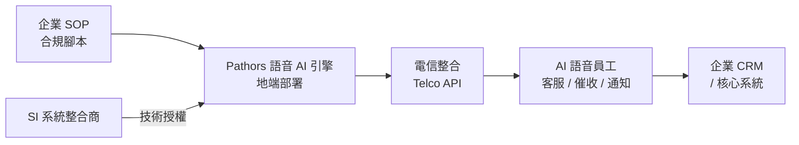

*關鍵洞察：Pathors 選擇做 SI 背後的引擎而非直接面向終端企業，降低了自身銷售成本，也讓合規風險由 SI 承擔——這是台灣 B2B AI 市場的常見成功路徑。*

- 來源：[INSIDE 硬塞](https://www.inside.com.tw/article/41271-2026-pathors-interview)
- 對客戶的具體含意：向 Cathay 或 CTBC 提案語音 AI 時，可以 Pathors 為例說明本土地端部署方案如何同時滿足 FSC 資料留存要求與即時語音處理需求，降低法遵風險。

**(English)** Pathors: the localization-first logic behind Asia voice AI infrastructure

📖 **Source** Pathors builds AI voice employees for Asian enterprises that follow company SOPs, with a core focus on localized infrastructure to solve telecom integration and on-premises deployment pain points, positioning itself as the technical engine behind system integrators (SIs). [Inference] For Livia's bank clients (Cathay, E.SUN, CTBC, etc.), voice customer-service automation is one of the highest-visibility ROI entry points for AI; Pathors' "SOP-compliant" architecture maps directly onto financial-sector compliance requirements, while its telecom integration and on-premises deployment capabilities address data sovereignty and cybersecurity concerns. This domestic SI-engine model offers more regulatory flexibility and customization headroom than buying US cloud voice APIs directly.

The diagram below shows Pathors' positioning logic: how enterprise SOPs flow through localized infrastructure to become AI voice employees.


*Key insight: Pathors chose to be the engine behind SIs rather than selling directly to enterprises — this reduces their own sales overhead and shifts compliance liability to the SI, a proven B2B AI go-to-market pattern in Taiwan.*

- Source: [INSIDE 硬塞](https://www.inside.com.tw/article/41271-2026-pathors-interview)
- Client implication: When proposing voice AI to Cathay or CTBC, use Pathors as a concrete example of how domestic on-premises solutions can simultaneously satisfy FSC data-residency requirements and real-time voice processing demands.

---

### 3. xAI 與 Anthropic 的交易：Musk 的讓步揭示 AI 競賽格局重組

🧠 **推論** Platformer 的 Casey Newton 指出，Elon Musk 的 xAI 與 Anthropic 達成合作協議，Newton 的核心論點是：Musk 若還覺得自己在領先，不會願意簽這個協議。

🧠 **推論** 這個訊號對 Livia 的客戶端說話很有力：當連 Musk 都承認 Anthropic 在技術上具備不可迴避的地位，台灣銀行評估 AI 供應商時，Anthropic（Claude）的籌碼實際上升了。

⚠️ **假設** 協議的具體條款（是 API 授權、算力交換還是其他形式）目前不明，需核實原文。此外，文章同時提及 Shivon Zilis 的治理相關證詞，指向 AI 公司內部決策透明度問題，這對台灣金融監理機關的 AI 治理對話同樣有參考價值。

- 來源：[Platformer (Casey Newton)](https://www.platformer.news/did-xai-just-concede-the-ai-race/)
- 對客戶的具體含意：向台灣銀行的 AI 委員會簡報供應商評估時，可用這個市場訊號佐證「選擇 Anthropic / Claude 並非跟風，而是連競爭對手都認可的技術地位」。

**(English)** xAI's deal with Anthropic: Musk's concession signals AI race realignment

[Inference] Platformer's Casey Newton argues that Elon Musk's xAI entering a deal with Anthropic is itself the signal — Musk wouldn't have made this move if he believed xAI was ahead. [Inference] This framing carries direct weight in client conversations: when even Musk is implicitly conceding Anthropic's technical standing, Taiwan banks evaluating AI vendors have a stronger case for treating Claude/Anthropic as a non-negotiable tier-one option rather than a speculative bet. [Assumption] The specific deal terms (API licensing, compute exchange, or another structure) are not clear from the excerpt and require verification in the original article. The piece also covers Shivon Zilis's testimony on AI governance transparency, which is separately relevant for conversations with Taiwan financial regulators about AI accountability frameworks.

- Source: [Platformer (Casey Newton)](https://www.platformer.news/did-xai-just-concede-the-ai-race/)
- Client implication: When presenting vendor evaluations to a Taiwan bank's AI committee, use this market signal to argue that choosing Anthropic/Claude reflects validated technical standing — not trend-chasing — given that a direct competitor has effectively acknowledged its position.

---

## Watch list

繁中為主，每條一行：

- [Latent Space — The End of Finetuning](https://www.latent.space/p/ainews-the-end-of-finetuning) — Shawn Wang 主張 fine-tuning 時代終結；若屬實，影響台灣銀行的模型客製化策略選型。
- [Berkeley BAIR — Adaptive Parallel Reasoning](http://bair.berkeley.edu/blog/2026/05/08/adaptive-parallel-reasoning/) — Berkeley 提出自適應平行推理範式，可能改變複雜任務的 inference 成本結構，值得追蹤對 harness 架構的影響。
- [LangChain Labs 發布](https://www.langchain.com/blog/introducing-langchain-labs) — LangChain 成立 applied research 部門專攻 agent continual learning，可能影響 Livia harness pipeline 的框架選擇。
- [Import AI 456 — 監管「激進選擇性」](https://jack-clark.net/2026/05/11/import-ai-456-rsi-and-economic-growth-radical-optionality-for-ai-regulation-and-a-neural-computer/) — Jack Clark 提出「政府現在就該建立危機工具」的監管框架，對台灣金管會 AI 政策對話有參考價值。
- [Latent Space — Codex Rises, Claude Meters](https://www.latent.space/p/ainews-codex-rises-claude-meters) — Claude programmatic usage metering 訊號，直接影響 harness 成本估算。
- [Simon Willison — GitLab 裁員與 agentic era 重組](https://simonwillison.net/2026/May/11/gitlab-act-2/#atom-everything) — GitLab 以 agentic era 為由裁員並縮減全球據點，是科技組織如何回應 AI 的真實案例。
- [Latent Space — GPT-Realtime-2, Translate, Whisper](https://www.latent.space/p/ainews-gpt-realtime-2-translate-and) — OpenAI 新語音 API SOTA；與 Pathors 本土方案做技術對標的參考資料。
- [Latent Space — Anthropic 10x growth](https://www.latent.space/p/ainews-anthropic-growing-10xyear) — Anthropic 年成長 10 倍 vs. 業界裁員潮，說明 AI 市場集中化加速，強化 Top 3 第三條的供應商選型論點。

---

## Verification hints

This briefing contains **4

🧠 **推論**** segments and **3

⚠️ **假設**** segments. Before citing in client conversations, verify these specific points (English for language-learning practice):

1. **Nathan Lambert / China labs post**: Confirm the specific labs visited (likely DeepSeek, Zhipu AI, Baidu, Moonshot, etc.) and whether Lambert explicitly discusses open-source strategy or compute constraints — the excerpt only confirms a trip occurred, not the specific findings cited.
2. **Pathors SOP architecture**: The excerpt confirms the "SOP-compliant AI voice employee" framing and on-premises positioning, but the claim that this directly satisfies FSC data-residency requirements is inferred — verify whether Pathors has any formal FSC compliance certification or banking client references in Taiwan.
3. **xAI–Anthropic deal terms**: Newton's piece confirms a deal exists and the editorial framing that it signals xAI conceding ground, but the specific structure of the deal (API access, compute, equity, or commercial partnership) is not confirmed from the excerpt — read the full Platformer article before citing deal terms with clients.
4. **"End of Finetuning" thesis**: Shawn Wang's headline is provocative but the excerpt ("a quiet day lets us reflect") suggests the post may be more tentative than the title implies — read the full piece before positioning this as a settled view to clients evaluating fine-tuning investments.

  Pillar 1 (產業 AI 真實落地 (BFSI + 製造業)       ) items= 25  cents=9.4761
  TOTAL: 0.4021 USD

---

## 📋 引用清單（spot-check 用）

_本期所有引用 URL 集中於各 Pillar 的 Source / 來源 行；驗證提示集中於各 Pillar 末段 Verification hints。_


---

<a id="foundation"></a>

# Foundation — Track E: 工具與基礎設施

_Week 2026-W20 · 25 items synthesized · $0.7142 USD_


# 生產級 LLM 工具鏈的第二次成熟：從「能跑」到「跑得久」

## TL;DR (3 句繁中)
1. 2026 年中的 LLM 工具鏈正經歷從「讓 agent 能動」到「讓 agent 安全、可觀測、可長期運行」的典範轉移——DeltaChannel 狀態差分、kernel-isolated sandbox、時序感知 RAG 是三個代表性 primitive。
2. 核心 trade-off 不在框架選擇（LangChain vs. DSPy），而在「開發速度 vs. 維運成本」的永恆張力：AI 讓程式碼產出加倍，但若維護成本未同比下降，技術債將以指數速度累積。
3. 對 Livia 而言，這意味著向銀行與製造業客戶賣的不該是「agent 能做什麼」，而是「agent 壞掉時你能多快知道、多快修」——可觀測性與沙箱隔離才是 enterprise 買單的支點。

## 背景與問題框架

[推論] 六個月前（2025 Q4），生產級 LLM 工具鏈的討論焦點還停留在「要用 LangChain 還是自己寫」的框架戰爭，以及向量資料庫的百花齊放。到了 2026 年中，這些問題已不是主要戰場。框架本身迅速模組化（LangGraph 拆出獨立 runtime、DSPy 專注 prompt 編譯），真正的瓶頸轉向三個次世代問題：**長期運行 agent 的狀態管理**、**agent 執行的安全隔離**、以及**檢索增強生成（RAG）在時間維度上的盲區**。

[推論] 這個轉移的驅動力來自兩端。供給端，OpenAI 成立 [DeployCo](https://openai.com/index/openai-launches-the-deployment-company) 專攻企業部署、LangChain 推出 [LangSmith Sandboxes GA](https://www.langchain.com/blog/langsmith-sandboxes-generally-available)、OpenAI 發佈 [Codex Windows Sandbox](https://openai.com/index/building-codex-windows-sandbox)——工具供應商開始把「安全執行」視為產品核心而非附加功能。需求端，金融機構開始用 agent 做 [盡職調查](https://www.langchain.com/blog/building-a-company-due-diligence-agent-with-deep-agents-langsmith-and-parallel)、醫療機構用 agent 處理 [上億次門診紀錄](https://www.latent.space/p/abridge)——當 agent 觸及受監管領域，「能跑」已不夠，必須「跑得安全、跑得可追溯」。

[推論] 這一波工具鏈成熟的深層含義是：LLM 應用正從「demo → pilot」跨入「pilot → production at scale」。這個階段的工程挑戰不再是模型能力，而是 **harness 的工業強度**——狀態持久化、故障隔離、時序正確性、可觀測性。這正是 Livia 作為 harness engineer 最該深耕的腹地。

## 核心概念解析（含 Mermaid 圖）

### 1. DeltaChannel：長期運行 Agent 的狀態差分原語

[原文] LangGraph 1.2 引入 [DeltaChannel](https://www.langchain.com/blog/delta-channels-evolving-agent-runtime)，解決長期運行 agent 每一步 checkpoint 全狀態導致儲存成長為 O(N²) 的問題。DeltaChannel 僅儲存每步的 diff，並週期性寫入完整 snapshot，使儲存成本隨 session 增長保持平坦。

[推論] 這個模式並不新穎——資料庫界的 WAL（Write-Ahead Log）+ periodic compaction、影片編碼的 I-frame/P-frame 都是同一思路。但將其提升為 agent runtime 的一級原語，標誌著 agent 框架從「無狀態函數呼叫鏈」成熟為「有狀態長期程序」。對於金融業的多日盡職調查 agent 或製造業的連續監控 agent，這是基礎設施級的需求。

下圖展示 DeltaChannel 的 checkpoint 策略如何壓縮儲存：

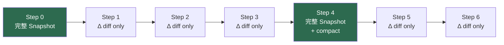

**關鍵洞察**：綠色節點是完整 snapshot（I-frame 類比），中間只存差分。儲存從 O(N²) 降至 O(N)，且 compaction 後舊 diff 可被回收。這是 agent runtime 走向「資料庫化」的第一步。

### 2. Sandbox 隔離：Agent 安全執行的三層架構

[原文] 本週有三個獨立訊號指向同一方向：OpenAI 的 [Codex 安全運行模式](https://openai.com/index/running-codex-safely)、[Codex Windows Sandbox](https://openai.com/index/building-codex-windows-sandbox)、以及 LangSmith 的 [Sandboxes GA](https://www.langchain.com/blog/langsmith-sandboxes-generally-available)。共同模式是 **kernel-isolated microVM + 檔案系統快照 + 網路策略**。

[推論] 這三個實作收斂到一個共同的安全架構模式，我將其歸納為 agent sandbox 的三層防禦：

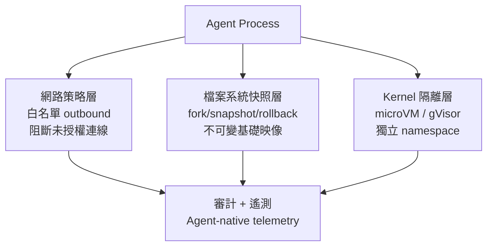

**關鍵洞察**：LangSmith Sandboxes 強調的 parallel fork 能力（從同一快照分出多個平行 agent 分支）與 DeltaChannel 的 checkpoint 概念呼應——兩者合在一起，agent 既能回溯狀態，又能安全地在隔離環境中執行有副作用的操作（如寫檔、發 API 請求）。這是 coding agent 與 data pipeline agent 進入受監管行業的前提。

### 3. 時序感知 RAG：填補檢索的時間盲區

[原文] [「RAG Is Blind to Time」](https://towardsdatascience.com/rag-is-blind-to-time-i-built-a-temporal-layer-to-fix-it-in-production/) 一文指出，標準 RAG 系統依賴語意相似度檢索，但對文件的時效性完全無感。作者在生產環境中加入一個 temporal layer，在 retriever 與 model 之間過濾、排序文件的時間戳，確保回傳的是最新且語意相關的內容。

[推論] 這個問題對台灣金融業尤其尖銳。法規函令、金管會解釋令、內部作業準則都有版本與生效日期，若 RAG 系統把三年前的舊版準則與最新版混在一起回傳，後果是合規風險。時序感知不是 nice-to-have，而是 regulated-industry 的 must-have。

```mermaid
flowchart LR
    Query["使用者查詢"] --> Retriever["向量檢索\n(語意相似度)"]
    Retriever --> TempLayer["時序過濾層\n- 文件時間戳\n- 有效期間\n- 版本排序"]
    TempLayer --> Reranker["Reranker\n(相關性 × 時效性)"]
    Reranker --> LLM["LLM 生成回答"]
```

**關鍵洞察**：temporal layer 的正確位置是在 retriever 之後、reranker / LLM 之前。它不是改善 embedding（那是語意層的事），而是在 retrieval 結果集上施加業務邏輯約束。這是一個乾淨的 separation of concerns。

### 4. 開發速度 vs. 維護成本：LLM 輔助開發的經濟學陷阱

[原文] James Shore 的 [觀察](https://simonwillison.net/2026/May/11/james-shore/#atom-everything) 直指核心：「你用 AI 寫程式快了兩倍？那你的維護成本最好也降了一半。否則你只是在用暫時的速度換永久的束縛。」數學很簡單——如果產出速度提高 K 倍，維護成本必須降至 1/K，否則技術債將以 K 的速率累積。

[推論] 這個警告直接適用於 LLM 工具鏈的選型決策。LangChain 的抽象層讓原型開發極快，但如果這些抽象在 debug 時增加了認知負擔、在升級時製造了破壞性變更，那麼它的速度優勢可能被維護成本吃掉。Simon Willison 的 [llm 0.32a2](https://simonwillison.net/2026/May/12/llm/#atom-everything) 走的是相反路線：薄封裝、直接暴露 OpenAI 的 `/v1/responses` 端點，讓使用者能看到 interleaved reasoning tokens。薄框架 = 低維護債務，但開發速度較慢。

### 5. EMO：模組化 MoE 作為推論成本優化的新原語

[原文] Allen AI 的 [EMO](https://huggingface.co/blog/allenai/emo) 預訓練出 Mixture-of-Experts 模型，其中模組化結構從資料中自然湧現（emergent），使用者可以只啟用 12.5% 的 experts 來處理特定任務，同時保持接近完整模型的效能。

[推論] 這對工具鏈的含義是：未來的 model gateway 可能不只是路由「哪個模型」，而是路由「同一模型的哪些 expert 子集」。這將使推論成本控制的粒度從模型級降到子模型級，對 embedding pipeline 和 RAG 的即時查詢場景尤其有價值。

### 6. Adaptive Parallel Reasoning：推論時的動態並行化

[原文] Berkeley AI Research 發表 [Adaptive Parallel Reasoning](http://bair.berkeley.edu/blog/2026/05/08/adaptive-parallel-reasoning/)，探討讓推理模型自行決定何時將問題分解為平行子任務、產生多少並行執行緒、如何協調結果。

[推論] 這與 LangChain 的 [due diligence agent](https://www.langchain.com/blog/building-a-company-due-diligence-agent-with-deep-agents-langsmith-and-parallel) 中的 parallel orchestration 遙相呼應。差別在於：LangChain 的並行化是由開發者在 graph 中顯式設計的；adaptive parallel reasoning 把這個決策下放給模型本身。工具鏈的演進方向是：**框架負責提供並行執行的 primitive（fork、join、state merge），模型負責決定何時使用它們**。

```mermaid
stateDiagram-v2
    [*] --> Analyze: 接收問題
    Analyze --> Sequential: 判斷為簡單任務
    Analyze --> Parallel: 判斷為可分解任務
    Parallel --> Thread1: 子任務 A
    Parallel --> Thread2: 子任務 B
    Parallel --> Thread3: 子任務 C
    Thread1 --> Merge
    Thread2 --> Merge
    Thread3 --> Merge
    Sequential --> Merge
    Merge --> [*]: 輸出結果
```

**關鍵洞察**：agent runtime（如 LangGraph）與模型推論策略（如 adaptive parallel reasoning）正在從兩端收斂——runtime 提供 execution primitive，model 提供 planning intelligence。harness engineer 的工作是確保兩者的介面乾淨、可觀測。

## 與既有框架的對位

[推論] **NIST AI RMF 的 GOVERN 與 MEASURE 函數**：本週的 sandbox 隔離模式（Codex safety、LangSmith Sandboxes）直接對應 NIST AI RMF 中 GOVERN-1.3（部署環境中的風險控制）與 MEASURE-2.6（系統行為的監控與遙測）。台灣金管會尚未發佈等同於 NIST AI RMF 的 LLM 專用指引，但若 Livia 能引用 NIST 框架搭配這些具體實作，客戶對話會更有說服力。

[推論] **Chip Huyen 的 LLM Engineering 分層**：Chip Huyen 在其 [_AI Engineering_](https://www.oreilly.com/library/view/ai-engineering/9781098166298/) 書中區分了 prompt engineering → RAG → fine-tuning → agent 的堆疊。本週的時序感知 RAG 精確地補全了她在 RAG 章節中未深入的「時間維度」盲區。DeltaChannel 則對應她在 agent 章節中提到的 checkpointing 問題，但 LangGraph 的解法比她當時描述的更成熟。

[推論] **Anthropic RSP（Responsible Scaling Policy）**：Mozilla 用 [Claude Mythos 找出數百個 Firefox 漏洞](https://simonwillison.net/2026/May/7/firefox-claude-mythos/#atom-everything)、微軟的 [MDASH 多模型 agent 找出 16 個 Windows 漏洞](https://www.ithome.com.tw/news/175805)——這些是「frontier capability 直接應用於安全防禦」的案例，正面支持 Anthropic RSP 中「以能力提升防禦」的論點。但同時也印證了 SocialReasoning-Bench 的 [發現](https://www.microsoft.com/en-us/research/blog/socialreasoning-bench-measuring-whether-ai-agents-act-in-users-best-interests/)：agent 執行能力強，但不一定「為使用者利益最佳化」——安全工具需要配合人類審查流程。

## Trade-offs 與爭議

**1. 薄框架 vs. 厚框架**

| 面向 | 薄框架（llm CLI, 自建 harness） | 厚框架（LangGraph + LangSmith） |
|---|---|---|
| 優勢 | 透明、低維護債、易 debug | 內建 state、sandbox、observability |
| 劣勢 | 需自建 checkpoint、sandbox、trace | 抽象洩漏風險、版本升級破壞 |
| 適用 | 小團隊、PoC、研究 | 企業級多 agent、受監管場景 |

[推論] James Shore 的「維護成本等式」在這裡特別適用：厚框架讓你建得快，但如果你不理解底層（如 DeltaChannel 的 diff 機制），出問題時 debug 成本可能超過你省下的開發時間。

**2. Sandbox 隔離的效能代價**

[推論] kernel-isolated microVM 提供強隔離，但有冷啟動延遲（通常 100ms-1s）和記憶體開銷。對即時互動的 coding agent，LangSmith 提供 snapshot + parallel fork 來攤銷冷啟動，但這增加了基礎設施複雜度。gVisor 這類 userspace kernel 是中間方案：隔離弱於 full VM，但效能接近原生容器。選擇取決於威脅模型——agent 若能執行任意程式碼（如 Codex），full VM 是必要的；若只是 RAG 查詢，container 層級隔離已足夠。

**3. 時序感知 RAG 的實作成本**

[推論] 加入 temporal layer 意味著每份文件都需要結構化的時間戳 metadata。對於非結構化知識庫（如掃描的紙本法規、歷史會議紀錄），metadata 工程的成本可能超過 RAG pipeline 本身。這是 data curation 問題，不是 retrieval 問題。

**4. EMO 的 emergent modularity 能否泛化**

[假設] EMO 在預訓練時讓 expert 群組自然湧現，但目前只在 Allen AI 的特定訓練配置下驗證。是否能在不同資料分佈、不同模型規模下穩定重現，仍有待觀察。若不能泛化，「只啟用 12.5% experts」的承諾可能只是特定情境的最佳化。

## 對 Livia IBM 客戶的具體含意

**國泰 / 玉山等銀行客戶**：
- [推論] 盡職調查 agent（DD agent）是最直接的落地場景。LangChain 的 [due diligence agent 範例](https://www.langchain.com/blog/building-a-company-due-diligence-agent-with-deep-agents-langsmith-and-parallel) 展示了從公司名稱到結構化情報報告的完整流程。Livia 可以用這個模式向法金部門提案，但**必須強調三個 enterprise 層級的需求**：(a) sandbox 隔離——agent 不能觸及生產系統；(b) 時序感知 RAG——法規與財報有版本，不能混用；(c) 完整的 audit trail——checkpoint + trace 是金管會稽核時的必要條件。
- [推論] OpenAI 的 [財務團隊 Codex 用例](https://openai.com/academy/how-finance-teams-use-codex) 提供了 MBR（月度業務報告）、差異橋分析等具體場景，可直接翻譯為台灣銀行月結流程的自動化提案。

**台積電 / 鴻海等製造業客戶**：
- [推論] 漢翔的 [CMMC 供應鏈資安評級系統](https://www.ithome.com.tw/news/175813) 是台灣國防供應鏈合規的標竿案例。對台積電而言，供應鏈 agent 若用於廠商風險評估，同樣需要 sandbox 隔離（避免 agent 存取敏感供應商資料時外洩）與時序感知（供應商稽核報告有有效期）。Livia 可引用漢翔案例作為「台灣企業已在做」的社會證明。
- [推論] 派斯科技（Pathors）的 [語音 AI 基礎設施](https://www.inside.com.tw/article/41271-2026-pathors-interview) 案例展示了在亞洲市場部署 AI agent 時，電信整合與地端部署的痛點。對製造業的工廠端 agent 部署，地端（on-premise）運行 + 受控網路連線是共同需求，與 Codex sandbox 的網路策略層異曲同工。

**跨產業提案角度**：
- James Shore 的「維護成本等式」應該成為每次客戶提案的 slide——不是賣速度，而是賣「速度 × 可維護性」的乘積。這能有效防止客戶在 PoC 成功後盲目擴大部署而累積技術債。

## 對 Livia harness engineer portfolio 的含意

1. **Design Note 可抽出**：「Agent Checkpoint 策略：從 full-state 到 DeltaChannel diff」——用 WAL + compaction 的類比解釋 LangGraph 的狀態管理，展示對 runtime engineering 的理解深度。這個 design note 可以同時連結到 Abridge 醫療 agent 的案例，說明長期運行 agent 在受監管行業的狀態管理需求。

2. **面試問答框架**：「描述你如何為一個長期運行的 agent 設計 checkpoint 機制」——答案結構為：問題定義（O(N²) 儲存膨脹）→ 解法（diff + periodic snapshot）→ trade-off（恢復時間 vs. 儲存成本）→ 生產考量（compaction 策略、audit trail 需求）。

3. **Portfolio narrative 接點**：本週的工具鏈成熟主題直接支撐 Livia 的 harness engineer 故事線——「我不只是在 LangChain 上疊 prompt，我理解 agent runtime 的底層原語（state、isolation、temporal correctness），並且能把它們映射到受監管行業的合規需求。」

4. **具體 demo 構想**：用 LangGraph DeltaChannel + LangSmith Sandbox 建一個 mini due-diligence agent，展示：(a) diff-based checkpoint 的儲存效率比較；(b) sandbox 中的 parallel fork 能力；(c) temporal-aware RAG 處理不同版本的法規文件。這個 demo 同時服務於 IBM 客戶提案與個人 portfolio。

---

# Production LLM Tooling's Second Maturation: From "It Runs" to "It Runs Safely and Observably"

## TL;DR (3 sentences)
1. The LLM toolchain in mid-2026 is undergoing a paradigm shift from "making agents work" to "making agents safe, observable, and durable"—DeltaChannel state diffs, kernel-isolated sandboxes, and time-aware RAG are three representative primitives.
2. The core trade-off is not framework choice (LangChain vs. DSPy) but the eternal tension between development velocity and maintenance cost: if AI doubles your code output but doesn't halve your maintenance burden, you're accumulating technical debt exponentially.
3. For Livia, this means the selling point for banks and manufacturers isn't "what agents can do" but "how fast you'll know when they break and how fast you'll fix them"—observability and sandbox isolation are the enterprise purchasing pivot.

## Background & Problem Framing

[Inference] Six months ago (late 2025), production LLM tooling discourse centered on framework wars (LangChain vs. rolling your own) and the vector database explosion. By mid-2026, these are no longer the primary battleground. Frameworks have modularized rapidly (LangGraph as a standalone runtime, DSPy focused on prompt compilation), and the real bottlenecks have shifted to three next-generation problems: **state management for long-running agents**, **safety isolation for agent execution**, and **temporal blindness in retrieval-augmented generation**.

[Inference] This shift is driven from both supply and demand sides. On supply: OpenAI launched [DeployCo](https://openai.com/index/openai-launches-the-deployment-company) for enterprise deployment, LangChain released [LangSmith Sandboxes GA](https://www.langchain.com/blog/langsmith-sandboxes-generally-available), and OpenAI published detailed [Codex Windows Sandbox](https://openai.com/index/building-codex-windows-sandbox) patterns—tool vendors now treat "safe execution" as core product, not add-on. On demand: financial institutions are using agents for [due diligence](https://www.langchain.com/blog/building-a-company-due-diligence-agent-with-deep-agents-langsmith-and-parallel), healthcare companies process [100M+ doctor visits](https://www.latent.space/p/abridge)—when agents touch regulated domains, "it runs" is insufficient; it must run safely and with audit trails.

[Inference] The deeper implication: LLM applications are crossing from "demo → pilot" into "pilot → production at scale." The engineering challenges at this stage are no longer about model capability but about **harness industrial strength**—state persistence, fault isolation, temporal correctness, observability. This is precisely where Livia's harness engineer expertise should be deepened.

## Core Concepts (with Mermaid diagrams)

### 1. DeltaChannel: State Diffing for Long-Running Agents

[Source] LangGraph 1.2 introduces [DeltaChannel](https://www.langchain.com/blog/delta-channels-evolving-agent-runtime), solving the O(N²) storage growth problem of checkpointing full state at every step for long-running agents. DeltaChannel stores only the diff at each step and writes full snapshots periodically, keeping storage costs flat.

[Inference] The pattern isn't novel—database WAL + periodic compaction, video encoding I-frames/P-frames are the same idea. But elevating this to a first-class agent runtime primitive marks the maturation of agent frameworks from "stateless function call chains" to "stateful long-lived processes." For multi-day financial DD agents or continuous manufacturing monitoring agents, this is infrastructure-grade necessity.

The following diagram shows how DeltaChannel's checkpoint strategy compresses storage:

```mermaid
flowchart LR
    S0["Step 0\nFull Snapshot"] --> D1["Step 1\nΔ diff only"]
    D1 --> D2["Step 2\nΔ diff only"]
    D2 --> D3["Step 3\nΔ diff only"]
    D3 --> S4["Step 4\nFull Snapshot\n+ compact"]
    S4 --> D5["Step 5\nΔ diff only"]
    D5 --> D6["Step 6\nΔ diff only"]
    
    style S0 fill:#2d6a4f,color:#fff
    style S4 fill:#2d6a4f,color:#fff
```

**Key insight**: Green nodes are full snapshots (I-frame analogy); intermediate steps store only diffs. Storage drops from O(N²) to O(N), and old diffs can be garbage-collected after compaction. This is the first step toward agent runtimes becoming "database-like."

### 2. Sandbox Isolation: Three-Layer Defense for Agent Execution

[Source] Three independent signals this week converge: OpenAI's [Codex safety operations](https://openai.com/index/running-codex-safely), [Codex Windows Sandbox](https://openai.com/index/building-codex-windows-sandbox), and LangSmith's [Sandboxes GA](https://www.langchain.com/blog/langsmith-sandboxes-generally-available). The common pattern: **kernel-isolated microVM + filesystem snapshots + network policies**.

[Inference] These three implementations converge on a common security architecture that I categorize as the three-layer sandbox defense:

```mermaid
flowchart TD
    Agent["Agent Process"] --> NetPolicy["Network Policy Layer\nOutbound allowlists\nBlock unauthorized connections"]
    Agent --> FSSnap["Filesystem Snapshot Layer\nFork / snapshot / rollback\nImmutable base images"]
    Agent --> KernIso["Kernel Isolation Layer\nmicroVM / gVisor\nIsolated namespaces"]
    
    NetPolicy --> Audit["Audit + Telemetry\nAgent-native observability"]
    FSSnap --> Audit
    KernIso --> Audit
```

**Key insight**: LangSm

