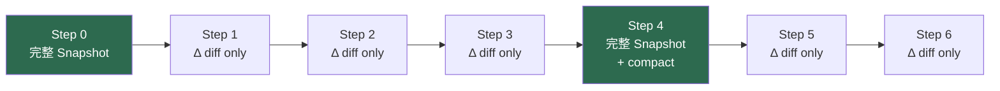
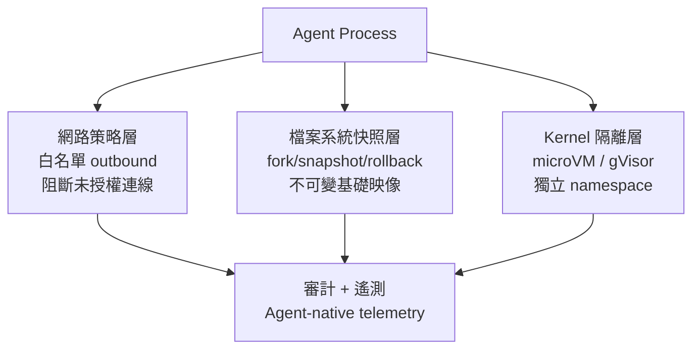
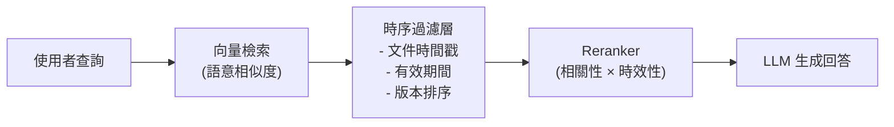
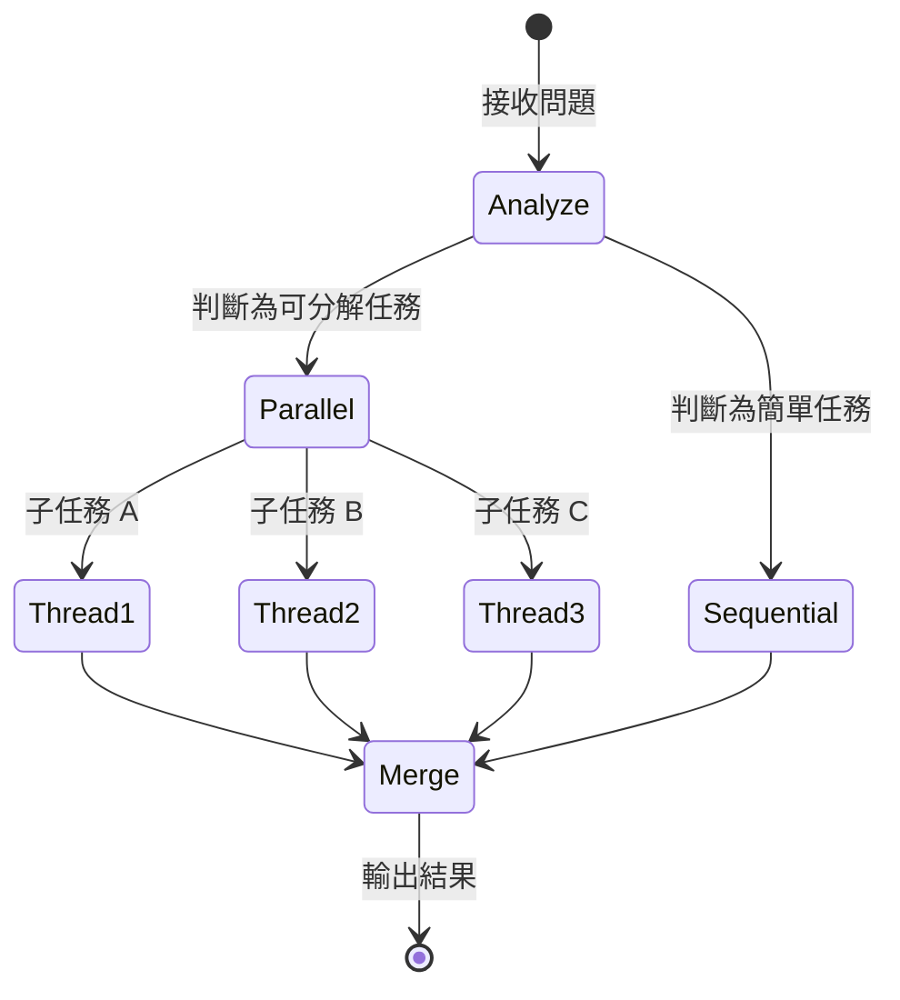
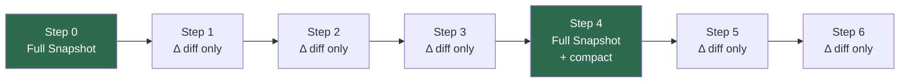
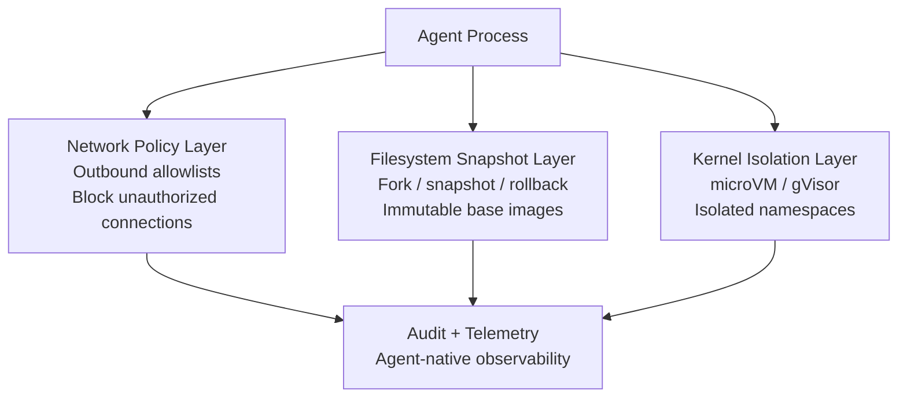

# Foundation — Track E: 工具與基礎設施

_Week 2026-W20 · 25 items synthesized · $0.7142 USD_

# 生產級 LLM 工具鏈的第二次成熟：從「能跑」到「跑得久」

## TL;DR (3 句繁中)
1. 2026 年中的 LLM 工具鏈正經歷從「讓 agent 能動」到「讓 agent 安全、可觀測、可長期運行」的典範轉移——DeltaChannel 狀態差分、kernel-isolated sandbox、時序感知 RAG 是三個代表性 primitive。
2. 核心 trade-off 不在框架選擇（LangChain vs. DSPy），而在「開發速度 vs. 維運成本」的永恆張力：AI 讓程式碼產出加倍，但若維護成本未同比下降，技術債將以指數速度累積。
3. 對 Livia 而言，這意味著向銀行與製造業客戶賣的不該是「agent 能做什麼」，而是「agent 壞掉時你能多快知道、多快修」——可觀測性與沙箱隔離才是 enterprise 買單的支點。

## 背景與問題框架

[推論] 六個月前（2025 Q4），生產級 LLM 工具鏈的討論焦點還停留在「要用 LangChain 還是自己寫」的框架戰爭，以及向量資料庫的百花齊放。到了 2026 年中，這些問題已不是主要戰場。框架本身迅速模組化（LangGraph 拆出獨立 runtime、DSPy 專注 prompt 編譯），真正的瓶頸轉向三個次世代問題：**長期運行 agent 的狀態管理**、**agent 執行的安全隔離**、以及**檢索增強生成（RAG）在時間維度上的盲區**。

[推論] 這個轉移的驅動力來自兩端。供給端，OpenAI 成立 [DeployCo](https://openai.com/index/openai-launches-the-deployment-company) 專攻企業部署、LangChain 推出 [LangSmith Sandboxes GA](https://www.langchain.com/blog/langsmith-sandboxes-generally-available)、OpenAI 發佈 [Codex Windows Sandbox](https://openai.com/index/building-codex-windows-sandbox)——工具供應商開始把「安全執行」視為產品核心而非附加功能。需求端，金融機構開始用 agent 做 [盡職調查](https://www.langchain.com/blog/building-a-company-due-diligence-agent-with-deep-agents-langsmith-and-parallel)、醫療機構用 agent 處理 [上億次門診紀錄](https://www.latent.space/p/abridge)——當 agent 觸及受監管領域，「能跑」已不夠，必須「跑得安全、跑得可追溯」。

[推論] 這一波工具鏈成熟的深層含義是：LLM 應用正從「demo → pilot」跨入「pilot → production at scale」。這個階段的工程挑戰不再是模型能力，而是 **harness 的工業強度**——狀態持久化、故障隔離、時序正確性、可觀測性。這正是 Livia 作為 harness engineer 最該深耕的腹地。

## 核心概念解析（含 Mermaid 圖）

### 1. DeltaChannel：長期運行 Agent 的狀態差分原語

[原文] LangGraph 1.2 引入 [DeltaChannel](https://www.langchain.com/blog/delta-channels-evolving-agent-runtime)，解決長期運行 agent 每一步 checkpoint 全狀態導致儲存成長為 O(N²) 的問題。DeltaChannel 僅儲存每步的 diff，並週期性寫入完整 snapshot，使儲存成本隨 session 增長保持平坦。

[推論] 這個模式並不新穎——資料庫界的 WAL（Write-Ahead Log）+ periodic compaction、影片編碼的 I-frame/P-frame 都是同一思路。但將其提升為 agent runtime 的一級原語，標誌著 agent 框架從「無狀態函數呼叫鏈」成熟為「有狀態長期程序」。對於金融業的多日盡職調查 agent 或製造業的連續監控 agent，這是基礎設施級的需求。

下圖展示 DeltaChannel 的 checkpoint 策略如何壓縮儲存：

**關鍵洞察**：綠色節點是完整 snapshot（I-frame 類比），中間只存差分。儲存從 O(N²) 降至 O(N)，且 compaction 後舊 diff 可被回收。這是 agent runtime 走向「資料庫化」的第一步。

### 2. Sandbox 隔離：Agent 安全執行的三層架構

[原文] 本週有三個獨立訊號指向同一方向：OpenAI 的 [Codex 安全運行模式](https://openai.com/index/running-codex-safely)、[Codex Windows Sandbox](https://openai.com/index/building-codex-windows-sandbox)、以及 LangSmith 的 [Sandboxes GA](https://www.langchain.com/blog/langsmith-sandboxes-generally-available)。共同模式是 **kernel-isolated microVM + 檔案系統快照 + 網路策略**。

[推論] 這三個實作收斂到一個共同的安全架構模式，我將其歸納為 agent sandbox 的三層防禦：

**關鍵洞察**：LangSmith Sandboxes 強調的 parallel fork 能力（從同一快照分出多個平行 agent 分支）與 DeltaChannel 的 checkpoint 概念呼應——兩者合在一起，agent 既能回溯狀態，又能安全地在隔離環境中執行有副作用的操作（如寫檔、發 API 請求）。這是 coding agent 與 data pipeline agent 進入受監管行業的前提。

### 3. 時序感知 RAG：填補檢索的時間盲區

[原文] [「RAG Is Blind to Time」](https://towardsdatascience.com/rag-is-blind-to-time-i-built-a-temporal-layer-to-fix-it-in-production/) 一文指出，標準 RAG 系統依賴語意相似度檢索，但對文件的時效性完全無感。作者在生產環境中加入一個 temporal layer，在 retriever 與 model 之間過濾、排序文件的時間戳，確保回傳的是最新且語意相關的內容。

[推論] 這個問題對台灣金融業尤其尖銳。法規函令、金管會解釋令、內部作業準則都有版本與生效日期，若 RAG 系統把三年前的舊版準則與最新版混在一起回傳，後果是合規風險。時序感知不是 nice-to-have，而是 regulated-industry 的 must-have。

**關鍵洞察**：temporal layer 的正確位置是在 retriever 之後、reranker / LLM 之前。它不是改善 embedding（那是語意層的事），而是在 retrieval 結果集上施加業務邏輯約束。這是一個乾淨的 separation of concerns。

### 4. 開發速度 vs. 維護成本：LLM 輔助開發的經濟學陷阱

[原文] James Shore 的 [觀察](https://simonwillison.net/2026/May/11/james-shore/#atom-everything) 直指核心：「你用 AI 寫程式快了兩倍？那你的維護成本最好也降了一半。否則你只是在用暫時的速度換永久的束縛。」數學很簡單——如果產出速度提高 K 倍，維護成本必須降至 1/K，否則技術債將以 K 的速率累積。

[推論] 這個警告直接適用於 LLM 工具鏈的選型決策。LangChain 的抽象層讓原型開發極快，但如果這些抽象在 debug 時增加了認知負擔、在升級時製造了破壞性變更，那麼它的速度優勢可能被維護成本吃掉。Simon Willison 的 [llm 0.32a2](https://simonwillison.net/2026/May/12/llm/#atom-everything) 走的是相反路線：薄封裝、直接暴露 OpenAI 的 `/v1/responses` 端點，讓使用者能看到 interleaved reasoning tokens。薄框架 = 低維護債務，但開發速度較慢。

### 5. EMO：模組化 MoE 作為推論成本優化的新原語

[原文] Allen AI 的 [EMO](https://huggingface.co/blog/allenai/emo) 預訓練出 Mixture-of-Experts 模型，其中模組化結構從資料中自然湧現（emergent），使用者可以只啟用 12.5% 的 experts 來處理特定任務，同時保持接近完整模型的效能。

[推論] 這對工具鏈的含義是：未來的 model gateway 可能不只是路由「哪個模型」，而是路由「同一模型的哪些 expert 子集」。這將使推論成本控制的粒度從模型級降到子模型級，對 embedding pipeline 和 RAG 的即時查詢場景尤其有價值。

### 6. Adaptive Parallel Reasoning：推論時的動態並行化

[原文] Berkeley AI Research 發表 [Adaptive Parallel Reasoning](http://bair.berkeley.edu/blog/2026/05/08/adaptive-parallel-reasoning/)，探討讓推理模型自行決定何時將問題分解為平行子任務、產生多少並行執行緒、如何協調結果。

[推論] 這與 LangChain 的 [due diligence agent](https://www.langchain.com/blog/building-a-company-due-diligence-agent-with-deep-agents-langsmith-and-parallel) 中的 parallel orchestration 遙相呼應。差別在於：LangChain 的並行化是由開發者在 graph 中顯式設計的；adaptive parallel reasoning 把這個決策下放給模型本身。工具鏈的演進方向是：**框架負責提供並行執行的 primitive（fork、join、state merge），模型負責決定何時使用它們**。

**關鍵洞察**：agent runtime（如 LangGraph）與模型推論策略（如 adaptive parallel reasoning）正在從兩端收斂——runtime 提供 execution primitive，model 提供 planning intelligence。harness engineer 的工作是確保兩者的介面乾淨、可觀測。

## 與既有框架的對位

[推論] **NIST AI RMF 的 GOVERN 與 MEASURE 函數**：本週的 sandbox 隔離模式（Codex safety、LangSmith Sandboxes）直接對應 NIST AI RMF 中 GOVERN-1.3（部署環境中的風險控制）與 MEASURE-2.6（系統行為的監控與遙測）。台灣金管會尚未發佈等同於 NIST AI RMF 的 LLM 專用指引，但若 Livia 能引用 NIST 框架搭配這些具體實作，客戶對話會更有說服力。

[推論] **Chip Huyen 的 LLM Engineering 分層**：Chip Huyen 在其 [_AI Engineering_](https://www.oreilly.com/library/view/ai-engineering/9781098166298/) 書中區分了 prompt engineering → RAG → fine-tuning → agent 的堆疊。本週的時序感知 RAG 精確地補全了她在 RAG 章節中未深入的「時間維度」盲區。DeltaChannel 則對應她在 agent 章節中提到的 checkpointing 問題，但 LangGraph 的解法比她當時描述的更成熟。

[推論] **Anthropic RSP（Responsible Scaling Policy）**：Mozilla 用 [Claude Mythos 找出數百個 Firefox 漏洞](https://simonwillison.net/2026/May/7/firefox-claude-mythos/#atom-everything)、微軟的 [MDASH 多模型 agent 找出 16 個 Windows 漏洞](https://www.ithome.com.tw/news/175805)——這些是「frontier capability 直接應用於安全防禦」的案例，正面支持 Anthropic RSP 中「以能力提升防禦」的論點。但同時也印證了 SocialReasoning-Bench 的 [發現](https://www.microsoft.com/en-us/research/blog/socialreasoning-bench-measuring-whether-ai-agents-act-in-users-best-interests/)：agent 執行能力強，但不一定「為使用者利益最佳化」——安全工具需要配合人類審查流程。

## Trade-offs 與爭議

**1. 薄框架 vs. 厚框架**

| 面向 | 薄框架（llm CLI, 自建 harness） | 厚框架（LangGraph + LangSmith） |
|---|---|---|
| 優勢 | 透明、低維護債、易 debug | 內建 state、sandbox、observability |
| 劣勢 | 需自建 checkpoint、sandbox、trace | 抽象洩漏風險、版本升級破壞 |
| 適用 | 小團隊、PoC、研究 | 企業級多 agent、受監管場景 |

[推論] James Shore 的「維護成本等式」在這裡特別適用：厚框架讓你建得快，但如果你不理解底層（如 DeltaChannel 的 diff 機制），出問題時 debug 成本可能超過你省下的開發時間。

**2. Sandbox 隔離的效能代價**

[推論] kernel-isolated microVM 提供強隔離，但有冷啟動延遲（通常 100ms-1s）和記憶體開銷。對即時互動的 coding agent，LangSmith 提供 snapshot + parallel fork 來攤銷冷啟動，但這增加了基礎設施複雜度。gVisor 這類 userspace kernel 是中間方案：隔離弱於 full VM，但效能接近原生容器。選擇取決於威脅模型——agent 若能執行任意程式碼（如 Codex），full VM 是必要的；若只是 RAG 查詢，container 層級隔離已足夠。

**3. 時序感知 RAG 的實作成本**

[推論] 加入 temporal layer 意味著每份文件都需要結構化的時間戳 metadata。對於非結構化知識庫（如掃描的紙本法規、歷史會議紀錄），metadata 工程的成本可能超過 RAG pipeline 本身。這是 data curation 問題，不是 retrieval 問題。

**4. EMO 的 emergent modularity 能否泛化**

[假設] EMO 在預訓練時讓 expert 群組自然湧現，但目前只在 Allen AI 的特定訓練配置下驗證。是否能在不同資料分佈、不同模型規模下穩定重現，仍有待觀察。若不能泛化，「只啟用 12.5% experts」的承諾可能只是特定情境的最佳化。

## 對 Livia IBM 客戶的具體含意

**國泰 / 玉山等銀行客戶**：
- [推論] 盡職調查 agent（DD agent）是最直接的落地場景。LangChain 的 [due diligence agent 範例](https://www.langchain.com/blog/building-a-company-due-diligence-agent-with-deep-agents-langsmith-and-parallel) 展示了從公司名稱到結構化情報報告的完整流程。Livia 可以用這個模式向法金部門提案，但**必須強調三個 enterprise 層級的需求**：(a) sandbox 隔離——agent 不能觸及生產系統；(b) 時序感知 RAG——法規與財報有版本，不能混用；(c) 完整的 audit trail——checkpoint + trace 是金管會稽核時的必要條件。
- [推論] OpenAI 的 [財務團隊 Codex 用例](https://openai.com/academy/how-finance-teams-use-codex) 提供了 MBR（月度業務報告）、差異橋分析等具體場景，可直接翻譯為台灣銀行月結流程的自動化提案。

**台積電 / 鴻海等製造業客戶**：
- [推論] 漢翔的 [CMMC 供應鏈資安評級系統](https://www.ithome.com.tw/news/175813) 是台灣國防供應鏈合規的標竿案例。對台積電而言，供應鏈 agent 若用於廠商風險評估，同樣需要 sandbox 隔離（避免 agent 存取敏感供應商資料時外洩）與時序感知（供應商稽核報告有有效期）。Livia 可引用漢翔案例作為「台灣企業已在做」的社會證明。
- [推論] 派斯科技（Pathors）的 [語音 AI 基礎設施](https://www.inside.com.tw/article/41271-2026-pathors-interview) 案例展示了在亞洲市場部署 AI agent 時，電信整合與地端部署的痛點。對製造業的工廠端 agent 部署，地端（on-premise）運行 + 受控網路連線是共同需求，與 Codex sandbox 的網路策略層異曲同工。

**跨產業提案角度**：
- James Shore 的「維護成本等式」應該成為每次客戶提案的 slide——不是賣速度，而是賣「速度 × 可維護性」的乘積。這能有效防止客戶在 PoC 成功後盲目擴大部署而累積技術債。

## 對 Livia harness engineer portfolio 的含意

1. **Design Note 可抽出**：「Agent Checkpoint 策略：從 full-state 到 DeltaChannel diff」——用 WAL + compaction 的類比解釋 LangGraph 的狀態管理，展示對 runtime engineering 的理解深度。這個 design note 可以同時連結到 Abridge 醫療 agent 的案例，說明長期運行 agent 在受監管行業的狀態管理需求。

2. **面試問答框架**：「描述你如何為一個長期運行的 agent 設計 checkpoint 機制」——答案結構為：問題定義（O(N²) 儲存膨脹）→ 解法（diff + periodic snapshot）→ trade-off（恢復時間 vs. 儲存成本）→ 生產考量（compaction 策略、audit trail 需求）。

3. **Portfolio narrative 接點**：本週的工具鏈成熟主題直接支撐 Livia 的 harness engineer 故事線——「我不只是在 LangChain 上疊 prompt，我理解 agent runtime 的底層原語（state、isolation、temporal correctness），並且能把它們映射到受監管行業的合規需求。」

4. **具體 demo 構想**：用 LangGraph DeltaChannel + LangSmith Sandbox 建一個 mini due-diligence agent，展示：(a) diff-based checkpoint 的儲存效率比較；(b) sandbox 中的 parallel fork 能力；(c) temporal-aware RAG 處理不同版本的法規文件。這個 demo 同時服務於 IBM 客戶提案與個人 portfolio。

---

# Production LLM Tooling's Second Maturation: From "It Runs" to "It Runs Safely and Observably"

## TL;DR (3 sentences)
1. The LLM toolchain in mid-2026 is undergoing a paradigm shift from "making agents work" to "making agents safe, observable, and durable"—DeltaChannel state diffs, kernel-isolated sandboxes, and time-aware RAG are three representative primitives.
2. The core trade-off is not framework choice (LangChain vs. DSPy) but the eternal tension between development velocity and maintenance cost: if AI doubles your code output but doesn't halve your maintenance burden, you're accumulating technical debt exponentially.
3. For Livia, this means the selling point for banks and manufacturers isn't "what agents can do" but "how fast you'll know when they break and how fast you'll fix them"—observability and sandbox isolation are the enterprise purchasing pivot.

## Background & Problem Framing

[Inference] Six months ago (late 2025), production LLM tooling discourse centered on framework wars (LangChain vs. rolling your own) and the vector database explosion. By mid-2026, these are no longer the primary battleground. Frameworks have modularized rapidly (LangGraph as a standalone runtime, DSPy focused on prompt compilation), and the real bottlenecks have shifted to three next-generation problems: **state management for long-running agents**, **safety isolation for agent execution**, and **temporal blindness in retrieval-augmented generation**.

[Inference] This shift is driven from both supply and demand sides. On supply: OpenAI launched [DeployCo](https://openai.com/index/openai-launches-the-deployment-company) for enterprise deployment, LangChain released [LangSmith Sandboxes GA](https://www.langchain.com/blog/langsmith-sandboxes-generally-available), and OpenAI published detailed [Codex Windows Sandbox](https://openai.com/index/building-codex-windows-sandbox) patterns—tool vendors now treat "safe execution" as core product, not add-on. On demand: financial institutions are using agents for [due diligence](https://www.langchain.com/blog/building-a-company-due-diligence-agent-with-deep-agents-langsmith-and-parallel), healthcare companies process [100M+ doctor visits](https://www.latent.space/p/abridge)—when agents touch regulated domains, "it runs" is insufficient; it must run safely and with audit trails.

[Inference] The deeper implication: LLM applications are crossing from "demo → pilot" into "pilot → production at scale." The engineering challenges at this stage are no longer about model capability but about **harness industrial strength**—state persistence, fault isolation, temporal correctness, observability. This is precisely where Livia's harness engineer expertise should be deepened.

## Core Concepts (with Mermaid diagrams)

### 1. DeltaChannel: State Diffing for Long-Running Agents

[Source] LangGraph 1.2 introduces [DeltaChannel](https://www.langchain.com/blog/delta-channels-evolving-agent-runtime), solving the O(N²) storage growth problem of checkpointing full state at every step for long-running agents. DeltaChannel stores only the diff at each step and writes full snapshots periodically, keeping storage costs flat.

[Inference] The pattern isn't novel—database WAL + periodic compaction, video encoding I-frames/P-frames are the same idea. But elevating this to a first-class agent runtime primitive marks the maturation of agent frameworks from "stateless function call chains" to "stateful long-lived processes." For multi-day financial DD agents or continuous manufacturing monitoring agents, this is infrastructure-grade necessity.

The following diagram shows how DeltaChannel's checkpoint strategy compresses storage:

**Key insight**: Green nodes are full snapshots (I-frame analogy); intermediate steps store only diffs. Storage drops from O(N²) to O(N), and old diffs can be garbage-collected after compaction. This is the first step toward agent runtimes becoming "database-like."

### 2. Sandbox Isolation: Three-Layer Defense for Agent Execution

[Source] Three independent signals this week converge: OpenAI's [Codex safety operations](https://openai.com/index/running-codex-safely), [Codex Windows Sandbox](https://openai.com/index/building-codex-windows-sandbox), and LangSmith's [Sandboxes GA](https://www.langchain.com/blog/langsmith-sandboxes-generally-available). The common pattern: **kernel-isolated microVM + filesystem snapshots + network policies**.

[Inference] These three implementations converge on a common security architecture that I categorize as the three-layer sandbox defense:

**Key insight**: LangSm
