# 🗞️ AI Intel Digest — 2026-W21

_Generated 2026-05-22 00:00 UTC · 114 high-signal items synthesized · $0.4215 USD cost · ~104 分鐘讀完_

## ⚡ 本週 TL;DR — 5 Pillar 各一句
- 🏦 **P1**: Anthropic Claude Managed Agents 支援企業私有網路（MCP Tunnels）與客戶自建執行環境
- 📊 **P2**: 台灣政府正式啟動 AI 治理架構：國家 AI 戰略委員會、風險分類框架、人才指引 3.0 同步推進
- 🚀 **P3**: IBM Research × Hugging Face 發布「Open Agent Leaderboard」：評的不只是模型，而是整個 agent 系統
- 🛠️ **P4**: LangSmith Auth Proxy + Interpreter + Delta Channels：LangChain 一週三發，定義 production agent harness 標準架構
- 🌐 **P5**: Simon Willison：2025 年 11 月是 LLM 能力的真實「inflection point」，尤其對 coding 領域

## 📊 本期 provenance 分布（合成證據強度）

_本期合成共 76 段，標記為：_

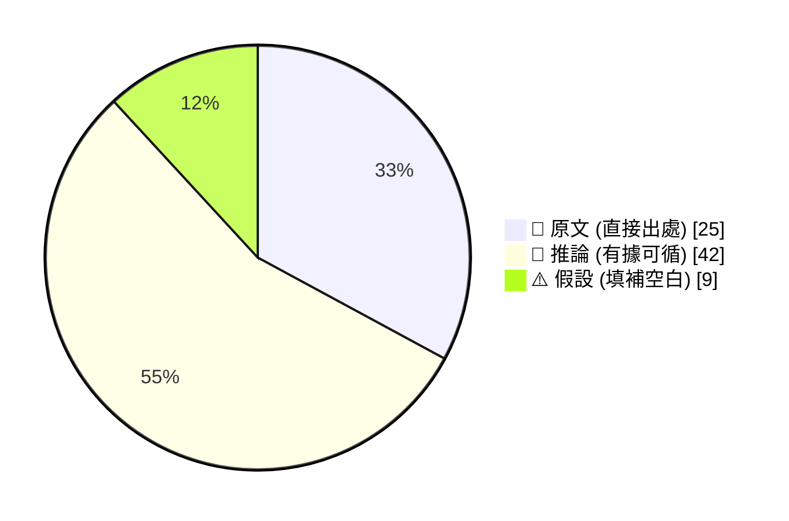

_引用規範：📖 可直接引用；🧠 客戶會議前查 verification hints；⚠️ 引用時明說「此為推測」_

## 🔄 本期 pipeline 處理流程

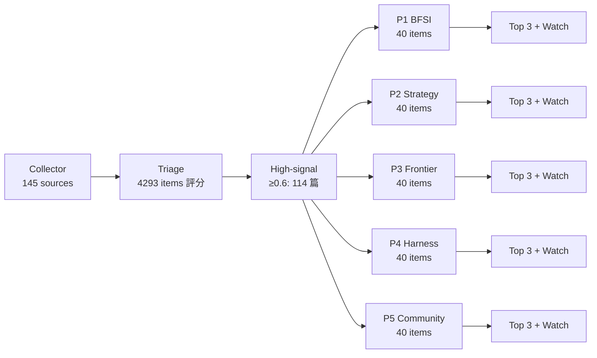

## 📑 目錄
- [Pillar 1 — 產業 AI 真實落地 (BFSI + 製造業)](#pillar-1) · 22 items · $0.0883
- [Pillar 2 — AI 戰略 / 治理 / 董事會層級論述](#pillar-2) · 19 items · $0.0807
- [Pillar 3 — Frontier 能力 + 模型動向](#pillar-3) · 19 items · $0.0687
- [Pillar 4 — Harness Engineering 實作技藝](#pillar-4) · 40 items · $0.1198
- [Pillar 5 — 學派 / 社群 / 思想動態](#pillar-5) · 14 items · $0.0640
- [📚 Foundation 深讀](#foundation) · curriculum 主題深度文

---

## 🏦 Pillar 1 — 產業 AI 真實落地 (BFSI + 製造業)
_22 items · $0.0883_

## Pulse — Top 3

### 1. Anthropic Claude Managed Agents 支援企業私有網路（MCP Tunnels）與客戶自建執行環境

📖 **原文** Anthropic 更新 Claude 平台，為 Claude Managed Agents 新增兩項企業落地關鍵能力：可連接私有網路 MCP 伺服器的 MCP Tunnels（研究預覽版），以及可在客戶自有環境執行工具與程式碼的 remote execution 功能。

🧠 **推論** 對台灣銀行業（如國泰、玉山、中信）而言，這解除了過去 cloud-hosted agent 無法觸及 on-premise 核心系統的最大阻礙——合規與資安部門長期要求「資料不出境、工具在自控環境跑」，現在有了原生支援路徑。

🧠 **推論** 對製造業（台積電、鴻海、緯創）的影響是：MES、ERP 等廠內系統現可透過私有 MCP 伺服器接入 agent workflow，無需將生產資料送上公有雲，顯著降低資安風險與監理摩擦。

下圖說明 Claude Managed Agents 新架構如何連通企業內網：

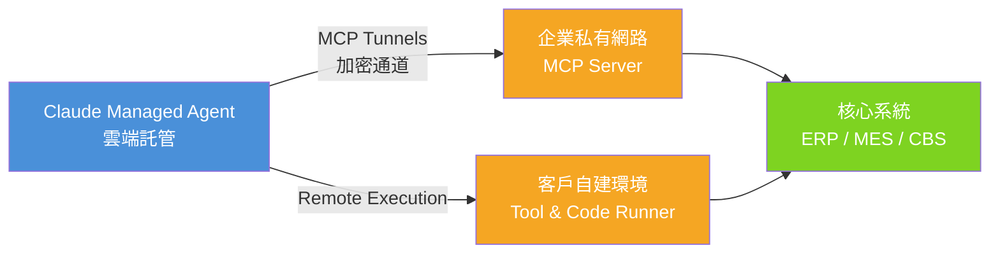

*關鍵洞察：agent 推論留在 Anthropic 雲端，工具執行與資料存取留在客戶端——這是合規友善的「腦手分離」架構。*

- 來源：[iThome](https://www.ithome.com.tw/news/176026)
- 對客戶的具體含意：向玉山、中信等正在評估 agentic banking 的客戶展示此架構，強調 MCP Tunnels 讓 agent 可讀核心銀行資料卻不需資料外傳，直接回應合規長的最大顧慮。

**(English)** **Anthropic Claude Managed Agents now support enterprise private networks (MCP Tunnels) and customer-hosted tool execution**

📖 **Source** Anthropic updated the Claude platform, adding two enterprise-critical capabilities to Claude Managed Agents: MCP Tunnels (research preview) for connecting to private-network MCP servers, and remote execution for running tools and code in customer-controlled environments. [Inference] For Taiwan banks (Cathay, E.SUN, CTBC), this removes the single biggest blocker to cloud-hosted agents touching on-premise core systems — compliance and security teams have long demanded "data stays on-premises, tools run in our environment," and there is now a native architecture that satisfies both. [Inference] For manufacturers (TSMC, Foxconn, Wistron), MES and ERP systems can now be connected to agent workflows via private MCP servers without sending production data to public cloud, materially reducing security risk and regulatory friction.

The diagram above illustrates how the new architecture bridges cloud agents to enterprise private networks.

- Source: [iThome](https://www.ithome.com.tw/news/176026)
- Client implication: Use this architecture with E.SUN or CTBC teams evaluating agentic banking — MCP Tunnels let agents read core banking data without data leaving the premises, directly addressing the CISO's primary objection.

---

### 2. Anthropic Claude Code 沙箱繞過漏洞遭靜默修補：企業用戶五個月暴露於攻擊風險中

📖 **原文** 研究人員發現 Anthropic 於 2025 年 10 月起，在五個月內靜默修補了 Claude Code 的兩個沙箱繞過（sandbox bypass）漏洞，全程未發出任何公告或提醒，廣大企業用戶在不知情狀況下持續暴露於攻擊風險。

🧠 **推論** 對 Livia 的銀行客戶而言，這是一個具體的風險治理案例：若貴行已將 Claude Code 或任何 AI coding agent 導入開發流程，必須立即確認目前使用版本，並追問 vendor 是否有 CVE 揭露與修補通知機制。「AI 工具的 patch management」在台灣銀行業的 IT 治理框架中幾乎還是空白地帶。

🧠 **推論** 同時發現的還有開源 AI 推論框架 SGLang 的三項 RCE 漏洞（CERT/CC 已發布通報）及 NVIDIA Triton Inference Server 的八項漏洞（建議升至 26.03 版）——三起事件同週浮現，顯示 AI production infra 的 vulnerability disclosure 生態正在快速成熟，但企業 patch cycle 尚未跟上。

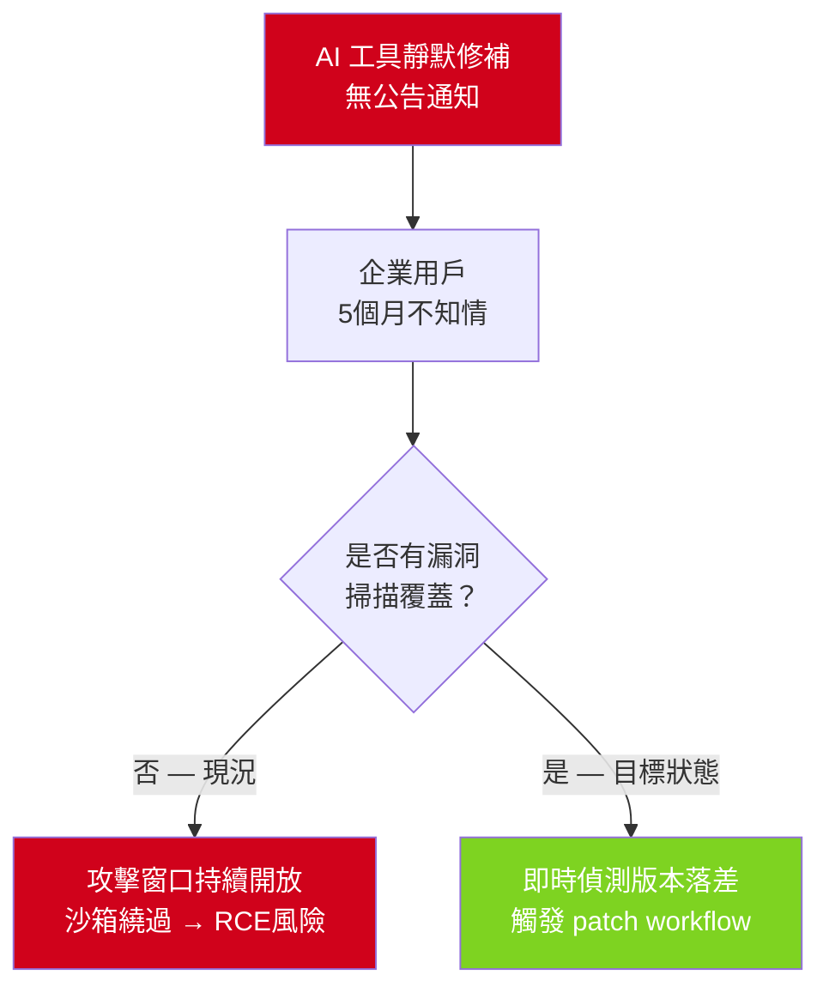

*關鍵洞察：AI 工具的靜默修補打破了傳統 CVE → CERT → 企業通知鏈，銀行需主動將 AI tooling 納入既有漏洞管理流程。*

- 來源：[iThome — Claude Code 漏洞](https://www.ithome.com.tw/news/176010)、[iThome — SGLang RCE](https://www.ithome.com.tw/news/176018)、[iThome — NVIDIA Triton](https://www.ithome.com.tw/news/176024)
- 對客戶的具體含意：在與台新、第一銀行等已試跑 AI coding agent 的客戶會議中，主動提出「AI 工具 patch management SOP」缺口，IBM 可協助建立納管框架，這是當下最容易成交的 governance 切入點。

**(English)** **Anthropic silently patched two Claude Code sandbox bypass vulnerabilities, leaving enterprise users exposed for five months**

📖 **Source** Researchers found that Anthropic silently patched two sandbox bypass vulnerabilities in Claude Code between October 2025 and March 2026, issuing no public advisory or customer notification throughout — leaving enterprise users unknowingly exposed during the entire window. [Inference] For Livia's bank clients, this is a concrete governance case study: any institution that has deployed Claude Code or any AI coding agent in its development pipeline must immediately verify the current version in use and demand a clear CVE disclosure and patch notification commitment from the vendor. "AI tooling patch management" is effectively a blank space in Taiwan banking IT governance frameworks today. [Inference] The same week also surfaced three RCE vulnerabilities in open-source inference framework SGLang (CERT/CC advisory issued) and eight vulnerabilities in NVIDIA Triton Inference Server (upgrade to v26.03 recommended) — three incidents in one week signals that AI production infrastructure vulnerability disclosure is maturing rapidly, but enterprise patch cycles have not yet caught up.

The diagram above illustrates the failure mode: silent patching breaks the traditional CVE → CERT → enterprise notification chain.

- Sources: [iThome — Claude Code](https://www.ithome.com.tw/news/176010), [iThome — SGLang RCE](https://www.ithome.com.tw/news/176018), [iThome — NVIDIA Triton](https://www.ithome.com.tw/news/176024)
- Client implication: In meetings with Taishin or First Bank teams already piloting AI coding agents, proactively raise the "AI tooling patch management SOP" gap — IBM can offer a governance framework to close it, and this is the most immediately actionable consulting entry point.

---

### 3. 黃仁勳承認中國 AI 晶片市場已「大致讓給」華為：台灣製造業供應鏈需重新評估基礎設施來源

📖 **原文** NVIDIA 執行長黃仁勳公開表示，受美國出口管制持續影響，NVIDIA「大致上」已將中國 AI 晶片市場讓給華為。

🧠 **推論** 對台灣製造業客戶（鴻海、緯創、廣達、仁寶）而言，這不只是地緣政治新聞，而是直接影響其在中國廠區的 AI 基礎設施採購策略：若中國業務比重高，未來的 inference infra 將不可避免地走向 Huawei Ascend 生態，而非 NVIDIA GPU，這對 MLOps 工具鏈、模型格式相容性、軟體授權都帶來巨大的分叉風險。

🧠 **推論** 對台灣銀行業的間接影響：台灣本地銀行與製造業大客戶的跨境業務若涉及中國廠區的 AI workload，金融機構在評估供應鏈融資與企業信貸風險時，應將「AI infra 管制風險」納入企業客戶的科技依賴評估項目。同週南亞科宣布 DRAM 供需缺口延續至 2027 年底並獲思科等四家廠商私募參與，進一步印證 AI 硬體供應鏈的結構性緊張持續。

- 來源：[科技新報 — 黃仁勳談中國市場](https://technews.tw/2026/05/21/nvidia-says-it-has-largely-conceded-chinas-ai-chip-market-to-huawei/)、[INSIDE — 南亞科 DRAM 缺口](https://www.inside.com.tw/article/41348-nanya-dram-shortage-2027-ai-private-placement-expansion)
- 對客戶的具體含意：與鴻海、緯創等在中國設有大量產能的製造業客戶討論 AI 轉型路徑時，必須加入「中國廠區用華為 Ascend、台灣廠區用 NVIDIA」的雙軌架構評估，IBM 的 platform-agnostic 定位在此具有差異化價值。

**(English)** **Jensen Huang concedes China AI chip market "largely" to Huawei: Taiwan manufacturers must reassess infrastructure sourcing**

📖 **Source** NVIDIA CEO Jensen Huang publicly stated that due to continuing US export controls, NVIDIA has "largely" conceded the China AI chip market to Huawei. [Inference] For Taiwan manufacturing clients (Foxconn, Wistron, Quanta, Compal), this is not merely geopolitical news — it directly affects AI infrastructure procurement strategy for China-based facilities: companies with significant China operations will increasingly face Huawei Ascend ecosystems rather than NVIDIA GPUs for their inference workloads, creating serious divergence risks across MLOps toolchains, model format compatibility, and software licensing. [Inference] The indirect implication for Taiwan banks: financial institutions assessing cross-border supply-chain financing or corporate credit for manufacturing clients with China operations should begin incorporating "AI infrastructure regulatory risk" into technology-dependency assessments for those clients. In the same week, Nanya Technology announced a DRAM supply-demand gap extending to end-2027 and secured a private placement from Cisco and three other major firms — reinforcing the structural tightness in AI hardware supply chains.

- Sources: [TechNews — Huang on China](https://technews.tw/2026/05/21/nvidia-says-it-has-largely-conceded-chinas-ai-chip-market-to-huawei/), [INSIDE — Nanya DRAM shortage](https://www.inside.com.tw/article/41348-nanya-dram-shortage-2027-ai-private-placement-expansion)
- Client implication: When discussing AI transformation roadmaps with Foxconn or Wistron — both of whom have heavy China manufacturing footprints — introduce a dual-track infrastructure assessment (Huawei Ascend for China sites, NVIDIA for Taiwan sites), where IBM's platform-agnostic positioning is a genuine differentiator.

---

## Watch list

繁中為主，每條一行：

- [iThome — Confluent MCP + Agent Skills](https://www.ithome.com.tw/news/175999) — IBM 旗下 Confluent 為即時 AI 應用新增全託管 MCP 伺服器與個資偵測，金融業資料串流治理直接參考案例
- [LangChain Interrupt 2026 發布總覽](https://www.langchain.com/blog/interrupt-2026-overview) — agent production 工具集大規模更新，含自動化 debugging 與一鍵部署，建置 harness pipeline 的直接參考
- [科技新報 — NVIDIA Vera CPU 與 2,000 億美元 CPU 市場](https://www.inside.com.tw/article/41343-jensen-huang-says-hes-found-a-brand-new-200b-market-for-nvidia) — Vera CPU 宣稱 agent sandbox 速度提升 50%、推論成本降至十分之一，數字需獨立驗證才能引用
- [OpenAI + Dell — Codex 混合雲/地端部署合作](https://openai.com/index/dell-codex-enterprise-partnership) — 提供不願上公有雲的台灣企業一個 on-premise coding agent 參考架構
- [Latent Space — Railway Agent-Native Cloud](https://www.latent.space/p/railway) — 3M 用戶、$200K+ agent spend 的真實 infra 規模數據，適合向客戶說明 agent workload 成長曲線
- [OpenAI — Ramp × Codex code review 案例](https://openai.com/index/ramp) — GPT-5.5 驅動的 code review 從數小時縮至數分鐘，可作為製造業軟體開發團隊的 ROI 說帖素材
- [紅帽 OpenShift AI 3.4 — 推論閘道與 token 配額管控](https://www.ithome.com.tw/news/176001) — 多租戶模型治理架構，適合向多部門共用 AI 平台的大型銀行提案
- [iThome — AI 進入漏洞研究流程（Mozilla、微軟、GitHub）](https://www.ithome.com.tw/news/175980) — Anthropic Project Glasswing 在主流 OS/瀏覽器找到零時差漏洞，資安長級對話的開場素材
- [INSIDE — 南亞科 AI 記憶體私募擴產](https://www.inside.com.tw/article/41348-nanya-dram-shortage-2027-ai-private-placement-expansion) — 台灣本土製造商直接參與 AI 記憶體供應鏈，2027 年底前缺口持續，影響 AI infra 建置時程規劃

---

## Verification hints

This briefing contains **5

🧠 **推論**** segments and **0

⚠️ **假設**** segments. Before citing in client conversations, verify these specific points (English for language-learning practice):

1. **MCP Tunnels production-readiness**: The iThome excerpt describes MCP Tunnels as "研究預覽版" (research preview). Before citing this to a bank CISO as a production-ready capability, verify with Anthropic's official documentation whether it has graduated to GA, and what SLA commitments apply.
2. **Claude Code sandbox bypass — specific CVE identifiers**: The iThome article confirms two vulnerabilities were silently patched but does not provide CVE numbers or technical specifics. Before using this in a formal risk advisory to a banking client, obtain the CVE IDs (if assigned) and confirm the attack surface — whether this affects remote deployments, CI/CD integrations, or only local developer environments.
3. **SGLang RCE — CERT/CC advisory status**: The iThome article states CERT/CC issued an advisory and recommends restricting access until patches are released. Verify at [CERT/CC's VU database](https://www.kb.cert.org/vuls/) whether patches have since been released and what the confirmed affected version range is — the article was published 2026-05-21 and the situation may have moved.
4. **NVIDIA Triton v26.03 patch coverage**: The iThome article states users should upgrade to v26.03. Before advising manufacturing clients running Triton in production, confirm that v26.03 is available in their specific deployment environment (bare metal vs. NGC container vs. cloud marketplace) and that the eight patched vulnerabilities are fully closed in that build.
5. **Huawei Ascend ecosystem maturity for Taiwan manufacturers**: Huang's concession on the China AI chip market is

📖 **原文**, but the inference that Foxconn/Wistron will face Ascend-based deployments in China facilities is

🧠 **推論** based on market dynamics. Before presenting a dual-track architecture recommendation, verify with clients whether their China operations already have NVIDIA hardware locked in under grandfather clauses, or whether Huawei Ascend is already in active evaluation — the timeline and urgency differ significantly between the two cases.2026-05-21 23:50:27,959 INFO pillar 2 (AI 戰略 / 治理 / 董事會層級論述): 19 high-signal items (min_signal=0.60)

---

## 📊 Pillar 2 — AI 戰略 / 治理 / 董事會層級論述
_19 items · $0.0807_

## Pulse — Top 3

### 1. 台灣政府正式啟動 AI 治理架構：國家 AI 戰略委員會、風險分類框架、人才指引 3.0 同步推進

📖 **原文** 《人工智慧基本法》於 2026 年 1 月 14 日施行後，行政院宣布設立「國家人工智慧戰略特別委員會」，由行政院長擔任召集人；國科會負責統籌 AI 治理與國家發展綱領；數發部近期將公布 AI 風險分類框架；行政院同日通過「AI 產業人才認定指引 3.0」，新增 AI 治理素養與 AI 協作開發能力兩項維度，並預告 6 月發布「AI 公務人才認定指引」。

🧠 **推論** 這三件事同步發生，代表台灣正從「立法宣示」進入「監管落地」階段——風險分類框架一旦發布，金融、製造業就必須依據風險等級建立產業管理規範與公部門內控制度，這直接影響 Cathay、E.SUN、CTBC 等銀行的 AI 專案合規時程。

🧠 **推論** 指引 3.0 將 AI 治理素養列為人才能力框架核心，表示客戶在採購 AI transformation 方案時，人才盤點與治理培訓將成為採購決策的一部分，而非事後補課。

以下架構說明這波政策如何從法律轉化為企業合規壓力：

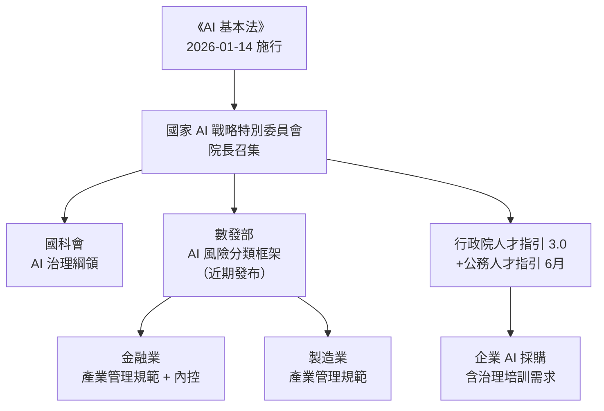

*關鍵洞察：風險分類框架是這波政策的觸發器——框架一出，銀行與製造業就有具體合規義務，IBM 的 governance 服務因此從「加分項目」變成「必要配備」。*

- 來源：[iThome — 行政院 AI 戰略委員會](https://www.ithome.com.tw/news/176019)、[iThome — AI 人才指引 3.0](https://www.ithome.com.tw/news/176022)
- 對客戶的具體含意：向 Cathay、E.SUN、CTBC 董事會提案時，可直接引用「風險分類框架即將發布」作為啟動 AI governance 審查的外部觸發點，而非只靠內部倡議驅動。

**(English)** Taiwan government simultaneously launches National AI Strategy Committee, risk classification framework, and Talent Guidelines 3.0

📖 **原文** Following the AI Basic Act's enactment on January 14, 2026, Taiwan's Executive Yuan announced the formation of a National AI Strategy Committee chaired by the Premier; NSTC will coordinate AI governance and the national development framework; MODA will soon publish an AI risk classification framework; the Executive Yuan also passed AI Industry Talent Guidelines 3.0, adding AI governance literacy and AI collaborative development as new competency dimensions, with AI Civil Servant Talent Guidelines scheduled for June.

🧠 **推論** These three moves happening simultaneously signal Taiwan's transition from "legislative declaration" to "regulatory enforcement" — once the risk classification framework publishes, financial and manufacturing sectors must establish industry management rules and internal control systems tiered to risk level, directly affecting compliance timelines for AI projects at Cathay, E.SUN, and CTBC.

🧠 **推論** The inclusion of AI governance literacy as a core competency dimension in Guidelines 3.0 means clients evaluating AI transformation proposals will increasingly bundle talent assessment and governance training into procurement decisions, not treat them as afterthoughts.

The diagram above shows how this policy wave converts legislation into enterprise compliance pressure.

- Source: [iThome — AI Strategy Committee](https://www.ithome.com.tw/news/176019), [iThome — Talent Guidelines 3.0](https://www.ithome.com.tw/news/176022)
- Client implication: When proposing to Cathay, E.SUN, or CTBC boards, cite the imminent risk classification framework as an external trigger for launching an AI governance review — far more compelling than internal advocacy alone.

---

### 2. SAS 內部 4,200 支員工自建 AI Agent：治理框架如何追上擴散速度

📖 **原文** SAS CIO Jay Upchurch 透露，SAS 內部有 5,000+ Microsoft Copilot 授權，員工用這些授權自建超過 4,200 支 AI Agent；部分 Agent 已從個人生產力工具演化為企業級應用，協助工程師跨系統操作、搜尋知識庫和執行維運流程。

🧠 **推論** SAS 面對的問題——「員工都能自建 Agent 後，企業如何治理、擴散、產品化」——正是台灣銀行與製造業客戶在 2026 年下半年將集體撞上的牆。Cathay 或 TSMC 若開放 Copilot 大規模部署，同樣的 Agent 爆炸性增長幾乎是必然的，而 governance by design 在授權前就必須到位，事後補是管不住的。

🧠 **推論** SAS 的案例也暗示 production scaling 的關鍵不是技術，而是「哪些 Agent 可以升格為企業級」的審核機制——這是 IBM 可以把 governance framework 轉化為具體交付物的切入點。

Agent 生命週期的治理壓力點：

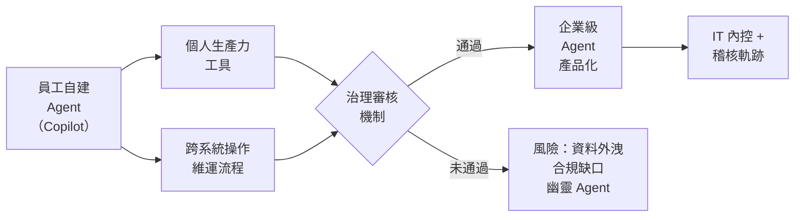

*關鍵洞察：D 節點（治理審核機制）是整個流程的控制閘門，在台灣銀行客戶中，這個節點目前幾乎是空白的。*

- 來源：[iThome — SAS CIO GenAI 實戰](https://www.ithome.com.tw/news/176029)
- 對客戶的具體含意：向台灣銀行業 CIO 提案時，用 SAS 4,200 Agent 案例具象化「為什麼 governance framework 要比 pilot 先行」——不是恐嚇，而是給他們一個真實的鏡子。

**(English)** SAS deploys 4,200 employee-built AI agents internally: how does governance keep pace with proliferation?

📖 **原文** SAS CIO Jay Upchurch disclosed that SAS has 5,000+ Microsoft Copilot licenses internally, with employees using them to build over 4,200 AI agents; some of these agents have evolved from personal productivity tools into enterprise-grade applications, helping engineers operate across systems, search knowledge bases, and execute operations workflows.

🧠 **推論** The problem SAS is now solving — "once employees can all build agents, how does the enterprise govern, scale, and productize them?" — is the wall Taiwan banks and manufacturers will collectively hit in H2 2026. If Cathay or TSMC opens up Copilot at scale, the same explosive agent proliferation is virtually inevitable, and governance-by-design must be in place before licensing, not retrofitted after.

🧠 **推論** The SAS case also implies that the bottleneck for production scaling isn't technical but procedural — specifically, "which agents qualify to be elevated to enterprise-grade?" This is a concrete governance framework deliverable where IBM can differentiate.

The diagram above maps where governance pressure concentrates in the agent lifecycle.

- Source: [iThome — SAS CIO GenAI Field Experience](https://www.ithome.com.tw/news/176029)
- Client implication: Use the SAS 4,200-agent case with Taiwan bank CIOs to make concrete why governance frameworks should precede pilots — not as a scare tactic, but as a realistic preview of their near-term trajectory.

---

### 3. BaFin 示警 AI 與量子運算推升金融業網路風險，將強化 IT 重點檢查

📖 **原文** 德國聯邦金融監理總署（BaFin）總裁 Mark Branson 於 5 月 12 日年度記者會上，將網路空間風險列為金融業重要風險之一，明確點名 AI 與量子運算是推升因子，並表示這類風險不只威脅機構穩定，也影響消費者取得金融服務的能力，BaFin 將對金融機構加強 IT 重點檢查。

🧠 **推論** BaFin 是歐盟最具指標性的金融監理機構之一，其監理重點往往被亞洲監理機關參考；台灣金管會在 AI 風險監管框架仍在形塑階段，BaFin 的 IT 重點檢查清單很可能成為金管會未來指引的參考藍本。

🧠 **推論** 對 Livia 的銀行客戶而言，這個訊號的意義是：AI 治理風險正從「內部 policy 問題」升格為「監理機關主動稽核項目」，董事會需要看到的不是 AI 路線圖，而是 AI risk register 與稽核就緒性。

- 來源：[iThome — BaFin AI 量子風險](https://www.ithome.com.tw/news/176000)
- 對客戶的具體含意：在 Cathay、Mega、First 等銀行的董事會層級提案中，引用 BaFin 具名點出 AI 為監理稽核項目，作為「AI risk register 現在就要建」的監管壓力佐證，而非等台灣金管會正式發文。

**(English)** BaFin warns AI and quantum computing are escalating cyber risk in financial sector; strengthened IT inspections announced

📖 **原文** BaFin President Mark Branson, at his May 12 annual press conference, named cyber risk as a top financial sector risk, explicitly citing AI and quantum computing as amplifying factors, and stated that such risks not only threaten institutional stability but also consumers' ability to access financial services — with BaFin announcing strengthened IT-focused inspections of financial institutions.

🧠 **推論** BaFin is one of the EU's most influential financial regulators, and its supervisory priorities are frequently referenced by Asian regulators; Taiwan's FSC is still shaping its AI risk supervision framework, making BaFin's IT inspection checklist a likely reference template for future FSC guidance.

🧠 **推論** For Livia's banking clients, the signal is that AI governance risk is being elevated from "internal policy matter" to "active regulatory audit item" — what boards need to see is not an AI roadmap but an AI risk register and audit readiness documentation.

- Source: [iThome — BaFin AI Quantum Risk](https://www.ithome.com.tw/news/176000)
- Client implication: In board-level proposals to Cathay, Mega, or First Bank, cite BaFin explicitly naming AI as a regulatory inspection target as evidence that building an AI risk register now is a prudent hedge against FSC scrutiny — don't wait for the local regulator to issue formal guidance.

---

## Watch list

繁中為主，每條一行：

- [iThome — 新加坡政府 AI 代理沙盒](https://www.ithome.com.tw/news/176027) — 新加坡 CSA/GovTech 公布 AI Agent 公共服務沙盒結果，是亞洲政府治理框架的罕見實測數據，可作為台灣公部門 AI 部署的對標案例
- [LangChain — LangSmith LLM Gateway](https://www.langchain.com/blog/introducing-llm-gateway) — runtime governance 直接嵌入 agent lifecycle，含 spend limits 與 PII redaction，是 harness 工程的具體實作參考
- [Databricks — Unity Catalog Agent Governance](https://www.databricks.com/blog/governing-ai-agents-scale-unity-catalog) — 多 agent 系統的 at-scale governance 框架，廠商立場但技術內容有料，值得對照 LangSmith 方案評估差異
- [OpenAI — Dell Codex 混合/本地部署](https://openai.com/index/dell-codex-enterprise-partnership) — Codex 進入 on-prem/hybrid 環境，直接回應台灣銀行「資料不能出境」的合規疑慮，值得追蹤架構細節
- [OpenAI — Content Provenance](https://openai.com/index/advancing-content-provenance) — Content Credentials + SynthID 驗證工具，針對 AI 生成內容的溯源治理，監管壓力升高時可能成為必要配備
- [科技新報 — 黃仁勳：中國 AI 市場讓給華為](https://technews.tw/2026/05/21/nvidia-says-it-has-largely-conceded-chinas-ai-chip-market-to-huawei/) — 地緣政治重塑 AI 晶片供應鏈，直接影響台灣製造業客戶的 AI infra 採購策略
- [INSIDE — Anthropic Q2 首度轉盈](https://www.inside.com.tw/article/41344-anthropic-says-its-about-to-have-its-first-profitable-quarter) — 單季營收 109 億美元、季增 130%，但文章本身提醒可能是「快閃獲利」，在客戶對話中引用前先確認是否為預測值
- [iThome — Meta 詐騙占台灣案件 84%](https://www.ithome.com.tw/news/175998) — 政府要求 Meta 演算法源頭攔截，平台責任修法壓力升高，金融業 fraud detection AI 合規需求隨之強化
- [AI Snake Oil — AI 風險是否需要政府特別干預](https://www.normaltech.ai/p/do-ai-risks-require-extraordinary) — Narayanan/Kapoor 對 AI 治理框架的批判性分析，適合作為客戶治理提案中「反向論述」的壓力測試材料
- [Intuit 裁員 17% 轉型 AI](https://finance.technews.tw/2026/05/21/intuit-reports-strong-third-quarter-results-and-raises-full-year-revenue-guidance/) — 金融科技大廠資本重新配置的真實信號，但缺乏部署細節；可用作「AI transformation 伴隨組織重構」的案例佐證

---

## Verification hints

This briefing contains **4

🧠 **推論** segments** and **0

⚠️ **假設** segments**. Before citing in client conversations, verify these specific points (English for language-learning practice):

1. **Taiwan AI risk classification framework timing** ([iThome](https://www.ithome.com.tw/news/176019)): The article states MODA will publish the AI risk classification framework "near-term" (近期). Verify whether a specific publication date or draft has since been released before using this as a client deadline anchor.
2. **SAS 4,200 agents — governance mechanism details** ([iThome](https://www.ithome.com.tw/news/176029)): The excerpt confirms the 4,200-agent count and that some became enterprise-grade, but does not detail what governance or approval mechanism SAS actually uses. The inference that "a review gate exists" is reasonable but unconfirmed — check the full iThome article for specifics before presenting it as a prescriptive model.
3. **Anthropic Q2 profitability — forecast vs. actuals** ([INSIDE](https://www.inside.com.tw/article/41344-anthropic-says-its-about-to-have-its-first-profitable-quarter)): The headline figure of NT$109 billion in quarterly revenue and the "first profitable quarter" claim appears to be a forward projection, not a reported result. The article itself flags this may be transient ("快閃獲利"). Confirm whether Q2 has closed and whether Anthropic has published actual financials before citing in valuation discussions.
4. **BaFin → FSC regulatory reference pathway** ([iThome](https://www.ithome.com.tw/news/176000)): The inference that Taiwan's FSC will reference BaFin's IT inspection checklist is based on general regulatory pattern-matching, not a documented link. Check whether FSC has cited BaFin in any recent AI or cybersecurity guidance before presenting this as an established precedent in client conversations.2026-05-21 23:52:01,465 INFO pillar 3 (Frontier 能力 + 模型動向): 19 high-signal items (min_signal=0.60)

---

## 🚀 Pillar 3 — Frontier 能力 + 模型動向
_19 items · $0.0687_

## Pulse — Pillar 3: Frontier 能力 + 模型動向

---

## Pulse — Top 3

### 1. IBM Research × Hugging Face 發布「Open Agent Leaderboard」：評的不只是模型，而是整個 agent 系統

🧠 **推論** IBM Research 與 Hugging Face 合作推出 Open Agent Leaderboard，明確指出部署 agent 時真正決定效能的是「整個系統」——包括工具選擇、規劃策略、記憶機制、錯誤恢復能力——而非單一模型分數。

📖 **原文** 「Change any of those and the same model can produce very different results.」這對 Livia 的銀行客戶（如 Cathay、E.SUN）具有直接意義：採購決策不能只比 benchmark 分數，必須同時評估 orchestration 架構；對 harness 實作而言，這個 leaderboard 提供了一個可公開引用的評估框架，可直接嵌入 POC 評估流程。

下圖說明 agent 系統評估的四個維度，彼此互相影響，任一變動都可能翻轉結果：

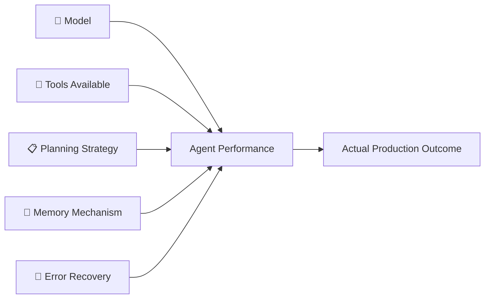

關鍵洞察：同一個模型在不同系統配置下，結果可能天差地別——這正是為何 benchmark 排名無法直接對應 production 表現。

- 來源：[Hugging Face Blog — Open Agent Leaderboard](https://huggingface.co/blog/ibm-research/open-agent-leaderboard)
- 對客戶的具體含意：向 Cathay 或 CTBC 提案 agent 方案時，主動秀出這個 leaderboard 作為第三方評估依據，把對話從「哪個模型比較好」轉移到「你們的 orchestration 架構是否可評估、可比較」。

---

**(English)** IBM Research × Hugging Face launch "Open Agent Leaderboard": evaluating the full system, not just the model

🧠 **推論** IBM Research and Hugging Face have jointly released the Open Agent Leaderboard, explicitly framing agent deployment success as a function of the **entire system**—tool selection, planning strategy, memory mechanism, and error recovery—not the model score alone.

📖 **原文** "Change any of those and the same model can produce very different results." For Livia's bank clients (Cathay, E.SUN), this means procurement decisions cannot rely on benchmark rankings alone; the orchestration architecture must also be evaluated. For harness engineering, this leaderboard provides a publicly citable evaluation framework that can be embedded directly into POC scoring rubrics.

The diagram above illustrates how four system dimensions each independently influence agent performance, making any single-axis comparison misleading.

- Source: [Hugging Face Blog — Open Agent Leaderboard](https://huggingface.co/blog/ibm-research/open-agent-leaderboard)
- Client implication: In Cathay or CTBC agent proposals, lead with this leaderboard as a third-party evaluation anchor to shift the conversation from "which model is better" to "is your orchestration architecture measurable and comparable."

---

### 2. Google I/O 2026：Gemini 3.5 Flash 直接 GA，跳過 preview、部署到「數十億用戶」產品線

📖 **原文** Google 在 I/O 2026 發布 Gemini 3.5 Flash，跳過 `-preview` 標記直接進入 general availability，同步部署至 Gemini app、AI Mode in Google Search、Google Antigravity 開發平台、Gemini API、AI Studio、Android Studio，以及企業版 Gemini Enterprise。

🧠 **推論** 這個發布策略（跳過 preview、大規模同步上線）顯示 Google 對此模型的生產穩定性有高度信心，且將 3.5 Flash 定位為其 agent-first 平台 Antigravity 的骨幹模型。對台灣企業客戶而言，這意味著 Google Workspace 與 Cloud 生態系統的 AI 能力將在短期內有實質升級，Gemini Enterprise 路線的 IT 建設評估視窗正在縮短。Simon Willison 指出此模型「比前代更貴」，

⚠️ **假設** 推測 Google 用成本換取更強的 agentic reasoning 能力，而非純粹壓縮成本。

- 來源：[Simon Willison — Gemini 3.5 Flash](https://simonwillison.net/2026/May/19/gemini-35-flash/#atom-everything)、[Latent Space AINews — Google I/O 2026](https://www.latent.space/p/ainews-google-io-2026-gemini-35-flash)、[Google DeepMind Blog — Gemini 3.5](https://deepmind.google/blog/gemini-3-5-frontier-intelligence-with-action/)
- 對客戶的具體含意：已在評估 Google Cloud 的台灣銀行（Mega、First）應加快向 Google 要求 Gemini Enterprise + Antigravity 的 POC 條件，因為 GA 代表 SLA 可談。

---

**(English)** Google I/O 2026: Gemini 3.5 Flash ships directly to GA, skipping preview, deployed across "billions of users" product surface

📖 **原文** Google released Gemini 3.5 Flash at I/O 2026, skipping the `-preview` modifier and going straight to general availability, simultaneously deploying to the Gemini app, AI Mode in Google Search, the Google Antigravity agent-first development platform, the Gemini API, AI Studio, Android Studio, and Gemini Enterprise.

🧠 **推論** The skip-preview release strategy signals Google's high confidence in production stability and positions 3.5 Flash as the backbone model for its Antigravity platform. For Taiwan enterprise clients, this means Google Workspace and Cloud AI capabilities will see substantive upgrades in the near term, and the evaluation window for Gemini Enterprise infrastructure decisions is compressing. Simon Willison notes the model is "more expensive than its predecessor,"

⚠️ **假設** suggesting Google traded cost for stronger agentic reasoning rather than pursuing pure efficiency gains.

- Source: [Simon Willison — Gemini 3.5 Flash](https://simonwillison.net/2026/May/19/gemini-35-flash/#atom-everything), [Latent Space AINews — Google I/O 2026](https://www.latent.space/p/ainews-google-io-2026-gemini-35-flash), [Google DeepMind Blog — Gemini 3.5](https://deepmind.google/blog/gemini-3-5-frontier-intelligence-with-action/)
- Client implication: Taiwan banks already evaluating Google Cloud (Mega, First) should accelerate requests for Gemini Enterprise + Antigravity POC terms now that GA status means SLAs are negotiable.

---

### 3. OpenAI 模型以不到 $1,000 推翻 Erdős 80 年猜想：frontier reasoning 進入「解決開放數學問題」階段

📖 **原文** OpenAI 模型（據 Latent Space 報導為 GPT-next）推翻了離散幾何領域的 unit distance problem，即 Erdős 提出的 80 年猜想，整個計算成本低於 $1,000。

🧠 **推論** 這不是「AI 很聰明」的宣傳稿——它是一個具體的能力里程碑：frontier model 在有明確 verification 機制的數學領域（對錯可驗證）已達到超越人類數學家的推理深度。對 Livia 的製造業客戶（TSMC、MediaTek）而言，這預示著 AI 輔助的工程推理（例如晶片設計約束求解、製程參數優化）的能力曲線正在加速；

⚠️ **假設** 但在工程 domain 尚未有同等 benchmark，需謹慎類比。注意：

🧠 **推論** Latent Space 來源將此歸因於「GPT-next」，OpenAI 官方文章僅稱「an OpenAI model」，確切模型身份未公開。

- 來源：[OpenAI Blog — Model Disproves Discrete Geometry Conjecture](https://openai.com/index/model-disproves-discrete-geometry-conjecture)、[Latent Space AINews — GPT-next](https://www.latent.space/p/ainews-openai-gpt-next-disproves)
- 對客戶的具體含意：向 TSMC 或 MediaTek 提案 AI 輔助 R&D 時，這個案例可作為「AI 解決人類長期未解問題」的具體錨點，但需同步說明「數學有明確驗證機制，工程問題的驗證迴路更複雜」。

---

**(English)** OpenAI model disproves Erdős 80-year-old conjecture for under $1,000: frontier reasoning enters "open math problem" territory

📖 **原文** An OpenAI model (identified by Latent Space as GPT-next) disproved the unit distance problem in discrete geometry—an 80-year-old Erdős conjecture—at a total compute cost of under $1,000.

🧠 **推論** This is not vendor PR: it is a concrete capability milestone showing that frontier models have reached reasoning depth exceeding human mathematicians in domains with clear verification mechanisms (i.e., where right/wrong can be checked). For Livia's manufacturing clients (TSMC, MediaTek), this signals an accelerating capability curve for AI-assisted engineering reasoning—constraint solving in chip design, process parameter optimization.

⚠️ **假設** However, no equivalent benchmark exists for engineering domains yet; the analogy should be drawn carefully. Note:

🧠 **推論** the Latent Space source attributes this to "GPT-next," while OpenAI's official post says only "an OpenAI model"—the exact model identity is not public.

- Source: [OpenAI Blog — Model Disproves Discrete Geometry Conjecture](https://openai.com/index/model-disproves-discrete-geometry-conjecture), [Latent Space AINews — GPT-next](https://www.latent.space/p/ainews-openai-gpt-next-disproves)
- Client implication: In TSMC or MediaTek AI-assisted R&D proposals, use this as a concrete anchor for "AI solving problems humans couldn't"—but immediately qualify it by explaining that math has clean verification loops while engineering problems have far messier ones.

---

## Watch list

繁中為主，每條一行：

- [NVIDIA Blog — Vera CPU Delivery](https://blogs.nvidia.com/blog/vera-cpu-delivery/) — Vera CPU 已實機交付 Anthropic、OpenAI、xAI；agent-optimized 硬體進入 frontier lab，值得追蹤後續 inference 成本數據
- [NVIDIA Blog — Dell Technologies World](https://blogs.nvidia.com/blog/dell-technologies-agent-enterprise-ai/) — Jensen 聲稱 Vera Rubin NVL72 可將 agentic inference 成本降至 1/10；具體數字需要獨立驗證才能引用
- [Microsoft Research — MagenticLite / Fara1.5](https://www.microsoft.com/en-us/research/blog/magenticlite-magenticbrain-fara1-5-an-agentic-experience-optimized-for-small-models/) — 小模型 agentic 架構（browser + local file system 單一 workflow）；缺乏 production metrics 但 orchestration pattern 值得 harness 工程師參考
- [Interconnects — Open Model Bonanza](https://www.interconnects.ai/p/latest-open-artifacts-21-open-model) — Gemma 4、DeepSeek V4、Kimi K2.6 同期發布；開源模型競爭激烈，對有 on-premise 需求的台灣銀行有潛在意義
- [Simon Willison — Last 6 Months in LLMs](https://simonwillison.net/2026/May/19/5-minute-llms/#atom-everything) — 可靠視角快速回顧 Nov 2025 inflection point 以來的能力變化；作為客戶簡報背景材料有用
- [Dwarkesh — RLVR Limits in Science](https://www.dwarkesh.com/p/rlvr-might-be-disproportionately) — RLVR 在長週期科學推理的侷限（驗證迴路可能長達數十年）；為上方 OpenAI 數學突破提供反向思考
- [Hugging Face — Ettin Reranker Family](https://huggingface.co/blog/ettin-reranker) — 六款新 CrossEncoder reranker（17M–1B），附完整訓練配方；RAG pipeline 優化的具體選項，無 production case study 但實作門檻低
- [OpenAI Academy — Codex for Data Science](https://openai.com/academy/codex-for-work/how-data-science-teams-use-codex) — Codex 產出 root-cause briefs、KPI memos、dashboard specs 的具體示範；銀行數據分析團隊的 use case 靈感來源

---

## Verification hints

This briefing contains **5

🧠 **推論**** segments and **2

⚠️ **假設**** segments. Before citing in client conversations, verify these specific points (English for language-learning practice):

1. **Open Agent Leaderboard authorship and scope**: The excerpt confirms IBM Research built it with Hugging Face hosting, but verify whether the leaderboard covers domain-specific agents (e.g., financial document tasks) or only general-purpose tasks—this matters for how strongly to cite it in a banking proposal.
2. **Gemini 3.5 Flash pricing vs. predecessor**: Simon Willison states it is "more expensive," but the specific price delta and whether enterprise contract pricing follows the same direction should be confirmed directly via Google Cloud pricing pages before citing to a CFO-level audience.
3. **GPT-next identity**: Latent Space attributes the Erdős conjecture result to "GPT-next," but OpenAI's official post ([openai.com](https://openai.com/index/model-disproves-discrete-geometry-conjecture)) uses only "an OpenAI model." Verify the model name before using it in client materials—misattributing a PR claim to the wrong model damages credibility.
4. **NVIDIA Vera cost-per-token claim ("one-tenth the cost")**: This comes from a Jensen Huang keynote at a Dell event ([NVIDIA blog](https://blogs.nvidia.com/blog/dell-technologies-agent-enterprise-ai/))—classic vendor stage claim. Seek independent benchmarks or customer case studies before quoting the 10x figure to a bank's infrastructure team.
5. **Gemini 3.5 Flash "billions of users" deployment scope**: The claim appears in the Latent Space summary and Simon Willison's post, but the exact product surface (which Search features, which Gemini app tiers) should be confirmed against Google's official I/O announcement before asserting to an enterprise client that they would inherit these capabilities under an existing contract.2026-05-21 23:53:35,157 INFO pillar 4 (Harness Engineering 實作技藝): 40 high-signal items (min_signal=0.60)

---

## 🛠️ Pillar 4 — Harness Engineering 實作技藝
_40 items · $0.1198_

## Pulse — Top 3

### 1. LangSmith Auth Proxy + Interpreter + Delta Channels：LangChain 一週三發，定義 production agent harness 標準架構

🧠 **推論** LangChain 在 Interrupt 2026 前後密集發布三項互補的 production 基礎設施原語：Auth Proxy 將 credential 隔離在 sandbox runtime 之外並限制 egress，embedded interpreter 讓 agent 用程式碼協調工具並管理 working state，Delta Channels 則把 checkpoint 從 O(N²) 壓平為 flat cost（只儲存 diff，定期寫入 snapshot）。

🧠 **推論** 三者合在一起，等於 LangChain 正在將「agent harness」從概念包裝成一個有安全邊界、有狀態管理、有成本控制的可部署系統——這對台灣銀行的 compliance 部門來說，是「能不能簽 POC 合約」的差距，而非「功能夠不夠酷」。

以下流程圖說明三個原語如何在同一 agent session 內分工協作：

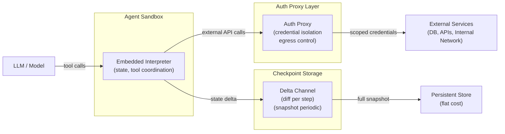

關鍵洞察：三個原語各自解決安全、狀態協調、儲存成本三個獨立的 production 瓶頸，組合後才能讓長時間執行的 agent 可審計、可復原、可控費用。

- 來源：[LangChain — Auth Proxy](https://www.langchain.com/blog/how-auth-proxy-secures-network-access-for-langsmith-agent-sandboxes) ｜ [LangChain — Interpreter](https://www.langchain.com/blog/give-your-agents-an-interpreter) ｜ [LangChain — Delta Channels](https://www.langchain.com/blog/delta-channels-evolving-agent-runtime)
- 對客戶的具體含意：向國泰、玉山、中信等銀行的資安長提案時，Auth Proxy 的 credential isolation + egress control 是可直接對應內控規範的設計語言，建議用此架構圖取代「AI 很安全」的口頭保證。

**(English)** LangChain ships Auth Proxy, embedded Interpreter, and Delta Channels in a single week — converging on a production agent harness standard

[Inference] LangChain released three complementary production primitives around Interrupt 2026: Auth Proxy isolates credentials from the sandbox runtime and constrains agent egress; the embedded Interpreter lets agents write code to coordinate tools and hold working state between calls; Delta Channels reduce checkpoint storage from O(N²) to flat cost by persisting only state diffs per step with periodic full snapshots, shipping by default in Deep Agents v0.6. [Inference] Together, these three primitives constitute LangChain's move from "agent framework" to "deployable agent infrastructure with security boundary, state management, and cost control" — for Taiwan bank compliance teams, this is the difference between a POC that can be contract-signed and one that stays a demo.

Key insight: each primitive addresses a distinct production bottleneck — security, state coordination, and storage cost — and together they make long-running agents auditable, recoverable, and cost-bounded.

- Source: [LangChain — Auth Proxy](https://www.langchain.com/blog/how-auth-proxy-secures-network-access-for-langsmith-agent-sandboxes) | [LangChain — Interpreter](https://www.langchain.com/blog/give-your-agents-an-interpreter) | [LangChain — Delta Channels](https://www.langchain.com/blog/delta-channels-evolving-agent-runtime)
- Client implication: When pitching to Cathay, E.SUN, or CTBC CISOs, Auth Proxy's credential isolation and egress control map directly to internal control requirements — use this architecture diagram instead of verbal assurances that "AI is secure."

---

### 2. Claude Code 靜默修補兩個 sandbox bypass 漏洞 + SGLang / Triton 推論框架重大 RCE 漏洞同週曝光：agent infra 的安全債正在到期

📖 **原文** Anthropic 在 5 個月內悄悄修補了 Claude Code 兩個 sandbox 繞過漏洞，未以公告或任何方式通知用戶，使廣大開發商及企業用戶暴露於攻擊風險中（來源：iThome）。

📖 **原文** 同一週，資安業者 Antiproof 揭露開源 AI 推論框架 SGLang 存在 3 項高風險漏洞（含 2 個 RCE + 1 個路徑走訪），CERT/CC 已發布漏洞通報並建議限制服務介面存取；NVIDIA 亦同步發布公告，修補 Triton Inference Server 8 項漏洞（含 RCE、DoS、資料外洩）。

🧠 **推論** 三個事件同週發生並非巧合：production agent 工具鏈的安全測試覆蓋率普遍不足，靜默修補的慣例會讓企業的漏洞管理流程完全失效——TSMC、鴻海等已在生產環境部署推論伺服器的製造客戶，應立即確認 SGLang 與 Triton 版本，並要求 Anthropic 提供 Claude Code 的 CVE 正式揭露紀錄。

下圖說明這三個攻擊面如何同時存在於同一個 agent 部署棧中：

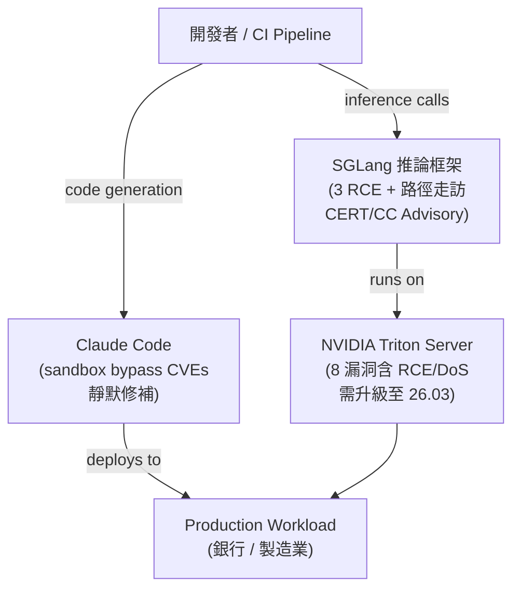

關鍵洞察：同一 agent 部署棧的開發端、推論框架、硬體推論伺服器三層同時存在未修補或靜默修補的高風險漏洞，形成縱深攻擊路徑。

- 來源：[iThome — Claude Code 漏洞](https://www.ithome.com.tw/news/176010) ｜ [iThome — SGLang](https://www.ithome.com.tw/news/176018) ｜ [iThome — NVIDIA Triton](https://www.ithome.com.tw/news/176024)
- 對客戶的具體含意：銀行與製造業客戶若已在內部部署 SGLang 或 Triton，本週應立即確認版本並套用補丁（Triton 升級至 26.03）；同時要求所有 AI 工具供應商簽署漏洞揭露 SLA，Anthropic 的靜默修補行為是談判籌碼。

**(English)** Claude Code silent sandbox bypass patches + SGLang/Triton RCE vulnerabilities surface in the same week: the security debt of agent infra is coming due

[Verbatim] Anthropic silently patched two sandbox bypass vulnerabilities in Claude Code over a five-month period without any public notification, leaving enterprises and developers exposed to attack risk (source: iThome). [Verbatim] In the same week, security firm Antiproof disclosed three high-severity vulnerabilities in the open-source SGLang inference framework — two RCE flaws and one path traversal — prompting a CERT/CC advisory recommending access restrictions; NVIDIA separately issued a security bulletin patching eight vulnerabilities in Triton Inference Server, including RCE, DoS, and data exfiltration vectors, urging users to upgrade to version 26.03. [Inference] Three incidents in a single week signals a systemic gap: production agent toolchain security coverage is broadly insufficient, and silent patching conventions render enterprise vulnerability management processes completely ineffective — manufacturing clients such as TSMC and Foxconn with inference servers already in production should immediately audit SGLang and Triton versions and demand formal CVE disclosure records from Anthropic for Claude Code.

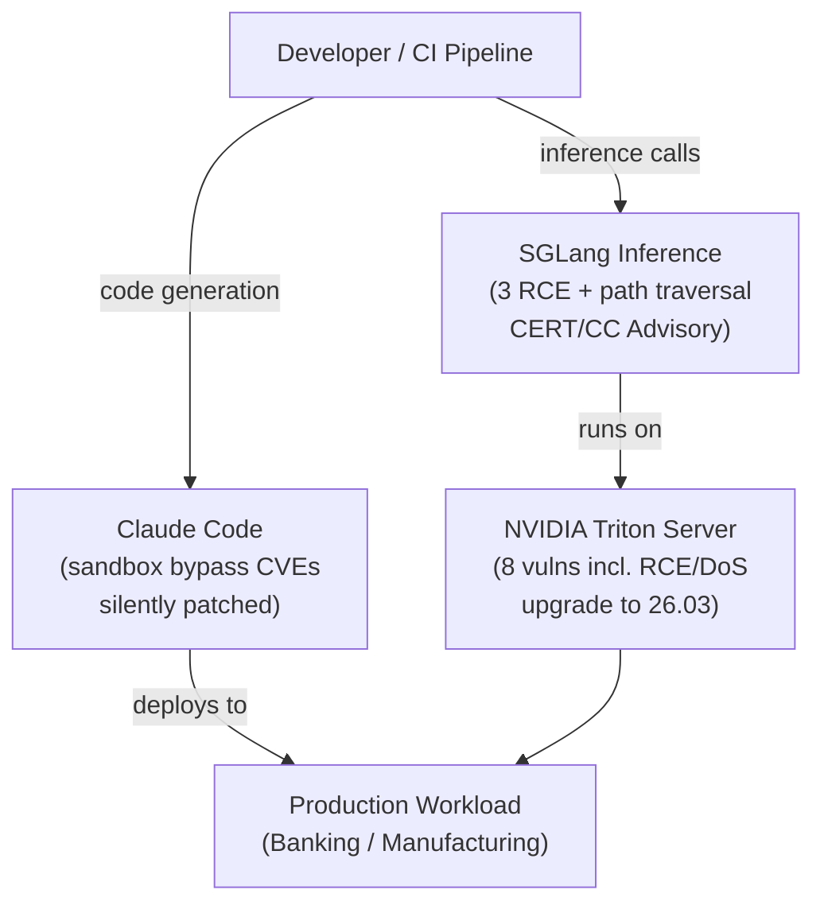

Key insight: all three layers of the same agent deployment stack — dev tooling, inference framework, and hardware inference server — simultaneously carry unpatched or silently patched high-severity vulnerabilities, forming a cascading attack path.

- Source: [iThome — Claude Code](https://www.ithome.com.tw/news/176010) | [iThome — SGLang](https://www.ithome.com.tw/news/176018) | [iThome — NVIDIA Triton](https://www.ithome.com.tw/news/176024)
- Client implication: Banking and manufacturing clients with SGLang or Triton deployed internally should verify versions and apply patches this week (Triton → 26.03); simultaneously, use Anthropic's silent patching behavior as concrete leverage when negotiating vulnerability disclosure SLAs with AI vendors.

---

### 3. Microsoft 開源 RAMPART：AI agent 安全測試進入 CI/CD 流程，但 LLM 文件委派可靠性論文同週潑冷水

📖 **原文** 微軟開源 RAMPART，讓工程團隊將資安紅隊演習中發現的攻擊情境與實際 AI 事件，轉成可在 CI/CD 流程中反覆執行的自動化測試，確保修正過的安全問題不會回歸（來源：iThome）。

📖 **原文** 同一週，Microsoft Research 發表論文《LLMs Corrupt Your Documents When You Delegate》，指出現階段 LLM 在長流程文件委派任務中難以維持內容完整性，且錯誤改寫往往難以察覺（來源：iThome）。

🧠 **推論** 這兩個訊號合在一起的含意是：微軟自己在推動「agent 進 CI」的工具化的同時，其研究院也在量化 agent 在文件類任務上的根本可靠性缺陷——對台灣銀行（法遵文件、KYC 表單、合約審查）或製造業（BOM 轉換、規格書整理）而言，RAMPART 能讓安全回歸測試自動化，但文件委派場景在模型改善前仍需保留人工覆核節點。

- 來源：[iThome — RAMPART](https://www.ithome.com.tw/news/176011) ｜ [iThome — LLM 文件腐蝕](https://www.ithome.com.tw/news/176007) ｜ [Microsoft Research — Delegation Reliability](https://www.microsoft.com/en-us/research/blog/further-notes-on-our-recent-research-on-ai-delegation-and-long-horizon-reliability/)
- 對客戶的具體含意：向銀行客戶提案 AI 自動化文件處理時，主動說明「目前最佳實踐是 AI 草稿 + 人工最終確認」並在 pipeline 中埋入 RAMPART 式的自動化安全回歸測試，比競爭對手只談功能更能建立信任。

**(English)** Microsoft open-sources RAMPART to put AI agent security testing into CI/CD — while its research arm publishes empirical evidence that LLMs corrupt documents in delegated workflows

[Verbatim] Microsoft open-sourced RAMPART, enabling engineering teams to convert red-team-discovered attack scenarios and real AI incidents into automated tests that run inside CI/CD pipelines, preventing previously fixed security issues from regressing (source: iThome). [Verbatim] In the same week, Microsoft Research published "LLMs Corrupt Your Documents When You Delegate," finding that current LLMs cannot reliably preserve content integrity in long-horizon document delegation tasks, and that erroneous rewrites are often difficult to detect (source: iThome). [Inference] The juxtaposition is significant: Microsoft's engineering teams are tooling up for "agent security in CI" while its research division is quantifying fundamental reliability deficits in document-class agent tasks — for Taiwan banks handling compliance documents, KYC forms, and contract review, or manufacturers managing BOM conversions and spec-sheet normalization, RAMPART enables automated security regression testing, but document delegation workflows require human review checkpoints until model reliability improves.

- Source: [iThome — RAMPART](https://www.ithome.com.tw/news/176011) | [iThome — LLM Document Corruption](https://www.ithome.com.tw/news/176007) | [Microsoft Research — Delegation Reliability](https://www.microsoft.com/en-us/research/blog/further-notes-on-our-recent-research-on-ai-delegation-and-long-horizon-reliability/)
- Client implication: When pitching AI document automation to bank clients, proactively position "AI draft + human final sign-off" as current best practice and embed RAMPART-style automated security regression in the pipeline — this credibility move differentiates against competitors who only demo capabilities.

---

## Watch list

繁中為主，每條一行：

- [LangChain — LangSmith Engine](https://www.langchain.com/blog/how-we-built-langsmith-engine-our-agent-for-improving-agents) — Agent 監控 agent 的自動化改善迴路架構，trace 分析模式值得 harness 工程師深讀
- [LangChain — LangSmith LLM Gateway](https://www.langchain.com/blog/introducing-llm-gateway) — Runtime governance：spend limit + PII redaction 直接可對應銀行資料保護要求
- [LangChain — The Anatomy of an Agent Harness](https://www.langchain.com/blog/the-anatomy-of-an-agent-harness) — LangChain 對 filesystem / sandbox / memory 三層架構的正式命名，值得作為 portfolio 參考術語
- [LangChain — Agent Development Lifecycle](https://www.langchain.com/blog/the-agent-development-lifecycle) — Build→Test→Deploy→Monitor 四階段框架，可直接用於銀行客戶的 AI 治理提案結構
- [LangChain — Deep Agents v0.6](https://www.langchain.com/blog/deep-agents-0-6) — 本週所有新 primitive（interpreter、delta channels、streaming v3、ContextHub）的一站式 changelog
- [LangChain — Tuning Deep Agents for Different Models](https://www.langchain.com/blog/tuning-deep-agents-different-models) — Model-specific profile 帶來 10–20 point tau2-bench 提升，harness 工程師的實作細節
- [LangChain — Token Streams to Agent Streams](https://www.langchain.com/blog/token-streams-to-agent-streams) — Typed events + scoped subscriptions 的 streaming 架構升級，production frontend 可靠性相關
- [LangChain — SmithDB](https://www.langchain.com/blog/introducing-smithdb) — Agent observability 專用 DB，12x 效能提升聲稱，值得驗證後列入 stack 選型
- [iThome — Claude Managed Agents MCP Tunnels](https://www.ithome.com.tw/news/176026) — Anthropic 讓 Claude 連企業內網 MCP 伺服器，是 BFSI 客戶「不出資料中心」場景的關鍵前提
- [LangChain — Interrupt 2026 全覽](https://www.langchain.com/blog/interrupt-2026-overview) — LangChain 本週所有 release 的完整索引，快速定位各功能原始文件用
- [Towards Data Science — Control Layer for LLM Production](https://towardsdatascience.com/prompt-engineering-isnt-enough-i-built-a-control-layer-that-works-in-production/) — Structured output 可靠度從 0% → 100% 的具體 control layer 設計，prompt engineering 之上的工程補強
- [Towards Data Science — LLM Eval Layer](https://towardsdatascience.com/llm-evals-are-based-on-vibes-i-built-the-missing-layer-that-decides-what-ships/) — 分離 attribution / specificity / relevance 的輕量 eval 框架；缺量化數據但方法論可參考
- [IBM Research — Open Agent Leaderboard](https://huggingface.co/blog/ibm-research/open-agent-leaderboard) — 超越模型分數，評估 tool selection / memory / recovery 等系統因素；IBM 出品與 Livia 客群直接相關
- [iThome — SAS 4,200 個 AI Agent 治理經驗](https://www.ithome.com.tw/news/176029) — 員工自建 4,200 支 agent 後的企業治理框架，製造業客戶 shadow AI 問題的真實案例
- [iThome — 新加坡政府 AI Agent 沙盒測試](https://www.ithome.com.tw/news/176027) — 政府 sandbox 測試結果含治理風險評估，可作為銀行監管單位類比參考
- [Daytona — Giving Agents Computers](https://www.latent.space/p/daytona) — 74% MoM 成長、850K daily runs 的 bare metal sandbox 指標，agent infra 市場規模佐證
- [Railway — Agent-Native Cloud](https://www.latent.space/p/railway) — 3M users、$200K+ coding agent 花費、自建機房，agent cloud infra 的真實商業規模
- [Confluent MCP + Agent Skills](https://www.ithome.com.tw/news/175999) — IBM 旗下 Confluent 推出全託管 MCP + 個資遮蔽，即時 AI 應用的資料治理 pattern
- [iThome — AI 漏洞研究生態](https://www.ithome.com.tw/news/175980) — Anthropic Project Glasswing 在主要 OS/瀏覽器找到零時差漏洞，AI 輔助漏洞發掘的生態系信號
- [OpenAI + Dell Codex on-prem](https://openai.com/index/dell-codex-enterprise-partnership) — Hybrid/on-prem coding agent 部署，台灣銀行「資料不出境」需求的直接對應方案
- [Microsoft Research — MagenticLite](https://www.microsoft.com/en-us/research/blog/magenticlite-magenticbrain-fara1-5-an-agentic-experience-optimized-for-small-models/) — 小模型 agentic 架構 + 多模型 orchestration；缺乏部署數據但架構設計值得參考

---

## Verification hints

This briefing contains **8**

🧠 **推論** segments and **0**

⚠️ **假設** segments. Before citing in client conversations, verify these specific points (English for language-learning practice):

1. **LangChain Delta Channels O(N²) claim**: The excerpt states O(N²) → flat cost optimization. Verify the technical mechanism at [the Delta Channels post](https://www.langchain.com/blog/delta-channels-evolving-agent-runtime) — specifically confirm whether "flat cost" is a hard guarantee or depends on snapshot frequency configuration, and whether the claim is backed by benchmark data or is theoretical.
2. **Claude Code sandbox bypass CVE timeline**: iThome reports Anthropic patched two vulnerabilities over a five-month period without notification. Verify: (a) whether formal CVE IDs have since been assigned, (b) whether Anthropic has issued any post-publication disclosure, and (c) the specific versions affected — before citing in client security conversations.
3. **SGLang CERT/CC advisory status**: The iThome article states CERT/CC issued an advisory recommending access restrictions pending a patch. Verify at [CERT/CC's official advisories](https://kb.cert.org/vuls/) whether a patch has since been released and whether SGLang has issued a fixed version — the advice to restrict service interfaces may already be superseded.
4. **NVIDIA Triton version 26.03 patch coverage**: iThome reports eight vulnerabilities patched in version 26.03. Verify the [official NVIDIA security bulletin](https://www.nvidia.com/en-us/security/) to confirm which specific CVEs are addressed and whether any require configuration changes beyond a version upgrade.
5. **LangChain model-specific profile 10–20 point tau2-bench gain**: The excerpt from [Tuning Deep Agents](https://www.langchain.com/blog/tuning-deep-agents-different-models) claims a 10–20 point improvement. Verify: (a) which subset of tau2-bench tasks, (b) which baseline configuration, and (c) whether results are reproducible across OpenAI, Anthropic, and Google profiles equally — benchmark improvements can be cherry-picked.
6. **SmithDB 12x performance claim**: LangChain claims SmithDB delivers "up to 12x faster performance." Verify the [SmithDB post](https://www.langchain.com/blog/introducing-smithdb) for the benchmark conditions — "up to" figures typically reflect best-case scenarios and the comparison baseline (vs. what prior storage system?) matters for realistic planning.
7. **Microsoft RAMPART open-source availability**: iThome reports RAMPART has been open-sourced. Verify the actual repository location and license terms before recommending it to clients for production CI/CD integration — confirm it is not a research prototype with unsupported APIs.
8. **Microsoft Research document corruption scope**: The "LLMs Corrupt Your Documents When You Delegate" finding is inferred to apply broadly to document-class agent tasks. Verify the [full paper methodology](https://www.microsoft.com/en-us/research/blog/further-notes-on-our-recent-research-on-ai-delegation-and-long-horizon-reliability/) to confirm which task types, document lengths, and model2026-05-21 23:55:38,627 INFO pillar 5 (學派 / 社群 / 思想動態): 14 high-signal items (min_signal=0.60)

---

## 🌐 Pillar 5 — 學派 / 社群 / 思想動態
_14 items · $0.0640_

## Pulse — Top 3

### 1. Simon Willison：2025 年 11 月是 LLM 能力的真實「inflection point」，尤其對 coding 領域

🧠 **推論** Simon Willison 在 PyCon US 2026 的 lightning talk 中明確將 2025 年 11 月定為 LLM 近六個月最關鍵的轉折點，並特別點名 coding 能力的飛躍。

🧠 **推論** 這個時間點與多家前沿 lab（Anthropic、OpenAI、Google）密集發布具備 extended thinking 與 agentic coding 能力的模型吻合。對 Livia 而言：台灣銀行客戶（如 Cathay、E.SUN）若尚未在 2025 Q4 後重新評估 LLM coding automation 的可行性，其 AI roadmap 起點已落後業界主流認知約一個季度。

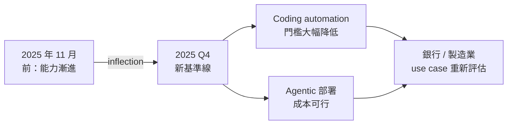
*核心洞察：2025 年 11 月不是行銷詞彙，是業界可驗證的能力基準重設點——客戶的 AI 可行性評估若在此之前完成，需要重做。*

- 來源：[Simon Willison — The last six months in LLMs in five minutes](https://simonwillison.net/2026/May/19/5-minute-llms/#atom-everything)
- 對客戶的具體含意：向 Cathay 或 TSMC 提案時，直接引用「2025 年 11 月 inflection point」作為為何舊 POC 結論需要重跑的客觀錨點。

**(English)** Simon Willison at PyCon US 2026: November 2025 was a verifiable LLM inflection point, especially for coding

[Inference] Simon Willison's PyCon US 2026 lightning talk explicitly names November 2025 as the most critical turning point in the past six months of LLM development, with coding capability called out specifically. [Inference] This timestamp aligns with the dense release cluster from Anthropic, OpenAI, and Google of models with extended thinking and agentic coding features in Q4 2025. For Livia: Taiwan bank clients (Cathay, E.SUN) whose AI roadmaps were scoped before this inflection point are working from a stale feasibility baseline — the cost and capability curve has moved under them.

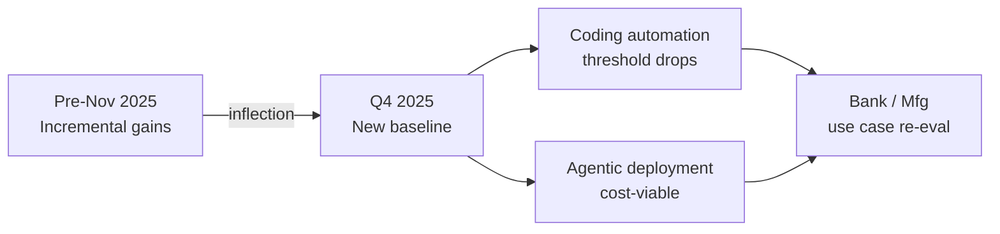
*Key insight: November 2025 is not marketing copy — it is a verifiable capability reset that makes pre-Q4 2025 feasibility studies obsolete.*

- Source: [Simon Willison — The last six months in LLMs in five minutes](https://simonwillison.net/2026/May/19/5-minute-llms/#atom-everything)
- Client implication: Use "November 2025 inflection point" as an objective anchor when arguing to Cathay or TSMC why earlier POC conclusions need to be re-run.

---

### 2. Daytona：agent sandbox 基礎設施達到 74% MoM 成長、每日 85 萬次執行，bare metal 成為新標準

📖 **原文** Daytona CEO Ivan Burazin 在 Latent Space podcast 中披露：74% MoM 成長、850K daily runs、bare metal sandboxes、RL evals。

🧠 **推論** 這組數字意味著 agent infrastructure 正在脫離「實驗性」階段——每日 85 萬次執行已是 production scale，而 bare metal（非虛擬化）sandbox 代表隔離性與速度的工程取捨正在被業界解決。

🧠 **推論** 對 Livia 的 harness pipeline 建構：sandbox + RL evals 的組合是 Daytona 能快速 iterate 的核心，這個 pattern 可直接移植為客戶 agent deployment 的評估框架。

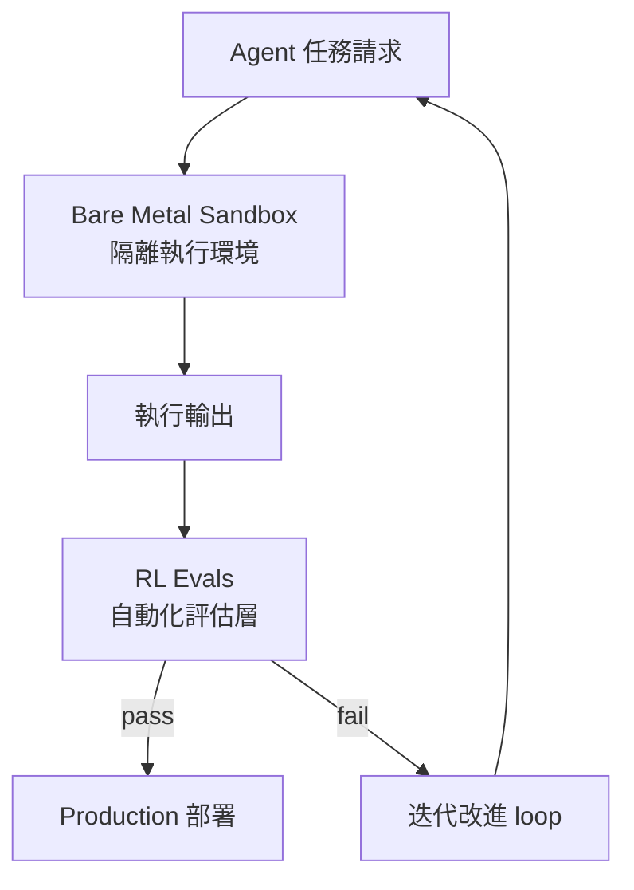
*核心洞察：RL evals 閉環讓 sandbox 不只是安全隔離，更成為持續自我改進的機制——這是 850K daily runs 能維持成長的結構性原因。*

- 來源：[Latent Space — Giving Agents Computers: Ivan Burazin, Daytona](https://www.latent.space/p/daytona)
- 對客戶的具體含意：向台灣銀行展示 agent automation 時，引用 Daytona 的 bare metal + RL evals 架構作為「生產就緒」的具體標準，避免客戶將 agent demo 與 production deployment 混淆。

**(English)** Daytona: agent sandbox infrastructure hits 74% MoM growth and 850K daily runs — bare metal becomes the production benchmark

[Verbatim] Daytona CEO Ivan Burazin disclosed on the Latent Space podcast: 74% MoM growth, 850K daily runs, bare metal sandboxes, and RL evals. [Inference] These numbers signal that agent infrastructure has crossed out of the experimental phase — 850K daily executions is production scale, and bare metal (non-virtualized) sandboxes indicate the industry is solving the isolation-vs-speed engineering tradeoff. [Inference] For Livia's harness pipeline: the sandbox + RL evals combination is the structural reason Daytona can iterate quickly, and this pattern is directly portable as an evaluation framework for client agent deployments.

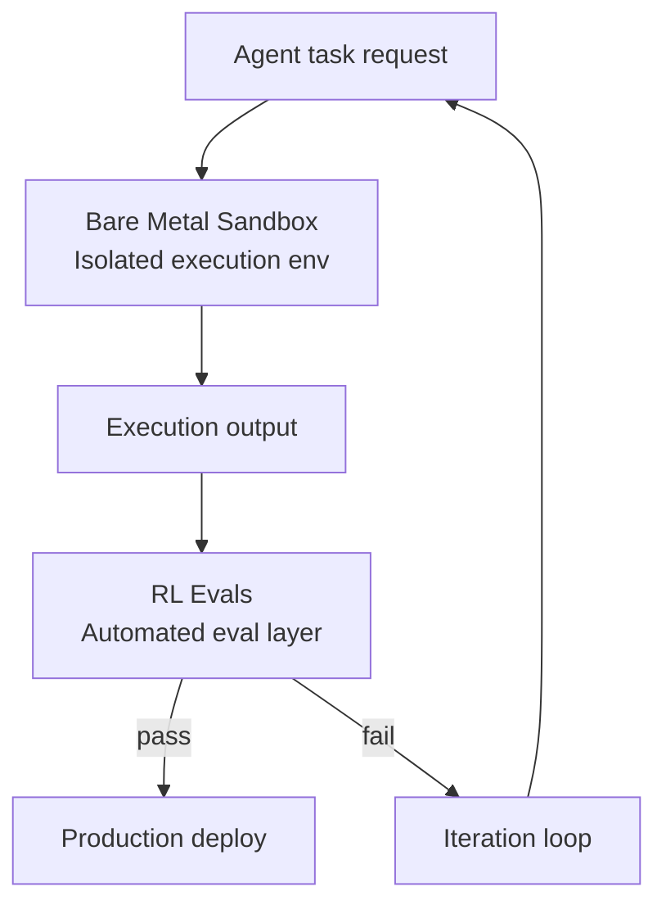
*Key insight: The RL evals feedback loop turns the sandbox from a safety boundary into a continuous self-improvement mechanism — the structural reason 850K daily runs keeps growing.*

- Source: [Latent Space — Giving Agents Computers: Ivan Burazin, Daytona](https://www.latent.space/p/daytona)
- Client implication: When demoing agent automation to Taiwan banks, use Daytona's bare metal + RL evals architecture as a concrete checklist for "production-ready" to stop clients from conflating agent demos with actual production deployment.

---

### 3. Dwarkesh Patel：「智能」與「權力」是不同維度——混淆兩者會讓 AI 安全討論失焦

📖 **原文** Dwarkesh Patel 文章核心論點：若將「智能」定義為「在廣泛領域中達成目標的能力」，則史達林是有史以來最智能的人——這顯然是荒謬的，因此「能力」與「意圖／權力」必須被分開討論。

🧠 **推論** 這個框架對 Livia 的 AI governance 對話直接有用：台灣監管機構（FSC）與銀行 CRO 常將「AI 能力越強 = 風險越高」當作預設，但這個等式跳過了 intent alignment 與 access control 這兩個真正的風險向量。

🧠 **推論** 在 IBM 框架下，這支持「trustworthy AI 的核心是 governance layer，而非能力限制」的論述。

- 來源：[Dwarkesh Patel — The mistake of conflating intelligence and power](https://www.dwarkesh.com/p/the-mistake-of-conflating-intelligence)
- 對客戶的具體含意：面對 FSC 或銀行 CRO 提出「AI 太強會失控」的疑慮時，用此框架將對話從「能力上限」轉移到「access control 與 intent alignment」的具體管控措施。

**(English)** Dwarkesh Patel: "intelligence" and "power" are separate dimensions — conflating them derails AI safety conversations

[Verbatim] The core argument in Dwarkesh Patel's essay: if intelligence is defined as "the ability to achieve goals across a wide variety of domains," then Stalin was the most intelligent person who ever lived — which is absurd, therefore capability and intent/power must be discussed separately. [Inference] This framework is directly useful for Livia's AI governance conversations: Taiwan regulators (FSC) and bank CROs frequently default to "stronger AI = higher risk," but this equation skips intent alignment and access control as the actual risk vectors. [Inference] Within the IBM framework, this supports the argument that trustworthy AI is fundamentally a governance layer problem, not a capability-cap problem.

- Source: [Dwarkesh Patel — The mistake of conflating intelligence and power](https://www.dwarkesh.com/p/the-mistake-of-conflating-intelligence)
- Client implication: When FSC or bank CROs raise "AI is too powerful to control," use this framework to redirect the conversation from capability limits toward concrete access control and intent alignment governance measures.

---

## Watch list

繁中為主，每條一行：
- [Latent Space — Google I/O 2026: Gemini 3.5 Flash, Spark, Omni](https://www.latent.space/p/ainews-google-io-2026-gemini-35-flash) — Gemini 3.5 Flash + background agents（Spark）已發布，值得確認 Google Cloud 在台灣銀行的滲透節奏是否加速
- [Latent Space — OpenAI GPT-next solves Erdős unit distance problem for <$1000](https://www.latent.space/p/ainews-openai-gpt-next-disproves) — 數學推理 frontier 能力新數據點，可用於向台灣製造業（MediaTek、TSMC）說明 AI 在 R&D 輔助的真實邊界
- [LangChain — Introducing LangChain Labs](https://www.langchain.com/blog/introducing-langchain-labs) — Harrison Chase 切入 continual learning for agents；若 self-improving agent pattern 成熟，對 harness pipeline 架構選擇有影響
- [Practical AI — Hermes Agent: Agents that grow with you](https://share.transistor.fm/s/451da102) — Nous Research 的 open-source self-improving agent；models vs. harnesses 的角色分離討論值得追蹤
- [Dwarkesh — RLVR might be disproportionately bad at science](https://www.dwarkesh.com/p/rlvr-might-be-disproportionately) — RLVR 在長周期科學驗證場景的限制；對 AI 在半導體 R&D（TSMC、MediaTek）應用的邊界設定有參考價值
- [INSIDE 硬塞 — Anthropic Q2 首度轉盈但可能是快閃獲利](https://www.inside.com.tw/article/41344-anthropic-says-its-about-to-have-its-first-profitable-quarter) — Anthropic 財務里程碑影響其與 OpenAI 的競爭格局，間接影響 IBM 在台灣的 frontier model 合作策略
- [Platformer — Google's Manyika: tasks automate, jobs don't](https://www.platformer.news/james-manyika-google-ai-jobs-io-2026/) — AI 就業影響的主流框架更新，可用於回應台灣銀行人資主管的勞動力疑慮
- [AI Snake Oil — Do AI Risks Require Extraordinary Government Intervention?](https://www.normaltech.ai/p/do-ai-risks-require-extraordinary) — Narayanan/Kapoor 對 AI governance 介入範圍的立場，可補充 FSC 監管對話的反方觀點
- [Dwarkesh — Eric Jang: Building AlphaGo from scratch](https://www.dwarkesh.com/p/eric-jang) — search + self-play primitives 的教學性回顧，適合向客戶解釋 RL 基礎時使用

---

## Verification hints

This briefing contains **4

🧠 **推論**** segments and **0

⚠️ **假設**** segments. Before citing in client conversations, verify these specific points (English for language-learning practice):

1. **Simon Willison's "November 2025 inflection point" — verify scope**: The excerpt confirms the framing exists but does not list which specific model releases he cites as evidence. Visit [the annotated slides](https://simonwillison.net/2026/May/19/5-minute-llms/#atom-everything) and confirm which models/dates he names — the argument depends on there being a verifiable cluster of releases, not just a rhetorical label.

2. **Daytona's 850K daily runs and 74% MoM growth — verify recency and definition**: These numbers come from a podcast disclosure (Latent Space), not an audited report. Before quoting to a bank client, check [the episode](https://www.latent.space/p/daytona) for the measurement period and whether "runs" means full agent executions or individual sandbox calls — the distinction matters for comparing to internal enterprise workloads.

3. **Dwarkesh's "Stalin as most intelligent" argument — verify the full logical structure**: The excerpt is a single sentence. The full essay at [dwarkesh.com](https://www.dwarkesh.com/p/the-mistake-of-conflating-intelligence) may define "intelligence" and "power" more precisely, or may acknowledge counterarguments. Read the full piece before deploying this framework in an FSC-facing governance conversation, where a half-understood argument can backfire.

4. **Anthropic Q2 profitability — verify "flash profit" framing**: The INSIDE article characterizes the profit as potentially "快閃獲利" (transient). The [source](https://www.inside.com.tw/article/41344-anthropic-says-its-about-to-have-its-first-profitable-quarter) attributes Q2 profitability to compute cost optimization, but does not specify whether this is a structural margin improvement or a one-time accounting event. Check Anthropic's primary statements before referencing in IBM competitive positioning discussions.

  Pillar 1 (產業 AI 真實落地 (BFSI + 製造業)       ) items= 22  cents=8.8347
  TOTAL: 0.4216 USD

---

## 📋 引用清單（spot-check 用）

_本期所有引用 URL 集中於各 Pillar 的 Source / 來源 行；驗證提示集中於各 Pillar 末段 Verification hints。_

---

# Foundation — Track F: 部署運行紀律

_Week 2026-W21 · 25 items synthesized · $0.7166 USD_

# 生產級 LLM 系統的控制層紀律：從沙箱逃逸到 Delta Checkpoint 的部署運行深讀

## TL;DR (3 句繁中)
1. 本週多起事件揭示同一個核心論點：**LLM 系統在 production 中的主要失敗模式不是「模型不夠聰明」，而是工程控制層——沙箱隔離、狀態管理、輸出結構化、安全迴歸測試——的缺失或不成熟**。
2. 關鍵 trade-off 在於「agent 自主性」與「可觀測 / 可控性」之間的張力：給 agent 更多工具、更長執行時間、更深網路存取，就需要成比例增加的隔離層、checkpoint 機制與 CI 化安全測試。
3. 對 Livia 的工作而言：**台灣金融與製造業客戶即將面對的不是「要不要用 agent」的問題，而是「agent 部署後如何不爆炸」的治理工程問題**——本篇深讀提供可直接搬上提案簡報的 5 層控制架構。

## 背景與問題框架

[推論] 2025 年的 LLM 部署對話圍繞在「能不能用」——模型夠不夠準確、幻覺率多高、token 成本多少。到了 2026 年中，前沿組織的焦點已經明確移向「用了之後怎麼不出事」。本週同時出現的多條訊號——Claude Code 沙箱繞過漏洞被靜默修補([iThome 報導](https://www.ithome.com.tw/news/176010))、微軟開源 RAMPART 把 agent 安全測試 CI 化([iThome 報導](https://www.ithome.com.tw/news/176011))、LangChain 一次推出 Auth Proxy / Delta Channel / Interpreter / Engine 四個 production 元件([LangChain Interrupt 總覽](https://www.langchain.com/blog/interrupt-2026-overview))、微軟研究院實證 LLM 在長流程文件任務中會靜默改寫內容([iThome 報導](https://www.ithome.com.tw/news/176007))——共同指向一個六個月前尚未被系統性討論的問題：**production LLM 系統需要一套獨立於模型之外的控制層紀律（Control Layer Discipline）**。

[推論] 這個問題之所以「現在」值得深讀，有三個結構性原因。第一，agent 的執行時間從秒級拉長到分鐘甚至小時級（Daytona 日均 85 萬次執行、Railway 上 $200K+ agent 雲端消費），長執行時間放大了每一個控制缺口的風險面積。第二，agent 開始需要存取企業內網（Anthropic MCP Tunnels [研究預覽](https://www.ithome.com.tw/news/176026)、Confluent MCP 伺服器 [上線](https://www.ithome.com.tw/news/175999)），攻擊面從「API 呼叫」擴大到「VPN 等級的網路穿透」。第三，SAS 內部已有 4,200 支員工自建 agent([iThome 報導](https://www.ithome.com.tw/news/176027))，當 agent 數量從 pilot 進入 swarm，治理壓力呈超線性成長。

[推論] 六個月前，「部署運行紀律」大多被簡化為「加個 retry + 設個 rate limit」。今天的最佳實踐已經演化成五個層次的工程堆疊：輸出結構化控制、sandbox 隔離、狀態 checkpoint、安全迴歸 CI、可觀測性迴路。本篇深讀逐層展開。

## 核心概念解析（含 Mermaid 圖）

### 一、控制層五層架構

[推論] 綜合本週所有訊號，production LLM 系統的控制層可以歸納為以下五層，從最靠近模型輸出的一端到最靠近組織治理的一端：

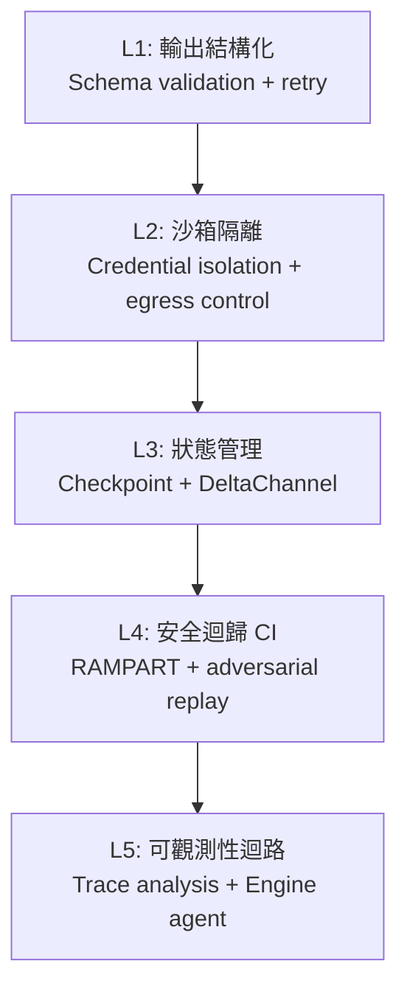

**關鍵洞察**：大多數團隊只做了 L1（prompt engineering + JSON mode），然後直接跳到 L5（加個 dashboard 看 log）。L2–L4 的缺失是本週多起 production 事故的根因。

### 二、L1：輸出結構化控制——Prompt Engineering 不夠

[原文] Towards Data Science 的「Prompt Engineering Isn't Enough」一文([連結](https://towardsdatascience.com/prompt-engineering-isnt-enough-i-built-a-control-layer-that-works-in-production/))描述了一個真實場景：structured output 在 production 中的可靠度從 0% 提升到 100%，方法不是改 prompt，而是在模型上方建一個 control layer——包含 schema validation、自動修復（retry with error context）、fallback routing。

[推論] 這個 pattern 在 2025 年已被 Instructor、Guardrails AI 等工具抽象化，但真正的生產教訓是：**structured output 的可靠性不是模型的屬性，而是系統的屬性**。即使模型聲稱支援 JSON mode，在高併發、長 context、多輪對話下，格式崩壞的機率與 context 長度正相關。OpenAI 的 Structured Output 和 Anthropic 的 Tool Use 都在 API 層提供了 schema enforcement，但一旦 agent 開始跨多個模型（如 LangChain 的 model-specific profiles [推出](https://www.langchain.com/blog/tuning-deep-agents-different-models)顯示的 10-20 分提升），你需要一個模型無關的 validation layer。

### 三、L2：沙箱隔離——Claude Code 漏洞的警示

[原文] Anthropic 在過去 5 個月內靜默修補了 Claude Code 的兩個 sandbox bypass 漏洞，研究人員批評其未公開揭露，使開發者暴露於風險中([iThome](https://www.ithome.com.tw/news/176010))。

[原文] LangChain 推出 Auth Proxy 作為 LangSmith agent sandbox 的安全層([LangChain blog](https://www.langchain.com/blog/how-auth-proxy-secures-network-access-for-langsmith-agent-sandboxes))，核心設計原則是：**credentials 永遠不進入 sandbox runtime；egress 由基礎設施層控制，而非由 agent 或 prompt 控制**。

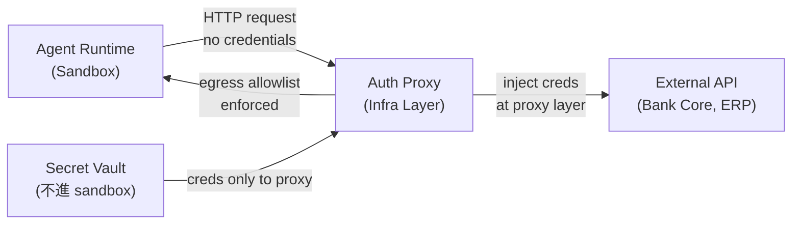

**關鍵洞察**：sandbox bypass 之所以危險，是因為一旦 agent 拿到 credentials 或突破 egress 限制，它就有了「真實世界的手」。Auth Proxy 模式的核心哲學是把 credential 注入推遲到 agent 控制範圍之外。這是銀行客戶最該注意的 pattern。

[原文] Anthropic 的 MCP Tunnels（研究預覽）允許 Claude Managed Agents 連接企業私有網路的 MCP 伺服器，並在客戶自有環境執行工具([iThome](https://www.ithome.com.tw/news/176026))。這看似是 convenience feature，但實質上是把 agent 的 blast radius 從「雲端 API 呼叫」擴大到「企業內網任意 MCP 端點」。

[推論] MCP Tunnels + Auth Proxy 構成一個對偶關係：前者擴大 agent 的觸及範圍，後者限縮 agent 的授權範圍。**沒有後者的前者就是定時炸彈**。

### 四、L3：狀態管理——DeltaChannel 與 O(N²) 問題

[原文] LangGraph 1.2 的 DeltaChannel([LangChain blog](https://www.langchain.com/blog/delta-channels-evolving-agent-runtime))解決了一個被低估的 production 問題：長時間運行的 agent 在每一步 checkpoint 完整狀態，儲存成本隨 session 長度呈 O(N²) 增長。DeltaChannel 只 checkpoint 差異（diff），週期性寫入完整 snapshot，將成本攤平為 O(N)。

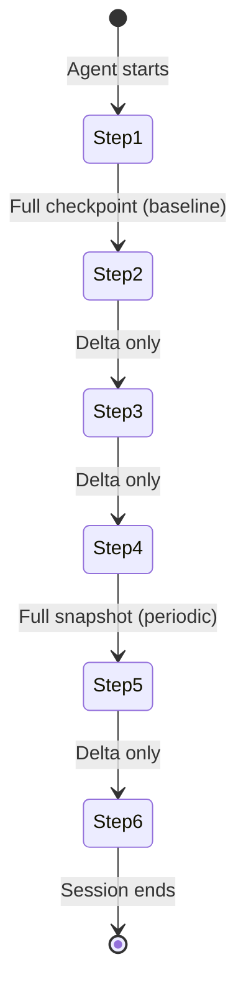

**關鍵洞察**：這不只是成本問題。O(N²) 的 checkpoint 在長 session（例如 30+ 步的 coding agent 或多輪文件處理任務）中會導致寫入延遲，進而影響 agent 的 recovery 能力。DeltaChannel 的設計與資料庫領域的 WAL（Write-Ahead Log）+ periodic compaction 模式同構。

[原文] LangChain 同時推出 Interpreter 機制([LangChain blog](https://www.langchain.com/blog/give-your-agents-an-interpreter))——在 agent 內嵌一個小型 runtime（如 Python interpreter），讓 agent 在 tool calls 之間用程式碼管理 working state。這解決了「全部靠 context window 管理狀態」的 token 浪費問題，也降低了 context 過長導致的輸出品質退化。

### 五、L4：安全迴歸 CI——RAMPART 的範式

[原文] 微軟開源 RAMPART([iThome](https://www.ithome.com.tw/news/176011))，讓工程團隊將紅隊演練中發現的攻擊情境轉化為可反覆執行的自動化測試，並整合進 CI/CD pipeline。

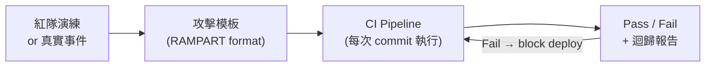

**關鍵洞察**：agent 安全測試的核心困難不是「做一次紅隊」而是「確保修過的問題不再出現」。RAMPART 把安全測試從 event-driven（出事才測）變成 continuous（每次 commit 都測）。這與傳統 AppSec 的 SAST/DAST 整合 CI 的演化路徑完全平行。

[原文] 結合 Anthropic 靜默修補 Claude Code 漏洞的案例——修了但沒告訴使用者，也沒有提供 regression test——RAMPART 的價值更加明確：**如果你依賴的 agent 平台不提供安全 changelog，你至少要自己跑 regression**。

### 六、L5：可觀測性迴路——LangSmith Engine 與 Eval 層

[原文] LangSmith Engine([LangChain blog](https://www.langchain.com/blog/how-we-built-langsmith-engine-our-agent-for-improving-agents))是一個「用 agent 監控 agent」的系統：分析大量 trace、識別 recurring patterns、產生改進建議。這是 LLMOps 可觀測性的最新演化——從被動 log 收集到主動 pattern 識別。

[原文] IBM Research 與 Hugging Face 合作推出 Open Agent Leaderboard([HF blog](https://huggingface.co/blog/ibm-research/open-agent-leaderboard))，強調 agent 評估不能只看模型分數，必須考慮完整系統（工具、規劃、記憶、錯誤恢復）。

[原文] TDS 的 eval 文章([連結](https://towardsdatascience.com/llm-evals-are-based-on-vibes-i-built-the-missing-layer-that-decides-what-ships/))提出把 eval 拆成 attribution、specificity、relevance 三個獨立維度，用 Python 實作而非依賴 LLM-as-judge，以確保可重現性。

[推論] L5 的最大危險是「eval 劇場」——看起來有數字，但數字不接地。Open Agent Leaderboard 的設計至少承認了這個問題：同一個模型在不同系統配置下得分可以差 30 分以上。這意味著 **eval 的單位不應該是「模型」，而應該是「模型 × 系統配置 × 任務領域」的組合**。

### 七、LLM 長流程文件失敗模式

[原文] 微軟研究院論文「LLMs Corrupt Your Documents When You Delegate」指出，LLM 在長流程委派式文件任務（格式轉換、資料拆分等）中會靜默改寫內容，且改寫難以被人類察覺([iThome](https://www.ithome.com.tw/news/176007))。

[推論] 這個發現直接衝擊銀行業最想做的場景之一：用 LLM 自動處理合約、法規文件、報表轉換。「靜默改寫」比「明顯錯誤」更危險，因為後者會觸發 fallback，前者直接進入下游系統。控制層的 L1（輸出 validation）必須包含 content integrity check——不只驗格式，還要驗內容語意是否被非預期改變。

## 與既有框架的對位

[推論] 本週的五層控制架構與 NIST AI RMF 1.0 的 GOVERN-MAP-MEASURE-MANAGE 四個核心功能高度對應。L1-L3 落在 MANAGE（technical controls），L4 落在 MEASURE（continuous testing），L5 落在 MAP + GOVERN（impact awareness + organizational process）。但 NIST AI RMF 的 granularity 不夠——它沒有區分「agent 的 credential isolation」和「model 的 output validation」，而本週的訊號清楚顯示這兩者需要完全不同的工程堆疊。

[推論] 新加坡政府的 AI agent sandbox 測試結果([iThome](https://www.ithome.com.tw/news/175999))是目前最接近「政府級 agent 部署治理框架」的公開案例，與金管會即將面對的問題直接相關。新加坡的做法是：先在受控沙箱中測試，明確列出治理風險，再決定是否放行。這與 Anthropic RSP（Responsible Scaling Policy）的「先量風險再擴權限」邏輯一致。

[推論] Chip Huyen 在《Designing Machine Learning Systems》中主張 production ML 的核心不是模型而是「data + monitoring pipeline」。本週的控制層架構是這個論點在 agent 時代的自然延伸：**production agent 的核心不是模型，而是 sandbox + checkpoint + security CI + observability pipeline**。Karpathy 所提的「Software 2.0」觀點需要修正——Software 2.0 的部署紀律不是比 Software 1.0 更鬆，而是需要額外一整套 1.0 沒有的控制機制（因為行為不確定性是模型的固有屬性）。

## Trade-offs 與爭議

**1. Sandbox 嚴格度 vs. Agent 功能**
- 正面：嚴格 sandbox（無 credential、egress allowlist）大幅限縮 blast radius。
- 反面：許多有用的 agent 場景（如連銀行核心系統查餘額）需要穿透 sandbox。MCP Tunnels 的出現就是因為 sandbox 太緊。
- 結論：這不是二選一，而是分層——sandbox 處理「agent 的計算」，Auth Proxy 處理「agent 的認證」，兩者分離。

**2. DeltaChannel (diff checkpoint) vs. Full Checkpoint**
- 正面：O(N) 成本、低延遲寫入。
- 反面：Recovery 時需要 replay diff chain 到最近的 full snapshot，增加恢復時間。如果 diff chain 損壞，可能丟失多步狀態。
- 結論：對大多數 production agent（session < 100 步）利大於弊；對超長 session 需要更頻繁的 full snapshot。

**3. RAMPART CI 化安全測試 vs. 人工紅隊**
- 正面：自動化、可重複、每次 commit 都跑。
- 反面：自動化測試只能覆蓋「已知攻擊模式」，無法發現新類型漏洞。RAMPART 是 regression safety net，不是 discovery tool。
- 結論：兩者互補，不可替代。但多數團隊連 regression 都沒做，所以 RAMPART 的邊際價值極高。

**4. Model-specific profiles vs. Model-agnostic design**
- 正面：LangChain 的 model-specific profiles 帶來 10-20 分 benchmark 提升。
- 反面：增加維護成本，每次模型更新都要驗證 profile 是否仍然有效；也增加了 vendor lock-in 的軟成本。
- 結論：在 production 中，10-20 分的差距就是 user-facing 品質的分水嶺，值得付出維護成本。

**5. Agent-monitors-agent (LangSmith Engine) 的遞迴風險**
- 正面：自動化 trace 分析，人力不可擴展的問題得到緩解。
- 反面：監控 agent 本身也可能出錯、產生幻覺、或被 adversarial trace 欺騙。這是一個遞迴信任問題。
- 結論：Engine 的 output 應被視為「建議」而非「決定」——需要 human-in-the-loop 的 escalation path。

## 對 Livia IBM 客戶的具體含意

**國泰 / 玉山等銀行客戶：**
[推論] 銀行最迫切的場景——合約文件處理、客服 agent、內部知識查詢——全部落在本週揭示的風險區域。微軟研究院的「靜默改寫」發現意味著：**任何用 LLM 處理法律文件或報表的 pilot，都必須在 pipeline 中加入 content integrity check（比對原文與輸出的語意差異），否則無法通過金管會的 model risk management 審查**。建議在提案中加入「三層 validation gate」：格式 → 內容完整性 → 業務規則。

**TSMC / 鴻海等製造業客戶：**
[推論] 製造業 agent 的特殊風險在於：agent 一旦連到 MES/ERP 系統（類似 MCP Tunnels 的場景），錯誤操作的代價是實體世界的——產線停機、出貨延遲、良率數據誤判。Auth Proxy 模式的 credential isolation 不只是 IT 安全需求，更是 OT 安全需求。建議在架構提案中明確區分 「read-only agent」（查詢設備狀態）vs.「write agent」（調整參數），後者需要額外的 human-approval gate。

**共通提案 angle：**
- **「五層控制架構」可以直接作為提案的技術框架頁**——用 Mermaid 圖呈現，告訴客戶「你今天在第幾層，我們建議先補到第幾層」。
- **新加坡政府的 agent sandbox 結果是絕佳的 peer benchmark**——「新加坡政府已經做完沙箱測試並公布結果，台灣的金管會 / 數發部也會問你：你的 agent 經過哪些治理驗證？」
- **SAS 的 4,200 agent 案例是 scale warning**——「SAS 5000 人公司就產出 4,200 支 agent。你們的員工開始用 Copilot 建 agent 之後，三個月內就會面臨同樣的治理問題——誰核准的？誰監控的？出事誰負責？」
- **RAMPART 作為 IBM 可提供的差異化服務**——「我們可以幫你建 agent security regression pipeline，每次 agent 邏輯變更都自動驗證已知攻擊場景不會復發」。

## 對 Livia harness engineer portfolio 的含意

[推論] 本週深讀直接對應 portfolio 中的兩個核心 design note：

1. **Design Note: "Control Layer Architecture for Production Agent Systems"** — 可以從這篇深讀抽出五層架構圖，加上每一層的技術選型（L1: Instructor/Pydantic, L2: Auth Proxy pattern, L3: DeltaChannel/WAL, L4: RAMPART, L5: trace-based observability），寫成一個 2 頁的架構決策文件。面試時被問到「你怎麼把 agent 從 demo 推到 production」，這個架構就是答案骨架。

2. **Design Note: "Credential Isolation in Agent-to-Enterprise Integration"** — Auth Proxy + MCP Tunnels 的對偶關係可以抽成一個 pattern language：「agent 的 reach 擴大時，credential 的 scope 必須同步收縮」。這是 zero-trust in agent systems 的具體實現，適合用在「你對 agent 安全有什麼見解」的面試問答。

3. **面試問答範例**：「Q: Production LLM 系統最常見的失敗模式是什麼？A: 不是模型幻覺——那是 demo 階段的問題。Production 階段最致命的是靜默失敗：structured output 崩壞但下游沒報錯、sandbox 被繞過但沒有 alert、長 session 的 checkpoint 寫入延遲導致 crash 後狀態丟失。解決方法不是換更好的模型，而是建 control layer——我在我的 design note 裡整理了五層架構。」

---

# Production LLM Control Layer Discipline: From Sandbox Escapes to Delta Checkpoints

## TL;DR (3 sentences)
1. This week's signals converge on a single thesis: **the dominant failure mode of production LLM systems is not "the model isn't smart enough" but the immaturity of engineering control layers—sandbox isolation, state management, output structuring, and security regression testing**.
2. The key trade-off is between agent autonomy and observability/controllability: more tools, longer execution, deeper network access all demand proportionally stronger isolation, checkpointing, and CI-integrated security testing.
3. For Livia's work: **Taiwan's banks and manufacturers are about to face not "should we use agents?" but "how do we keep deployed agents from causing incidents?"—this deep-read provides a 5-layer control architecture ready for client proposals**.

## Background & Problem Framing

[推論] In 2025, LLM deployment conversations centered on feasibility—accuracy, hallucination rates, token cost. By mid-2026, the frontier has decisively shifted to "what goes wrong after deployment." This week produced a constellation of signals that together reveal a structural gap: production LLM systems need a **control layer discipline** that is independent of the model itself.

Consider the simultaneous events: Anthropic silently patched two sandbox bypass vulnerabilities in Claude Code over five months without notifying users ([iThome](https://www.ithome.com.tw/news/176010)). Microsoft open-sourced RAMPART to CI-ify adversarial agent testing ([iThome](https://www.ithome.com.tw/news/176011)). LangChain shipped Auth Proxy, DeltaChannel, Interpreters, and Engine in a single product cycle ([LangChain](https://www.langchain.com/blog/interrupt-2026-overview)). Microsoft Research empirically demonstrated that LLMs silently corrupt documents in long-horizon delegation tasks ([iThome](https://www.ithome.com.tw/news/176007)). A practitioner reported taking structured output reliability from 0% to 100% by building a control layer above the model ([TDS](https://towardsdatascience.com/prompt-engineering-isnt-enough-i-built-a-control-layer-that-works-in-production/)).

[推論] Three structural forces make this topic urgent *now*. First, agent execution times have stretched from seconds to minutes and hours—Daytona reports 850K daily runs ([Latent Space](https://www.latent.space/p/daytona)), Railway sees $200K+ agent cloud spend ([Latent Space](https://www.latent.space/p/railway))—and longer execution amplifies every control gap's risk surface. Second, agents now need access to enterprise intranets (Anthropic MCP Tunnels, Confluent MCP servers), expanding the attack surface from "API calls" to "VPN-grade network traversal." Third, agent populations are exploding—SAS internally has 4,200 employee-built agents ([iThome](https://www.ithome.com.tw/news/176027))—and governance pressure scales super-linearly.

Six months ago, "deployment discipline" meant "add a retry, set a rate limit." Today's best practice has evolved into a five-layer engineering stack: output structuring, sandbox isolation, state checkpointing, security regression CI, and observability loops.

## Core Concepts (with Mermaid diagrams)

### I. The Five-Layer Control Architecture

[推論] Synthesizing all this week's signals, the production LLM control layer can be organized into five layers, from closest-to-model-output to closest-to-organizational-governance:

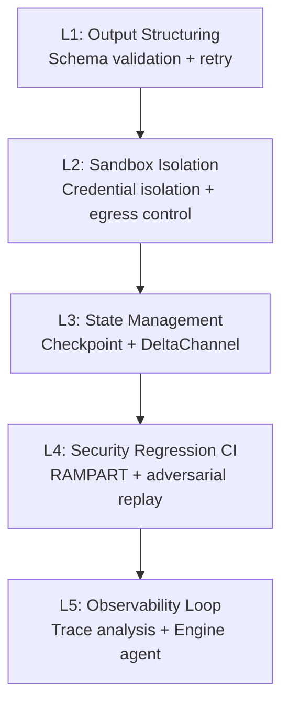

**Key insight**: Most teams implement L1 (prompt engineering + JSON mode) and jump straight to L5 (add a dashboard). The absence of L2–L4 is the root cause of this week's multiple production incidents.

### II. L1: Output Structuring — Prompt Engineering Isn't Enough

[原文] The TDS article "Prompt Engineering Isn't Enough" ([link](https://toward

