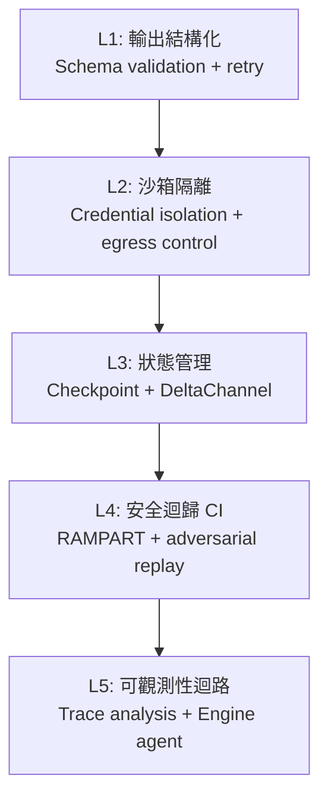
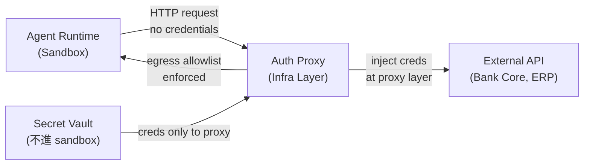
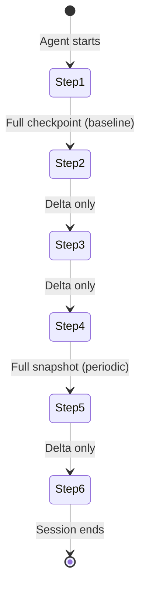
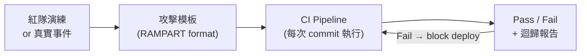
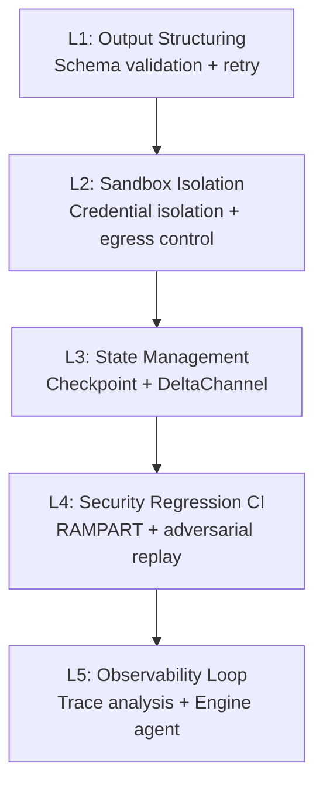

# Foundation — Track F: 部署運行紀律

_Week 2026-W21 · 25 items synthesized · $0.7166 USD_

# 生產級 LLM 系統的控制層紀律：從沙箱逃逸到 Delta Checkpoint 的部署運行深讀

## TL;DR (3 句繁中)
1. 本週多起事件揭示同一個核心論點：**LLM 系統在 production 中的主要失敗模式不是「模型不夠聰明」，而是工程控制層——沙箱隔離、狀態管理、輸出結構化、安全迴歸測試——的缺失或不成熟**。
2. 關鍵 trade-off 在於「agent 自主性」與「可觀測 / 可控性」之間的張力：給 agent 更多工具、更長執行時間、更深網路存取，就需要成比例增加的隔離層、checkpoint 機制與 CI 化安全測試。
3. 對 Livia 的工作而言：**台灣金融與製造業客戶即將面對的不是「要不要用 agent」的問題，而是「agent 部署後如何不爆炸」的治理工程問題**——本篇深讀提供可直接搬上提案簡報的 5 層控制架構。

## 背景與問題框架

[推論] 2025 年的 LLM 部署對話圍繞在「能不能用」——模型夠不夠準確、幻覺率多高、token 成本多少。到了 2026 年中，前沿組織的焦點已經明確移向「用了之後怎麼不出事」。本週同時出現的多條訊號——Claude Code 沙箱繞過漏洞被靜默修補([iThome 報導](https://www.ithome.com.tw/news/176010))、微軟開源 RAMPART 把 agent 安全測試 CI 化([iThome 報導](https://www.ithome.com.tw/news/176011))、LangChain 一次推出 Auth Proxy / Delta Channel / Interpreter / Engine 四個 production 元件([LangChain Interrupt 總覽](https://www.langchain.com/blog/interrupt-2026-overview))、微軟研究院實證 LLM 在長流程文件任務中會靜默改寫內容([iThome 報導](https://www.ithome.com.tw/news/176007))——共同指向一個六個月前尚未被系統性討論的問題：**production LLM 系統需要一套獨立於模型之外的控制層紀律（Control Layer Discipline）**。

[推論] 這個問題之所以「現在」值得深讀，有三個結構性原因。第一，agent 的執行時間從秒級拉長到分鐘甚至小時級（Daytona 日均 85 萬次執行、Railway 上 $200K+ agent 雲端消費），長執行時間放大了每一個控制缺口的風險面積。第二，agent 開始需要存取企業內網（Anthropic MCP Tunnels [研究預覽](https://www.ithome.com.tw/news/176026)、Confluent MCP 伺服器 [上線](https://www.ithome.com.tw/news/175999)），攻擊面從「API 呼叫」擴大到「VPN 等級的網路穿透」。第三，SAS 內部已有 4,200 支員工自建 agent([iThome 報導](https://www.ithome.com.tw/news/176027))，當 agent 數量從 pilot 進入 swarm，治理壓力呈超線性成長。

[推論] 六個月前，「部署運行紀律」大多被簡化為「加個 retry + 設個 rate limit」。今天的最佳實踐已經演化成五個層次的工程堆疊：輸出結構化控制、sandbox 隔離、狀態 checkpoint、安全迴歸 CI、可觀測性迴路。本篇深讀逐層展開。

## 核心概念解析（含 Mermaid 圖）

### 一、控制層五層架構

[推論] 綜合本週所有訊號，production LLM 系統的控制層可以歸納為以下五層，從最靠近模型輸出的一端到最靠近組織治理的一端：

**關鍵洞察**：大多數團隊只做了 L1（prompt engineering + JSON mode），然後直接跳到 L5（加個 dashboard 看 log）。L2–L4 的缺失是本週多起 production 事故的根因。

### 二、L1：輸出結構化控制——Prompt Engineering 不夠

[原文] Towards Data Science 的「Prompt Engineering Isn't Enough」一文([連結](https://towardsdatascience.com/prompt-engineering-isnt-enough-i-built-a-control-layer-that-works-in-production/))描述了一個真實場景：structured output 在 production 中的可靠度從 0% 提升到 100%，方法不是改 prompt，而是在模型上方建一個 control layer——包含 schema validation、自動修復（retry with error context）、fallback routing。

[推論] 這個 pattern 在 2025 年已被 Instructor、Guardrails AI 等工具抽象化，但真正的生產教訓是：**structured output 的可靠性不是模型的屬性，而是系統的屬性**。即使模型聲稱支援 JSON mode，在高併發、長 context、多輪對話下，格式崩壞的機率與 context 長度正相關。OpenAI 的 Structured Output 和 Anthropic 的 Tool Use 都在 API 層提供了 schema enforcement，但一旦 agent 開始跨多個模型（如 LangChain 的 model-specific profiles [推出](https://www.langchain.com/blog/tuning-deep-agents-different-models)顯示的 10-20 分提升），你需要一個模型無關的 validation layer。

### 三、L2：沙箱隔離——Claude Code 漏洞的警示

[原文] Anthropic 在過去 5 個月內靜默修補了 Claude Code 的兩個 sandbox bypass 漏洞，研究人員批評其未公開揭露，使開發者暴露於風險中([iThome](https://www.ithome.com.tw/news/176010))。

[原文] LangChain 推出 Auth Proxy 作為 LangSmith agent sandbox 的安全層([LangChain blog](https://www.langchain.com/blog/how-auth-proxy-secures-network-access-for-langsmith-agent-sandboxes))，核心設計原則是：**credentials 永遠不進入 sandbox runtime；egress 由基礎設施層控制，而非由 agent 或 prompt 控制**。

**關鍵洞察**：sandbox bypass 之所以危險，是因為一旦 agent 拿到 credentials 或突破 egress 限制，它就有了「真實世界的手」。Auth Proxy 模式的核心哲學是把 credential 注入推遲到 agent 控制範圍之外。這是銀行客戶最該注意的 pattern。

[原文] Anthropic 的 MCP Tunnels（研究預覽）允許 Claude Managed Agents 連接企業私有網路的 MCP 伺服器，並在客戶自有環境執行工具([iThome](https://www.ithome.com.tw/news/176026))。這看似是 convenience feature，但實質上是把 agent 的 blast radius 從「雲端 API 呼叫」擴大到「企業內網任意 MCP 端點」。

[推論] MCP Tunnels + Auth Proxy 構成一個對偶關係：前者擴大 agent 的觸及範圍，後者限縮 agent 的授權範圍。**沒有後者的前者就是定時炸彈**。

### 四、L3：狀態管理——DeltaChannel 與 O(N²) 問題

[原文] LangGraph 1.2 的 DeltaChannel([LangChain blog](https://www.langchain.com/blog/delta-channels-evolving-agent-runtime))解決了一個被低估的 production 問題：長時間運行的 agent 在每一步 checkpoint 完整狀態，儲存成本隨 session 長度呈 O(N²) 增長。DeltaChannel 只 checkpoint 差異（diff），週期性寫入完整 snapshot，將成本攤平為 O(N)。

**關鍵洞察**：這不只是成本問題。O(N²) 的 checkpoint 在長 session（例如 30+ 步的 coding agent 或多輪文件處理任務）中會導致寫入延遲，進而影響 agent 的 recovery 能力。DeltaChannel 的設計與資料庫領域的 WAL（Write-Ahead Log）+ periodic compaction 模式同構。

[原文] LangChain 同時推出 Interpreter 機制([LangChain blog](https://www.langchain.com/blog/give-your-agents-an-interpreter))——在 agent 內嵌一個小型 runtime（如 Python interpreter），讓 agent 在 tool calls 之間用程式碼管理 working state。這解決了「全部靠 context window 管理狀態」的 token 浪費問題，也降低了 context 過長導致的輸出品質退化。

### 五、L4：安全迴歸 CI——RAMPART 的範式

[原文] 微軟開源 RAMPART([iThome](https://www.ithome.com.tw/news/176011))，讓工程團隊將紅隊演練中發現的攻擊情境轉化為可反覆執行的自動化測試，並整合進 CI/CD pipeline。

**關鍵洞察**：agent 安全測試的核心困難不是「做一次紅隊」而是「確保修過的問題不再出現」。RAMPART 把安全測試從 event-driven（出事才測）變成 continuous（每次 commit 都測）。這與傳統 AppSec 的 SAST/DAST 整合 CI 的演化路徑完全平行。

[原文] 結合 Anthropic 靜默修補 Claude Code 漏洞的案例——修了但沒告訴使用者，也沒有提供 regression test——RAMPART 的價值更加明確：**如果你依賴的 agent 平台不提供安全 changelog，你至少要自己跑 regression**。

### 六、L5：可觀測性迴路——LangSmith Engine 與 Eval 層

[原文] LangSmith Engine([LangChain blog](https://www.langchain.com/blog/how-we-built-langsmith-engine-our-agent-for-improving-agents))是一個「用 agent 監控 agent」的系統：分析大量 trace、識別 recurring patterns、產生改進建議。這是 LLMOps 可觀測性的最新演化——從被動 log 收集到主動 pattern 識別。

[原文] IBM Research 與 Hugging Face 合作推出 Open Agent Leaderboard([HF blog](https://huggingface.co/blog/ibm-research/open-agent-leaderboard))，強調 agent 評估不能只看模型分數，必須考慮完整系統（工具、規劃、記憶、錯誤恢復）。

[原文] TDS 的 eval 文章([連結](https://towardsdatascience.com/llm-evals-are-based-on-vibes-i-built-the-missing-layer-that-decides-what-ships/))提出把 eval 拆成 attribution、specificity、relevance 三個獨立維度，用 Python 實作而非依賴 LLM-as-judge，以確保可重現性。

[推論] L5 的最大危險是「eval 劇場」——看起來有數字，但數字不接地。Open Agent Leaderboard 的設計至少承認了這個問題：同一個模型在不同系統配置下得分可以差 30 分以上。這意味著 **eval 的單位不應該是「模型」，而應該是「模型 × 系統配置 × 任務領域」的組合**。

### 七、LLM 長流程文件失敗模式

[原文] 微軟研究院論文「LLMs Corrupt Your Documents When You Delegate」指出，LLM 在長流程委派式文件任務（格式轉換、資料拆分等）中會靜默改寫內容，且改寫難以被人類察覺([iThome](https://www.ithome.com.tw/news/176007))。

[推論] 這個發現直接衝擊銀行業最想做的場景之一：用 LLM 自動處理合約、法規文件、報表轉換。「靜默改寫」比「明顯錯誤」更危險，因為後者會觸發 fallback，前者直接進入下游系統。控制層的 L1（輸出 validation）必須包含 content integrity check——不只驗格式，還要驗內容語意是否被非預期改變。

## 與既有框架的對位

[推論] 本週的五層控制架構與 NIST AI RMF 1.0 的 GOVERN-MAP-MEASURE-MANAGE 四個核心功能高度對應。L1-L3 落在 MANAGE（technical controls），L4 落在 MEASURE（continuous testing），L5 落在 MAP + GOVERN（impact awareness + organizational process）。但 NIST AI RMF 的 granularity 不夠——它沒有區分「agent 的 credential isolation」和「model 的 output validation」，而本週的訊號清楚顯示這兩者需要完全不同的工程堆疊。

[推論] 新加坡政府的 AI agent sandbox 測試結果([iThome](https://www.ithome.com.tw/news/175999))是目前最接近「政府級 agent 部署治理框架」的公開案例，與金管會即將面對的問題直接相關。新加坡的做法是：先在受控沙箱中測試，明確列出治理風險，再決定是否放行。這與 Anthropic RSP（Responsible Scaling Policy）的「先量風險再擴權限」邏輯一致。

[推論] Chip Huyen 在《Designing Machine Learning Systems》中主張 production ML 的核心不是模型而是「data + monitoring pipeline」。本週的控制層架構是這個論點在 agent 時代的自然延伸：**production agent 的核心不是模型，而是 sandbox + checkpoint + security CI + observability pipeline**。Karpathy 所提的「Software 2.0」觀點需要修正——Software 2.0 的部署紀律不是比 Software 1.0 更鬆，而是需要額外一整套 1.0 沒有的控制機制（因為行為不確定性是模型的固有屬性）。

## Trade-offs 與爭議

**1. Sandbox 嚴格度 vs. Agent 功能**
- 正面：嚴格 sandbox（無 credential、egress allowlist）大幅限縮 blast radius。
- 反面：許多有用的 agent 場景（如連銀行核心系統查餘額）需要穿透 sandbox。MCP Tunnels 的出現就是因為 sandbox 太緊。
- 結論：這不是二選一，而是分層——sandbox 處理「agent 的計算」，Auth Proxy 處理「agent 的認證」，兩者分離。

**2. DeltaChannel (diff checkpoint) vs. Full Checkpoint**
- 正面：O(N) 成本、低延遲寫入。
- 反面：Recovery 時需要 replay diff chain 到最近的 full snapshot，增加恢復時間。如果 diff chain 損壞，可能丟失多步狀態。
- 結論：對大多數 production agent（session < 100 步）利大於弊；對超長 session 需要更頻繁的 full snapshot。

**3. RAMPART CI 化安全測試 vs. 人工紅隊**
- 正面：自動化、可重複、每次 commit 都跑。
- 反面：自動化測試只能覆蓋「已知攻擊模式」，無法發現新類型漏洞。RAMPART 是 regression safety net，不是 discovery tool。
- 結論：兩者互補，不可替代。但多數團隊連 regression 都沒做，所以 RAMPART 的邊際價值極高。

**4. Model-specific profiles vs. Model-agnostic design**
- 正面：LangChain 的 model-specific profiles 帶來 10-20 分 benchmark 提升。
- 反面：增加維護成本，每次模型更新都要驗證 profile 是否仍然有效；也增加了 vendor lock-in 的軟成本。
- 結論：在 production 中，10-20 分的差距就是 user-facing 品質的分水嶺，值得付出維護成本。

**5. Agent-monitors-agent (LangSmith Engine) 的遞迴風險**
- 正面：自動化 trace 分析，人力不可擴展的問題得到緩解。
- 反面：監控 agent 本身也可能出錯、產生幻覺、或被 adversarial trace 欺騙。這是一個遞迴信任問題。
- 結論：Engine 的 output 應被視為「建議」而非「決定」——需要 human-in-the-loop 的 escalation path。

## 對 Livia IBM 客戶的具體含意

**國泰 / 玉山等銀行客戶：**
[推論] 銀行最迫切的場景——合約文件處理、客服 agent、內部知識查詢——全部落在本週揭示的風險區域。微軟研究院的「靜默改寫」發現意味著：**任何用 LLM 處理法律文件或報表的 pilot，都必須在 pipeline 中加入 content integrity check（比對原文與輸出的語意差異），否則無法通過金管會的 model risk management 審查**。建議在提案中加入「三層 validation gate」：格式 → 內容完整性 → 業務規則。

**TSMC / 鴻海等製造業客戶：**
[推論] 製造業 agent 的特殊風險在於：agent 一旦連到 MES/ERP 系統（類似 MCP Tunnels 的場景），錯誤操作的代價是實體世界的——產線停機、出貨延遲、良率數據誤判。Auth Proxy 模式的 credential isolation 不只是 IT 安全需求，更是 OT 安全需求。建議在架構提案中明確區分 「read-only agent」（查詢設備狀態）vs.「write agent」（調整參數），後者需要額外的 human-approval gate。

**共通提案 angle：**
- **「五層控制架構」可以直接作為提案的技術框架頁**——用 Mermaid 圖呈現，告訴客戶「你今天在第幾層，我們建議先補到第幾層」。
- **新加坡政府的 agent sandbox 結果是絕佳的 peer benchmark**——「新加坡政府已經做完沙箱測試並公布結果，台灣的金管會 / 數發部也會問你：你的 agent 經過哪些治理驗證？」
- **SAS 的 4,200 agent 案例是 scale warning**——「SAS 5000 人公司就產出 4,200 支 agent。你們的員工開始用 Copilot 建 agent 之後，三個月內就會面臨同樣的治理問題——誰核准的？誰監控的？出事誰負責？」
- **RAMPART 作為 IBM 可提供的差異化服務**——「我們可以幫你建 agent security regression pipeline，每次 agent 邏輯變更都自動驗證已知攻擊場景不會復發」。

## 對 Livia harness engineer portfolio 的含意

[推論] 本週深讀直接對應 portfolio 中的兩個核心 design note：

1. **Design Note: "Control Layer Architecture for Production Agent Systems"** — 可以從這篇深讀抽出五層架構圖，加上每一層的技術選型（L1: Instructor/Pydantic, L2: Auth Proxy pattern, L3: DeltaChannel/WAL, L4: RAMPART, L5: trace-based observability），寫成一個 2 頁的架構決策文件。面試時被問到「你怎麼把 agent 從 demo 推到 production」，這個架構就是答案骨架。

2. **Design Note: "Credential Isolation in Agent-to-Enterprise Integration"** — Auth Proxy + MCP Tunnels 的對偶關係可以抽成一個 pattern language：「agent 的 reach 擴大時，credential 的 scope 必須同步收縮」。這是 zero-trust in agent systems 的具體實現，適合用在「你對 agent 安全有什麼見解」的面試問答。

3. **面試問答範例**：「Q: Production LLM 系統最常見的失敗模式是什麼？A: 不是模型幻覺——那是 demo 階段的問題。Production 階段最致命的是靜默失敗：structured output 崩壞但下游沒報錯、sandbox 被繞過但沒有 alert、長 session 的 checkpoint 寫入延遲導致 crash 後狀態丟失。解決方法不是換更好的模型，而是建 control layer——我在我的 design note 裡整理了五層架構。」

---

# Production LLM Control Layer Discipline: From Sandbox Escapes to Delta Checkpoints

## TL;DR (3 sentences)
1. This week's signals converge on a single thesis: **the dominant failure mode of production LLM systems is not "the model isn't smart enough" but the immaturity of engineering control layers—sandbox isolation, state management, output structuring, and security regression testing**.
2. The key trade-off is between agent autonomy and observability/controllability: more tools, longer execution, deeper network access all demand proportionally stronger isolation, checkpointing, and CI-integrated security testing.
3. For Livia's work: **Taiwan's banks and manufacturers are about to face not "should we use agents?" but "how do we keep deployed agents from causing incidents?"—this deep-read provides a 5-layer control architecture ready for client proposals**.

## Background & Problem Framing

[推論] In 2025, LLM deployment conversations centered on feasibility—accuracy, hallucination rates, token cost. By mid-2026, the frontier has decisively shifted to "what goes wrong after deployment." This week produced a constellation of signals that together reveal a structural gap: production LLM systems need a **control layer discipline** that is independent of the model itself.

Consider the simultaneous events: Anthropic silently patched two sandbox bypass vulnerabilities in Claude Code over five months without notifying users ([iThome](https://www.ithome.com.tw/news/176010)). Microsoft open-sourced RAMPART to CI-ify adversarial agent testing ([iThome](https://www.ithome.com.tw/news/176011)). LangChain shipped Auth Proxy, DeltaChannel, Interpreters, and Engine in a single product cycle ([LangChain](https://www.langchain.com/blog/interrupt-2026-overview)). Microsoft Research empirically demonstrated that LLMs silently corrupt documents in long-horizon delegation tasks ([iThome](https://www.ithome.com.tw/news/176007)). A practitioner reported taking structured output reliability from 0% to 100% by building a control layer above the model ([TDS](https://towardsdatascience.com/prompt-engineering-isnt-enough-i-built-a-control-layer-that-works-in-production/)).

[推論] Three structural forces make this topic urgent *now*. First, agent execution times have stretched from seconds to minutes and hours—Daytona reports 850K daily runs ([Latent Space](https://www.latent.space/p/daytona)), Railway sees $200K+ agent cloud spend ([Latent Space](https://www.latent.space/p/railway))—and longer execution amplifies every control gap's risk surface. Second, agents now need access to enterprise intranets (Anthropic MCP Tunnels, Confluent MCP servers), expanding the attack surface from "API calls" to "VPN-grade network traversal." Third, agent populations are exploding—SAS internally has 4,200 employee-built agents ([iThome](https://www.ithome.com.tw/news/176027))—and governance pressure scales super-linearly.

Six months ago, "deployment discipline" meant "add a retry, set a rate limit." Today's best practice has evolved into a five-layer engineering stack: output structuring, sandbox isolation, state checkpointing, security regression CI, and observability loops.

## Core Concepts (with Mermaid diagrams)

### I. The Five-Layer Control Architecture

[推論] Synthesizing all this week's signals, the production LLM control layer can be organized into five layers, from closest-to-model-output to closest-to-organizational-governance:

**Key insight**: Most teams implement L1 (prompt engineering + JSON mode) and jump straight to L5 (add a dashboard). The absence of L2–L4 is the root cause of this week's multiple production incidents.

### II. L1: Output Structuring — Prompt Engineering Isn't Enough

[原文] The TDS article "Prompt Engineering Isn't Enough" ([link](https://toward
