# 🗞️ AI Intel Digest — 2026-W22

_Generated 2026-05-29 00:13 UTC · 109 high-signal items synthesized · $0.4069 USD cost · ~101 分鐘讀完_


## ⚡ 本週 TL;DR — 5 Pillar 各一句
- 🏦 **P1**: Anthropic 推出 self-hosted agent sandbox + MCP tunnel，直接回應銀行「資料不得出境」的核心顧慮
- 📊 **P2**: Anthropic 推出 Claude Managed Agents 自管沙箱 + MCP Tunnel，企業 AI governance 有了基礎建設級答案
- 🚀 **P3**: DharmaOCR：3B 特化模型在結構化 OCR 上擊敗所有商業 frontier API，成本低 50 倍
- 🛠️ **P4**: Microsoft Copilot Cowork：agent 透過渲染圖片外洩檔案——prompt injection 打穿 email 管線
- 🌐 **P5**: Cognition + Railway + Daytona：三個獨立資料點共同指向「Async Agent 生產化」進入現實

## 📊 本期 provenance 分布（合成證據強度）

_本期合成共 80 段，標記為：_

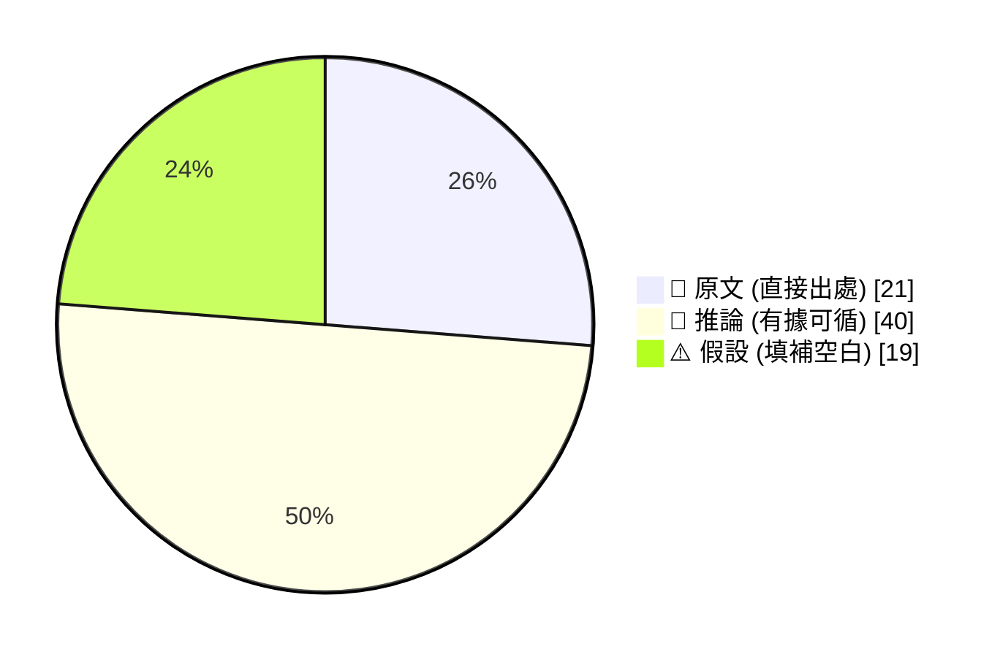

_引用規範：📖 可直接引用；🧠 客戶會議前查 verification hints；⚠️ 引用時明說「此為推測」_

## 🔄 本期 pipeline 處理流程

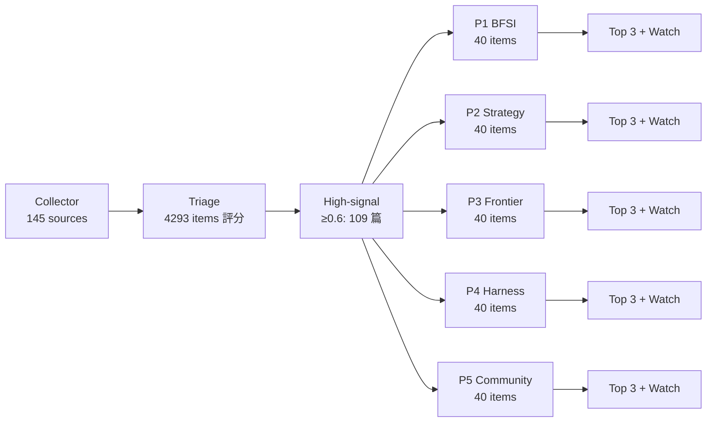

## 📑 目錄
- [Pillar 1 — 產業 AI 真實落地 (BFSI + 製造業)](#pillar-1) · 25 items · $0.0961
- [Pillar 2 — AI 戰略 / 治理 / 董事會層級論述](#pillar-2) · 18 items · $0.0721
- [Pillar 3 — Frontier 能力 + 模型動向](#pillar-3) · 12 items · $0.0684
- [Pillar 4 — Harness Engineering 實作技藝](#pillar-4) · 40 items · $0.1033
- [Pillar 5 — 學派 / 社群 / 思想動態](#pillar-5) · 14 items · $0.0670
- [📚 Foundation 深讀](#foundation) · curriculum 主題深度文


---

<a id="pillar-1"></a>

## 🏦 Pillar 1 — 產業 AI 真實落地 (BFSI + 製造業)
_25 items · $0.0961_

## Pulse — Top 3

### 1. Anthropic 推出 self-hosted agent sandbox + MCP tunnel，直接回應銀行「資料不得出境」的核心顧慮

📖 **原文** Anthropic 於 5/27 公布 Claude Managed Agents 新功能：**self-hosted sandbox** 讓 agent 執行環境跑在企業自選雲端平台，**MCP tunnel** 則讓 agent 連結私有 MCP 伺服器——兩者都在企業建立的邊界內運作，受企業 security 及 runtime 控制。

🧠 **推論** 對台灣銀行業而言，金管會對個資與交易資料的「境內處理」要求一直是 cloud AI 部署的最大阻力；這個架構讓 Anthropic 第一次有辦法說：「agent 的 compute 與資料都不離開你的 VPC。」

🧠 **推論** 搭配同一週 Anthropic 公開的 agent 安全設計（環境隔離、檔案系統邊界、網路出口管制），整套 governance 架構已足夠讓 IT 風控部門寫出正式的 risk assessment。

以下架構說明 self-hosted agent 的資料流隔離設計：

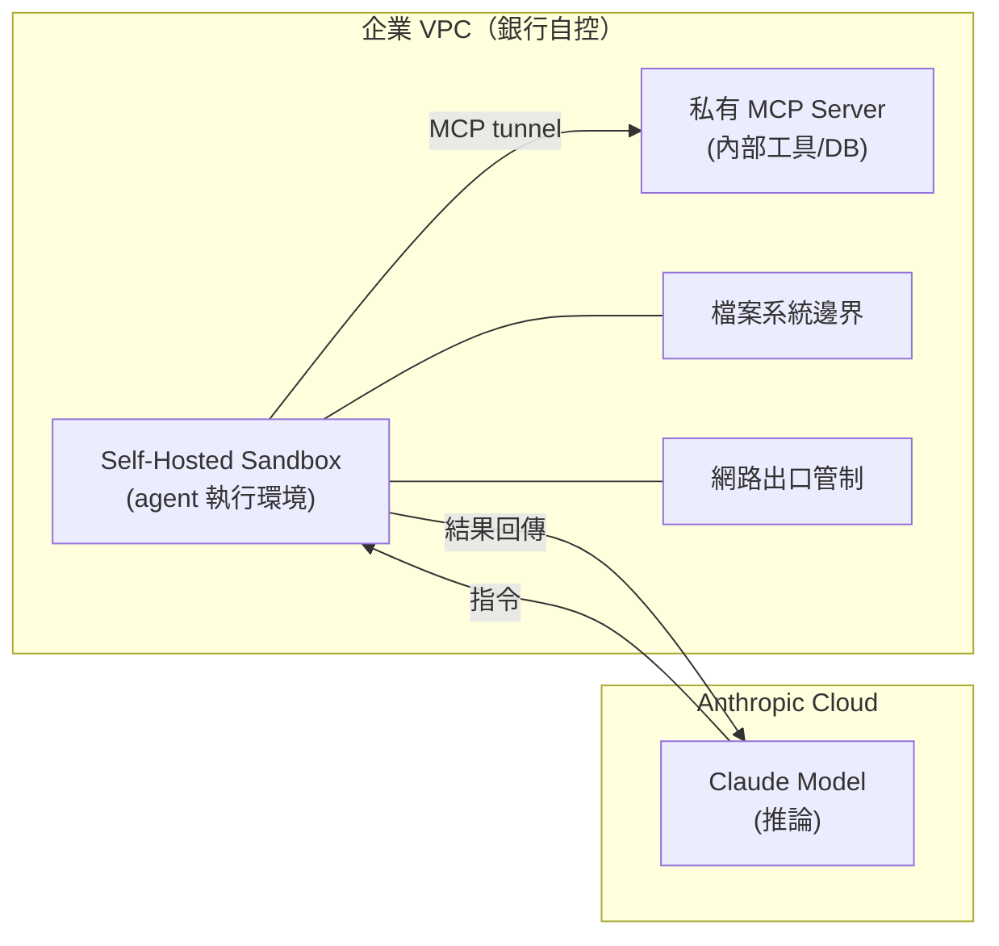

*關鍵洞察：模型推論可在 Anthropic Cloud，但 agent 的工具執行與資料存取全程留在企業 VPC，切斷資料外洩路徑。*

- 來源：[iThome — Anthropic 公布自管代理人沙箱](https://www.ithome.com.tw/news/176184)、[iThome — Claude 代理安全設計](https://www.ithome.com.tw/news/176172)
- 對客戶的具體含意：向國泰、富邦或中信提案時，直接帶出「self-hosted sandbox + MCP tunnel」架構，主動拆解「資料主權」的異議，而不是等 IT 部門提出再防守。

**(English)** **Anthropic ships self-hosted agent sandbox + MCP tunnel, directly addressing banks' "data must not leave the country" objection**

📖 **Source** Anthropic announced on 5/27 that Claude Managed Agents now supports a **self-hosted sandbox**—agent execution runs on the enterprise's chosen cloud platform—and an **MCP tunnel** that connects agents to private MCP servers, both operating entirely within enterprise-controlled boundaries under enterprise security and runtime controls. [Inference] For Taiwan's banking sector, the FSC's requirement that personal and transaction data be processed domestically has been the single biggest blocker to cloud AI deployment; this architecture is the first time Anthropic can credibly say, "the agent's compute and data never leave your VPC." [Inference] Combined with Anthropic's simultaneously published agent safety design spec (environment isolation, filesystem boundaries, network egress controls), the complete governance stack is now mature enough for an IT risk team to produce a formal risk assessment.

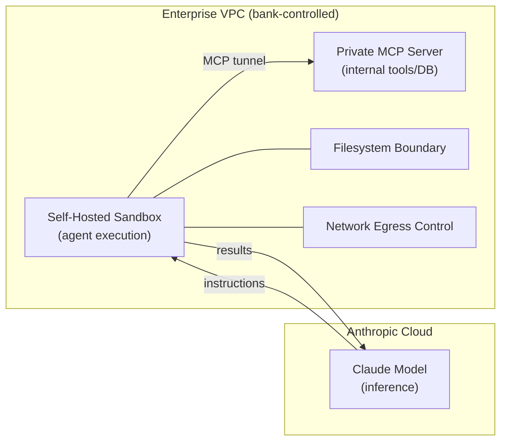

*Key insight: Model inference can remain on Anthropic Cloud, while all agent tool execution and data access stays inside the enterprise VPC, severing the data-exfiltration path.*

- Source: [iThome — Anthropic agent sandbox](https://www.ithome.com.tw/news/176184), [iThome — Claude agent safety design](https://www.ithome.com.tw/news/176172)
- Client implication: When proposing to Cathay, Fubon, or CTBC, lead with the self-hosted sandbox + MCP tunnel architecture to proactively dismantle the "data sovereignty" objection before IT raises it.

---

### 2. 南山人壽 CDO 公開 AI 落地完整路徑：56 件員工提案 → 3 件 PoC，以及 500 人數轉聯隊只有 20 位 AI 核心人才的現實

📖 **原文** 南山人壽 2026 年發起「#WHAT-IF to #TRY-IF」內部創新活動：全公司湧入 56 件第一線員工提案，14 件入選發表，最終 3 件獲資源完成 PoC。CDO 呂新科同時坦承：500 人數轉聯隊中，AI 核心人才約 20 餘名，且每三個月技術就翻轉一次，招募競爭直接面對台積電等半導體龍頭。

🧠 **推論** 這個「漏斗式 PoC 篩選 + 薄 AI 核心層 + 廣員工提案池」的組織模式，是台灣金融業在有限 AI 人才下能走的現實路徑，而非理想架構。

🧠 **推論** 銀行業客戶（尤其中小規模如台新、台企銀）看到保險同業用 20 人核心隊做到這個規模，說服力遠比顧問公司的 benchmark 高。

- 來源：[iThome — 南山人壽 AI 轉型藍圖](https://www.ithome.com.tw/news/176177)、[iThome — 南山人壽 AI 人才問題](https://www.ithome.com.tw/news/176181)
- 對客戶的具體含意：對台灣銀行 CDO 或 CAIO 開場時，用南山案例具體化「20 人核心 + 員工提案漏斗」模式，降低「我們人不夠」作為拒絕 AI 轉型的藉口門檻。

**(English)** **Nan Shan Life CDO reveals complete AI adoption path: 56 employee proposals → 3 PoCs, and the reality of only 20 core AI staff in a 500-person digital transformation squad**

📖 **Source** Nan Shan Life's 2026 internal innovation program "#WHAT-IF to #TRY-IF" drew 56 frontline employee proposals, filtered to 14 for presentation, and ultimately funded 3 to full PoC completion. CDO Lu Xin-Ke also openly acknowledged: out of 500 people in the digital transformation unit, only ~20 are core AI talent, technology cycles turn every three months, and recruiting competes directly against TSMC and other semiconductor giants. [Inference] This "funnel-gated PoC selection + thin AI core layer + broad employee proposal pool" organizational model is the realistic operating pattern for Taiwan's financial sector under constrained AI headcount—not an idealized blueprint. [Inference] When a bank client (especially mid-tier ones like Taishin or TCB) sees an insurance peer achieve this at scale with 20 core people, the proof point lands harder than any consultant benchmark deck.

- Source: [iThome — Nan Shan AI transformation blueprint](https://www.ithome.com.tw/news/176177), [iThome — Nan Shan AI talent challenge](https://www.ithome.com.tw/news/176181)
- Client implication: Open conversations with Taiwan bank CDOs or CAIOs using the Nan Shan case to make "20-person core + employee proposal funnel" concrete, and lower the activation energy for "we don't have enough people" as a blocking objection.

---

### 3. 專精小模型在企業 OCR 任務打贏所有 frontier API，成本差距 50 倍——對台灣製造業文件處理的直接含意

📖 **原文** Hugging Face 上發布的 DharmaOCR 研究顯示：一對 3B 參數專精 SLM（small language model），在結構化 OCR benchmark 上超越所有測試的商用 frontier API，成本約為後者的五十分之一。

🧠 **推論** 台灣製造業（Foxconn、Wistron、Quanta）每天處理的報工單、BOM、出貨文件、品管報告，絕大多數屬於「高重複性、格式固定」的結構化文件——正是 specialization beats scale 效應最強的場景。

🧠 **推論** 對 IBM 顧問角色的含意：不要預設每個 enterprise use case 都需要 GPT-4o 或 Claude Sonnet；先做 task decomposition，把結構化文件處理單獨拆出來跑 fine-tuned SLM，frontier model 留給需要 reasoning 的步驟，整體 token cost 可能下降一個數量級。

⚠️ **假設** DharmaOCR 的 benchmark 是否完整涵蓋繁體中文與混合中英文表格，目前 excerpt 未提及，需驗證。

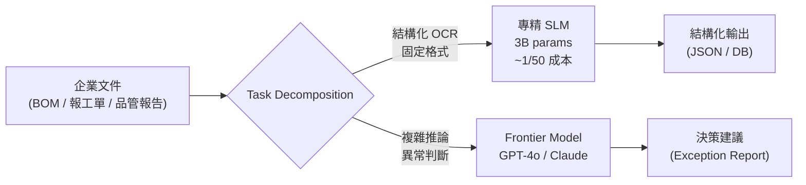

*關鍵洞察：task decomposition 才是成本控制的槓桿，而非單純換便宜模型。*

- 來源：[Hugging Face Blog — Specialization Beats Scale](https://huggingface.co/blog/Dharma-AI/specialization-beats-scale)
- 對客戶的具體含意：對 Foxconn 或 Wistron 的 AI 方案，提出「frontier model 做 orchestration，SLM 做文件擷取」的兩層架構，以 50x 成本差距作為 business case 開場。

**(English)** **Specialized small model beats all frontier APIs on enterprise OCR at 50x lower cost—direct implication for Taiwan manufacturer document processing**

📖 **Source** The DharmaOCR research published on Hugging Face shows that a pair of 3B-parameter specialized SLMs outperformed every commercial frontier API tested on a structured OCR benchmark, at approximately one-fiftieth the cost. [Inference] Taiwan manufacturers (Foxconn, Wistron, Quanta) process shop-floor work orders, BOMs, shipping documents, and QC reports daily—nearly all high-repetition, fixed-format structured documents, exactly the scenario where the specialization-beats-scale effect is strongest. [Inference] The implication for the IBM consulting role: don't default to assuming every enterprise use case requires GPT-4o or Claude Sonnet; do task decomposition first, isolate structured document extraction to run on a fine-tuned SLM, and reserve frontier models for steps requiring genuine reasoning—total token cost may drop by an order of magnitude. [Assumption] Whether DharmaOCR's benchmark fully covers Traditional Chinese and mixed Chinese-English tables is not stated in the excerpt and needs verification before citing to clients.

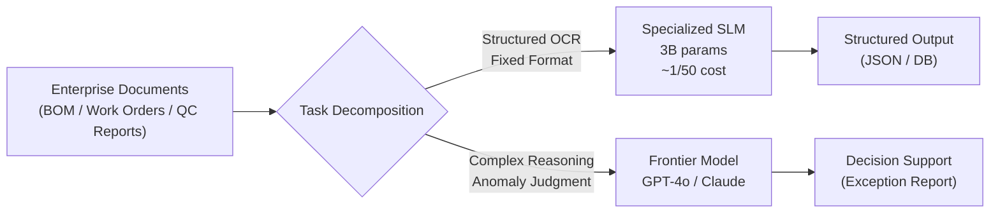

*Key insight: task decomposition is the cost-control lever, not simply swapping to a cheaper model.*

- Source: [Hugging Face Blog — Specialization Beats Scale](https://huggingface.co/blog/Dharma-AI/specialization-beats-scale)
- Client implication: For Foxconn or Wistron proposals, pitch a two-tier architecture—frontier model for orchestration, SLM for document extraction—and open the business case with the 50x cost differential.

---

## Watch list

繁中為主，每條一行：

- [iThome — Robinhood 開放 AI 代理人代客交易與刷卡](https://www.ithome.com.tw/news/176186) — Robinhood 允許 Claude Code / ChatGPT 等外部 agent 執行股票交易，agentic fintech 的 human-in-the-loop 邊界已實質移動，值得在銀行客戶對話中引用。
- [Lyft — LangGraph + LangSmith 自助 agent 平台](https://www.langchain.com/blog/lyft-built-a-self-serve-ai-agent-platform-for-customer-support-with-langgraph-and-langsmith) — agent 開發週期從數月壓縮至數週；LangGraph/LangSmith 在 production 的具體架構，harness 工程師直接可用。
- [Databricks — Danone + Capital One agent 規模化案例](https://www.databricks.com/blog/how-enterprise-leaders-are-scaling-ai-agents-across-their-organization) — 兩位 CDO/Chief Scientist 親口談 agent 規模化；vendor-sourced 但人名可查，可作為客戶簡報的背書素材。
- [Dcard — Agent-Native 工作流程縮短逾八成時間](https://www.inside.com.tw/article/41409-dcard-gntc-agent-native-enterprise-ai-workflow) — 台灣本土案例，流程時間縮短 80%；Dcard 將此方法論包裝成產品賣給企業，值得追蹤是否進入金融或製造客戶。
- [AWS — Everllence P&ID 智慧化改善工廠維運](https://aws.amazon.com/blogs/industries/how-everllence-scaled-pid-intelligence-to-improve-plant-operations/) — AI agent 解析工業管路儀器圖（P&ID）輔助診斷；對 TSMC 或 Foxconn 的工廠維運場景直接類比。
- [中華電信 — ChainStrike AI 資安驗證閘門](https://www.ithome.com.tw/news/176193) — 用 LLM 做 CI/CD 資安驗證，解決開發速度超過人工審查能力的問題；台灣製造業 DevSecOps 的參考案例。
- [Stripe Radar — 跨支付方式詐欺偵測擴展](https://stripe.com/blog/expanding-stripe-radar-to-protect-more-of-your-business) — 新增多帳號濫用、按量付費濫用等新型詐欺樣態偵測；對電支/銀行風控客戶有直接參考價值。
- [科技新報 — 黃仁勳示警台灣 AI 下一關卡是電力](https://finance.technews.tw/2026/05/28/jensen-huang-talk-about-taiwan-ai/) — 電力瓶頸比晶片更關鍵；excerpt 太短無法深入，但董事會層級的 AI 基礎建設對話可引用 Huang 的背書。
- [Snowflake 收購 Natoma — 企業 agent 治理存取控管](https://www.snowflake.com/content/snowflake-site/global/en/blog/snowflake-acquire-natoma-governed-agentic-access) — identity + policy + audit 的 governed agentic access；銀行業 agent 治理架構的市場方向指標。
- [統一超商 — AIoT 能源管理系統落地](https://www.ithome.com.tw/news/176198) — 感測器動態控制冷藏設備，台灣零售 AIoT 實案；缺乏量化成果，但可作為製造業 ESG 數位治理的類比。

---

## Verification hints

This briefing contains **4

🧠 **推論**** segments and **1

⚠️ **假設**** segment. Before citing in client conversations, verify these specific points (English for language-learning practice):

1. **Self-hosted sandbox data flow** (

🧠 **推論**): The iThome excerpt confirms the sandbox runs on enterprise-chosen cloud and connects via MCP tunnel to private MCP servers, but does not explicitly state whether model *inference* itself also runs on-premises or still calls back to Anthropic's cloud. Verify at [Anthropic's Claude Managed Agents documentation](https://www.ithome.com.tw/news/176184) before making "fully on-premises inference" claims to FSC-regulated clients.
2. **Nan Shan headcount and PoC numbers** (

🧠 **推論**): The figures (500-person squad, ~20 AI core staff, 56 proposals → 3 PoCs) come from CDO Lu Xin-Ke's public remarks at an event covered by iThome. Verify whether these are current FY2026 numbers or a historical snapshot, and confirm the 3 PoCs are completed (not in-progress) at [iThome source](https://www.ithome.com.tw/news/176177) before using in competitive benchmarking.
3. **DharmaOCR 50x cost figure and benchmark scope** (

🧠 **推論** +

⚠️ **假設**): The "50x lower cost" claim appears in the Hugging Face blog but the excerpt does not name which frontier APIs were tested, what document types were benchmarked, or whether Traditional Chinese / mixed-language tables were included. Check the [full paper and benchmark on Hugging Face](https://huggingface.co/blog/Dharma-AI/specialization-beats-scale) before quoting cost figures to Foxconn or Wistron—the benchmark domain may not generalize to their specific document formats.
4. **Robinhood agentic trading regulatory status** (

🧠 **推論**): The iThome report describes Robinhood allowing external AI agents (Claude Code, ChatGPT, Cursor) to execute trades and card spending. This is a US product; whether similar agent-delegated trading would be permissible under Taiwan FSC rules for Taiwanese banks is unverified and requires legal review before using as a forward-looking example with regulated clients.2026-05-29 00:04:00,780 INFO pillar 2 (AI 戰略 / 治理 / 董事會層級論述): 18 high-signal items (min_signal=0.60)

---

<a id="pillar-2"></a>

## 📊 Pillar 2 — AI 戰略 / 治理 / 董事會層級論述
_18 items · $0.0721_

## Pulse — Top 3

### 1. Anthropic 推出 Claude Managed Agents 自管沙箱 + MCP Tunnel，企業 AI governance 有了基礎建設級答案

📖 **原文** Anthropic 於 5/27 公布 Claude Managed Agents 新功能：self-hosted 沙箱讓代理人執行在企業自選雲端平台，MCP tunnel 則連結私有 MCP 伺服器。代理人執行工具的沙箱與連結的服務，全數跑在企業建立的邊界內，受企業安全及 runtime 控制。

🧠 **推論** 這直接回應了台灣金融業最常見的 AI agent 卡關點——資料不能出境、工具呼叫必須在受控環境——讓 Anthropic 在企業 agentic AI 的 production deployment 賽道上，從「平台依賴」變成「企業自主治理」的選項。對 Livia 正在推進 IBM watsonx + Claude API 架構的客戶而言，self-hosted sandbox 與 MCP tunnel 可作為合規架構的實作骨幹。

以下圖示說明 Managed Agents 的治理架構，說明企業邊界如何隔離代理人執行環境：

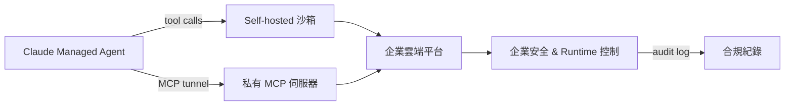

企業邊界（D→E→F）是關鍵洞見：代理人的每一次工具呼叫都在可審計的受控環境內，而非流向 Anthropic 雲端。

- 來源：[iThome](https://www.ithome.com.tw/news/176184)
- 對客戶的具體含意：向國泰、中信、台新等行庫 CISO 簡報時，可以 self-hosted sandbox + MCP tunnel 作為「AI 代理人不出境」的技術證明，取代原本只能靠條款約束的合規承諾。

**(English)** Anthropic ships Claude Managed Agents self-hosted sandbox + MCP tunnel — enterprise AI governance gets infrastructure-grade answers

📖 **Source** On 5/27, Anthropic announced Claude Managed Agents features: a self-hosted sandbox runs agents on the enterprise's chosen cloud platform, while an MCP tunnel connects to private MCP servers. Both the tool-execution sandbox and connected services run entirely within enterprise-defined boundaries, under enterprise security and runtime controls. [Inference] This directly addresses the most common production blocker for Taiwan's financial sector — data residency requirements and the need for controlled tool invocations — shifting Anthropic from "platform dependency" to "enterprise-sovereign governance" in the agentic AI race. For Livia's clients building on IBM watsonx + Claude API architectures, the self-hosted sandbox and MCP tunnel can serve as the compliance skeleton for production agent deployments.

The diagram above illustrates the governance architecture — the key insight is that every agent tool call is auditable within enterprise-controlled infrastructure, not routed through Anthropic's cloud.

- Source: [iThome](https://www.ithome.com.tw/news/176184)
- Client implication: When briefing CISOs at Cathay, CTBC, or Taishin, the self-hosted sandbox + MCP tunnel combination provides a technical proof point for "AI agents that never leave the perimeter" — replacing contractual compliance assurances with architectural ones.

---

### 2. 南山人壽 CDO 呂新科：56 件內部提案 → 3 個 PoC 落地，台灣壽險 AI 轉型的「可複製藍圖」首度曝光

📖 **原文** 南山人壽 2026 年推動「#WHAT-IF to #TRY-IF」內部創新試行活動：第一線員工提案、六分鐘六張投影片競技，共收 56 件提案，14 件入選發表，3 件獲資源挹注完成 PoC。

🧠 **推論** 這個漏斗設計（56 → 14 → 3）並非意外，而是 CDO 刻意設計的「可見度換資源」機制——讓 AI 轉型從高層宣示下沉到執行層，同時用競爭性篩選控制資源投入風險。

🧠 **推論** 對 IBM 顧問而言，這個模型比「全面導入」敘事更容易在保守的台灣金融客戶端落地：先用內部創新競賽建立 AI 轉型的心理安全感，再以 PoC 結果作為擴大投資的業務案例。另一篇報導（item 2708）揭示人才面的代價：500 人數轉聯隊中 AI 核心人才僅約 20 名，面對台積電等半導體巨頭搶人，保險業吸引力有限——這也是客戶最不願承認、但最需要外部解方的瓶頸。

- 來源：[iThome — 南山人壽 AI 轉型藍圖](https://www.ithome.com.tw/news/176177)、[iThome — 南山人壽 AI 人才策略](https://www.ithome.com.tw/news/176181)
- 對客戶的具體含意：向國泰金、富邦金等壽險集團簡報時，南山的「56 → 3 PoC 漏斗」可作為 IBM AI 轉型輔導的參考框架，尤其「員工自提案 + 公司資源陪跑」模式可降低高層對 AI 投資失敗的曝險感。

**(English)** Nan Shan Life CDO Lu Hsin-Ko: 56 internal proposals → 3 PoCs completed — Taiwan life insurer's replicable AI transformation blueprint goes public

📖 **Source** In 2026, Nan Shan Life ran a "#WHAT-IF to #TRY-IF" internal innovation sprint: frontline employees pitched in 6-minute, 6-slide formats, generating 56 proposals total; 14 were selected for presentation, and 3 received company resources to complete full proofs-of-concept. [Inference] The funnel structure (56 → 14 → 3) is not accidental — it is a CDO-designed "visibility-for-resources" mechanism that pushes AI transformation from executive proclamation down to execution layer, while using competitive screening to limit investment risk. [Inference] For IBM consultants, this model is far more deployable with conservative Taiwan financial clients than a "full rollout" narrative: use internal innovation competitions to build psychological safety around AI transformation, then use PoC outcomes as the business case for scaled investment. A companion article (item 2708) reveals the talent cost: of ~500 people in Nan Shan's digital transformation unit, only ~20 are core AI specialists — and competing against TSMC and semiconductor firms for talent, insurers are structurally disadvantaged. This is the bottleneck clients least want to admit but most need external solutions for.

- Source: [iThome — Nan Shan AI Blueprint](https://www.ithome.com.tw/news/176177), [iThome — Nan Shan AI Talent Strategy](https://www.ithome.com.tw/news/176181)
- Client implication: When presenting to Cathay Life or Fubon Life, Nan Shan's "56 → 3 PoC funnel" serves as a reference architecture for IBM's AI transformation advisory — particularly the "employee-originated proposals + company escort to PoC" model, which reduces executive-level exposure to AI investment failure.

---

### 3. OpenAI 發布 Frontier Governance Framework，對齊 EU 與加州法規——董事會層級治理話語權的卡位戰開打

🧠 **推論** OpenAI 於 5/28 公布 Frontier Governance Framework，明確將 AI safety、security 與 risk 實踐對齊 EU AI Act 及加州法規。

🧠 **推論** 此舉的戰略意圖不只是合規——而是在「誰定義 AI governance 標準」的話語權競賽中搶先落地白皮書，讓 OpenAI 成為監管機構的參考框架制定者，而非被框架約束的一方。

⚠️ **假設** 台灣金管會目前雖尚未採用 EU AI Act，但台灣大型金控集團（如國泰、中信）因在歐盟有業務，須間接遵循歐盟框架——這使 OpenAI 的 Frontier Governance Framework 對台灣銀行 CRO 與法遵長具有直接參考價值，即便台灣本地尚無對等規範。Livia 可將此框架與 IBM OpenScale/OpenPages 的 AI governance 工具鏈並列，作為「國際標準 + IBM 落地實作」的雙軌簡報結構。

- 來源：[OpenAI Blog](https://openai.com/index/openai-frontier-governance-framework)
- 對客戶的具體含意：向台灣銀行客戶的法遵長或 CRO 簡報時，OpenAI Frontier Governance Framework 可作為「國際同業如何處理 AI 風險分級與監管對齊」的外部錨點，搭配 IBM watsonx.governance 產品線形成完整提案。

**(English)** OpenAI publishes Frontier Governance Framework aligned to EU and California regulations — the race to own board-level AI governance vocabulary begins

[Inference] OpenAI published its Frontier Governance Framework on 5/28, explicitly aligning its AI safety, security, and risk practices with the EU AI Act and California regulations. [Inference] The strategic intent goes beyond compliance — this is a positioning move in the race to define who sets AI governance standards, allowing OpenAI to become a reference framework provider for regulators rather than a subject of those frameworks. [Assumption] Taiwan's FSC has not yet adopted the EU AI Act, but Taiwan's large financial holding groups (Cathay, CTBC) with EU-market exposure face indirect compliance obligations — making OpenAI's Frontier Governance Framework directly relevant to Taiwan bank CROs and Chief Compliance Officers even before local equivalents exist. Livia can position this framework alongside IBM OpenScale/OpenPages AI governance toolchains as a "international standard + IBM implementation" dual-track presentation structure.

- Source: [OpenAI Blog](https://openai.com/index/openai-frontier-governance-framework)
- Client implication: When presenting to bank CCOs or CROs in Taiwan, OpenAI's Frontier Governance Framework serves as an external anchor for "how global peers handle AI risk tiering and regulatory alignment," paired with IBM watsonx.governance to complete the proposal.

---

## Watch list

繁中為主，每條一行：

- [Simon Willison — SpaceX S-1 Anthropic Compute Deal](https://simonwillison.net/2026/May/20/spacex-s1/#atom-everything) — SpaceX S-1 披露 Anthropic 租用 COLOSSUS II 算力，frontier 算力集中化趨勢值得追蹤
- [Simon Willison — Anthropic/OpenAI PMF](https://simonwillison.net/2026/May/27/product-market-fit/#atom-everything) — Anthropic 傳聞首季獲利、企業 LLM 帳單意外暴增，PMF 訊號對 IBM 定價策略有參考價值
- [Databricks — Enterprise Agent Scaling](https://www.databricks.com/blog/how-enterprise-leaders-are-scaling-ai-agents-across-their-organization) — Danone、Capital One CDO 分享 agent 擴展實戰，可作為金融/製造客戶簡報的同業案例
- [Snowflake 收購 Natoma](https://www.snowflake.com/content/snowflake-site/global/en/blog/snowflake-acquire-natoma-governed-agentic-access) — 企業 agent 存取治理（identity、policy、audit）收購案，agent governance 市場快速整合的訊號
- [Simon Willison — FTC Cox Media Active Listening 罰款](https://simonwillison.net/2026/May/22/ftc-active-listening/#atom-everything) — FTC 對「主動收聽」AI 行銷索賠近百萬美元，AI 宣稱失實的執法先例
- [科技新報 — 黃仁勳：台灣 AI 下一關卡是電力](https://finance.technews.tw/2026/05/28/jensen-huang-talk-about-taiwan-ai/) — 黃仁勳指台灣 AI 基礎建設瓶頸在電力而非晶片，製造業客戶戰略規劃參考
- [NVIDIA — AI Factories](https://blogs.nvidia.com/blog/ai-factories-the-new-infrastructure-of-intelligence/) — NVIDIA 推「AI factory」框架，performance per watt / cost per token 成企業算力評估新指標
- [AI Snake Oil — Google Agent $916 OS 聲稱](https://www.normaltech.ai/p/did-googles-ai-agents-really-build) — Narayanan/Kapoor 質疑 Google agent 能力聲稱，獨立評估的重要性提醒
- [McKinsey — Agentic Era Software Delivery](https://www.mckinsey.com/capabilities/mckinsey-technology/our-insights/rewiring-software-delivery-for-the-agentic-era) — McKinsey 論 agentic AI 對軟體交付模型的結構性衝擊，製造業數位化客戶可用

---

## Verification hints

This briefing contains **4

🧠 **推論**** segments and **1

⚠️ **假設**** segment. Before citing in client conversations, verify these specific points (English for language-learning practice):

1. **Nan Shan PoC funnel numbers** — The 56 → 14 → 3 figures come from the iThome article ([https://www.ithome.com.tw/news/176177](https://www.ithome.com.tw/news/176177)). Verify whether the 3 completed PoCs have published measurable outcomes (cost savings, processing time reduction, etc.) before quoting ROI figures to financial clients.
2. **Nan Shan AI headcount** — The "~500 total / ~20 AI core specialists" ratio comes from the companion article ([https://www.ithome.com.tw/news/176181](https://www.ithome.com.tw/news/176181)). Confirm these are current figures and whether the CDO characterized the 20-person core as sufficient or explicitly insufficient — this distinction matters for the IBM talent-augmentation pitch.
3. **Anthropic self-hosted sandbox availability** — The iThome article ([https://www.ithome.com.tw/news/176184](https://www.ithome.com.tw/news/176184)) announces the features but does not confirm GA (general availability) vs. private preview. Verify access tier and pricing before promising this capability in client proposals.
4. **OpenAI Frontier Governance Framework — EU AI Act alignment specifics** — The OpenAI blog ([https://openai.com/index/openai-frontier-governance-framework](https://openai.com/index/openai-frontier-governance-framework)) claims alignment with EU and California regulations; verify whether this constitutes a formal third-party audit or is self-assessed alignment, as the distinction is material for Taiwan clients facing EU compliance obligations.
5. **Taiwan financial groups' indirect EU AI Act exposure** — The claim that Cathay and CTBC face indirect EU AI Act compliance via EU market operations is **

⚠️ **假設**** based on general knowledge of their international footprints. Verify the specific EU entities and whether EU AI Act risk tiers apply to their financial service types before using this in a compliance conversation.2026-05-29 00:05:27,386 INFO pillar 3 (Frontier 能力 + 模型動向): 12 high-signal items (min_signal=0.60)

---

<a id="pillar-3"></a>

## 🚀 Pillar 3 — Frontier 能力 + 模型動向
_12 items · $0.0684_

## Pulse — Top 3

### 1. DharmaOCR：3B 特化模型在結構化 OCR 上擊敗所有商業 frontier API，成本低 50 倍

📖 **原文** Dharma AI 發布 DharmaOCR，一對專為結構化 OCR 訓練的小型語言模型（3B 參數），在其自有 benchmark 中勝過所有測試的商業 frontier API，推論成本約為商業 API 的五十分之一。

🧠 **推論** 這是 scaling law 的反例：當訓練分佈與部署任務夠近，參數量不再是決定性變數。對 Livia 的台灣製造業客戶（Foxconn、Wistron、Pegatron）而言，工廠文件——工單、驗收單、BOM 表——正是此類高重複性結構化 OCR 任務的原型，適合用 domain-specific fine-tuning 而非付費呼叫 GPT-4.1。

⚠️ **假設** 此 benchmark 由 Dharma AI 自行設計，獨立第三方重現尚未可見；在客戶對話中應標注此點。

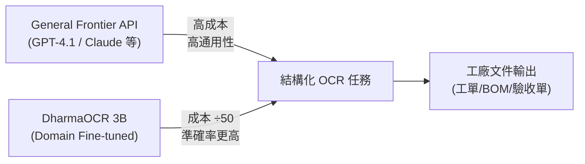

*上圖關鍵洞察：訓練分佈與部署任務對齊後，小模型的 cost-performance 曲線可以完全反轉大模型優勢。*

- 來源：[Hugging Face Blog](https://huggingface.co/blog/Dharma-AI/specialization-beats-scale)
- 對客戶的具體含意：向 Foxconn 或 Wistron 提案時，先問「你們 OCR 的文件類型有多集中？」——若答案是「80% 是同一類表單」，specialized fine-tuning 的 ROI 論述即可成立，成本降幅足以支撐 PoC 預算。

**(English)** DharmaOCR: 3B specialized model beats all commercial frontier APIs on structured OCR at 50× lower cost

📖 **原文** Dharma AI released DharmaOCR, a pair of small language models (3B parameters) fine-tuned specifically for structured OCR, which outperformed every commercial frontier API tested on their benchmark — at approximately one-fiftieth the inference cost.

🧠 **推論** This is a concrete counterexample to the scaling-law default assumption: when training distribution is close enough to the deployment task, parameter count stops being the decisive variable. For Livia's Taiwan manufacturing clients (Foxconn, Wistron, Pegatron), factory documents — work orders, acceptance forms, BOMs — are the prototype of this kind of high-repetition structured OCR task, making domain-specific fine-tuning a stronger argument than paying for GPT-4.1 API calls.

⚠️ **假設** This benchmark was designed by Dharma AI themselves; independent third-party replication is not yet available, and this should be disclosed in client conversations.

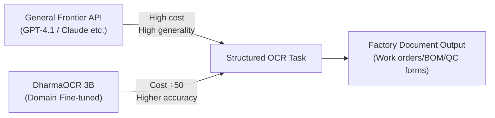

*Key insight: once training distribution aligns with deployment task, a small model's cost-performance curve can completely invert the large-model advantage.*

- Source: [Hugging Face Blog](https://huggingface.co/blog/Dharma-AI/specialization-beats-scale)
- Client implication: When pitching to Foxconn or Wistron, open with "How concentrated are your document types?" — if 80% are the same form template, the ROI case for specialized fine-tuning writes itself, and the cost delta is large enough to justify a PoC budget.

---

### 2. ITBench-AA：IBM + Artificial Analysis 發現 frontier 模型在真實企業 IT Agentic 任務得分低於 50%

📖 **原文** IBM Software Innovation Lab 與 Artificial Analysis 聯合發布 ITBench-AA，針對企業 IT agentic 任務的第一個正式 benchmark，首批聚焦 Kubernetes incident response（SRE 場景）。

🧠 **推論** Frontier 模型得分低於 50% 的核心問題不是「AI 不聰明」，而是 agentic 任務需要多步驟工具呼叫、狀態追蹤、與真實系統互動——這些能力在對話型 benchmark 中根本測不到。對 Cathay、E.SUN、CTBC 等正在評估「AI 自動化 IT 維運」的銀行客戶，這是一個重要的期望管理數據點。

🧠 **推論** IBM 作為 ITBench-AA 的共同發布者，有動機將此 benchmark 納入自家 Watson X / watsonx Orchestrate 的後續評測——Livia 作為 IBM 顧問可主動將此 benchmark 帶入 RFP 流程，要求廠商在此上展示成績。

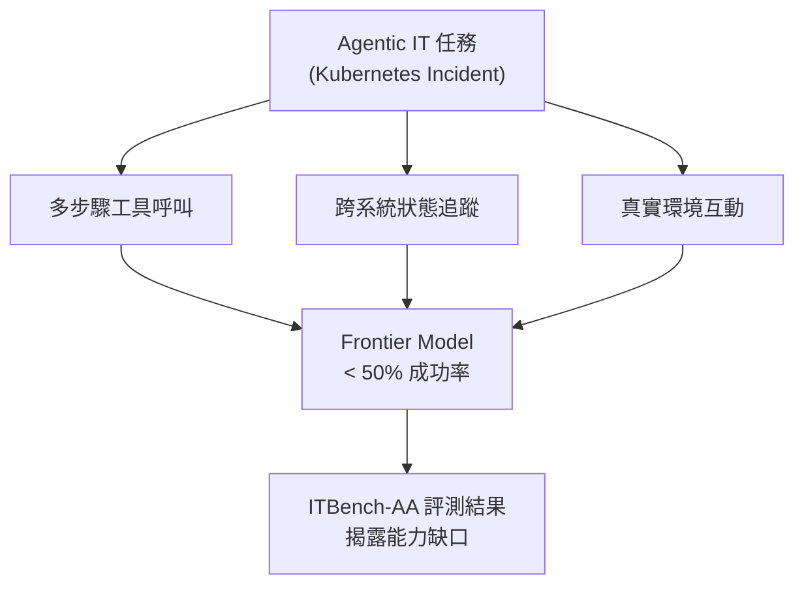

*上圖關鍵洞察：Agentic 失敗不是單點問題，而是多步驟協調能力的系統性缺口——這正是 benchmark 設計需要捕捉的。*

- 來源：[Hugging Face Blog](https://huggingface.co/blog/ibm-research/itbench-aa)
- 對客戶的具體含意：對正在評估 agentic IT 自動化的台灣銀行（如 Cathay IT 部門），建議把 ITBench-AA 的 SRE 得分列為廠商 RFP 評分標準之一，避免用對話型 demo 錯估實際自動化能力。

**(English)** ITBench-AA: IBM + Artificial Analysis find frontier models score below 50% on real enterprise agentic IT tasks

📖 **原文** IBM Software Innovation Lab and Artificial Analysis jointly launched ITBench-AA, the first formal benchmark for agentic enterprise IT tasks, starting with Kubernetes incident response as the SRE scenario.

🧠 **推論** Frontier models scoring below 50% is not primarily a "models aren't smart enough" problem — it reflects that agentic tasks require multi-step tool calls, state tracking, and real-system interaction, capabilities that conversational benchmarks simply don't measure. For Cathay, E.SUN, and CTBC teams evaluating "AI-automated IT operations," this is a critical expectation-management data point to have on hand.

🧠 **推論** Given IBM's co-authorship of ITBench-AA, there is clear incentive to incorporate this benchmark into subsequent watsonx Orchestrate evaluations — Livia as an IBM consultant can proactively surface this benchmark in RFP processes and require vendors to demonstrate scores on it.

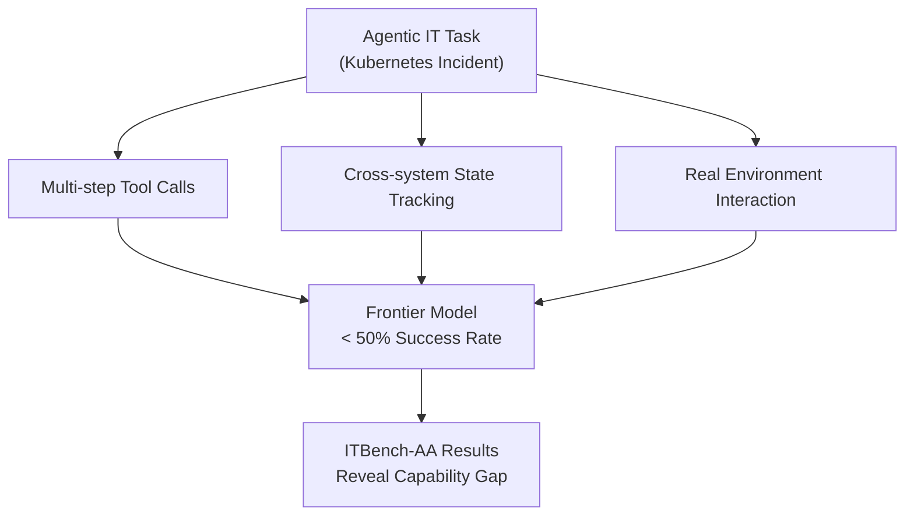

*Key insight: agentic failure is not a single-point problem — it's a systemic gap in multi-step coordination, which is exactly what this benchmark is designed to surface.*

- Source: [Hugging Face Blog](https://huggingface.co/blog/ibm-research/itbench-aa)
- Client implication: For Taiwan banks (e.g., Cathay IT teams) evaluating agentic IT automation, recommend adding ITBench-AA SRE scores as a vendor RFP criterion — this prevents a polished conversational demo from being mistaken for real automation capability.

---

### 3. OpenAI GPT-next 以不到 1000 美元解決 80 年未解的 Erdős 平面單位距離問題

🧠 **推論** 根據 Latent Space 的報導，OpenAI GPT-next（目前代號）在數學推理上達到了新的 frontier 邊界：解決了 Erdős 平面單位距離問題，一個困擾數學界逾八十年的組合幾何問題，且推論成本低於 1000 美元。

🧠 **推論** 這個數字的意義不在「AI 取代數學家」，而在於**成本閾值**：如果一個 80 年難題的解答成本低於一個顧問日費，它重新定義了哪些「複雜推理任務」在商業上值得交給 AI。對 TSMC、MediaTek 等研發密集型客戶，EDA 問題、良率分析的組合優化問題，在能力曲線上已進入可認真評估的範圍。

⚠️ **假設** Latent Space 的報導摘要簡短，數學解答的正確性與 peer review 狀態尚不清楚——在客戶對話中宜謹慎引用，等待論文發表。

- 來源：[Latent Space / swyx](https://www.latent.space/p/ainews-openai-gpt-next-disproves)
- 對客戶的具體含意：對 TSMC 或 MediaTek 的研發主管，可用此案例開啟「你們最貴的工程師花在哪種組合搜尋問題上？」的對話，把 frontier 模型定位為高難度推理的加速工具而非生產力小助理。

**(English)** OpenAI GPT-next solves 80-year-old Erdős planar unit distance problem for under $1,000

🧠 **推論** Per Latent Space's report, OpenAI GPT-next (current codename) has reached a new frontier capability boundary in mathematical reasoning: solving the Erdős planar unit distance problem, a combinatorial geometry problem open for over eighty years, at an inference cost below $1,000.

🧠 **推論** The significance here is not "AI replaces mathematicians" — it is the **cost threshold**: if an 80-year-old hard problem costs less than a single consultant day-rate to solve, this redefines which "complex reasoning tasks" are commercially viable to delegate to AI. For R&D-intensive clients like TSMC and MediaTek, combinatorial optimization problems in EDA and yield analysis now sit within a range worth seriously evaluating.

⚠️ **假設** The Latent Space summary is brief; the mathematical correctness and peer-review status of the solution are not yet confirmed — cite cautiously in client conversations until a paper is published.

- Source: [Latent Space / swyx](https://www.latent.space/p/ainews-openai-gpt-next-disproves)
- Client implication: With R&D leaders at TSMC or MediaTek, use this to open the conversation: "Which combinatorial search problems are your most expensive engineers currently grinding through?" — positioning frontier models as accelerators for hard reasoning, not productivity assistants.

---

## Watch list

繁中為主，每條一行：

- [Hugging Face Blog — Delta Weight Sync in TRL](https://huggingface.co/blog/delta-weight-sync) — RL 訓練中 99% 權重不變，只傳 delta 可將每步模型同步從 14GB 降至極小量，對 harness pipeline 的 fine-tuning 基礎設施設計有參考價值
- [NVIDIA Blog — AI Factories](https://blogs.nvidia.com/blog/ai-factories-the-new-infrastructure-of-intelligence/) — NVIDIA 的 "token factory" 框架：performance per watt 與 cost per token 是 agentic AI 的核心經濟學，適合 Livia 向製造業客戶說明 AI infra 投資邏輯
- [Microsoft Research — MagenticLite / MagenticBrain / Fara1.5](https://www.microsoft.com/en-us/research/blog/magenticlite-magenticbrain-fara1-5-an-agentic-experience-optimized-for-small-models/) — 微軟小模型 agentic 架構新發布，browser + local file system 跨工作流，無部署指標但架構值得一看
- [Hugging Face Blog — Nemotron-Labs Diffusion LMs](https://huggingface.co/blog/nvidia/nemotron-labs-diffusion) — NVIDIA 平行解碼（非 autoregressive）文字生成，宣稱速度大幅提升；延遲敏感系統（如銀行客服）值得追蹤但產品成熟度待確認
- [Simon Willison — Datasette Agent](https://simonwillison.net/2026/May/21/datasette-agent/#atom-everything) — LLM + Datasette 整合的對話式資料查詢工具，對 harness 工程師展示「輕量 agent + 現有資料層」的組合模式有直接參考
- [OpenAI — Warp + GPT-5.5](https://openai.com/index/warp) — GPT-5.5 多 agent 協作 coding 案例；內容偏 vendor showcase，但 GPT-5.5 在 multi-agent coding 協調上的實際能力邊界值得追蹤
- [Dwarkesh Podcast — Reiner Pope on chip design](https://www.dwarkesh.com/p/reiner-pope-2) — 從邏輯閘到 GPU/TPU/FPGA 的底層架構解析，理解 AI 能力與硬體耦合的長閱讀，適合 Livia 與 TSMC/MediaTek 客戶的深度技術對話準備

---

## Verification hints

This briefing contains **4

🧠 **推論** segments** and **2

⚠️ **假設** segments**. Before citing in client conversations, verify these specific points (English for language-learning practice):

1. **DharmaOCR benchmark independence (Item 1 —

⚠️ **假設**)**: The 50× cost and accuracy-superiority claims come from Dharma AI's own benchmark. Verify whether any third party has replicated results on a held-out dataset before citing the figure as fact. Check the [paper linked from the Hugging Face post](https://huggingface.co/blog/Dharma-AI/specialization-beats-scale) for methodology and test set construction.

2. **GPT-next math solution validity (Item 3 —

⚠️ **假設**)**: The Latent Space report is brief and does not link to a peer-reviewed paper. Verify: (a) has the Erdős planar unit distance solution been formally written up and submitted? (b) has the mathematical community confirmed correctness? The [Latent Space post](https://www.latent.space/p/ainews-openai-gpt-next-disproves) should be checked for any linked preprint before citing in client material.

3. **ITBench-AA scoring methodology (Item 2 —

🧠 **推論**)**: The "below 50%" headline is from the excerpt; verify which specific frontier models were tested, what the exact score range was, and whether the Kubernetes incident response tasks are representative of Taiwan bank IT environments specifically. Full benchmark details at [Hugging Face / IBM Research](https://huggingface.co/blog/ibm-research/itbench-aa).2026-05-29 00:06:50,258 INFO pillar 4 (Harness Engineering 實作技藝): 40 high-signal items (min_signal=0.60)

---

<a id="pillar-4"></a>

## 🛠️ Pillar 4 — Harness Engineering 實作技藝
_40 items · $0.1033_

## Pulse — Top 3

### 1. Microsoft Copilot Cowork：agent 透過渲染圖片外洩檔案——prompt injection 打穿 email 管線

📖 **原文** Microsoft Copilot Cowork 允許 agent 在無需用戶核准的情況下向用戶信箱寄送 email，而這些 email 內含外部圖片，攻擊者可藉由圖片請求的網路觸發（network request）將資料外洩給第三方伺服器。Simon Willison 點名這是 agentic system 設計中最持久的挑戰：一旦 agent 同時擁有讀取私有資料與發起 outbound 網路請求的能力，任何未受管制的 render 路徑都是潛在洩漏向量。

🧠 **推論** 對於正在評估 Microsoft 365 Copilot 或類似企業 agent 的台灣銀行，這個案例印證「email send + image render」組合必須列為 threat model 的必審項目，而非事後修補。對 harness 實作而言，agent 的 outbound 網路請求應預設封鎖、僅白名單放行，並與 email compose 能力嚴格分層。

以下流程說明此攻擊鏈如何從 prompt injection 串到資料外洩：

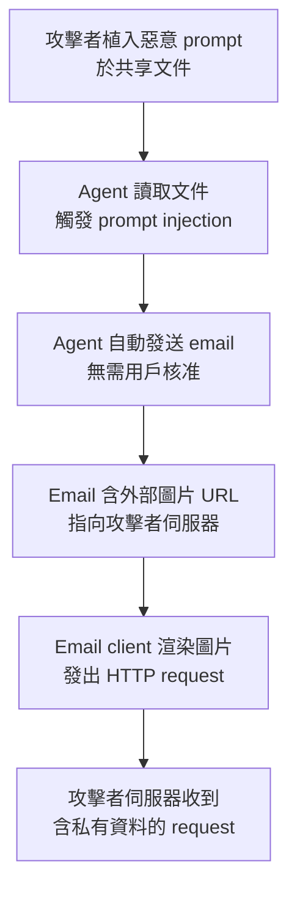

*關鍵洞察：read + write + render 三項能力同時開放，任一 render 路徑即成洩漏出口。*

- 來源：[Simon Willison](https://simonwillison.net/2026/May/26/copilot-cowork-exfiltrates-files/#atom-everything)
- 對客戶的具體含意：向 Cathay、E.SUN 等正評估 Microsoft 365 Copilot 的銀行說明：在 agent 具備 email 寄送能力的任何部署中，outbound image render 必須停用或沙箱隔離，並將此項納入 AI 導入的資安驗收清單。

---

**(English)** Microsoft Copilot Cowork: agent exfiltrates files via rendered images — prompt injection breaks email pipeline

[Original] Microsoft Copilot Cowork allowed agents to send emails to users' own inboxes without approval; those emails could contain external images whose network requests exfiltrated data to an attacker's server. Simon Willison identifies this as the most persistent design challenge in agentic systems: once an agent simultaneously holds read access to private data and the ability to initiate outbound network requests, any uncontrolled render path becomes a potential exfiltration vector. [Inference] For Taiwan banks evaluating Microsoft 365 Copilot or equivalent enterprise agents, this case confirms that the "email send + image render" combination must be a required entry in the threat model — not a post-incident patch. For harness engineering, agent outbound network requests should default to blocked with allowlist-only egress, strictly layered away from email-compose capability.

The diagram above illustrates how the attack chain runs from prompt injection to data exfiltration.

*Key insight: read + write + render open simultaneously — any render path becomes an exfiltration outlet.*

- Source: [Simon Willison](https://simonwillison.net/2026/May/26/copilot-cowork-exfiltrates-files/#atom-everything)
- Client implication: When briefing Cathay, E.SUN, or any bank evaluating Microsoft 365 Copilot, flag that any deployment where agents can compose and send email must disable or sandbox outbound image rendering, and add this as a hard gate in the AI procurement security checklist.

---

### 2. Anthropic 推出 self-hosted agent sandbox + MCP tunnel：企業自建邊界正式成為 production pattern

📖 **原文** Anthropic 於 5/27 公布 Claude Managed Agents 新功能：self-hosted sandbox 允許 agent 執行在企業自選雲端平台，MCP tunnel 則讓 agent 連結私有 MCP 伺服器，兩者都受企業建立的安全邊界與 runtime 控制。

🧠 **推論** 這標誌著一個治理架構的轉折點：Anthropic 不再只是提供模型 API，而是提供一套完整的「agent 執行在你的環境、連你的資料、受你的政策管制」的參考架構。對台灣銀行而言，主管機關一貫要求資料不出境、操作留存審計軌跡，self-hosted sandbox + MCP tunnel 的組合正好對應這兩個合規需求。

⚠️ **假設** iThome 報導未提及具體定價或 SLA，建議在客戶簡報前先向 Anthropic 確認 enterprise tier 的可用性與台灣 region 支援狀況。

以下為 self-hosted agent 的架構邊界示意：

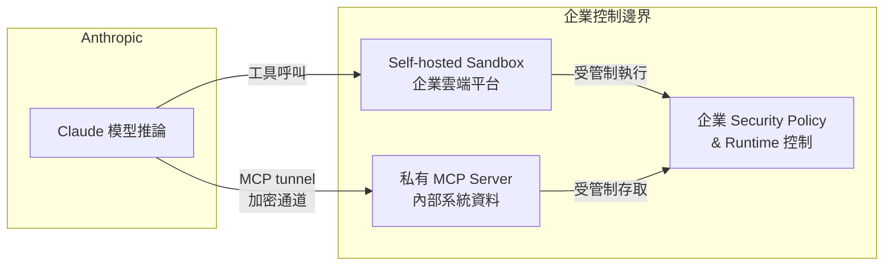

*關鍵洞察：模型推論在 Anthropic 側，工具執行與資料存取全在企業邊界內——這是「AI 智慧在雲端、資料主權在本地」的具體實現。*

- 來源：[iThome](https://www.ithome.com.tw/news/176184) | [iThome（安全設計細節）](https://www.ithome.com.tw/news/176172)
- 對客戶的具體含意：在向 Cathay、CTBC、Mega 等銀行提案時，以此架構回應「資料不出境」的合規疑慮：agent 的工具執行與 MCP 資料存取可完整留在企業自建環境，同時仍能使用 frontier 模型能力。

---

**(English)** Anthropic launches self-hosted agent sandbox + MCP tunnel: enterprise-controlled boundaries become a production pattern

[Original] On May 27, Anthropic announced new Claude Managed Agents capabilities: a self-hosted sandbox lets agents run on the enterprise's chosen cloud platform, and an MCP tunnel connects agents to private MCP servers — both governed by enterprise-defined security policies and runtime controls. [Inference] This marks a governance inflection point: Anthropic is no longer just an API provider but is shipping a reference architecture for "agent runs in your environment, touches your data, governed by your policies." For Taiwan banks — where regulators consistently require data residency and auditable operation logs — the self-hosted sandbox plus MCP tunnel combination maps directly onto both compliance requirements. [Assumption] The iThome report does not mention specific pricing or SLA terms; verify enterprise tier availability and Taiwan region support with Anthropic before including in client proposals.

The diagram above illustrates the architecture boundary separating model inference (Anthropic side) from tool execution and data access (enterprise side).

*Key insight: model inference stays at Anthropic; tool execution and data access remain entirely within the enterprise boundary — a concrete implementation of "AI intelligence in the cloud, data sovereignty on-premises."*

- Source: [iThome](https://www.ithome.com.tw/news/176184) | [iThome (security design details)](https://www.ithome.com.tw/news/176172)
- Client implication: When pitching Cathay, CTBC, or Mega, use this architecture to answer data-residency compliance concerns directly: agent tool execution and MCP data access can remain entirely within the enterprise's own environment while still leveraging frontier model capability.

---

### 3. LangSmith Engine：agent 失敗自動分群 + 修復建議，生產維運進入 autonomous improvement loop

📖 **原文** LangSmith Engine 監看 production traces，將失敗自動聚類為具名 issue，並提出針對性修復建議與 eval coverage 補充——目標是終止人工 triage agent 失敗的作業模式。技術架構文章進一步說明：Engine 本身是一個 agent，以大批量 trace 分析為輸入，輸出結構化問題報告與建議動作。

🧠 **推論** 對於 Livia 正在建構的 intelligence pipeline harness，這個模式（agent 監看 agent、trace 聚類、自動提案 eval）代表「build → test → deploy → monitor」循環的最後一哩路開始有工具支撐，不再全靠人工 review。Lyft 使用 LangGraph + LangSmith 將 agent 開發週期從數月壓縮到數週，是目前最具說服力的同類生產案例。

⚠️ **假設** Engine 的聚類品質與提案準確度尚無獨立第三方評測，建議在 harness 實作中以小批量 trace 先行驗證，再擴大授權範圍。

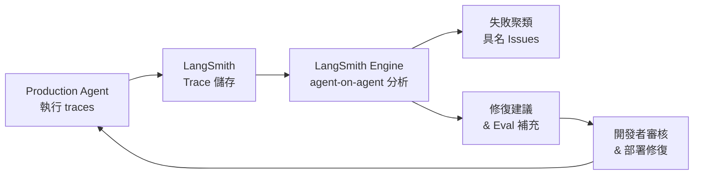

*關鍵洞察：human-in-the-loop 從「每筆 trace 人工看」縮減為「審核 Engine 提案」，維運人力成本結構性下降。*

- 來源：[LangSmith Engine 公告](https://www.langchain.com/blog/introducing-langsmith-engine) | [技術架構細節](https://www.langchain.com/blog/how-we-built-langsmith-engine-our-agent-for-improving-agents) | [Lyft 生產案例](https://www.langchain.com/blog/lyft-built-a-self-serve-ai-agent-platform-for-customer-support-with-langgraph-and-langsmith)
- 對客戶的具體含意：向台灣銀行的 IT/AI 團隊展示時，用 Lyft「數月縮短至數週」的數字錨定 ROI，再以 LangSmith Engine 說明上線後的持續維運成本如何被自動化吸收——這是讓「AI agent 導入」從 PoC 走到 production SLA 的關鍵差距填補。

---

**(English)** LangSmith Engine: auto-cluster agent failures and propose fixes — production ops enters autonomous improvement loop

[Original] LangSmith Engine watches production traces, clusters failures into named issues, and proposes targeted fixes and eval coverage additions — with the stated goal of eliminating manual agent failure triage. A companion technical architecture post explains that Engine is itself an agent, taking large-volume trace batches as input and producing structured issue reports and recommended actions. [Inference] For the intelligence pipeline harness Livia is building, this pattern — agent watching agent, trace clustering, automated eval proposals — represents the first tooling support for closing the "build → test → deploy → monitor" loop without full manual review. Lyft's deployment of LangGraph + LangSmith, cutting agent development from months to weeks, is currently the most credible production case study of this class. [Assumption] Engine's clustering quality and proposal accuracy have no independent third-party evaluation yet; recommended approach is to validate on a small trace batch before expanding automated authority.

The diagram above shows the autonomous improvement loop from production traces through Engine analysis back to developer review and redeployment.

*Key insight: human-in-the-loop shrinks from "manually review every trace" to "review Engine proposals" — a structural reduction in ops labor cost.*

- Source: [LangSmith Engine announcement](https://www.langchain.com/blog/introducing-langsmith-engine) | [Technical architecture](https://www.langchain.com/blog/how-we-built-langsmith-engine-our-agent-for-improving-agents) | [Lyft production case](https://www.langchain.com/blog/lyft-built-a-self-serve-ai-agent-platform-for-customer-support-with-langgraph-and-langsmith)
- Client implication: When presenting to Taiwan bank IT/AI teams, anchor ROI with Lyft's "months to weeks" figure, then use LangSmith Engine to show how post-launch maintenance costs get absorbed by automation — this is the critical gap-filler between "AI agent PoC" and "production SLA."

---

## Watch list

繁中為主，每條一行：

- [LangSmith Sandboxes GA](https://www.langchain.com/blog/langsmith-sandboxes-generally-available) — kernel 隔離 microVM + snapshot，coding agent 與 CI agent 的生產安全執行環境正式 GA，harness 實作直接可用
- [Auth Proxy for LangSmith Sandboxes](https://www.langchain.com/blog/how-auth-proxy-secures-network-access-for-langsmith-agent-sandboxes) — 憑證隔離 + egress 管制的具體實作，對應銀行 agent 的 credential 洩漏風險
- [The Anatomy of an Agent Harness](https://www.langchain.com/blog/the-anatomy-of-an-agent-harness) — LangChain 命名 "agent harness" 模式並定義核心元件，與 Livia harness portfolio 的術語對齊值得閱讀
- [From Token Streams to Agent Streams](https://www.langchain.com/blog/token-streams-to-agent-streams) — typed events + scoped subscriptions 的 streaming 架構，frontend 可見性從 token 層提升到 agent 層
- [Deep Agents Interpreters](https://www.langchain.com/blog/give-your-agents-an-interpreter) — 內嵌 interpreter 讓 agent 用程式碼協調工具與管理 working state，減少 context window 濫用
- [Agent Development Lifecycle](https://www.langchain.com/blog/the-agent-development-lifecycle) — LangChain 整理 Build/Test/Deploy/Monitor 四階段框架，作為客戶簡報的結構骨架
- [ITBench-AA: Frontier Models Below 50% on Enterprise IT Tasks](https://huggingface.co/blog/ibm-research/itbench-aa) — IBM + Artificial Analysis 聯合 benchmark，frontier model 在 Kubernetes SRE 任務得分低於 50%，為 agent 能力邊界提供具體數字
- [Cognition Async Agents (Latent Space)](https://www.latent.space/p/cognition) — Devin 80% commit rate、spec-to-PR workflow、VM-level autonomy，async agent 的現況基準
- [Google GKE Agent Sandbox GA + Agent Substrate](https://www.ithome.com.tw/news/176182) — Google Cloud 的 agent sandbox 正式上線並開源 Agent Substrate，與 LangSmith Sandbox 形成選擇參照
- [中華電信 ChainStrike AI 驗證閘門](https://www.ithome.com.tw/news/176193) — 台灣本地企業以 AI 閘門解決開發速度與資安檢測的落差，可作為銀行客戶的在地參照案例
- [Dcard Agent-Native 工作流程，流程時間縮短逾八成](https://www.inside.com.tw/article/41409-dcard-gntc-agent-native-enterprise-ai-workflow) — 台灣本地 80% 時間縮減的 agent-native 案例，正準備向其他企業銷售
- [Robinhood Agentic Trading + Agentic Credit Card](https://www.ithome.com.tw/news/176186) — 允許外部 AI agent（Claude Code、ChatGPT）直接操作金融帳戶，agent-human boundary 的最激進案例，銀行風控對話素材
- [Specialization Beats Scale: 3B OCR model 勝過所有 frontier API](https://huggingface.co/blog/Dharma-AI/specialization-beats-scale) — 成本低 50 倍、精度更高，製造業文件處理的 model selection 論點
- [Delta Weight Sync in TRL](https://huggingface.co/blog/delta-weight-sync) — RL 訓練中 99% weights 不變，只同步 delta 可大幅降低模型更新頻寬，frontier model 訓練基礎設施優化
- [MCP + Kubernetes for Agent Orchestration (Practical AI)](https://share.transistor.fm/s/d76e02d5) — ToolHive + identity management 的 agent fleet 管理，MCP 作為 enterprise orchestration 標準的可信度持續上升
- [SQLite AGENTS.md](https://simonwillison.net/2026/May/27/sqlite-agents/#atom-everything) — 開源專案以 AGENTS.md 設置 LLM contribution 守則，agent governance 的 repo 層級 pattern 正在形成
- [Virgin Atlantic Codex 部署：近全覆蓋 unit test + 零 P1 缺陷](https://openai.com/index/virgin-atlantic) — 固定 deadline 下以 LLM 輔助測試達成生產品質，製造業/銀行 CI 場景的參照數字

---

## Verification hints

This briefing contains **4**

🧠 **推論** segments and **2**

⚠️ **假設** segments. Before citing in client conversations, verify these specific points (English for language-learning practice):

1. **Copilot Cowork attack vector specifics**: Simon Willison's post describes the image-render exfiltration mechanism, but verify whether Microsoft has issued a patch or CVE number since publication (2026-05-26) — the exploit status may have changed. Check [the original post](https://simonwillison.net/2026/May/26/copilot-cowork-exfiltrates-files/#atom-everything) for any follow-up links.
2. **Anthropic self-hosted sandbox Taiwan region availability**: The iThome report confirms the feature announcement but does not specify which cloud regions are supported or whether enterprise tier pricing is available in Taiwan. Verify directly with Anthropic before including in bank proposals — a feature announced globally may have a waiting list or require negotiated contracts.
3. **LangSmith Engine clustering quality**: The claim that Engine "proposes targeted fixes" is drawn from LangChain's own blog posts (vendor-authored). No independent benchmark or third-party evaluation of Engine's proposal accuracy exists as of this writing. Treat the "stop manually triaging" claim as aspirational until you run it against your own trace data.
4. **Lyft "months to weeks" figure**: This metric appears in LangChain's blog post about Lyft — it is a customer case study written by the vendor. Verify whether Lyft has published a first-party account (engineering blog, conference talk) corroborating the timeline improvement before citing it as a benchmark in bank presentations.
5. **ITBench-AA "below 50%" scope**: The frontier model sub-50% score applies specifically to Kubernetes SRE incident response tasks — not to enterprise IT tasks broadly. Verify the exact task distribution in the benchmark before generalizing to "AI agents can't do enterprise IT work," as this would be an overstatement of the finding.
6. **Dcard "80% time reduction" claim**: Published in INSIDE 硬塞 reporting on Dcard's own GNTC presentation — single-source, self-reported. Verify which specific workflows were measured and whether the baseline was a manual process or a previous automation before citing as a comparable ROI number to Taiwan bank clients.2026-05-29 00:08:41,775 INFO pillar 5 (學派 / 社群 / 思想動態): 14 high-signal items (min_signal=0.60)

---

<a id="pillar-5"></a>

## 🌐 Pillar 5 — 學派 / 社群 / 思想動態
_14 items · $0.0670_

## Pulse — Top 3

### 1. Cognition + Railway + Daytona：三個獨立資料點共同指向「Async Agent 生產化」進入現實

🧠 **推論** Cognition 的 Walden Yan 回報 80% 的 Devin commits 已達可用水準，搭配 spec-to-PR workflow 與 full VM 隔離；Railway 同期揭露 3M 用戶、每週 10 萬新增、coding agent 消費超過 $200K；Daytona 則以 74% MoM 成長、每日 850K 次 bare-metal sandbox 執行作為基礎設施佐證。三條數據線不來自同一公司，卻指向同一個結論：async agent 已不是 demo，而是 production workload。對 Livia 的 harness 工程意涵在於：agent 的執行環境（sandbox isolation、VM lifecycle）現在是架構決策，不是事後補丁。

以下流程圖描繪一個現代 async agent 生產架構的核心組件關係：

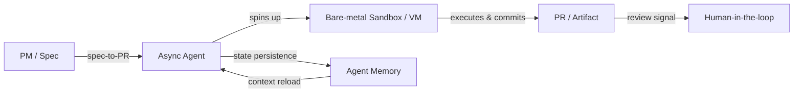

*關鍵洞見：Agent Memory 與 Sandbox 隔離是兩個相互獨立但缺一不可的生產要件；移除任一個，可靠性即崩潰。*

- 來源：[Latent Space — Cognition](https://www.latent.space/p/cognition)、[Latent Space — Railway](https://www.latent.space/p/railway)、[Latent Space — Daytona](https://www.latent.space/p/daytona)
- 對客戶的具體含意：向台灣銀行（如國泰、玉山）提案 AI coding agent 試點時，第一個要鎖定的不是模型選型，而是沙箱隔離與 agent memory 的基礎設施規格——這兩者決定合規可稽核性。

**(English)** Cognition + Railway + Daytona: Three independent data points converge on async agents entering production reality

🧠 **推論** Cognition's Walden Yan reports 80% of Devin commits are production-usable, with spec-to-PR workflows running inside full VM isolation; Railway concurrently disclosed 3M users, 100K signups/week, and $200K+ in coding agent spend; Daytona provides infrastructure-layer corroboration with 74% MoM growth and 850K daily bare-metal sandbox executions. These three data lines come from different companies but point to the same conclusion: async agents are no longer demo artifacts — they are production workloads. For Livia's harness engineering, the implication is that the agent execution environment (sandbox isolation, VM lifecycle management) is now a first-class architectural decision, not an afterthought.


*Key insight: Agent Memory and Sandbox isolation are independent but mutually necessary for production reliability — remove either and the system degrades.*

- Source: [Latent Space — Cognition](https://www.latent.space/p/cognition), [Latent Space — Railway](https://www.latent.space/p/railway), [Latent Space — Daytona](https://www.latent.space/p/daytona)
- Client implication: When pitching AI coding agent pilots to Taiwan banks (Cathay, E.SUN), anchor the conversation on sandbox isolation and agent memory infrastructure specs first — these are what determine audit traceability and compliance posture, not model selection.

---

### 2. Simon Willison 引用 Armin Ronacher：LLM 生成的 issue report 正在污染工程信號

📖 **原文** Ronacher 直接描述這個 failure mode：「人們提交的 issue 不是出自自己的聲音。裡面有觀察到的問題，但被丟進一台攪拌機，攪拌機重新措辭，搞得一團糟。root cause 是猜測，minimal repro 是假的，implementation strategy 是建議，卻充滿信心。」這不是理論風險，而是開源社群正在實際遭遇的 signal degradation。

🧠 **推論** 對 Livia 的 harness 設計含意具體且立即：任何讓 LLM 代替使用者撰寫 issue、bug report 或需求文件的 pipeline，都需要一個「原聲保留」機制——至少在輸出前要求人工確認觀察事實與 root cause 是否分離。對銀行客戶而言，這個問題在 IT 工單系統的 AI 輔助填寫場景中完全可複製。

- 來源：[Simon Willison — Quoting Armin Ronacher](https://simonwillison.net/2026/May/24/armin-ronacher/#atom-everything)
- 對客戶的具體含意：若銀行 IT 部門導入 AI 輔助工單填寫，需在 workflow 設計中明確分離「使用者原始觀察」與「AI 推論摘要」兩個欄位，否則 root cause 分析品質將系統性下滑。

**(English)** Simon Willison quotes Armin Ronacher: LLM-generated issue reports are degrading engineering signal

📖 **原文** Ronacher describes the failure mode directly: "People submit issues that are not in their own voice. They contain an observed problem somewhere, but it has been thrown into a clanker and the clanker reworded it and made a huge mess of it. Root causes are guesswork, minimal repros are fake, implementation strategies are suggested — all delivered with full confidence." This is not a theoretical risk; it is active signal degradation happening in open-source communities right now.

🧠 **推論** The harness design implication for Livia is immediate and concrete: any pipeline that allows an LLM to ghost-write issue reports, bug tickets, or requirements documents on behalf of users needs an "original voice preservation" mechanism — at minimum, requiring human confirmation that observed facts and root-cause inferences are kept separate before submission. For bank clients, this failure mode maps directly onto AI-assisted IT ticket systems.

- Source: [Simon Willison — Quoting Armin Ronacher](https://simonwillison.net/2026/May/24/armin-ronacher/#atom-everything)
- Client implication: If a bank's IT department deploys AI-assisted ticket filing, the workflow must structurally separate "user's raw observation" from "AI-inferred summary" as distinct fields — otherwise root-cause analysis quality will degrade systematically and silently.

---

### 3. Simon Willison：Anthropic 與 OpenAI 已找到 Product-Market Fit，企業帳單意外攀升是信號

📖 **原文** Willison 寫道：「Anthropic 盛傳即將迎來首個獲利季。各公司正流傳著對員工 LLM 費用之高感到意外的故事。我認為這是因為 OpenAI 與 Anthropic 都找到了 product-market fit。」

🧠 **推論** 「帳單意外攀升」這個細節比「獲利季」更重要：它意味著 adoption 是 bottom-up、非計畫性的——員工自己開始用，IT 與財務後來才發現。這個模式在台灣銀行客戶中很可能已在發生，只是尚未被 CIO 層級追蹤。

⚠️ **假設** Willison 未提供具體的企業名稱或帳單金額，「盛傳獲利季」屬未經證實的市場傳言，需在客戶對話中謹慎引用。對 Livia 的 IBM 銷售意涵：unexpected LLM spend 是進入銀行 AI governance 對話的切入點——不是從「你們應該用 AI」開始，而是從「你們的 LLM 費用已經在發生，是否有人在管理它」開始。

- 來源：[Simon Willison — I think Anthropic and OpenAI have found product-market fit](https://simonwillison.net/2026/May/27/product-market-fit/#atom-everything)
- 對客戶的具體含意：向國泰、富邦等銀行提案 AI governance framework 時，以「員工自發性 LLM 使用造成的非預算支出」作為開場，比抽象談 AI 轉型更能引發 CIO 層級的立即關注。

**(English)** Simon Willison: Anthropic and OpenAI have found product-market fit — unexpectedly large enterprise bills are the signal

📖 **原文** Willison writes: "Anthropic are strongly rumored to be about to have their first profitable quarter. Stories are circulating of companies surprised at how expensive their LLM bills are becoming from usage by their staff. I think this is because OpenAI and Anthropic have both found product-market fit."

🧠 **推論** The "surprisingly large bills" detail is more important than the "profitable quarter" headline: it signals bottom-up, unplanned adoption — employees started using these tools independently, and IT and finance discovered the costs afterward. This pattern is very likely already occurring inside Taiwan bank clients, simply not yet tracked at the CIO level.

⚠️ **假設** Willison does not name specific enterprises or provide bill amounts, and the "rumored profitable quarter" claim is unverified market gossip — cite carefully in client conversations. For Livia's IBM sales motion, the implication is concrete: unexpected LLM spend is a more effective entry point for AI governance conversations than abstract transformation pitches.

- Source: [Simon Willison — I think Anthropic and OpenAI have found product-market fit](https://simonwillison.net/2026/May/27/product-market-fit/#atom-everything)
- Client implication: When opening AI governance framework conversations with Cathay or Taipei Fubon, lead with "your staff are already generating unbudgeted LLM spend — who is managing it?" rather than an abstract AI transformation pitch; it lands at the CIO level immediately.

---

## Watch list

繁中為主，每條一行：

- [Latent Space — All Model Labs are now Agent Labs](https://www.latent.space/p/ainews-all-model-labs-are-now-agent) — swyx 整理各大模型廠商全面轉向 agent 架構的社群共識時刻，適合用來向客戶解釋為何 2026 年的 AI 對話重心已從「模型」移到「agent」
- [Latent Space — AINews: OpenAI GPT-next solves Erdős problem for under $1000](https://www.latent.space/p/ainews-openai-gpt-next-disproves) — LLM 以不到 $1000 成本解決 80 年未解的數學問題，frontier capability 邊界再次移動，值得追蹤後續論文
- [Interconnects — Some ideas for what comes next, May 2026](https://www.interconnects.ai/p/some-ideas-for-what-comes-next-may) — Nathan Lambert 對 open/closed 模型策略張力與美國開源政策走向的月度綜合，對 IBM 開源定位有參考價值
- [Practical AI — Hermes Agent: Agents that grow with you](https://share.transistor.fm/s/451da102) — Nous Research 的 self-improving agent 架構討論，「models vs. harnesses」框架對 Livia 的 pipeline 設計思路直接相關
- [Import AI 458 — Reckoning with the future](https://jack-clark.net/2026/05/26/import-ai-458-reckoning-with-the-future-and-a-singularity-story/) — Jack Clark（Anthropic 政策）的治理框架演講，以散文形式呈現，適合了解 Anthropic 對 AI governance 的長期敘事立場
- [AI Snake Oil — Do AI Risks Require Extraordinary Government Intervention?](https://www.normaltech.ai/p/do-ai-risks-require-extraordinary) — Narayanan/Kapoor 的 AI 治理負擔框架，可作為銀行監管對話的反向論點參考
- [Platformer — Claude Code's creator on the end of the software engineer](https://www.platformer.news/boris-cherny-interview-ai-jobs/) — Anthropic Boris Cherny 談 AI 對軟體工程師職位的影響，製造業客戶（Foxconn、緯創）轉型對話的背景素材
- [Latent Space — New AI Infra decacorns: Fireworks, Baseten](https://www.latent.space/p/ainews-new-ai-infra-decacorns-fireworks) — 推論引擎基礎設施融資訊號，Fireworks/Baseten 估值進入 decacorn 區間，台灣製造業客戶評估 inference 供應商時的市場格局參考
- [Dwarkesh — Reiner Pope: Chip design from the bottom up](https://www.dwarkesh.com/p/reiner-pope-2) — 從邏輯閘到 GPU/TPU/FPGA 的硬體設計原理，對向 TSMC、MediaTek 談 AI 加速器時建立硬體語境有幫助

---

## Verification hints

This briefing contains **4**

🧠 **推論** segments and **1**

⚠️ **假設** segment. Before citing in client conversations, verify these specific points (English for language-learning practice):

1. **Cognition's "80% Devin commits" claim** — The excerpt references this figure but does not define the measurement methodology (80% of what baseline? Merged PRs? Human-accepted commits?). Verify by reading the full Latent Space episode transcript at [https://www.latent.space/p/cognition](https://www.latent.space/p/cognition) and checking whether Walden Yan provides a denominator and time window.
2. **Anthropic's "first profitable quarter" rumor** — Simon Willison explicitly qualifies this as "strongly rumored," not confirmed. Before citing with bank clients, check Anthropic's official communications or Bloomberg/WSJ reporting for any subsequent confirmation; as of this briefing it remains unverified market gossip.
3. **Railway's "$200K+ coding agent spend" figure** — The excerpt states this as a platform-level aggregate, but it is unclear whether this is total cumulative spend, monthly, or a single customer figure. Verify at [https://www.latent.space/p/railway](https://www.latent.space/p/railway) before using as a benchmark in client ROI conversations.
4. **Daytona's 74% MoM growth and 850K daily runs** — These are CEO-reported figures from a podcast interview, not independently audited metrics. Treat as directional signal, not precision data; do not cite as verified KPIs in IBM proposal documents without a primary source link from Daytona's official communications.
5. **The inference that "unexpected LLM bills" pattern applies to Taiwan banks** — Willison's observation is drawn from Western enterprise anecdotes. The extrapolation to Taiwan bank clients is speculative. Before using this as a sales opening, attempt to validate with IBM's Taiwan account teams whether similar unbudgeted spend patterns have been observed in Cathay, E.SUN, or CTBC environments.

  Pillar 1 (產業 AI 真實落地 (BFSI + 製造業)       ) items= 25  cents=9.6141
  TOTAL: 0.4068 USD

---

## 📋 引用清單（spot-check 用）

_本期所有引用 URL 集中於各 Pillar 的 Source / 來源 行；驗證提示集中於各 Pillar 末段 Verification hints。_


---

<a id="foundation"></a>

# Foundation — Track F: 部署運行紀律

_Week 2026-W22 · 25 items synthesized · $0.7134 USD_


# 代理時代的部署運行紀律：從沙箱隔離到自癒式觀測，生產級 LLM 系統的防線重構

## TL;DR (3 句繁中)
1. 當 AI 代理從「對話介面」躍升為「能發信、能交易、能操作 Kubernetes」的自主行為者，部署運行紀律的核心已從「模型推論穩定性」轉移到「環境邊界管控 + 非同步故障自癒」兩個軸心。
2. 關鍵 trade-off：越嚴格的沙箱隔離保障安全但犧牲代理的工具靈活性與延遲預算；越開放的工具存取提升效用但指數級放大 prompt injection 與資料外洩的攻擊面——沒有銀彈，只有依任務風險等級分層的工程決策。
3. 對 Livia 而言，台灣銀行與製造業客戶即將面對的不是「要不要用代理」，而是「如何在既有資安治理框架下，把代理的執行環境、觀測管道、故障分類做到可稽核」——這是 IBM 顧問能提供的高價值差異化服務。

## 背景與問題框架

[推論] 六個月前，生產級 LLM 系統的運行紀律討論集中在三件事：推論延遲 (p99 latency)、token 成本控制、以及 guardrail 層的 prompt injection 防禦。這些議題並未消失，但 2026 年上半的部署現實已經發生結構性位移。原因很簡單：代理（agent）不再只是「呼叫一個 API 然後回傳文字」的 stateless 服務，而是擁有檔案系統存取、網路出口、甚至金融交易執行權限的長時間運作實體。Robinhood 開放 AI 代理人代客交易股票 ([iThome](https://www.ithome.com.tw/news/176186))、Microsoft Copilot Cowork 被揭露能在未經批准下發送帶有外部圖片的信件以外洩資料 ([Simon Willison](https://simonwillison.net/2026/May/26/copilot-cowork-exfiltrates-files/#atom-everything))——這些不是假設性風險，而是已經在生產環境中發生的事件。

[推論] 這個位移意味著「部署運行紀律」的邊界必須擴展。過去我們談 rate limiting、prompt caching、model fallback；現在我們必須同時談執行環境隔離（sandbox isolation）、工具呼叫授權鏈（tool-call authorization chain）、以及非同步代理的故障可觀測性（observability for async agents）。Anthropic 在同一週內連續發布自管沙箱（self-hosted sandbox）與代理安全設計白皮書 ([iThome 1](https://www.ithome.com.tw/news/176184), [iThome 2](https://www.ithome.com.tw/news/176172))，LangChain 推出 LangSmith Engine 做生產 trace 自動故障分類 ([LangChain](https://www.langchain.com/blog/introducing-langsmith-engine))，Daytona 揭露每日 85 萬次裸金屬沙箱執行 ([Latent Space](https://www.latent.space/p/daytona))——這些訊號共同指向一個新的部署紀律範式。

[推論] 對台灣企業而言，這個轉變的時間窗口比矽谷晚約 6-12 個月，但南山人壽已經在跑 PoC ([iThome](https://www.ithome.com.tw/news/176177))、中華電信正在建構 AI 資安驗證閘門 ([iThome](https://www.ithome.com.tw/news/176193))、Dcard 已經把 Agent-Native 工作流程產品化 ([INSIDE](https://www.inside.com.tw/article/41409-dcard-gntc-agent-native-enterprise-ai-workflow))。問題不再是「台灣企業何時開始」，而是「現有部署紀律夠不夠撐住代理時代的風險面」。

## 核心概念解析（含 Mermaid 圖）

### 概念一：環境邊界作為第一道防線——不是 Guardrail，是 Containment

[原文] Anthropic 的代理安全設計明確指出：「當 AI 代理取得檔案、命令列、網路與外部工具存取能力後，不能只依賴模型判斷或人工批准，而要透過執行環境隔離、檔案系統邊界與網路出口管制，限制代理遭誤用、遭攻擊或執行非預期動作時的損害範圍」([iThome](https://www.ithome.com.tw/news/176172))。

[推論] 這是一個根本性的架構觀點轉移。過去的 guardrail 思維是在模型輸出端做過濾（output filtering）；Anthropic 現在主張的是在執行環境端做遏制（containment）。這兩者的差異類似於應用層防火牆 vs. 網路層分段隔離——前者依賴規則匹配，後者限制爆炸半徑。

[原文] Anthropic 同時推出的 self-hosted sandbox 與 MCP tunnel 讓企業可以「將代理人執行在企業自選雲端平台的沙箱中，並以 MCP 通道連結到私有 MCP 伺服器。代理人執行工具的沙箱及代理人連結的服務，都是跑在企業建立的邊界內」([iThome](https://www.ithome.com.tw/news/176184))。

以下圖示代理系統中環境邊界的分層架構：

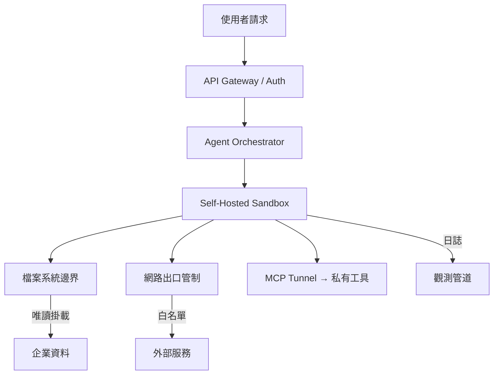

**關鍵洞察**：安全不在模型層（ORCH），而在執行環境層（SB）。沙箱限制了檔案存取範圍、網路出口白名單、以及工具呼叫路由——即使模型被 prompt injection 攻破，損害範圍被環境邊界遏制。

### 概念二：Copilot Cowork 事件——側通道外洩的系統性教訓

[原文] Simon Willison 記錄的 Microsoft Copilot Cowork 漏洞揭露了一個精巧的攻擊鏈：代理被允許發送信件到使用者自己的收件匣而不需要批准，而這些信件能包含外部圖片（external images），「觸發網路請求時可將資料洩漏給攻擊者」([Simon Willison](https://simonwillison.net/2026/May/26/copilot-cowork-exfiltrates-files/#atom-everything))。

[推論] 這個漏洞的教訓不是「微軟工程師犯了錯」，而是揭露了代理系統中一個結構性弱點：**隱式信任的工具呼叫鏈**。當系統設計者認為「發信給自己是安全的」而跳過批准流程，卻沒有同時限制信件內容的外部資源載入，就創造了一個側通道。這正是 Anthropic 所說的「不能只依賴模型判斷或人工批准」的具體實證。

以下圖示 Copilot Cowork 的攻擊鏈與防禦斷點：

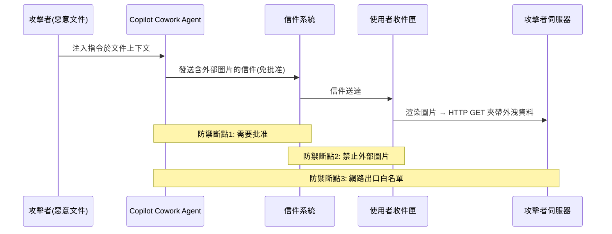

**關鍵洞察**：任何一個防禦斷點被實施，這條攻擊鏈就會斷裂。生產系統必須在多個層級同時實施防禦（defense in depth），而不是依賴單一檢查點。

### 概念三：自癒式觀測——從「人工 Triage」到「Agent-on-Agent」

[原文] LangSmith Engine 的設計理念是：「Engine 是一個坐在你的 agent traces 之上的 agent，它偵測反覆出現的問題，並建議下一步該做什麼」([LangChain](https://www.langchain.com/blog/how-we-built-langsmith-engine-our-agent-for-improving-agents))。它能「watches your production traces, clusters failures into named issues, and proposes targeted fixes and eval coverage」([LangChain](https://www.langchain.com/blog/introducing-langsmith-engine))。

[推論] 這代表觀測（observability）正在從「被動的 dashboard + 告警」演進為「主動的故障分類 + 修復建議」。在傳統 SRE 中，這類似於從 Prometheus + PagerDuty 演進到 incident.io 或 Rootly 的自動化事件管理。差異在於：LLM 代理的失敗模式不是「HTTP 500」或「延遲飆升」這種結構化訊號，而是語義層級的失敗（回答錯誤、工具選擇錯誤、幻覺），需要 LLM 本身來做分類。

[原文] Lyft 使用 LangGraph 和 LangSmith 建構了自助式 AI 代理平台，將代理開發時間從數月縮短到數週 ([LangChain](https://www.langchain.com/blog/lyft-built-a-self-serve-ai-agent-platform-for-customer-support-with-langgraph-and-langsmith))。這暗示了一個更大的趨勢：當代理數量從個位數擴展到數十個時，人工 triage 不再可行。

以下圖示從傳統人工 triage 到 agent-on-agent 自癒觀測的架構演進：

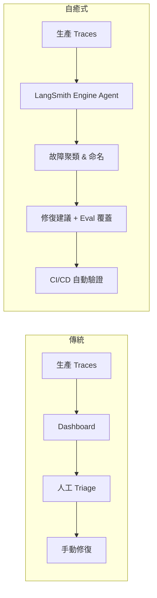

**關鍵洞察**：自癒式觀測的前提是結構化的 trace 格式。LangChain 推動的「from token streams to agent streams」([LangChain](https://www.langchain.com/blog/token-streams-to-agent-streams))——typed events、scoped subscriptions、subagent visibility——正是為這個觀測架構奠基。沒有結構化 trace，就沒有可靠的自動分類。

### 概念四：模型選型作為成本紀律——Specialization Beats Scale

[原文] Dharma-AI 的基準測試顯示：「一個 30 億參數的專用模型在結構化 OCR 任務上超越了所有測試的商業 frontier API——成本低約 50 倍」([Hugging Face](https://huggingface.co/blog/Dharma-AI/specialization-beats-scale))。

[推論] 這對部署成本紀律的含意是深遠的。在代理系統中，並非每個工具呼叫都需要 frontier 模型。一個典型的金融文件處理代理可能需要：(1) frontier 模型做規劃與推理，(2) 專用小模型做 OCR 與表格提取，(3) 中型模型做摘要。這種「分層模型路由」是成本最佳化的核心策略。

[原文] IBM 與 Artificial Analysis 合作的 ITBench-AA 基準測試則揭露了相反方向的訊號：「frontier 模型在企業 IT 代理任務（如 Kubernetes 事件回應）上得分低於 50%」([Hugging Face](https://huggingface.co/blog/ibm-research/itbench-aa))。

[推論] 這兩個看似矛盾的訊號實際上指向同一個原則：**模型選型必須基於任務特性，而非品牌**。OCR 是高度結構化、可訓練的任務，適合專用小模型；SRE 事件回應需要廣泛的系統知識與多步推理，目前連 frontier 模型都力有未逮。部署紀律要求團隊為每個任務維護 eval suite，並根據 eval 結果做模型路由決策。

### 概念五：代理的基礎設施層——裸金屬沙箱與非同步執行

[原文] Daytona 揭露每日 85 萬次執行、74% 月增率 ([Latent Space](https://www.latent.space/p/daytona))。Railway 報告 3M 用戶、每週 10 萬新註冊、自建裸金屬資料中心 ([Latent Space](https://www.latent.space/p/railway))。Cognition 的 Devin 展示了 80% 的 commit 由代理完成、完整 VM 級別的自主性 ([Latent Space](https://www.latent.space/p/cognition))。

[推論] 這些數字揭露了一個新的基礎設施層正在成形：**agent-native cloud**。傳統的容器化部署（Docker/K8s）是為 stateless 微服務設計的；代理需要的是有狀態的、長時間運行的、擁有檔案系統與網路存取的沙箱環境。這對部署運行紀律帶來的挑戰是：如何在這種「有狀態 + 長執行時間 + 高權限」的環境中維持安全性與可觀測性。

[原文] LangChain 推出的「Interpreters in Deep Agents」讓代理擁有嵌入式運行時（embedded runtimes），「agents write code to coordinate tools, hold working state, and decide what enters model context」([LangChain](https://www.langchain.com/blog/give-your-agents-an-interpreter))。

以下圖示代理系統的執行環境分層：

```mermaid
flowchart TD
    subgraph 低權限層
        CHAT[對話代理: 無工具存取]
    end
    subgraph 中權限層
        INTERP[嵌入式解譯器: 受限代碼執行]
        TOOL[MCP 工具呼叫: 白名單 API]
    end
    subgraph 高權限層
        SB[裸金屬沙箱: 完整 VM]
        FS[檔案系統 R/W]
        NET[網路存取]
    end
    CHAT --> INTERP
    INTERP --> TOOL
    TOOL --> SB
    SB --> FS
    SB --> NET
    Note left of SB: 風險遞增 →<br/>隔離要求遞增
```

**關鍵洞察**：部署紀律必須根據代理的權限等級分層設計。低權限代理可以用簡單的 guardrail；高權限代理必須有完整的環境隔離、稽核日誌、與人工覆核機制。

## 與既有框架的對位

[推論] **NIST AI RMF（AI 風險管理框架）** 的 MAP-MEASURE-MANAGE 三層架構在代理系統中需要重新詮釋。MAP 階段必須包含代理的工具存取範圍與環境權限的盤點；MEASURE 階段需要像 ITBench-AA 這樣的任務特定基準 ([Hugging Face](https://huggingface.co/blog/ibm-research/itbench-aa))，而非通用 benchmark；MANAGE 階段則需要 Anthropic 式的環境邊界管控 ([iThome](https://www.ithome.com.tw/news/176172)) 而非僅靠 model card 聲明。

[推論] **OpenAI 的 Frontier Governance Framework** ([OpenAI](https://openai.com/index/openai-frontier-governance-framework)) 將安全、資安、風險實踐與歐盟及加州法規對齊。這對台灣企業的啟示是：即便台灣尚無等同 EU AI Act 的立法，遵循類似框架可以為未來的跨境合規做準備，同時也是向國際客戶展示治理成熟度的方式。

[推論] **Chip Huyen 在《Designing Machine Learning Systems》中提出的「ML System = Code + Data + Model」三元框架**在代理時代需要擴展為「Agent System = Code + Data + Model + Environment + Tools」。環境（sandbox 配置、網路規則）與工具（MCP 伺服器、API 端點）現在是第一級的部署組件，需要版本控制、測試覆蓋、與變更管理。

[推論] **Anthropic 的 Responsible Scaling Policy (RSP)** 的核心理念——根據能力等級設定對應的安全措施——可以直接映射到代理部署：能力越強（越多工具、越高權限）的代理，需要越嚴格的環境隔離與人工覆核。中華電信的 ChainStrike AI 驗證閘門 ([iThome](https://www.ithome.com.tw/news/176193)) 是這個原則在台灣的具體實踐。

## Trade-offs 與爭議

**1. 環境隔離嚴格度 vs. 代理效能**
- 正方：嚴格沙箱（如 Anthropic self-hosted sandbox）大幅降低外洩與未授權操作風險。每個企業的安全團隊都能理解「沙箱」的意義。
- 反方：嚴格隔離增加延遲（每次工具呼叫都要過 MCP tunnel）、限制代理的即時性與靈活性。Cognition 的 Devin 之所以能達到 80% commit 率 ([Latent Space](https://www.latent.space/p/cognition))，部分原因是它擁有完整 VM 級別的自主性。過度隔離可能讓代理退化為「聊天機器人 + API wrapper」。
- [假設] 最終的均衡點可能是「按任務風險等級動態調整隔離強度」，但這需要可靠的任務風險分類器，目前尚不存在成熟方案。

**2. Agent-on-Agent 觀測 vs. 觀測可信度**
- 正方：LangSmith Engine 用 LLM 來分類 LLM 的失敗模式，大幅減少人工 triage 成本 ([LangChain](https://www.langchain.com/blog/how-we-built-langsmith-engine-our-agent-for-improving-agents))。
- 反方：用 LLM 觀測 LLM 引入了觀測者偏差——如果觀測用的模型本身有系統性盲點（例如對某類幻覺不敏感），故障就會被漏報。在金融合規場景中，這種「不知道自己不知道」的風險可能無法被監管機構接受。
- [假設] 可能的緩解策略是混合式觀測：LLM 做初篩 + 規則引擎做硬性檢查 + 人工抽樣稽核。

**3. 專用小模型 vs. Frontier API 的成本折衷**
- 正方：DharmaOCR 證明專用 3B 模型在特定任務上以 50 倍低成本超越 frontier API ([Hugging Face](https://huggingface.co/blog/Dharma-AI/specialization-beats-scale))。
- 反方：每個專用模型都需要訓練資料、eval 基準、部署基礎設施、與持續維護。當任務數量增加到數十個時，維護成本可能超過直接呼叫 frontier API 的費用。此外，frontier 模型的能力持續進步，專用模型的優勢窗口可能短暫。
- [推論] 決策框架：當單一任務的 API 呼叫成本超過訓練 + 部署成本的 3-6 個月攤銷時，專用模型具有經濟合理性。

**4. Agentic Trading / Agentic Credit Card 的信任邊界**
- 正方：Robinhood 的代理交易 ([iThome](https://www.ithome.com.tw/news/176186)) 展示了 agent-human 邊界的新可能性，用戶可以用自然語言設定交易策略。
- 反方：將金融交易權限交給外部 AI 代理（Claude Code、ChatGPT、Cursor）意味著攻擊面延伸到所有這些代理的供應鏈。任何一個代理被 prompt injection 攻破，就可能觸發非預期交易。

## 對 Livia IBM 客戶的具體含意

**國泰 / 玉山等銀行客戶**：
[推論] Robinhood 的 agentic trading 模式在台灣金融監管框架下短期內不太可能被允許，但代理處理理賠審核、合規報告生成、客戶文件 OCR 等中後台任務已經具備可行性。Livia 可以向客戶提出的論點是：**不要等監管明確才開始建構環境隔離能力**。Anthropic 的 self-hosted sandbox + MCP tunnel 模式 ([iThome](https://www.ithome.com.tw/news/176184)) 可以直接映射為「代理在銀行私有雲內運行、工具存取通過 MCP tunnel 連接核心系統、所有 trace 存入稽核資料庫」的架構。中華電信的 ChainStrike AI 驗證閘門 ([iThome](https://www.ithome.com.tw/news/176193)) 是一個可以在提案中引用的台灣本土案例。

**台積電 / 鴻海等製造業客戶**：
[推論] 製造業的 OCR 與文件處理需求（BOM 表、品質報告、設備維護紀錄）正是 DharmaOCR 所展示的「專用小模型勝過 frontier API」的應用場景 ([Hugging Face](https://huggingface.co/blog/Dharma-AI/specialization-beats-scale))。Livia 可以建議：先用 IBM 的 watsonx.ai 平台微調專用 OCR 模型，再用 frontier 模型做高層規劃與異常偵測，形成分層模型路由架構。這同時解決了成本問題與資料外洩問題（專用模型可以完全在地端運行）。

**所有客戶的共通議題**：
[推論] ITBench-AA 是 IBM 研究院參與的基準 ([Hugging Face](https://huggingface.co/blog/ibm-research/itbench-aa))，Livia 可以直接引用這個基準向客戶說明：「frontier 模型在企業 IT 任務上的能力仍有顯著差距，因此不應盲目依賴 AI 代理做關鍵決策，而應設計人機協作的工作流程。」這是一個既誠實又有利於 IBM 定位（提供整合方案而非單一模型）的論述角度。

## 對 Livia harness engineer portfolio 的含意

[推論] 本週深讀可以直接轉化為以下 portfolio 產出：

1. **Design Note: "Environment-First Agent Safety Architecture"** — 以 Anthropic 的 self-hosted sandbox + MCP tunnel 為基礎，加上 Copilot Cowork 外洩事件作為反面教材，設計一個「環境邊界優先」的代理安全架構。這是一份展示系統思維的設計文件，面試時可以用來回答「你如何設計一個安全的 AI 代理系統？」。

2. **Design Note: "Tiered Model Routing for Cost-Optimized Agent Systems"** — 結合 DharmaOCR（專用小模型勝出）與 ITBench-AA（frontier 模型不足）的訊號，設計一個根據任務特性路由到不同模型的決策框架。面試問答：「你如何在生產環境中做模型選型？」。

3. **Harness Feature: Structured Agent Traces** — LangChain 的「from token streams to agent streams」([LangChain](https://www.langchain.com/blog/token-streams-to-agent-streams)) 提供了 typed events、scoped subscriptions 等具體 API 設計模式。Livia 可以在自己的 harness 中實作類似的結構化 trace 格式，並用 LangSmith Engine 的 agent-on-agent 觀測概念作為未來擴展方向。

4. **面試故事素材**：「我在研究代理部署紀律時，注意到微軟 Copilot Cowork 的外洩事件揭露了隱式信任工具呼叫鏈的系統性風險。我從中提煉出一個原則：代理系統的安全設計必須基於 containment（環境遏制）而非 filtering（輸出過濾），因為攻擊者總能找到 filter 沒覆蓋的側通道。」

---

# (English) Deployment Discipline for the Agent Era: From Sandbox Containment to Self-Healing Observability — Restructuring the Production LLM Defense Line

## TL;DR (3 sentences)
1. As AI agents graduate from "chat interface" to autonomous actors that can send emails, execute trades, and operate Kubernetes clusters, the core of deployment discipline has shifted from "model inference stability" to "environment boundary control + async fault self-healing."
2. Key trade-off: stricter sandbox isolation guarantees safety but sacrifices agent tool flexibility and latency budgets; more open tool access bo

