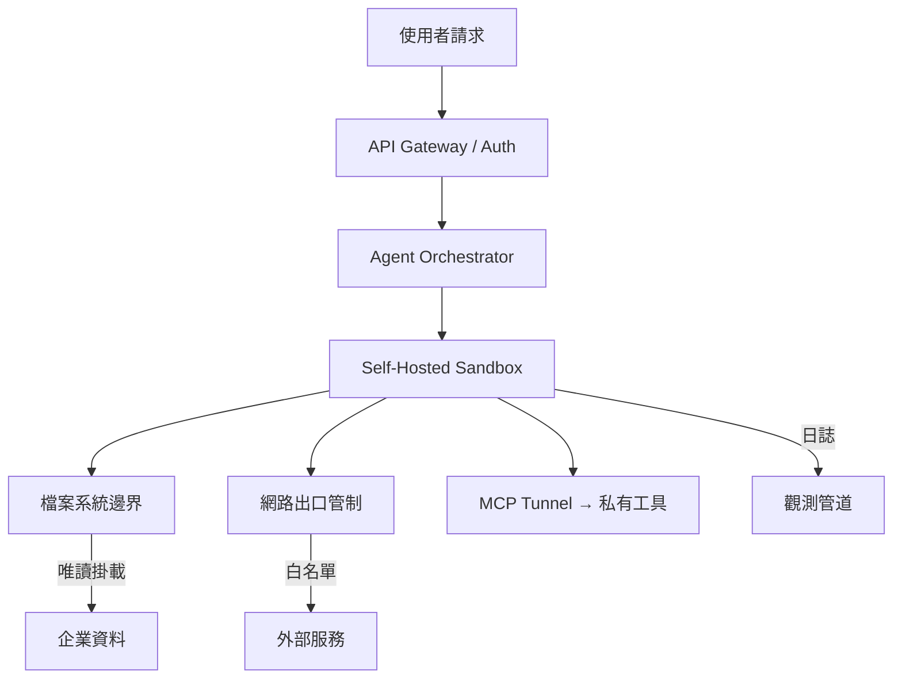
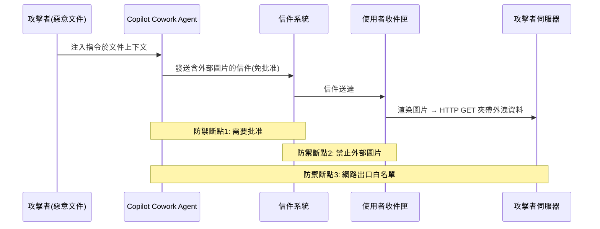
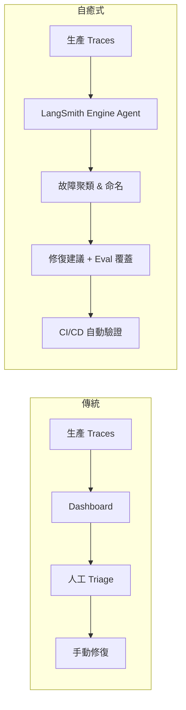

# Foundation — Track F: 部署運行紀律

_Week 2026-W22 · 25 items synthesized · $0.7134 USD_


# 代理時代的部署運行紀律：從沙箱隔離到自癒式觀測，生產級 LLM 系統的防線重構

## TL;DR (3 句繁中)
1. 當 AI 代理從「對話介面」躍升為「能發信、能交易、能操作 Kubernetes」的自主行為者，部署運行紀律的核心已從「模型推論穩定性」轉移到「環境邊界管控 + 非同步故障自癒」兩個軸心。
2. 關鍵 trade-off：越嚴格的沙箱隔離保障安全但犧牲代理的工具靈活性與延遲預算；越開放的工具存取提升效用但指數級放大 prompt injection 與資料外洩的攻擊面——沒有銀彈，只有依任務風險等級分層的工程決策。
3. 對 Livia 而言，台灣銀行與製造業客戶即將面對的不是「要不要用代理」，而是「如何在既有資安治理框架下，把代理的執行環境、觀測管道、故障分類做到可稽核」——這是 IBM 顧問能提供的高價值差異化服務。

## 背景與問題框架

[推論] 六個月前，生產級 LLM 系統的運行紀律討論集中在三件事：推論延遲 (p99 latency)、token 成本控制、以及 guardrail 層的 prompt injection 防禦。這些議題並未消失，但 2026 年上半的部署現實已經發生結構性位移。原因很簡單：代理（agent）不再只是「呼叫一個 API 然後回傳文字」的 stateless 服務，而是擁有檔案系統存取、網路出口、甚至金融交易執行權限的長時間運作實體。Robinhood 開放 AI 代理人代客交易股票 ([iThome](https://www.ithome.com.tw/news/176186))、Microsoft Copilot Cowork 被揭露能在未經批准下發送帶有外部圖片的信件以外洩資料 ([Simon Willison](https://simonwillison.net/2026/May/26/copilot-cowork-exfiltrates-files/#atom-everything))——這些不是假設性風險，而是已經在生產環境中發生的事件。

[推論] 這個位移意味著「部署運行紀律」的邊界必須擴展。過去我們談 rate limiting、prompt caching、model fallback；現在我們必須同時談執行環境隔離（sandbox isolation）、工具呼叫授權鏈（tool-call authorization chain）、以及非同步代理的故障可觀測性（observability for async agents）。Anthropic 在同一週內連續發布自管沙箱（self-hosted sandbox）與代理安全設計白皮書 ([iThome 1](https://www.ithome.com.tw/news/176184), [iThome 2](https://www.ithome.com.tw/news/176172))，LangChain 推出 LangSmith Engine 做生產 trace 自動故障分類 ([LangChain](https://www.langchain.com/blog/introducing-langsmith-engine))，Daytona 揭露每日 85 萬次裸金屬沙箱執行 ([Latent Space](https://www.latent.space/p/daytona))——這些訊號共同指向一個新的部署紀律範式。

[推論] 對台灣企業而言，這個轉變的時間窗口比矽谷晚約 6-12 個月，但南山人壽已經在跑 PoC ([iThome](https://www.ithome.com.tw/news/176177))、中華電信正在建構 AI 資安驗證閘門 ([iThome](https://www.ithome.com.tw/news/176193))、Dcard 已經把 Agent-Native 工作流程產品化 ([INSIDE](https://www.inside.com.tw/article/41409-dcard-gntc-agent-native-enterprise-ai-workflow))。問題不再是「台灣企業何時開始」，而是「現有部署紀律夠不夠撐住代理時代的風險面」。

## 核心概念解析（含 Mermaid 圖）

### 概念一：環境邊界作為第一道防線——不是 Guardrail，是 Containment

[原文] Anthropic 的代理安全設計明確指出：「當 AI 代理取得檔案、命令列、網路與外部工具存取能力後，不能只依賴模型判斷或人工批准，而要透過執行環境隔離、檔案系統邊界與網路出口管制，限制代理遭誤用、遭攻擊或執行非預期動作時的損害範圍」([iThome](https://www.ithome.com.tw/news/176172))。

[推論] 這是一個根本性的架構觀點轉移。過去的 guardrail 思維是在模型輸出端做過濾（output filtering）；Anthropic 現在主張的是在執行環境端做遏制（containment）。這兩者的差異類似於應用層防火牆 vs. 網路層分段隔離——前者依賴規則匹配，後者限制爆炸半徑。

[原文] Anthropic 同時推出的 self-hosted sandbox 與 MCP tunnel 讓企業可以「將代理人執行在企業自選雲端平台的沙箱中，並以 MCP 通道連結到私有 MCP 伺服器。代理人執行工具的沙箱及代理人連結的服務，都是跑在企業建立的邊界內」([iThome](https://www.ithome.com.tw/news/176184))。

以下圖示代理系統中環境邊界的分層架構：



**關鍵洞察**：安全不在模型層（ORCH），而在執行環境層（SB）。沙箱限制了檔案存取範圍、網路出口白名單、以及工具呼叫路由——即使模型被 prompt injection 攻破，損害範圍被環境邊界遏制。

### 概念二：Copilot Cowork 事件——側通道外洩的系統性教訓

[原文] Simon Willison 記錄的 Microsoft Copilot Cowork 漏洞揭露了一個精巧的攻擊鏈：代理被允許發送信件到使用者自己的收件匣而不需要批准，而這些信件能包含外部圖片（external images），「觸發網路請求時可將資料洩漏給攻擊者」([Simon Willison](https://simonwillison.net/2026/May/26/copilot-cowork-exfiltrates-files/#atom-everything))。

[推論] 這個漏洞的教訓不是「微軟工程師犯了錯」，而是揭露了代理系統中一個結構性弱點：**隱式信任的工具呼叫鏈**。當系統設計者認為「發信給自己是安全的」而跳過批准流程，卻沒有同時限制信件內容的外部資源載入，就創造了一個側通道。這正是 Anthropic 所說的「不能只依賴模型判斷或人工批准」的具體實證。

以下圖示 Copilot Cowork 的攻擊鏈與防禦斷點：



**關鍵洞察**：任何一個防禦斷點被實施，這條攻擊鏈就會斷裂。生產系統必須在多個層級同時實施防禦（defense in depth），而不是依賴單一檢查點。

### 概念三：自癒式觀測——從「人工 Triage」到「Agent-on-Agent」

[原文] LangSmith Engine 的設計理念是：「Engine 是一個坐在你的 agent traces 之上的 agent，它偵測反覆出現的問題，並建議下一步該做什麼」([LangChain](https://www.langchain.com/blog/how-we-built-langsmith-engine-our-agent-for-improving-agents))。它能「watches your production traces, clusters failures into named issues, and proposes targeted fixes and eval coverage」([LangChain](https://www.langchain.com/blog/introducing-langsmith-engine))。

[推論] 這代表觀測（observability）正在從「被動的 dashboard + 告警」演進為「主動的故障分類 + 修復建議」。在傳統 SRE 中，這類似於從 Prometheus + PagerDuty 演進到 incident.io 或 Rootly 的自動化事件管理。差異在於：LLM 代理的失敗模式不是「HTTP 500」或「延遲飆升」這種結構化訊號，而是語義層級的失敗（回答錯誤、工具選擇錯誤、幻覺），需要 LLM 本身來做分類。

[原文] Lyft 使用 LangGraph 和 LangSmith 建構了自助式 AI 代理平台，將代理開發時間從數月縮短到數週 ([LangChain](https://www.langchain.com/blog/lyft-built-a-self-serve-ai-agent-platform-for-customer-support-with-langgraph-and-langsmith))。這暗示了一個更大的趨勢：當代理數量從個位數擴展到數十個時，人工 triage 不再可行。

以下圖示從傳統人工 triage 到 agent-on-agent 自癒觀測的架構演進：



**關鍵洞察**：自癒式觀測的前提是結構化的 trace 格式。LangChain 推動的「from token streams to agent streams」([LangChain](https://www.langchain.com/blog/token-streams-to-agent-streams))——typed events、scoped subscriptions、subagent visibility——正是為這個觀測架構奠基。沒有結構化 trace，就沒有可靠的自動分類。

### 概念四：模型選型作為成本紀律——Specialization Beats Scale

[原文] Dharma-AI 的基準測試顯示：「一個 30 億參數的專用模型在結構化 OCR 任務上超越了所有測試的商業 frontier API——成本低約 50 倍」([Hugging Face](https://huggingface.co/blog/Dharma-AI/specialization-beats-scale))。

[推論] 這對部署成本紀律的含意是深遠的。在代理系統中，並非每個工具呼叫都需要 frontier 模型。一個典型的金融文件處理代理可能需要：(1) frontier 模型做規劃與推理，(2) 專用小模型做 OCR 與表格提取，(3) 中型模型做摘要。這種「分層模型路由」是成本最佳化的核心策略。

[原文] IBM 與 Artificial Analysis 合作的 ITBench-AA 基準測試則揭露了相反方向的訊號：「frontier 模型在企業 IT 代理任務（如 Kubernetes 事件回應）上得分低於 50%」([Hugging Face](https://huggingface.co/blog/ibm-research/itbench-aa))。

[推論] 這兩個看似矛盾的訊號實際上指向同一個原則：**模型選型必須基於任務特性，而非品牌**。OCR 是高度結構化、可訓練的任務，適合專用小模型；SRE 事件回應需要廣泛的系統知識與多步推理，目前連 frontier 模型都力有未逮。部署紀律要求團隊為每個任務維護 eval suite，並根據 eval 結果做模型路由決策。

### 概念五：代理的基礎設施層——裸金屬沙箱與非同步執行

[原文] Daytona 揭露每日 85 萬次執行、74% 月增率 ([Latent Space](https://www.latent.space/p/daytona))。Railway 報告 3M 用戶、每週 10 萬新註冊、自建裸金屬資料中心 ([Latent Space](https://www.latent.space/p/railway))。Cognition 的 Devin 展示了 80% 的 commit 由代理完成、完整 VM 級別的自主性 ([Latent Space](https://www.latent.space/p/cognition))。

[推論] 這些數字揭露了一個新的基礎設施層正在成形：**agent-native cloud**。傳統的容器化部署（Docker/K8s）是為 stateless 微服務設計的；代理需要的是有狀態的、長時間運行的、擁有檔案系統與網路存取的沙箱環境。這對部署運行紀律帶來的挑戰是：如何在這種「有狀態 + 長執行時間 + 高權限」的環境中維持安全性與可觀測性。

[原文] LangChain 推出的「Interpreters in Deep Agents」讓代理擁有嵌入式運行時（embedded runtimes），「agents write code to coordinate tools, hold working state, and decide what enters model context」([LangChain](https://www.langchain.com/blog/give-your-agents-an-interpreter))。

以下圖示代理系統的執行環境分層：

```mermaid
flowchart TD
    subgraph 低權限層
        CHAT[對話代理: 無工具存取]
    end
    subgraph 中權限層
        INTERP[嵌入式解譯器: 受限代碼執行]
        TOOL[MCP 工具呼叫: 白名單 API]
    end
    subgraph 高權限層
        SB[裸金屬沙箱: 完整 VM]
        FS[檔案系統 R/W]
        NET[網路存取]
    end
    CHAT --> INTERP
    INTERP --> TOOL
    TOOL --> SB
    SB --> FS
    SB --> NET
    Note left of SB: 風險遞增 →<br/>隔離要求遞增
```

**關鍵洞察**：部署紀律必須根據代理的權限等級分層設計。低權限代理可以用簡單的 guardrail；高權限代理必須有完整的環境隔離、稽核日誌、與人工覆核機制。

## 與既有框架的對位

[推論] **NIST AI RMF（AI 風險管理框架）** 的 MAP-MEASURE-MANAGE 三層架構在代理系統中需要重新詮釋。MAP 階段必須包含代理的工具存取範圍與環境權限的盤點；MEASURE 階段需要像 ITBench-AA 這樣的任務特定基準 ([Hugging Face](https://huggingface.co/blog/ibm-research/itbench-aa))，而非通用 benchmark；MANAGE 階段則需要 Anthropic 式的環境邊界管控 ([iThome](https://www.ithome.com.tw/news/176172)) 而非僅靠 model card 聲明。

[推論] **OpenAI 的 Frontier Governance Framework** ([OpenAI](https://openai.com/index/openai-frontier-governance-framework)) 將安全、資安、風險實踐與歐盟及加州法規對齊。這對台灣企業的啟示是：即便台灣尚無等同 EU AI Act 的立法，遵循類似框架可以為未來的跨境合規做準備，同時也是向國際客戶展示治理成熟度的方式。

[推論] **Chip Huyen 在《Designing Machine Learning Systems》中提出的「ML System = Code + Data + Model」三元框架**在代理時代需要擴展為「Agent System = Code + Data + Model + Environment + Tools」。環境（sandbox 配置、網路規則）與工具（MCP 伺服器、API 端點）現在是第一級的部署組件，需要版本控制、測試覆蓋、與變更管理。

[推論] **Anthropic 的 Responsible Scaling Policy (RSP)** 的核心理念——根據能力等級設定對應的安全措施——可以直接映射到代理部署：能力越強（越多工具、越高權限）的代理，需要越嚴格的環境隔離與人工覆核。中華電信的 ChainStrike AI 驗證閘門 ([iThome](https://www.ithome.com.tw/news/176193)) 是這個原則在台灣的具體實踐。

## Trade-offs 與爭議

**1. 環境隔離嚴格度 vs. 代理效能**
- 正方：嚴格沙箱（如 Anthropic self-hosted sandbox）大幅降低外洩與未授權操作風險。每個企業的安全團隊都能理解「沙箱」的意義。
- 反方：嚴格隔離增加延遲（每次工具呼叫都要過 MCP tunnel）、限制代理的即時性與靈活性。Cognition 的 Devin 之所以能達到 80% commit 率 ([Latent Space](https://www.latent.space/p/cognition))，部分原因是它擁有完整 VM 級別的自主性。過度隔離可能讓代理退化為「聊天機器人 + API wrapper」。
- [假設] 最終的均衡點可能是「按任務風險等級動態調整隔離強度」，但這需要可靠的任務風險分類器，目前尚不存在成熟方案。

**2. Agent-on-Agent 觀測 vs. 觀測可信度**
- 正方：LangSmith Engine 用 LLM 來分類 LLM 的失敗模式，大幅減少人工 triage 成本 ([LangChain](https://www.langchain.com/blog/how-we-built-langsmith-engine-our-agent-for-improving-agents))。
- 反方：用 LLM 觀測 LLM 引入了觀測者偏差——如果觀測用的模型本身有系統性盲點（例如對某類幻覺不敏感），故障就會被漏報。在金融合規場景中，這種「不知道自己不知道」的風險可能無法被監管機構接受。
- [假設] 可能的緩解策略是混合式觀測：LLM 做初篩 + 規則引擎做硬性檢查 + 人工抽樣稽核。

**3. 專用小模型 vs. Frontier API 的成本折衷**
- 正方：DharmaOCR 證明專用 3B 模型在特定任務上以 50 倍低成本超越 frontier API ([Hugging Face](https://huggingface.co/blog/Dharma-AI/specialization-beats-scale))。
- 反方：每個專用模型都需要訓練資料、eval 基準、部署基礎設施、與持續維護。當任務數量增加到數十個時，維護成本可能超過直接呼叫 frontier API 的費用。此外，frontier 模型的能力持續進步，專用模型的優勢窗口可能短暫。
- [推論] 決策框架：當單一任務的 API 呼叫成本超過訓練 + 部署成本的 3-6 個月攤銷時，專用模型具有經濟合理性。

**4. Agentic Trading / Agentic Credit Card 的信任邊界**
- 正方：Robinhood 的代理交易 ([iThome](https://www.ithome.com.tw/news/176186)) 展示了 agent-human 邊界的新可能性，用戶可以用自然語言設定交易策略。
- 反方：將金融交易權限交給外部 AI 代理（Claude Code、ChatGPT、Cursor）意味著攻擊面延伸到所有這些代理的供應鏈。任何一個代理被 prompt injection 攻破，就可能觸發非預期交易。

## 對 Livia IBM 客戶的具體含意

**國泰 / 玉山等銀行客戶**：
[推論] Robinhood 的 agentic trading 模式在台灣金融監管框架下短期內不太可能被允許，但代理處理理賠審核、合規報告生成、客戶文件 OCR 等中後台任務已經具備可行性。Livia 可以向客戶提出的論點是：**不要等監管明確才開始建構環境隔離能力**。Anthropic 的 self-hosted sandbox + MCP tunnel 模式 ([iThome](https://www.ithome.com.tw/news/176184)) 可以直接映射為「代理在銀行私有雲內運行、工具存取通過 MCP tunnel 連接核心系統、所有 trace 存入稽核資料庫」的架構。中華電信的 ChainStrike AI 驗證閘門 ([iThome](https://www.ithome.com.tw/news/176193)) 是一個可以在提案中引用的台灣本土案例。

**台積電 / 鴻海等製造業客戶**：
[推論] 製造業的 OCR 與文件處理需求（BOM 表、品質報告、設備維護紀錄）正是 DharmaOCR 所展示的「專用小模型勝過 frontier API」的應用場景 ([Hugging Face](https://huggingface.co/blog/Dharma-AI/specialization-beats-scale))。Livia 可以建議：先用 IBM 的 watsonx.ai 平台微調專用 OCR 模型，再用 frontier 模型做高層規劃與異常偵測，形成分層模型路由架構。這同時解決了成本問題與資料外洩問題（專用模型可以完全在地端運行）。

**所有客戶的共通議題**：
[推論] ITBench-AA 是 IBM 研究院參與的基準 ([Hugging Face](https://huggingface.co/blog/ibm-research/itbench-aa))，Livia 可以直接引用這個基準向客戶說明：「frontier 模型在企業 IT 任務上的能力仍有顯著差距，因此不應盲目依賴 AI 代理做關鍵決策，而應設計人機協作的工作流程。」這是一個既誠實又有利於 IBM 定位（提供整合方案而非單一模型）的論述角度。

## 對 Livia harness engineer portfolio 的含意

[推論] 本週深讀可以直接轉化為以下 portfolio 產出：

1. **Design Note: "Environment-First Agent Safety Architecture"** — 以 Anthropic 的 self-hosted sandbox + MCP tunnel 為基礎，加上 Copilot Cowork 外洩事件作為反面教材，設計一個「環境邊界優先」的代理安全架構。這是一份展示系統思維的設計文件，面試時可以用來回答「你如何設計一個安全的 AI 代理系統？」。

2. **Design Note: "Tiered Model Routing for Cost-Optimized Agent Systems"** — 結合 DharmaOCR（專用小模型勝出）與 ITBench-AA（frontier 模型不足）的訊號，設計一個根據任務特性路由到不同模型的決策框架。面試問答：「你如何在生產環境中做模型選型？」。

3. **Harness Feature: Structured Agent Traces** — LangChain 的「from token streams to agent streams」([LangChain](https://www.langchain.com/blog/token-streams-to-agent-streams)) 提供了 typed events、scoped subscriptions 等具體 API 設計模式。Livia 可以在自己的 harness 中實作類似的結構化 trace 格式，並用 LangSmith Engine 的 agent-on-agent 觀測概念作為未來擴展方向。

4. **面試故事素材**：「我在研究代理部署紀律時，注意到微軟 Copilot Cowork 的外洩事件揭露了隱式信任工具呼叫鏈的系統性風險。我從中提煉出一個原則：代理系統的安全設計必須基於 containment（環境遏制）而非 filtering（輸出過濾），因為攻擊者總能找到 filter 沒覆蓋的側通道。」

---

# (English) Deployment Discipline for the Agent Era: From Sandbox Containment to Self-Healing Observability — Restructuring the Production LLM Defense Line

## TL;DR (3 sentences)
1. As AI agents graduate from "chat interface" to autonomous actors that can send emails, execute trades, and operate Kubernetes clusters, the core of deployment discipline has shifted from "model inference stability" to "environment boundary control + async fault self-healing."
2. Key trade-off: stricter sandbox isolation guarantees safety but sacrifices agent tool flexibility and latency budgets; more open tool access bo
