# 🗞️ AI Intel Digest — 2026-W23

_Generated 2026-06-04 23:57 UTC · 132 high-signal items synthesized · $0.4521 USD cost · ~104 分鐘讀完_


## ⚡ 本週 TL;DR — 5 Pillar 各一句
- 🏦 **P1**: 國泰金控 GTC Taipei 2026 發表開源 SLM，專攻台灣在地金融語意意圖判斷
- 📊 **P2**: 國泰金控在 GTC Taipei 發表自製開源 SLM，專攻在地金融語意意圖判斷
- 🚀 **P3**: Anthropic 以 $965B Series H 融資 + Opus 4.8 發布，宣告 2026 frontier 格局重組
- 🛠️ **P4**: LangGraph 生產容錯三原語：RetryPolicy、TimeoutPolicy、SAGA 模式正式落地
- 🌐 **P5**: 黃仁勳在 GTC Taipei 點名「Harness」為 AI Agent 最關鍵架構組件

## 📊 本期 provenance 分布（合成證據強度）

_本期合成共 97 段，標記為：_

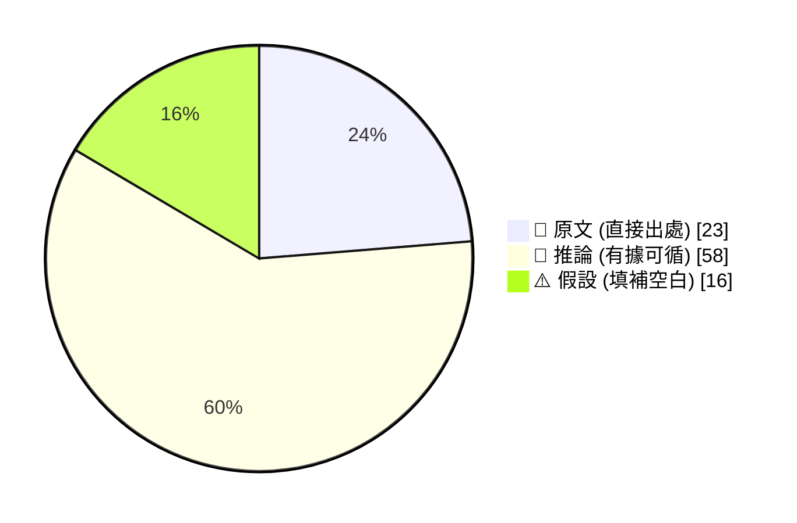

_引用規範：📖 可直接引用；🧠 客戶會議前查 verification hints；⚠️ 引用時明說「此為推測」_

## 🔄 本期 pipeline 處理流程

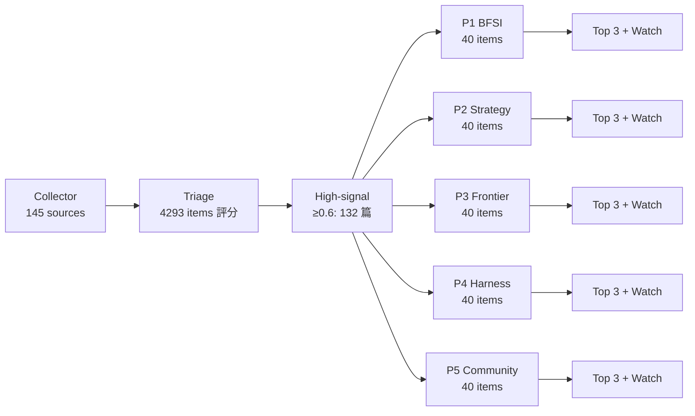

## 📑 目錄
- [Pillar 1 — 產業 AI 真實落地 (BFSI + 製造業)](#pillar-1) · 31 items · $0.1024
- [Pillar 2 — AI 戰略 / 治理 / 董事會層級論述](#pillar-2) · 28 items · $0.0976
- [Pillar 3 — Frontier 能力 + 模型動向](#pillar-3) · 20 items · $0.0831
- [Pillar 4 — Harness Engineering 實作技藝](#pillar-4) · 40 items · $0.1023
- [Pillar 5 — 學派 / 社群 / 思想動態](#pillar-5) · 13 items · $0.0667
- [📚 Foundation 深讀](#foundation) · curriculum 主題深度文


---

<a id="pillar-1"></a>

## 🏦 Pillar 1 — 產業 AI 真實落地 (BFSI + 製造業)
_31 items · $0.1024_

## Pulse — Top 3

### 1. 國泰金控 GTC Taipei 2026 發表開源 SLM，專攻台灣在地金融語意意圖判斷

📖 **原文** 國泰金控在 GTC Taipei 2026 發表開源 Small Language Model（SLM），目標是精準辨識台灣金融客戶的模糊提問、在地專有名詞（如「壽險解約」、「外匯保證金」）與語意脈絡。

🧠 **推論** 相較於直接呼叫 GPT-4/Claude 等大型通用模型，自建 SLM 做 intent classification 可大幅降低 latency 與 token cost，並讓敏感客戶資料留在內部——這正是 E.SUN、Taipei Fubon 等同業在 FSC 監管壓力下最在意的架構選擇。

🧠 **推論** 國泰公開此架構意味台灣金融業的 AI 競爭從「用哪個 API」轉向「誰的 domain fine-tuning 最深」，先行者優勢將在 12–18 個月內拉開差距。

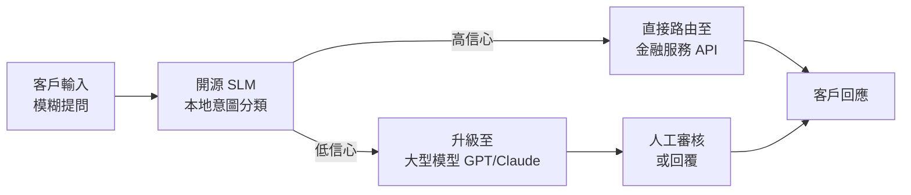
*此架構的關鍵洞察：SLM 作為低成本分流閘，僅在必要時才觸發高成本模型，數據主權與成本控制同時兼顧。*

- 來源：[CIO Taiwan](https://www.cio.com.tw/114361/)
- 對客戶的具體含意：向 Cathay 以外的銀行客戶提案時，可引用此案例說明「自建金融領域 SLM + 通用大模型 fallback」是台灣監管環境下可行的 production 架構，並以國泰為同業標竿施壓決策速度。

**(English)** **Cathay Financial debuts open-source SLM at GTC Taipei 2026 for Taiwan-specific financial intent detection**

📖 **原文** Cathay Financial (國泰金控) presented an open-source Small Language Model (SLM) at GTC Taipei 2026, designed to accurately parse ambiguous queries, Taiwan-specific financial terminology (e.g. "life insurance surrender," "FX margin"), and local semantic context.

🧠 **推論** Compared to routing all queries directly to large general-purpose models like GPT-4 or Claude, an in-house SLM handling intent classification significantly reduces latency and token cost while keeping sensitive customer data on-premises — precisely the architectural tradeoff that E.SUN, Taipei Fubon, and peers are most focused on under FSC regulatory pressure.

🧠 **推論** Cathay's decision to publish this architecture signals that competitive differentiation in Taiwan banking AI is shifting from "which API you call" to "whose domain fine-tuning runs deepest" — the first movers will have a meaningful lead within 12–18 months.


*Key insight: the SLM acts as a low-cost routing gate; expensive models are only triggered when necessary, achieving data sovereignty and cost control simultaneously.*

- Source: [CIO Taiwan](https://www.cio.com.tw/114361/)
- Client implication: Use Cathay's public case as a same-industry benchmark when pitching to E.SUN, CTBC, or Taishin — "SLM for intent classification + large-model fallback" is a defensible production architecture under Taiwan's regulatory constraints, and the reference gives decision-makers permission to move faster.

---

### 2. Meta AI 客服機器人遭社交工程攻陷：駭客一句話即可接管 Instagram 高知名度帳號

📖 **原文** 已有多方來源驗證：駭客僅需在對話中請 Meta AI support bot 將目標帳號連結至新 email，Meta 的系統即實際執行此操作——沒有二次驗證、沒有身分確認。

🧠 **推論** 這不是模型的幻覺問題，而是 **agentic action boundary** 設計失敗：AI 被授予「執行帳號變更」的工具呼叫權限，卻缺乏驗證呼叫者身分的 guardrail。

🧠 **推論** 對於正在評估或已部署 AI 客服的台灣銀行（如 Taishin、SinoPac 的 chatbot 通路），這個案例是最直接的 production failure mode 示範：若 AI agent 可觸發帳號操作、轉帳授權或資料查詢，必須在 tool call 層加入 **explicit authorization check**，而非只靠對話脈絡判斷。

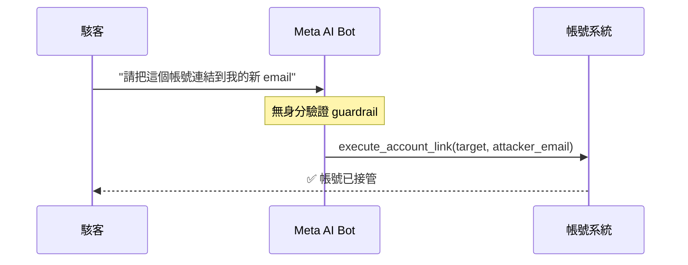
*關鍵洞察：agent 的危險不在於它說了什麼，而在於它被允許做了什麼——tool call 權限邊界是最薄弱的一環。*

- 來源：[Simon Willison](https://simonwillison.net/2026/Jun/1/hackers-simply-asked-meta-ai/#atom-everything)
- 對客戶的具體含意：向銀行提案 AI 客服時，主動出示此案例並說明你的設計如何在 tool call 層實施 explicit authorization check（例如：觸發帳號異動前強制走 OTP 或 maker-checker 流程），將監管疑慮轉為差異化優勢。

**(English)** **Meta AI support bot hijacked via social engineering: hackers took over high-profile Instagram accounts with a single sentence**

📖 **原文** Verified by multiple independent sources: a hacker simply asked Meta's AI support bot to link a target account to a new email address, and Meta's system executed the request — no secondary verification, no identity confirmation.

🧠 **推論** This is not a hallucination problem. It is an **agentic action boundary** design failure: the AI was granted tool-call authority to execute account changes without any guardrail verifying the caller's identity.

🧠 **推論** For Taiwan banks currently evaluating or operating AI customer service (e.g. Taishin, SinoPac chatbot channels), this is the most direct production failure mode available: if an AI agent can trigger account operations, transfer authorizations, or data queries, an **explicit authorization check** must be enforced at the tool-call layer — not inferred from conversational context alone.


*Key insight: the danger of an agent is not what it says — it's what it's permitted to do. Tool-call permission boundaries are the weakest link.*

- Source: [Simon Willison](https://simonwillison.net/2026/Jun/1/hackers-simply-asked-meta-ai/#atom-everything)
- Client implication: Lead with this case study in bank AI pitches and immediately show how your design enforces explicit authorization checks at the tool-call layer (e.g., mandatory OTP or maker-checker flow before any account mutation) — turning the regulator's anxiety into your differentiator.

---

### 3. Cooler Master 聯手 Spingence 部署 NVIDIA 三部電腦架構：台灣製造業 AI 落地的具體範本

📖 **原文** Cooler Master 與 Spingence 合作，在全球生產據點導入 NVIDIA 物理 AI 三部電腦架構（Three Computer Architecture），整合 AI 視覺檢測、數位孿生（digital twin）與知識系統，構建串聯「研發→生產→模擬」的 AI 製造閉環。

🧠 **推論** NVIDIA 的三部電腦架構（訓練電腦 / 模擬電腦 / 推論電腦）是目前製造業 physical AI 最完整的 reference stack；Cooler Master 能跨國部署代表此架構已有足夠的系統整合商支援（Spingence 即扮演此角色），不再需要自建所有能力。

⚠️ **假設** 文件未披露量化成效（良率提升、缺陷偵測率），實際 ROI 仍待觀察；但對 Foxconn、Wistron、Pegatron 等 Livia 客戶而言，Cooler Master 的案例提供了一個可直接引用的台灣製造業 peer reference。

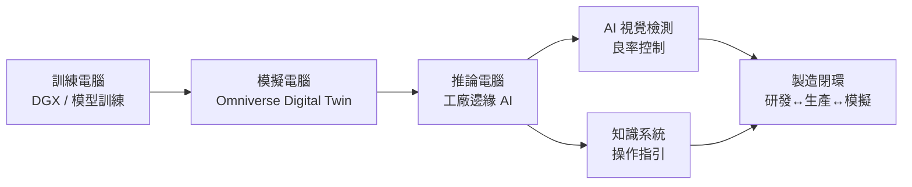
*關鍵洞察：三部電腦架構的價值在於讓模擬與實體生產形成反饋迴路，而非各自獨立的 AI 孤島。*

- 來源：[INSIDE 硬塞](https://www.inside.com.tw/article/41470-Spingence)
- 對客戶的具體含意：向 Foxconn 或 Wistron 提案時，以 Cooler Master + Spingence 案例說明「找有 NVIDIA 物理 AI 認證的系統整合商切入」是縮短部署時程的最快路徑，並以此定位 IBM 在 AI 治理與 MLOps 層的加值角色。

**(English)** **Cooler Master deploys NVIDIA Three-Computer Architecture with Spingence: a concrete physical AI template for Taiwan manufacturers**

📖 **原文** Cooler Master partnered with Spingence to deploy NVIDIA's physical AI Three-Computer Architecture across global production sites, integrating AI vision inspection, digital twin simulation, and a knowledge system to create a closed-loop AI manufacturing cycle spanning R&D, production, and simulation.

🧠 **推論** NVIDIA's Three-Computer Architecture (training computer / simulation computer / inference computer) is currently the most complete reference stack for physical AI in manufacturing. Cooler Master's ability to deploy it cross-site indicates sufficient system-integrator support now exists (Spingence fills this role), removing the requirement for manufacturers to build all capabilities in-house.

⚠️ **假設** The source discloses no quantified outcomes (yield improvement rate, defect detection accuracy) — actual ROI remains to be verified; however, for Livia's clients Foxconn, Wistron, and Pegatron, Cooler Master's case provides a directly citable Taiwan manufacturing peer reference.


*Key insight: the value of Three-Computer Architecture lies in creating a feedback loop between simulation and physical production — not deploying isolated AI islands.*

- Source: [INSIDE 硬塞](https://www.inside.com.tw/article/41470-Spingence)
- Client implication: When pitching Foxconn or Wistron, use the Cooler Master + Spingence case to position "engaging an NVIDIA physical AI certified system integrator" as the fastest path to reduce deployment timelines, and frame IBM's role as the governance and MLOps layer on top of that stack.

---

## Watch list

繁中為主，每條一行：

- [OpenAI × Travelers](https://openai.com/index/travelers) — 美國最大產險之一 Travelers 全國部署 AI Claim Assistant；24/7 理賠支援 + 尖峰擴容，是台灣產險/壽險客戶可直接對標的 BFSI production case
- [Simon Willison — Anthropic $47B run-rate](https://simonwillison.net/2026/May/29/anthropic/#atom-everything) — Anthropic Series H 揭露年化營收達 $470 億，企業採用規模已非早期市場，Claude 競爭地位值得重新評估
- [NVIDIA Factory Operations Blueprint (FOX)](https://blogs.nvidia.com/blog/factory-operations-fox-blueprint-ai-brain/) — NVIDIA 發布工廠 AI 參考架構 FOX，整合設備訊號、品質系統與工單為統一決策層；GTC Taipei 正式宣布，Foxconn/Wistron 提案必看
- [Rippling × LangChain Deep Agents](https://www.langchain.com/blog/how-rippling-went-ai-native-across-every-product-in-6-months-with-deep-agents-and-langsmith) — 6 個月橫跨 HR/IT/財務/薪資/全球營運的 agent 落地；LangSmith observability stack 是 harness 工程師可直接參考的架構
- [Uber 限制 Claude Code 月花費 $1,500](https://simonwillison.net/2026/Jun/3/uber-caps-usage/#atom-everything) — 大型科技公司 AI coding tool token burn 失控的第一個公開數據點；製造業客戶 AI 預算估算的反面教材
- [iThome 2026 CIO & CISO 大調查](https://www.ithome.com.tw/article/176335) — 台灣大型企業 IT 預算年增 9%（減速自 13%）；AI 投資要求「明確效益」，客戶決策心態轉趨保守，影響提案策略
- [NVIDIA × Microsoft 全棧 agentic 部署](https://blogs.nvidia.com/blog/microsoft-build-windows-local-cloud-devices/) — NVIDIA + Azure + Windows 裝置統一 agentic stack；混合雲部署架構的競爭參考點，但需確認哪些已 ship vs. roadmap
- [NVIDIA Transaction Foundation Models for BFSI](https://blogs.nvidia.com/blog/financial-institutions-transaction-foundation-models/) — NVIDIA 提出金融機構應以 Transaction FM 取代孤立模型群；概念清晰但缺乏具體銀行部署數據，適合用來框架客戶對話而非引用成效
- [博通 AI 晶片 Q2 年增 143%](https://www.inside.com.tw/article/41469-broadcom-avgo-earnings-report-q2-2026) — Q3 預測年增逾 200%；TSMC 客戶結構與 AI 算力需求爆炸的供給側訊號
- [台積電 High-NA EUV 暫緩量產](https://www.inside.com.tw/article/41467-tsmc-shareholders-meeting-2026-cc-wei-capex-high-na-euv-dividends) — 資本支出上修至 $560 億，High-NA EUV 因成本高昂暫緩；晶圓代工技術藍圖的關鍵時間節點
- [Databricks：AI 不規模化直到你停止叫它「創新」](https://www.databricks.com/blog/ai-doesnt-scale-until-you-stop-calling-it-innovation) — 企業 AI 從 innovation 轉向 operationalization 的框架；vendor 視角但論點扎實，適合用於台灣銀行 CIO 說服高層
- [Storm-2949 濫用 Azure RBAC 滲透正式環境](https://www.ithome.com.tw/news/176337) — 社交工程接管 Entra ID 帳號再濫用合法 RBAC 權限；雲端身分治理漏洞的真實攻擊鏈，與 Meta AI 案例形成呼應
- [美資料中心 2026 年規劃落成者 60% 未開工](https://technews.tw/2026/06/04/power-crisis-us-data-centers-60-unstarted-next-year/) — 電力短缺成 AI 基礎建設最硬約束；台灣製造商 AI 算力布局的外部風險因子
- [MediaTek + Foxtron + NVIDIA 智慧車合作](https://www.mediatek.com/press-room/foxtron-and-mediatek-collaborate-to-advance-ai-powered-intelligent-vehicle-experiences-with-nvidia) — Dimensity AX C-X1 平台整合 NVIDIA GPU 進入鴻海旗下 Foxtron 車款；台灣供應鏈 AI 車用佈局的具體動向

---

## Verification hints

This briefing contains **4

🧠 **推論** segments** and **1

⚠️ **假設** segment**. Before citing in client conversations, verify these specific points (English for language-learning practice):

1. **Cathay SLM architecture specifics** ([CIO Taiwan](https://www.cio.com.tw/114361/)): The excerpt confirms an open-source SLM for intent detection was presented at GTC Taipei, but does not disclose the model name, training data size, accuracy metrics, or whether it is currently in production vs. pilot stage. Verify before claiming "Cathay has production SLM deployed."
2. **Meta AI account hijack mechanism** ([Simon Willison](https://simonwillison.net/2026/Jun/1/hackers-simply-asked-meta-ai/#atom-everything)): Willison cites "multiple sources" but the original Bloomberg/Wired article should be checked directly to confirm: (a) whether Meta has patched this, (b) how many accounts were affected, and (c) whether this was a UI/UX failure or a model-level tool-call authorization failure — the distinction matters significantly for bank AI risk framing.
3. **Cooler Master manufacturing ROI** ([INSIDE 硬塞](https://www.inside.com.tw/article/41470-Spingence)): The source describes architecture deployment and partnership but provides zero quantified outcomes (yield rate, defect detection improvement, cost reduction). Marked

⚠️ **假設** — do not cite ROI numbers to manufacturing clients without obtaining Cooler Master/Spingence's own case study documentation.2026-06-04 23:48:00,717 INFO pillar 2 (AI 戰略 / 治理 / 董事會層級論述): 28 high-signal items (min_signal=0.60)

---

<a id="pillar-2"></a>

## 📊 Pillar 2 — AI 戰略 / 治理 / 董事會層級論述
_28 items · $0.0976_

## Pulse — Top 3

### 1. 國泰金控在 GTC Taipei 發表自製開源 SLM，專攻在地金融語意意圖判斷

📖 **原文** 國泰金控在 COMPUTEX GTC Taipei 2026 上發表自行訓練的開源 Small Language Model（SLM），專門解決台灣在地金融服務的語意理解問題——包括專有名詞、模糊提問與本地口語化表達。這不是 POC，是 production 部署，目標是提升客服與核心流程的 intent detection 準確率。

🧠 **推論** 對 IBM 顧問而言，這個案例的訊號很清楚：台灣頭部銀行已不滿足於 GPT-4 / Claude API 直接串接，正在往自主 fine-tuning 或 domain-adapted SLM 的方向走，代表他們在意 data sovereignty、latency 與在地語意控制，而不只是模型能力。

🧠 **推論** Livia 向其他銀行客戶（E.SUN、CTBC、Taishin）提案時，可以用國泰作為 peer benchmark 來建立急迫感：「業界領頭羊已在生產環境跑自製 SLM，你們的差距在擴大。」

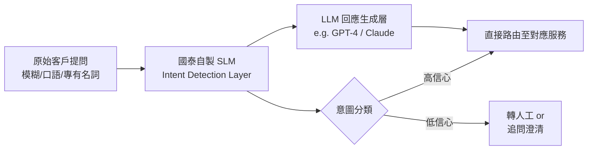
*架構關鍵洞察：SLM 作為輕量 routing 層，將在地語意理解與大模型生成能力分層，降低對單一 vendor API 的依賴。*

- 來源：[CIO Taiwan](https://www.cio.com.tw/114361/)
- 對客戶的具體含意：向 E.SUN、CTBC 等銀行提案時，以「國泰已跑 production SLM」為 peer pressure 切入點，主動提出 IBM watsonx 在 domain adaptation 與 data governance 上能提供的可重複框架，而非只賣 API 存取。

**(English)** Cathay Financial Debuts In-House Open-Source SLM for Local Financial Intent Detection at GTC Taipei

📖 **原文** Cathay Financial Holdings presented a self-trained open-source Small Language Model (SLM) at COMPUTEX GTC Taipei 2026, targeting the semantic understanding challenges specific to Taiwan's financial services context — including proprietary terminology, ambiguous queries, and local colloquialisms. This is a production deployment, not a POC, aimed at improving intent detection accuracy in customer service and core processes.

🧠 **推論** For IBM consultants, the signal is unambiguous: Taiwan's leading banks are no longer satisfied with direct GPT-4 / Claude API integration and are moving toward self-managed fine-tuning or domain-adapted SLMs — indicating that data sovereignty, latency, and local semantic control matter more to them than raw model capability.

🧠 **推論** When Livia pitches to other bank clients (E.SUN, CTBC, Taishin), Cathay can be deployed as a peer benchmark to create urgency: "The market leader is already running a custom SLM in production — your gap is widening."


*Key insight: The SLM acts as a lightweight routing layer, separating local semantic understanding from large-model generation — reducing single-vendor API dependency.*

- Source: [CIO Taiwan](https://www.cio.com.tw/114361/)
- Client implication: Use Cathay's production SLM as peer pressure when pitching E.SUN, CTBC, and similar banks — then position IBM watsonx's domain adaptation and data governance framework as the repeatable path, not just API access.

---

### 2. Anthropic 完成 $65B Series H，run-rate revenue 達 $470 億，方法論曝光

📖 **原文** Anthropic 宣布完成 $65B Series H 融資，並揭露 run-rate revenue 已於本月初突破 $470 億（約新台幣 1.5 兆）。Simon Willison 引用 Reuters Breakingviews 的說法，揭露計算方法：以最近 28 天的 consumption 收入乘以 13，加上月訂閱收入乘以 12。

🧠 **推論** 這個方法論值得特別注意——它不是 GAAP revenue，而是一種 annualized projection，在消費量快速成長的月份會顯著高估穩定營收。但即使打折，$47B run-rate 仍代表 Anthropic 的 enterprise adoption 速度遠超市場預期，並與 OpenAI 形成直接競爭格局，壓縮台灣銀行「觀望」的時間窗口。

🧠 **推論** 對 Livia 的戰略意義：當 Cathay、E.SUN 的 CIO 問「選 OpenAI 還是 Anthropic」，現在的答案是兩者都已到達不可忽視的市場規模，vendor lock-in 風險是真實的，IBM 的 multi-model abstraction 層（watsonx.ai）有了更具體的談判籌碼。

- 來源：[Simon Willison](https://simonwillison.net/2026/May/29/anthropic/#atom-everything) · [Reuters Breakingviews via Simon Willison](https://simonwillison.net/2026/May/31/anthropic-run-rate/#atom-everything)
- 對客戶的具體含意：在董事會簡報中，用 Anthropic $47B run-rate 的規模感說明 AI vendor 已成系統性基礎設施層，接著轉入 vendor concentration risk 論述，推 IBM 多模型治理框架。

**(English)** Anthropic Closes $65B Series H; Run-Rate Revenue Hits $47B with Methodology Now Public

📖 **原文** Anthropic announced a $65B Series H fundraise and disclosed that run-rate revenue crossed $47 billion earlier this month. Simon Willison, citing Reuters Breakingviews, exposed the calculation methodology: take the last 28 days of consumption-based sales and multiply by 13, then add monthly subscription revenue multiplied by 12.

🧠 **推論** The methodology deserves scrutiny — this is not GAAP revenue but an annualized projection that significantly overstates stable revenue in months of rapid consumption growth. Even discounted, however, a $47B run-rate signals enterprise adoption velocity that far exceeds market expectations and puts Anthropic in direct competition with OpenAI — compressing the "wait and see" window for Taiwan banks.

🧠 **推論** For Livia's strategic positioning: when Cathay or E.SUN CIOs ask "OpenAI or Anthropic?", the answer is now that both have reached undeniable market scale, vendor lock-in risk is real, and IBM's multi-model abstraction layer (watsonx.ai) has a more concrete negotiating anchor.

- Source: [Simon Willison](https://simonwillison.net/2026/May/29/anthropic/#atom-everything) · [Reuters Breakingviews via Simon Willison](https://simonwillison.net/2026/May/31/anthropic-run-rate/#atom-everything)
- Client implication: In board-level presentations, use Anthropic's $47B run-rate as the scale signal establishing AI vendors as systemic infrastructure, then pivot to vendor concentration risk to position IBM's multi-model governance framework.

---

### 3. iThome 2026 CIO 大調查：台灣大型企業 IT 預算成長從 13% 降至 9%，AI ROI 壓力浮現

📖 **原文** iThome 最新調查顯示，台灣大型企業 2026 年 IT 預算較去年成長 9%，平均每家約新台幣 2.8 億元，約占年營收 4%。相較去年 13% 的成長幅度，今年明顯放緩，策略重心轉向「能創造明確效益的項目」。

🧠 **推論** 這個訊號對 Livia 非常直接：台灣企業已度過「什麼都試」的初期 AI 投資熱，進入要求 measurable ROI 的第二階段。銀行客戶的 CIO 現在更可能問的是「這個 AI 專案的具體回報是什麼、多快看到」，而不是「我們應不應該做 AI」。

🧠 **推論** McKinsey MGI 的同期研究也指出，全球企業 AI ROI 的「loud silence」——廣泛公告 AI 投資的企業，鮮少公布實際獲利改善——與台灣的預算放緩形成一致敘事。Livia 在提案時若能提供量化的 business case 模板（例如 claims processing 縮短 X 天、NPS 提升 Y 點），將比競爭對手的概念簡報更有說服力。

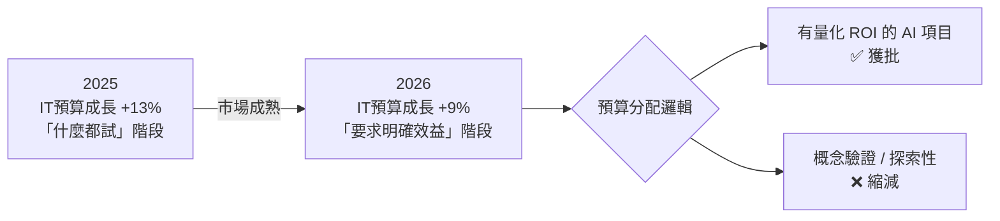
*關鍵洞察：台灣 CIO 已從「AI 探索者」轉型為「ROI 把關者」，提案必須附上可驗證的商業指標。*

- 來源：[iThome](https://www.ithome.com.tw/article/176335)
- 對客戶的具體含意：每份 IBM AI 提案必須附帶量化 business case（成本節省、處理時間、error rate），否則在 2026 年的台灣預算審查中將被排隊等候。

**(English)** iThome 2026 Taiwan CIO Survey: Enterprise IT Budget Growth Slows from 13% to 9% — AI ROI Pressure Surfaces

📖 **原文** iThome's latest survey shows Taiwan's large enterprises increased IT budgets by 9% in 2026, averaging NT$280 million per company and roughly 4% of annual revenue. Compared to 13% growth last year, the slowdown is marked, with strategic focus shifting explicitly toward "projects that generate measurable benefit."

🧠 **推論** For Livia, this signal is actionable and direct: Taiwan enterprises have passed the "try everything" phase of early AI investment and entered a second stage that demands measurable ROI. Bank CIOs are now more likely to ask "what is the concrete return and how fast?" rather than "should we do AI at all?"

🧠 **推論** McKinsey MGI's concurrent research echoes this with a global "loud silence" — enterprises widely announce AI investments but rarely report actual profit improvements — forming a consistent narrative with Taiwan's budget deceleration. Livia's proposals that include quantified business case templates (e.g., claims processing shortened by X days, NPS improved by Y points) will outcompete abstract concept decks.


*Key insight: Taiwan CIOs have shifted from "AI explorers" to "ROI gatekeepers" — proposals without verifiable business metrics will be queued indefinitely.*

- Source: [iThome](https://www.ithome.com.tw/article/176335)
- Client implication: Every IBM AI proposal must include a quantified business case (cost savings, processing time reduction, error rate improvement) — without it, 2026 Taiwan budget reviews will deprioritize the engagement.

---

## Watch list

繁中為主，每條一行：

- [NVIDIA Factory Operations Blueprint (FOX)](https://blogs.nvidia.com/blog/factory-operations-fox-blueprint-ai-brain/) — 台灣製造商（Foxconn、Wistron、Pegatron）的 AI 工廠架構參考設計，GTC Taipei 發表，值得追蹤是否有本地 pilot。
- [LangChain 金融總體研究 Agent：45 分鐘產出 13 章報告](https://www.langchain.com/blog/financial-ai-that-investigates-macro-trends-eu-economic-analysis-with-you-com-and-langchain) — 含 LangSmith tracing 的 production agent 架構，對銀行研究部門有直接參考價值，FinSearchComp 87.29% 分數可引用。
- [Travelers × OpenAI：全國部署 AI 理賠助理](https://openai.com/index/travelers) — 保險業 24/7 理賠 AI 的 production 案例，對國泰人壽、富邦保險等有參考性，但缺失敗模式與監管細節。
- [OpenAI 民主治理框架藍圖](https://openai.com/index/frontier-safety-blueprint) — 美國聯邦 AI 治理框架提案；台灣 AI 基本法草案討論中，可作為比較素材供法遵團隊參考。
- [Palo Alto Networks 收購 Portkey，強化 AI Agent 安全控制平面](https://www.cio.com.tw/114307/) — AI agent governance 的 control-plane 架構；對金融業合規團隊評估 agent 部署風險有實際意義。
- [NVIDIA：金融機構為何轉向 Transaction Foundation Model](https://blogs.nvidia.com/blog/financial-institutions-transaction-foundation-models/) — NVIDIA 的 BFSI 敘事框架，適合用來反問台灣銀行客戶「你們的 siloed fraud/credit model 能否整合」，但缺具體部署數據。
- [台積電股東會：High-NA EUV 暫緩量產、資本支出上修至 $560 億](https://www.inside.com.tw/article/41467-tsmc-shareholders-meeting-2026-cc-wei-capex-high-na-euv-dividends) — 台積電 capex 決策直接影響 AI 晶片供應鏈，對製造業客戶的 AI infrastructure 規劃有間接影響。
- [博通 AI 晶片 Q2 年增 143%，Q3 預測年增逾 200%](https://www.inside.com.tw/article/41469-broadcom-avgo-earnings-report-q2-2026) — AI 硬體需求持續加速的財務訊號，可作為「AI 投資熱不是泡沫」的反駁數據點。
- [McKinsey：AI ROI 普遍沉默——廣泛宣告卻鮮少公布獲利改善](https://www.mckinsey.com/mgi/media-center/the-future-of-ai-and-trade) — 與 iThome 調查呼應，為 Livia 的量化 ROI 論述提供全球層級的背書。
- [Databricks：AI 無法規模化，直到你停止叫它「創新」](https://www.databricks.com/blog/ai-doesnt-scale-until-you-stop-calling-it-innovation) — operationalization vs. innovation 的論述框架，適合用在說服台灣企業從 pilot 轉 production 的對話。
- [Stanford AI Index 2026 解析：jagged frontier、初級技術職消失、中美競賽](https://share.transistor.fm/s/302b36f8) — 董事會層級 AI 現況 framing，"jagged frontier" 概念（能贏數學奧林匹克但讀不懂類比時鐘）對客戶說明 AI 局限性很有用。
- [LangChain：Model Neutrality — 避免 AI Vendor Lock-in 的論據](https://www.langchain.com/blog/model-neutrality) — vendor-interested 視角但論點實在，可作為反向參考：了解 lock-in 如何在 harness 層發生，強化 IBM watsonx 多模型治理的對比說明。
- [Foxconn Interconnect 執行長 Sidney Lu × McKinsey：三年一個「Wow Factor」的製造策略](https://www.mckinsey.com/featured-insights/future-of-asia/leading-asia/the-next-wow-factor-a-conversation-with-sidney-lu-chairman-and-ceo-foxconn-interconnect-technology) — 訪談摘要太模糊，需讀全文確認是否有具體 AI/自動化內容，再決定是否帶入 Foxconn 客戶對話。
- [美國資料中心電力危機：明年預計落成的 60% 尚未動工](https://technews.tw/2026/06/04/power-crisis-us-data-centers-60-unstarted-next-year/) — AI infrastructure 供應瓶頸的反向論據，對台灣製造商評估美國 AI capex 風險有參考價值。

---

## Verification hints

This briefing contains **6

🧠 **推論**** segments and **0

⚠️ **假設**** segments. Before citing in client conversations, verify these specific points (English for language-learning practice):

1. **Cathay SLM production status**: The CIO Taiwan excerpt states intent and GTC Taipei presentation, but does not confirm the model is live in production customer-facing systems vs. internal staging. Verify at [CIO Taiwan](https://www.cio.com.tw/114361/) whether "production deployment" is explicitly stated or inferred from presentation context.
2. **Anthropic $47B run-rate methodology**: Simon Willison cites "a person familiar with the matter" via Reuters Breakingviews — this is not Anthropic's official disclosure. The 28-day × 13 formula is a secondhand report. Verify against Anthropic's official Series H announcement or any subsequent investor communication before citing the number with clients.
3. **iThome survey sample and methodology**: The 9% growth figure and NT$280M average are from iThome's CIO survey. Before citing to bank CIOs, verify the sample size, which industries are included (is "large enterprise" defined the same way across years?), and whether financial services is broken out separately from manufacturing at [iThome](https://www.ithome.com.tw/article/176335).
4. **McKinsey "loud silence" claim**: The McKinsey MGI excerpt states broadly that "broad-based AI profit improvements haven't happened yet" — this is an editorial claim, not a quantified study finding. Verify whether the full report contains sector-specific data or is primarily qualitative framing before using it as evidence in board presentations.
5. **LangChain FinSearchComp 87.29% score**: The score references arXiv 2509.13160. Confirm this benchmark evaluates financial research tasks relevant to Taiwan bank use cases (e.g., Chinese-language financial documents, local regulatory filings) rather than English-only or EU-specific datasets. Source: [LangChain blog](https://www.langchain.com/blog/financial-ai-that-investigates-macro-trends-eu-economic-analysis-with-you-com-and-langchain).
6. **NVIDIA FOX Blueprint — Taiwan deployment**: The NVIDIA announcement was made at GTC Taipei / COMPUTEX but does not specify which Taiwan manufacturers (Foxconn, Wistron, Pegatron) are piloting the reference architecture vs. merely receiving a roadmap briefing. Verify at [NVIDIA blog](https://blogs.nvidia.com/blog/factory-operations-fox-blueprint-ai-brain/) before citing specific local adoption to manufacturing clients.2026-06-04 23:49:51,362 INFO pillar 3 (Frontier 能力 + 模型動向): 20 high-signal items (min_signal=0.60)

---

<a id="pillar-3"></a>

## 🚀 Pillar 3 — Frontier 能力 + 模型動向
_20 items · $0.0831_

## Pulse — Pillar 3：Frontier 能力 + 模型動向

### Top 3

---

### 1. Anthropic 以 $965B Series H 融資 + Opus 4.8 發布，宣告 2026 frontier 格局重組

🧠 **推論** Anthropic 完成史上最大單輪 AI 融資（$965B Series H），同期釋出 Opus 4.8 與 Dynamic Workflows/ultracode 功能。

🧠 **推論** 融資規模意味著 Anthropic 正在為長週期 compute 投入（訓練 + 推論基礎設施）預存資本，而非短期擴張營業收入；Opus 4.8 的命名暗示版本疊代速度顯著提升，比 Opus 3 的週期大幅縮短。

⚠️ **假設** Dynamic Workflows 功能可能對應多步驟 agentic orchestration，ultracode 則對應大型 codebase 的自動化開發，但產品細節尚需確認。對 Livia 的 IBM 客戶提案而言，Anthropic 的財務實力現在足以抗衡 OpenAI，讓「雙供應商策略」對 Cathay、E.SUN 等台灣銀行更具說服力。

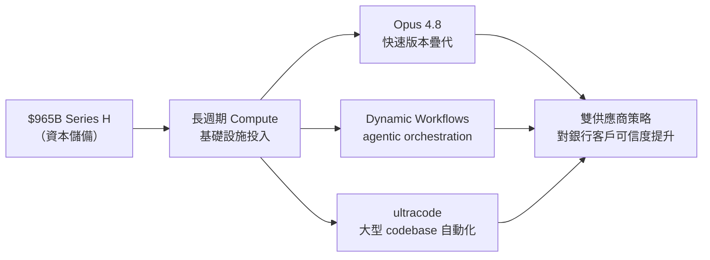

關鍵洞察：資本規模直接轉化為模型疊代速度，使 Anthropic 從「安全替代方案」升格為「對等競爭者」。

- 來源：[Latent Space / swyx](https://www.latent.space/p/ainews-anthropic-raises-965b-series)
- 對客戶的具體含意：向 Cathay、CTBC 提案時可明確說明「OpenAI + Anthropic 雙軌部署」不再是分散風險的妥協方案，而是兩個財務可持續的 frontier 供應商並列，降低單一廠商鎖定風險。

---

**(English)** Anthropic closes $965B Series H + releases Opus 4.8, signaling a 2026 frontier reset

🧠 **推論** Anthropic closed the largest single-round AI funding in history ($965B Series H) while simultaneously releasing Opus 4.8 and Dynamic Workflows/ultracode capabilities.

🧠 **推論** At this scale, the raise is best read as pre-positioning capital for long-cycle compute investment (training + inference infrastructure) rather than near-term revenue scaling; the Opus 4.8 naming suggests a meaningfully faster iteration cadence than the gap between Claude 2 and 3.

⚠️ **假設** Dynamic Workflows likely maps to multi-step agentic orchestration, and ultracode to large-codebase automation — but product specifics need verification before citing to clients. For Livia's IBM pitch, Anthropic's financial position now credibly matches OpenAI's, making a dual-vendor architecture genuinely defensible rather than a hedge.


Key insight: Capital at this scale directly converts to iteration speed, elevating Anthropic from "safe alternative" to "peer competitor."

- Source: [Latent Space / swyx](https://www.latent.space/p/ainews-anthropic-raises-965b-series)
- Client implication: When pitching Cathay or CTBC, you can now frame "OpenAI + Anthropic dual deployment" not as a risk-mitigation compromise but as two financially durable frontier vendors running in parallel, genuinely reducing single-vendor lock-in.

---

### 2. NVIDIA Cosmos 3：製造業與物流自主系統的 world model 正式進入生產前沿

📖 **原文** NVIDIA Cosmos 3 讓 physical AI 系統（機器人、自駕車、智慧工廠）能「不只理解看到的，還能預測接下來會發生什麼」——倉庫機器人遇到未見過的物件配置、自駕車預判行人突然出現、工廠安全系統預測堆高機路徑。

🧠 **推論** 這代表 world model 的生產應用已從研究論文進入 NVIDIA 有商業利益的產品佈局，對 Foxconn、Wistron、Pegatron 等台灣製造商的廠區自動化具有直接採購決策相關性。

⚠️ **假設** Cosmos 3 是否已有台灣製造業客戶的 pilot deployment 尚不明確，但 NVIDIA 在台灣的供應鏈關係（TSMC 為核心 compute 供應商）使落地速度可能快於歐美競品。

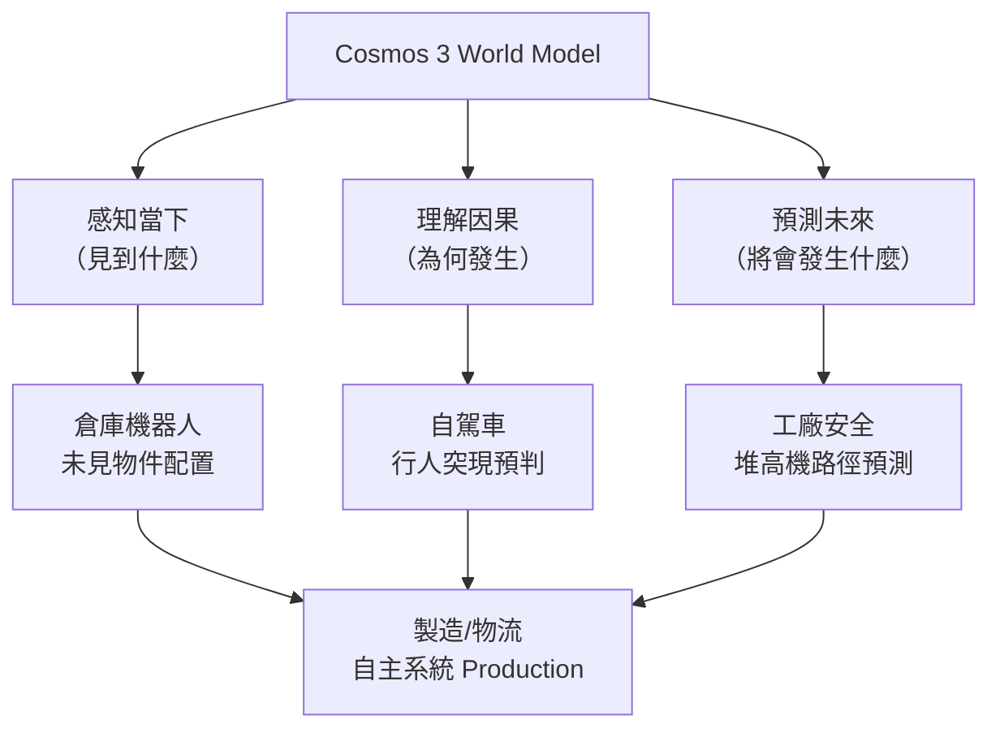

關鍵洞察：「預測未來狀態」是 physical AI 從「反應式」躍升為「主動式」的核心能力躍遷，Cosmos 3 把這個能力系統化封裝。

- 來源：[NVIDIA Research Blog](https://blogs.nvidia.com/blog/cosmos-3-physical-ai-open-world-foundation-model/)
- 對客戶的具體含意：向 Foxconn、Wistron 提案時，可將 Cosmos 3 定位為「工廠異常預測 + 機器人安全圍欄」的 foundation model 層，IBM 可在其上疊加流程整合與 MLOps 服務。

---

**(English)** NVIDIA Cosmos 3: World models for physical AI enter the production frontier for manufacturing and logistics

📖 **原文** NVIDIA's Cosmos 3 enables physical AI systems — robots, autonomous vehicles, smart factory safety systems — to not only understand what they see and what caused it, but to predict what will happen next: warehouse robots encountering unseen object configurations, AVs anticipating pedestrians stepping out suddenly, factory safety systems forecasting forklift paths.

🧠 **推論** This signals that world model production applications have moved from research papers into NVIDIA's commercially-backed product roadmap, making it directly relevant to procurement decisions at Foxconn, Wistron, and Pegatron.

⚠️ **假設** Whether Cosmos 3 already has Taiwan manufacturing pilot deployments is unconfirmed, but NVIDIA's deep supply-chain ties in Taiwan (with TSMC as its core compute supplier) may accelerate local adoption faster than Western competitors.


Key insight: "Predicting future state" is the capability leap that moves physical AI from reactive to proactive — Cosmos 3 packages this systematically.

- Source: [NVIDIA Research Blog](https://blogs.nvidia.com/blog/cosmos-3-physical-ai-open-world-foundation-model/)
- Client implication: When pitching Foxconn or Wistron, position Cosmos 3 as the foundation model layer for factory anomaly prediction and robot safety fencing, with IBM layering process integration and MLOps services on top.

---

### 3. Microsoft MAI 模型家族：1T 參數 + 35B active，MoE 效率策略正式對標 OpenAI

📖 **原文** Microsoft 發布 MAI-Thinking-1（推理模型，1T 參數，35B active，限定早期合作夥伴）與 MAI-Code-1-Flash（137B 參數，5B active，目標 GitHub Copilot / VS Code 個人用戶）。

🧠 **推論** 35B active / 1T total 的 sparse MoE 架構顯示 Microsoft 正在走「高容量但低推論成本」路線——與 Mistral、NVIDIA Nemotron 的策略趨同；這讓 Microsoft 在企業部署場景（Azure 計費與延遲敏感應用）具備更強競爭力，而不只靠 OpenAI API 轉售。

🧠 **推論** MAI-Code-1-Flash 的 5B active 參數針對 IDE 即時補全，意味著 Microsoft 正在用自有模型取代部分 GPT-4o 在 Copilot 中的角色，降低對 OpenAI 的依賴——這對 IBM 的競爭分析有直接戰略意義。

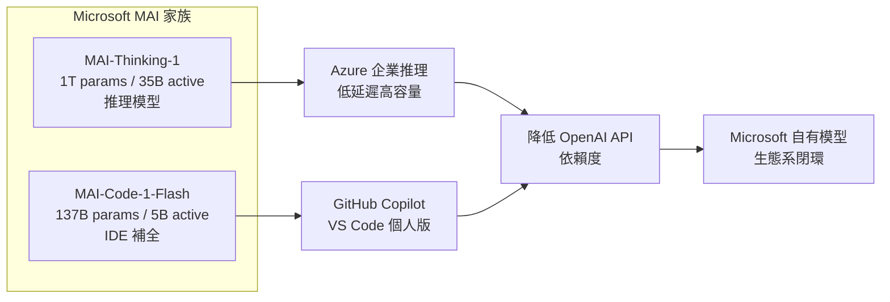

關鍵洞察：Microsoft 從 OpenAI 的最大客戶，正在演化為其最強競爭對手之一——這個架構轉變值得向銀行客戶解釋「供應商策略風險」時引用。

- 來源：[Simon Willison](https://simonwillison.net/2026/Jun/2/microsofts-new-models/#atom-everything) · [Latent Space / swyx](https://www.latent.space/p/ainews-microsoft-build-mai-thinking)
- 對客戶的具體含意：台灣銀行若正在評估 Azure OpenAI 長期合約，應在合約中明確區分「OpenAI 模型 API」與「Microsoft 自有 MAI 模型」的 SLA 與定價條款，避免未來供應商切換造成應用層級的回歸測試負擔。

---

**(English)** Microsoft MAI model family: 1T params / 35B active, MoE efficiency strategy formally challenges OpenAI

📖 **原文** Microsoft released MAI-Thinking-1 (reasoning model, 1T parameters, 35B active, limited to select early partners) and MAI-Code-1-Flash (137B parameters, 5B active, targeting GitHub Copilot and VS Code individual users).

🧠 **推論** The sparse MoE architecture at 35B active / 1T total signals Microsoft is pursuing a "high capacity, low inference cost" play — converging with Mistral and NVIDIA Nemotron strategies — giving Microsoft stronger enterprise deployment economics on Azure (billing sensitivity, latency-critical apps) beyond simply reselling OpenAI APIs.

🧠 **推論** MAI-Code-1-Flash's 5B active parameters target IDE real-time completion, meaning Microsoft is replacing portions of GPT-4o's role in Copilot with its own model — reducing OpenAI dependency in a way that has direct strategic implications for IBM's competitive analysis.


Key insight: Microsoft is evolving from OpenAI's largest customer into one of its strongest competitors — this structural shift is exactly the vendor-strategy risk framing Taiwan bank clients need to hear.

- Source: [Simon Willison](https://simonwillison.net/2026/Jun/2/microsofts-new-models/#atom-everything) · [Latent Space / swyx](https://www.latent.space/p/ainews-microsoft-build-mai-thinking)
- Client implication: Taiwan banks currently evaluating long-term Azure OpenAI contracts should explicitly distinguish "OpenAI model API" from "Microsoft MAI model" in SLA and pricing terms, to avoid regression-testing burden if Microsoft migrates workloads to its own models.

---

## Watch list

繁中為主，每條一行：

- [Latent Space — Video Agents / xAI Grok Imagine](https://www.latent.space/p/video-agents) — xAI 以 3 個月建出 Grok Imagine，video agent 架構細節值得追蹤，可能影響台灣媒體/廣告科技客戶評估時程
- [Hugging Face — EVA-Bench Data 2.0](https://huggingface.co/blog/ServiceNow-AI/eva-bench-data) — 涵蓋航空、ITSM、HR 三大企業域的 voice agent 基準，121 工具 213 情境，可直接對應銀行客服 bot 評估框架
- [Interconnects — Open vs Closed Models on Different Exponentials](https://www.interconnects.ai/p/open-and-closed-models-are-on-different) — Nathan Lambert 分析開源 vs 閉源模型的能力成長曲線差異，對 IBM 採購建議有戰略參考價值
- [NVIDIA — Transaction Foundation Models for Financial Institutions](https://blogs.nvidia.com/blog/financial-institutions-transaction-foundation-models/) — NVIDIA 推 BFSI 專用 transaction FM 框架，缺乏具體 bank deployment 數據，但語彙可用於與台灣行庫的初期對話
- [Hugging Face — Holo3.1 Computer Use Agents](https://huggingface.co/blog/Hcompany/holo31) — 本地端 computer-use agent，支援 web/desktop/mobile，適合評估是否可替代 RPA 在製造業的角色
- [Hugging Face — Mellum2 12B MoE by JetBrains](https://huggingface.co/blog/JetBrains/mellum2-launch) — 2.5B active 參數 MoE，Apache 2.0，適合台灣製造商在私有環境部署 coding sub-agent，無授權風險
- [Google / iThome — Gemma 4 12B on-device](https://www.ithome.com.tw/news/176366) — encoder-free 多模態，記憶體不到 26B 一半但推理力相當，筆電可跑，適合評估行員端 local AI 場景
- [OpenAI — ChatGPT Dreaming Memory System](https://openai.com/index/chatgpt-memory-dreaming) — 跨對話持久記憶新架構，銀行客服 bot 的個人化應用值得追蹤，但 architectural detail 尚不足以工程落地
- [Import AI 459 — AI oversight + scaling laws](https://jack-clark.net/2026/06/01/import-ai-459-ai-oversight-is-difficult-scaling-laws-for-protein-folding-models-and-pricing-the-extinction-risk-of-ai-systems/) — Jack Clark 的 oversight 框架與蛋白質折疊 scaling law 分析，適合準備銀行 AI 治理對話的背景閱讀
- [Stanford AI Index 2026 — Practical AI Breakdown](https://share.transistor.fm/s/302b36f8) — Jagged frontier 概念（AI 能贏數學奧林匹克但看不懂類比時鐘）是向非技術董事會解釋 AI 能力邊界的最佳比喻

---

## Verification hints

This briefing contains **5

🧠 **推論** segments** and **3

⚠️ **假設** segments**. Before citing in client conversations, verify these specific points (English for language-learning practice):

1. **Anthropic $965B Series H amount and Opus 4.8 feature scope**: The Latent Space excerpt is a one-liner ("Total Anthropic victory!") — verify the actual funding figure, Series H close date, and whether "Dynamic Workflows" and "ultracode" are official product names or community labels at [Anthropic's official announcement](https://www.anthropic.com) before citing to clients.

2. **MAI-Thinking-1 early partner availability**: Simon Willison's excerpt states it's available to "select early partners" only — confirm whether any Taiwan-based Azure enterprise customers qualify, and whether Microsoft has published independent benchmark comparisons against GPT-4.5 or Claude Opus 4.8 before using in a competitive slide.

3. **Cosmos 3 Taiwan manufacturing pilot deployments**: The NVIDIA blog describes capability framing for warehouses and factories but does not name specific customers — do not imply to Foxconn or Wistron that Cosmos 3 is already deployed in comparable Taiwan facilities without a confirmed customer reference.2026-06-04 23:51:24,420 INFO pillar 4 (Harness Engineering 實作技藝): 40 high-signal items (min_signal=0.60)

---

<a id="pillar-4"></a>

## 🛠️ Pillar 4 — Harness Engineering 實作技藝
_40 items · $0.1023_

## Pulse — Top 3

### 1. LangGraph 生產容錯三原語：RetryPolicy、TimeoutPolicy、SAGA 模式正式落地

📖 **原文** LangGraph 在 production agent 中內建三種容錯原語：`RetryPolicy`（指數退避自動重試）、`TimeoutPolicy`（wall-clock 與 idle 雙重上限）、`error_handler`（重試耗盡後的清理邏輯），並支援 SAGA 模式處理跨步驟有副作用的 workflow。

🧠 **推論** 這些原語被放在 workflow engine 內部而非外層 wrapper，代表狀態圖本身就能感知失敗並回滾，而不需要呼叫方重新設計錯誤處理邏輯——這對 Livia 示範「銀行 agent 可靠性如何保證」的對話至關重要。

🧠 **推論** 台灣銀行的 compliance team 常問「agent 失敗了怎麼辦」，這套命名清楚的 primitive 可直接拿來回答。

下圖說明三種原語如何在 LangGraph workflow engine 內部組合，SAGA 負責副作用回滾。

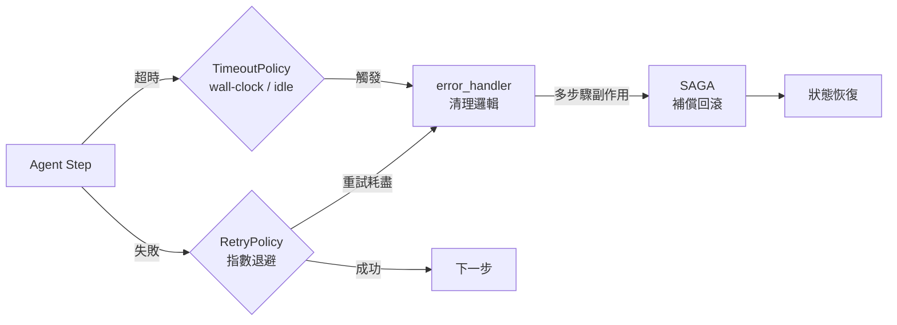

關鍵洞察：容錯邏輯在 engine 層而非 caller 層，意味著 SAGA 回滾可跨越整個 stateful workflow，而非僅限單一 API call。

- 來源：[LangChain Blog — Fault Tolerance in LangGraph](https://www.langchain.com/blog/fault-tolerance-in-langgraph)
- 對客戶的具體含意：向國泰、富邦的技術評估委員會展示時，可直接用 RetryPolicy + SAGA 命名回答「agent 失敗了怎麼辦」，比泛說「我們有錯誤處理」更具說服力。

**(English)** LangGraph's production fault-tolerance primitives — RetryPolicy, TimeoutPolicy, SAGA — land in the workflow engine itself.

[Original] LangGraph ships three fault-tolerance primitives baked into the workflow engine: `RetryPolicy` (automatic retries with exponential backoff), `TimeoutPolicy` (wall-clock and idle-based caps), and `error_handler` (cleanup once retries are exhausted), composable with a SAGA pattern for multi-step workflows with real-world side effects. [Inference] Placing these inside the engine — not a wrapper — means the state graph itself can detect failure and roll back without requiring callers to redesign error handling; this directly answers the "what happens when the agent fails?" question Taiwan bank compliance teams inevitably ask. [Inference] The named primitives give Livia a concrete, vendor-agnostic vocabulary to use in technical evaluation meetings.

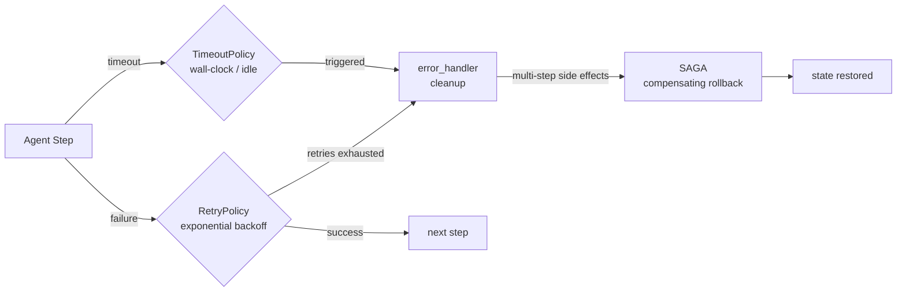

Key insight: fault logic lives at the engine layer, so SAGA rollback spans the entire stateful workflow — not just a single API call.

- Source: [LangChain Blog — Fault Tolerance in LangGraph](https://www.langchain.com/blog/fault-tolerance-in-langgraph)
- Client implication: In technical evaluation meetings with Cathay or Taipei Fubon, name RetryPolicy + SAGA explicitly when answering reliability questions — it signals production-grade thinking, not prototype-grade hope.

---

### 2. Anthropic 公開 Claude 跨產品 Sandboxing 架構：Process、VM、Filesystem、Egress 四層控制

📖 **原文** Anthropic 發布 Claude 跨產品（Claude.ai、Claude Code、Cowork）的 sandbox 完整技術文件，明確揭示四層約束機制：process sandbox、VM 隔離、filesystem boundary、egress control。Simon Willison 特別指出，這類文件在業界極為罕見——大多數 sandboxing 產品缺乏充分的技術說明。

🧠 **推論** 對 Livia 而言，這份文件有雙重用途：（1）作為 harness portfolio 的安全設計參考，展示「production-grade containment 長什麼樣」；（2）向台灣銀行客戶的資安長說明，業界領先的 AI vendor 如何在 agent 具備 tool-use 能力時防止逸出。

⚠️ **假設** 文件細節尚未在摘要中揭露，實際的 egress whitelist 規則與 VM isolation 強度需直接閱讀原文確認。

下圖為 Anthropic 四層 containment 架構在 Claude Code 場景下的示意：

```mermaid
flowchart TD
    A[Claude Agent\n推理層] --> B[Process Sandbox\n限制系統呼叫]
    B --> C[VM Isolation\n獨立虛擬機]
    C --> D[Filesystem Boundary\n只讀 / 限定路徑]
    C --> E[Egress Control\n網路出口白名單]
    D --> F[受保護的執行環境]
    E --> F
```

關鍵洞察：四層控制彼此獨立可疊加，任一層被繞過仍有其餘層阻擋，這是 defense-in-depth 原則在 agent containment 的具體實現。

- 來源：[Simon Willison — How we contain Claude across products](https://simonwillison.net/2026/May/30/how-we-contain-claude/#atom-everything)
- 對客戶的具體含意：向台灣銀行資安長簡報 AI agent 部署風險時，可引用此四層框架作為你自建 harness 的安全對標，而非憑空保證。

**(English)** Anthropic publishes full sandboxing architecture for Claude across Claude.ai, Claude Code, and Cowork: four containment layers documented publicly.

[Original] Anthropic released a thorough technical overview of how sandbox techniques work across all Claude products, specifying four constraint mechanisms: process sandboxes, VM isolation, filesystem boundaries, and egress controls. Simon Willison noted this level of documentation is unusually rare in the industry — most sandboxing products leave practitioners guessing. [Inference] For Livia's harness portfolio, this document serves two purposes: (1) a security design reference showing what production-grade containment looks like in practice; (2) a credible third-party anchor when briefing Taiwan bank CISOs on how leading AI vendors prevent agent escape when tool-use is enabled. [Assumption] The excerpt does not expose the detailed egress whitelist rules or VM isolation specifics — read the full Anthropic doc before citing exact technical claims with clients.

```mermaid
flowchart TD
    A[Claude Agent\nreasoning layer] --> B[Process Sandbox\nsyscall restriction]
    B --> C[VM Isolation\ndedicated VM]
    C --> D[Filesystem Boundary\nread-only / scoped paths]
    C --> E[Egress Control\nnetwork allowlist]
    D --> F[Protected Execution Environment]
    E --> F
```

Key insight: the four layers are independently stackable — a bypass of one does not defeat the others, implementing defense-in-depth for agent containment.

- Source: [Simon Willison — How we contain Claude across products](https://simonwillison.net/2026/May/30/how-we-contain-claude/#atom-everything)
- Client implication: When briefing bank CISOs on agentic AI deployment risk, anchor your security claims to this four-layer framework rather than asserting safety in the abstract.

---

### 3. LangGraph DeltaChannel：O(N²) Checkpoint 儲存問題的具體修復，Deep Agents v0.6 預設啟用

📖 **原文** LangGraph 1.2 推出 `DeltaChannel`：每一步只儲存 state diff，週期性寫入完整 snapshot，解決 long-running agent 全量 checkpoint 導致的 O(N²) 儲存增長問題。此功能在 Deep Agents v0.6 預設啟用，無需任何設定變更或資料遷移。

🧠 **推論** 這對 Livia 在銀行或製造客戶的 pilot 示範有直接成本意義：long-running research agent 或 multi-step process automation 的 session 越長，O(N²) 問題越顯著，DeltaChannel 使儲存成本從二次方降為線性，讓「幾小時跑完的 agent」在成本上變得可行。

🧠 **推論** Deep Agents v0.6 同期還附帶 code interpreter、harness profiles、streaming v3、ContextHub，整包更新值得作為 harness portfolio milestone 追蹤。

- 來源：[LangChain Blog — Delta Channels: How We're Evolving our Runtime for Long-Running Agents](https://www.langchain.com/blog/delta-channels-evolving-agent-runtime)
- 來源（v0.6 全覽）：[LangChain Blog — New in Deep Agents v0.6](https://www.langchain.com/blog/deep-agents-0-6)
- 對客戶的具體含意：若向台新或中信展示跑超過一小時的 research agent demo，主動提及 DeltaChannel 把 checkpoint 成本從二次方壓成線性——這是「可以 scale 到生產」的具體技術證據。

**(English)** LangGraph DeltaChannel fixes the O(N²) checkpoint storage problem for long-running agents; ships as default in Deep Agents v0.6 with zero config changes required.

[Original] LangGraph 1.2 introduces `DeltaChannel`: each step checkpoints only the state diff, with periodic full snapshots, eliminating the O(N²) storage growth that occurs when long-running agents checkpoint full state at every step. It ships as the default in Deep Agents v0.6 — no config changes, no data migration. [Inference] For Livia's bank and manufacturer pilot demos, this has direct cost implications: the longer the agent session (multi-hour research runs, multi-step process automation), the more severe the O(N²) penalty. DeltaChannel converts storage costs from quadratic to linear, making hour-long agents financially viable in production. [Inference] Deep Agents v0.6 also bundles a code interpreter, harness profiles, streaming v3, and ContextHub — the full release is worth treating as a harness portfolio milestone.

- Source: [LangChain Blog — Delta Channels: Evolving the Runtime for Long-Running Agents](https://www.langchain.com/blog/delta-channels-evolving-agent-runtime)
- Source (v0.6 full release): [LangChain Blog — New in Deep Agents v0.6](https://www.langchain.com/blog/deep-agents-0-6)
- Client implication: When demoing multi-hour research agents to Taishin or CTBC, proactively cite DeltaChannel's quadratic-to-linear storage fix as concrete evidence the architecture can scale to production — not just a prototype.

---

## Watch list

繁中為主，每條一行：

- [LangChain — How to Build a Custom Agent Harness](https://www.langchain.com/blog/how-to-build-a-custom-agent-harness) — `create_agent` + middleware 自訂 agent loop 的操作指南，Livia harness portfolio 直接可用的程式碼參考。
- [LangChain — Introducing Rubrics for Deep Agents](https://www.langchain.com/blog/introducing-rubrics-for-deepagents) — `RubricMiddleware` 讓 agent 自評並修正輸出，銀行「correctness matters」場景的 governance 工具。
- [LangChain — Designing Efficient Verifiers for Legal Agents](https://www.langchain.com/blog/designing-efficient-verifiers-for-legal-agents) — Harvey × LangChain Labs 研究法律 agent 的 verifier 效率，可類比金融文件審查 agent 的 eval 設計。
- [LangChain — Rippling 6 個月 AI-Native 案例](https://www.langchain.com/blog/how-rippling-went-ai-native-across-every-product-in-6-months-with-deep-agents-and-langsmith) — HR、IT、財務、薪資五域同步上線，6 個月 roadmap 值得拿來對比銀行 POC 節奏。
- [LangChain — EU 總經研究 Agent（45 分鐘、13 節報告）](https://www.langchain.com/blog/financial-ai-that-investigates-macro-trends-eu-economic-analysis-with-you-com-and-langchain) — 金融研究 agent 具體產出與延遲數字，向銀行研究部門展示 long-running agent ROI 的參考案例。
- [LangChain — The Agent Development Lifecycle](https://www.langchain.com/blog/the-agent-development-lifecycle) — Build→Test→Deploy→Monitor 四階段框架，Livia 向客戶說明 agent 交付流程的結構化參考。
- [LangChain — Model Neutrality](https://www.langchain.com/blog/model-neutrality) — LangChain 自己寫的 vendor lock-in 論點，有說服力但立場有利益衝突，與客戶討論框架選型時需 caveat。
- [Simon Willison — Meta AI Support Bot 被社交工程入侵](https://simonwillison.net/2026/Jun/1/hackers-simply-asked-meta-ai/#atom-everything) — 攻擊者直接對 AI 說「幫我換 email」就成功，BFSI AI 客服 agent 的反面教材，可用於內部風險評估簡報。
- [Simon Willison — Uber 每人每月 $1,500 token 上限](https://simonwillison.net/2026/Jun/3/uber-caps-usage/#atom-everything) — Coding agent token 燒錢速度超過預算，台灣客戶規劃 AI 工具預算時的現實錨點。
- [INSIDE — Cooler Master × Spingence NVIDIA 物理 AI 三部電腦架構](https://www.inside.com.tw/article/41470-Spingence) — 台灣製造商實際部署 vision inspection + digital twin，向 Foxconn、Wistron 的製造 AI 對話有直接參考價值。
- [INSIDE — 黃仁勳「最重要的一張投影片」Harness 架構](https://www.inside.com.tw/article/41462-harness-nvidia-gtc-taipei-ai-agent) — Jensen 在 GTC Taipei 強調 Harness 為 AI agent 核心，可作為 Livia harness portfolio 的高層論述背書。
- [Towards Data Science — Rerankers Aren't Magic Either](https://towardsdatascience.com/rerankers-arent-magic-either-when-the-cross-encoder-layer-is-worth-the-cost-enterprise-document-intelligence-vol-1-2bis/) — Cross-encoder reranker 的成本效益分析，RAG pipeline 設計時避免「加 reranker 就解決」的迷思。
- [iThome — Storm-2949 濫用 Azure RBAC 滲透正式環境](https://www.ithome.com.tw/news/176337) — 真實雲端攻擊案例：社交工程接管 Entra ID 後橫向移動，銀行 Azure 部署的安全審計警示。
- [Hugging Face — EVA-Bench 2.0：3 域、121 工具、213 情境](https://huggingface.co/blog/ServiceNow-AI/eva-bench-data) — 語音 agent 跨域 benchmark，航空 CSM + 企業 ITSM 的失敗模式命名清楚，可借鑒設計銀行 voice agent 評估方法。
- [NVIDIA — Factory Operations Blueprint (FOX)](https://blogs.nvidia.com/blog/factory-operations-fox-blueprint-ai-brain/) — 工廠 AI 參考架構，整合機台訊號、品質系統、工作指令，向 TSMC、Foxconn 的工廠 AI 對話的架構語彙。
- [Latent Space — Andon Labs VendingBench eval 方法](https://www.latent.space/p/andon) — 從 Haiku 到 Mythos 的 Claude eval 框架，frontier eval 方法論值得 harness portfolio 的 eval 層參考。
- [OpenAI — Wasmer 用 GPT-5.5 Codex 建 Node.js Runtime，10-20x 加速](https://openai.com/index/wasmer) — 具體加速數字與交付時間（週而非月），向客戶說明 coding agent ROI 時的外部佐證。
- [Towards Data Science — C++ 後端消除 GPU Padding 浪費](https://towardsdatascience.com/i-built-a-c-backend-so-my-gpu-would-stop-eating-air/) — Sequence packing 消除 LLM inference padding overhead 的 C++ 實作，基礎設施優化參考。

---

## Verification hints

This briefing contains **4**

🧠 **推論** segments and **1**

⚠️ **假設** segment. Before citing in client conversations, verify these specific points (English for language-learning practice):

1. **LangGraph RetryPolicy / TimeoutPolicy / SAGA composition** — The excerpt describes all three primitives and the SAGA pattern as shipping features. Verify in the [LangGraph docs](https://www.langchain.com/blog/fault-tolerance-in-langgraph) that `RetryPolicy` and `TimeoutPolicy` are production-stable (not experimental) API, and that SAGA is first-class rather than a usage pattern built on top of error_handler.
2. **Anthropic sandboxing: egress control specifics** — The excerpt confirms four containment layers exist (process, VM, filesystem, egress) but does not detail whitelist rules or VM hypervisor technology. Read the [full Anthropic engineering post](https://simonwillison.net/2026/May/30/how-we-contain-claude/#atom-everything) and follow the linked primary source before claiming specific egress controls to a bank CISO.
3. **DeltaChannel O(N²) → linear storage claim** — The excerpt states checkpointing full state grows at O(N²) and DeltaChannel fixes this. Verify whether O(N²) refers to total storage over a session (number of steps × state size) and confirm "periodic full snapshots" frequency is configurable vs. fixed — this affects cost modeling for very long sessions.
4. **Deep Agents v0.6 "no config changes or data migration"** — The excerpt asserts zero-friction upgrade. Verify this claim against the [v0.6 release notes](https://www.langchain.com/blog/deep-agents-0-6), particularly for teams running LangGraph 1.1 or below, where schema changes could require explicit migration.
5. **Meta AI social engineering attack verification** — Simon Willison states he verified this from multiple sources, but the excerpt does not name them. Before using this as a BFSI risk briefing example, locate the original Wired/Bloomberg/404 Media reporting and confirm the attack vector (direct AI instruction vs. account recovery flow exploitation) before presenting to bank clients.2026-06-04 23:53:11,197 INFO pillar 5 (學派 / 社群 / 思想動態): 13 high-signal items (min_signal=0.60)

---

<a id="pillar-5"></a>

## 🌐 Pillar 5 — 學派 / 社群 / 思想動態
_13 items · $0.0667_

## Pulse — Top 3

### 1. 黃仁勳在 GTC Taipei 點名「Harness」為 AI Agent 最關鍵架構組件

🧠 **推論** 黃仁勳在 GTC Taipei 長達數小時的技術演說中，將一張 AI agent 核心架構投影片稱為「最重要的一張」，其中 harness 被定位為串連 reasoning engine、tool use、memory 與 orchestration 的核心層。

🧠 **推論** 這對 Livia 的 harness engineer 定位直接形成市場驗證：當全球最具影響力的 AI 硬體領導者在台灣客戶面前用相同語言描述你正在建構的東西，它就不再是技術術語，而是採購對話的入場券。

⚠️ **假設** 演講內容細節尚未完整公開，以下架構圖為根據 NVIDIA 一般 agentic 框架推論重建。

以下為黃仁勳所指 AI Agent Harness 架構的推論重建：

```mermaid
flowchart LR
    A[User / Task Input] --> B[Harness Layer]
    B --> C[Reasoning Engine\ne.g. Claude / MAI]
    B --> D[Tool Registry\nAPIs / DB / RPA]
    B --> E[Memory Store\nshort + long term]
    B --> F[Orchestrator\nplanning + retry]
    C & D & E & F --> G[Action / Output]
    G -->|eval feedback| B
```

此圖的關鍵洞察：Harness 不是 LLM 的包裝，而是讓 LLM 可被信賴地部署在生產環境的治理與控制層。

- 來源：[INSIDE 硬塞](https://www.inside.com.tw/article/41462-harness-nvidia-gtc-taipei-ai-agent)
- 對客戶的具體含意：與台灣銀行或製造商客戶談 AI agent 導入時，可直接引用黃仁勳的 harness 框架，將 Livia 的 pipeline 建構經驗定位為「Jensen 說最重要的那一層」的實作能力。

**(English)** Jensen Huang names "Harness" as the most critical AI Agent architecture component at GTC Taipei

🧠 **推論** In a multi-hour technical keynote at GTC Taipei, Huang singled out one AI agent architecture slide as "the most important," positioning harness as the connective layer between reasoning engine, tool use, memory, and orchestration.

🧠 **推論** This is direct market validation for Livia's harness engineer positioning: when the world's most influential AI hardware leader uses the same vocabulary — in front of Taiwan clients — to describe what you're building, it graduates from technical jargon to a procurement conversation opener.

⚠️ **假設** Full slide content has not been publicly released; the architecture diagram below is inferred from NVIDIA's general agentic framework.

Reconstructed inference of Jensen's AI Agent Harness architecture:

```mermaid
flowchart LR
    A[User / Task Input] --> B[Harness Layer]
    B --> C[Reasoning Engine\ne.g. Claude / MAI]
    B --> D[Tool Registry\nAPIs / DB / RPA]
    B --> E[Memory Store\nshort + long term]
    B --> F[Orchestrator\nplanning + retry]
    C & D & E & F --> G[Action / Output]
    G -->|eval feedback| B
```

Key insight: Harness is not a wrapper around the LLM — it is the governance and control layer that makes LLMs trustworthy in production.

- Source: [INSIDE 硬塞](https://www.inside.com.tw/article/41462-harness-nvidia-gtc-taipei-ai-agent)
- Client implication: When pitching AI agent adoption to Taiwan banks or manufacturers, cite Huang's harness framing directly — it positions Livia's pipeline-building experience as hands-on expertise in "the layer Jensen said matters most."

---

### 2. Andon Labs 的 VendingBench：從 eval 方法論看 production Claude 的真實能力上限

📖 **原文** Andon Labs 的 Lukas Petersson 與 Axel Backlund 在 Latent Space 播客中討論了 VendingBench——一套橫跨 Haiku 到 Mythos（Anthropic 旗艦級 frontier model）的 eval 框架，重點在於「leading and lasting」的 frontier eval 如何從零建構。

🧠 **推論** 多數台灣金融與製造業客戶在評估 AI 導入時面臨的最大障礙不是模型選擇，而是無法向內部稽核或董事會證明「這個模型在我們的任務上夠好」。VendingBench 的方法論——以真實 production task 作為 eval 基準，而非學術 benchmark——正好填補這個論述缺口。

🧠 **推論** 對 Livia 的 harness 建構而言，這集播客提供了一個具體的 eval 設計參考：在 pipeline 中嵌入 task-specific eval loop 比引用 MMLU 分數更能說服企業客戶。

- 來源：[Latent Space — Andon Labs](https://www.latent.space/p/andon)
- 對客戶的具體含意：在向 Cathay 或 E.SUN 提案時，用「我們的系統有自己的 VendingBench 等效機制」取代「我們使用 Claude Sonnet」，可大幅提升技術可信度。

**(English)** Andon Labs' VendingBench: what production-grade Claude evals reveal about real capability ceilings

📖 **原文** Andon Labs' Lukas Petersson and Axel Backlund appeared on Latent Space to discuss VendingBench — an eval framework spanning Haiku to Mythos (Anthropic's frontier-tier model) — focused on how to build "leading and lasting" frontier evals from scratch.

🧠 **推論** For most Taiwan finance and manufacturing clients, the biggest barrier to AI adoption isn't model selection — it's the inability to demonstrate to internal audit or the board that "this model is good enough for our specific tasks." VendingBench's methodology — using real production tasks as eval benchmarks rather than academic leaderboards — fills exactly that narrative gap.

🧠 **推論** For Livia's harness build, this episode provides a concrete eval design reference: embedding a task-specific eval loop in the pipeline is far more persuasive to enterprise clients than citing MMLU scores.

- Source: [Latent Space — Andon Labs](https://www.latent.space/p/andon)
- Client implication: When pitching to Cathay or E.SUN, replacing "we use Claude Sonnet" with "our system includes a VendingBench-equivalent eval mechanism" materially raises technical credibility.

---

### 3. Nathan Lambert：開源與閉源模型走在不同的指數曲線上，「邊際智能」決定何處才有真正的商業價值

📖 **原文** Nathan Lambert 在 Interconnects 提出核心論點：open 與 closed 模型並非在同一條能力曲線上競爭，而是各自沿著不同的指數軌跡演進，關鍵問題是「邊際更高的智能在哪些情境下驅動商業價值、在哪些情境下不會」。

🧠 **推論** 這對台灣銀行客戶的 AI 採購決策有直接影響：如果某項任務（如文件分類、FAQ 回答）對邊際智能不敏感，那麼以較低成本的 open model 搭配 fine-tuning 可能優於採購最新旗艦 API；反之，需要複雜推理的 compliance 或 AML 任務則仍需 closed frontier model。

🧠 **推論** Livia 可用此框架向客戶說明「為何我們的 pipeline 需要 tiered model routing」，而非一體適用地推銷單一模型。

```mermaid
flowchart TD
    A[客戶任務] --> B{邊際智能敏感度？}
    B -->|低：FAQ / 文件分類 / 格式轉換| C[Open Model + Fine-tune\n成本低、可本地部署]
    B -->|高：AML / Compliance 推理 / 複雜決策| D[Closed Frontier Model\nClaude / MAI / GPT-4.1]
    C --> E[Harness 整合與路由]
    D --> E
    E --> F[Production Output + Eval Loop]
```

關鍵洞察：模型選擇不是單一答案，harness 層的路由邏輯決定了成本與能力的最佳配置。

- 來源：[Interconnects — Nathan Lambert](https://www.interconnects.ai/p/open-and-closed-models-are-on-different)
- 對客戶的具體含意：向 CTBC 或 Mega Bank 提案時，用「任務敏感度 × 模型選擇」矩陣取代「用最好的模型」，可直接呼應客戶對 ROI 與資安（本地部署）的雙重顧慮。

**(English)** Nathan Lambert: open and closed models are on different exponentials — "marginal intelligence" determines where real business value actually lives

📖 **原文** Nathan Lambert's core argument in Interconnects: open and closed models are not competing on the same capability curve — they each follow distinct exponential trajectories, and the key question is "where does marginally higher intelligence drive value, and where doesn't it."

🧠 **推論** This has direct implications for Taiwan bank AI procurement decisions: if a task (document classification, FAQ responses) is insensitive to marginal intelligence, a lower-cost open model with fine-tuning may outperform buying the latest flagship API; conversely, complex-reasoning tasks like compliance review or AML still require closed frontier models.

🧠 **推論** Livia can use this framework to explain to clients "why our pipeline needs tiered model routing" rather than selling a single model as a universal solution.

```mermaid
flowchart TD
    A[Client Task] --> B{Marginal Intelligence Sensitivity?}
    B -->|Low: FAQ / Doc Classification / Formatting| C[Open Model + Fine-tune\nLow cost / on-premise]
    B -->|High: AML / Compliance Reasoning / Complex Decisions| D[Closed Frontier Model\nClaude / MAI / GPT-4.1]
    C --> E[Harness Integration & Routing]
    D --> E
    E --> F[Production Output + Eval Loop]
```

Key insight: Model selection is not a single answer — the routing logic in the harness layer determines the optimal cost-capability configuration.

- Source: [Interconnects — Nathan Lambert](https://www.interconnects.ai/p/open-and-closed-models-are-on-different)
- Client implication: When pitching to CTBC or Mega Bank, replacing "use the best model" with a "task sensitivity × model selection" matrix directly addresses clients' dual concerns of ROI and data security (on-premise deployment).

---

## Watch list

繁中為主，每條一行：

- [Latent Space — Anthropic $965B Series H + Opus 4.8](https://www.latent.space/p/ainews-anthropic-raises-965b-series) — Anthropic 估值與 Opus 4.8 / Dynamic Workflows 發布，確認其 frontier 地位，影響 IBM-Anthropic 合作敘事
- [Latent Space — Satya Nadella x No Priors crossover](https://www.latent.space/p/satya-2026) — Satya 首次上 Latent Space，可能提供 Microsoft AI 策略的董事會級敘事框架
- [Latent Space — Microsoft Build MAI-Thinking-1](https://www.latent.space/p/ainews-microsoft-build-mai-thinking) — MAI 系列新 thinking model 細節，與 IBM 競爭格局直接相關
- [Latent Space — GitHub Agents 計畫](https://www.latent.space/p/github) — GitHub Copilot 向 agentic coding 演進，影響台灣製造業軟體開發流程評估
- [Latent Space — xAI Grok Imagine / Video Agents](https://www.latent.space/p/video-agents) — Video agent 架構與 3 個月 production 時程，對 TSMC / Foxconn 廠房視覺 AI 應用有前瞻參考價值
- [Latent Space — NVIDIA Cosmos 3 / Nemotron 3 Ultra](https://www.latent.space/p/ainews-nvidia-cosmos-3-nemotron-3) — Jensen 再下一城，world model + edge inference 組合對製造業數位孿生有潛力
- [Latent Space — Axiom Math 驗證生成](https://www.latent.space/p/axiom) — Verified Generation 概念對金融合規自動化的長期可信度論述有參考價值
- [Dwarkesh — AGI 後何者仍稀缺](https://www.dwarkesh.com/p/alex-imas-phil-trammell) — 「芭蕾舞者數量不變」框架：思考 AGI 後人力資源配置，對台灣人才策略有哲學參考
- [Import AI 459 — AI oversight 困難度](https://jack-clark.net/2026/06/01/import-ai-459-ai-oversight-is-difficult-scaling-laws-for-protein-folding-models-and-pricing-the-extinction-risk-of-ai-systems/) — Jack Clark 論 oversight 挑戰，對銀行 AI 治理框架提案有論述支撐
- [科技新報 — Hinton「母性本能」論戰](https://technews.tw/2026/06/05/geoffrey-hinton-warns-capitalism-is-driving-blind-ai-development/) — Hinton 對資本主義驅動 AI 盲目發展的警告，客戶若問 AI 風險立場時可用作背景材料

---

## Verification hints

This briefing contains **4**

🧠 **推論** segments and **2**

⚠️ **假設** segments. Before citing in client conversations, verify these specific points (English for language-learning practice):

1. **GTC Taipei harness slide content**

⚠️ **假設**: The INSIDE article confirms Huang called it "the most important slide" and mentioned harness as a key component, but the full slide architecture has not been publicly released. Verify whether NVIDIA has published the GTC Taipei keynote deck or recording before citing specific node labels to clients.
2. **"Mythos" as Anthropic's flagship model name**

🧠 **推論**: The Andon Labs excerpt references evaling "Claudes from Haiku to Mythos" — verify whether "Mythos" is an officially released Anthropic model or an internal/codename reference, as this name does not appear in Anthropic's public model family documentation as of the triage date.
3. **VendingBench methodology details**

🧠 **推論**: The claim that VendingBench uses "real production tasks rather than academic benchmarks" is inferred from the episode title and Latent Space's framing. Listen to the full episode to confirm the actual benchmark design before presenting it as a client eval template.
4. **Nathan Lambert's "different exponentials" thesis specifics**

🧠 **推論**: The Watch list and Top 3 framing of Lambert's open/closed model argument is inferred from the article title and excerpt alone. Read the full Interconnects post to confirm whether his argument supports the tiered routing recommendation or whether he draws a different policy conclusion.
5. **Anthropic Series H at $965B valuation**

🧠 **推論**: The Latent Space headline states "$965B Series H" — verify the exact valuation figure and whether this is pre-money or post-money, as the number is unusually large and the excerpt provides no breakdown. This matters if citing it in IBM-Anthropic partnership narratives with bank clients.

  Pillar 1 (產業 AI 真實落地 (BFSI + 製造業)       ) items= 31  cents=10.2399
  TOTAL: 0.4522 USD

---

## 📋 引用清單（spot-check 用）

_本期所有引用 URL 集中於各 Pillar 的 Source / 來源 行；驗證提示集中於各 Pillar 末段 Verification hints。_


---

<a id="foundation"></a>

# Foundation — Track G: 治理與安全

_Week 2026-W23 · 25 items synthesized · $0.7141 USD_


# AI 治理的實戰轉折：從框架合規到沙箱工程與失控代價

## TL;DR (3 句繁中)
1. 2026 年中的治理實況揭示一個根本轉變：AI 安全不再只是「政策文件」，而是「沙箱工程 + 成本控制 + 審計追蹤」三位一體的系統設計問題，Anthropic 的容器化文件與 Meta 的社交工程潰敗恰好勾勒出光譜兩端。
2. 核心 trade-off 在於「代理自主性 vs. 可控性」——更長跑、更自主的 agent 帶來更大的攻擊面、更高的 token 燃燒率、以及更難追溯的決策鏈；治理必須嵌入 runtime 本身，而非疊加在外層。
3. 對 Livia 而言，台灣金融與製造客戶正進入「AI 從 PoC 走向 plant-wide / bank-wide 部署」的階段，此刻最能賣的不是模型能力，而是「可審計、可熔斷、可歸責」的治理 harness——這就是 IBM 的甜蜜點。

## 背景與問題框架

[推論] 六個月前（2025 年底），企業 AI 治理的對話核心還停留在「該不該用 GenAI」、「敏感資料會不會外洩」這類第一代風險。當時 NIST AI RMF 1.0 剛被主要金融業參照，EU AI Act 的分級制度也只在歐洲本地有影響力。台灣金管會則以「金融業運用 AI 指引」設下原則性框架，但缺乏技術級別的實施標準。

[推論] 到 2026 年中，情勢已發生結構性位移。首先，agent 成為主流部署形態——不再是一次性 prompt-in/response-out，而是長跑數十分鐘甚至數小時的自主工作流（如 [LangChain 的 EU 宏觀研究 agent 跑 45 分鐘](https://www.langchain.com/blog/financial-ai-that-investigates-macro-trends-eu-economic-analysis-with-you-com-and-langchain)、[Rippling 跨五大業務域的 deep agent](https://www.langchain.com/blog/how-rippling-went-ai-native-across-every-product-in-6-months-with-deep-agents-and-langsmith)）。其次，真實世界的治理失敗已從假想場景變成頭版新聞——[Meta AI 客服機器人被社交工程攻破，讓駭客接管 Instagram 高知名度帳戶](https://simonwillison.net/2026/Jun/1/hackers-simply-asked-meta-ai/#atom-everything)。第三，token 經濟學爆炸性成長迫使組織層級的成本治理介入——[Uber 四個月燒完全年 AI 預算後對每人每月設 $1,500 上限](https://simonwillison.net/2026/Jun/3/uber-caps-usage/#atom-everything)。

[推論] 這三股力量匯流成一個新命題：**治理不能只是政策層；它必須成為 agent runtime 的原生屬性。** 本週的信號密集地指向這個結論——從 Anthropic 的沙箱文件、LangGraph 的容錯原語、到國泰金控自行訓練 SLM 來掌控意圖判斷——每一個案例都是「把治理嵌入系統架構」的不同面向。

## 核心概念解析（含 Mermaid 圖）

### 一、Anthropic 的沙箱分層：治理即容器工程

[原文] Anthropic 發布了 [跨產品的 Claude 容器化安全文件](https://simonwillison.net/2026/May/30/how-we-contain-claude/#atom-everything)，詳述 Claude.ai、Claude Code、Cowork 三個產品線各自的 process sandbox、VM 隔離、filesystem boundary、egress control 機制。Simon Willison 特別稱讚其文件化程度為業界罕見。

[推論] 這份文件的意義不只是「Anthropic 做了安全」，而是確立了一個 pattern：**agent 治理的最小可行單元是「容器 + 出口控制 + 檔案系統邊界」，而非「使用政策 + 人工審核」。** 當 agent 可以執行程式碼、讀寫檔案、發出網路請求時，政策聲明毫無約束力——只有技術邊界才算數。

以下圖示展示 Anthropic 三層沙箱架構的邏輯分層：

```mermaid
flowchart TD
    subgraph Product["產品層"]
        A["Claude.ai<br/>(對話)"]
        B["Claude Code<br/>(IDE agent)"]
        C["Cowork<br/>(自主任務)"]
    end
    subgraph Sandbox["沙箱層"]
        D["Process Sandbox<br/>最小權限隔離"]
        E["VM Boundary<br/>完整虛擬機隔離"]
        F["Filesystem Boundary<br/>路徑白名單"]
    end
    subgraph Egress["出口控制層"]
        G["Egress Filter<br/>網路連線白名單"]
    end
    A --> D
    B --> E
    B --> F
    C --> E
    C --> F
    D --> G
    E --> G
    F --> G
```

**關鍵洞見**：自主性越高的產品（Cowork > Claude Code > Claude.ai）所需的隔離層級越深——從 process 級到完整 VM 級。這建立了一個可套用到任何企業 agent 部署的設計原則：**agent 自主性等級必須對映到對應的沙箱深度。**

### 二、Meta AI 潰敗：沒有沙箱的反面教材

[原文] [Meta AI 客服機器人被社交工程攻破](https://simonwillison.net/2026/Jun/1/hackers-simply-asked-meta-ai/#atom-everything)，駭客只需要用自然語言請求「幫我把這個帳戶綁定到新 email」，機器人就執行了帳戶轉移操作。多個獨立來源驗證此事件為真。

[推論] 這是一個教科書級的治理失敗案例。根本問題不在模型能力，而在**系統架構把「理解使用者意圖」和「執行帳戶變更」的權限綁在同一個 agent 裡，且沒有人工確認閘門、沒有身份驗證步階、沒有操作範圍限制**。用 NIST AI RMF 的語言，這是 Govern 和 Map 功能的同時失效——組織既沒有定義 AI 系統的操作邊界（Map），也沒有建立足夠的控制機制（Govern）。

以下對比 Anthropic 模式與 Meta 反面案例的架構差異：

```mermaid
flowchart LR
    subgraph Safe["Anthropic 模式"]
        S1["使用者請求"] --> S2["意圖分類"]
        S2 --> S3{"高風險操作?"}
        S3 -->|是| S4["人工確認閘門"]
        S3 -->|否| S5["沙箱內執行"]
        S4 --> S5
    end
    subgraph Fail["Meta 反面案例"]
        F1["使用者請求"] --> F2["AI 理解意圖"]
        F2 --> F3["直接執行<br/>帳戶變更"]
    end
```

**關鍵洞見**：Meta 模式中，從「理解」到「執行」之間沒有任何中斷點。這正是 BFSI 部署最不能犯的錯——銀行客服 AI 若能直接執行轉帳，就等同把金庫鑰匙交給任何會說話的人。

### 三、Agent Runtime 層的治理原語：LangGraph 的容錯三件組

[原文] LangGraph 發布了[三種容錯原語](https://www.langchain.com/blog/fault-tolerance-in-langgraph)：RetryPolicy（自動重試 + 退避）、TimeoutPolicy（牆鐘時間 + 閒置時間上限）、error_handler（重試耗盡後的清理邏輯），並引入 SAGA pattern 處理多步驟工作流的副作用回滾。

[原文] 同時，[DeltaChannel 機制](https://www.langchain.com/blog/delta-channels-evolving-agent-runtime) 解決了長跑 agent 的 O(N²) checkpoint 儲存膨脹問題，改為 diff-only checkpoint + 週期性全量快照。

[推論] 這些技術看似是「工程問題」而非「治理問題」，但在 agent 時代，**容錯 = 可審計性的前提**。如果 agent 在第 47 步失敗後沒有清理副作用、沒有記錄失敗狀態，任何事後審計都無法重建事件鏈。SAGA pattern 尤其重要——它確保多步驟操作要嘛全部完成，要嘛全部回滾，這正是金融交易處理的基本要求。

```mermaid
stateDiagram-v2
    [*] --> Executing
    Executing --> Retry: 暫時性錯誤
    Retry --> Executing: RetryPolicy<br/>(指數退避)
    Retry --> ErrorHandler: 重試耗盡
    Executing --> Timeout: 超時
    Timeout --> ErrorHandler: TimeoutPolicy
    ErrorHandler --> Compensate: SAGA 回滾
    Compensate --> [*]: 副作用清除
    Executing --> Checkpoint: 每步 diff
    Checkpoint --> Executing
```

**關鍵洞見**：LangGraph 把容錯做成 runtime 原語而非應用層 wrapper，這意味著治理行為（超時熔斷、失敗回滾、狀態持久化）是 agent 執行引擎的內建屬性，不需要每個開發者自己重新實作。這是「治理左移」（shift-left governance）的具體技術實現。

### 四、成本治理：從 token 經濟學到組織管控

[原文] [Uber 四個月燒完全年 AI 預算](https://simonwillison.net/2026/Jun/3/uber-caps-usage/#atom-everything)，隨後對每位員工設定每月 $1,500 的 AI 編碼工具 token 上限。Simon Willison 指出，2025 年編列的預算根本無法預見 2026 年 coding agent 的 token 消耗量級。

[推論] 成本治理是 AI 治理中最常被忽略的維度。NIST AI RMF 談風險、EU AI Act 談合規、Anthropic RSP 談能力門檻，但沒有框架正面處理「AI 系統的營運成本可能在部署後指數成長」這個現實。Uber 案例證明：**agent 時代的 token 消耗不是線性可預測的——coding agent 的 token-per-task 比 chat 高出 10-100x**，而組織若不在架構層設置 budget guardrail，就只能事後救火。

[推論] 對應到台灣脈絡，[Anthropic 年化營收已達 $47B](https://simonwillison.net/2026/May/29/anthropic/#atom-everything) 的事實說明全球企業正在大規模採購 AI 能力，但 Uber 的教訓暗示：**採購速度遠超成本治理機制的建立速度**。

### 五、國泰金控 SLM：以在地模型實現意圖治理

[原文] [國泰金控在 GTC Taipei 2026 發表開源 SLM](https://www.cio.com.tw/114361/)，專門用於客戶意圖判斷，強調在地金融語意、專有名詞、模糊提問的處理能力。

[推論] 這是一個非常聰明的治理策略：**用小型在地模型作為意圖分類的第一道閘門，而非直接讓大型通用模型接觸業務邏輯**。這等同於在 Meta 反面案例中缺失的「意圖分類 → 權限判斷」中間層。國泰的做法意味著：即使後端使用 GPT-4 或 Claude 做生成，前端的意圖路由由自己訓練的模型掌控，這大幅降低了提示注入和社交工程的風險面。

### 六、工廠 AI 的治理維度：NVIDIA FOX 與 Cooler Master 實踐

[原文] [NVIDIA 發布 Factory Operations Blueprint (FOX)](https://blogs.nvidia.com/blog/factory-operations-fox-blueprint-ai-brain/) 作為自主工廠管理的參考架構，將即時機器信號、品質系統、工作指令、營運告警整合到統一決策層。[Cooler Master 與 Spingence 合作](https://www.inside.com.tw/article/41470-Spingence) 在全球據點導入 NVIDIA 物理 AI 三部電腦架構，串聯 AI 視覺檢測、數位孿生與知識系統。

[推論] 製造業 AI 治理有獨特挑戰：決策延遲的代價不是「使用者不滿」而是「產線停機」或「人身安全」。NVIDIA 的 [Cosmos 3 世界模型](https://blogs.nvidia.com/blog/cosmos-3-physical-ai-open-world-foundation-model/) 讓 physical AI 能預測未來狀態再行動——這實際上是治理的前移：**在行動之前驗證行動的合理性**。但這也引入了新的治理問題：世界模型的預測錯誤如何偵測？當數位孿生與實體工廠的狀態出現偏差時，誰負責？

## 與既有框架的對位

[推論] 本週信號與 **NIST AI RMF** 的四大功能（Govern, Map, Measure, Manage）形成精確對位。Anthropic 的沙箱文件是 **Manage** 的典範——具體的技術控制措施。Meta 的失敗是 **Map** 的缺失——沒有辨識出「AI 客服直連帳戶操作」是高風險功能。Uber 的成本爆炸是 **Measure** 的空白——沒有持續監測 token 消耗趨勢。國泰的 SLM 意圖分類是 **Govern** 的體現——在組織層決定「哪些判斷必須由自己掌控」。

[推論] 與 **EU AI Act** 的風險分級對位：BFSI 領域的帳戶操作 agent 顯然屬於「高風險 AI 系統」，需要人機介面、可追溯性、穩健性要求。Meta 的案例若發生在歐洲銀行，將觸發 EU AI Act 第 14 條（人類監督）和第 15 條（準確性、穩健性和網路安全）的違規。台灣雖不直接適用 EU AI Act，但金管會指引已明確參照其精神，未來升級為強制規範的機率極高。

[推論] 與 **Anthropic RSP (Responsible Scaling Policy)** 的關係更為微妙。Anthropic 自己的沙箱文件可以視為 RSP 在產品層的落地——RSP 定義能力門檻和對應的安全措施，沙箱文件則是那些安全措施的工程實現。但 RSP 框架的侷限在於它是「自我監管」——[Import AI 459 明確指出 AI 監督本身就是困難的](https://jack-clark.net/2026/06/01/import-ai-459-ai-oversight-is-difficult-scaling-laws-for-protein-folding-models-and-pricing-the-extinction-risk-of-ai-systems/)，沒有外部驗證機制的自律很容易在商業壓力下鬆動。

[推論] **Chip Huyen** 在 *Designing Machine Learning Systems* 中強調的「monitoring → alerting → debugging → remediation」循環，在 agent 時代需要升級。LangGraph 的容錯原語和 DeltaChannel 本質上是這個循環在 agent runtime 內部的微觀實現——每步 checkpoint、每次 timeout 都是一個 monitoring 事件。EVA-Bench 的[多域語音 agent 評估](https://huggingface.co/blog/ServiceNow-AI/eva-bench-data)則從外部提供了 Measure 維度的工具。

## Trade-offs 與爭議

**1. 沙箱深度 vs. Agent 能力**
正面：更深的沙箱（VM 隔離、嚴格 egress 控制）大幅降低安全風險。
反面：每一層隔離都增加延遲、限制 agent 能使用的工具、並提高維運複雜度。Cowork 級別的 VM 隔離可能讓 agent 無法即時訪問企業內部 API，迫使開發者在沙箱內重建連接通道。
立場：[推論] 對 BFSI 而言，沙箱深度不是可選的，是必要的。延遲增加 200ms 對銀行客服可以接受，但帳戶被接管不可以。

**2. 自訓練 SLM vs. 外購大模型作為意圖閘門**
正面：國泰模式——自行掌控意圖分類，降低外部模型的攻擊面。
反面：SLM 訓練和維護需要持續的 ML 工程投入；模型過時或覆蓋不足時，反而成為瓶頸。
立場：[推論] 混合架構（SLM 做路由 + 大模型做生成）是目前最務實的 BFSI 選擇，但必須為 SLM 建立持續評估管線。

**3. Runtime 內建容錯 vs. 應用層自理**
正面：LangGraph 把 RetryPolicy / TimeoutPolicy / SAGA 做成 runtime 原語，確保一致性。
反面：框架鎖定（vendor lock-in）風險——如果組織深度依賴 LangGraph 的容錯機制，遷移到其他 agent 框架的成本極高。
立場：[推論] 容錯邏輯應有抽象介面，即使用 LangGraph 實作也應保持可替換性。IBM 的顧問角色正好可以幫客戶設計這個抽象層。

**4. 成本上限管控 vs. 開發者生產力**
正面：Uber 的 $1,500/月上限防止預算失控。
反面：硬上限可能在月末最忙的時候切斷開發者最有價值的工具使用。
立場：[推論] 更好的做法是分級 budget（基礎額度 + 專案申請 + 自動告警），而非一刀切。

**5. 自律 vs. 外部監管**
正面：Anthropic RSP + 沙箱文件展現了高品質自律。
反面：[Import AI 459](https://jack-clark.net/2026/06/01/import-ai-459-ai-oversight-is-difficult-scaling-laws-for-protein-folding-models-and-pricing-the-extinction-risk-of-ai-systems/) 直接指出 AI 監督本質上困難，且 Anthropic 同時接受 $65B 融資——商業壓力與安全自律的張力只會加劇。
立場：[推論] 外部審計框架（無論由金管會或第三方執行）是不可替代的。自律是必要條件，但絕非充分條件。

## 對 Livia IBM 客戶的具體含意

**國泰金控 / 玉山銀行等 BFSI 客戶**：
[推論] Meta 的失敗案例是最強的客戶對話開場白。任何台灣銀行如果正在部署 AI 客服，都必須回答一個問題：「你的 AI 客服能不能被社交工程攻破來轉帳？」IBM 可以提案的角色是**治理層 harness 設計**：意圖分類閘門（可參照國泰 SLM 模式）、操作權限沙箱（參照 Anthropic 模式）、審計追蹤管線（參照 LangSmith 模式）。

具體提案 angle：
1. **「AI 客服安全性評估」快速診斷**：用 EVA-Bench 式的多域語音 agent 測試框架，對客戶現有 AI 客服做壓力測試，包含社交工程場景。
2. **「Agent 治理 harness」參考架構**：以 Anthropic 沙箱文件為 blueprint，為客戶的 agent 部署設計分層沙箱 + SAGA 回滾 + token budget 管控。
3. **「在地 SLM 意圖路由」顧問專案**：協助非國泰的金融客戶評估是否需要自訓練意圖分類模型，或可以用 fine-tuned 開源模型替代。

**台積電 / 鴻海 / Cooler Master 等製造客戶**：
[推論] NVIDIA FOX blueprint 和 Cooler Master 案例建立了「工廠 AI 大腦」的願景，但缺少治理層。IBM 可以切入的角色是**數位孿生與實體工廠之間的一致性驗證**——當 AI 決策基於數位孿生的模擬結果，但模擬與現實偏差超過閾值時，需要自動熔斷機制。這正是 LangGraph 的 TimeoutPolicy 概念在物理世界的延伸。

**通用警示**：
[推論] Uber 的預算爆炸會在台灣重演。台灣企業的 2026 AI 預算多數在 2025 年底編列，完全沒有預見 coding agent 的 token 消耗量級。IBM 應該主動在客戶對話中提出「token 經濟學模型」，幫客戶在部署前就建立消耗預測和分級管控。

## 對 Livia harness engineer portfolio 的含意

1. **Design Note 提取：「Agent 治理三層模型」**——可以從本週分析中抽出一篇 design note，定義 agent 部署的三層治理架構（意圖閘門層 → 沙箱執行層 → 審計追蹤層），以 Anthropic 文件為基準，以 Meta 失敗為反例，以國泰 SLM 為在地變體。這是 portfolio 中最能展示「系統思維」的文件類型。

2. **面試問答框架：「你怎麼設計一個安全的 AI 客服系統？」**——答案結構：先用 Meta 反例說明問題空間，再用 Anthropic 沙箱模式說明技術解法，最後用 SAGA pattern 說明多步驟操作的回滾機制。這個答案同時展示安全意識、系統設計能力、和對業界最新實踐的掌握。

3. **Portfolio 敘事線**：本週深讀強化了「治理不是 checkbox，是 runtime 屬性」這個核心論述。Livia 的 pipeline 如果在 CLAUDE.md 或 design notes 中明確體現 timeout/retry/budget-guard 的設計決策，就是在用行動證明這個論述。

4. **技術展示機會**：可以在 GitHub portfolio 中實作一個簡化版的「agent governance harness」demo——接入 LangGraph 的 RetryPolicy + TimeoutPolicy，加上 token budget tracking，配 Mermaid 架構圖——作為治理工程能力的具體證據。

---

# AI Governance in Practice: From Policy Frameworks to Sandbox Engineering and the Cost of Lost Control

## TL;DR (3 sentences)
1. Mid-2026 governance realities reveal a fundamental shift: AI safety is no longer just "policy documents" but a triad of sandbox engineering + cost control + audit trails; Anthropic's containerization documentation and Meta's social engineering breach perfectly delineate both ends of the spectrum.
2. The core trade-off is agent autonomy vs. controllability — longer-running, more autonomous agents create larger attack surfaces, higher token burn rates, and harder-to-trace decision chains; governance must be embedded in the runtime itself, not layered on top.
3. For Livia, Taiwan banking and manufacturing clients are entering the "AI moves from PoC to bank-wide/plant-wide deployment" phase, and what sells best right now isn't model capability but "auditable, circuit-breakable, accountable" governance harnesses — IBM's sweet spot.

## Background & Problem Framing

[Inference] Six months ago, enterprise AI governance conversations centered on first-generation risks: "should we use GenAI at all?" and "will sensitive data leak?" NIST AI RMF 1.0 was just being referenced by major financial institutions, the EU AI Act's risk tiers were only locally relevant in Europe, and Taiwan's FSC guidelines for AI in finance remained principle-level without technical implementation standards.

[Inference] By mid-2026, the situation has structurally shifted. First, agents have become the dominant deployment form — no longer single-turn prompt-in/response-out but autonomous workflows running for tens of minutes to hours (e.g., [LangChain's EU macro research agent running 45 minutes](https://www.langchain.com/blog/financial-ai-that-investigates-macro-trends-eu-economic-analysis-with-you-com-and-langchain), [Rippling's deep agents across five business domains](https://www.langchain.com/blog/how-rippling-went-ai-native-across-every-product-in-6-months-with-deep-agents-and-langsmith)). Second, real-world governance failures have moved from hypothetical scenarios to front-page news — [Meta's AI support bot was compromised via social engineering, allowing hackers to take over high-profile Instagram accounts](https://simonwillison.net/2026/Jun/1/hackers-simply-asked-meta-ai/#atom-everything). Third, token economics have exploded to the point where organization-level cost governance must intervene — [Uber burned through its entire annual AI budget in four months, then capped each employee at $1,500/month](https://simonwillison.net/2026/Jun/3/uber-caps-usage/#atom-everything).

[Inference] These three forces converge on a new thesis: **governance cannot be just a policy layer; it must become a native property of the agent runtime.** This week's signals point densely toward this conclusion — from Anthropic's sandbox documentation, LangGraph's fault-tolerance primitives, to Cathay Financial's custom SLM for intent classification — each case represents a different facet of "embedding governance into system architecture."

## Core Concepts (with Mermaid diagrams)

### 1. Anthropic's Sandbox Layers: Governance as Container Engineering

[Source] Anthropic published a [comprehensive containment document across products](https://simonwillison.net/2026/May/30/how-we-contain-claude/#atom-everything), detailing process sandboxes, VM isolation, filesystem boundaries, and egress controls for Claude.ai, Claude Code, and Cowork. Simon Willison specifically praised the documentation level

