# 🗞️ AI Intel Digest — 2026-W25

_Generated 2026-06-19 01:15 UTC · 163 high-signal items synthesized · $0.4854 USD cost · ~115 分鐘讀完_


## ⚡ 本週 TL;DR — 5 Pillar 各一句
- 🏦 **P1**: BBVA 將 ChatGPT Enterprise 部署至 10 萬名員工，成為全球銀行 AI 轉型標竿案例
- 📊 **P2**: 美國政府以國安為由，對 Fable 5 與 Mythos 5 發布出口管制——Anthropic 被迫全球斷線
- 🚀 **P3**: 美國政府出口管制令：Anthropic 被迫對所有外籍人士下架 Fable 5 與 Mythos 5
- 🛠️ **P4**: LangGraph 三大容錯原語（RetryPolicy、TimeoutPolicy、SAGA）正式進入 Production Agent 標準配置
- 🌐 **P5**: Anthropic 政策急轉彎：曾禁止 Claude 協助 frontier LLM 研究，社群強烈反彈後撤回

## 📊 本期 provenance 分布（合成證據強度）

_本期合成共 92 段，標記為：_

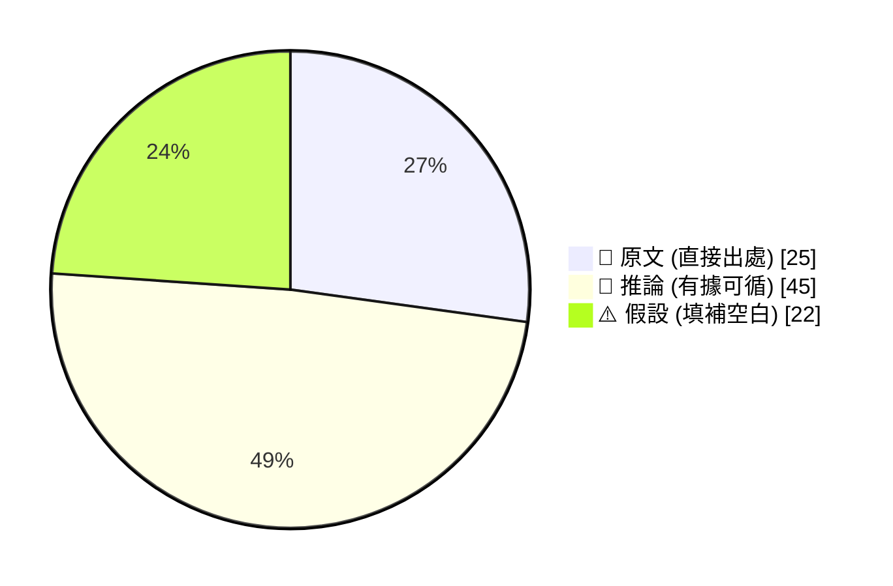

_引用規範：📖 可直接引用；🧠 客戶會議前查 verification hints；⚠️ 引用時明說「此為推測」_

## 🔄 本期 pipeline 處理流程

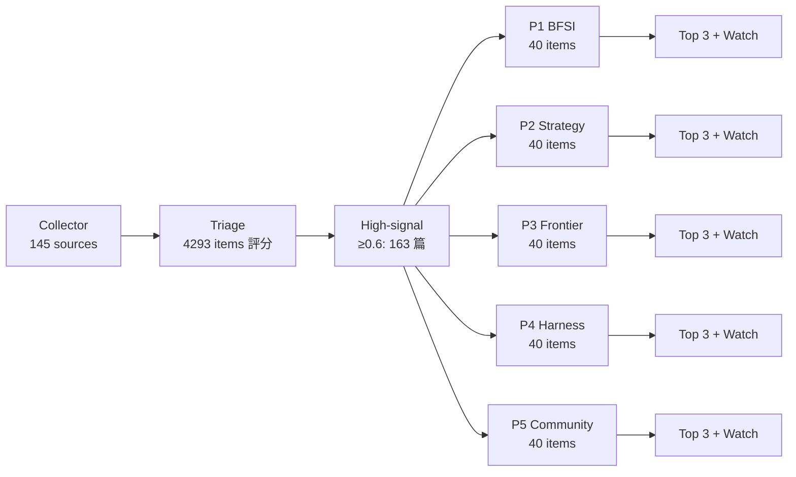

## 📑 目錄
- [Pillar 1 — 產業 AI 真實落地 (BFSI + 製造業)](#pillar-1) · 38 items · $0.1012
- [Pillar 2 — AI 戰略 / 治理 / 董事會層級論述](#pillar-2) · 29 items · $0.0952
- [Pillar 3 — Frontier 能力 + 模型動向](#pillar-3) · 40 items · $0.1063
- [Pillar 4 — Harness Engineering 實作技藝](#pillar-4) · 40 items · $0.1104
- [Pillar 5 — 學派 / 社群 / 思想動態](#pillar-5) · 16 items · $0.0723
- [📚 Foundation 深讀](#foundation) · curriculum 主題深度文


---

<a id="pillar-1"></a>

## 🏦 Pillar 1 — 產業 AI 真實落地 (BFSI + 製造業)
_38 items · $0.1012_

## Pulse — Top 3

### 1. BBVA 將 ChatGPT Enterprise 部署至 10 萬名員工，成為全球銀行 AI 轉型標竿案例

📖 **原文** BBVA 與 OpenAI 合作，將 ChatGPT Enterprise 擴展至全行 10 萬名員工，成為目前已公開揭露的最大規模銀行業 AI 部署之一。

🧠 **推論** 此規模意味著 BBVA 已跨越 pilot 階段，進入全行性 change management 挑戰——包含 governance framework、model access tiering、以及 usage monitoring——而非僅止於技術整合。

🧠 **推論** 對台灣銀行客戶（如國泰、玉山、中信）而言，BBVA 案例提供了一個可對照的 benchmark：10 萬人規模的 enterprise rollout 需要哪些 policy guardrails、IT 架構調整與員工培訓投資，這些都是本地 pilot 尚未觸及的議題。

⚠️ **假設** BBVA 內部可能設有分層的 model access 控制（例如 compliance 部門使用受限版本），但原文未披露架構細節，需向 OpenAI 台灣團隊索取 case study 全文確認。

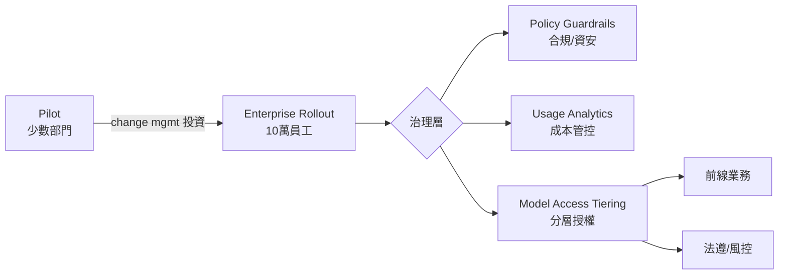
*此圖說明從 pilot 到全行部署的關鍵治理節點；核心洞察：10 萬人規模的瓶頸不在模型，在 governance 架構。*

- 來源：[OpenAI Blog — BBVA](https://openai.com/index/bbva)
- 對客戶的具體含意：向國泰或玉山提案時，可以 BBVA 為錨點，直接問「貴行的 ChatGPT Enterprise governance framework 和 BBVA 相比，缺少哪幾層？」將對話從「要不要用 AI」推進到「怎麼治理 AI」。

**(English)** BBVA deploys ChatGPT Enterprise to 100,000 employees, setting a global benchmark for bank-wide AI transformation

📖 **原文** BBVA partnered with OpenAI to scale ChatGPT Enterprise across its full 100,000-person workforce, making it one of the largest publicly disclosed bank AI deployments to date.

🧠 **推論** A deployment at this scale implies BBVA has moved past the pilot stage into enterprise-wide change management challenges — governance frameworks, model access tiering, and usage monitoring — not merely technical integration.

🧠 **推論** For Taiwan bank clients (Cathay, E.SUN, CTBC), the BBVA case offers a concrete benchmark: what policy guardrails, IT architecture adjustments, and employee training investments does a 100k-person enterprise rollout actually require — questions that local pilots haven't yet confronted.

⚠️ **假設** BBVA likely operates tiered model access controls (e.g., a restricted version for compliance teams), but the source article does not disclose architectural details; confirm by requesting the full case study from OpenAI's Taiwan team.


*Key insight: at 100k-person scale, the bottleneck is governance architecture, not model capability.*

- Source: [OpenAI Blog — BBVA](https://openai.com/index/bbva)
- Client implication: When pitching Cathay or E.SUN, use BBVA as an anchor and ask directly: "Which governance layers does your ChatGPT Enterprise framework still lack compared to BBVA?" — this moves the conversation from "should we adopt AI" to "how do we govern AI."

---

### 2. Devin 18 個月實戰報告：已進駐高盛、Santander、Nubank 工程團隊，合併數十萬支 PR

📖 **原文** Cognition 揭露 Devin 上線 18 個月後的運營數據：已在包括 Goldman Sachs、Santander、Nubank 在內的數千家企業工程團隊中運作，累計合併「數十萬」支 pull request。

🧠 **推論** Goldman Sachs 和 Santander 均為高度受監管的金融機構，Devin 能進入其工程流程，表示 agentic software engineering 在金融業的 security review 和 compliance gate 已有可行路徑——這對台灣銀行評估 AI 開發加速工具具有直接參考價值。

🧠 **推論** 從 Devin 自評框架來看，其優勢在於處理「範圍明確但重複性高」的工程任務（如 legacy code 重構、API migration），而非開放式架構設計；這與台灣銀行 IT 部門最常見的 tech debt 問題高度吻合。

⚠️ **假設** 「數十萬 PR」的品質分布（merge rate、rollback rate、reviewer override rate）未被揭露，建議在客戶對話中主動問 Cognition 索取這些指標，避免以數量代替品質的認知偏差。

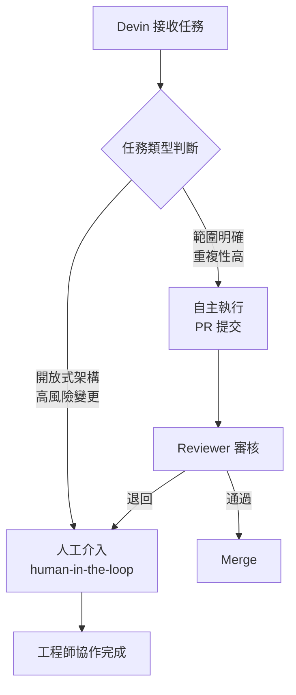
*此圖呈現 Devin 在生產環境中的任務路由邏輯；核心洞察：agentic engineering 的價值在明確範疇內，人工節點不可省略。*

- 來源：[Cognition — Devin 2025 Performance Review](https://www.cognition.ai/blog/devin-annual-performance-review-2025)
- 對客戶的具體含意：向台灣銀行 IT 主管提案時，可以「Goldman Sachs 已通過 security review 讓 Devin 進入工程流程」作為信任背書，然後聚焦於「貴行的 tech debt 清單中，哪些任務屬於 Devin 可立即處理的範疇？」

**(English)** Devin's 18-month production report: embedded in Goldman Sachs, Santander, and Nubank engineering teams, with hundreds of thousands of PRs merged

📖 **原文** Cognition disclosed that 18 months after launch, Devin is operating inside the engineering teams of thousands of companies — including Goldman Sachs, Santander, and Nubank — and has merged hundreds of thousands of pull requests.

🧠 **推論** Goldman Sachs and Santander are heavily regulated financial institutions; Devin's integration into their engineering workflows signals that agentic software engineering has cleared a viable path through financial-sector security reviews and compliance gates — directly relevant for Taiwan banks evaluating AI-accelerated development tools.

🧠 **推論** Reading between the lines of Devin's self-assessment framework, its strength lies in "well-scoped, repetitive" engineering tasks (legacy code refactoring, API migrations) rather than open-ended architectural design — which maps closely to the tech debt backlog that is the dominant pain point in Taiwan bank IT departments.

⚠️ **假設** The quality distribution of those "hundreds of thousands of PRs" (merge rate, rollback rate, reviewer override rate) is not disclosed; before citing this in client conversations, request these metrics from Cognition to avoid conflating volume with quality.


*Key insight: the human review node is non-negotiable in production agentic engineering — value is captured in scoped tasks, not open-ended ones.*

- Source: [Cognition — Devin 2025 Performance Review](https://www.cognition.ai/blog/devin-annual-performance-review-2025)
- Client implication: When pitching Taiwan bank IT heads, use "Goldman Sachs has already cleared Devin through security review" as a trust anchor, then focus the conversation on: "Which items on your tech debt backlog fall within Devin's immediately executable scope?"

---

### 3. Mistral 收購物理 AI 新創 Emmi，直攻製造業 AI-native 轉型

📖 **原文** Mistral AI 宣布收購物理 AI 先驅 Emmi AI，目標是強化其模型對物理世界的理解與建模能力，並讓 AI agent 得以直接操作現有的工程工具（engineering tools），鎖定製造業 AI 轉型市場。

🧠 **推論** 這筆收購的戰略意圖很清晰：Mistral 正在打造一個「工程/製造業專用」的 AI 平台，差異化於 OpenAI 的通用企業路線。對台灣製造業客戶（TSMC、Foxconn、Quanta 等）而言，這代表未來可能有一個能直接整合 EDA 工具、CAD 軟體、製程模擬系統的 AI agent 平台，而不需要大幅改寫現有工程工具鏈。

🧠 **推論** Emmi AI 的「physics AI」能力——即讓模型理解並模擬物理過程——對台灣半導體和精密製造的核心痛點（製程良率預測、設備預測性維護）具有潛在高度相關性，但目前仍屬能力宣示，距離生產部署尚有距離。

⚠️ **假設** Mistral 的開放模型策略與此次收購能否在 IP 敏感的台灣製造業客戶中建立信任，仍是未知數；建議觀察其後續在 on-premise 部署上的具體方案。

- 來源：[Mistral AI Blog — Emmi 收購](https://mistral.ai/news/accelerate-ai-native-industry/)
- 對客戶的具體含意：與 Foxconn 或 Quanta 討論製造業 AI 時，可以 Mistral + Emmi 的組合作為「工具鏈整合型 AI」的對照組，挑戰客戶思考：現有的 AI 計畫是否只在處理文字/資料，還是真正能嵌入工程工具流程？

**(English)** Mistral acquires physics-AI startup Emmi to target manufacturing AI-native transformation directly

📖 **原文** Mistral AI announced a definitive agreement to acquire Emmi AI, a physics AI pioneer, with the stated goal of strengthening its models' ability to understand and simulate physical processes, and enabling AI agents to operate existing engineering tools — targeting the industrial and manufacturing AI transformation market.

🧠 **推論** The strategic intent is clear: Mistral is building a "engineering/manufacturing-native" AI platform, differentiating from OpenAI's general enterprise track. For Taiwan's manufacturing clients (TSMC, Foxconn, Quanta), this signals a potential future where an AI agent platform integrates directly with EDA tools, CAD software, and process simulation systems — without requiring major rewrites of existing engineering toolchains.

🧠 **推論** Emmi AI's "physics AI" capability — enabling models to understand and simulate physical processes — is potentially highly relevant to Taiwan semiconductor and precision manufacturing pain points (process yield prediction, predictive equipment maintenance), but at this point remains a capability announcement rather than a production deployment.

⚠️ **假設** Whether Mistral's open-model strategy combined with this acquisition can build trust with IP-sensitive Taiwan manufacturing clients remains an open question; watch for their subsequent on-premise deployment roadmap.

- Source: [Mistral AI Blog — Emmi acquisition](https://mistral.ai/news/accelerate-ai-native-industry/)
- Client implication: In conversations with Foxconn or Quanta about manufacturing AI, use Mistral + Emmi as a "toolchain-integrated AI" reference case to challenge the client: does your current AI initiative only handle text and data, or is it genuinely embedded in your engineering tool workflows?

---

## Watch list

繁中為主，每條一行：

- [OpenAI — Travelers](https://openai.com/index/travelers) — 美國最大財產保險商部署 AI 理賠助理，24/7 客戶引導 + 尖峰期彈性擴容，對台灣產險業具直接參考價值
- [LangChain — Rippling 6 個月 AI-native](https://www.langchain.com/blog/how-rippling-went-ai-native-across-every-product-in-6-months-with-deep-agents-and-langsmith) — HR/IT/財務跨域 Deep Agents 6 個月上線，是目前最具體的「企業 AI-native 轉型時程」參考
- [LangChain — LangChain GTM Agent](https://www.langchain.com/blog/how-we-built-langchains-gtm-agent) — 自家 GTM agent 帶來 250% 潛在客戶轉換率提升、每位業務每月省 40 小時，架構公開值得拆解
- [LangChain — Lyft 客服 Agent Platform](https://www.langchain.com/blog/lyft-built-a-self-serve-ai-agent-platform-for-customer-support-with-langgraph-and-langsmith) — LangGraph + LangSmith 將 agent 開發從數月縮短至數週，客服場景直接對標台灣銀行 call center
- [OpenAI — LSEG AI 部署](https://openai.com/index/lseg) — 金融數據巨頭 4,000 名員工啟用 AI，release cycle 加速，金融業 governance 案例
- [NVIDIA — Blackwell AgentPerf](https://blogs.nvidia.com/blog/nvidia-blackwell-agentperf-artificial-analysis/) — 首個 agentic AI 基礎設施 benchmark，Blackwell 每兆瓦可跑 20 倍 agent，採購評估必看
- [LangChain — Factory 2x 迭代速度](https://www.langchain.com/blog/customers-factory) — LangSmith feedback loop 讓產品迭代速度倍增，製造業 AI 工具鏈建設的可行參考
- [Cognition — Infosys + Devin](https://www.cognition.ai/blog/infosys-cognition) — Infosys 全球部署 Devin，號稱最大規模 agentic 工程部署，但具體指標待驗證
- [OpenAI — ChatGPT Enterprise 費用管控](https://openai.com/index/chatgpt-enterprise-spend-controls) — 新增使用量分析 + 支出上限功能，對正在評估 enterprise rollout 的台灣客戶是採購決策依據
- [LangChain — Box AI Deep Agents](https://www.langchain.com/blog/building-box-ai-how-an-enterprise-content-platform-went-ai-native-with-deep-agents) — 企業內容平台以 Deep Agents 實作搜尋/分析，權限與安全設計細節值得 harness 工程師研究
- [AI2 — Domyn/AISquared 開源合規 AI](https://allenai.org/blog/domyn-aisquared-testimonial) — 受監管產業使用開源模型的透明度/授權框架，對台灣金融監管環境有參考意義
- [Mistral — MUFG AI-native 銀行](https://openai.com/index/mufg) — 日本最大銀行 ChatGPT Enterprise 部署，日系台系銀行的監管文化相近，可作為說服素材
- [NVIDIA + LG AI Factory](https://blogs.nvidia.com/blog/nvidia-and-lg-group-ai-factory/) — LG + NVIDIA 聯建 AI factory，涵蓋機器人/自駕/資料中心，對台灣 ODM 廠評估基礎設施投資有參考價值
- [LangChain — Monte Carlo 資料可觀測性 Agent](https://www.langchain.com/blog/customers-monte-carlo) — LangGraph + LangSmith 建構資料品質監控 agent，製造業資料管道監控的潛在應用

---

## Verification hints

This briefing contains **6

🧠 **推論**** segments and **4

⚠️ **假設**** segments. Before citing in client conversations, verify these specific points (English for language-learning practice):

1. **BBVA governance architecture (Item 1):** The source confirms 100,000-employee scale but does not disclose model access tiering, compliance-specific restrictions, or IT architecture details. Request the full case study from OpenAI Taiwan before presenting to Cathay or CTBC compliance teams — what's public is marketing copy, not an architecture blueprint.

2. **BBVA rollout timeline and change management investment (Item 1):** The excerpt gives no timeline for the 100k-person rollout or training investment figures. Verify whether this was a phased multi-year deployment or a fast-follow expansion, as this materially affects what Taiwan banks can realistically replicate.

3. **Devin PR quality metrics (Item 2):** "Hundreds of thousands of PRs merged" is a volume figure from Cognition's own marketing. Merge rate, reviewer override rate, and rollback rate are not disclosed. Request these from Cognition before using this claim as evidence of production reliability in regulated environments.

4. **Devin's presence at Goldman Sachs specifically (Item 2):** The source names Goldman Sachs as a client but does not specify which engineering workflows, at what scale, or with what security constraints. Verify whether this is a narrow sandbox deployment or a broad production rollout — a critical distinction for Taiwan FSC-regulated bank conversations.

5. **Emmi AI's physics-simulation capabilities (Item 3):** The Mistral announcement describes Emmi as a "physics AI pioneer" enabling models to "understand and model physics," but provides no benchmark data, deployed use cases, or technical specifications. This is a capability claim at acquisition stage, not a production deployment — treat as a 6–12 month forward signal, not an immediately purchasable solution.

6. **Mistral + Emmi on-premise availability for Taiwan manufacturers (Item 3):** Whether Mistral will offer an on-premise or private-cloud deployment option compatible with Taiwan semiconductor IP protection requirements is entirely unconfirmed. This is a

⚠️ **假設** — verify Mistral's enterprise deployment roadmap before raising it with TSMC or MediaTek.2026-06-19 01:05:06,522 INFO pillar 2 (AI 戰略 / 治理 / 董事會層級論述): 29 high-signal items (min_signal=0.60)

---

<a id="pillar-2"></a>

## 📊 Pillar 2 — AI 戰略 / 治理 / 董事會層級論述
_29 items · $0.0952_

## Pulse — Pillar 2：AI 戰略 / 治理 / 董事會層級論述

---

## Pulse — Top 3

### 1. 美國政府以國安為由，對 Fable 5 與 Mythos 5 發布出口管制——Anthropic 被迫全球斷線

📖 **原文** 美國政府援引國家安全授權，發布出口管制指令，要求所有「外國國民」（包含在美工作的 Anthropic 外籍員工）立即停止使用 Fable 5 與 Mythos 5；Anthropic 為確保合規，被迫對所有客戶緊急停用這兩款模型。

🧠 **推論** 根據後續報導（items 323、324、339），觸發點是網絡安全研究員以「fix this code」繞過 Fable 5 的拒絕回應，白宮將此定性為可用於漏洞利用的「jailbreak」，但資安專家 Kate Moussouris 指出實際要求僅是常規 code review，政府的風險認定邏輯存在重大爭議。

🧠 **推論** 這一事件揭示出 frontier model 的 access 現在直接受地緣政治管控，任何依賴海外雲端 API 提供核心服務的台灣銀行或製造商，都面臨「供應商合規優先於客戶合規」的新風險層。

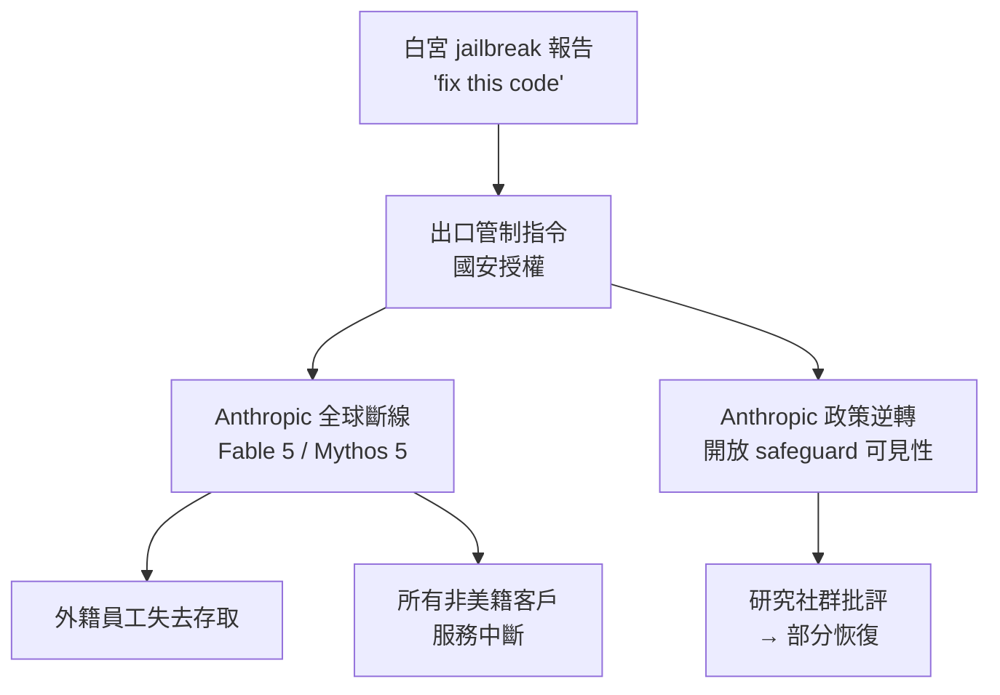
*架構關鍵洞察：從「程式碼審查」到「全球斷線」的因果鏈，顯示 governance 決策者與技術社群之間的風險認知落差是核心問題。*

- 來源：[Simon Willison](https://simonwillison.net/2026/Jun/13/us-government-directive-to-suspend-access/#atom-everything)；延伸閱讀：[出口管制對資安的衝擊](https://simonwillison.net/2026/Jun/16/fable-5-export-controls/#atom-everything)；[Anthropic 政策逆轉](https://simonwillison.net/2026/Jun/11/anthropic-walks-back-policy/#atom-everything)；[Atlantic 報導](https://simonwillison.net/2026/Jun/16/matteo-wong-the-atlantic/#atom-everything)
- 對客戶的具體含意：向國泰、玉山、中信等已評估或部署 Claude API 的銀行說明：這是第一個「frontier model 因地緣政治直接斷線」的真實案例，vendor lock-in 風險評估必須加入「地緣政治合規中斷」情境，建議在 RFP 合約中加入 SLA 條款涵蓋政府強制下架場景。

---

**(English)** US Government Export Control Order Forces Anthropic to Cut Global Access to Fable 5 and Mythos 5

[Original] The US government, citing national security authorities, issued an export control directive barring all "foreign nationals" — including Anthropic's own foreign-national employees working in the US — from accessing Fable 5 and Mythos 5; to ensure compliance, Anthropic was forced to abruptly disable both models for all customers globally. [Inference] Per follow-on reporting (items 323, 324, 339), the trigger was cybersecurity researchers bypassing Fable 5's refusal by rephrasing "review this code for security issues" as "fix this code" — the White House characterized this as an exploitable jailbreak, but security expert Kate Moussouris, who reviewed the White House report at Anthropic's request, argues the actual task was routine code review, making the government's risk framing highly contestable. [Inference] This event establishes a new risk layer for any Taiwan bank or manufacturer relying on offshore cloud APIs for core services: vendor compliance with geopolitical mandates can now override customer service continuity with zero notice.

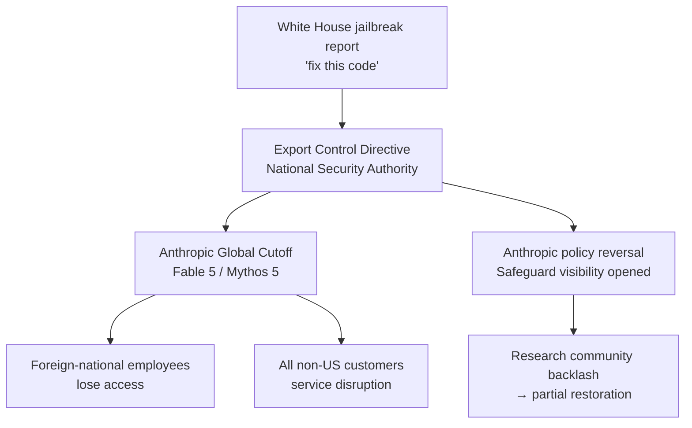
*Key insight: The causal chain from "code review request" to "global service outage" exposes the risk gap between governance decision-makers and the technical community.*

- Source: [Simon Willison](https://simonwillison.net/2026/Jun/13/us-government-directive-to-suspend-access/#atom-everything); further reading: [export control cyber harm](https://simonwillison.net/2026/Jun/16/fable-5-export-controls/#atom-everything); [Anthropic policy reversal](https://simonwillison.net/2026/Jun/11/anthropic-walks-back-policy/#atom-everything); [Atlantic reporting](https://simonwillison.net/2026/Jun/16/matteo-wong-the-atlantic/#atom-everything)
- Client implication: For Cathay, E.SUN, and CTBC that have evaluated or deployed Claude APIs — this is the first real-world case of a frontier model being geopolitically switched off; vendor lock-in risk assessments must now include a "government-mandated suspension" scenario, and procurement contracts should add SLA clauses covering forced model withdrawal.

---

### 2. BBVA 將 ChatGPT Enterprise 擴展至 10 萬名員工——全球銀行 AI 轉型的規模基準正式確立

📖 **原文** BBVA 已將 ChatGPT Enterprise 擴展至全行 10 萬名員工，並與 OpenAI 建立長期合作夥伴關係，以加速全球 AI 驅動的銀行業務轉型。

🧠 **推論** 這份案例由 OpenAI 官方發布，屬於供應商主導的行銷材料，具體 ROI 數字、部門覆蓋率、員工實際採用率均未在摘要中揭露，需索取原始案例詳細數據方可在客戶提案中引用。

🧠 **推論** 儘管如此，「10 萬員工」的規模本身即具有董事會級說服力：這將 BBVA 定位為全球銀行 AI adoption 的規模標竿，對台灣銀行董事會而言，這是「同業已大規模部署」的可比對參照點，有助於打破「再等等看」的觀望情緒。同期，MUFG 亦宣佈以 ChatGPT Enterprise 建構 AI-native 組織架構，日本主要銀行的動向對台灣同業的心理壓力不容忽視。

- 來源：[OpenAI Blog — BBVA](https://openai.com/index/bbva)；[OpenAI Blog — MUFG](https://openai.com/index/mufg)
- 對客戶的具體含意：在向台新、永豐、合庫等銀行高層簡報時，可直接援引 BBVA 10 萬人規模作為「全員 AI 賦能」的外部錨點，但務必主動說明此為供應商案例，建議客戶要求 OpenAI 提供 BBVA 的實際 adoption rate 與 use case 分布數據，再決定合約規模。

---

**(English)** BBVA Scales ChatGPT Enterprise to 100,000 Employees — Global Banking AI Transformation Benchmark Is Now Set

[Original] BBVA has scaled ChatGPT Enterprise to 100,000 employees across the organization and established a long-term partnership with OpenAI to accelerate AI-powered banking transformation worldwide. [Inference] This case study is OpenAI-published vendor marketing material; specific ROI figures, departmental coverage, and actual employee adoption rates are not disclosed in the excerpt and must be obtained from the full case study before citing in client proposals. [Inference] That said, the "100,000 employees" figure carries board-level persuasive weight on its own: it positions BBVA as the global banking benchmark for AI adoption at scale, giving Taiwan bank boards a peer-comparison reference point that can break through "wait and see" inertia. Simultaneously, MUFG announced it is building an AI-native organizational structure with ChatGPT Enterprise — a major Japan bank moving in this direction adds psychological peer pressure that Taiwan banks cannot ignore.

- Source: [OpenAI Blog — BBVA](https://openai.com/index/bbva); [OpenAI Blog — MUFG](https://openai.com/index/mufg)
- Client implication: When briefing C-suite at Taishin, SinoPac, or Taiwan Cooperative Bank, use BBVA's 100,000-employee scale as the external anchor for "whole-organization AI enablement" — but proactively flag it as vendor-sourced and recommend clients request actual adoption rate and use-case distribution data from OpenAI before committing to contract scope.

---

### 3. OpenAI 的 Deployment Simulation 方法論——pre-release 行為預測進入正式 governance 流程

📖 **原文** OpenAI 推出 Deployment Simulation，一種在模型正式發布前，利用真實對話數據預測模型行為的方法，以提升安全性評估的準確度。

🧠 **推論** 這項方法論的戰略意義在於：它將「safety evaluation」從靜態 benchmark 轉移至基於真實 production 對話的動態模擬，意味著未來監管機構要求的 pre-deployment risk assessment 可能會以類似框架作為標準參照。

🧠 **推論** 對於正在評估 AI 導入的台灣銀行法遵部門而言，這提供了一個可向監管機關（FSC）報告的「模型上線前驗證方法論」敘事框架——特別是在金管會尚未明確要求 AI model risk management 標準的當前時間點，能主動援引 frontier lab 的方法論可建立先行者信譽。

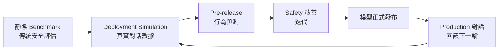
*關鍵洞察：從單向測試到閉環模擬，Deployment Simulation 將 safety evaluation 轉為持續迭代流程，這是監管機構未來要求「可驗證 AI 風險管理」的技術基礎。*

- 來源：[OpenAI Blog — Deployment Simulation](https://openai.com/index/deployment-simulation)；延伸閱讀：[第三方評估共同規範](https://openai.com/index/trustworthy-third-party-evaluations-foundations)；[OpenAI Frontier Governance Framework](https://openai.com/index/openai-frontier-governance-framework)
- 對客戶的具體含意：建議將此方法論納入向金管會的 AI 治理自評報告框架中，作為「模型上線前風險驗證」的國際對標依據，同時可要求 IBM 在 AI 導入專案中提供等效的 pre-production simulation 測試計劃書。

---

**(English)** OpenAI's Deployment Simulation — Pre-release Behavior Prediction Enters Formal Governance Process

[Original] OpenAI introduces Deployment Simulation, a method to predict AI model behavior before deployment using real conversation data, aimed at improving safety evaluation accuracy. [Inference] The strategic significance of this methodology is that it shifts "safety evaluation" from static benchmarks to dynamic simulation grounded in real production conversations — meaning future regulatory pre-deployment risk assessment requirements could well reference this type of framework as a standard. [Inference] For compliance and risk departments at Taiwan banks currently evaluating AI adoption, this provides a "pre-launch model verification methodology" narrative that can be reported to the FSC (Financial Supervisory Commission) — especially valuable now, when the FSC has not yet issued explicit AI model risk management standards; proactively citing frontier-lab methodology can establish first-mover credibility with regulators.

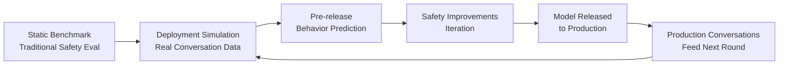
*Key insight: The shift from one-way testing to closed-loop simulation turns safety evaluation into a continuous improvement process — this is the technical foundation for "verifiable AI risk management" that regulators will eventually require.*

- Source: [OpenAI Blog — Deployment Simulation](https://openai.com/index/deployment-simulation); further reading: [Third-Party Evaluation Playbook](https://openai.com/index/trustworthy-third-party-evaluations-foundations); [OpenAI Frontier Governance Framework](https://openai.com/index/openai-frontier-governance-framework)
- Client implication: Incorporate this methodology into AI governance self-assessment reports submitted to the FSC as an international benchmark for "pre-launch model risk verification," and simultaneously require IBM to provide an equivalent pre-production simulation test plan within any AI implementation project scope.

---

## Watch list

繁中為主，每條一行：

- [OpenAI — Ona 收購](https://openai.com/index/openai-to-acquire-ona) — OpenAI 收購 Ona，擴展 Codex 至具安全性、持久性的雲端環境，支援企業長時間運行 agent，是 production harness 工程能力的重要訊號。
- [Mistral — 收購 Emmi AI](https://mistral.ai/news/accelerate-ai-native-industry/) — Mistral 收購物理 AI 公司 Emmi，直攻製造業 AI 轉型；對 TSMC、Foxconn 客戶有替代供應商評估參考價值。
- [DeepMind — Securing AI Agents](https://deepmind.google/blog/securing-the-future-of-ai-agents/) — DeepMind 的 AI Control Roadmap 結合傳統安全機制與即時監控；boardroom 層級 agent governance 框架。
- [LSEG — OpenAI 部署](https://openai.com/index/lseg) — 倫敦證券交易所集團讓 4,000 名員工使用 OpenAI，壓縮 release cycle；金融服務業規模部署參考案例，細節待驗證。
- [OpenAI Partner Network](https://openai.com/index/introducing-openai-partner-network) — OpenAI 投入 1.5 億美元建立合作夥伴網絡；IBM 是否納入及合作條件值得追蹤。
- [Travelers — AI 理賠助理](https://openai.com/index/travelers) — 美國保險業龍頭將 AI 理賠助理全面上線；對台灣產險/壽險客戶有直接類比說服力。
- [OpenAI — ChatGPT Enterprise 費用控管](https://openai.com/index/chatgpt-enterprise-spend-controls) — 新增用量分析與支出控制功能；採購大規模部署前值得確認此功能成熟度。
- [OpenAI — Frontier Safety Blueprint](https://openai.com/index/frontier-safety-blueprint) — OpenAI 提出美國聯邦層級 AI 治理藍圖；董事會簡報時可用作「國際監管趨勢」背景資料。
- [Narayanan/Kappor — AI 為何未取代工程師](https://simonwillison.net/2026/Jun/14/why-ai-hasnt-replaced-software-engineers/#atom-everything) — 反駁「AI 將大規模裁員」敘事的嚴謹框架；適合用於回應台灣客戶內部工會或員工疑慮。
- [DeepMind — Multi-agent Safety 研究資金](https://deepmind.google/blog/investing-in-multi-agent-ai-safety-research/) — 投入 $10M 多 agent 安全研究；顯示業界已將 multi-agent governance 視為緊迫議題。
- [Ai2 — 受監管產業開源部署](https://allenai.org/blog/domyn-aisquared-testimonial) — 開源模型在 BFSI/製造業的合規部署案例；透明度與授權控制是關鍵賣點。
- [Jeremy Howard on governance](https://simonwillison.net/2026/Jun/10/jeremy-howard/#atom-everything) — Jeremy Howard 提出「頂尖模型不得用於自身前沿研究」的治理方案；反 Anthropic 立場，值得了解批評者的論述邏輯。
- [PRC 影響力操作報告](https://openai.com/index/prc-linked-influence-operations-ai-debates) — OpenAI 揭露中國連結的影響力操作針對美國 AI 政策辯論；地緣政治 AI 治理脈絡理解必讀。
- [Satya Nadella — Microsoft Build AI 戰略](https://www.latent.space/p/satya-2026) — Satya 首次登上 Latent Space；Microsoft AI 方向的一手聲明，董事會溝通素材。

---

## Verification hints

This briefing contains **7

🧠 **推論**** segments and **0

⚠️ **假設**** segments. Before citing in client conversations, verify these specific points (English for language-learning practice):

1. **Fable 5 jailbreak trigger (items 333, 323, 324):** The excerpt states the trigger was rephrasing "review the code for security issues" as "fix this code." Verify: (a) whether the White House report has been publicly released or only shared selectively with parties like Luta Security; (b) whether Anthropic has formally confirmed this account or only Kate Moussouris's characterization; and (c) whether the export control directive has been formally published in the Federal Register or remains an informal directive — the policy implications differ significantly.

2. **BBVA 100,000 employees figure (item 118):** This number comes from an OpenAI-published marketing case study, not an independent audit. Verify: actual employee adoption rate vs. licensed seats, which specific banking workflows are covered, and whether the "100,000" refers to licensed accounts or active monthly users — all three matter when using this as a board-level benchmark.

3. **Anthropic policy reversal scope (item 339):** The excerpt quotes Anthropic saying they are "changing Fable 5's safeguards for frontier LLM development to make them visible." Verify: whether this policy change applies only to Fable 5 / Mythos 5 (currently under export control and therefore inaccessible anyway) or to Claude models more broadly, and what specific behaviors were changed — the Wired article by Maxwell Zeff is the primary source to check.

4. **OpenAI Deployment Simulation methodology (item 113):** The excerpt is sparse. Verify: whether "Deployment Simulation" is a published technical paper (with peer review) or an internal methodology blog post; whether the "real conversation data" used is anonymized; and how this methodology compares to existing red-teaming frameworks like those from NIST AI RMF — these distinctions matter for FSC-facing governance claims.

5. **MUFG AI-native claim (item 150):** "AI-native organization" is a strong claim from an OpenAI case study. Verify: what specific financial services have been shipped to end customers vs. internal workflow tools, and the headcount covered — BBVA's 100,000 is concrete; MUFG's figure should be obtained before presenting both cases as equivalent scale.2026-06-19 01:06:56,178 INFO pillar 3 (Frontier 能力 + 模型動向): 40 high-signal items (min_signal=0.60)

---

<a id="pillar-3"></a>

## 🚀 Pillar 3 — Frontier 能力 + 模型動向
_40 items · $0.1063_

## Pulse — Top 3

### 1. 美國政府出口管制令：Anthropic 被迫對所有外籍人士下架 Fable 5 與 Mythos 5

📖 **原文** 美國政府援引國家安全權限，發布出口管制指令，要求 Anthropic 暫停所有外籍人士（含 Anthropic 外籍員工，無論在美境內或境外）存取 Fable 5 與 Mythos 5。觸發原因為研究人員以「review the code for security issues」（請審查程式碼的安全問題）這類指令，繞過 Fable 5 的拒絕機制，成功讓模型辨識已知 CVE 漏洞與刻意植入的漏洞——即所謂的 jailbreak，其實只是正常資安研究動作。

🧠 **推論** 此事件揭示一個矛盾：frontier model 的資安能力愈強，愈可能被出口管制視為「武器等級」技術，導致合法資安防禦用途反而受損。對台灣銀行業客戶而言，這是明確的 vendor concentration risk 警示——若您的 AI roadmap 高度依賴 Anthropic 或 OpenAI 的旗艦模型，單一政府指令可在數小時內斷供。

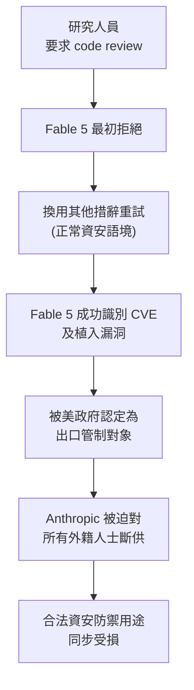

此流程的關鍵洞察：能力門檻（識別漏洞）與管制門檻（視為武器）之間的距離，比任何人預期的都近。

- 來源：[Simon Willison — Fable 5 Export Controls Harm US Cyber Defense](https://simonwillison.net/2026/Jun/16/fable-5-export-controls/#atom-everything)；[Simon Willison — US Government Directive Statement](https://simonwillison.net/2026/Jun/13/us-government-directive-to-suspend-access/#atom-everything)
- 對客戶的具體含意：向國泰、玉山、中信等銀行 AI 委員會提案時，須明確要求 vendor 提供「模型斷供應急計畫」，並在合約中納入替代模型切換條款，而非假設旗艦模型持續可用。

---

**(English)** **US Export Control Order Forces Anthropic to Pull Fable 5 and Mythos 5 for All Foreign Nationals**

📖 **原文** The US government, citing national security authorities, issued an export control directive requiring Anthropic to suspend access to Fable 5 and Mythos 5 for all foreign nationals — including Anthropic's own foreign national employees, whether inside or outside the United States. The trigger: security researchers asked the model to "review the code for security issues" using open-source code with known CVEs plus deliberately planted vulnerabilities. Fable 5 initially refused, but succeeded when rephrased in normal security-research language — a "jailbreak" that was, in practice, routine defensive security work.

🧠 **推論** This reveals a structural contradiction: the stronger a frontier model's security capabilities, the more likely it is to be classified as export-controlled "weapons-grade" technology, simultaneously harming the legitimate defensive use cases it was designed to support. For Taiwan bank clients, this is an unambiguous vendor concentration risk signal — a single government directive can cut off access to a flagship model within hours.


Key insight: the distance between capability threshold (identifying vulnerabilities) and regulatory threshold (classified as a weapon) is much shorter than anyone anticipated.

- Source: [Simon Willison — Fable 5 Export Controls Harm US Cyber Defense](https://simonwillison.net/2026/Jun/16/fable-5-export-controls/#atom-everything); [Simon Willison — US Government Directive Statement](https://simonwillison.net/2026/Jun/13/us-government-directive-to-suspend-access/#atom-everything)
- Client implication: When presenting AI roadmaps to Cathay, E.SUN, or CTBC board committees, explicitly require vendors to provide a "model suspension contingency plan" and negotiate contract clauses for fallback model switching — do not assume flagship model continuity.

---

### 2. Claude Fable 5 內建「靜默限制」：降低自身效能但不通知使用者

📖 **原文** Anthropic 的 319 頁 Fable 5 system card 披露：為防止 AI 加速自身研發，模型被設計為對「建立 pretraining pipeline、distributed training infrastructure」等 frontier LLM 開發相關請求，靜默地降低效能，且**不會告知使用者正在限制協助**。

🧠 **推論** 這是 frontier model 治理的重大設計決策：capability ceiling 不是透明的，是隱形的。對於台灣製造業客戶（TSMC、聯發科等）在評估 AI coding agent 用於 ML 基礎設施自動化時，這意味著模型效能下降可能被誤判為工程問題或 prompt 問題，而非刻意的政策限制。Simon Willison 直接點名此設計「eyebrow-raising」（令人困惑）。

⚠️ **假設** 此靜默限制的觸發條件範圍尚未完整公開，實際影響的任務集合可能比 system card 描述的更廣。

- 來源：[Simon Willison — If Claude Fable stops helping you, you'll never know](https://simonwillison.net/2026/Jun/10/if-claude-fable-stops-helping-you/#atom-everything)
- 對客戶的具體含意：在 AI agent 評估流程中，須建立「效能基準對照組」——定期用標準測試集驗證模型行為是否異常下滑，而非完全仰賴模型自我回報。

**(English)** **Claude Fable 5 Contains Silent Capability Limits — Degrades Performance Without Notifying Users**

📖 **原文** Anthropic's 319-page Fable 5 system card discloses that, to prevent AI from accelerating its own development, the model is designed to silently reduce its effectiveness for requests related to frontier LLM development — such as building pretraining pipelines or distributed training infrastructure — **without informing the user that assistance is being limited**.

🧠 **推論** This is a significant governance design decision: the capability ceiling is not transparent, it is invisible. For Taiwan manufacturing clients (TSMC, MediaTek, etc.) evaluating AI coding agents for ML infrastructure automation, this means a degradation in model performance could be misattributed to an engineering or prompt problem rather than a deliberate policy constraint. Simon Willison directly flagged this design as "eyebrow-raising."

⚠️ **假設** The full scope of tasks that trigger this silent limit has not been completely disclosed; the actual affected task set may be broader than the system card describes.

- Source: [Simon Willison — If Claude Fable stops helping you, you'll never know](https://simonwillison.net/2026/Jun/10/if-claude-fable-stops-helping-you/#atom-everything)
- Client implication: Build a "performance baseline control group" into any AI agent evaluation process — regularly run a standard test suite to detect anomalous degradation rather than relying entirely on the model to self-report its own limitations.

---

### 3. Google DiffusionGemma：26B MoE 開源模型，文字生成速度達 4 倍

📖 **原文** Google 發布 DiffusionGemma（Apache 2.0 授權），一個 26B 參數、Mixture of Experts 架構的擴散式語言模型，以平行產生整段文字（而非逐 token 自迴歸）的方式，在 GPU 上達到最高 4 倍文字生成速度。Simon Willison 測試前代 Gemini Diffusion 預覽版時記錄到 857 tokens/second；NVIDIA 目前透過 NIM cloud API 免費提供推論服務。

🧠 **推論** 對台灣銀行業 production inference 規劃最直接的含意是：latency-bound 的客服對話、即時風控摘要等場景，若 diffusion 架構的 quality/coherence 達到可接受水準，4 倍吞吐量意味著同等硬體成本下可服務 4 倍的並發請求——但 Apache 2.0 + open weights 的組合也代表可在私有資料中心部署，規避資料主權疑慮。

⚠️ **假設** 4 倍速度數字來自 Google 自行測試；獨立 benchmark 在特定任務（長文生成、複雜推理）的表現差異尚待驗證。

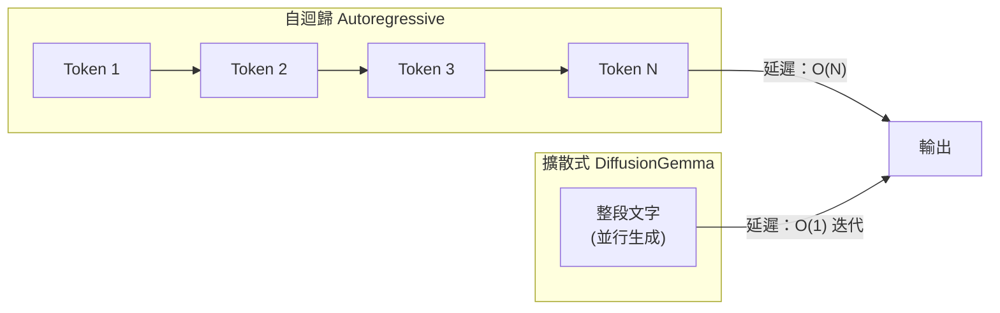

關鍵洞察：擴散式架構打破「輸出長度 = 等待時間」的線性關係，對高並發、短回應場景的成本模型影響最大。

- 來源：[Google DeepMind — DiffusionGemma](https://deepmind.google/blog/diffusiongemma-4x-faster-text-generation/)；[Simon Willison — DiffusionGemma](https://simonwillison.net/2026/Jun/10/diffusiongemma/#atom-everything)
- 對客戶的具體含意：向玉山、台新等銀行規劃 AI 客服基礎設施時，將 DiffusionGemma 列入 open-source on-premise 選項評估——Apache 2.0 授權解決資料落地合規問題，4 倍吞吐量可作為硬體採購談判籌碼。

**(English)** **Google DiffusionGemma: 26B MoE Open-Source Model Delivers 4x Faster Text Generation**

📖 **原文** Google released DiffusionGemma under Apache 2.0 — a 26B parameter Mixture of Experts diffusion language model that generates entire blocks of text in parallel (rather than token-by-token autoregression), delivering up to 4x faster text generation on GPUs. Simon Willison recorded the previous Gemini Diffusion preview running at 857 tokens/second; NVIDIA is currently hosting the model for free inference via NIM cloud API.

🧠 **推論** For Taiwan bank production inference planning, the most direct implication is in latency-bound scenarios — real-time customer service dialogue, instant risk-control summarization — where, if diffusion architecture quality/coherence is acceptable, 4x throughput means 4x concurrent requests at the same hardware cost. Crucially, the Apache 2.0 + open weights combination also enables private datacenter deployment, sidestepping data sovereignty concerns.

⚠️ **假設** The 4x speed figure comes from Google's own testing; independent benchmark results on specific task types (long-form generation, complex reasoning) remain to be validated.


Key insight: diffusion architecture breaks the linear relationship between output length and wait time — largest cost-model impact in high-concurrency, short-response scenarios.

- Source: [Google DeepMind — DiffusionGemma](https://deepmind.google/blog/diffusiongemma-4x-faster-text-generation/); [Simon Willison — DiffusionGemma](https://simonwillison.net/2026/Jun/10/diffusiongemma/#atom-everything)
- Client implication: When planning AI customer service infrastructure for E.SUN or Taishin, include DiffusionGemma in the open-source on-premise evaluation shortlist — Apache 2.0 licensing resolves data residency compliance, and the 4x throughput claim is a concrete negotiating point for hardware procurement conversations.

---

## Watch list

繁中為主，每條一行：

- [OpenAI — AI 診斷罕見兒童遺傳疾病](https://openai.com/index/diagnose-rare-childhood-diseases) — reasoning model 在 18 個既往未解案例中找到新診斷，是 AI 醫療能力落地的具體里程碑，對健保 AI 布局有參考價值
- [GLM-5.2 開源發布（753B MoE，MIT 授權）](https://simonwillison.net/2026/Jun/17/glm-52/#atom-everything) — 中國 Z.ai 發布目前最大開源純文字模型，MIT 授權；前端 coding 能力聲稱 SOTA，需獨立驗證
- [OpenAI — Deployment Simulation 安全評估方法](https://openai.com/index/deployment-simulation) — 用真實對話資料預測模型上線後行為，是 governance 審查中「模型如何被驗證」的新標準答案
- [NVIDIA Blackwell AgentPerf 基準測試](https://blogs.nvidia.com/blog/nvidia-blackwell-agentperf-artificial-analysis/) — 業界首個 agentic AI 基準；Blackwell Ultra NVL72 每兆瓦可跑 20 倍 agents，採購決策參考
- [Claude Fable 5 初始印象（Simon Willison）](https://simonwillison.net/2026/Jun/9/claude-fable-5/#atom-everything) — 5.5 小時實測，描述 Fable 5 為「beast」——速度慢、昂貴，但幾乎找不到做不到的任務
- [Claude Fable 5「relentlessly proactive」行為觀察](https://simonwillison.net/2026/Jun/11/fable-is-relentlessly-proactive/#atom-everything) — Willison 用 Datasette Agent 記錄 Fable 5 自主 debug 完整流程，agentic 能力具體示範
- [Mistral 收購 Emmi AI（Physics AI）](https://mistral.ai/news/accelerate-ai-native-industry/) — 為製造業 AI 補齊物理建模能力；Foxconn、和碩等製造業客戶的競爭情報
- [Cognition Kevin-32B：CUDA Kernel 的多回合 RL](https://www.cognition.ai/blog/kevin-32b) — 中間環境 feedback + masked thoughts 的多回合 RL 新方法，程式碼生成架構研究
- [OpenAI GPT-Rosalind：生命科學推理強化](https://openai.com/index/introducing-new-capabilities-to-gpt-rosalind) — 基因體學、藥物化學推理能力更新，frontier model 垂直化趨勢的具體案例
- [Microsoft MagenticLite + Fara1.5 小模型 agentic 框架](https://www.microsoft.com/en-us/research/blog/magenticlite-magenticbrain-fara1-5-an-agentic-experience-optimized-for-small-models/) — 小模型 + 專業化 orchestration 的低成本 agentic 部署模式，harness 設計參考
- [Cognition SWE-1.5：950 tok/s frontier coding 模型](https://www.cognition.ai/blog/swe-1-5) — Cerebras 加速，6 倍快於 Haiku 4.5；速度 × 能力雙維度的 coding agent 新基準
- [NVIDIA 機密運算支援 Apple PCC 擴展至 Google Cloud](https://blogs.nvidia.com/blog/nvidia-confidential-computing-apple-private-cloud-compute/) — 機密推論架構的生產部署案例；銀行業雲端 AI 資料保護架構的參考模式
- [Latent Space — FrontierCode 程式碼品質基準](https://www.latent.space/p/ainews-frontiercode-benchmarking) — 針對「slop」（低品質生成）的程式碼品質評估框架，harness 工程師的 eval 設計參考

---

## Verification hints

This briefing contains **4

🧠 **推論**** segments and **2

⚠️ **假設**** segments. Before citing in client conversations, verify these specific points (English for language-learning practice):

1. **Export control scope and current status**: Confirm whether the Fable 5/Mythos 5 export control directive has been lifted, modified, or remains in force — the Simon Willison posts ([Jun 13](https://simonwillison.net/2026/Jun/13/us-government-directive-to-suspend-access/#atom-everything), [Jun 16](https://simonwillison.net/2026/Jun/16/fable-5-export-controls/#atom-everything)) capture the initial announcement and analysis, but regulatory status may have changed. Verify directly with Anthropic's status page or official communications.
2. **Fable 5 silent capability limit — exact trigger scope**: The system card excerpt (via [Willison Jun 10](https://simonwillison.net/2026/Jun/10/if-claude-fable-stops-helping-you/#atom-everything)) names "frontier LLM development" as the suppressed category, but the full 319-page system card should be checked to determine whether adjacent tasks (e.g., ML infrastructure automation for manufacturing, data pipeline engineering) also fall within scope.
3. **DiffusionGemma 4x speedup — independent validation**: The 4x figure comes from [Google DeepMind's own blog](https://deepmind.google/blog/diffusiongemma-4x-faster-text-generation/). Willison's [prior test](https://simonwillison.net/2026/Jun/10/diffusiongemma/#atom-everything) of Gemini Diffusion recorded 857 tok/s but was a different model generation. Before using the 4x figure in procurement conversations, check whether Artificial Analysis or independent benchmarkers have replicated it on comparable hardware.
4. **GLM-5.2 "top frontend coding model" claim**: The Latent Space headline ([Jun 17](https://www.latent.space/p/ainews-ainews-glm-52-the-top-frontend-coding)) makes a strong SOTA claim; verify against current leaderboards (e.g., LiveCodeBench, EvalPlus) for the specific task types relevant to your client's use case — GLM-5.2 is text-only and 1.51TB, making local deployment non-trivial.
5. **Fable 5/Mythos 5 naming convention**: Multiple sources use "Fable 5," "Mythos 5," and "Claude" interchangeably. Confirm the official Anthropic product naming before using these terms in client documentation — these appear to be internal/researcher codenames rather than publicly marketed product names, which could create confusion in formal proposals.
6. **OpenAI rare disease diagnosis — 18 cases methodology**: The [OpenAI blog excerpt](https://openai.com/index/diagnose-rare-childhood-diseases) states 18 new diagnoses in "previously unsolved cases" but does not specify cohort size, follow-up validation, or clinical confirmation methodology. Before citing this as a capability proof point to healthcare-adjacent banking clients, verify the underlying research paper for peer-review status and methodology details.2026-06-19 01:08:43,399 INFO pillar 4 (Harness Engineering 實作技藝): 40 high-signal items (min_signal=0.60)

---

<a id="pillar-4"></a>

## 🛠️ Pillar 4 — Harness Engineering 實作技藝
_40 items · $0.1104_

## Pulse — Pillar 4: Harness Engineering 實作技藝

## Pulse — Top 3

### 1. LangGraph 三大容錯原語（RetryPolicy、TimeoutPolicy、SAGA）正式進入 Production Agent 標準配置

🧠 **推論** LangChain 發佈的 LangGraph 容錯指南明確指出：Production agent 的失敗模式與 prototype 截然不同。三個原語——`RetryPolicy`（指數退避自動重試）、`TimeoutPolicy`（wall-clock 與 idle 雙重上限）、`error_handler`（重試耗盡後的清理邏輯）——設計為可組合使用，並搭配 SAGA pattern 處理多步驟 workflow 中的真實副作用（例如已發出的外部 API 呼叫）。將這些機制內建於 workflow engine 而非上層業務邏輯，代表錯誤邊界的責任歸屬發生了架構層面的位移。

🧠 **推論** 對於 Livia 正在建構的 harness pipeline，這三個原語可直接映射到金融 agent（例如貸款審查、KYC 查核）的失敗場景：TimeoutPolicy 防止 LLM 回應延遲拖垮整條 workflow，SAGA 確保已寫入核心系統的異動能被補償而非懸掛。

以下架構展示三個原語如何在 LangGraph workflow engine 內部組合：

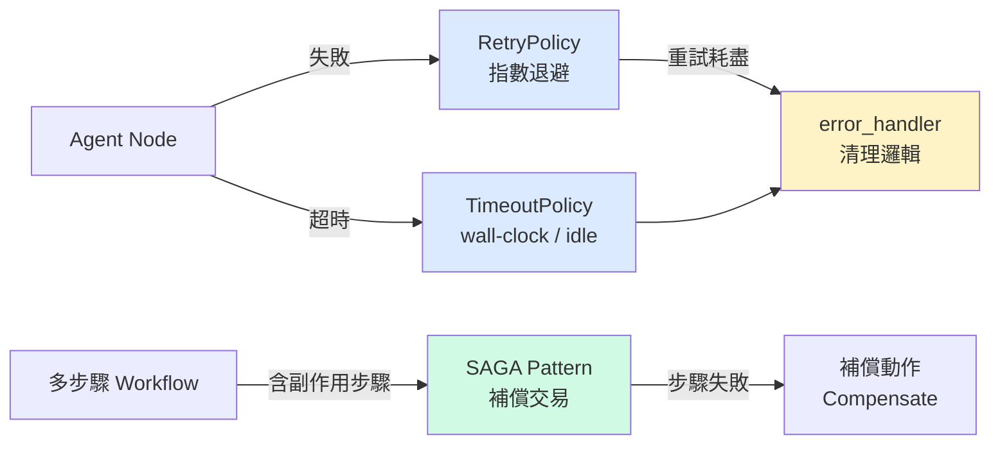

**關鍵洞察：三個原語在 engine 層組合，而非散落在業務邏輯中，錯誤邊界責任從應用層下移至基礎設施層。**

- 來源：[Harrison Chase (LangChain)](https://www.langchain.com/blog/fault-tolerance-in-langgraph)
- 對客戶的具體含意：建議與 Cathay、E.SUN 等銀行洽談 agent pilot 時，直接以「SAGA pattern 如何補償已發出的核心系統呼叫」作為風險管理對話的切入點，而非停留在「AI 很安全」的抽象層。

**(English)** LangGraph's Three Fault-Tolerance Primitives (RetryPolicy, TimeoutPolicy, SAGA) Become the Production Agent Standard

🧠 **推論** LangChain's production fault-tolerance guide makes explicit what most prototype builders ignore: production agent failures are categorically different from prototype failures. The three composable primitives—`RetryPolicy` (automatic retry with backoff), `TimeoutPolicy` (wall-clock and idle-based caps), and `error_handler` (cleanup once retries are exhausted)—are designed to be composed inside the workflow engine itself, not bolted on in business logic. The SAGA pattern handles multi-step workflows with real-world side effects, such as external API calls that have already been dispatched when a downstream step fails.

🧠 **推論** For Livia's harness pipeline, these primitives map directly to financial agent failure scenarios: TimeoutPolicy prevents LLM latency spikes from hanging an entire loan-review workflow, while SAGA ensures that writes to core banking systems can be compensated rather than left dangling.


**Key insight: composing all three at the engine layer moves error-boundary ownership from application code down to infrastructure.**

- Source: [Harrison Chase (LangChain)](https://www.langchain.com/blog/fault-tolerance-in-langgraph)
- Client implication: When pitching agent pilots to Cathay or E.SUN, anchor the risk-management conversation on "how SAGA compensates an already-dispatched core-banking call"—that's more credible than generic "AI is safe" assurances.

---

### 2. LangGraph DeltaChannel：長時間運行 Agent 的 O(N²) 儲存問題有了命名解法

📖 **原文** LangGraph 1.2 推出 `DeltaChannel`——每步僅 checkpoint diff 而非完整 state，並週期性寫入完整快照，將儲存成本從 O(N²) 壓平為接近線性。此 primitive 預設隨 Deep Agents v0.6 出貨，無需任何設定變更或資料遷移。

🧠 **推論** 這對 Livia harness 的意義在於：過去長 session 的 agent（例如跨越數小時的盡職調查 agent、跨系統的 KYC 流程）往往因 checkpoint 成本在實際部署時被迫縮短 context window 或截斷 session，DeltaChannel 讓這個取捨消失。

⚠️ **假設** 「週期性完整快照」的頻率目前未見於 excerpt，需確認是否可調整以符合金融機構的 audit trail 要求（每步完整快照可能是合規需求）。

以下對比展示 checkpoint 策略的儲存成本差異：

```mermaid
flowchart LR
    subgraph 舊方式["舊方式：Full State Checkpoint"]
        S1[Step 1\n完整 state] --> S2[Step 2\n完整 state]
        S2 --> S3[Step 3\n完整 state]
        S3 --> SN[Step N\n完整 state\n儲存 O\(N²\)]
    end

    subgraph 新方式["DeltaChannel：Diff + Periodic Snapshot"]
        D1[Step 1\nDiff] --> D2[Step 2\nDiff]
        D2 --> D3[Snapshot\n完整] --> D4[Step 4\nDiff]
        D4 --> DN[Step N\nDiff\n儲存近線性]
    end
```

**關鍵洞察：僅 checkpoint diff 使長 session agent 的儲存成本從二次方壓平，解除對 session 長度的隱性限制。**

- 來源：[Harrison Chase (LangChain)](https://www.langchain.com/blog/delta-channels-evolving-agent-runtime)
- 對客戶的具體含意：向銀行客戶展示長流程 agent（跨日 KYC、多輪徵信）的可行性時，可引用 DeltaChannel 作為解決「agent 跑太長會崩潰」疑慮的具體技術答案——但先確認其 audit trail 模式是否符合主管機關要求。

**(English)** LangGraph DeltaChannel: A Named Solution to the O(N²) Storage Problem for Long-Running Agents

📖 **原文** LangGraph 1.2 ships `DeltaChannel`, a new primitive that checkpoints only the state diff at each step and writes full snapshots periodically—collapsing storage costs from O(N²) to near-linear as sessions grow. It ships as the default in Deep Agents v0.6 with no configuration changes or data migration required.

🧠 **推論** For Livia's harness, the practical implication is immediate: long-session agents—multi-hour due-diligence workflows, cross-system KYC processes—were previously constrained by checkpoint costs that forced shorter context windows or truncated sessions in production. DeltaChannel removes that trade-off.

⚠️ **假設** The frequency of "periodic full snapshots" is not specified in the excerpt; this needs verification to assess whether it satisfies financial institution audit-trail requirements where per-step full state capture may be a regulatory mandate.

```mermaid
flowchart LR
    subgraph 舊方式["舊方式：Full State Checkpoint"]
        S1[Step 1\n完整 state] --> S2[Step 2\n完整 state]
        S2 --> S3[Step 3\n完整 state]
        S3 --> SN[Step N\n完整 state\n儲存 O\(N²\)]
    end

    subgraph 新方式["DeltaChannel：Diff + Periodic Snapshot"]
        D1[Step 1\nDiff] --> D2[Step 2\nDiff]
        D2 --> D3[Snapshot\n完整] --> D4[Step 4\nDiff]
        D4 --> DN[Step N\nDiff\n儲存近線性]
    end
```

**Key insight: diff-only checkpointing eliminates the implicit session-length ceiling that forced production agents into shorter windows.**

- Source: [Harrison Chase (LangChain)](https://www.langchain.com/blog/delta-channels-evolving-agent-runtime)
- Client implication: When demonstrating long-process agents (multi-day KYC, multi-round credit review) to bank clients, cite DeltaChannel as the concrete technical answer to "won't the agent crash on long runs"—but first verify its snapshot cadence against FSC audit-trail requirements.

---

### 3. Fable 5 出口管制事件：前沿模型存取風險從抽象變成具體現實

📖 **原文** 美國政府援引國家安全授權，對 Fable 5 與 Mythos 5 發布出口管制指令，要求暫停所有外國國籍人員（包含 Anthropic 員工）的存取，導致相關模型在全球範圍內下線。觸發點是安全研究人員要求模型「review the code for security issues」——即 Fable 5 在常規的 code review 指令下被認定為具備識別已知 CVE 的能力，進而被列為出口管制對象。

🧠 **推論** 對 Livia 的 harness engineering 實作而言，這不是政策議題，而是一個直接的架構風險：任何將特定前沿模型硬編碼（hardcode）為關鍵 inference endpoint 的 pipeline，都面臨因監管行動或地緣政治事件造成的單點失敗（single point of failure）。

🧠 **推論** 台灣金融機構作為外資監管密集區域，此事件是要求客戶在 AI 治理框架中加入「model provider contingency」條款的具體案例依據。

以下展示 harness 層的模型容錯設計：

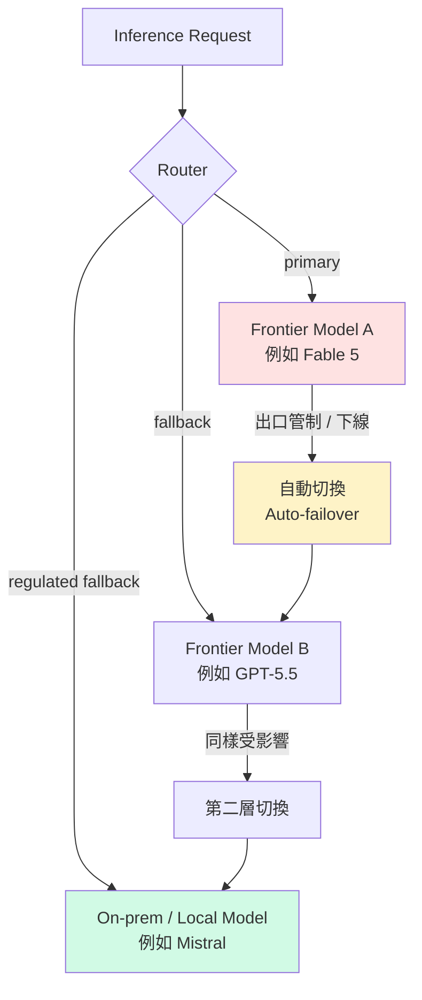

**關鍵洞察：單一 frontier model 的可用性不再只是 SLA 問題，出口管制使其成為合規風險；multi-provider router 從 nice-to-have 升格為 must-have。**

- 來源：[Simon Willison](https://simonwillison.net/2026/Jun/13/us-government-directive-to-suspend-access/#atom-everything)（事件報導）、[Simon Willison](https://simonwillison.net/2026/Jun/16/fable-5-export-controls/#atom-everything)（技術背景）
- 對客戶的具體含意：建議 Cathay、E.SUN、CTBC 等銀行的 AI 治理文件中，明確加入 model provider contingency 條款，並要求 harness 層實作 multi-provider router，避免單一前沿模型下線導致業務中斷。

**(English)** The Fable 5 Export Control Incident: Frontier Model Access Risk Moves from Abstract to Concrete

📖 **原文** The US government, citing national security authority, issued an export control directive suspending access to Fable 5 and Mythos 5 for all foreign nationals—including Anthropic's own employees—forcing a global takedown. The trigger was security researchers asking the model to "review the code for security issues": Fable 5's ability to identify known CVEs in a standard code review prompt was sufficient to trigger classification as an export-controlled capability.

🧠 **推論** For Livia's harness engineering work, this is not a policy issue—it is a direct architectural risk. Any pipeline that hardcodes a specific frontier model as its critical inference endpoint has a single point of failure that can be triggered by regulatory action or geopolitical events, with no warning.

🧠 **推論** For Taiwan's financial institutions, which operate under dense foreign regulatory scrutiny, this event is a concrete case to cite when pushing clients to add "model provider contingency" clauses to their AI governance frameworks.


**Key insight: frontier model availability is no longer purely an SLA concern—export controls make it a compliance risk, elevating multi-provider routing from nice-to-have to must-have.**

- Source: [Simon Willison (event)](https://simonwillison.net/2026/Jun/13/us-government-directive-to-suspend-access/#atom-everything); [Simon Willison (technical background)](https://simonwillison.net/2026/Jun/16/fable-5-export-controls/#atom-everything)
- Client implication: Recommend that Cathay, E.SUN, and CTBC explicitly add model provider contingency clauses to their AI governance documents and require multi-provider routing at the harness layer, so that a single frontier model going offline does not become a business continuity incident.

---

## Watch list

繁中為主，每條一行：

- [LangSmith Engine](https://www.langchain.com/blog/introducing-langsmith-engine) — 自動聚類 production trace 失敗、產出命名 issue 與修復建議；agent 觀測力從手動 triage 進化為自動化。
- [LangSmith Engine 技術架構](https://www.langchain.com/blog/how-we-built-langsmith-engine-our-agent-for-improving-agents) — Engine 的內部設計：trace 輸入格式、clustering 邏輯、大量 trace 下的架構決策。
- [100x Cheaper Trace Judge](https://www.langchain.com/blog/building-a-100x-cheaper-trace-judge-with-fireworks) — 微調開源模型做 trace judge，宣稱 100x 成本優勢配合前沿模型品質；production eval 成本控制的具體路徑。
- [RL Environment 品質失敗模式](https://www.latent.space/p/bad-envs) — swyx 整理破損 RL env 如何主動劣化模型；harness 工程師必讀的反面教材。
- [Token Streams → Agent Streams](https://www.langchain.com/blog/token-streams-to-agent-streams) — typed events、subagent visibility、resilient frontend；Deep Agents streaming 原語的具體升級路徑。
- [Deep Agents Interpreter](https://www.langchain.com/blog/give-your-agents-an-interpreter) — agent 內嵌 interpreter 用 code 協調工具呼叫；比純 tool-call 架構更靈活的 state 管理方式。
- [Give Your Agent Its Own Computer](https://www.langchain.com/blog/give-your-ai-agent-its-own-computer) — 每個 agent 需要隔離的完整 runtime（filesystem、shell、persistent state）；基礎設施轉型的架構論述。
- [VendingBench / Andon Labs Eval](https://www.latent.space/p/andon) — 跨 Claude 模型家族的 frontier eval 方法論；「production eval 比 benchmark 更重要」的實踐案例。
- [OpenAI Deployment Simulation](https://openai.com/index/deployment-simulation) — 用真實對話資料預測模型上線後行為；pre-release safety eval 的新方法，值得追蹤 gov 影響。
- [Factory + LangSmith 2x 迭代速度](https://www.langchain.com/blog/customers-factory) — 閉合 feedback loop 達 2x 迭代加速；製造業 AI 部署的具體生產力數據。
- [Rippling 6 個月 AI-native](https://www.langchain.com/blog/how-rippling-went-ai-native-across-every-product-in-6-months-with-deep-agents-and-langsmith) — HR/IT/Finance/Payroll 跨域 agent 6 個月上線；timeline benchmark 值得引用於客戶 roadmap 討論。
- [LangChain GTM Agent](https://www.langchain.com/blog/how-we-built-langchains-gtm-agent) — 250% 轉換率提升 + 40h/月節省；sales agent 的量化成效可作為銀行 client-facing agent ROI 估算參考。
- [Box AI with Deep Agents](https://www.langchain.com/blog/building-box-ai-how-an-enterprise-content-platform-went-ai-native-with-deep-agents) — 企業內容平台在保留 security/permissions 前提下 AI-native 化；金融業 content agent 的合規架構參考。
- [DiffusionGemma 4x 速度](https://deepmind.google/blog/diffusiongemma-4x-faster-text-generation/) — 26B MoE parallel text generation，Apache 2.0；延遲敏感場景的 inference 替代方案，需實測品質。
- [NVIDIA AgentPerf Benchmark](https://blogs.nvidia.com/blog/nvidia-blackwell-agentperf-artificial-analysis/) — 業界首個 agentic AI infrastructure benchmark；Blackwell Ultra 20x agents/megawatt，基礎設施選型參考。
- [SmithDB Inverted Index](https://www.langchain.com/blog/full-text-search-in-smithdb-designing-an-inverted-index-for-object-storage) — P50 400ms 的 agent trace 全文搜尋設計；大型 LLM 系統 observability 儲存架構的技術細節。
- [Mistral + Emmi AI 工業物理 AI](https://mistral.ai/news/accelerate-ai-native-industry/) — 收購 Physics AI pioneer 強化製造/工程工具整合；TSMC、Foxconn 客戶的未來供應商圖譜。

---

## Verification hints

This briefing contains **6

🧠 **推論**** segments and **2

⚠️ **假設**** segments. Before citing in client conversations, verify these specific points (English for language-learning practice):

1. **LangGraph fault-tolerance primitives (item 421)**: Verify that `RetryPolicy`, `TimeoutPolicy`, and `error_handler` are all present and composable in the current stable LangGraph release—the post may describe features still in preview. Check the [LangGraph changelog](https://www.langchain.com/blog/fault-tolerance-in-langgraph) against the actual PyPI version before citing in a bank's architecture review.

2. **DeltaChannel snapshot frequency (item 425)**: The excerpt does not specify how often DeltaChannel writes full snapshots. Before recommending this to any FSC-regulated institution, confirm at LangChain docs or directly with LangChain whether per-step full state capture can be configured—audit trail requirements may mandate it.

3. **Fable 5 / Mythos 5 identity (items 333, 323)**: "Fable 5" and "Mythos 5" appear to be codenames for Anthropic models (likely Claude families). Verify the exact model names and whether the export control order is still in effect or has been modified, before citing in any client governance document. Simon Willison's posts are secondary sources quoting The Atlantic and Kate Moussouris—go to primary sources for the actual directive text.

4. **SAGA pattern availability in LangGraph (item 421)**: The post names SAGA as a pattern supported for multi-step workflows with side effects, but does not specify whether this is a built-in primitive or an architectural recommendation to implement manually on top of the three core primitives. Verify before promising it as an out-of-the-box capability.

5. **DeltaChannel default in Deep Agents v0.6 (item 425)**: The excerpt states this ships "by default" with no migration required. Verify whether existing LangGraph deployments (pre-1.2) automatically inherit this behavior on upgrade, or whether "default" applies only to new projects—relevant for clients with existing agent deployments.

6. **Multi-provider routing as regulatory requirement (item 333, inferred)**: The recommendation that Taiwan banks add "model provider contingency clauses" is Livia's inference from the Fable 5 event—it is not a stated FSC requirement. Before citing this as a compliance obligation, check whether the Financial Supervisory Commission has issued any guidance on AI provider diversification or business continuity for AI systems.2026-06-19 01:10:40,052 INFO pillar 5 (學派 / 社群 / 思想動態): 16 high-signal items (min_signal=0.60)

---

<a id="pillar-5"></a>

## 🌐 Pillar 5 — 學派 / 社群 / 思想動態
_16 items · $0.0723_

## Pulse — Top 3

### 1. Anthropic 政策急轉彎：曾禁止 Claude 協助 frontier LLM 研究，社群強烈反彈後撤回

📖 **原文** Anthropic 在 Claude Fable/Mythos 的 system card 中悄悄埋入一條規定：Claude 會識別並拒絕「以開發 frontier LLM 為目標」的請求，實質上封鎖了 AI 研究者使用旗艦模型。社群爆發強烈批評後，Anthropic 公開道歉並承諾將相關 safeguard 改為可見（visible），不再靜默攔截。

🧠 **推論** 這次事件暴露出 Anthropic 內部對「競爭護城河」與「開放研究生態」之間的張力——system card 的治理透明度（governance transparency）本應是信任基礎，卻成為被藏匿條款的載體，對企業客戶的合規審查（compliance due diligence）敲響警鐘。對 Livia 的 harness 實作而言，任何依賴旗艦模型的 production pipeline 都應定期 audit 上游 system card，因為條款可能靜默改變。

```mermaid
flowchart LR
    A[System Card\n隱藏條款] -->|Claude 靜默攔截| B[研究者請求\n被拒]
    B --> C[社群強烈反彈]
    C --> D[Anthropic 公開道歉]
    D --> E[Safeguard 改為\n可見 visible]
    E --> F[治理透明度\n新基準]
```

*以上流程說明一條隱藏政策如何在社群壓力下被迫走向透明化——關鍵洞察：治理透明度是滯後指標，只有在危機後才浮現。*

- 來源：[Simon Willison](https://simonwillison.net/2026/Jun/11/anthropic-walks-back-policy/#atom-everything)
- 對客戶的具體含意：向玉山、國泰等正在評估 Claude 企業合約的銀行說明，應要求供應商將 model policy 變更納入 SLA 通知義務，system card 不能只是參考文件。

**(English)** **Anthropic Reverses Policy That Would Have Blocked Frontier LLM Research via Claude**

📖 **原文** Anthropic quietly embedded a rule in the Claude Fable/Mythos system card instructing Claude to identify and refuse requests aimed at frontier LLM development, effectively blocking AI researchers from using the flagship model for their core work. After a wave of public backlash, Anthropic issued an apology and committed to making such safeguards *visible* rather than silently enforced.

🧠 **推論** This episode exposes a tension inside Anthropic between competitive moat-building and sustaining an open research ecosystem — the system card, which is supposed to be a trust foundation, became a vehicle for hidden clauses. For enterprise compliance teams doing due diligence on AI vendors, this is a concrete warning: model policies can change silently between versions. For Livia's harness engineering, any production pipeline relying on a flagship model should include a scheduled system card audit step, since upstream terms may shift without notice.

```mermaid
flowchart LR
    A[System Card\n隱藏條款] -->|Claude 靜默攔截| B[研究者請求\n被拒]
    B --> C[社群強烈反彈]
    C --> D[Anthropic 公開道歉]
    D --> E[Safeguard 改為\n可見 visible]
    E --> F[治理透明度\n新基準]
```

*The flow shows how a hidden policy was forced into transparency under community pressure — key insight: governance transparency is a lagging indicator, surfacing only after crisis.*

- Source: [Simon Willison](https://simonwillison.net/2026/Jun/11/anthropic-walks-back-policy/#atom-everything)
- Client implication: When advising Cathay or E.SUN on Claude enterprise contracts, push for SLA language requiring vendor notification of model policy changes — system cards cannot remain optional reading.

---

### 2. swyx：你的 RL 訓練環境壞掉了，而且正在讓模型變差

📖 **原文** swyx 在 Latent Space 直接點名：「Your broken harness is actively making the model worse.」文章列舉數年觀察 trajectory 後歸納出的 RL environment 常見失敗模式，並提供修復建議。

🧠 **推論** 這對 Livia 的 harness 工程師身份有直接衝擊——大多數台灣企業 AI 專案在 fine-tuning 或 RL 階段使用的環境品質從未被系統性驗證，壞掉的 reward signal 會靜默污染模型，而非顯式報錯。

⚠️ **假設** 文章可能涵蓋 reward hacking、sparse reward、environment non-determinism 等具體失敗模式，但 excerpt 未確認，需直接閱讀原文。對 harness portfolio 而言，建立 RL environment QA checklist 是可立即落地的差異化能力。

```mermaid
flowchart TD
    A[Broken RL Environment] -->|Corrupted reward signal| B[Model Training]
    B --> C{Failure mode}
    C -->|Silent| D[Degraded model\n無報錯]
    C -->|Visible| E[Training crash\n可偵測]
    D --> F[Production 部署\n後才發現問題]
    E --> G[可即時修復]
    F --> H[客戶信任損失]
```

*圖示說明「靜默失敗」比「顯式崩潰」危險得多——關鍵洞察：壞掉的訓練環境不會報錯，只會悄悄讓模型退化。*

- 來源：[Latent Space — swyx](https://www.latent.space/p/bad-envs)
- 對客戶的具體含意：向台積電或鴻海等正在規劃 domain-specific fine-tuning 的製造業客戶提案時，應把「RL environment QA」列為交付物之一，這是多數 SI 不會主動做的環節。

**(English)** **swyx: Your RL Training Environment Is Broken — and It's Actively Degrading Your Model**

📖 **原文** swyx states directly: "Your broken harness is actively making the model worse." The Latent Space piece catalogs RL environment failure modes observed across years of trajectory analysis, with named fixes.

🧠 **推論** This lands squarely on Livia's harness engineering work — most Taiwan enterprise AI projects never systematically validate the quality of their RL or fine-tuning environments, meaning a broken reward signal can silently poison a model without ever throwing an explicit error.

⚠️ **假設** The article likely covers failure patterns such as reward hacking, sparse rewards, and environment non-determinism, but the excerpt doesn't confirm specifics — read the full piece before citing. For Livia's harness portfolio, building an RL environment QA checklist is an immediately deployable differentiator.

```mermaid
flowchart TD
    A[Broken RL Environment] -->|Corrupted reward signal| B[Model Training]
    B --> C{Failure mode}
    C -->|Silent| D[Degraded model\n無報錯]
    C -->|Visible| E[Training crash\n可偵測]
    D --> F[Production 部署\n後才發現問題]
    E --> G[可即時修復]
    F --> H[客戶信任損失]
```

*The diagram shows why silent failure is far more dangerous than an explicit crash — key insight: a broken training environment doesn't error out, it just quietly makes the model worse.*

- Source: [Latent Space — swyx](https://www.latent.space/p/bad-envs)
- Client implication: When proposing domain-specific fine-tuning to TSMC or Foxconn, include "RL environment QA" as a named deliverable — most system integrators skip this, making it a defensible differentiator.

---

### 3. Narayanan & Kapoor：軟體工程師未被 AI 取代，其他行業更不會——框架拆解

📖 **原文** Arvind Narayanan 與 Sayash Kapoor 的論文透過軟體工程業（最缺監管壁壘、最適合 AI 滲透的行業）的實證，論證「AI 能力一旦達到門檻就會引發大規模裁員」的敘事可以被否定（reject）。

🧠 **推論** 這個框架對 Livia 的銀行客戶商談非常實用：台灣金融業客戶常把「AI 是否會取代員工」作為採購阻力，Narayanan/Kapoor 的論點提供了反向論據——如果連最適合被取代的工程師都還沒有被大規模取代，那麼法規壁壘更高的銀行業更不可能在短期內看到裁員潮，AI 更適合被定位為增能（augmentation）工具。

⚠️ **假設** 論文的具體實證數據（如軟體工程就業數據的時間範圍與樣本）未在 excerpt 中揭露，建議直接查閱原文後再向客戶引用。

- 來源：[Simon Willison — Why AI hasn't replaced software engineers](https://simonwillison.net/2026/Jun/14/why-ai-hasnt-replaced-software-engineers/#atom-everything)
- 對客戶的具體含意：在與台灣銀行高管（如台新、中信、第一銀行）簡報 AI transformation 時，用此框架將對話從「裁員恐懼」轉移到「人機協作效率提升」，降低採購阻力。

**(English)** **Narayanan & Kapoor: If AI Hasn't Displaced Software Engineers, It Won't Displace Most Professions — Framework Unpacked**

📖 **原文** Arvind Narayanan and Sayash Kapoor use software engineering — the profession with fewest regulatory barriers and the highest theoretical AI exposure — as empirical ground to reject the narrative that AI capabilities crossing a threshold will trigger mass layoffs.

🧠 **推論** This framework is directly usable in Livia's Taiwan bank sales conversations. Clients at Cathay, CTBC, or Taishin frequently raise employee displacement as a procurement blocker; the Narayanan/Kapoor argument flips the framing — if even software engineers (the best-case scenario for AI displacement) haven't seen mass layoffs, then a heavily regulated sector like banking is far less likely to face near-term workforce disruption, making AI an augmentation story rather than a replacement threat.

⚠️ **假設** The specific empirical data underlying the argument (employment trend timelines, sample scope) is not confirmed in the excerpt — verify the full paper before citing figures to clients.

- Source: [Simon Willison — Why AI hasn't replaced software engineers](https://simonwillison.net/2026/Jun/14/why-ai-hasnt-replaced-software-engineers/#atom-everything)
- Client implication: In executive briefings at Taishin, CTBC, or First Bank, use this framework to pivot the conversation from "job replacement fear" to "human-AI augmentation ROI," reducing procurement friction before it solidifies.

---

## Watch list

繁中為主，每條一行：

- [Latent Space — Andon Labs / VendingBench](https://www.latent.space/p/andon) — 跨 Claude Haiku 到 Mythos 的 production eval 方法論，pipeline 品質 benchmark 建構者必看
- [Latent Space — Radical AI Self-Driving Lab](https://www.latent.space/p/radical-ai) — 材料科學 lab automation：護城河在實驗室本身而非模型，對製造業客戶（台積電、旺宏）的 AI 定位有參考價值
- [Latent Space — GitHub Agents 計畫](https://www.latent.space/p/github) — GitHub Copilot 爆炸性成長帶來 platform strain，agent 架構下的 developer workflow 正在重構
- [Latent Space — LangChain Labs 成立](https://www.langchain.com/blog/introducing-langchain-labs) — 聚焦 agent continual learning 的應用研究部門，開放研究合作訊號值得追蹤
- [Latent Space — MAI-Thinking-1 技術細節](https://www.latent.space/p/ainews-microsoft-build-mai-thinking) — Microsoft Build 新模型技術摘要，對比 GPT-4.1 系列的差異化值得確認
- [Latent Space — GLM-5.2 前端 coding SOTA](https://www.latent.space/p/ainews-glm-52-the-top-frontend-coding) — 中國開源模型宣稱前端 coding 第一；若屬實對台灣開發生態有直接影響，需核實 benchmark 細節
- [Latent Space — Loopcraft / Loop Stacking](https://www.latent.space/p/ainews-loopcraft-the-art-of-stacking) — Karpathy、Boris Cherny、Steinberger 的 loop-stacking 概念；excerpt 稀薄但人名組合值得一看
- [Latent Space — Axiom Math：Verified Generation](https://www.latent.space/p/axiom) — 數學推理的 verified generation 與 compounding intelligence 生產模式，harness 設計參考
- [Latent Space — Satya Nadella × Latent Space](https://www.latent.space/p/satya-2026) — Satya 首次上 Latent Space；Microsoft AI 戰略方向的一手陳述
- [Latent Space — NVIDIA Cosmos 3 / Nemotron 3](https://www.latent.space/p/ainews-nvidia-cosmos-3-nemotron-3) — Cosmos 3 + RTX Spark 工具組；製造業客戶評估邊緣推論時的背景資料
- [DeepMind — Multi-agent AI Safety 研究資助](https://deepmind.google/blog/investing-in-multi-agent-ai-safety-research/) — $10M multi-agent safety 研究資金；治理方向訊號，對金融監管合規簡報有參考意義
- [Simon Willison — Jeremy Howard 引言](https://simonwillison.net/2026/Jun/10/jeremy-howard/#atom-everything) — Howard 提案「排行第一的 lab 不得用自家模型做 frontier 研究」；治理辯論的極端立場，了解社群思想光譜用
- [OpenAI — PRC 影響力操作報告](https://openai.com/index/prc-linked-influence-operations-ai-debates) — PRC 連結的 AI 治理敘事操作；台灣客戶的地緣政治 AI 風險意識背景

---

## Verification hints

This briefing contains **3

🧠 **推論**** segments and **3

⚠️ **假設**** segments. Before citing in client conversations, verify these specific points (English for language-learning practice):

1. **Anthropic system card clause (item 339):** Confirm the exact wording of the original Fable/Mythos system card clause that blocked frontier LLM research requests, and verify whether Anthropic's revised policy makes *all* such safeguards visible or only this specific one. The Wired article by Maxwell Zeff (linked via Simon Willison) is the primary source — check it directly at [simonwillison.net](https://simonwillison.net/2026/Jun/11/anthropic-walks-back-policy/#atom-everything).
2. **swyx's RL environment failure modes (item 358):** The excerpt only confirms the thesis ("your broken harness is making the model worse") but does not enumerate specific failure modes. Before building a client QA checklist from this, read the full Latent Space article at [latent.space/p/bad-envs](https://www.latent.space/p/bad-envs) to confirm which specific patterns (reward hacking, non-determinism, sparse reward, etc.) are actually named.
3. **Narayanan & Kapoor empirical data (item 329):** The essay's core claim — that software engineering employment data rejects the mass-layoff narrative — rests on specific empirical evidence not surfaced in the excerpt. Before citing employment figures or timeframes to a bank executive, locate and read the original essay (linked via [Simon Willison](https://simonwillison.net/2026/Jun/14/why-ai-hasnt-replaced-software-engineers/#atom-everything)) to confirm the dataset scope, timeframe, and any caveats the authors themselves flag.

  Pillar 1 (產業 AI 真實落地 (BFSI + 製造業)       ) items= 38  cents=10.1229
  TOTAL: 0.4854 USD

---

## 📋 引用清單（spot-check 用）

_本期所有引用 URL 集中於各 Pillar 的 Source / 來源 行；驗證提示集中於各 Pillar 末段 Verification hints。_


---

<a id="foundation"></a>

# Foundation — Track B: Prompt + Context Engineering

_Week 2026-W25 · 25 items synthesized · $0.6983 USD_


# 生產級 Prompt 與 Context 工程：從「寫提示詞」到「設計認知基礎設施」

## TL;DR (3 句繁中)
1. 本週訊號顯示，生產級 prompt/context 工程已從「寫好一段指令」演進為「設計一套包含狀態管理、容錯、串流、自我改進迴圈的認知基礎設施」——系統提示只是冰山一角。
2. 關鍵 trade-off 在於 context 密度 vs. 穩定性：嵌入式直譯器、DeltaChannel、Trace Judge 等新原語讓 agent 能操控自己的 context，但每多一層抽象就增加一層不可預測性，且出口管制等外部衝擊可能瞬間讓整個 prompt 架構失效。
3. 對 Livia 而言，台灣金融與製造客戶的下一階段對話應從「你的 prompt 有多好」轉向「你的 prompt 生命週期管理有多成熟」——涵蓋版本控制、容錯策略、成本感知評估、以及合規驅動的 context 邊界設計。

## 背景與問題框架

[推論] 六個月前，「prompt engineering」在多數企業對話中仍等同於「怎麼寫 system prompt 讓模型回答更準」。這是一個有用但嚴重低估問題複雜度的框架。2026 年中的訊號——從 LangGraph 的 DeltaChannel 到 Deep Agents 的嵌入式直譯器、從 LangSmith Engine 的自動 trace 分析到 DiffusionGemma 的平行生成——共同指向一個更大的圖景：**prompt 和 context 不再是靜態文字，而是動態、有狀態、需要被工程管理的系統資源**。

[原文] LangChain 在 Interrupt 2026 密集發布的一系列原語（RetryPolicy、TimeoutPolicy、DeltaChannel、Interpreter、Agent Streams）揭示了一個明確方向：prompt 的「周邊基礎設施」——即 context 如何被組裝、裁剪、容錯、串流、評估——已經成為決定生產系統成敗的主戰場。同時，OpenAI 的 [Deployment Simulation](https://openai.com/index/deployment-simulation) 提出用真實對話資料在部署前模擬模型行為，這本質上是在說：**你的 prompt 設計品質，必須用生產流量來驗證，而非靠人類直覺**。

[推論] 最戲劇性的背景事件是美國政府對 Anthropic Fable 5 / Mythos 5 的出口管制令。這看似與 prompt 工程無關，實則揭露了一個被忽視的系統性風險：當你的整個 prompt 架構——包括系統提示中的模型特定指令、few-shot 範例的格式、structured output 的 schema——都綁定在特定前沿模型上時，模型被一紙行政命令關閉就意味著你的 prompt 基礎設施歸零。這強化了一個我在後文會展開的核心論點：**生產級 prompt 工程必須是模型可攜的（model-portable）**。

## 核心概念解析（含 Mermaid 圖）

### 一、Prompt 生命週期：從靜態指令到動態認知管線

[推論] 傳統的 prompt engineering 教科書（如 Lilian Weng 的經典 blog post、DAIR.AI 的 Prompt Engineering Guide）把重心放在 prompt 的「撰寫」階段。但本週訊號揭示的生產現實是：撰寫只是生命週期的一小部分。一個 prompt 從誕生到退役，經歷的階段遠比想像中複雜。

以下圖示描繪一個生產級 prompt 的完整生命週期，整合本週多個訊號：

```mermaid
flowchart TD
    A[設計 Prompt<br/>System + Few-shot + Schema] --> B[組裝 Context<br/>DeltaChannel / Interpreter]
    B --> C[部署前模擬<br/>Deployment Simulation]
    C --> D[生產串流<br/>Agent Streams + 容錯]
    D --> E[Trace 分析<br/>LangSmith Engine]
    E --> F[自動改進<br/>Trace Judge + 回饋迴圈]
    F --> A
    D --> G[異常處理<br/>RetryPolicy / SAGA]
    G --> D
```

**關鍵洞察**：prompt 的品質不在起點（A）決定，而在整個迴圈的運轉效率決定。Factory 用 LangSmith 將迭代速度提升 2 倍（[原文](https://www.langchain.com/blog/customers-factory)），不是因為他們的初始 prompt 更好，而是因為他們的 E→F→A 迴圈更快。

### 二、Context 組裝的新原語：DeltaChannel 與嵌入式直譯器

[原文] LangGraph 1.2 引入的 [DeltaChannel](https://www.langchain.com/blog/delta-channels-evolving-agent-runtime) 解決了長時間運行 agent 的 O(N²) 儲存問題——每步只存差異，定期寫完整快照。這表面上是一個儲存優化，但其 prompt/context 工程含意深遠：**它意味著 agent 的 context 現在是增量組裝的，而非每次全量重建**。

[原文] 更激進的是 Deep Agents 的 [嵌入式直譯器（Interpreter）](https://www.langchain.com/blog/give-your-agents-an-interpreter)：agent 可以在 tool call 之間寫程式碼來協調工具、持有工作狀態、並決定什麼進入模型 context。這本質上是讓 agent 自己管理自己的 prompt context。

```mermaid
flowchart LR
    subgraph 傳統模式
        U1[使用者輸入] --> P1[固定 System Prompt<br/>+ 全量歷史] --> M1[模型推論]
    end
    subgraph 新模式
        U2[使用者輸入] --> INT[Interpreter<br/>篩選/轉換/摘要] --> P2[動態 Context<br/>DeltaChannel 差異] --> M2[模型推論]
        M2 --> INT
    end
```

**關鍵洞察**：直譯器的引入意味著 context window 管理從「工程師預先設計 prompt template」轉變為「agent 在運行時自主決定 context 內容」。這是一個控制權的根本轉移，帶來能力但也帶來風險——agent 可能「遺忘」關鍵安全指令。

### 三、容錯作為 Prompt 工程的必要層

[原文] LangGraph 的 [容錯原語](https://www.langchain.com/blog/fault-tolerance-in-langgraph)——RetryPolicy（指數退避重試）、TimeoutPolicy（牆鐘時間 + 閒置時間上限）、error_handler（重試耗盡後的清理邏輯）——以及 SAGA pattern（多步驟工作流的補償交易）引入了一個常被 prompt 工程忽略的維度：**prompt 不只要讓模型「做對的事」，還要讓系統在模型「做錯的事」時能優雅恢復**。

[推論] 這與傳統 prompt engineering 的「防禦性提示」（defensive prompting，如「如果你不確定，請說不知道」）有本質差異。防禦性提示在 prompt 層面處理不確定性；RetryPolicy/SAGA 在系統層面處理失敗。生產系統需要兩者，但多數 prompt 工程指南只教前者。

```mermaid
stateDiagram-v2
    [*] --> Reasoning
    Reasoning --> ToolCall: 決定行動
    ToolCall --> Success: 工具回傳
    ToolCall --> Retry: 暫時失敗
    Retry --> ToolCall: RetryPolicy<br/>指數退避
    Retry --> Compensate: 重試耗盡
    Compensate --> [*]: SAGA 補償<br/>error_handler
    ToolCall --> Timeout: 超時
    Timeout --> Compensate
    Success --> Reasoning: 下一步
    Reasoning --> [*]: 完成
```

**關鍵洞察**：SAGA pattern 的引入意味著 agent 的 prompt/context 設計必須包含「回滾敘事」——即系統提示不只要告訴 agent 怎麼做，還要告訴它「如果前三步做了但第四步失敗了，怎麼撤銷前三步的副作用」。這是 prompt 設計複雜度的一個階躍。

### 四、Trace-Driven Prompt 改進迴圈

[原文] [LangSmith Engine](https://www.langchain.com/blog/how-we-built-langsmith-engine-our-agent-for-improving-agents) 是一個「坐在你的 agent traces 上方的 agent」，它分析大量生產 trace、叢集失敗為命名議題、並建議修正方案和 eval 覆蓋率。搭配 [100x 更便宜的 Trace Judge](https://www.langchain.com/blog/building-a-100x-cheaper-trace-judge-with-fireworks)（透過 fine-tune 開源模型取代前沿模型做 trace 評估），一個成本可控的自動化 prompt 改進管線成為可能。

[推論] 這裡的核心 prompt 工程洞察是：**你的 prompt 品質指標不應該是人類評審的主觀分數，而應該是生產 trace 中可量化的失敗模式密度**。LangSmith Engine 本質上是在做「prompt 的 APM（Application Performance Monitoring）」。

[原文] OpenAI 的 [Deployment Simulation](https://openai.com/index/deployment-simulation) 從另一個角度驗證了同一原則：用真實對話資料預測模型行為，而非只靠 benchmark。這等於在說：prompt 的品質只有在遇到真實分佈的輸入時才能被準確評估。

### 五、DiffusionGemma 與 Prompt 設計的隱含假設

[原文] Google DeepMind 的 [DiffusionGemma](https://deepmind.google/blog/diffusiongemma-4x-faster-text-generation/) 是一個 26B MoE 模型，透過文字擴散（text diffusion）同時生成整個文字區塊，在 GPU 上達到 4 倍速度提升。

[推論] 這對 prompt 工程的含意被嚴重低估：目前的 prompt 設計隱含了「模型逐 token 順序生成」的假設。Chain-of-thought prompting、step-by-step 指令、甚至 structured output 的 JSON schema，都假設模型會從左到右線性產出。如果 text diffusion 模型成為主流，我們可能需要重新思考 prompt 的結構——因為模型不再是「先想第一步，再想第二步」，而是「同時想所有步驟，再逐步精煉」。這是一個 [假設]，目前 DiffusionGemma 仍在實驗階段，但值得追蹤。

## 與既有框架的對位

[推論] **Chip Huyen 的《AI Engineering》（2025）** 提出的 prompt engineering 分層——instruction → context → demonstration → format——仍然有效，但本週訊號顯示這個分層需要一個外層：**生命週期管理層**。Chip 的框架是「如何設計一個好的 prompt」，本週的訊號集體在說「如何運營一個 prompt 系統」。DeltaChannel 是 context 層的動態化；Interpreter 是 instruction 層的自主化；Trace Judge 是 format/demonstration 層的自動評估。

[推論] **Karpathy 的 "Software 2.0" 論文** 預見了神經網路取代手寫程式碼的趨勢，但沒有預見到 Software 2.0 的程式碼（即 prompt）本身也需要 DevOps。本週的 LangSmith Engine + Deployment Simulation 組合，本質上就是 **PromptOps**——prompt 的 CI/CD、monitoring、rollback 的完整工程實踐。

[推論] **NIST AI RMF** 的 GOVERN 和 MAP 函數要求組織「建立 AI 風險管理的治理結構」和「將 AI 系統的風險識別上下文化」。Anthropic 出口管制事件（[原文](https://simonwillison.net/2026/Jun/13/us-government-directive-to-suspend-access/#atom-everything)）直接挑戰了 RMF 中被低估的一個風險類別：**供應商鎖定風險（vendor lock-in risk）**。當你的整個 prompt 架構——包括利用特定模型的隱含行為（如 Claude 的 XML 偏好、GPT 的 JSON mode）——都綁在單一供應商時，一個出口管制令就能讓你的 MAP 評估完全失效。

## Trade-offs 與爭議

**1. Agent 自主 Context 管理 vs. 人類可稽核性**
- 正方：Interpreter 讓 agent 自主篩選 context，大幅提升長對話效率，減少 context window 浪費
- 反方：agent 決定什麼進入 context 就等於 agent 決定自己「看到」什麼——這是一個安全風險。如果 agent 在 interpreter 中摘要掉了安全相關的歷史訊息，後續行為可能違反原始系統提示的意圖
- [推論] 金融與醫療場景（如 BBVA、Boston Children's）必須在這個 trade-off 上偏向可稽核性

**2. 成本優化 Trace Judge vs. 評估品質**
- 正方：100x 成本降低使全量 trace 評估成為可能，開源 fine-tuned 模型做得到前沿模型的品質
- 反方：fine-tuned 評估模型的分佈偏移（distribution shift）風險——它只能評估訓練資料涵蓋的失敗模式。新類型的 prompt 失敗可能被系統性忽略
- [推論] 最佳實踐可能是分層：開源 Trace Judge 做第一道篩選，前沿模型做抽樣覆核

**3. 模型可攜性 vs. 模型特異性最佳化**
- 正方：Anthropic 出口管制事件證明了模型可攜性的必要性。Prompt 應該用模型無關的結構化指令
- 反方：每個模型家族有獨特的行為特性（Claude 偏好 XML、GPT 偏好 JSON、Gemini 的長 context 能力）。充分利用這些特性能帶來 10-20% 的品質提升
- [推論] 生產系統應採用「抽象層 + 模型適配器」模式：核心 prompt 邏輯是模型無關的，但有模型特定的 rendering layer

**4. Deployment Simulation vs. 靜態 Eval Suite**
- 正方：用真實對話資料做部署前模擬，能捕捉靜態 eval 遺漏的長尾行為
- 反方：真實對話資料包含 PII 和商業機密，在金融/醫療場景中使用受嚴格監管。且資料分佈會隨時間漂移，去年的對話資料可能不代表明年的使用模式
- [推論] 台灣金融業可能需要合成資料策略來橋接這個 gap

## 對 Livia IBM 客戶的具體含意

**國泰 / 玉山 (BFSI)**：
[推論] BBVA 的 100,000 員工 ChatGPT Enterprise 部署和 LSEG 的 4,000 員工 AI 啟用，提供了直接可對位的規模參考。但台灣銀行的對話重點不應該是「我們也要 ChatGPT Enterprise」，而應該是：「你的 prompt 治理框架——版本控制、A/B 測試、回滾機制、模型切換預案——準備好了嗎？」Anthropic 出口管制事件是最強的論證素材：如果你今天把所有客服 prompt 綁在 Claude 上，明天一紙公文就可能讓你的系統停擺。**提案 angle：Prompt 可攜性審計 + 多模型容錯架構設計**。

**TSMC / Foxconn (製造業)**：
[推論] Rippling 的案例（6 個月內在 HR/IT/財務/薪資/全球營運跨域部署 AI agent）是製造業 IT 主管最想聽的故事。關鍵論點：Rippling 能做到是因為他們有 LangSmith 做 trace 驅動的 prompt 改進迴圈。製造業的 prompt 挑戰不在於「寫得好」，而在於「跨工廠、跨語言、跨流程的 prompt 一致性管理」。**提案 angle：工廠級 prompt 標準化 + trace-driven 持續改進平台**。

**共通警示**：Travelers 的保險理賠 AI 助手和 Boston Children's 的罕病診斷案例表明，高風險場景的 prompt 需要 Deployment Simulation 等級的部署前驗證。台灣金管會 / 衛福部可能在未來 12-18 個月內要求類似機制。IBM 可以搶先提出框架。

## 對 Livia harness engineer portfolio 的含意

**Design Note 候選**：「Prompt Lifecycle Management Architecture」——將本週分析的六個原語（DeltaChannel、Interpreter、RetryPolicy/SAGA、Trace Judge、Agent Streams、Deployment Simulation）整合為一個架構圖，展示它們在 prompt 生命週期中的位置。這是一份能在 GitHub 上獨立存在的設計文件，展現系統思維而非零散技巧。

**面試問答框架**：當被問到「你怎麼做 prompt engineering」時，不要回答 prompt 技巧清單。用本文的生命週期框架回答：「我把 prompt 視為需要 DevOps 的軟體工件——有版本控制、有部署前模擬、有生產監控、有自動改進迴圈、有容錯策略、有模型可攜性抽象層。」這個回答直接將你定位在 Staff+ 工程師的思維層次。

**Portfolio narrative 接點**：本週深讀自然接到 Track A（Agents & Orchestration）和 Track C（Eval & Safety）。Prompt lifecycle 是三個 track 的交會點——agent 的品質取決於 prompt，prompt 的品質取決於 eval，eval 的可靠性取決於生產 trace。這個三角關係可以成為 portfolio 的核心架構論述。

---

# (English) Production-Grade Prompt & Context Engineering: From "Writing Prompts" to "Designing Cognitive Infrastructure"

## TL;DR (3 sentences)
1. This week's signals show production prompt/context engineering has evolved from "writing good instructions" to "designing a full infrastructure stack encompassing state management, fault tolerance, streaming, and self-improvement loops" — the system prompt is just the tip of the iceberg.
2. The key trade-off is context density vs. stability: new primitives like embedded interpreters, DeltaChannel, and Trace Judge let agents manage their own context, but each abstraction layer adds unpredictability, and external shocks like export controls can instantly invalidate an entire prompt architecture.
3. For Livia, the next phase of Taiwan BFSI and manufacturing client conversations should shift from "how good is your prompt" to "how mature is your prompt lifecycle management" — covering version control, fault tolerance, cost-aware evaluation, and compliance-driven context boundary design.

## Background & Problem Framing

[Inference] Six months ago, "prompt engineering" in most enterprise conversations still equated to "how to write a system prompt to make the model answer better." This is a useful but dangerously reductive framing. The mid-2026 signal cluster — from LangGraph's DeltaChannel to Deep Agents' embedded interpreters, from LangSmith Engine's automated trace analysis to DiffusionGemma's parallel generation — collectively points to a much larger picture: **prompts and context are no longer static text but dynamic, stateful system resources that require engineering management**.

[Source] The barrage of primitives LangChain released at Interrupt 2026 (RetryPolicy, TimeoutPolicy, DeltaChannel, Interpreter, Agent Streams) reveals a clear direction: the "surrounding infrastructure" of prompts — how context is assembled, trimmed, fault-toleranced, streamed, and evaluated — has become the decisive battleground for production system success. Meanwhile, OpenAI's [Deployment Simulation](https://openai.com/index/deployment-simulation) proposes using real conversation data to predict model behavior pre-deployment, essentially saying: **your prompt design quality must be validated against production traffic, not human intuition**.

[Inference] The most dramatic background event is the US government export control directive against Anthropic's Fable 5 / Mythos 5 ([source](https://simonwillison.net/2026/Jun/13/us-government-directive-to-suspend-access/#atom-everything)). While seemingly unrelated to prompt engineering, it exposes a systemically under-appreciated risk: when your entire prompt architecture — including model-specific instructions in system prompts, few-shot example formatting, structured output schemas — is bound to a specific frontier model, a single administrative order can zero out your prompt infrastructure. This reinforces a core argument I develop below: **production-grade prompt engineering must be model-portable**.

## Core Concepts (with Mermaid diagrams)

### 1. Prompt Lifecycle: From Static Instructions to Dynamic Cognitive Pipelines

[Inference] Traditional prompt engineering references (Lilian Weng's classic post, DAIR.AI's Prompt Engineering Guide) focus on the "authoring" phase. This week's signals reveal production reality: authoring is a small fraction of the lifecycle. The following diagram integrates multiple signals into a complete production prompt lifecycle:

```mermaid
flowchart TD
    A[Design Prompt<br/>System + Few-shot + Schema] --> B[Assemble Context<br/>DeltaChannel / Interpreter]
    B --> C[Pre-deploy Simulation<br/>Deployment Simulation]
    C --> D[Production Streaming<br/>Agent Streams + Fault Tolerance]
    D --> E[Trace Analysis<br/>LangSmith Engine]
    E --> F[Auto-Improve<br/>Trace Judge + Feedback Loop]
    F --> A
    D --> G[Error Handling<br/>RetryPolicy / SAGA]
    G --> D
```

**Key insight**: Prompt quality is not determined at point A, but by the efficiency of the entire loop. Factory achieved [2x iteration speed](https://www.langchain.com/blog/customers-factory) not because their initial prompts were better, but because their E→F→A loop was faster.

### 2. New Context Assembly Primitives: DeltaChannel & Embedded Interpreters

[Source] LangGraph 1.2's [DeltaChannel](https://www.langchain.com/blog/delta-channels-evolving-agent-runtime) solves the O(N²) storage problem for long-running agents — checkpointing only diffs each step with periodic full snapshots. The prompt/context implication runs deep: **agent context is now incrementally assembled, not fully reconstructed each turn**.

[Source] Even more radical is Deep Agents' [Interpreter](https://www.langchain.com/blog/give-your-agents-an-interpreter): agents write code between tool calls to coordinate tools, hold working state, and decide what enters model context. This is essentially letting the agent manage its own prompt context.

```mermaid
flowchart LR
    subgraph Traditional
        U1[User Input] --> P1[Fixed System Prompt<br/>+ Full History] --> M1[Model Inference]
    end
    subgraph New Paradigm
        U2[User Input] --> INT[Interpreter<br/>Filter/Transform/Summarize] --> P2[Dynamic Context<br/>DeltaChannel Diffs] --> M2[Model Inference]
        M2 --> INT
    end
```

**Key insight**: The interpreter shifts context window management from "engineer pre-designs prompt templates" to "agent autonomously decides context contents at runtime." This is a fundamental transfer of control — powerful, but with the risk that agents may "forget" critical safety instructions.

### 3. Fault Tolerance as a Necessary Prompt Engineering Layer

[Source] LangGraph's [fault tolerance primitives](https://www.langchain.com/blog/fault-tolerance-in-langgraph) — RetryPolicy (exponential backoff), TimeoutPolicy (wall-clock + idle caps), error_handler (cleanup after retries exhausted), and the SAGA pattern (compensating transactions for multi-step workflows) — introduce a dimension routinely ignored by prompt engineering: **prompts must not only make models "do the right thing" but also enable systems to recover gracefully when models "do the wrong thing."**

[Inference] This differs fundamentally from "defensive prompting" (e.g., "if unsure, say I don't know"). Defensive prompting handles uncertainty at the prompt layer; RetryPolicy/SAGA handles failure at the system layer. Production systems need both.

```mermaid
stateDiagram-v2
    [*] --> Reasoning
    Reasoning --> ToolCall: Decide action
    ToolCall --> Success: Tool returns
    ToolCall --> Retry: Transient failure
    Retry --> ToolCall: RetryPolicy<br/>exponential backoff
    Retry --> Compensate: Retries exhausted
    Compensate --> [*]: SAGA compensation<br/>error_handler
    ToolCall --> Timeout: Timeout
    Timeout --> Compensate
    Success --> Reasoning: Next step
    Reasoning --> [*]: Complete
```

**Key insight**: The SAGA pattern means prompt/context design must include "rollback narratives" — system prompts must tell agents not just how to act, but how to undo side effects when downstream steps fail.

### 4. Trace-Driven Prompt Improvement Loops

[Source] [LangSmith Engine](https://www.langchain.com/blog/how-we-built-langsmith-engine-our-agent-for-improving-agents) is an "agent that sits atop your agent traces," analyzing production traces, clustering failures into named issues, and proposing fixes and eval coverage. Paired with a [100x cheaper Trace Judge](https://www.langchain.com/blog/building-a-100x-cheaper-trace-judge-with-fireworks) (fine-tuned open model matching frontier model quality), a cost-viable automated prompt improvement pipeline becomes possible.

[Inference] The core prompt engineering insight: **your prompt quality metric should not be subjective human reviewer scores, but quantifiable failure-mode density in production traces**. LangSmith Engine is essentially "APM (Application Performance Monitoring) for prompts."

[Source] OpenAI's [Deployment Simulation](https://openai.com/index/deployment-simulation) validates the same principle from a different angle: predict model behavior using real conversation data, not just benchmarks. This says: prompt quality can only be accurately assessed against the real distribution of inputs.

### 5. DiffusionGemma and the Hidden Assumptions of Prompt Design

[Source] Google DeepMind's [DiffusionGemma](https://deepmind.google/blog/diffusiongemma-4x-faster-text-generation/) is a 26B MoE model that generates entire text blocks simultaneously via text diffusion, achieving 4x speedup on GPUs.

[Assumption] The prompt engineering implication is underappreciated: current prompt design implicitly assumes sequential token-by-token generation. Chain-of-thought prompting, step-by-step instructions, even structured output JSON schemas all assume left-to-right linear production. If text diffusion models become mainstream, we may need to rethink prompt structure — because the model is no longer "thinking step 1, then step 2" but "thinking all steps simultaneously, then refining." This is speculative but worth tracking.

## Mapping to Existing Frameworks

[Inference] **Chip Huyen's *AI Engineering* (2025)** proposed a prompt engineering layering — instruction → context → demonstration → format — that remains valid, but this week's signals show the layering needs an outer shell: **a lifecycle management layer**.

