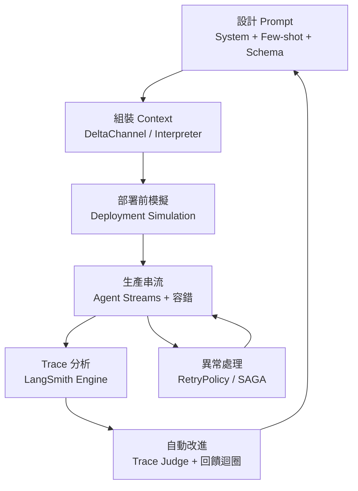
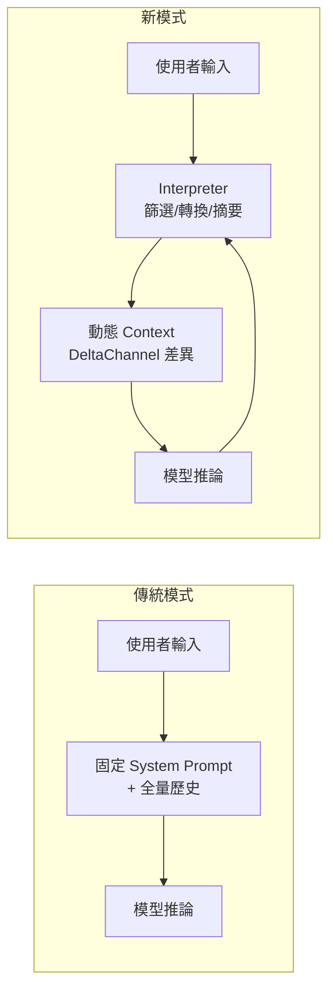
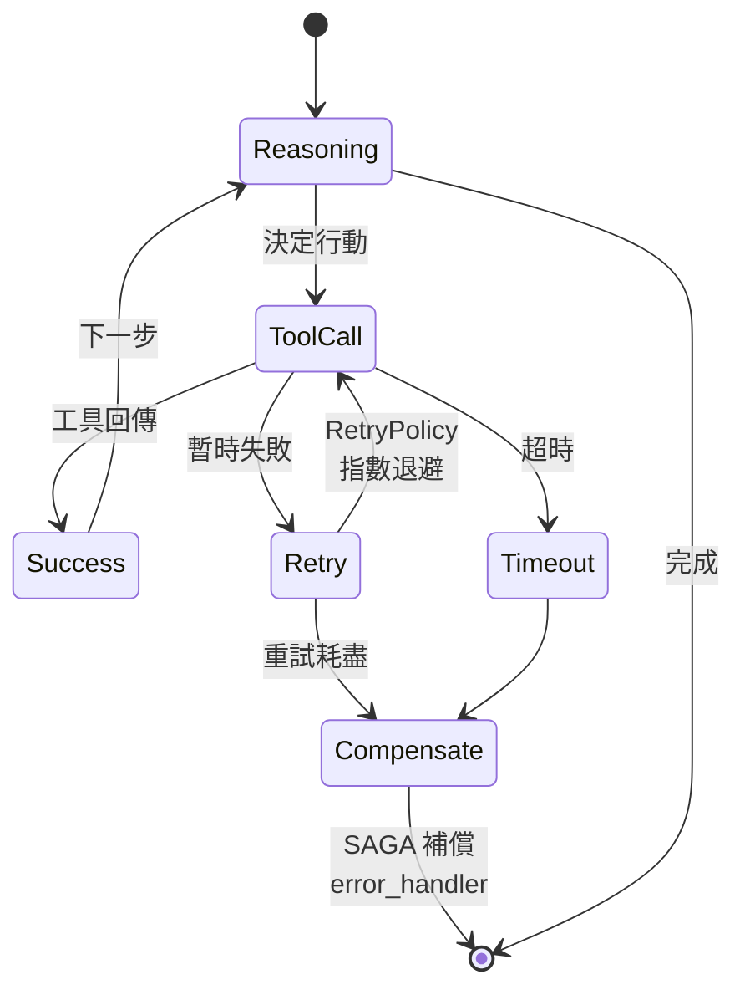
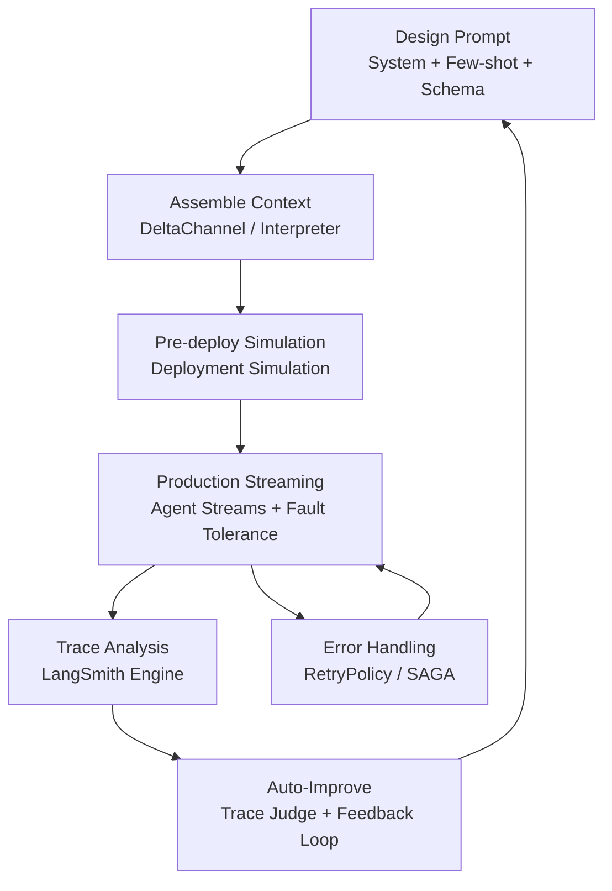
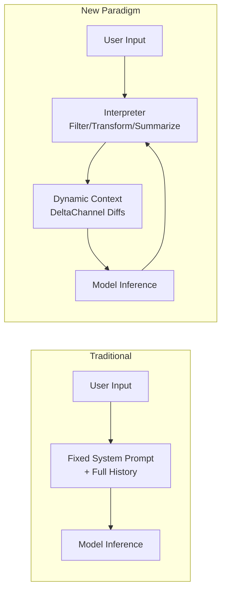
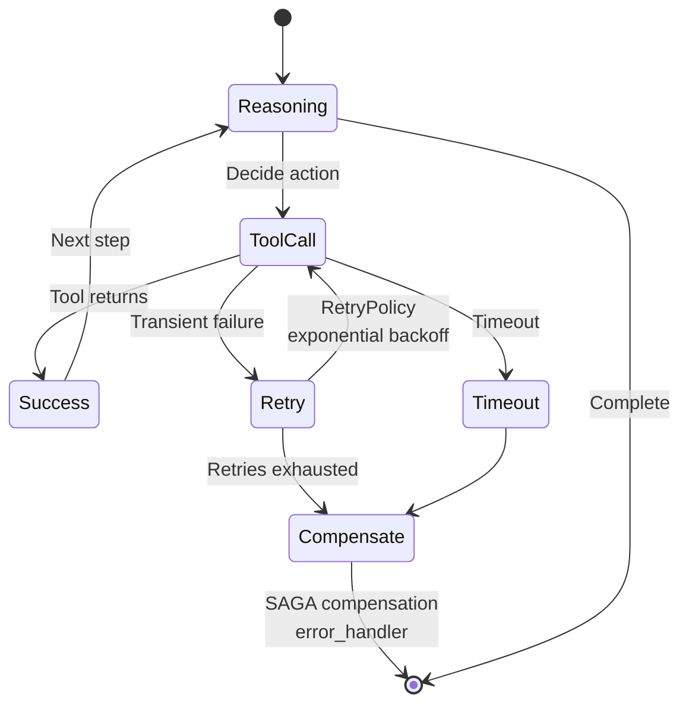

# Foundation — Track B: Prompt + Context Engineering

_Week 2026-W25 · 25 items synthesized · $0.6983 USD_

# 生產級 Prompt 與 Context 工程：從「寫提示詞」到「設計認知基礎設施」

## TL;DR (3 句繁中)
1. 本週訊號顯示，生產級 prompt/context 工程已從「寫好一段指令」演進為「設計一套包含狀態管理、容錯、串流、自我改進迴圈的認知基礎設施」——系統提示只是冰山一角。
2. 關鍵 trade-off 在於 context 密度 vs. 穩定性：嵌入式直譯器、DeltaChannel、Trace Judge 等新原語讓 agent 能操控自己的 context，但每多一層抽象就增加一層不可預測性，且出口管制等外部衝擊可能瞬間讓整個 prompt 架構失效。
3. 對 Livia 而言，台灣金融與製造客戶的下一階段對話應從「你的 prompt 有多好」轉向「你的 prompt 生命週期管理有多成熟」——涵蓋版本控制、容錯策略、成本感知評估、以及合規驅動的 context 邊界設計。

## 背景與問題框架

[推論] 六個月前，「prompt engineering」在多數企業對話中仍等同於「怎麼寫 system prompt 讓模型回答更準」。這是一個有用但嚴重低估問題複雜度的框架。2026 年中的訊號——從 LangGraph 的 DeltaChannel 到 Deep Agents 的嵌入式直譯器、從 LangSmith Engine 的自動 trace 分析到 DiffusionGemma 的平行生成——共同指向一個更大的圖景：**prompt 和 context 不再是靜態文字，而是動態、有狀態、需要被工程管理的系統資源**。

[原文] LangChain 在 Interrupt 2026 密集發布的一系列原語（RetryPolicy、TimeoutPolicy、DeltaChannel、Interpreter、Agent Streams）揭示了一個明確方向：prompt 的「周邊基礎設施」——即 context 如何被組裝、裁剪、容錯、串流、評估——已經成為決定生產系統成敗的主戰場。同時，OpenAI 的 [Deployment Simulation](https://openai.com/index/deployment-simulation) 提出用真實對話資料在部署前模擬模型行為，這本質上是在說：**你的 prompt 設計品質，必須用生產流量來驗證，而非靠人類直覺**。

[推論] 最戲劇性的背景事件是美國政府對 Anthropic Fable 5 / Mythos 5 的出口管制令。這看似與 prompt 工程無關，實則揭露了一個被忽視的系統性風險：當你的整個 prompt 架構——包括系統提示中的模型特定指令、few-shot 範例的格式、structured output 的 schema——都綁定在特定前沿模型上時，模型被一紙行政命令關閉就意味著你的 prompt 基礎設施歸零。這強化了一個我在後文會展開的核心論點：**生產級 prompt 工程必須是模型可攜的（model-portable）**。

## 核心概念解析（含 Mermaid 圖）

### 一、Prompt 生命週期：從靜態指令到動態認知管線

[推論] 傳統的 prompt engineering 教科書（如 Lilian Weng 的經典 blog post、DAIR.AI 的 Prompt Engineering Guide）把重心放在 prompt 的「撰寫」階段。但本週訊號揭示的生產現實是：撰寫只是生命週期的一小部分。一個 prompt 從誕生到退役，經歷的階段遠比想像中複雜。

以下圖示描繪一個生產級 prompt 的完整生命週期，整合本週多個訊號：

**關鍵洞察**：prompt 的品質不在起點（A）決定，而在整個迴圈的運轉效率決定。Factory 用 LangSmith 將迭代速度提升 2 倍（[原文](https://www.langchain.com/blog/customers-factory)），不是因為他們的初始 prompt 更好，而是因為他們的 E→F→A 迴圈更快。

### 二、Context 組裝的新原語：DeltaChannel 與嵌入式直譯器

[原文] LangGraph 1.2 引入的 [DeltaChannel](https://www.langchain.com/blog/delta-channels-evolving-agent-runtime) 解決了長時間運行 agent 的 O(N²) 儲存問題——每步只存差異，定期寫完整快照。這表面上是一個儲存優化，但其 prompt/context 工程含意深遠：**它意味著 agent 的 context 現在是增量組裝的，而非每次全量重建**。

[原文] 更激進的是 Deep Agents 的 [嵌入式直譯器（Interpreter）](https://www.langchain.com/blog/give-your-agents-an-interpreter)：agent 可以在 tool call 之間寫程式碼來協調工具、持有工作狀態、並決定什麼進入模型 context。這本質上是讓 agent 自己管理自己的 prompt context。

**關鍵洞察**：直譯器的引入意味著 context window 管理從「工程師預先設計 prompt template」轉變為「agent 在運行時自主決定 context 內容」。這是一個控制權的根本轉移，帶來能力但也帶來風險——agent 可能「遺忘」關鍵安全指令。

### 三、容錯作為 Prompt 工程的必要層

[原文] LangGraph 的 [容錯原語](https://www.langchain.com/blog/fault-tolerance-in-langgraph)——RetryPolicy（指數退避重試）、TimeoutPolicy（牆鐘時間 + 閒置時間上限）、error_handler（重試耗盡後的清理邏輯）——以及 SAGA pattern（多步驟工作流的補償交易）引入了一個常被 prompt 工程忽略的維度：**prompt 不只要讓模型「做對的事」，還要讓系統在模型「做錯的事」時能優雅恢復**。

[推論] 這與傳統 prompt engineering 的「防禦性提示」（defensive prompting，如「如果你不確定，請說不知道」）有本質差異。防禦性提示在 prompt 層面處理不確定性；RetryPolicy/SAGA 在系統層面處理失敗。生產系統需要兩者，但多數 prompt 工程指南只教前者。

**關鍵洞察**：SAGA pattern 的引入意味著 agent 的 prompt/context 設計必須包含「回滾敘事」——即系統提示不只要告訴 agent 怎麼做，還要告訴它「如果前三步做了但第四步失敗了，怎麼撤銷前三步的副作用」。這是 prompt 設計複雜度的一個階躍。

### 四、Trace-Driven Prompt 改進迴圈

[原文] [LangSmith Engine](https://www.langchain.com/blog/how-we-built-langsmith-engine-our-agent-for-improving-agents) 是一個「坐在你的 agent traces 上方的 agent」，它分析大量生產 trace、叢集失敗為命名議題、並建議修正方案和 eval 覆蓋率。搭配 [100x 更便宜的 Trace Judge](https://www.langchain.com/blog/building-a-100x-cheaper-trace-judge-with-fireworks)（透過 fine-tune 開源模型取代前沿模型做 trace 評估），一個成本可控的自動化 prompt 改進管線成為可能。

[推論] 這裡的核心 prompt 工程洞察是：**你的 prompt 品質指標不應該是人類評審的主觀分數，而應該是生產 trace 中可量化的失敗模式密度**。LangSmith Engine 本質上是在做「prompt 的 APM（Application Performance Monitoring）」。

[原文] OpenAI 的 [Deployment Simulation](https://openai.com/index/deployment-simulation) 從另一個角度驗證了同一原則：用真實對話資料預測模型行為，而非只靠 benchmark。這等於在說：prompt 的品質只有在遇到真實分佈的輸入時才能被準確評估。

### 五、DiffusionGemma 與 Prompt 設計的隱含假設

[原文] Google DeepMind 的 [DiffusionGemma](https://deepmind.google/blog/diffusiongemma-4x-faster-text-generation/) 是一個 26B MoE 模型，透過文字擴散（text diffusion）同時生成整個文字區塊，在 GPU 上達到 4 倍速度提升。

[推論] 這對 prompt 工程的含意被嚴重低估：目前的 prompt 設計隱含了「模型逐 token 順序生成」的假設。Chain-of-thought prompting、step-by-step 指令、甚至 structured output 的 JSON schema，都假設模型會從左到右線性產出。如果 text diffusion 模型成為主流，我們可能需要重新思考 prompt 的結構——因為模型不再是「先想第一步，再想第二步」，而是「同時想所有步驟，再逐步精煉」。這是一個 [假設]，目前 DiffusionGemma 仍在實驗階段，但值得追蹤。

## 與既有框架的對位

[推論] **Chip Huyen 的《AI Engineering》（2025）** 提出的 prompt engineering 分層——instruction → context → demonstration → format——仍然有效，但本週訊號顯示這個分層需要一個外層：**生命週期管理層**。Chip 的框架是「如何設計一個好的 prompt」，本週的訊號集體在說「如何運營一個 prompt 系統」。DeltaChannel 是 context 層的動態化；Interpreter 是 instruction 層的自主化；Trace Judge 是 format/demonstration 層的自動評估。

[推論] **Karpathy 的 "Software 2.0" 論文** 預見了神經網路取代手寫程式碼的趨勢，但沒有預見到 Software 2.0 的程式碼（即 prompt）本身也需要 DevOps。本週的 LangSmith Engine + Deployment Simulation 組合，本質上就是 **PromptOps**——prompt 的 CI/CD、monitoring、rollback 的完整工程實踐。

[推論] **NIST AI RMF** 的 GOVERN 和 MAP 函數要求組織「建立 AI 風險管理的治理結構」和「將 AI 系統的風險識別上下文化」。Anthropic 出口管制事件（[原文](https://simonwillison.net/2026/Jun/13/us-government-directive-to-suspend-access/#atom-everything)）直接挑戰了 RMF 中被低估的一個風險類別：**供應商鎖定風險（vendor lock-in risk）**。當你的整個 prompt 架構——包括利用特定模型的隱含行為（如 Claude 的 XML 偏好、GPT 的 JSON mode）——都綁在單一供應商時，一個出口管制令就能讓你的 MAP 評估完全失效。

## Trade-offs 與爭議

**1. Agent 自主 Context 管理 vs. 人類可稽核性**
- 正方：Interpreter 讓 agent 自主篩選 context，大幅提升長對話效率，減少 context window 浪費
- 反方：agent 決定什麼進入 context 就等於 agent 決定自己「看到」什麼——這是一個安全風險。如果 agent 在 interpreter 中摘要掉了安全相關的歷史訊息，後續行為可能違反原始系統提示的意圖
- [推論] 金融與醫療場景（如 BBVA、Boston Children's）必須在這個 trade-off 上偏向可稽核性

**2. 成本優化 Trace Judge vs. 評估品質**
- 正方：100x 成本降低使全量 trace 評估成為可能，開源 fine-tuned 模型做得到前沿模型的品質
- 反方：fine-tuned 評估模型的分佈偏移（distribution shift）風險——它只能評估訓練資料涵蓋的失敗模式。新類型的 prompt 失敗可能被系統性忽略
- [推論] 最佳實踐可能是分層：開源 Trace Judge 做第一道篩選，前沿模型做抽樣覆核

**3. 模型可攜性 vs. 模型特異性最佳化**
- 正方：Anthropic 出口管制事件證明了模型可攜性的必要性。Prompt 應該用模型無關的結構化指令
- 反方：每個模型家族有獨特的行為特性（Claude 偏好 XML、GPT 偏好 JSON、Gemini 的長 context 能力）。充分利用這些特性能帶來 10-20% 的品質提升
- [推論] 生產系統應採用「抽象層 + 模型適配器」模式：核心 prompt 邏輯是模型無關的，但有模型特定的 rendering layer

**4. Deployment Simulation vs. 靜態 Eval Suite**
- 正方：用真實對話資料做部署前模擬，能捕捉靜態 eval 遺漏的長尾行為
- 反方：真實對話資料包含 PII 和商業機密，在金融/醫療場景中使用受嚴格監管。且資料分佈會隨時間漂移，去年的對話資料可能不代表明年的使用模式
- [推論] 台灣金融業可能需要合成資料策略來橋接這個 gap

## 對 Livia IBM 客戶的具體含意

**國泰 / 玉山 (BFSI)**：
[推論] BBVA 的 100,000 員工 ChatGPT Enterprise 部署和 LSEG 的 4,000 員工 AI 啟用，提供了直接可對位的規模參考。但台灣銀行的對話重點不應該是「我們也要 ChatGPT Enterprise」，而應該是：「你的 prompt 治理框架——版本控制、A/B 測試、回滾機制、模型切換預案——準備好了嗎？」Anthropic 出口管制事件是最強的論證素材：如果你今天把所有客服 prompt 綁在 Claude 上，明天一紙公文就可能讓你的系統停擺。**提案 angle：Prompt 可攜性審計 + 多模型容錯架構設計**。

**TSMC / Foxconn (製造業)**：
[推論] Rippling 的案例（6 個月內在 HR/IT/財務/薪資/全球營運跨域部署 AI agent）是製造業 IT 主管最想聽的故事。關鍵論點：Rippling 能做到是因為他們有 LangSmith 做 trace 驅動的 prompt 改進迴圈。製造業的 prompt 挑戰不在於「寫得好」，而在於「跨工廠、跨語言、跨流程的 prompt 一致性管理」。**提案 angle：工廠級 prompt 標準化 + trace-driven 持續改進平台**。

**共通警示**：Travelers 的保險理賠 AI 助手和 Boston Children's 的罕病診斷案例表明，高風險場景的 prompt 需要 Deployment Simulation 等級的部署前驗證。台灣金管會 / 衛福部可能在未來 12-18 個月內要求類似機制。IBM 可以搶先提出框架。

## 對 Livia harness engineer portfolio 的含意

**Design Note 候選**：「Prompt Lifecycle Management Architecture」——將本週分析的六個原語（DeltaChannel、Interpreter、RetryPolicy/SAGA、Trace Judge、Agent Streams、Deployment Simulation）整合為一個架構圖，展示它們在 prompt 生命週期中的位置。這是一份能在 GitHub 上獨立存在的設計文件，展現系統思維而非零散技巧。

**面試問答框架**：當被問到「你怎麼做 prompt engineering」時，不要回答 prompt 技巧清單。用本文的生命週期框架回答：「我把 prompt 視為需要 DevOps 的軟體工件——有版本控制、有部署前模擬、有生產監控、有自動改進迴圈、有容錯策略、有模型可攜性抽象層。」這個回答直接將你定位在 Staff+ 工程師的思維層次。

**Portfolio narrative 接點**：本週深讀自然接到 Track A（Agents & Orchestration）和 Track C（Eval & Safety）。Prompt lifecycle 是三個 track 的交會點——agent 的品質取決於 prompt，prompt 的品質取決於 eval，eval 的可靠性取決於生產 trace。這個三角關係可以成為 portfolio 的核心架構論述。

---

# (English) Production-Grade Prompt & Context Engineering: From "Writing Prompts" to "Designing Cognitive Infrastructure"

## TL;DR (3 sentences)
1. This week's signals show production prompt/context engineering has evolved from "writing good instructions" to "designing a full infrastructure stack encompassing state management, fault tolerance, streaming, and self-improvement loops" — the system prompt is just the tip of the iceberg.
2. The key trade-off is context density vs. stability: new primitives like embedded interpreters, DeltaChannel, and Trace Judge let agents manage their own context, but each abstraction layer adds unpredictability, and external shocks like export controls can instantly invalidate an entire prompt architecture.
3. For Livia, the next phase of Taiwan BFSI and manufacturing client conversations should shift from "how good is your prompt" to "how mature is your prompt lifecycle management" — covering version control, fault tolerance, cost-aware evaluation, and compliance-driven context boundary design.

## Background & Problem Framing

[Inference] Six months ago, "prompt engineering" in most enterprise conversations still equated to "how to write a system prompt to make the model answer better." This is a useful but dangerously reductive framing. The mid-2026 signal cluster — from LangGraph's DeltaChannel to Deep Agents' embedded interpreters, from LangSmith Engine's automated trace analysis to DiffusionGemma's parallel generation — collectively points to a much larger picture: **prompts and context are no longer static text but dynamic, stateful system resources that require engineering management**.

[Source] The barrage of primitives LangChain released at Interrupt 2026 (RetryPolicy, TimeoutPolicy, DeltaChannel, Interpreter, Agent Streams) reveals a clear direction: the "surrounding infrastructure" of prompts — how context is assembled, trimmed, fault-toleranced, streamed, and evaluated — has become the decisive battleground for production system success. Meanwhile, OpenAI's [Deployment Simulation](https://openai.com/index/deployment-simulation) proposes using real conversation data to predict model behavior pre-deployment, essentially saying: **your prompt design quality must be validated against production traffic, not human intuition**.

[Inference] The most dramatic background event is the US government export control directive against Anthropic's Fable 5 / Mythos 5 ([source](https://simonwillison.net/2026/Jun/13/us-government-directive-to-suspend-access/#atom-everything)). While seemingly unrelated to prompt engineering, it exposes a systemically under-appreciated risk: when your entire prompt architecture — including model-specific instructions in system prompts, few-shot example formatting, structured output schemas — is bound to a specific frontier model, a single administrative order can zero out your prompt infrastructure. This reinforces a core argument I develop below: **production-grade prompt engineering must be model-portable**.

## Core Concepts (with Mermaid diagrams)

### 1. Prompt Lifecycle: From Static Instructions to Dynamic Cognitive Pipelines

[Inference] Traditional prompt engineering references (Lilian Weng's classic post, DAIR.AI's Prompt Engineering Guide) focus on the "authoring" phase. This week's signals reveal production reality: authoring is a small fraction of the lifecycle. The following diagram integrates multiple signals into a complete production prompt lifecycle:

**Key insight**: Prompt quality is not determined at point A, but by the efficiency of the entire loop. Factory achieved [2x iteration speed](https://www.langchain.com/blog/customers-factory) not because their initial prompts were better, but because their E→F→A loop was faster.

### 2. New Context Assembly Primitives: DeltaChannel & Embedded Interpreters

[Source] LangGraph 1.2's [DeltaChannel](https://www.langchain.com/blog/delta-channels-evolving-agent-runtime) solves the O(N²) storage problem for long-running agents — checkpointing only diffs each step with periodic full snapshots. The prompt/context implication runs deep: **agent context is now incrementally assembled, not fully reconstructed each turn**.

[Source] Even more radical is Deep Agents' [Interpreter](https://www.langchain.com/blog/give-your-agents-an-interpreter): agents write code between tool calls to coordinate tools, hold working state, and decide what enters model context. This is essentially letting the agent manage its own prompt context.

**Key insight**: The interpreter shifts context window management from "engineer pre-designs prompt templates" to "agent autonomously decides context contents at runtime." This is a fundamental transfer of control — powerful, but with the risk that agents may "forget" critical safety instructions.

### 3. Fault Tolerance as a Necessary Prompt Engineering Layer

[Source] LangGraph's [fault tolerance primitives](https://www.langchain.com/blog/fault-tolerance-in-langgraph) — RetryPolicy (exponential backoff), TimeoutPolicy (wall-clock + idle caps), error_handler (cleanup after retries exhausted), and the SAGA pattern (compensating transactions for multi-step workflows) — introduce a dimension routinely ignored by prompt engineering: **prompts must not only make models "do the right thing" but also enable systems to recover gracefully when models "do the wrong thing."**

[Inference] This differs fundamentally from "defensive prompting" (e.g., "if unsure, say I don't know"). Defensive prompting handles uncertainty at the prompt layer; RetryPolicy/SAGA handles failure at the system layer. Production systems need both.

**Key insight**: The SAGA pattern means prompt/context design must include "rollback narratives" — system prompts must tell agents not just how to act, but how to undo side effects when downstream steps fail.

### 4. Trace-Driven Prompt Improvement Loops

[Source] [LangSmith Engine](https://www.langchain.com/blog/how-we-built-langsmith-engine-our-agent-for-improving-agents) is an "agent that sits atop your agent traces," analyzing production traces, clustering failures into named issues, and proposing fixes and eval coverage. Paired with a [100x cheaper Trace Judge](https://www.langchain.com/blog/building-a-100x-cheaper-trace-judge-with-fireworks) (fine-tuned open model matching frontier model quality), a cost-viable automated prompt improvement pipeline becomes possible.

[Inference] The core prompt engineering insight: **your prompt quality metric should not be subjective human reviewer scores, but quantifiable failure-mode density in production traces**. LangSmith Engine is essentially "APM (Application Performance Monitoring) for prompts."

[Source] OpenAI's [Deployment Simulation](https://openai.com/index/deployment-simulation) validates the same principle from a different angle: predict model behavior using real conversation data, not just benchmarks. This says: prompt quality can only be accurately assessed against the real distribution of inputs.

### 5. DiffusionGemma and the Hidden Assumptions of Prompt Design

[Source] Google DeepMind's [DiffusionGemma](https://deepmind.google/blog/diffusiongemma-4x-faster-text-generation/) is a 26B MoE model that generates entire text blocks simultaneously via text diffusion, achieving 4x speedup on GPUs.

[Assumption] The prompt engineering implication is underappreciated: current prompt design implicitly assumes sequential token-by-token generation. Chain-of-thought prompting, step-by-step instructions, even structured output JSON schemas all assume left-to-right linear production. If text diffusion models become mainstream, we may need to rethink prompt structure — because the model is no longer "thinking step 1, then step 2" but "thinking all steps simultaneously, then refining." This is speculative but worth tracking.

## Mapping to Existing Frameworks

[Inference] **Chip Huyen's *AI Engineering* (2025)** proposed a prompt engineering layering — instruction → context → demonstration → format — that remains valid, but this week's signals show the layering needs an outer shell: **a lifecycle management layer**.
