# 🗞️ AI Intel Digest — 2026-W26

_Generated 2026-06-26 00:06 UTC · 110 high-signal items synthesized · $0.4080 USD cost · ~102 分鐘讀完_


## ⚡ 本週 TL;DR — 5 Pillar 各一句
- 🏦 **P1**: 支付詐欺基準測試：GBDTs 守熱路徑，AI Agent 攻冷路徑
- 📊 **P2**: 德國法院裁定 + Schneier 論述：部署者為 AI 輸出負全責，銀行與製造商不能再用「模型出錯」當擋箭牌
- 🚀 **P3**: GLM-5.2：開源模型首次真正跨越 agentic 能力門檻
- 🛠️ **P4**: LangChain 釋出完整 Agent 生產工具鏈：SmithDB、Rubrics、LangSmith Engine 三位一體
- 🌐 **P5**: Anthropic 指控阿里巴巴透過 2.5 萬假帳號對 Claude 發動史上最大規模蒸餾攻擊

## 📊 本期 provenance 分布（合成證據強度）

_本期合成共 83 段，標記為：_

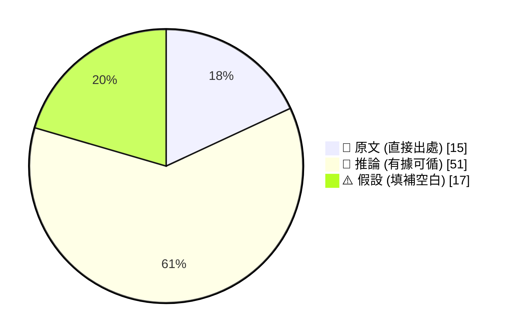

_引用規範：📖 可直接引用；🧠 客戶會議前查 verification hints；⚠️ 引用時明說「此為推測」_

## 🔄 本期 pipeline 處理流程

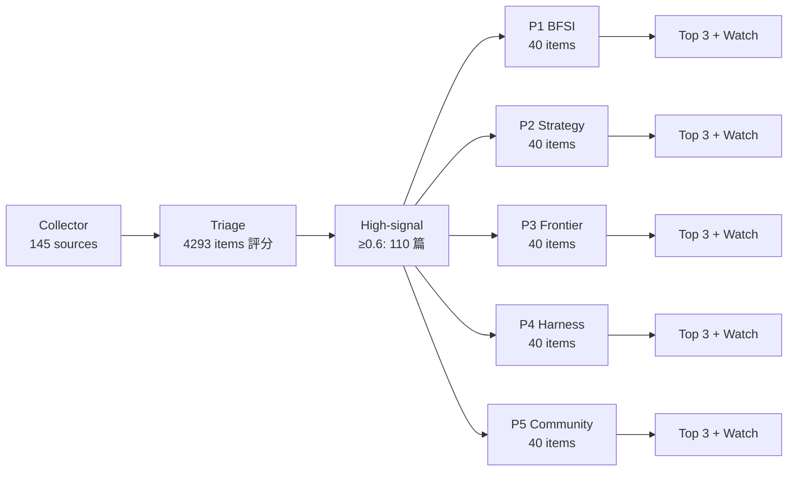

## 📑 目錄
- [Pillar 1 — 產業 AI 真實落地 (BFSI + 製造業)](#pillar-1) · 19 items · $0.0776
- [Pillar 2 — AI 戰略 / 治理 / 董事會層級論述](#pillar-2) · 18 items · $0.0802
- [Pillar 3 — Frontier 能力 + 模型動向](#pillar-3) · 23 items · $0.0876
- [Pillar 4 — Harness Engineering 實作技藝](#pillar-4) · 40 items · $0.1004
- [Pillar 5 — 學派 / 社群 / 思想動態](#pillar-5) · 10 items · $0.0622
- [📚 Foundation 深讀](#foundation) · curriculum 主題深度文


---

<a id="pillar-1"></a>

## 🏦 Pillar 1 — 產業 AI 真實落地 (BFSI + 製造業)
_19 items · $0.0776_

## Pulse — Top 3

### 1. 支付詐欺基準測試：GBDTs 守熱路徑，AI Agent 攻冷路徑

🧠 **推論** Towards Data Science 發布一份可重現的支付詐欺基準測試，結論明確：高頻交易的即時判斷（hot path）仍由 Gradient Boosted Decision Trees（GBDTs）主導，因為其 latency 與成本遠低於 LLM agent；但低頻、複雜的調查案件（cold path）——例如需要跨系統查詢、多步驟推理的詐欺申訴——才是 agent 真正能創造價值的場景。

🧠 **推論** 這個「分路架構」對台灣銀行業的含意是：不要用 agent 替換已運作良好的規則引擎或 GBDT 模型，而是讓 agent 接手規則引擎拒絕後的人工審核流程，降低 false positive 的人力成本。

下圖說明熱路徑與冷路徑的分工架構：

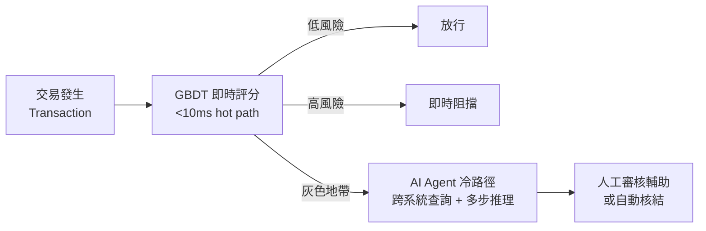

*關鍵洞察：Agent 不是要取代 GBDT，而是承接 GBDT 無法快速判決的灰色地帶，才能真正降低人工成本。*

- 來源：[Towards Data Science](https://towardsdatascience.com/the-hot-path-belongs-to-gbdts-agents-own-the-cold-path-a-payment-fraud-benchmark/)
- 對客戶的具體含意：向國泰、玉山、中信提 AI agent 詐欺方案時，先釐清客戶目前 GBDT/規則引擎的 hot path 架構，再定位 agent 為「灰色地帶審核加速器」，而非全面取代，這樣 ROI 論述才站得住腳。

**(English)** **Payment-Fraud Benchmark: GBDTs Own the Hot Path, Agents Own the Cold Path**

🧠 **推論** A reproducible benchmark published on Towards Data Science draws a sharp line: real-time high-frequency fraud decisioning (the hot path) still belongs to GBDTs because their latency and cost profile is orders of magnitude better than LLM agents; but low-frequency, complex investigation cases (the cold path)—think cross-system queries and multi-step reasoning for fraud disputes—are exactly where agents earn their keep.

🧠 **推論** The implication for Taiwan banks is architectural: do not use agents to replace well-tuned GBDT pipelines; instead, route GBDT "uncertain" cases to an agent layer that reduces the human review burden on false positives.


*Key insight: Agents don't replace GBDTs — they absorb the grey-zone decisions GBDT can't quickly resolve, which is where the real human-cost savings lie.*

- Source: [Towards Data Science](https://towardsdatascience.com/the-hot-path-belongs-to-gbdts-agents-own-the-cold-path-a-payment-fraud-benchmark/)
- Client implication: When pitching AI agent fraud solutions to Cathay, E.SUN, or CTBC, first map the client's existing hot-path GBDT/rules-engine architecture, then position agents as "grey-zone review accelerators"—not full replacements—to make the ROI case credible.

---

### 2. Klarna AI 客服助理：8,500 萬用戶規模下，解決時間縮短 80%

📖 **原文** Klarna 使用 LangGraph 與 LangSmith 建置 AI 客服助理，在 8,500 萬活躍用戶規模下，實現客戶問題解決時間縮短 80%。

🧠 **推論** LangGraph 提供有狀態的 agent 工作流程（stateful multi-step reasoning），LangSmith 負責 production 監控與 tracing——這個組合解決了純 LLM chatbot 最常見的兩個問題：無法記住對話狀態、上線後無法 debug。

🧠 **推論** 對台灣銀行的客服中心而言，這個案例的關鍵不是「AI 取代客服」，而是 agent orchestration + observability 工具組合已在金融規模下被驗證，可直接作為 Livia IBM 方案的參考架構。

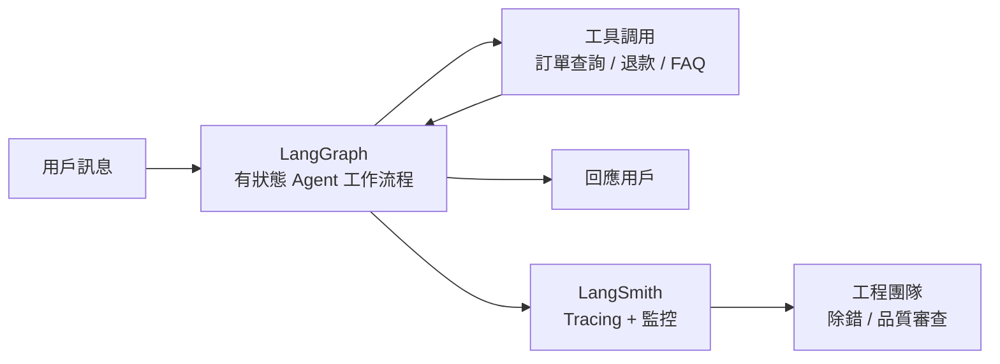

*關鍵洞察：LangSmith 的 observability 層讓 agent 行為在 production 可被解釋與修正，這在金融場景的法規合規要求下尤為重要。*

- 來源：[LangChain Blog](https://www.langchain.com/blog/customers-klarna)
- 對客戶的具體含意：向台新、富邦提客服 AI 方案時，直接引用 Klarna 的 80% 解決時間縮短作為 benchmark，並強調 LangSmith 式的 tracing 能滿足金管會對 AI 決策可解釋性的潛在要求。

**(English)** **Klarna's AI Assistant: 80% Faster Resolution at 85 Million Active Users**

📖 **原文** Klarna deployed an AI assistant using LangGraph and LangSmith, achieving 80% faster customer resolution times at a scale of 85 million active users.

🧠 **推論** LangGraph provides stateful multi-step agent workflows, while LangSmith handles production monitoring and tracing—this combination addresses the two most common failure modes of pure LLM chatbots: inability to maintain conversation state and zero debuggability post-launch.

🧠 **推論** For Taiwan bank contact centers, the key takeaway is not "AI replaces agents" but that this agent orchestration + observability toolchain has now been validated at financial scale, and can serve directly as a reference architecture for Livia's IBM engagements.


*Key insight: The LangSmith observability layer makes agent behavior explainable and correctable in production—critical for financial sector regulatory requirements around AI decision transparency.*

- Source: [LangChain Blog](https://www.langchain.com/blog/customers-klarna)
- Client implication: When pitching contact-center AI to Taishin or Taipei Fubon, cite Klarna's 80% resolution-time reduction as a benchmark, and lead with LangSmith-style tracing as the answer to FSC auditability requirements.

---

### 3. 企業 AI 投入 300–400 億美元，95% 財報上看不到回報——數據孤島是主因

🧠 **推論** INSIDE 硬塞引用 MIT 報告指出，全球企業在生成式 AI 上已投入 300 至 400 億美元算力成本，但高達 95% 的企業在財報上未見任何實質財務回報。

🧠 **推論** 討論指向根本原因是數據孤島（data silos）：企業買了最貴的模型，但底層的 ERP、CRM、核心銀行系統數據互不相通，AI 無法存取真正有價值的 operational data。

⚠️ **假設** 95% 這個數字未經本摘要獨立核實，MIT 原始報告細節需確認；但即使數字有出入，「數據整合先於模型採購」的邏輯對台灣銀行業仍高度適用——台灣銀行普遍面臨多年累積的系統碎片化問題。這是 Livia 在提案時最強的反制銷售武器：客戶問「要買哪個模型」，正確答案是「先問你的數據有沒有打通」。

- 來源：[INSIDE 硬塞](https://www.inside.com.tw/feature/side-chat/41584-sidechatliveshow_fusionnext2026)
- 對客戶的具體含意：在提案簡報加入一頁「數據就緒度評估」（data readiness assessment），用 MIT 95% failure rate 數據開場，主動替客戶診斷數據孤島問題，IBM 的數據整合服務就自然成為 AI 方案的前置必要條件。

**(English)** **$30–40B Spent on Enterprise AI, 95% See Zero P&L Impact — Data Silos Are the Root Cause**

🧠 **推論** INSIDE (Taiwan tech media) citing an MIT report states that global enterprises have spent $30–40 billion in compute costs on generative AI, yet 95% of companies see no measurable financial return when they examine their financials.

🧠 **推論** The panel discussion converges on data silos as the root cause: companies buy the most expensive models, but the underlying ERP, CRM, and core banking system data remain disconnected, leaving AI unable to access operationally valuable information.

⚠️ **假設** The 95% figure has not been independently verified by this briefing—the original MIT report and its methodology need to be confirmed; however, even if the number shifts, the logic of "data integration before model procurement" remains highly applicable to Taiwan banks, which broadly suffer from years of accumulated system fragmentation. This is Livia's strongest counter-consultative selling tool: when a client asks "which model should we buy," the right answer is "first ask whether your data is connected."

- Source: [INSIDE 硬塞](https://www.inside.com.tw/feature/side-chat/41584-sidechatliveshow_fusionnext2026)
- Client implication: Add a "data readiness assessment" slide to your pitch deck, open with the MIT 95% failure-rate statistic, proactively diagnose the client's data silo problem, and IBM's data integration services become a natural prerequisite to any AI engagement.

---

## Watch list

繁中為主，每條一行：

- [LangChain Blog](https://www.langchain.com/blog/lyft-built-a-self-serve-ai-agent-platform-for-customer-support-with-langgraph-and-langsmith) — Lyft 用 LangGraph + LangSmith 將 agent 開發週期從數月壓縮至數週，self-serve 平台架構細節值得參考
- [iThome](https://www.ithome.com.tw/news/176872) — 高通收購 Modular，AI 模型跨 CPU/GPU/NPU/ASIC 部署無需重寫程式碼，降低製造業跨晶片 AI 部署門檻
- [iThome](https://www.ithome.com.tw/news/176868) — OpenAI 聯手博通發表首款自研推論晶片 Jalapeño，2026 底部署，供應鏈影響值得 TSMC/MediaTek 客戶追蹤
- [INSIDE 硬塞](https://www.inside.com.tw/article/41648-anthropic-alibaba-claude-distillation-attack) — Anthropic 指控阿里以 2.5 萬假帳號蒸餾 Claude；對台灣企業採購 AI 服務的 IP 與合規風險有參考價值
- [OpenAI Blog](https://openai.com/index/samsung-electronics-chatgpt-codex-deployment) — 三星全球員工部署 ChatGPT Enterprise + Codex，製造業 LLM 落地規模基準
- [McKinsey QuantumBlack](https://www.mckinsey.com/industries/technology-media-and-telecommunications/how-we-help-clients/how-kpn-is-building-an-agentic-ai-engine-for-customer-care) — KPN 電信 agentic AI 客服引擎案例，有治理與工程角度，但屬廠商敘事需批判閱讀
- [AWS Industries](https://aws.amazon.com/blogs/industries/reimagining-b-pillar-dfmea/) — 汽車製造 B-pillar DFMEA 導入 ontology-grounded agent，安全關鍵製造場景的架構模式
- [OpenAI Blog](https://openai.com/index/chatgpt-enterprise-spend-controls) — ChatGPT Enterprise 新增用量分析與支出控管，採購決策參考
- [Databricks](https://www.databricks.com/blog/how-daikin-applied-americas-builds-consistent-data-pipelines-scale-genie-code) — 大金空調用 Genie Code 建置 agentic 數據管道，製造業 LLM 輔助 ETL 的真實落地案例

---

## Verification hints

This briefing contains **4

🧠 **推論** segments** and **2

⚠️ **假設** segments**. Before citing in client conversations, verify these specific points (English for language-learning practice):

1. **

⚠️ **假設** The 95% enterprise AI ROI failure rate** — The INSIDE article attributes this to an MIT report, but the original MIT publication title, date, and methodology are not specified in the excerpt. Locate the primary MIT source before citing this number to a CFO or board-level audience. Search MIT Sloan Management Review or MIT CSAIL publications from early 2026.
2. **

🧠 **推論** Klarna's 80% faster resolution time** — The LangChain blog post is a Klarna case study published by LangChain, a vendor with commercial interest. Verify whether this metric is independently audited, what the baseline measurement period was, and whether "resolution time" means first-contact resolution or average handle time. URL: [https://www.langchain.com/blog/customers-klarna](https://www.langchain.com/blog/customers-klarna)
3. **

🧠 **推論** The hot-path/cold-path GBDT vs. agent architecture** — The Towards Data Science benchmark claims reproducibility; verify whether the dataset used is publicly available, what fraud types were tested (CNP, ATO, synthetic identity), and whether the latency figures are based on hosted API calls or self-hosted inference — this matters significantly for Taiwan bank on-premise deployment scenarios. URL: [https://towardsdatascience.com/the-hot-path-belongs-to-gbdts-agents-own-the-cold-path-a-payment-fraud-benchmark/](https://towardsdatascience.com/the-hot-path-belongs-to-gbdts-agents-own-the-cold-path-a-payment-fraud-benchmark/)2026-06-25 23:57:38,769 INFO pillar 2 (AI 戰略 / 治理 / 董事會層級論述): 18 high-signal items (min_signal=0.60)

---

<a id="pillar-2"></a>

## 📊 Pillar 2 — AI 戰略 / 治理 / 董事會層級論述
_18 items · $0.0802_

## Pulse — Top 3

### 1. 德國法院裁定 + Schneier 論述：部署者為 AI 輸出負全責，銀行與製造商不能再用「模型出錯」當擋箭牌

📖 **原文** 德國法院裁定 Google 對其 AI Overview 的錯誤內容負有法律責任；Bruce Schneier 在 Simon Willison 的整理中指出：「AI agents 是部署組織的代理人，法律應如此對待」——若企業聘用真人撰寫摘要，企業須負責；隱藏在 AI 錯誤背後不應是法律豁免。

🧠 **推論** 這個裁定邏輯若在台灣或 EU 管轄範圍內被援引，Cathay、E.SUN、CTBC 等行內凡是對外提供 AI 生成建議（理財、貸款資格、客服回應）的場景，將直接承擔輸出錯誤的法律後果，無論底層模型是 OpenAI 還是自建。對 Livia 的 harness 實作而言，這意味著每個 agent output 都必須有 audit trail——不是選配，是法律防線。

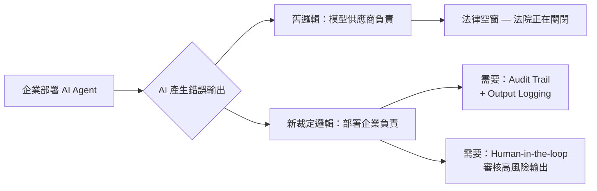

*上圖核心洞察：法律責任已從模型供應商移轉至部署組織，audit trail 從「nice-to-have」變成法律必要條件。*

- 來源：[Simon Willison — AI and Liability](https://simonwillison.net/2026/Jun/25/ai-and-liability/#atom-everything)
- 對客戶的具體含意：與 Cathay 或 CTBC 討論 AI 客服或理財建議部署時，主動提出 output logging + human review threshold 設計，可直接對應董事會層級的法律曝險問題。

**(English)** **German court ruling + Schneier argument: AI deployers bear full legal liability for outputs — banks and manufacturers can no longer hide behind "the model made an error"**

[Original] A German court ruled that Google is liable for factual errors in its AI Overviews. Bruce Schneier, as summarized by Simon Willison, frames the principle plainly: "AI agents are agents of the person or organization that deploys them — and should be treated by the law as such." If a company hired human writers to produce summaries, it would be liable for inaccuracies; sheltering behind AI errors in the same circumstances would be a massive legal handout. [Inference] If this reasoning is cited under Taiwan or EU jurisdiction, banks like Cathay, E.SUN, and CTBC that surface AI-generated advice in customer-facing flows — wealth management, loan eligibility, customer service responses — will bear direct legal exposure for output errors, regardless of whether the underlying model is OpenAI or homegrown. For Livia's harness builds, this means every agent output path needs an audit trail — not optional, but a legal defense layer.


*Key insight: Legal liability has shifted from model vendors to deploying organizations; audit trails move from nice-to-have to legally mandatory.*

- Source: [Simon Willison — AI and Liability](https://simonwillison.net/2026/Jun/25/ai-and-liability/#atom-everything)
- Client implication: When pitching AI customer service or wealth advisory deployments to Cathay or CTBC, proactively structuring output logging and human review thresholds directly addresses board-level legal exposure — before the legal team raises it.

---

### 2. Anthropic 指控阿里巴巴以 2.5 萬個假帳號對 Claude 進行「蒸餾攻擊」，稱史上最大規模技術擷取

📖 **原文** Anthropic 公開指控阿里巴巴透過約 2.5 萬個虛假帳戶，對 Claude 進行大規模「distillation attack」——系統性地抽取模型核心能力，繞過 Terms of Service。

🧠 **推論** 這個事件對台灣銀行與製造業客戶有兩層含意：第一，若客戶正在評估「用 API 呼叫 Claude 大量生成訓練資料再蒸餾自建模型」作為降成本策略，這條路現在有明確法律與聲譽風險；第二，從 Anthropic 的角度，此事件將加速 frontier labs 對 enterprise API 用量異常的監控與限流，台灣客戶的 production deployment 需要準備用量合規文件（legitimate use case documentation）。

⚠️ **假設** 目前尚不清楚 Anthropic 是否已對阿里巴巴提起法律訴訟，或僅為公開聲明；後續法律進展將決定此事件的實質約束力。

- 來源：[INSIDE 硬塞 — Anthropic 指控阿里巴巴蒸餾 Claude](https://www.inside.com.tw/article/41648-anthropic-alibaba-claude-distillation-attack)
- 對客戶的具體含意：若銀行或 TSMC 供應鏈夥伴正在評估「API 大量呼叫 + 蒸餾自建模型」作為 AI 策略，現在必須將 IP 合規風險納入架構決策，優先考慮正規 fine-tuning 合約或 on-premise 授權。

**(English)** **Anthropic accuses Alibaba of running a distillation attack via 25,000 fake accounts against Claude — calls it the largest-ever technical extraction**

[Original] Anthropic publicly accused Alibaba of conducting a large-scale "distillation attack" on Claude using approximately 25,000 fake accounts, systematically extracting core model capabilities in violation of its Terms of Service. [Inference] For Taiwan's banks and manufacturers, this has two implications. First, any client evaluating "bulk API calls to Claude to generate training data, then distill into a proprietary model" as a cost-reduction strategy now faces clear legal and reputational risk. Second, from Anthropic's side, this incident will accelerate frontier labs' monitoring and rate-limiting of anomalous enterprise API usage — Taiwan clients in production deployments should prepare legitimate-use-case documentation for their API contracts. [Assumption] It is currently unclear whether Anthropic has filed formal legal action against Alibaba or whether this is a public statement only; the binding force of this incident depends on subsequent legal proceedings.

- Source: [INSIDE 硬塞 — Anthropic accuses Alibaba of distilling Claude](https://www.inside.com.tw/article/41648-anthropic-alibaba-claude-distillation-attack)
- Client implication: If any bank or TSMC supply chain partner is evaluating "bulk API + distillation into proprietary model" as an AI strategy, IP compliance risk must now enter the architecture decision — prioritize formal fine-tuning agreements or on-premise licensing instead.

---

### 3. 企業 AI ROI 失敗根因：台灣面板討論指向數據孤島，MIT 報告稱 95% 企業無財務回報

📖 **原文** INSIDE 硬塞引用 MIT 最新報告：全球企業在生成式 AI 已投入 300–400 億美元算力成本，但高達 95% 的企業在財報中看不到任何實質財務回報或利潤影響。台灣 M觀點 / 科技浪 / 車庫一姊的討論指向核心原因：「關鍵不在模型，在被孤立的數據」。

🧠 **推論** 這個框架對 Livia 的 IBM consulting pitch 具有直接武器價值：台灣銀行（Cathay、E.SUN）和製造商（Foxconn、Wistron）的 AI 投資停滯，通常不是因為選錯模型，而是因為 core banking 系統、ERP、MES 的數據從未整合到 AI 可存取的層次。IBM watsonx + data fabric 架構正好對應這個診斷——但要小心：

⚠️ **假設** MIT 報告的「95% 無財務回報」數字尚未在本摘要中核實原始報告來源與方法論，引用前應確認。

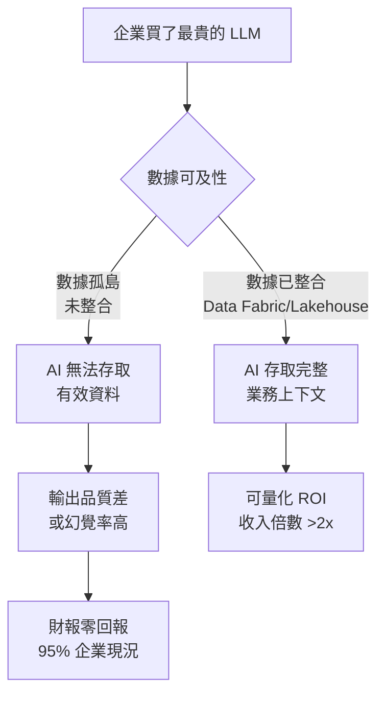

*核心洞察：AI ROI 失敗的瓶頸在數據整合層，而非模型選擇——這是 IBM data & AI 架構的直接切入點。*

- 來源：[INSIDE 硬塞 — 買了最貴的 AI 卻解決不了傳統問題](https://www.inside.com.tw/feature/side-chat/41584-sidechatliveshow_fusionnext2026)
- 對客戶的具體含意：在銀行或製造商的 AI 策略簡報開場，用「95% 企業無財務回報，根因是數據孤島」作為診斷框架，再提出 IBM data fabric 整合路徑，比從模型功能出發更能打中 CIO 與 CFO 的痛點。

**(English)** **Root cause of enterprise AI ROI failure: Taiwan panel discussion points to data silos; MIT report cited as showing 95% of companies see no financial return**

[Original] INSIDE 硬塞 cites a recent MIT report stating that global enterprises have invested $30–40 billion in generative AI compute costs, yet 95% of companies see no measurable financial return or profit impact in their financial statements. A Taiwan panel discussion (M觀點 / 科技浪 / Thelma) identifies the core culprit: "The issue is not the model — it's isolated data." [Inference] This framing is directly weaponizable in Livia's IBM consulting pitches: AI investment stalls at Taiwan banks (Cathay, E.SUN) and manufacturers (Foxconn, Wistron) typically result not from wrong model selection but from core banking systems, ERP, and MES data never being integrated into a layer accessible to AI. IBM watsonx + data fabric architecture maps exactly onto this diagnosis. [Assumption] However, the "95% no financial return" figure cited from the MIT report has not been independently verified in this digest — the original report's methodology and sample should be confirmed before citing in client conversations.


*Key insight: The AI ROI bottleneck sits at the data integration layer, not model selection — this is the direct entry point for IBM data & AI architecture proposals.*

- Source: [INSIDE 硬塞 — Bought the most expensive AI but can't solve traditional problems](https://www.inside.com.tw/feature/side-chat/41584-sidechatliveshow_fusionnext2026)
- Client implication: Open bank or manufacturer AI strategy presentations with the "95% no ROI, root cause is data silos" diagnostic frame, then offer IBM data fabric integration as the path forward — this lands harder with CIOs and CFOs than leading with model capabilities.

---

## Watch list

繁中為主，每條一行：

- [McKinsey — Beyond productivity: How AI creates value in private equity](https://www.mckinsey.com/capabilities/business-building/our-insights/beyond-productivity-how-ai-creates-value-in-private-equity) — 擁抱 AI 的 PE 投資組合企業收入倍數中位數是純生產力導向企業的兩倍以上，董事會級資本配置論述的數字支撐
- [Practical AI — AIUC-1: Building trust in AI agents](https://share.transistor.fm/s/e039d1ca) — AIUC-1 框架：standards → certification → audit → insurance 的 agent 信任飛輪，對銀行 AI 採購合規說明有參考價值
- [LangChain — How LangSmith and LangChain OSS Help You Meet EU AI Act Requirements](https://www.langchain.com/blog/langsmith-langchain-oss-eu-ai-act) — EU AI Act 合規截止日 2026-08-02，具體工具對應條文，對有歐洲業務的台灣企業有時效性
- [Import AI 462 — Superpersuasion; self-sustaining AI; paths to ASI](https://jack-clark.net/2026/06/22/import-ai-462-superpersuasion-self-sustaining-ai-paths-to-asi/) — Oxford/Stanford/UK AISI 研究顯示 AI 說服力已可靠超越人類專家，對銀行 AI 客服治理有潛在風險含意
- [LangChain — Why the Best AI Agents Are Simple (Sierra)](https://www.langchain.com/blog/why-the-best-agents-are-simpler-than-you-think-sierra-max-agency-podcast) — 「避免 org chart shipping」與 outcome-based pricing 的 agent 架構哲學，對製造業 agent 部署設計有指導價值
- [Databricks — Why the Frontier Ecosystem must be Open](https://www.latent.space/p/databricks) — Matei Zaharia 對 Agent Cloud 基礎設施的框架性思考，open vs. closed 生態系策略論述
- [McKinsey — What matters most to investors in 2026](https://www.mckinsey.com/capabilities/strategy-and-corporate-finance/our-insights/what-matters-most-to-investors-in-2026-and-what-it-means-for-companies) — AI 顛覆與地緣政治並列為 2026 年投資人首要關切，董事會溝通材料的背景脈絡
- [Platformer — The CEO of AWS on why Amazon is hiring 11,000 interns](https://www.platformer.news/matt-garman-aws-ceo-interview-ai-jobs/) — AWS CEO 同時擴招初級人才又賣 AI agents 執行相同工作，勞動力替代論述的一手矛盾案例
- [OpenAI — ChatGPT Enterprise spend controls](https://openai.com/index/chatgpt-enterprise-spend-controls) — Enterprise 用量分析與支出上限新功能，採購談判時的參考工具
- [McKinsey — How KPN is building an agentic AI engine for customer care](https://www.mckinsey.com/industries/technology-media-and-telecommunications/how-we-help-clients/how-kpn-is-building-an-agentic-ai-engine-for-customer-care) — 電信業 contact center agentic AI 案例，可類比台灣銀行客服部署，但注意 McKinsey 自述案例的敘事風險

---

## Verification hints

This briefing contains **3

🧠 **推論**** segments and **2

⚠️ **假設**** segments. Before citing in client conversations, verify these specific points (English for language-learning practice):

1. **

⚠️ **假設** Anthropic vs. Alibaba legal status**: The INSIDE 硬塞 article reports Anthropic's accusation but does not confirm whether formal legal proceedings have been filed. Before citing "Anthropic is suing Alibaba," verify the current legal status at [the original source](https://www.inside.com.tw/article/41648-anthropic-alibaba-claude-distillation-attack) and cross-reference with Anthropic's official communications.

2. **

⚠️ **假設** MIT "95% no financial return" figure**: The INSIDE 硬塞 panel cites an MIT report with this statistic, but the original MIT report title, publication date, and methodology are not surfaced in the excerpt. Before using this figure in a client deck, locate the primary MIT source to confirm sample size, definition of "financial return," and whether the 95% figure is for gen AI specifically or AI broadly.

3. **

🧠 **推論** German court ruling scope and Taiwan/cross-border applicability**: The Simon Willison item summarizes a German ruling on Google AI Overviews as interpreted by Bruce Schneier. The inference that this applies to Taiwan banks' AI deployments is an extrapolation — verify whether Taiwan's Financial Supervisory Commission (FSC) or courts have issued analogous guidance on AI output liability, and whether the German precedent has persuasive (not binding) force in Taiwan's legal context.2026-06-25 23:59:12,464 INFO pillar 3 (Frontier 能力 + 模型動向): 23 high-signal items (min_signal=0.60)

---

<a id="pillar-3"></a>

## 🚀 Pillar 3 — Frontier 能力 + 模型動向
_23 items · $0.0876_

## Pulse — Pillar 3｜Frontier 能力 + 模型動向

---

## Pulse — Top 3

### 1. GLM-5.2：開源模型首次真正跨越 agentic 能力門檻

🧠 **推論** Zhipu AI 的 GLM-5.2 在社群 vibe check 中獲得普遍認可，Nathan Lambert（Interconnects）直接稱其為「open agents 的階段性躍升」——這不是例行的 benchmark 數字改善，而是他長期追蹤的 capability threshold 被突破。

🧠 **推論** 對 Livia 的工程線來說，這意味著 open-weight agent 首次可以在不依賴 GPT-4.1 或 Claude 的前提下，承擔真實的多步驟任務；對台灣銀行客戶而言，自建 on-premise agent（法規合規需求）的可行性明顯提升。Jack Clark（Import AI）同週警告 AI 系統在說服力上已「reliably 超越 expert humans」，GLM-5.2 的開源性質讓此能力更難管控，監理單位注意到的時間點恐怕快於銀行 IT 預期。

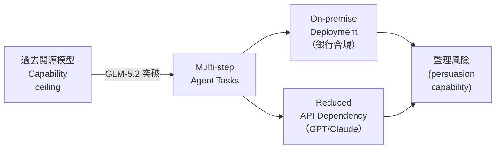
*關鍵洞察：開源 agent 能力門檻一旦突破，合規優勢（資料不出境）與監理風險（說服力失控）同時浮現。*

- 來源：[Interconnects — GLM-5.2 is the step change for open agents](https://www.interconnects.ai/p/glm-52-is-the-step-change-for-open)；[Latent Space AINews](https://www.latent.space/p/ainews-glm-gpt-glm-52-passes-vibe)；[Import AI 462](https://jack-clark.net/2026/06/22/import-ai-462-superpersuasion-self-sustaining-ai-paths-to-asi/)
- 對客戶的具體含意：向 Cathay / E.SUN 資安長提案時，可將 GLM-5.2 的開源 agent 能力與「說服力超越人類」的 Oxford/Stanford 研究並排，具體化為「AI-enabled social engineering」威脅情境，推動 AI 治理框架採購決策。

**(English)** GLM-5.2: First Open-Weight Model to Genuinely Cross the Agentic Capability Threshold

🧠 **推論** Zhipu AI's GLM-5.2 passed the community vibe check broadly, with Nathan Lambert (Interconnects) calling it a "step change for open agents" — not a routine benchmark increment but a crossing of a capability threshold he had been carefully monitoring.

🧠 **推論** For Livia's harness engineering track, this means an open-weight agent can, for the first time, handle real multi-step tasks without depending on GPT-4.1 or Claude; for Taiwan bank clients, the feasibility of building on-premise agents (driven by data-residency compliance requirements) has meaningfully improved. Jack Clark (Import AI) warned the same week that AI systems are now "reliably more persuasive than expert humans" per Oxford/Stanford/UK AISI research — GLM-5.2's open-source nature makes this capability harder to contain, and regulators may notice faster than bank IT teams expect.


*Key insight: Once the open-weight agent threshold is crossed, compliance upside (data residency) and regulatory risk (uncontrolled persuasion capability) emerge simultaneously.*

- Source: [Interconnects — GLM-5.2 is the step change for open agents](https://www.interconnects.ai/p/glm-52-is-the-step-change-for-open); [Latent Space AINews](https://www.latent.space/p/ainews-glm-gpt-glm-52-passes-vibe); [Import AI 462](https://jack-clark.net/2026/06/22/import-ai-462-superpersuasion-self-sustaining-ai-paths-to-asi/)
- Client implication: Bring GLM-5.2's open-weight agent capability alongside the Oxford/Stanford "AI out-persuades expert humans" finding to Cathay/E.SUN CISOs to make AI-enabled social engineering threats concrete — and to accelerate AI governance framework procurement decisions.

---

### 2. Gemini 3.5 Flash 原生 computer use：agentic workflow 的生產部署門檻下移

📖 **原文** Google DeepMind 宣布 computer use 現已作為 built-in tool 整合進 Gemini 3.5 Flash，不再是獨立的實驗性模型，開發者可直接在主線 Flash 模型上呼叫電腦操作能力。

🧠 **推論** 這個整合訊號的重要性不在於技術新穎，而在於 **production friction 的消失**：過去需要在 Gemini 2.5 computer use standalone 與其他 Flash 工具（Search grounding、Maps、function calling）之間切換或串接，現在單一模型即可覆蓋完整的 agentic loop。

🧠 **推論** 對 Livia 的台灣製造業客戶（Foxconn、Wistron、Quanta）而言，factory floor 的 ERP / MES 系統操作自動化現在有了一個更低門檻的起點；對銀行客戶，後台作業系統（核心銀行、報表系統）的 UI-level automation 不再需要專屬 RPA 工具。

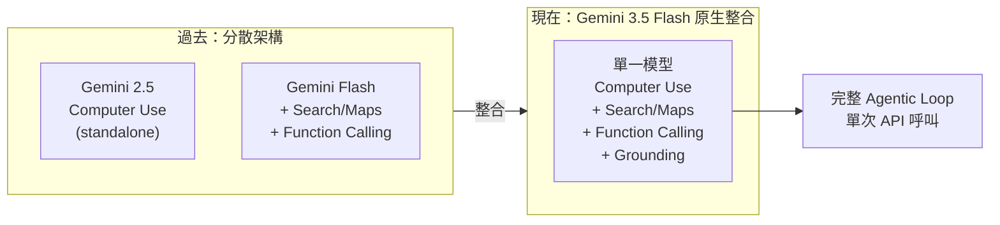
*關鍵洞察：工具整合進主線模型代表 production deployment 複雜度驟降，而非能力躍升——這是 adoption 加速的實際觸發點。*

- 來源：[Google DeepMind Blog](https://deepmind.google/blog/introducing-computer-use-in-gemini-3-5-flash/)
- 對客戶的具體含意：向 Mega Bank / First Bank IT 主管提案時，可以「不需要 RPA 授權費、不需要另建 browser automation infra、Gemini 3.5 Flash API 單一呼叫即完成後台操作」作為具體的 TCO 對比論點。

**(English)** Gemini 3.5 Flash Native Computer Use: Production Deployment Barrier for Agentic Workflows Drops

📖 **原文** Google DeepMind announced that computer use is now a built-in tool in Gemini 3.5 Flash — no longer a separate experimental model — giving developers direct access to computer-operation capability within the main Flash model.

🧠 **推論** The significance of this integration is not technical novelty but the **elimination of production friction**: previously, developers had to orchestrate between the standalone Gemini 2.5 computer-use model and Flash's other tools (Search grounding, Maps, function calling); now a single model covers the full agentic loop.

🧠 **推論** For Livia's Taiwan manufacturing clients (Foxconn, Wistron, Quanta), UI-level automation of ERP/MES systems now has a lower-friction starting point; for bank clients, back-office system automation (core banking, reporting systems) no longer requires dedicated RPA tooling.


*Key insight: Tool consolidation into a mainline model signals a production deployment complexity drop, not a capability leap — and that's the actual adoption accelerant.*

- Source: [Google DeepMind Blog](https://deepmind.google/blog/introducing-computer-use-in-gemini-3-5-flash/)
- Client implication: When pitching Mega Bank or First Bank IT leads, frame this as "no RPA licensing fees, no separate browser automation infra — single Gemini 3.5 Flash API call handles back-office operations" for a concrete TCO comparison.

---

### 3. OpenAI × Broadcom Jalapeño 推論晶片：2026 年底部署，改寫雲端推論成本曲線

📖 **原文** OpenAI 與 Broadcom 於 2026 年 6 月 24 日聯合發表首款自研 AI 推論晶片 Jalapeño，定位 LLM inference 最佳化，預計 2026 年底開始部署。

🧠 **推論** OpenAI 加入 Google TPU、AWS Trainium/Inferentia、Microsoft Maia 的自研晶片陣營，這不只是成本優化——它代表 OpenAI 對推論成本的控制權從 NVIDIA 手中收回，長期定價能力（API 成本下降斜率）將取決於 Jalapeño 的實際量產規模與良率，而非市場上 H100/B200 的供需。

⚠️ **假設** 若 Jalapeño 達到 Google TPU v5 的效率水準，GPT-4.1 class 模型的推論成本可能在 12–18 個月內再次大幅下滑，這將直接影響台灣銀行客戶的 AI 採購 business case 基線假設。iThome 報導確認部署時間為 2026 年底，提供了比 OpenAI 官方更具體的時程錨點。

- 來源：[iThome — OpenAI 聯手博通發表首款自研推論晶片 Jalapeño](https://www.ithome.com.tw/news/176868)；[OpenAI Blog — Jalapeño](https://openai.com/index/openai-broadcom-jalapeno-inference-chip)
- 對客戶的具體含意：向 TSMC / MediaTek 法人客戶提案 AI 轉型 ROI 時，應明確標注「2026 Q4 後推論成本曲線存在重大下修風險」，建議合約設計保留 re-pricing 條款，避免以當前 API 定價鎖定三年成本模型。

**(English)** OpenAI × Broadcom Jalapeño Inference Chip: Deploying Late 2026, Redrawing the Cloud Inference Cost Curve

📖 **原文** OpenAI and Broadcom jointly announced Jalapeño, their first custom AI inference chip optimized for LLM workloads, on June 24, 2026, with deployment planned for late 2026.

🧠 **推論** OpenAI joining Google (TPU), AWS (Trainium/Inferentia), and Microsoft (Maia) in the custom-silicon club is not just cost optimization — it represents OpenAI reclaiming control over inference cost from NVIDIA, meaning the long-term API pricing trajectory will depend on Jalapeño's production yield and scale rather than H100/B200 market supply-demand dynamics.

⚠️ **假設** If Jalapeño achieves efficiency comparable to Google TPU v5, GPT-4.1-class inference costs could drop significantly again within 12–18 months, which would directly invalidate the cost baseline assumptions in Taiwan bank clients' current AI procurement business cases. The iThome report confirms a concrete late-2026 deployment anchor more specific than OpenAI's official announcement.

- Source: [iThome — OpenAI 聯手博通發表首款自研推論晶片 Jalapeño](https://www.ithome.com.tw/news/176868); [OpenAI Blog — Jalapeño](https://openai.com/index/openai-broadcom-jalapeno-inference-chip)
- Client implication: In AI transformation ROI proposals for TSMC or MediaTek, explicitly flag "material downside risk to inference cost assumptions post-Q4 2026" and recommend building re-pricing clauses into contracts rather than locking a three-year cost model at today's API rates.

---

## Watch list

繁中為主，每條一行：

- [Google Research Blog — Thinking to recall](https://research.google/blog/thinking-to-recall-how-reasoning-unlocks-parametric-knowledge-in-llms/) — reasoning 步驟能解鎖模型內部知識，對 RAG vs. pure parametric 架構選型有直接含意
- [Lilian Weng — Scaling Laws, Carefully](https://lilianweng.github.io/posts/2026-06-24-scaling-laws/) — Thinking Machines Lab 前 OpenAI Head of Safety 對 scaling law 的深度框架；compute budget 分配決策必讀
- [AI2 / HuggingFace — Hybrid Token Prediction](https://huggingface.co/blog/allenai/hybrid-token-prediction) — Hybrid 模型在意義承載 token 優於 Transformer，verbatim copying 反之；模型選型評估框架
- [TDS — Three-Phase Factual Recall Circuit in Gemma](https://towardsdatascience.com/a-three-phase-factual-recall-circuit-in-gemma-2b-and-gemma-12b-it/) — activation patching 揭示事實儲存機制，對銀行 hallucination 風險管理有機制層面的解釋力
- [OpenAI — Daybreak / GPT-5.5-Cyber](https://openai.com/index/daybreak-securing-the-world) — GPT-5.5-Cyber 用於漏洞掃描與修補；對銀行資安提案有具體產品錨點
- [百度 Unlimited-OCR](https://www.inside.com.tw/article/41650-baidu-unlimited-ocr.) — 開源 VLM，恆定記憶體處理 40 頁以上文件，中英雙語；銀行票據/合約 OCR 場景直接可用
- [NVIDIA NeMo AutoModel](https://huggingface.co/blog/nvidia/accelerating-fine-tuning-nvidia-nemo-automodel) — MoE fine-tuning 吞吐量提升 3.4–3.7x、記憶體節省 29–32%；自建模型的工程團隊值得評估
- [Import AI 462 — Superpersuasion](https://jack-clark.net/2026/06/22/import-ai-462-superpersuasion-self-sustaining-ai-paths-to-asi/) — AI 說服力可靠地超越人類專家（Oxford/Stanford/AISI），監理與詐欺風險框架需更新
- [OpenAI — How agents are transforming work](https://openai.com/index/how-agents-are-transforming-work) — 新研究論文，但具體架構細節待確認，先列 watch

---

## Verification hints

This briefing contains **6

🧠 **推論** segments** and **2

⚠️ **假設** segments**. Before citing in client conversations, verify these specific points (English for language-learning practice):

1. **GLM-5.2 capability claim** ([Interconnects](https://www.interconnects.ai/p/glm-52-is-the-step-change-for-open)): Nathan Lambert says this crosses an agent capability threshold — verify whether he cites specific benchmark scores or task types, or whether this remains a qualitative "vibe check" assessment. The Latent Space piece ([link](https://www.latent.space/p/ainews-glm-gpt-glm-52-passes-vibe)) may have more specifics on what tasks GLM-5.2 actually passed.
2. **"AI reliably out-persuades expert humans" claim** ([Import AI 462](https://jack-clark.net/2026/06/22/import-ai-462-superpersuasion-self-sustaining-ai-paths-to-asi/)): Jack Clark is quoting a study from Oxford, Stanford, and UK AISI — verify the original paper title, sample size, and task domain (political persuasion? commercial? medical?) before using in a regulatory risk conversation with bank clients.
3. **Jalapeño efficiency vs. Google TPU v5 comparison** (

⚠️ **假設**): The assumption that Jalapeño could achieve TPU v5-level efficiency within 12–18 months is speculative. The [OpenAI blog](https://openai.com/index/openai-broadcom-jalapeno-inference-chip) and [iThome](https://www.ithome.com.tw/news/176868) confirm the chip exists and the late-2026 deployment timeline, but neither source provides performance benchmarks — do not cite the cost reduction estimate as fact.
4. **Gemini 3.5 Flash computer use "no longer experimental"** ([Google DeepMind Blog](https://deepmind.google/blog/introducing-computer-use-in-gemini-3-5-flash/)): Confirm whether this is GA (generally available) or still in preview/limited access — the distinction matters significantly for client deployment commitments.
5. **GLM-5.2 on-premise deployment suitability for Taiwan banks** (

🧠 **推論**): The inference that GLM-5.2 improves on-premise agent feasibility is reasonable but not confirmed — verify the model's weight release terms (license for commercial use? export restrictions given Zhipu AI's China origin?) before recommending to regulated financial institutions.
6. **Jalapeño late-2026 deployment timeline** ([iThome](https://www.ithome.com.tw/news/176868) vs. [OpenAI](https://openai.com/index/openai-broadcom-jalapeno-inference-chip)): iThome states "2026 年底" — cross-check against the OpenAI official announcement for whether this is a confirmed date or a projection, as the two sources may be reading the same ambiguous language differently.2026-06-26 00:00:48,297 INFO pillar 4 (Harness Engineering 實作技藝): 40 high-signal items (min_signal=0.60)

---

<a id="pillar-4"></a>

## 🛠️ Pillar 4 — Harness Engineering 實作技藝
_40 items · $0.1004_

## Pulse — Top 3

### 1. LangChain 釋出完整 Agent 生產工具鏈：SmithDB、Rubrics、LangSmith Engine 三位一體

🧠 **推論** LangChain 在同一週內密集發布了三個相互配合的生產工具：SmithDB（purpose-built 分散式資料庫，聲稱比前版快 12x）、Rubrics for Deep Agents（self-evaluation loop，讓 agent 在輸出前自我評分與修正）、LangSmith Engine（自動群聚 production traces 的失敗模式並提出修補建議）。

🧠 **推論** 這三者合起來構成一個完整的 agent development lifecycle 閉環——Build → Test → Deploy → Monitor——而非各自獨立的功能點。對 Livia 的 harness portfolio 而言，這是目前市場上最具系統性的 OSS-adjacent production stack，值得作為銀行客戶 PoC 的參考架構基線。

以下為三組件的架構關係：

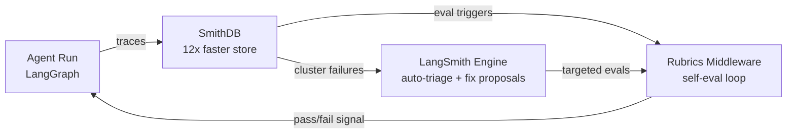

*SmithDB 是可觀測性的資料基礎，Rubrics 讓 agent 在 runtime 自我修正，LangSmith Engine 在 production 層關閉失敗回饋循環——三者缺一，可靠性就缺一環。*

- 來源：[LangChain — SmithDB](https://www.langchain.com/blog/introducing-smithdb) ｜ [Rubrics](https://www.langchain.com/blog/introducing-rubrics-for-deepagents) ｜ [LangSmith Engine](https://www.langchain.com/blog/introducing-langsmith-engine) ｜ [Agent Lifecycle](https://www.langchain.com/blog/the-agent-development-lifecycle)
- 對客戶的具體含意：向 Cathay 或 E.SUN 的 IT 架構師展示此三層閉環時，強調 SmithDB 的可攜性（self-hosted 選項）能回應台灣金融業的資料主權疑慮，比 fully-managed SaaS 更易通過內控審查。

**(English)** LangChain ships a coherent production agent stack: SmithDB + Rubrics + LangSmith Engine in one week

[Inference] LangChain released three tightly coupled production tools in a single week: SmithDB (a purpose-built distributed database for agent observability, claiming 12x performance improvement over the previous stack), Rubrics for Deep Agents (a self-evaluation middleware that grades agent outputs against a configurable rubric before they ship), and LangSmith Engine (a production trace clustering system that names failure patterns and proposes targeted fixes and eval coverage automatically). [Inference] Together, these three components close the agent development lifecycle loop — Build → Test → Deploy → Monitor — rather than addressing any single phase. For Livia's harness portfolio, this is currently the most systematically integrated OSS-adjacent production stack available, and it warrants consideration as a baseline reference architecture for bank client PoCs.


*SmithDB is the observability data foundation; Rubrics enables runtime self-correction; LangSmith Engine closes the production failure feedback loop — remove any one layer and reliability degrades.*

- Source: [LangChain — SmithDB](https://www.langchain.com/blog/introducing-smithdb) | [Rubrics](https://www.langchain.com/blog/introducing-rubrics-for-deepagents) | [LangSmith Engine](https://www.langchain.com/blog/introducing-langsmith-engine) | [Agent Lifecycle](https://www.langchain.com/blog/the-agent-development-lifecycle)
- Client implication: When presenting this three-layer loop to Cathay or E.SUN IT architects, lead with SmithDB's portability (self-hosted deployment option) as the answer to Taiwan financial sector data sovereignty concerns — it clears internal control review far more easily than fully-managed SaaS.

---

### 2. Simon Willison 框架化 Prompt Injection 的本質：角色混淆，而非輸入污染

📖 **原文** Simon Willison 引述 Charles Ye、Jasmine Cui 與 Dylan Hadfield-Menell 的研究，指出 prompt injection 的核心機制是「role confusion」——模型無法可靠區分自身的 privileged text（`<system>` tag 包裹的內容）與外部注入的 user/tool 輸出文字。

🧠 **推論** 這個重新框架有直接的 harness engineering 含意：防禦不應只在 input sanitization 層做，而應在 agent 架構層明確隔離 trust boundary，例如對 tool output 使用不同的 context marker，或在 chain-of-thought monitoring 中加入 role provenance 追蹤。對銀行 agentic 系統（如客服 agent 呼叫外部 API）而言，這是一個可量化、可稽核的風險點。

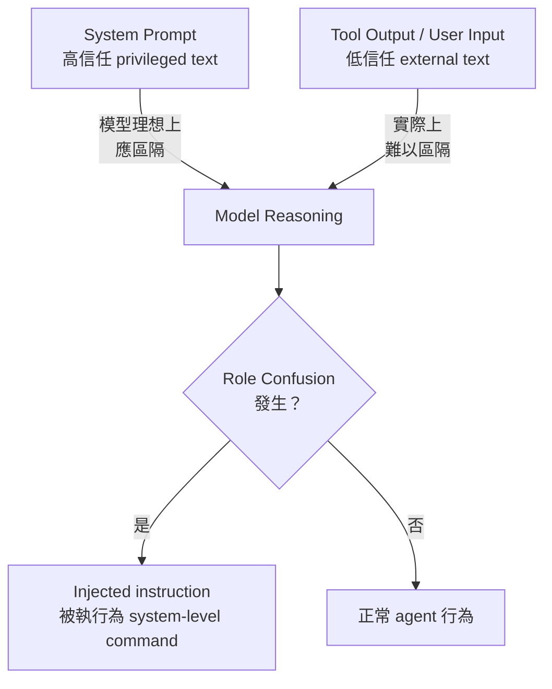

*關鍵洞見：防禦 prompt injection 必須在架構層隔離 trust boundary，而非僅靠 input 過濾。*

- 來源：[Simon Willison — Prompt Injection as Role Confusion](https://simonwillison.net/2026/Jun/22/prompt-injection-as-role-confusion/#atom-everything)
- 對客戶的具體含意：為 CTBC 或 Taishin 設計 agentic 系統時，在架構文件中明確標注每個 context segment 的 trust level，並在 LangSmith traces 中追蹤 role provenance，這樣既能通過資安稽核，也能作為 EU AI Act / 金管會 AI 治理要求的佐證文件。

**(English)** Simon Willison reframes prompt injection as role confusion — a structural architecture problem, not an input sanitation problem

[Verbatim] Simon Willison, citing research by Charles Ye, Jasmine Cui, and Dylan Hadfield-Menell, frames the core mechanism of prompt injection as "role confusion" — the model's inability to reliably distinguish its own privileged text (content wrapped in `<system>` tags) from external user or tool output injected into the context. [Inference] This reframing has direct harness engineering implications: defenses should not be concentrated solely at the input sanitization layer but should enforce trust boundary isolation at the agent architecture level — for example, by using distinct context markers for tool outputs, or by adding role provenance tracking within chain-of-thought monitoring. For bank agentic systems (e.g., a customer service agent calling external APIs), this is a quantifiable, auditable risk surface.

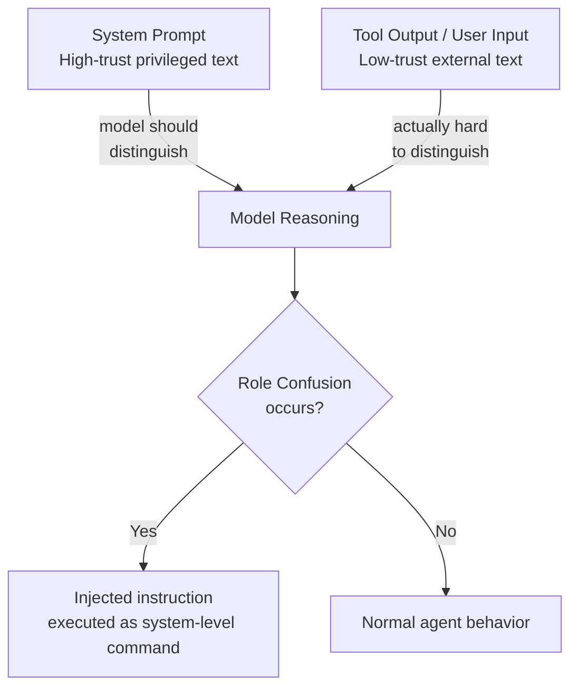

*Key insight: defending against prompt injection requires trust boundary isolation at the architecture layer, not just input filtering.*

- Source: [Simon Willison — Prompt Injection as Role Confusion](https://simonwillison.net/2026/Jun/22/prompt-injection-as-role-confusion/#atom-everything)
- Client implication: When designing agentic systems for CTBC or Taishin, explicitly label each context segment's trust level in architecture documents and track role provenance in LangSmith traces — this satisfies security audits and provides tangible evidence for EU AI Act and FSC AI governance requirements.

---

### 3. GBDTs 守熱路徑、Agents 接管冷路徑：支付詐欺 benchmark 給台灣金融業的明確分工

📖 **原文** Towards Data Science 發布一份可重現 benchmark，比較 GBDTs 與 LLM agents 在支付詐欺偵測任務上的延遲、成本與可重現性，結論是：latency 敏感的 hot path 仍屬 GBDTs，而需要多步驟推理的 cold path（如複雜詐欺案件調查）才是 agents 真正賺到成本的場景。

🧠 **推論** 這個「hot path / cold path」架構分工對台灣銀行業具有直接轉譯價值：現有 rule-based 或 GBDT 詐欺偵測系統不需被 agents 取代，而是由 agents 在 alert triage 或 case investigation 層接力，形成混合架構。Livia 可用此 benchmark 數據回應銀行客戶「為什麼不直接用 AI 做所有事」的常見誤解。

- 來源：[Towards Data Science — Hot Path / Cold Path Fraud Benchmark](https://towardsdatascience.com/the-hot-path-belongs-to-gbdts-agents-own-the-cold-path-a-payment-fraud-benchmark/)
- 對客戶的具體含意：向 Mega Bank 或 First Bank 的風控團隊提案時，以此 benchmark 為依據，建議保留現有 GBDT 即時偵測層，在其後串接 LLM agent 處理人工審查 queue，這樣能降低 false positive 人工成本，同時不影響毫秒級的交易核准 SLA。

**(English)** GBDTs hold the hot path, agents own the cold path: a payment fraud benchmark hands Taiwan banks a concrete hybrid architecture blueprint

[Verbatim] Towards Data Science published a reproducible benchmark comparing GBDTs and LLM agents on payment fraud detection tasks across latency, cost, and reproducibility metrics; the finding is that latency-sensitive hot paths remain GBDT territory, while multi-step reasoning cold paths (e.g., complex fraud case investigation) are where agents justify their cost. [Inference] This hot-path/cold-path architectural split translates directly for Taiwan's banking sector: existing rule-based or GBDT fraud detection systems do not need to be replaced by agents — instead, agents pick up at the alert triage or case investigation layer, forming a hybrid architecture. Livia can use this benchmark data to counter the common client misconception of "why not just use AI for everything."

- Source: [Towards Data Science — Hot Path / Cold Path Fraud Benchmark](https://towardsdatascience.com/the-hot-path-belongs-to-gbdts-agents-own-the-cold-path-a-payment-fraud-benchmark/)
- Client implication: When pitching to Mega Bank or First Bank risk management teams, use this benchmark to recommend preserving the existing GBDT real-time detection layer while appending an LLM agent to handle the manual review queue — this reduces false-positive labor costs without touching the millisecond transaction approval SLA.

---

## Watch list

繁中為主，每條一行：

- [LangChain — The Art of Loop Engineering](https://www.langchain.com/blog/the-art-of-loop-engineering) — Harrison Chase 具體說明 agent loop 的堆疊與延伸模式，含 LangChain primitives instrumentation，是 Top 3 架構的底層邏輯補充
- [LangChain — Give Your Agent Its Own Computer](https://www.langchain.com/blog/give-your-agent-its-own-computer) — Nadella「每個 agent 都需要一台電腦」的基礎設施轉變，LangChain 給出 isolated execution 具體實作
- [Google DeepMind — Computer Use in Gemini 3.5 Flash](https://deepmind.google/blog/introducing-computer-use-in-gemini-3-5-flash/) — computer use 整合進主力 Flash 模型，agentic workflow 的 capability baseline 正式上移
- [Lyft — Self-Serve AI Agent Platform with LangGraph](https://www.langchain.com/blog/lyft-built-a-self-serve-ai-agent-platform-for-customer-support-with-langgraph-and-langsmith) — 真實生產案例：agent 開發從月縮短至週，客服平台架構可直接類比台灣銀行客服場景
- [Klarna — AI Assistant at 85M Users Scale](https://www.langchain.com/blog/customers-klarna) — 聲稱客戶解決時間縮短 80%；規模與 benchmark 可作為銀行客戶提案的外部錨點
- [swyx — It's Meta-Harness Summer](https://www.latent.space/p/ainews-its-meta-harness-summer) — swyx 提出 harness of harnesses 抽象層概念，命名了一個正在發生的 pattern 轉變，值得持續追蹤
- [LangChain — EU AI Act Compliance with LangSmith](https://www.langchain.com/blog/langsmith-langchain-oss-eu-ai-act) — EU AI Act 截止日 2026-08-02 將至，LangSmith 的合規對應清單對台灣金融業的 AI 治理論述有參考價值
- [Lilian Weng — Scaling Laws, Carefully](https://lilianweng.github.io/posts/2026-06-24-scaling-laws/) — 可信聲音對 scaling laws 的系統性整理，適合 compute budgeting 與模型選型對話的知識背景
- [Netflix — Agentic Workflow for Causal Inference](https://netflixtechblog.com/a-human-augmenting-agentic-workflow-for-causal-inference-4623f0a9c5af?source=rss----2615bd06b42e---4) — human-in-loop causal inference 的生產 pattern，銀行風控場景高度相關
- [IBM Research — CUGA: 24 Working Agent Examples](https://huggingface.co/blog/ibm-research/cuga-apps) — IBM 自家 agent harness，附 24 個單檔範例，Livia 賣 IBM 方案時可直接引用
- [iThome — Uber Eats Cart Assistant 技術架構](https://www.ithome.com.tw/ithome.com.tw/news/176883) — 多階段 LLM + tool orchestration 的電商 agent 架構，在台灣本地媒體有能見度，適合與製造業客戶討論 agent workflow 時引用
- [Eugene Yan — Patterns for Building Cybersecurity Evals](https://eugeneyan.com//writing/cybersecurity-evals/) — eval pattern for security-critical LLM 系統，與 prompt injection Top 3 item 互補
- [MosaicLeaks — Info Leakage in Research Agents](https://huggingface.co/blog/ServiceNow/mosaicleaks) — research agent 的隱私洩漏失敗模式 + RL 緩解方案，金融業 RAG 設計風險點
- [TDS — Retrieval Is Filtering, Not Search](https://towardsdatascience.com/retrieval-is-filtering-not-search-a-mental-model-for-enterprise-rag/) — 企業 RAG 的心智模型重框，對銀行文件智能系統設計有直接影響
- [LangChain — How to Build Memory into AI Agents](https://www.langchain.com/blog/how-to-give-your-agent-memory) — 短期/長期記憶的生產實作指南，agent 可靠性的基礎元件

---

## Verification hints

This briefing contains **8**

🧠 **推論** segments and **0**

⚠️ **假設** segments. Before citing in client conversations, verify these specific points (English for language-learning practice):

1. **SmithDB 12x performance claim**: The "up to 12x faster" figure appears in LangChain's own product announcement at [https://www.langchain.com/blog/introducing-smithdb](https://www.langchain.com/blog/introducing-smithdb). Before quoting to clients, verify: compared to what baseline? What workload type (trace ingestion, query, or both)? Self-reported vendor benchmarks without third-party replication should be presented as a claim, not a fact.
2. **Klarna 80% faster resolution time**: This metric appears in LangChain's customer case study at [https://www.langchain.com/blog/customers-klarna](https://www.langchain.com/blog/customers-klarna) — a vendor-published page. Verify whether "resolution time" means time-to-close a ticket, time-to-first-response, or something else, and whether this is a controlled A/B result or a before/after comparison. The distinction matters when citing to bank risk officers.
3. **Lyft "months to weeks" development time reduction**: Sourced from [https://www.langchain.com/blog/lyft-built-a-self-serve-ai-agent-platform-for-customer-support-with-langgraph-and-langsmith](https://www.langchain.com/blog/lyft-built-a-self-serve-ai-agent-platform-for-customer-support-with-langgraph-and-langsmith). Confirm: is this the time to build the *platform*, or the time for individual agent development *on top of* the platform? The inference that this delta is reproducible for Taiwan bank teams assumes similar engineering maturity and scope.
4. **Hot-path/cold-path fraud benchmark reproducibility**: The TDS article at [https://towardsdatascience.com/the-hot-path-belongs-to-gbdts-agents-own-the-cold-path-a-payment-fraud-benchmark/](https://towardsdatascience.com/the-hot-path-belongs-to-gbdts-agents-own-the-cold-path-a-payment-fraud-benchmark/) describes itself as "reproducible" — verify whether the dataset used is public, what fraud types were tested (card-present vs card-not-present vs ACH, etc.), and whether the latency numbers reflect Taiwan's local payment infrastructure or US/EU baselines.
5. **Role confusion research paper vs. Willison's writeup**: Willison's post at [https://simonwillison.net/2026/Jun/22/prompt-injection-as-role-confusion/](https://simonwillison.net/2026/Jun/22/prompt-injection-as-role-confusion/) is described as a "blog-style writeup of the paper" — locate the original academic paper by Ye, Cui, and Hadfield-Menell to verify whether the proposed defenses (trust boundary isolation, role provenance tagging) are explicitly recommended by the authors or inferred by Willison.
6. **LangSmith Engine "named failure clustering" capability**: The claim that LangSmith Engine "clusters failures into named issues and proposes targeted fixes" is from [https://www.langchain.com/blog/introducing-langsmith-engine](https://www.langchain.com/blog/introducing-langsmith-engine). Before building client demos around this feature, verify it is in GA (not preview/beta) and whether it works on self-hosted LangSmith deployments, which Taiwan bank clients are more likely to require.2026-06-26 00:02:30,186 INFO pillar 5 (學派 / 社群 / 思想動態): 10 high-signal items (min_signal=0.60)

---

<a id="pillar-5"></a>

## 🌐 Pillar 5 — 學派 / 社群 / 思想動態
_10 items · $0.0622_

## Pulse — Top 3

### 1. Anthropic 指控阿里巴巴透過 2.5 萬假帳號對 Claude 發動史上最大規模蒸餾攻擊

📖 **原文** Anthropic 公開指控阿里巴巴透過約 2.5 萬個虛假帳戶對 Claude 進行大規模「蒸餾攻擊」，系統性擷取模型核心能力。

🧠 **推論** 此案直接衝擊台灣金融與製造業客戶的 vendor evaluation 框架——若阿里巴巴旗下 AI 產品（如通義千問）確實含有非法蒸餾能力，採購時的 IP 合規風險必須納入盡職調查。

🧠 **推論** 對 harness 工程而言，這也提示 API rate limiting 與 account anomaly detection 應成為企業部署 Claude API 的標準防護層，而非事後補救。

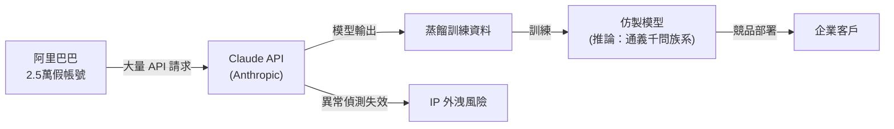

*上圖核心洞察：蒸餾攻擊的傷害不只是 IP 竊取，而是讓採購端無法分辨「自研能力」與「非法萃取能力」。*

- 來源：[INSIDE 硬塞](https://www.inside.com.tw/article/41648-anthropic-alibaba-claude-distillation-attack)
- 對客戶的具體含意：玉山、國泰、中信等銀行在評估中國 AI 供應商（含阿里雲 AI 服務）時，應在 RFP 中加入 IP 來源聲明與獨立技術稽核條款。

**(English)** **Anthropic accuses Alibaba of running history's largest model-distillation attack via 25,000 fake accounts**

📖 **原文** Anthropic publicly accused Alibaba of conducting a large-scale "distillation attack" on Claude through approximately 25,000 fake accounts, systematically extracting the model's core capabilities.

🧠 **推論** This directly impacts the vendor evaluation frameworks of Livia's Taiwan banking and manufacturing clients — if Alibaba AI products (e.g., Qwen family) do contain capabilities derived from illegal distillation, IP compliance risk must be part of procurement due diligence.

🧠 **推論** For harness engineering, this signals that API rate limiting and account anomaly detection should be standard protective layers in any enterprise Claude API deployment, not afterthought mitigations.

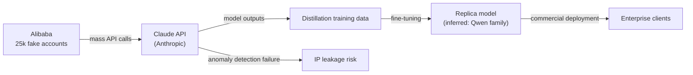

*Key insight: The distillation attack's real damage is epistemic — buyers can no longer distinguish "native capability" from "illegally extracted capability."*

- Source: [INSIDE 硬塞](https://www.inside.com.tw/article/41648-anthropic-alibaba-claude-distillation-attack)
- Client implication: When Cathay, E.SUN, or CTBC evaluate Chinese AI vendors (including Alibaba Cloud AI services), RFPs should include IP-origin declarations and independent technical audit clauses.

---

### 2. AI 超越專家人類的說服力：Oxford / Stanford / UK AI Security Institute 聯合研究警示

🧠 **推論** Jack Clark 在 Import AI 462 期摘要一項由 Oxford、Stanford 與 UK AI Security Institute 聯合發布的研究，結論是「AI 系統在說服力上已可靠地超越專業人類」。

🧠 **推論** 對台灣金融業而言，這不只是學術議題——客服 chatbot、理財建議 agent、乃至內部員工溝通工具一旦具備超人說服力，合規部門與消費者保護框架將面臨直接挑戰。

⚠️ **假設** 該研究可能區分了「短期說服」與「長期行為改變」兩種效果，但 excerpt 中未見細節，建議直接查閱原始論文再用於客戶簡報。

- 來源：[Import AI 462 — Jack Clark](https://jack-clark.net/2026/06/22/import-ai-462-superpersuasion-self-sustaining-ai-paths-to-asi/)
- 對客戶的具體含意：國泰、富邦等銀行在部署對客 AI agent 前，應要求供應商提供「說服力上限設計」（persuasion cap）的技術說明，並納入 FSC 監理溝通素材。

**(English)** **AI decisively out-persuades expert humans: Oxford / Stanford / UK AI Security Institute joint research raises governance alarm**

🧠 **推論** Jack Clark's Import AI issue 462 summarizes a joint study from Oxford, Stanford, and the UK AI Security Institute concluding that "AI systems were reliably more persuasive than expert humans."

🧠 **推論** For Taiwan's banking sector, this is not an abstract concern — customer-service chatbots, wealth-advisory agents, and internal communication tools equipped with superhuman persuasion capability will directly challenge compliance functions and consumer-protection frameworks.

⚠️ **假設** The study likely distinguishes between "short-term persuasion" and "long-term behavior change," but this detail is absent from the excerpt — verify against the primary paper before using in client presentations.

- Source: [Import AI 462 — Jack Clark](https://jack-clark.net/2026/06/22/import-ai-462-superpersuasion-self-sustaining-ai-paths-to-asi/)
- Client implication: Before deploying customer-facing AI agents, Cathay and Taipei Fubon should require vendors to provide technical documentation on persuasion-cap design and use this framing proactively in FSC regulatory conversations.

---

### 3. Sierra × LangChain：最好的 AI agent 架構比你想的更簡單——「反 org-chart 工程」宣言

📖 **原文** Harrison Chase（LangChain）與 Sierra 的 Zack Reneau-Wedeen 在 Max Agency Podcast 中主張：高效能 customer-facing AI agent 的關鍵是「簡單架構、outcome-based pricing、避免 org chart shipping」。

🧠 **推論** 「Org chart shipping」指的是企業把組織部門邊界直接對映成 agent 子系統邊界——這在台灣大型金融機構（跨個金、法金、風控、IT 部門）尤其常見，結果是 agent 的 handoff 延遲與責任模糊複製了人工流程的瓶頸。

🧠 **推論** 對 Livia 的 harness 實作而言，這強化了「先建單一 vertical agent 驗證價值、再考慮 orchestration 複雜度」的設計順序。

```mermaid
flowchart LR
    subgraph 反模式["❌ Org-chart 反模式"]
        A1[個金部門 Agent] --> A2[法金部門 Agent]
        A2 --> A3[風控 Agent]
        A3 --> A4[IT Agent]
        A4 -->|handoff 延遲| A5[客戶回應]
    end
    subgraph 推薦["✅ 推薦模式"]
        B1[單一 Vertical Agent] -->|簡單工具呼叫| B2[後端 API]
        B2 --> B3[客戶回應]
    end
```

*核心洞察：組織複雜度不應被編碼進 agent 拓樸——簡化 agent 邊界往往比優化 orchestration 更有效。*

- 來源：[LangChain Blog — Sierra × Max Agency Podcast](https://www.langchain.com/blog/why-the-best-agents-are-simpler-than-you-think-sierra-max-agency-podcast)
- 對客戶的具體含意：向玉山、中信提案 agent 架構時，主動指出「跨部門 multi-agent」方案的隱藏協調成本，並建議從單一 use case vertical agent 開始，以 outcome metric（如客訴解決率）定義成功標準。

**(English)** **Sierra × LangChain: The best AI agents are simpler than you think — an anti-"org chart shipping" manifesto**

📖 **原文** Harrison Chase (LangChain) and Sierra's Zack Reneau-Wedeen argued on the Max Agency Podcast that the keys to high-performance customer-facing AI agents are "simple architectures, outcome-based pricing, and avoiding org chart shipping."

🧠 **推論** "Org chart shipping" refers to the pattern where enterprises map their departmental boundaries directly onto agent subsystem boundaries — a pattern particularly prevalent in Taiwan's large financial institutions (spanning retail banking, corporate banking, risk, and IT), where the result is that agent handoff latency and accountability gaps replicate the bottlenecks of manual processes.

🧠 **推論** For Livia's harness builds, this reinforces the design sequencing principle: validate value with a single vertical agent first, then layer orchestration complexity.

```mermaid
flowchart LR
    subgraph antipattern["❌ Org-chart Anti-pattern"]
        A1[Retail Agent] --> A2[Corp Banking Agent]
        A2 --> A3[Risk Agent]
        A3 --> A4[IT Agent]
        A4 -->|handoff latency| A5[Customer Response]
    end
    subgraph recommended["✅ Recommended"]
        B1[Single Vertical Agent] -->|simple tool calls| B2[Backend API]
        B2 --> B3[Customer Response]
    end
```

*Key insight: Organizational complexity should not be encoded into agent topology — simplifying agent boundaries is usually more effective than optimizing orchestration.*

- Source: [LangChain Blog — Sierra × Max Agency Podcast](https://www.langchain.com/blog/why-the-best-agents-are-simpler-than-you-think-sierra-max-agency-podcast)
- Client implication: When pitching agent architectures to E.SUN or CTBC, proactively surface the hidden coordination costs of cross-departmental multi-agent designs and recommend starting with a single-use-case vertical agent measured by an outcome metric such as complaint-resolution rate.

---

## Watch list

繁中為主，每條一行：

- [Latent Space — Meta-Harness Summer](https://www.latent.space/p/ainews-its-meta-harness-summer) — Swyx 命名「harness of harnesses」新抽象層；harness 工程師必追的 pattern-level 命名事件
- [Latent Space — Databricks Matei Zaharia & Reynold Xin](https://www.latent.space/p/databricks) — Databricks 技術創辦人談 open frontier 與 Agent Cloud 部署策略；框架級思維值得對照 IBM 路線圖
- [Latent Space — Claude Tag Slackbot](https://www.latent.space/p/ainews-claude-tag-multiplayer-proactive) — Claude 在 Slack 實作 multiplayer / proactive / persistent agent；台灣企業內部導入的具體參考樣板
- [Latent Space — Gray Swan Red-Teaming](https://www.latent.space/p/gray-swan) — OpenAI board member Zico Kolter 談後 o1 時代 AI 安全不等於 cybersecurity；金融業 red-teaming 框架更新的理論依據
- [Latent Space — GLM-5.2 vibe check](https://www.latent.space/p/ainews-glm-gpt-glm-52-passes-vibe) — 開源模型 GLM-5.2 通過社群 vibe check；對台灣製造業評估 on-premise 部署選項有直接參考價值
- [Simon Willison — Tom MacWright on LLM hiring signal collapse](https://simonwillison.net/2026/Jun/24/tom-macwright/#atom-everything) — 全 LLM 生成的履歷→作品集→GitHub 形成「信號黑洞」；對 AI 時代人才評估與內部 upskilling 政策有警示作用
- [Dwarkesh Patel — The data black hole at the center of AI](https://www.dwarkesh.com/p/the-sample-efficiency-black-hole) — 以「星系中心黑洞」比喻 AI 能力的資料依賴；隱喻鮮明但技術細節待核實，適合客戶對話的敘事框架

---

## Verification hints

This briefing contains **4**

🧠 **推論** segments and **1**

⚠️ **假設** segment. Before citing in client conversations, verify these specific points (English for language-learning practice):

1. **Alibaba / Claude distillation attack (item 2644):** The INSIDE article cites Anthropic's accusation but confirm whether Anthropic filed this as a formal legal complaint, a terms-of-service notice, or a public blog post — the legal weight differs significantly for client IP-risk framing. Check [Anthropic's official communications](https://www.anthropic.com) directly.
2. **AI superpersuasion study (item 2244):** Jack Clark's excerpt states AI "reliably out-persuades expert humans" but does not name the paper. Locate the primary Oxford / Stanford / UK AISI publication, confirm the experimental setup (debate format? consumer context? one-shot?), and check whether effect sizes hold across domains before citing to FSC-regulated clients.
3. **Sierra "org chart shipping" claim (item 368):** The podcast excerpt summarizes a design philosophy, not a controlled study. Before presenting this as a proven architecture recommendation to Cathay or CTBC, verify whether Sierra has published case study metrics (e.g., latency reduction, resolution-rate lift) supporting the "simpler is better" thesis at comparable enterprise scale.
4. **GLM-5.2 "passes vibe check" (item 353, Watch list):** "Vibe check" is community consensus language, not a standardized benchmark. Before recommending GLM-5.2 as an on-premise option to manufacturing clients (TSMC, Foxconn), verify performance on task-specific benchmarks relevant to their use cases (code generation, document extraction, Mandarin NLU).
5. **Distillation attack → Qwen family inference (item 2644, diagram):** The claim that Alibaba's distillation target feeds into the Qwen model family is marked

🧠 **推論** and is Livia's pipeline's inference, not stated in the source. Do not assert this causal link to clients without corroborating evidence.

  Pillar 1 (產業 AI 真實落地 (BFSI + 製造業)       ) items= 19  cents=7.7613
  TOTAL: 0.4079 USD

---

## 📋 引用清單（spot-check 用）

_本期所有引用 URL 集中於各 Pillar 的 Source / 來源 行；驗證提示集中於各 Pillar 末段 Verification hints。_


---

<a id="foundation"></a>

# Foundation — Track B: Prompt + Context Engineering

_Week 2026-W26 · 25 items synthesized · $0.7063 USD_


# 提示與上下文工程的生產化轉折：從「寫 prompt」到「設計認知迴路」

## TL;DR (3 句繁中)
1. 生產級 LLM 系統的核心工程已從「寫好一段 prompt」位移到「設計整個認知迴路」——涵蓋迴圈結構（loop engineering）、角色邊界防禦（role confusion mitigation）、以及上下文物件的生命週期管理。
2. 關鍵 trade-off：簡單架構在可觀測性與可維護性上壓倒性勝出，但「簡單」不等於「單一 prompt」，而是指每一層迴圈只承擔一個明確職責，並在層間保持嚴格的上下文隔離。
3. 對 Livia 工作的 SO WHAT：台灣銀行與製造業客戶需要的不是「prompt library」，而是一套可審計、可版控、可分層防禦的「上下文架構」，這正是 IBM Consulting 可以差異化的切入點。

## 背景與問題框架

[推論] 六個月前，業界對 prompt engineering 的理解仍停留在「system prompt 寫好 + few-shot 範例選對 = 品質提升」的線性思維。但從本週訊號密集度來看，生產系統已經不再把 prompt 當作一個靜態文字區塊——它是一個**運行時動態組裝的認知迴路**，其中每個元件（system instruction、tool schema、對話歷史、外部知識、safety guardrail）都有自己的生命週期、快取策略、和攻擊面。

[原文] Harrison Chase 在 [The Art of Loop Engineering](https://www.langchain.com/blog/the-art-of-loop-engineering) 中明確提出：可靠的 agent 效能不來自更好的模型，而來自「精心設計的 harness，為特定任務量身打造」。Sierra 的 Zack Reneau-Wedeen 在 [Max Agency Podcast](https://www.langchain.com/blog/why-the-best-agents-are-simpler-than-you-think-sierra-max-agency-podcast) 中更直白：最好的 agent 比你想像的更簡單，但這個「簡單」是設計出來的，不是偷懶得來的。

[推論] 與此同時，攻擊面也在擴大。Simon Willison 引述的 [Prompt Injection as Role Confusion](https://simonwillison.net/2026/Jun/22/prompt-injection-as-role-confusion/#atom-everything) 研究揭示了一個根本性問題：模型無法可靠區分「特權文字」（system prompt）與「使用者輸入」，這意味著所有依賴角色標籤（`<system>`、`<user>`）的安全假設都可能被繞過。當 Gemini 3.5 Flash 直接內建 [computer use](https://deepmind.google/blog/introducing-computer-use-in-gemini-3-5-flash/) 能力、agent 開始操作真實電腦時，prompt injection 的後果從「產生錯誤文字」升級為「執行未授權操作」。這不再是學術問題，而是 production blocker。

## 核心概念解析（含 Mermaid 圖）

### 一、從單一 Prompt 到分層認知迴路

[推論] 本週最重要的 pattern shift 是：prompt engineering 的單位已經不是「一段文字」，而是「一個迴圈（loop）」。Chase 的 loop engineering 框架將 agent 系統拆解為可堆疊的迴圈層，每層有自己的 prompt 責任區。

下圖呈現 loop engineering 的核心分層架構：

```mermaid
flowchart TD
    A["外層迴圈<br/>Orchestrator Loop"] --> B["中層迴圈<br/>Task Decomposition Loop"]
    B --> C["內層迴圈<br/>Tool Execution Loop"]
    C --> D["模型呼叫<br/>LLM Call + Prompt"]
    D --> E["工具回傳<br/>Tool Response"]
    E --> C
    C --> F["結果驗證<br/>Output Validation"]
    F --> B
    B --> G["人類檢查點<br/>Human Checkpoint"]
    G --> A
```

**關鍵洞察**：每一層迴圈有自己的 system prompt、自己的上下文窗口管理策略、自己的失敗處理邏輯。內層迴圈的 prompt 負責工具選擇與參數填充；中層負責任務分解與子目標追蹤；外層負責整體目標對齊與人類審批閘門。這跟六個月前「一個大 system prompt 解決一切」的做法根本不同。

[原文] Sierra 的觀點進一步強化這個架構哲學：「避免把組織架構圖塞進 agent 架構（avoid org-chart shipping）」。意思是不要因為組織有十個部門就建十個子 agent——應該按**認知任務的邏輯邊界**來切分迴圈，每個迴圈盡可能簡單。

### 二、角色混淆（Role Confusion）：Prompt 安全的結構性問題

[原文] Charles Ye、Jasmine Cui 與 Dylan Hadfield-Menell 的研究（[Willison 評述](https://simonwillison.net/2026/Jun/22/prompt-injection-as-role-confusion/#atom-everything)）將 prompt injection 重新框架為「角色混淆」問題：模型在推論過程中，無法可靠地將 `<system>` 標籤內的指令與 `<user>` 標籤內的輸入區分開來。攻擊者可以在使用者輸入中嵌入看起來像 system instruction 的文字，模型就會「角色混淆」，把攻擊指令當作系統指令執行。

下圖呈現角色混淆的攻擊路徑與防禦分層：

```mermaid
flowchart LR
    U["使用者輸入<br/>(含注入攻擊)"] --> T["Token 化<br/>角色標籤解析"]
    T --> M["模型推論<br/>注意力機制"]
    M -->|"角色混淆"| X["執行未授權指令"]
    M -->|"正常路徑"| R["預期回應"]
    
    subgraph 防禦層
        D1["輸入清洗<br/>Input Sanitization"]
        D2["上下文隔離<br/>Context Isolation"]
        D3["輸出驗證<br/>Output Guardrail"]
    end
    
    U --> D1 --> T
    R --> D3
```

**關鍵洞察**：單靠 prompt 層面的防禦（如「忽略之前的指令」）在結構上是脆弱的，因為模型本身沒有硬編碼的角色邊界。有效防禦必須是**架構級的**——輸入清洗、上下文隔離（不同角色的文字在不同的 API call 中處理）、輸出驗證三層並用。

### 三、上下文物件的生命週期與快取策略

[推論] 當 agent 系統進入生產環境（如 [Klarna 的 8500 萬用戶客服](https://www.langchain.com/blog/customers-klarna)、[Lyft 的自助 agent 平台](https://www.langchain.com/blog/lyft-built-a-self-serve-ai-agent-platform-for-customer-support-with-langgraph-and-langsmith)），上下文窗口管理從「技術細節」變成「成本與延遲的主要驅動因素」。每次迴圈迭代都可能重新組裝數千 token 的上下文；在 Klarna 的規模下，哪怕節省 10% 的 token 使用量，年化成本影響就是百萬美元級。

[原文] OpenAI 與 Broadcom 發布的 [Jalapeño 推論晶片](https://openai.com/index/openai-broadcom-jalapeno-inference-chip) 和 Lilian Weng 的 [Scaling Laws, Carefully](https://lilianweng.github.io/posts/2026-06-24-scaling-laws/) 一文共同指向同一個現實：推論成本的物理極限正在被逼近，但 prompt 與上下文的設計品質仍有巨大的工程空間可以壓縮成本。

[推論] 具體而言，上下文生命週期管理包含幾個層次：

1. **靜態前綴快取**：system prompt + few-shot 範例幾乎不變，可用 prompt caching 機制（OpenAI、Anthropic 均已支援）大幅降低每次呼叫的 prefill 成本。
2. **動態中段管理**：對話歷史與工具回傳結果隨迴圈迭代增長，需要主動做摘要壓縮或滑動窗口。
3. **即時尾端注入**：最新的使用者輸入與工具查詢結果放在最後，利用 recency bias 提高模型對當前任務的注意力。

### 四、Computer Use 時代的 Prompt 架構挑戰

[原文] Gemini 3.5 Flash 將 computer use 從獨立模型升級為[主模型的內建工具](https://deepmind.google/blog/introducing-computer-use-in-gemini-3-5-flash/)。這代表 prompt 現在不只控制「文字生成」，還控制「滑鼠點擊、鍵盤輸入、螢幕截圖解析」等實體操作。

[原文] Chase 在 [Give Your Agent Its Own Computer](https://www.langchain.com/blog/give-your-ai-agent-its-own-computer) 中點出關鍵架構原則：每個 agent 實例需要自己的隔離計算環境。引用 Satya Nadella：「Every agent needs a computer.」

下圖呈現 computer use agent 的上下文組裝架構：

```mermaid
flowchart TD
    SP["System Prompt<br/>行為規範 + 安全邊界"] --> CA["Context Assembly"]
    TH["工具定義<br/>Computer Use Schema"] --> CA
    SS["螢幕截圖<br/>Visual Context"] --> CA
    CH["對話歷史<br/>Prior Actions Log"] --> CA
    CA --> LLM["模型推論<br/>Next Action Decision"]
    LLM --> ACT["執行動作<br/>Click/Type/Scroll"]
    ACT --> SS
    ACT -->|"隔離沙箱"| ISO["Isolated VM<br/>per Agent Instance"]
```

**關鍵洞察**：computer use prompt 的上下文組裝比純文字 agent 複雜一個數量級——需要處理多模態輸入（螢幕截圖）、動作空間定義（可點擊元素）、以及安全約束（哪些 URL 禁止訪問）。每一個元素都是上下文窗口的消費者，必須精打細算。

### 五、事實回憶機制與 Prompt 設計的交互作用

[原文] Google Research 的 [Thinking to Recall](https://research.google/blog/thinking-to-recall-how-reasoning-unlocks-parametric-knowledge-in-llms/) 研究揭示：讓模型「先思考」（chain-of-thought）可以解鎖其參數知識中原本無法直接提取的事實。[Gemma 的三階段事實回憶電路分析](https://towardsdatascience.com/a-three-phase-factual-recall-circuit-in-gemma-2b-and-gemma-12b-it/) 進一步確認：事實的儲存、路由、讀出是由不同 transformer 層負責的三個階段。

[推論] 這對 prompt 設計有直接的工程含意：
- **零樣本 vs 少樣本的選擇**不只是「給不給範例」的問題，而是「是否需要啟動模型的深層事實回憶路徑」的問題。
- 當任務需要深層知識（如法規條文的精確引用），chain-of-thought prompting 不是「錦上添花」——它是**必要的認知機制觸發器**。
- 但當任務只需淺層模式匹配（如格式轉換），COT 反而浪費 token 並引入幻覺風險。

## 與既有框架的對位

[推論] **Karpathy 的 "LLM OS" 框架**（2023）已經預見了上下文窗口作為「工作記憶」的角色，但本週的訊號顯示，這個比喻需要升級：上下文窗口不只是 RAM，更像是一個有層次的快取系統（L1 = 當前指令、L2 = 對話歷史摘要、L3 = 外部知識檢索結果），每層有不同的更新頻率與失效策略。

[推論] **Chip Huyen 的 "Designing Machine Learning Systems"** 強調 data distribution shift 是 ML 系統最大的維運挑戰。在 prompt 與上下文工程語境下，distribution shift 表現為：使用者輸入模式漂移→ few-shot 範例不再具代表性→ 模型行為退化。這正是 Lyft 和 Klarna 需要 LangSmith 做持續 observability 的原因。

[原文] **NIST AI RMF** 的 Govern 與 Map 功能要求組織理解 AI 系統的信任邊界。角色混淆研究直接挑戰了一個隱含假設：API 提供者透過角色標籤劃定的信任邊界在模型內部並不穩固。這意味著符合 NIST RMF 的系統**不能僅依賴 prompt 層面的安全控制**，必須在架構層面實施額外的隔離。

[推論] **Eugene Yan 的 cybersecurity evals 框架**（[Patterns for Building Cybersecurity Evals](https://eugeneyan.com//writing/cybersecurity-evals/)）提供了一個跟 prompt 安全直接相關的模式：沙箱化目標、可控輸入、工具集、與評分器。這個四元件模式可以直接遷移到 prompt injection 防禦的評估——把攻擊 prompt 當作「輸入」、把 agent 行為當作「目標」、把安全邊界違反當作「評分標準」。

## Trade-offs 與爭議

### 1. 簡單迴圈 vs 複雜 agent 圖
- **正方**：Sierra 和 Chase 強調最好的 agent 是簡單的——單一迴圈、明確責任、可測試。Klarna 的 80% 更快解決時間來自精簡架構，不是複雜圖。
- **反方**：Netflix 的[因果推論 agentic workflow](https://netflixtechblog.com/a-human-augmenting-agentic-workflow-for-causal-inference-4623f0a9c5af) 和[付款詐欺 benchmark](https://towardsdatascience.com/the-hot-path-belongs-to-gbdts-agents-own-the-cold-path-a-payment-fraud-benchmark/) 顯示，某些任務（如開放式分析）本質上需要多步驟、多工具的複雜路徑。
- **解方**[推論]：區分「hot path」（高頻、低延遲 → 簡單 prompt + GBDT）和「cold path」（低頻、高價值 → 複雜 agent 迴圈）。不是所有問題都該用 agent。

### 2. Prompt 快取 vs 上下文新鮮度
- **正方**：prompt caching 顯著降低延遲與成本（Jalapeño 晶片設計目標之一）。
- **反方**：過度快取導致 system prompt 更新延遲，在安全漏洞被發現後無法及時修補 guardrail。
- **解方**[推論]：分層快取——靜態安全規則的 TTL 可以設得短（分鐘級），任務指令的 TTL 可以長（小時級）。

### 3. 模型內建 Computer Use vs 外部工具呼叫
- **正方**：Gemini 3.5 Flash 內建 computer use 降低整合成本，一個模型處理文字 + 操作。
- **反方**：內建能力意味著攻擊面內建——prompt injection 可以直接觸發螢幕操作，風險從「hallucinated text」升級為「unauthorized action」。
- **解方**[推論]：必須在模型外部實施動作層防護（allowlist URLs/apps、操作確認閘門、沙箱隔離），不能依賴 prompt 中的 "don't click dangerous things" 指令。

### 4. Meta-Harness 抽象 vs 直接控制
- **正方**：swyx 命名的 [Meta-Harness Summer](https://www.latent.space/p/ainews-its-meta-harness-summer) 反映真實需求——當團隊管理幾十個 agent，需要 harness 之上的 harness。
- **反方**：每增加一層抽象就增加一層不透明性。對受監管的金融客戶來說，「harness 的 harness」是審計噩夢。
- **解方**[推論]：meta-harness 層必須是「可觀測抽象」（observable abstraction）——每次路由決策、prompt 組裝、工具選擇都有 trace，這正是 LangSmith / Phoenix 等 observability 工具存在的原因。

## 對 Livia IBM 客戶的具體含意

[推論] **國泰 / 玉山銀行**：prompt injection as role confusion 研究是最直接的客戶對話素材。台灣金融監管要求系統安全可控，而角色混淆研究證明「靠 prompt 自己保護自己」是不夠的。IBM 可以提案的角度：**上下文安全架構審計**——幫客戶盤點所有 LLM 接觸點，識別角色混淆風險，建立架構級（非 prompt 級）的防禦層。具體交付物：威脅模型文件 + 紅隊測試框架（參考 Eugene Yan 的 eval patterns）。

[推論] **台積電 / 鴻海**：Samsung 全員部署 ChatGPT Enterprise 和 Codex（[OpenAI Blog](https://openai.com/index/samsung-electronics-chatgpt-codex-deployment)）是直接的同業 benchmark。IBM 可以用這個案例推動台灣製造業客戶「不只是 POC，而是全員部署」的議程。關鍵提案角度：prompt 標準化與版控——Samsung 規模的部署不可能靠個別工程師寫 prompt，需要 prompt library + 品質 gate + A/B test 基礎設施。

[推論] **跨客戶**：hot path / cold path 分流模式（GBDT 處理高頻低延遲、agent 處理低頻高價值）直接適用於台灣銀行的反詐欺系統。客戶常見的錯誤是想用 LLM agent 取代所有規則引擎——正確做法是讓 GBDT 守住 hot path，agent 只處理 GBDT 標記為可疑的 cold path 案件。這個架構可以同時滿足延遲 SLA 和監管解釋性要求。

## 對 Livia harness engineer portfolio 的含意

[推論] **Design Note 提取**：本週深讀可以直接轉化為一份 design note：「Context Assembly as a First-Class Architectural Concern」——論述為什麼上下文組裝不該被視為 prompt engineering 的附屬品，而應該被視為系統架構的核心決策，包含快取策略、安全邊界、觀測性需求。

[推論] **面試問答架構**：「如何設計一個安全的 production agent system？」→ 用本週的三層防禦框架回答（輸入清洗 + 上下文隔離 + 輸出驗證），引用角色混淆研究說明為什麼 prompt-level defense 不夠。

[推論] **Portfolio narrative 連結**：swyx 命名的 「Meta-Harness Summer」正好呼應 Livia 的 harness engineer 定位。Portfolio 可以這樣敘事：「我不只是建 agent——我建管理 agent 的系統，包含 prompt 版控、上下文生命週期管理、安全邊界的架構級實施、以及跨 agent 的 observability。」這跟 LangChain 的 SmithDB inverted index 工程、Lyft 的 self-serve agent platform 是同一個產業趨勢線。

---

# Prompt & Context Engineering's Production Turn: From "Writing Prompts" to "Designing Cognitive Loops"

## TL;DR (3 sentences)
1. The core engineering unit for production LLM systems has shifted from "a well-written prompt" to "a designed cognitive loop" — encompassing loop architecture, role boundary defense, and context object lifecycle management.
2. Key trade-off: simple architectures win overwhelmingly on observability and maintainability, but "simple" doesn't mean "single prompt" — it means each loop layer carries exactly one clear responsibility with strict context isolation between layers.
3. SO WHAT for Livia: Taiwan banking and manufacturing clients need not a "prompt library" but an auditable, version-controlled, defensively-layered "context architecture" — precisely the differentiation IBM Consulting can deliver.

## Background & Problem Framing

[Inference] Six months ago, the industry's understanding of prompt engineering still centered on a linear model: "write a good system prompt + select good few-shot examples = quality improvement." This week's signal density reveals that production systems no longer treat prompts as static text blocks — they're **runtime-assembled cognitive circuits** where each component (system instruction, tool schema, conversation history, external knowledge, safety guardrail) has its own lifecycle, caching strategy, and attack surface.

[Source] Harrison Chase's [The Art of Loop Engineering](https://www.langchain.com/blog/the-art-of-loop-engineering) explicitly states: reliable agent performance comes not from a better model but from "a carefully designed harness built for specific tasks." Sierra's Zack Reneau-Wedeen on the [Max Agency Podcast](https://www.langchain.com/blog/why-the-best-agents-are-simpler-than-you-think-sierra-max-agency-podcast) makes it even blunter: the best agents are simpler than you think, but that simplicity is designed, not lazy.

[Inference] Meanwhile, the attack surface is expanding. The [Prompt Injection as Role Confusion](https://simonwillison.net/2026/Jun/22/prompt-injection-as-role-confusion/#atom-everything) research, cited by Willison, reframes injection as a fundamental inability of models to distinguish privileged text (`<system>`) from user input. When Gemini 3.5 Flash ships [built-in computer use](https://deepmind.google/blog/introducing-computer-use-in-gemini-3-5-flash/) and agents start operating real computers, prompt injection consequences escalate from "generated wrong text" to "executed unauthorized actions." This is no longer academic — it's a production blocker.

## Core Concepts (with Mermaid diagrams)

### 1. From Single Prompt to Layered Cognitive Loops

[Inference] This week's most important pattern shift: the unit of prompt engineering is no longer "a text block" but "a loop." Chase's loop engineering framework decomposes agent systems into stackable loop layers, each with its own prompt responsibility zone.

The following diagram shows the core layered loop architecture:

```mermaid
flowchart TD
    A["Outer Loop<br/>Orchestrator"] --> B["Middle Loop<br/>Task Decomposition"]
    B --> C["Inner Loop<br/>Tool Execution"]
    C --> D["LLM Call<br/>+ Assembled Prompt"]
    D --> E["Tool Response"]
    E --> C
    C --> F["Output Validation"]
    F --> B
    B --> G["Human Checkpoint"]
    G --> A
```

**Key insight**: Each loop layer has its own system prompt, its own context window management strategy, and its own failure handling logic. The inner loop's prompt handles tool selection and parameter filling; the middle loop handles task decomposition and subgoal tracking; the outer loop handles overall goal alignment and human approval gates. This is fundamentally different from the "one big system prompt solves everything" approach of six months ago.

[Source] Sierra's viewpoint reinforces this architectural philosophy: "avoid org-chart shipping" — don't create one sub-agent per department. Instead, divide loops by **cognitive task boundaries**, keeping each loop as simple as possible.

### 2. Role Confusion: The Structural Problem of Prompt Security

[Source] The research by Charles Ye, Jasmine Cui, and Dylan Hadfield-Menell ([Willison's coverage](https://simonwillison.net/2026/Jun/22/prompt-injection-as-role-confusion/#atom-everything)) reframes prompt injection as a "role confusion" problem: models cannot reliably distinguish `<system>`-tagged instructions from `<user>`-tagged input during inference. Attackers can embed system-instruction-like text in user input, causing the model to "role-confuse" and execute attack instructions as system commands.

The following diagram shows the attack path and defense layering for role confusion:

```mermaid
flowchart LR
    U["User Input<br/>(with injection)"] --> T["Tokenization<br/>Role Tag Parsing"]
    T --> M["Model Inference<br/>Attention Mechanism"]
    M -->|"Role Confusion"| X["Unauthorized Action"]
    M -->|"Normal Path"| R["Expected Response"]
    
    subgraph Defense_Layers
        D1["Input Sanitization"]
        D2["Context Isolation"]
        D3["Output Guardrail"]
    end
    
    U --> D1 --> T
    R --> D3
```

**Key insight**: Prompt-level defenses alone ("ignore previous instructions") are structurally fragile because the model has no hard-coded role boundary. Effective defense must be **architectural** — input sanitization, context isolation (different roles' text processed in separate API calls), and output validation, used in combination.

### 3. Context Object Lifecycle & Caching Strategy

[Inference] When agent systems enter production at scale — [Klarna's 85M users](https://www.langchain.com/blog/customers-klarna), [Lyft's self-serve agent platform](https://www.langchain.com/blog/lyft-built-a-self-serve-ai-agent-platform-for-customer-support-with-langgraph-and-langsmith) — context window management shifts from "implementation detail" to "primary cost and latency driver." Each loop iteration may reassemble thousands of tokens of context; at Klarna's scale, even a 10% token savings translates to millions of dollars annually.

[Source] The [Jalapeño inference chip](https://openai.com/index/openai-broadcom-jalapeno-inference-chip) from OpenAI/Broadcom and Lilian Weng's [Scaling Laws, Carefully](https://lilianweng.github.io/posts/2026-06-24-scaling-laws/) point to the same reality: inference cost is approaching physical limits, but prompt and context design quality still offers enormous engineering headroom for cost compression.

[Inference] Concretely, context lifecycle management spans three tiers:
1. **Static prefix caching**: System prompt + few-shot examples rarely change; prompt caching mechanisms (supported by OpenAI, Anthropic) dramatically reduce per-call prefill cost.
2. **Dynamic middle management**: Conversation history and tool responses grow with loop iterations; active summarization or sliding window compression is required.
3. **Just-in-time tail injection**: Latest user input and tool query results placed last, leveraging recency bias to focus model attention on the current task.

### 4. Prompt Architecture Challenges in the Computer Use Era

[Source] Gemini 3.5 Flash elevates computer use from a standalone model to a [built-in tool in the main model](https://deepmind.google/blog/introducing-computer-use-in-gemini-3-5

