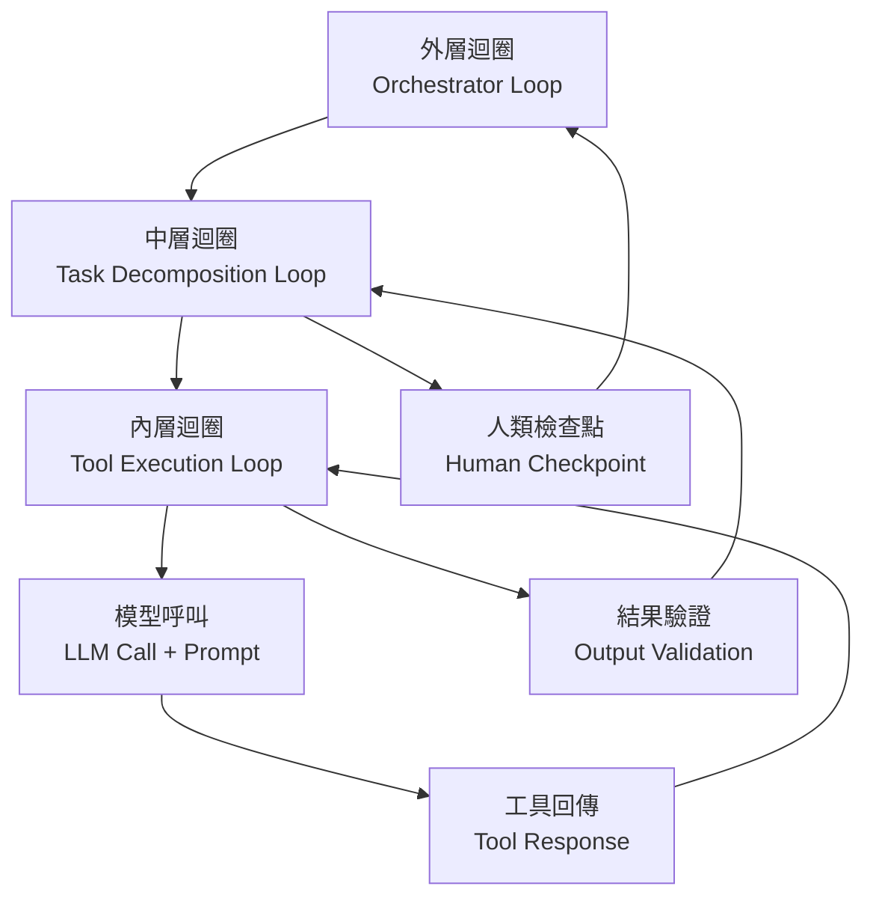
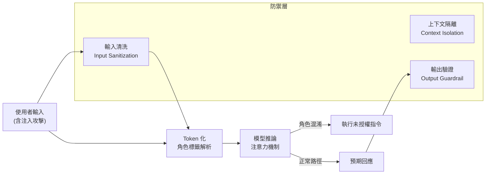
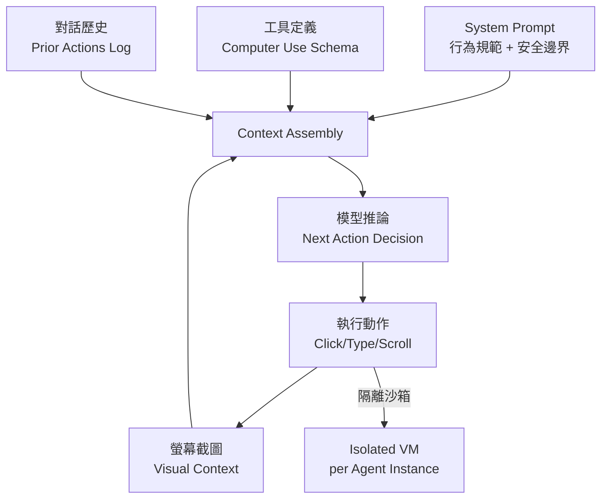
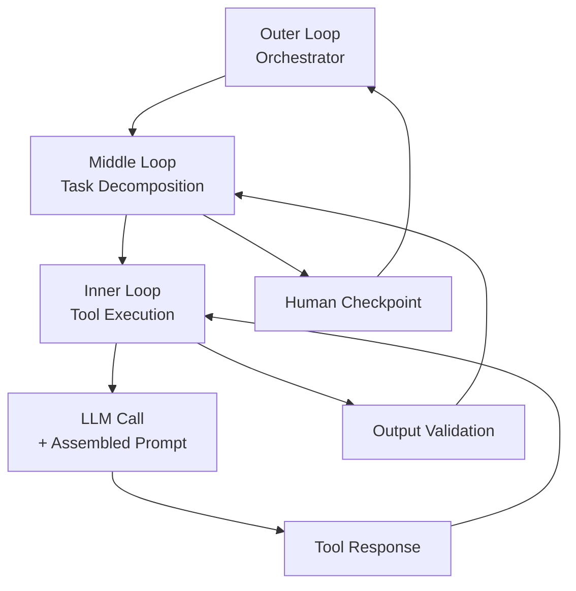
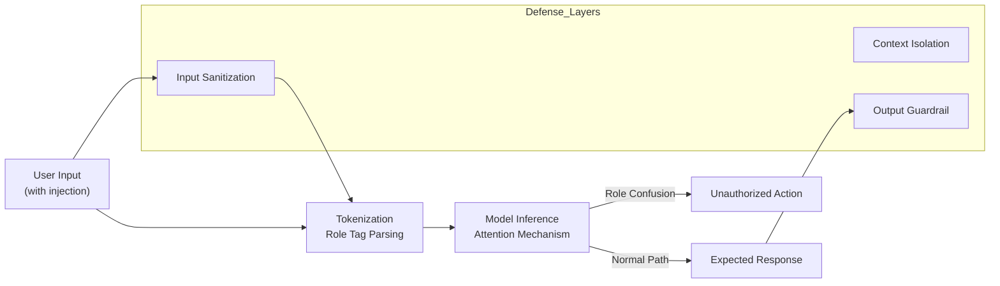

# Foundation — Track B: Prompt + Context Engineering

_Week 2026-W26 · 25 items synthesized · $0.7063 USD_

# 提示與上下文工程的生產化轉折：從「寫 prompt」到「設計認知迴路」

## TL;DR (3 句繁中)
1. 生產級 LLM 系統的核心工程已從「寫好一段 prompt」位移到「設計整個認知迴路」——涵蓋迴圈結構（loop engineering）、角色邊界防禦（role confusion mitigation）、以及上下文物件的生命週期管理。
2. 關鍵 trade-off：簡單架構在可觀測性與可維護性上壓倒性勝出，但「簡單」不等於「單一 prompt」，而是指每一層迴圈只承擔一個明確職責，並在層間保持嚴格的上下文隔離。
3. 對 Livia 工作的 SO WHAT：台灣銀行與製造業客戶需要的不是「prompt library」，而是一套可審計、可版控、可分層防禦的「上下文架構」，這正是 IBM Consulting 可以差異化的切入點。

## 背景與問題框架

[推論] 六個月前，業界對 prompt engineering 的理解仍停留在「system prompt 寫好 + few-shot 範例選對 = 品質提升」的線性思維。但從本週訊號密集度來看，生產系統已經不再把 prompt 當作一個靜態文字區塊——它是一個**運行時動態組裝的認知迴路**，其中每個元件（system instruction、tool schema、對話歷史、外部知識、safety guardrail）都有自己的生命週期、快取策略、和攻擊面。

[原文] Harrison Chase 在 [The Art of Loop Engineering](https://www.langchain.com/blog/the-art-of-loop-engineering) 中明確提出：可靠的 agent 效能不來自更好的模型，而來自「精心設計的 harness，為特定任務量身打造」。Sierra 的 Zack Reneau-Wedeen 在 [Max Agency Podcast](https://www.langchain.com/blog/why-the-best-agents-are-simpler-than-you-think-sierra-max-agency-podcast) 中更直白：最好的 agent 比你想像的更簡單，但這個「簡單」是設計出來的，不是偷懶得來的。

[推論] 與此同時，攻擊面也在擴大。Simon Willison 引述的 [Prompt Injection as Role Confusion](https://simonwillison.net/2026/Jun/22/prompt-injection-as-role-confusion/#atom-everything) 研究揭示了一個根本性問題：模型無法可靠區分「特權文字」（system prompt）與「使用者輸入」，這意味著所有依賴角色標籤（`<system>`、`<user>`）的安全假設都可能被繞過。當 Gemini 3.5 Flash 直接內建 [computer use](https://deepmind.google/blog/introducing-computer-use-in-gemini-3-5-flash/) 能力、agent 開始操作真實電腦時，prompt injection 的後果從「產生錯誤文字」升級為「執行未授權操作」。這不再是學術問題，而是 production blocker。

## 核心概念解析（含 Mermaid 圖）

### 一、從單一 Prompt 到分層認知迴路

[推論] 本週最重要的 pattern shift 是：prompt engineering 的單位已經不是「一段文字」，而是「一個迴圈（loop）」。Chase 的 loop engineering 框架將 agent 系統拆解為可堆疊的迴圈層，每層有自己的 prompt 責任區。

下圖呈現 loop engineering 的核心分層架構：

**關鍵洞察**：每一層迴圈有自己的 system prompt、自己的上下文窗口管理策略、自己的失敗處理邏輯。內層迴圈的 prompt 負責工具選擇與參數填充；中層負責任務分解與子目標追蹤；外層負責整體目標對齊與人類審批閘門。這跟六個月前「一個大 system prompt 解決一切」的做法根本不同。

[原文] Sierra 的觀點進一步強化這個架構哲學：「避免把組織架構圖塞進 agent 架構（avoid org-chart shipping）」。意思是不要因為組織有十個部門就建十個子 agent——應該按**認知任務的邏輯邊界**來切分迴圈，每個迴圈盡可能簡單。

### 二、角色混淆（Role Confusion）：Prompt 安全的結構性問題

[原文] Charles Ye、Jasmine Cui 與 Dylan Hadfield-Menell 的研究（[Willison 評述](https://simonwillison.net/2026/Jun/22/prompt-injection-as-role-confusion/#atom-everything)）將 prompt injection 重新框架為「角色混淆」問題：模型在推論過程中，無法可靠地將 `<system>` 標籤內的指令與 `<user>` 標籤內的輸入區分開來。攻擊者可以在使用者輸入中嵌入看起來像 system instruction 的文字，模型就會「角色混淆」，把攻擊指令當作系統指令執行。

下圖呈現角色混淆的攻擊路徑與防禦分層：

**關鍵洞察**：單靠 prompt 層面的防禦（如「忽略之前的指令」）在結構上是脆弱的，因為模型本身沒有硬編碼的角色邊界。有效防禦必須是**架構級的**——輸入清洗、上下文隔離（不同角色的文字在不同的 API call 中處理）、輸出驗證三層並用。

### 三、上下文物件的生命週期與快取策略

[推論] 當 agent 系統進入生產環境（如 [Klarna 的 8500 萬用戶客服](https://www.langchain.com/blog/customers-klarna)、[Lyft 的自助 agent 平台](https://www.langchain.com/blog/lyft-built-a-self-serve-ai-agent-platform-for-customer-support-with-langgraph-and-langsmith)），上下文窗口管理從「技術細節」變成「成本與延遲的主要驅動因素」。每次迴圈迭代都可能重新組裝數千 token 的上下文；在 Klarna 的規模下，哪怕節省 10% 的 token 使用量，年化成本影響就是百萬美元級。

[原文] OpenAI 與 Broadcom 發布的 [Jalapeño 推論晶片](https://openai.com/index/openai-broadcom-jalapeno-inference-chip) 和 Lilian Weng 的 [Scaling Laws, Carefully](https://lilianweng.github.io/posts/2026-06-24-scaling-laws/) 一文共同指向同一個現實：推論成本的物理極限正在被逼近，但 prompt 與上下文的設計品質仍有巨大的工程空間可以壓縮成本。

[推論] 具體而言，上下文生命週期管理包含幾個層次：

1. **靜態前綴快取**：system prompt + few-shot 範例幾乎不變，可用 prompt caching 機制（OpenAI、Anthropic 均已支援）大幅降低每次呼叫的 prefill 成本。
2. **動態中段管理**：對話歷史與工具回傳結果隨迴圈迭代增長，需要主動做摘要壓縮或滑動窗口。
3. **即時尾端注入**：最新的使用者輸入與工具查詢結果放在最後，利用 recency bias 提高模型對當前任務的注意力。

### 四、Computer Use 時代的 Prompt 架構挑戰

[原文] Gemini 3.5 Flash 將 computer use 從獨立模型升級為[主模型的內建工具](https://deepmind.google/blog/introducing-computer-use-in-gemini-3-5-flash/)。這代表 prompt 現在不只控制「文字生成」，還控制「滑鼠點擊、鍵盤輸入、螢幕截圖解析」等實體操作。

[原文] Chase 在 [Give Your Agent Its Own Computer](https://www.langchain.com/blog/give-your-ai-agent-its-own-computer) 中點出關鍵架構原則：每個 agent 實例需要自己的隔離計算環境。引用 Satya Nadella：「Every agent needs a computer.」

下圖呈現 computer use agent 的上下文組裝架構：

**關鍵洞察**：computer use prompt 的上下文組裝比純文字 agent 複雜一個數量級——需要處理多模態輸入（螢幕截圖）、動作空間定義（可點擊元素）、以及安全約束（哪些 URL 禁止訪問）。每一個元素都是上下文窗口的消費者，必須精打細算。

### 五、事實回憶機制與 Prompt 設計的交互作用

[原文] Google Research 的 [Thinking to Recall](https://research.google/blog/thinking-to-recall-how-reasoning-unlocks-parametric-knowledge-in-llms/) 研究揭示：讓模型「先思考」（chain-of-thought）可以解鎖其參數知識中原本無法直接提取的事實。[Gemma 的三階段事實回憶電路分析](https://towardsdatascience.com/a-three-phase-factual-recall-circuit-in-gemma-2b-and-gemma-12b-it/) 進一步確認：事實的儲存、路由、讀出是由不同 transformer 層負責的三個階段。

[推論] 這對 prompt 設計有直接的工程含意：
- **零樣本 vs 少樣本的選擇**不只是「給不給範例」的問題，而是「是否需要啟動模型的深層事實回憶路徑」的問題。
- 當任務需要深層知識（如法規條文的精確引用），chain-of-thought prompting 不是「錦上添花」——它是**必要的認知機制觸發器**。
- 但當任務只需淺層模式匹配（如格式轉換），COT 反而浪費 token 並引入幻覺風險。

## 與既有框架的對位

[推論] **Karpathy 的 "LLM OS" 框架**（2023）已經預見了上下文窗口作為「工作記憶」的角色，但本週的訊號顯示，這個比喻需要升級：上下文窗口不只是 RAM，更像是一個有層次的快取系統（L1 = 當前指令、L2 = 對話歷史摘要、L3 = 外部知識檢索結果），每層有不同的更新頻率與失效策略。

[推論] **Chip Huyen 的 "Designing Machine Learning Systems"** 強調 data distribution shift 是 ML 系統最大的維運挑戰。在 prompt 與上下文工程語境下，distribution shift 表現為：使用者輸入模式漂移→ few-shot 範例不再具代表性→ 模型行為退化。這正是 Lyft 和 Klarna 需要 LangSmith 做持續 observability 的原因。

[原文] **NIST AI RMF** 的 Govern 與 Map 功能要求組織理解 AI 系統的信任邊界。角色混淆研究直接挑戰了一個隱含假設：API 提供者透過角色標籤劃定的信任邊界在模型內部並不穩固。這意味著符合 NIST RMF 的系統**不能僅依賴 prompt 層面的安全控制**，必須在架構層面實施額外的隔離。

[推論] **Eugene Yan 的 cybersecurity evals 框架**（[Patterns for Building Cybersecurity Evals](https://eugeneyan.com//writing/cybersecurity-evals/)）提供了一個跟 prompt 安全直接相關的模式：沙箱化目標、可控輸入、工具集、與評分器。這個四元件模式可以直接遷移到 prompt injection 防禦的評估——把攻擊 prompt 當作「輸入」、把 agent 行為當作「目標」、把安全邊界違反當作「評分標準」。

## Trade-offs 與爭議

### 1. 簡單迴圈 vs 複雜 agent 圖
- **正方**：Sierra 和 Chase 強調最好的 agent 是簡單的——單一迴圈、明確責任、可測試。Klarna 的 80% 更快解決時間來自精簡架構，不是複雜圖。
- **反方**：Netflix 的[因果推論 agentic workflow](https://netflixtechblog.com/a-human-augmenting-agentic-workflow-for-causal-inference-4623f0a9c5af) 和[付款詐欺 benchmark](https://towardsdatascience.com/the-hot-path-belongs-to-gbdts-agents-own-the-cold-path-a-payment-fraud-benchmark/) 顯示，某些任務（如開放式分析）本質上需要多步驟、多工具的複雜路徑。
- **解方**[推論]：區分「hot path」（高頻、低延遲 → 簡單 prompt + GBDT）和「cold path」（低頻、高價值 → 複雜 agent 迴圈）。不是所有問題都該用 agent。

### 2. Prompt 快取 vs 上下文新鮮度
- **正方**：prompt caching 顯著降低延遲與成本（Jalapeño 晶片設計目標之一）。
- **反方**：過度快取導致 system prompt 更新延遲，在安全漏洞被發現後無法及時修補 guardrail。
- **解方**[推論]：分層快取——靜態安全規則的 TTL 可以設得短（分鐘級），任務指令的 TTL 可以長（小時級）。

### 3. 模型內建 Computer Use vs 外部工具呼叫
- **正方**：Gemini 3.5 Flash 內建 computer use 降低整合成本，一個模型處理文字 + 操作。
- **反方**：內建能力意味著攻擊面內建——prompt injection 可以直接觸發螢幕操作，風險從「hallucinated text」升級為「unauthorized action」。
- **解方**[推論]：必須在模型外部實施動作層防護（allowlist URLs/apps、操作確認閘門、沙箱隔離），不能依賴 prompt 中的 "don't click dangerous things" 指令。

### 4. Meta-Harness 抽象 vs 直接控制
- **正方**：swyx 命名的 [Meta-Harness Summer](https://www.latent.space/p/ainews-its-meta-harness-summer) 反映真實需求——當團隊管理幾十個 agent，需要 harness 之上的 harness。
- **反方**：每增加一層抽象就增加一層不透明性。對受監管的金融客戶來說，「harness 的 harness」是審計噩夢。
- **解方**[推論]：meta-harness 層必須是「可觀測抽象」（observable abstraction）——每次路由決策、prompt 組裝、工具選擇都有 trace，這正是 LangSmith / Phoenix 等 observability 工具存在的原因。

## 對 Livia IBM 客戶的具體含意

[推論] **國泰 / 玉山銀行**：prompt injection as role confusion 研究是最直接的客戶對話素材。台灣金融監管要求系統安全可控，而角色混淆研究證明「靠 prompt 自己保護自己」是不夠的。IBM 可以提案的角度：**上下文安全架構審計**——幫客戶盤點所有 LLM 接觸點，識別角色混淆風險，建立架構級（非 prompt 級）的防禦層。具體交付物：威脅模型文件 + 紅隊測試框架（參考 Eugene Yan 的 eval patterns）。

[推論] **台積電 / 鴻海**：Samsung 全員部署 ChatGPT Enterprise 和 Codex（[OpenAI Blog](https://openai.com/index/samsung-electronics-chatgpt-codex-deployment)）是直接的同業 benchmark。IBM 可以用這個案例推動台灣製造業客戶「不只是 POC，而是全員部署」的議程。關鍵提案角度：prompt 標準化與版控——Samsung 規模的部署不可能靠個別工程師寫 prompt，需要 prompt library + 品質 gate + A/B test 基礎設施。

[推論] **跨客戶**：hot path / cold path 分流模式（GBDT 處理高頻低延遲、agent 處理低頻高價值）直接適用於台灣銀行的反詐欺系統。客戶常見的錯誤是想用 LLM agent 取代所有規則引擎——正確做法是讓 GBDT 守住 hot path，agent 只處理 GBDT 標記為可疑的 cold path 案件。這個架構可以同時滿足延遲 SLA 和監管解釋性要求。

## 對 Livia harness engineer portfolio 的含意

[推論] **Design Note 提取**：本週深讀可以直接轉化為一份 design note：「Context Assembly as a First-Class Architectural Concern」——論述為什麼上下文組裝不該被視為 prompt engineering 的附屬品，而應該被視為系統架構的核心決策，包含快取策略、安全邊界、觀測性需求。

[推論] **面試問答架構**：「如何設計一個安全的 production agent system？」→ 用本週的三層防禦框架回答（輸入清洗 + 上下文隔離 + 輸出驗證），引用角色混淆研究說明為什麼 prompt-level defense 不夠。

[推論] **Portfolio narrative 連結**：swyx 命名的 「Meta-Harness Summer」正好呼應 Livia 的 harness engineer 定位。Portfolio 可以這樣敘事：「我不只是建 agent——我建管理 agent 的系統，包含 prompt 版控、上下文生命週期管理、安全邊界的架構級實施、以及跨 agent 的 observability。」這跟 LangChain 的 SmithDB inverted index 工程、Lyft 的 self-serve agent platform 是同一個產業趨勢線。

---

# Prompt & Context Engineering's Production Turn: From "Writing Prompts" to "Designing Cognitive Loops"

## TL;DR (3 sentences)
1. The core engineering unit for production LLM systems has shifted from "a well-written prompt" to "a designed cognitive loop" — encompassing loop architecture, role boundary defense, and context object lifecycle management.
2. Key trade-off: simple architectures win overwhelmingly on observability and maintainability, but "simple" doesn't mean "single prompt" — it means each loop layer carries exactly one clear responsibility with strict context isolation between layers.
3. SO WHAT for Livia: Taiwan banking and manufacturing clients need not a "prompt library" but an auditable, version-controlled, defensively-layered "context architecture" — precisely the differentiation IBM Consulting can deliver.

## Background & Problem Framing

[Inference] Six months ago, the industry's understanding of prompt engineering still centered on a linear model: "write a good system prompt + select good few-shot examples = quality improvement." This week's signal density reveals that production systems no longer treat prompts as static text blocks — they're **runtime-assembled cognitive circuits** where each component (system instruction, tool schema, conversation history, external knowledge, safety guardrail) has its own lifecycle, caching strategy, and attack surface.

[Source] Harrison Chase's [The Art of Loop Engineering](https://www.langchain.com/blog/the-art-of-loop-engineering) explicitly states: reliable agent performance comes not from a better model but from "a carefully designed harness built for specific tasks." Sierra's Zack Reneau-Wedeen on the [Max Agency Podcast](https://www.langchain.com/blog/why-the-best-agents-are-simpler-than-you-think-sierra-max-agency-podcast) makes it even blunter: the best agents are simpler than you think, but that simplicity is designed, not lazy.

[Inference] Meanwhile, the attack surface is expanding. The [Prompt Injection as Role Confusion](https://simonwillison.net/2026/Jun/22/prompt-injection-as-role-confusion/#atom-everything) research, cited by Willison, reframes injection as a fundamental inability of models to distinguish privileged text (`<system>`) from user input. When Gemini 3.5 Flash ships [built-in computer use](https://deepmind.google/blog/introducing-computer-use-in-gemini-3-5-flash/) and agents start operating real computers, prompt injection consequences escalate from "generated wrong text" to "executed unauthorized actions." This is no longer academic — it's a production blocker.

## Core Concepts (with Mermaid diagrams)

### 1. From Single Prompt to Layered Cognitive Loops

[Inference] This week's most important pattern shift: the unit of prompt engineering is no longer "a text block" but "a loop." Chase's loop engineering framework decomposes agent systems into stackable loop layers, each with its own prompt responsibility zone.

The following diagram shows the core layered loop architecture:

**Key insight**: Each loop layer has its own system prompt, its own context window management strategy, and its own failure handling logic. The inner loop's prompt handles tool selection and parameter filling; the middle loop handles task decomposition and subgoal tracking; the outer loop handles overall goal alignment and human approval gates. This is fundamentally different from the "one big system prompt solves everything" approach of six months ago.

[Source] Sierra's viewpoint reinforces this architectural philosophy: "avoid org-chart shipping" — don't create one sub-agent per department. Instead, divide loops by **cognitive task boundaries**, keeping each loop as simple as possible.

### 2. Role Confusion: The Structural Problem of Prompt Security

[Source] The research by Charles Ye, Jasmine Cui, and Dylan Hadfield-Menell ([Willison's coverage](https://simonwillison.net/2026/Jun/22/prompt-injection-as-role-confusion/#atom-everything)) reframes prompt injection as a "role confusion" problem: models cannot reliably distinguish `<system>`-tagged instructions from `<user>`-tagged input during inference. Attackers can embed system-instruction-like text in user input, causing the model to "role-confuse" and execute attack instructions as system commands.

The following diagram shows the attack path and defense layering for role confusion:

**Key insight**: Prompt-level defenses alone ("ignore previous instructions") are structurally fragile because the model has no hard-coded role boundary. Effective defense must be **architectural** — input sanitization, context isolation (different roles' text processed in separate API calls), and output validation, used in combination.

### 3. Context Object Lifecycle & Caching Strategy

[Inference] When agent systems enter production at scale — [Klarna's 85M users](https://www.langchain.com/blog/customers-klarna), [Lyft's self-serve agent platform](https://www.langchain.com/blog/lyft-built-a-self-serve-ai-agent-platform-for-customer-support-with-langgraph-and-langsmith) — context window management shifts from "implementation detail" to "primary cost and latency driver." Each loop iteration may reassemble thousands of tokens of context; at Klarna's scale, even a 10% token savings translates to millions of dollars annually.

[Source] The [Jalapeño inference chip](https://openai.com/index/openai-broadcom-jalapeno-inference-chip) from OpenAI/Broadcom and Lilian Weng's [Scaling Laws, Carefully](https://lilianweng.github.io/posts/2026-06-24-scaling-laws/) point to the same reality: inference cost is approaching physical limits, but prompt and context design quality still offers enormous engineering headroom for cost compression.

[Inference] Concretely, context lifecycle management spans three tiers:
1. **Static prefix caching**: System prompt + few-shot examples rarely change; prompt caching mechanisms (supported by OpenAI, Anthropic) dramatically reduce per-call prefill cost.
2. **Dynamic middle management**: Conversation history and tool responses grow with loop iterations; active summarization or sliding window compression is required.
3. **Just-in-time tail injection**: Latest user input and tool query results placed last, leveraging recency bias to focus model attention on the current task.

### 4. Prompt Architecture Challenges in the Computer Use Era

[Source] Gemini 3.5 Flash elevates computer use from a standalone model to a [built-in tool in the main model](https://deepmind.google/blog/introducing-computer-use-in-gemini-3-5
