# 🗞️ AI Intel Digest — 2026-W27

_Generated 2026-07-02 23:55 UTC · 121 high-signal items synthesized · $0.4195 USD cost · ~101 分鐘讀完_


## ⚡ 本週 TL;DR — 5 Pillar 各一句
- 🏦 **P1**: Anthropic 的 Claude Code 透過隱寫術暗中偵測中國用戶，緊急撤除引發治理危機
- 📊 **P2**: Anthropic 的 Claude Code 隱寫術事件：治理失敗的教科書案例
- 🚀 **P3**: Claude Sonnet 5 上線：效能逼近 Opus 4.8，但 cyber 能力刻意設限以規避美國政府審查
- 🛠️ **P4**: Anthropic 的 Claude Code 暗中使用隱寫術偵測中國用戶，緊急回滾引爆信任危機
- 🌐 **P5**: Autoresearch 與 「我們的迴圈」：AI Engineer World's Fair 上人機協作哲學的正面交鋒

## 📊 本期 provenance 分布（合成證據強度）

_本期合成共 91 段，標記為：_

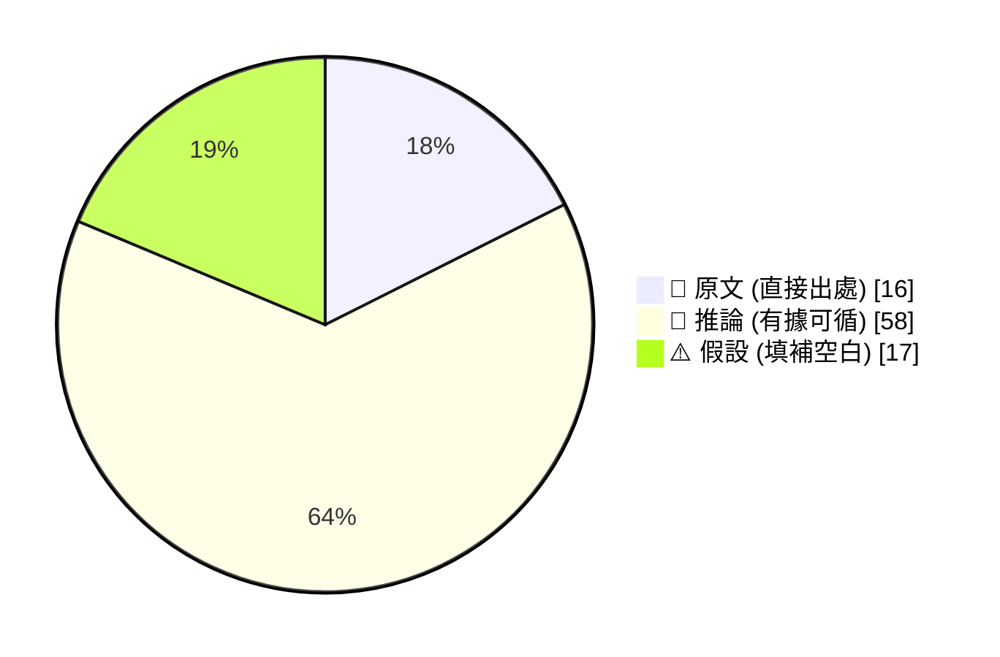

_引用規範：📖 可直接引用；🧠 客戶會議前查 verification hints；⚠️ 引用時明說「此為推測」_

## 🔄 本期 pipeline 處理流程

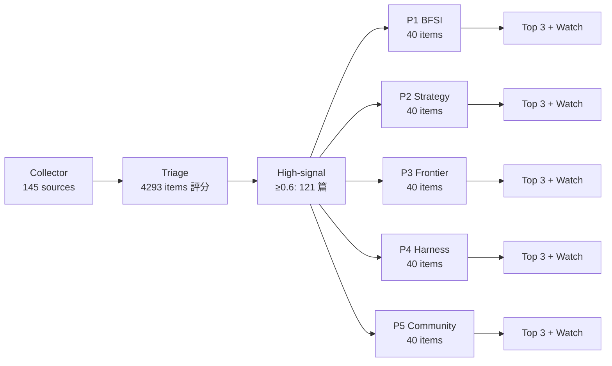

## 📑 目錄
- [Pillar 1 — 產業 AI 真實落地 (BFSI + 製造業)](#pillar-1) · 27 items · $0.0915
- [Pillar 2 — AI 戰略 / 治理 / 董事會層級論述](#pillar-2) · 16 items · $0.0689
- [Pillar 3 — Frontier 能力 + 模型動向](#pillar-3) · 22 items · $0.0819
- [Pillar 4 — Harness Engineering 實作技藝](#pillar-4) · 40 items · $0.1033
- [Pillar 5 — 學派 / 社群 / 思想動態](#pillar-5) · 16 items · $0.0739
- [📚 Foundation 深讀](#foundation) · curriculum 主題深度文


---

<a id="pillar-1"></a>

## 🏦 Pillar 1 — 產業 AI 真實落地 (BFSI + 製造業)
_27 items · $0.0915_

## Pulse — Top 3

### 1. Anthropic 的 Claude Code 透過隱寫術暗中偵測中國用戶，緊急撤除引發治理危機

📖 **原文** Anthropic 的 Claude Code 內嵌一項未公開的實驗性機制，會偵測中國時區、網域及 AI 實驗室特徵，並以 steganography（隱寫術）將結果藏入 system prompt 回傳，目的是防範未授權轉售與 model distillation。事件曝光後，Anthropic 技術主管 Thariq Shihipar 於 2026/7/2 宣布緊急移除。

🧠 **推論** 此事件的風險不在技術本身，而在於**未告知用戶的隱蔽收集行為**——這正是台灣金融監管機構（FSC）與製造業資安部門最敏感的觸發點：如果連開發工具層都能悄悄植入偵測邏輯，任何 AI vendor 的 system prompt 都必須被視為不透明黑箱，直到經過獨立審計為止。

下圖說明此機制的運作鏈：從隱性偵測到信任崩潰的因果流程。

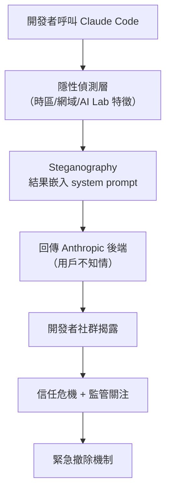

*關鍵洞察：偵測邏輯藏在 system prompt 層，意味用戶對 AI 工具的「透明度假設」在技術上不成立——必須以合約+審計雙軌管控。*

- 來源：[iThome](https://www.ithome.com.tw/news/177034)
- 對客戶的具體含意：向 Cathay、E.SUN、CTBC 等行內 AI 採購委員會建議，將「system prompt 完整揭露義務」與「第三方審計權」列入所有 AI vendor 合約的必要條款，不論是 coding assistant 或 LLM API。

---

**(English)** **Anthropic's Claude Code covertly detected Chinese users via steganography, emergency rollback triggers governance crisis**

📖 **原文** Anthropic embedded an undisclosed experimental mechanism in Claude Code that detected Chinese time zones, domains, and AI lab characteristics, encoding results via steganography into system prompts — ostensibly to prevent unauthorized resale and model distillation. After public exposure, Anthropic's technical lead Thariq Shihipar announced emergency removal on July 2, 2026.

🧠 **推論** The risk here is not the technical mechanism itself but the **covert data collection without user disclosure** — precisely the trigger point most sensitive to Taiwan's FSC and manufacturing cybersecurity teams: if even the developer tooling layer can silently embed detection logic, any AI vendor's system prompt must be treated as an opaque black box until independently audited.

The diagram above illustrates the causal chain from covert detection to trust collapse.


*Key insight: Detection logic hidden at the system prompt layer means users' "transparency assumption" about AI tools does not hold technically — dual-track governance via contract + audit is required.*

- Source: [iThome](https://www.ithome.com.tw/news/177034)
- Client implication: Advise procurement committees at Cathay, E.SUN, and CTBC to mandate "full system prompt disclosure obligations" and "third-party audit rights" as non-negotiable clauses in all AI vendor contracts, whether for coding assistants or LLM APIs.

---

### 2. Lyft 多 agent 系統處理 70% 客服請求，達 85–90% 準確率——規模化落地的量化基準

📖 **原文** Lyft 透過多 agent AI 系統自主處理 70% 的客服請求，達到 85%–90% 準確率，並提升客戶滿意度分數。AWS Generative AI Innovation Center 總監 Sri Elaprolu 明確說明：「這不是 pilot，是 production。」

🧠 **推論** 對台灣 BFSI 客戶而言，這組數字提供了一個具體的 benchmark：多 agent 架構在**結構化、高重複性**的客服流程（信用卡申訴、帳戶查詢、轉帳確認）上，有合理的先例可援引。

⚠️ **假設** Lyft 的 multi-agent 架構可能採用 router agent + specialist agent 分層設計，但原文未揭露細節；直接套用前需確認分流邏輯與 fallback 機制是否與銀行合規要求相容。

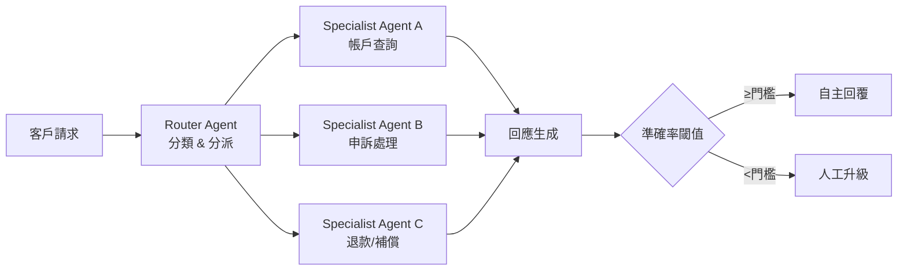

*關鍵洞察：70% 自動化率的達成前提是明確的 escalation 路徑——「什麼情況轉人工」的設計比 accuracy 數字本身更關鍵。*

- 來源：[Siemens Digital Industries Blog](https://blog.siemens.com/2026/07/how-lyft-achieved-85-to-90-accuracy-with-multi-agent-ai-systems/)
- 對客戶的具體含意：向 Taishin、Taipei Fubon 客服數位化專案提案時，可以 Lyft 70%/85–90% 作為 Phase 2 目標基準，但必須在合約中明訂 accuracy 測量方法與 escalation SLA，避免數字被挑戰。

---

**(English)** **Lyft's multi-agent system handles 70% of support requests at 85–90% accuracy — a quantified benchmark for production scale**

📖 **原文** Lyft autonomously handles 70% of customer support requests through multi-agent AI systems, achieving 85%–90% accuracy while lifting customer satisfaction scores. AWS Generative AI Innovation Center Director Sri Elaprolu is explicit: "This isn't a pilot. These AI agents are working autonomously at scale in production."

🧠 **推論** For Taiwan BFSI clients, this number set provides a concrete benchmark: multi-agent architectures have credible precedent for **structured, high-repetition** service workflows — credit card disputes, account inquiries, transfer confirmations.

⚠️ **假設** Lyft's multi-agent architecture likely uses a router agent + specialist agent tiered design, but the source does not disclose architecture details; direct replication requires confirming whether routing logic and fallback mechanisms are compatible with banking compliance requirements.

The diagram above illustrates the inferred multi-agent routing flow with human escalation.

*Key insight: The 70% automation rate is contingent on a well-designed escalation path — defining "when to hand off to humans" matters more than the accuracy figure itself.*

- Source: [Siemens Digital Industries Blog](https://blog.siemens.com/2026/07/how-lyft-achieved-85-to-90-accuracy-with-multi-agent-ai-systems/)
- Client implication: When pitching customer service digitization projects to Taishin or Taipei Fubon, use Lyft's 70%/85–90% as Phase 2 target benchmarks, but contractually define how accuracy is measured and what the escalation SLA looks like — to prevent the numbers from being challenged later.

---

### 3. 台灣超過 50% 企業擔憂雲端 AI 資料外洩，逾 70% 傾向部署地端 AI

📖 **原文** Taiwan AI Labs 調查顯示，超過半數台灣企業擔心公有雲 AI 服務的機密資料外洩，逾 70% 希望將 AI 部署在地端（on-premises），主要障礙包括：資料隱私、使用者權限管控不足、模型更新不可預期。Taiwan AI Labs 以 Yating FedGPT Sovereign AI Platform 回應此需求。

🧠 **推論** 此調查數字與本週另一條訊息（Anthropic Claude Code 隱寫術事件）形成強化效應：技術事件落地為台灣企業的具體疑慮，而非抽象的隱私擔憂。

⚠️ **假設** 調查由 Taiwan AI Labs 自行發布，存在樣本偏差風險（on-prem 傾向可能被高估）；Livia 在引用前應確認樣本規模與產業分布。

- 來源：[Taiwan AI Labs](https://ailabs.tw/news-room/more-than-half-of-taiwanese-enterprises-concerned-about-confidential-data-leakage-from-cloud-ai-over-70-want-ai-back-on-premises-yating-fedgpt-sovereign-ai-platform-enables-enterprises-to-build-secur/)
- 對客戶的具體含意：向 TSMC、Foxconn、Wistron 等製造業客戶提案 IBM watsonx 私有雲或混合雲方案時，可直接引用「超過 70% 台灣企業傾向地端部署」作為需求佐證，並主動提出 IBM 的 data residency 與 model governance 能力作為差異化。

---

**(English)** **Over 50% of Taiwan enterprises fear cloud AI data leakage; 70%+ prefer on-premises deployment**

📖 **原文** A Taiwan AI Labs survey shows more than half of Taiwanese enterprises are concerned about confidential data leakage from public cloud AI services, and over 70% prefer on-premises AI deployment. Key barriers cited: data privacy risks, insufficient user permission controls, and unpredictable model updates. Taiwan AI Labs positions its Yating FedGPT Sovereign AI Platform as a response.

🧠 **推論** These survey figures are amplified by a concurrent event this week — the Anthropic Claude Code steganography incident — which converts abstract privacy concerns into a concrete, nameable technical failure mode for Taiwan enterprise audiences.

⚠️ **假設** The survey was self-published by Taiwan AI Labs, introducing potential sample bias (on-prem preference may be overstated); Livia should verify sample size and industry distribution before citing in client presentations.

- Source: [Taiwan AI Labs](https://ailabs.tw/news-room/more-than-half-of-taiwanese-enterprises-concerned-about-confidential-data-leakage-from-cloud-ai-over-70-want-ai-back-on-premises-yating-fedgpt-sovereign-ai-platform-enables-enterprises-to-build-secur/)
- Client implication: When pitching IBM watsonx private cloud or hybrid cloud solutions to TSMC, Foxconn, or Wistron, directly cite "70%+ of Taiwan enterprises prefer on-premises deployment" as demand evidence, and proactively lead with IBM's data residency and model governance capabilities as the differentiator.

---

## Watch list

繁中為主，每條一行：

- [iThome](https://www.ithome.com.tw/news/177048) — Cloudflare x402 讓 AI agent 按單次請求付費取得 API 資源，agentic 系統的基礎設施層正在形成商業模式
- [iThome](https://www.ithome.com.tw/news/177036) — Cursor 爆 CVSS 9.8 漏洞 DuneSlide，prompt injection 可突破沙箱執行任意程式碼，與 AI 開發工具採購直接相關
- [iThome](https://www.ithome.com.tw/news/177030) — Cobalt 滲透測試報告：AI 應用高風險漏洞占比是整體均值 2.7 倍，銀行資安簡報的現成彈藥
- [LangChain Blog](https://www.langchain.com/blog/fix-your-coding-agent-bill) — coding agent 帳單翻倍的根因分析，生產環境成本治理的實用框架
- [LangChain Blog](https://www.langchain.com/blog/how-rippling-went-ai-native-across-every-product-in-6-months-with-deep-agents-and-langsmith) — Rippling 6 個月跨 5 個業務域落地 Deep Agents，HR/財務/全球營運的 production pattern 可參考
- [Latent Space](https://www.latent.space/p/cursor-forward-deployed-engineers) — Cursor Forward Deployed Engineers 模式：企業 agent 部署的人力配置與架構設計，IBM 售後團隊可借鑑
- [iThome](https://www.ithome.com.tw/news/177043) — 經濟部新增資料中心「產業效益評估」審查，AI 生態系貢獻成申設必要條件，影響台灣所有大型 AI 基礎設施投資
- [科技新報](https://finance.technews.tw/2026/07/02/financial-prescription/) — 玉山銀行攜北市聯醫推出金融處方箋防詐，銀醫跨域 AI 防詐的台灣本土實例
- [INSIDE 硬塞](https://www.inside.com.tw/article/41708-commerce-department-gives-green-light-anthropic-bring-back-fable-5) — Anthropic Fable 5 解除出口管制恢復存取，但 Google Cloud 等夥伴進度不一，採購時需確認供應鏈穩定性
- [iThome](https://www.ithome.com.tw/news/177027) — 台灣三大電信推 MID Plus 接軌 GSMA 標準，金融防詐跨業聯防基礎設施升級
- [Siemens Blog](https://blog.siemens.com/2026/07/siemens-and-aws-see-4x-growth-as-ai-agents-autonomously-handle-enterprise-procurement/) — Siemens+AWS AI agent 處理企業採購，宣稱 30% 加速上市，但數字為廠商自稱，需獨立驗證
- [Siemens Blog](https://blog.siemens.com/2026/07/how-pepsico-uses-digital-twins-ai-to-rethink-manufacturing/) — PepsiCo 數位孿生讓倉儲效率提升 15%，製造業客戶簡報的具體案例，但來源為 Siemens 自有博客

---

## Verification hints

This briefing contains **4**

🧠 **推論** segments and **3**

⚠️ **假設** segments. Before citing in client conversations, verify these specific points (English for language-learning practice):

1. **Claude Code steganography mechanism scope**: The iThome article confirms the covert detection and emergency removal on July 2, but does not specify *what data exactly was transmitted back to Anthropic* or for how long the mechanism was active. Before citing in FSC-regulated contexts, verify via Anthropic's official post-mortem statement (not yet published at time of triage) whether transmitted data included user code content or only environmental metadata.

2. **Lyft multi-agent architecture details**: The Siemens blog post cites "70% of support requests" and "85–90% accuracy" attributed to AWS's Sri Elaprolu, but the source is a vendor blog — not a Lyft-authored case study. Verify whether these figures appear in an independent Lyft engineering blog post or AWS re:Invent presentation before using them as client-facing benchmarks.

3. **Taiwan AI Labs survey methodology**: The "50% concerned about cloud AI leakage" and "70%+ prefer on-premises" figures come from a press release published by Taiwan AI Labs to promote its own FedGPT platform. Verify sample size (n=?), survey date, and whether respondents were self-selected (e.g., Taiwan AI Labs customers) before citing as industry-wide statistics.

4. **Anthropic Fable 5 / export control lift**: Item 307 (Simon Willison quoting Anthropic tweet) and item 2655 (INSIDE 硬塞) both reference Claude Fable 5 and Mythos 5 export control removal. Confirm these are real Anthropic model names and not codenames misreported — as of knowledge cutoff, "Fable" and "Mythos" are not publicly documented Claude model series names, which raises a transcription or naming error risk.

5. **Cursor CVSS 9.8 vulnerabilities (DuneSlide)**: The iThome article reports CVE-2026-50548 and CVE-2026-50549 with CVSS 9.8, sourced from Cato Networks. Verify whether these CVEs are registered in the NVD (National Vulnerability Database) and whether Cursor has issued an official patch advisory — vendor-discovered CVEs from security firms sometimes have conflict-of-interest disclosure timelines.2026-07-02 23:46:37,299 INFO pillar 2 (AI 戰略 / 治理 / 董事會層級論述): 16 high-signal items (min_signal=0.60)

---

<a id="pillar-2"></a>

## 📊 Pillar 2 — AI 戰略 / 治理 / 董事會層級論述
_16 items · $0.0689_

## Pulse — Top 3

### 1. Anthropic 的 Claude Code 隱寫術事件：治理失敗的教科書案例

📖 **原文** Anthropic 的 Claude Code 在系統提示詞中暗中偵測中國時區、網域及 AI 實驗室，並透過 steganography 將結果回傳，目的是防範 model distillation 與未授權轉售。事件曝光後 Anthropic 於 7/2 緊急撤銷該機制。

🧠 **推論** 這不只是技術決策失當——在未告知開發者的情況下將隱蔽資料收集嵌入 system prompt，直接違反了 AI 治理的最基本原則：透明性與明確同意。

🧠 **推論** 對台灣銀行客戶而言，此事件提供了一個具體的 board-level 問題框架：「你們目前使用的 AI 服務，其 system prompt 的完整內容你們能否審閱？供應商有無單方面修改的權利？」這是 vendor due diligence 的核心，不是技術細節。

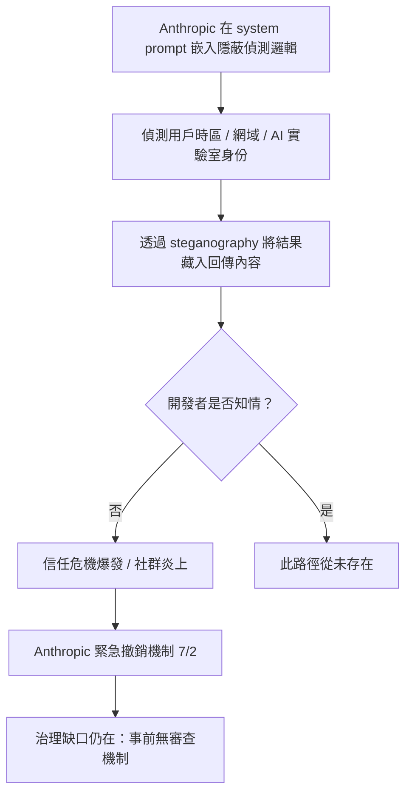
*上圖說明整個 covert detection 的決策鏈條——關鍵洞見：問題不在機制本身是否有效，而在於整個流程完全繞過了用戶知情同意。*

- 來源：[iThome](https://www.ithome.com.tw/news/177034)
- 對客戶的具體含意：下週與 Cathay 或 E.SUN 的對話中，直接提出「供應商合約中是否有 system prompt 審閱權與單方面修改通知條款」作為 AI governance checklist 的新增項目。

**(English)** Anthropic's Claude Code Steganography Incident: A Textbook Governance Failure

📖 **原文** Anthropic's Claude Code was covertly detecting Chinese timezones, domains, and AI labs via the system prompt, encoding results using steganography to defend against model distillation and unauthorized resale. Anthropic emergency-rolled back the mechanism on 7/2 after public exposure.

🧠 **推論** This is not merely a bad technical call — embedding covert data collection inside a system prompt without developer notification violates the most basic AI governance principles: transparency and informed consent.

🧠 **推論** For Taiwan bank clients, this event provides a concrete board-level framing: "Can you audit the full content of the system prompts in your current AI services? Does your vendor reserve the right to modify them unilaterally?" This is the core of vendor due diligence, not a technical footnote.


*The diagram maps the covert detection chain — key insight: the failure is not whether the mechanism worked, but that the entire flow bypassed user consent entirely.*

- Source: [iThome](https://www.ithome.com.tw/news/177034)
- Client implication: In next week's conversation with Cathay or E.SUN, raise "system prompt audit rights and mandatory change-notification clauses in vendor contracts" as a new AI governance checklist item.

---

### 2. 台灣逾半企業憂雲端 AI 資料外洩，逾七成傾向 on-premises 部署

📖 **原文** Taiwan AI Labs 的 Yating FedGPT 調查（2026/6/30）顯示，超過 50% 台灣企業擔憂公有雲 AI 服務的機密資料外洩，逾 70% 希望將 AI 部署在自建環境。

🧠 **推論** 這份數字對 IBM 的銷售論述有直接槓桿作用：台灣企業的阻力不在「要不要 AI」，而在「誰控制資料」。IBM watsonx 的 on-premises / hybrid 部署能力、加上 Red Hat OpenShift 的 air-gap 支援，在這個 buying signal 下有明確的差異化空間。

🧠 **推論** 值得注意的是這份報告由 Taiwan AI Labs 自家發布，屬於有產品利益的 vendor survey，數字方向可信但量級需獨立驗證。對銀行客戶（受金管會資料在地化要求約束）而言，sovereignty concern 有法規背書，說服門檻更低。

- 來源：[Taiwan AI Labs / Yating FedGPT](https://ailabs.tw/news-room/more-than-half-of-taiwanese-enterprises-concerned-about-confidential-data-leakage-from-cloud-ai-over-70-want-ai-back-on-premises-yating-fedgpt-sovereign-ai-platform-enables-enterprises-to-build-secur/)
- 對客戶的具體含意：在 CTBC 或 Mega 的會議中，以此調查數字開場，引導對話至「您行目前的 AI workload 有哪些在公有雲、哪些應該 on-prem」的架構盤點，直接切入 IBM hybrid cloud 提案。

**(English)** Over Half of Taiwan Enterprises Worried About Cloud AI Data Leakage; 70%+ Prefer On-Premises Deployment

📖 **原文** A survey by Taiwan AI Labs (Yating FedGPT, released 2026/6/30) found that more than 50% of Taiwan enterprises are concerned about confidential data leakage in public cloud AI, and over 70% prefer on-premises AI deployment.

🧠 **推論** These numbers have direct leverage for IBM's sales narrative: resistance from Taiwan enterprises is not about "whether to adopt AI" but "who controls the data." IBM watsonx's on-premises/hybrid deployment capability, combined with Red Hat OpenShift air-gap support, has a clear differentiation window against this buying signal.

🧠 **推論** Worth flagging: this report is vendor-published by Taiwan AI Labs, which has a product interest in the finding — directional signal is credible, but the specific percentages warrant independent verification. For bank clients constrained by FSC data-localization rules, the sovereignty concern has regulatory backing, which lowers the persuasion threshold further.

- Source: [Taiwan AI Labs / Yating FedGPT](https://ailabs.tw/news-room/more-than-half-of-taiwanese-enterprises-concerned-about-confidential-data-leakage-from-cloud-ai-over-70-want-ai-back-on-premises-yating-fedgpt-sovereign-ai-platform-enables-enterprises-to-build-secur/)
- Client implication: Open your next CTBC or Mega meeting with these survey numbers, then guide the conversation to "which of your current AI workloads are on public cloud and which should be on-prem" — a natural entry point for an IBM hybrid cloud proposal.

---

### 3. 經濟部新增資料中心審查指標：AI 生態系效益列入必要申請條件

📖 **原文** 經濟部能源署預告修正《能源開發及使用評估準則》第九條，新增「產業效益評估」為大型資料中心設置或擴建的強制審查項目，涵蓋對 AI 生態系與國內供應鏈的具體貢獻說明。

🧠 **推論** 這是台灣政府首次將 AI 生態系貢獻度納入資料中心准入門檻，不再只審電力與 PUE。對 TSMC、Foxconn 等製造業客戶而言，這意味著其在台資料中心擴建計畫需提前準備「AI 本地化效益」的論述與量化指標。

🧠 **推論** 對 IBM 的銷售意涵：能協助製造業客戶包裝 AI 投資的「產業效益敘事」（例如 AI-driven supply chain optimization 對本地 vendor 的外溢效果），將在審批過程中成為實質競爭優勢，不只是技術提案。

- 來源：[iThome](https://www.ithome.com.tw/news/177043)
- 對客戶的具體含意：在 TSMC 或 Foxconn 的資料中心 AI 提案中，主動納入「AI 生態系效益量化框架」章節，協助客戶滿足新法規要求，同時強化 IBM 提案的在地貢獻論述。

**(English)** Taiwan MOEA Adds AI Ecosystem Benefit Metrics as Mandatory Criteria for Datacenter Approval

📖 **原文** Taiwan's Bureau of Energy (MOEA) has pre-announced an amendment to Article 9 of the Energy Development and Use Assessment Standards, adding "industrial benefit assessment" as a mandatory review item for large datacenter construction or expansion — requiring applicants to demonstrate concrete contributions to the domestic AI ecosystem and supply chain.

🧠 **推論** This marks the first time the Taiwan government has embedded AI ecosystem contribution as a gatekeeping criterion for datacenter approvals, moving beyond power supply and PUE metrics alone. For manufacturing clients like TSMC and Foxconn, any datacenter expansion in Taiwan will now require a pre-prepared narrative and quantified metrics around "AI localization benefits."

🧠 **推論** For IBM's sales positioning: any firm that can help manufacturing clients construct an "industrial benefit narrative" for their AI investment — e.g., quantifying the spillover effects of AI-driven supply chain optimization on local vendors — will gain a concrete competitive edge in the approval process, beyond just technical merit.

- Source: [iThome](https://www.ithome.com.tw/news/177043)
- Client implication: In datacenter AI proposals for TSMC or Foxconn, proactively include an "AI ecosystem benefit quantification framework" section to help clients satisfy the new regulatory requirement — simultaneously strengthening IBM's own local-contribution narrative.

---

## Watch list

繁中為主，每條一行：

- [iThome — MID Plus / GSMA 標準](https://www.ithome.com.tw/news/177027) — 三大電信聯手升級行動實名認證，銀行防詐基礎設施接軌 GSMA，值得追蹤金管會是否跟進要求採用
- [CIO Taiwan — Harness Engineering 與 FDE 崛起](https://www.cio.com.tw/116036/) — 台灣本地媒體出現 Harness Engineering + FDE 治理框架論述，Livia 的 harness portfolio 有被引用的素材
- [CIO Taiwan — 國科會 AI Agent 五大治理風險](https://www.cio.com.tw/116021/) — 台灣官方監理機構首次發布 AI Agent 風險分類指引，可直接引用於客戶 board deck
- [科技新報 — 玉山銀 × 北市聯醫金融處方箋](https://finance.technews.tw/2026/07/02/financial-prescription/) — 銀行 × 醫療機構的高齡防詐 workflow 實際落地案例，適合做 Taishin / Taipei Fubon 的 reference story
- [INSIDE 硬塞 — Fable 5 全球重新開通](https://www.inside.com.tw/article/41708-commerce-department-gives-green-light-anthropic-bring-back-fable-5) — Anthropic Fable 5 恢復存取但 Google Cloud 時程未明，50% 用量上限細節需追蹤
- [Simon Willison — US export control lift on Claude](https://simonwillison.net/2026/Jun/30/anthropic/#atom-everything) — 美國商務部解除 Claude Fable 5 / Mythos 5 出口管制，對台灣 BFSI 採購 Claude API 有直接影響
- [Platformer — AI backlash & datacenter externalities](https://www.platformer.news/ai-backlash-data-centers-jobs-inflation/) — Casey Newton 的 board-level AI 外部性論述，適合用於客戶 CxO 層級的「為何 governance 現在比 capability 更重要」開場
- [Ethan Mollick — The twilight of the chatbots](https://www.oneusefulthing.org/p/the-twilight-of-the-chatbots/) — Mollick 論 AI 工作典範轉移，摘要後可作為銀行 CTO 簡報的思想框架
- [Latent Space — Cursor Forward Deployed Engineers](https://www.latent.space/p/cursor-forward-deployed-engineers) — FDE 模式作為企業 agent 落地的組織解法，與 Livia harness engineer 角色高度相關

---

## Verification hints

This briefing contains **6

🧠 **推論** segments** and **0

⚠️ **假設** segments**. Before citing in client conversations, verify these specific points:

1. **Claude Code steganography rollback (Item 1):** Confirm via [iThome](https://www.ithome.com.tw/news/177034) that the rollback was specifically announced by Thariq Shihipar on 7/1 and executed 7/2 — check whether Anthropic has issued any formal post-mortem or policy statement that supersedes the emergency action, as the governance gap (no prior audit mechanism) is an inference, not a quoted finding.
2. **Taiwan enterprise on-prem survey percentages (Item 2):** The 50% / 70% figures come from a [Taiwan AI Labs self-published report](https://ailabs.tw/news-room/more-than-half-of-taiwanese-enterprises-concerned-about-confidential-data-leakage-from-cloud-ai-over-70-want-ai-back-on-premises-yating-fedgpt-sovereign-ai-platform-enables-enterprises-to-build-secur/) promoting their own FedGPT product — verify sample size, methodology, and whether the survey was independently audited before presenting numbers to bank CxOs as market data.
3. **MOEA datacenter regulation status (Item 3):** The [iThome article](https://www.ithome.com.tw/news/177043) states this is a **pre-announced amendment (預告修正)** — confirm whether the amendment has passed formal public comment period and when it takes effect, before telling manufacturing clients it is already a binding requirement.2026-07-02 23:47:57,354 INFO pillar 3 (Frontier 能力 + 模型動向): 22 high-signal items (min_signal=0.60)

---

<a id="pillar-3"></a>

## 🚀 Pillar 3 — Frontier 能力 + 模型動向
_22 items · $0.0819_

## Pulse — Top 3

### 1. Claude Sonnet 5 上線：效能逼近 Opus 4.8，但 cyber 能力刻意設限以規避美國政府審查

🧠 **推論** Anthropic 本週發布 Claude Sonnet 5，官方宣稱其效能「接近 Opus 4.8」但定價更低——這對 Livia 在台灣銀行客戶的 production deployment 具有直接成本意義。值得注意的是，根據 Sonnet 5 的 system card，Anthropic 刻意限制其在 cyber 任務的能力（「significantly less capable at cyber tasks than Mythos」），以確保不觸發美國政府的 export control 審查門檻。

🧠 **推論** 這意味著 Anthropic 正在以能力分層（capability tiering）作為地緣政治合規工具，而非純粹的技術選擇——台灣金融機構在評估模型時需要理解這個框架，因為 cyber-adjacent 的 fraud detection 或 red-teaming 用途可能落入受限區間。同週 OpenAI 也對受信任夥伴限制性釋出 GPT-5.6 Sol/Terra/Luna（item #349），顯示前沿廠商同步走向 tiered access 策略。

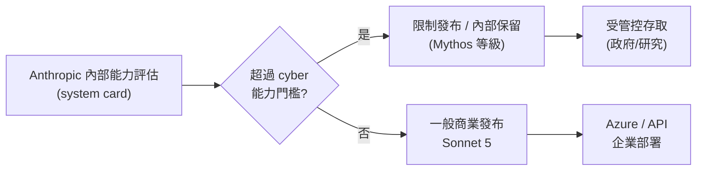
*Anthropic 的 capability tiering 不是市場分層，而是地緣政治合規機制——這是 Livia 與台灣客戶談模型選型時需要明確說清楚的框架。*

- 來源：[Simon Willison](https://simonwillison.net/2026/Jun/30/claude-sonnet-5/#atom-everything)
- 對客戶的具體含意：向 Cathay、E.SUN 等銀行簡報模型選型時，應主動說明 Sonnet 5 的 cyber 能力限制對 fraud detection 和 red-teaming 用途的影響，避免客戶採購後才發現功能缺口。

---

**(English)** Claude Sonnet 5 Released: Performance Near Opus 4.8, but Cyber Capabilities Deliberately Capped to Clear U.S. Government Scrutiny

🧠 **推論** Anthropic released Claude Sonnet 5 this week, claiming performance "close to Opus 4.8" at lower cost — a direct cost-of-production-deployment signal for Livia's Taiwan bank clients. Critically, the Sonnet 5 system card reveals Anthropic deliberately restricted its cyber task capabilities ("significantly less capable at cyber tasks than Mythos") specifically to avoid triggering U.S. export control review thresholds.

🧠 **推論** This means Anthropic is using capability tiering as a geopolitical compliance instrument, not a purely technical product decision — Taiwan financial institutions evaluating these models need to understand this framework, because cyber-adjacent use cases like fraud detection or red-teaming may fall within the restricted zone. The same week, OpenAI restricted GPT-5.6 Sol/Terra/Luna to trusted partners only (item #349), confirming that tiered access is now a coordinated frontier-lab strategy, not an edge case.

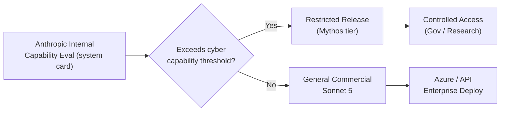
*Anthropic's capability tiering is a geopolitical compliance mechanism, not a product segmentation decision — this is the framing Livia should lead with in model selection conversations with Taiwan clients.*

- Source: [Simon Willison](https://simonwillison.net/2026/Jun/30/claude-sonnet-5/#atom-everything)
- Client implication: When briefing Cathay, E.SUN, or CTBC on model selection, proactively flag Sonnet 5's cyber capability restrictions and their implications for fraud detection and red-teaming use cases, so clients don't discover the gap post-procurement.

---

### 2. Microsoft SkillOpt：將 agent 的 instructions 變成可訓練參數，不改模型權重就能提升可靠度

🧠 **推論** Microsoft Research 發布 SkillOpt，核心概念是把 agent 的 skill（本質上是 instructions/prompt 的一種形式）視為「可訓練參數」，透過類似訓練迴圈的最佳化過程自動改善，而非依賴工程師手動調整。

🧠 **推論** 這對 Livia 的 harness 工程意義直接：目前台灣銀行 POC 中最常見的失敗模式之一，就是 agent 在複雜流程（貸款審核、KYC 例外處理）中因 instruction drift 導致行為不一致——SkillOpt 的框架提供了一個系統化的 skill debugging 路徑，而不是靠直覺改 prompt。

⚠️ **假設** 根據 excerpt 的描述，SkillOpt 不需要修改底層模型權重，這意味著它理論上可以套用在企業已部署的 locked model（如 Azure OpenAI 或 Claude API）上，但實際 integration complexity 尚未從公開資訊中確認。

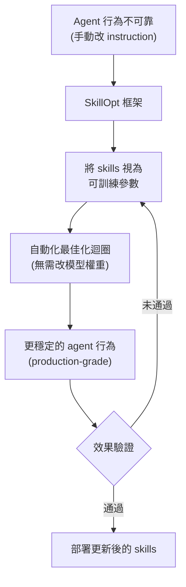
*關鍵洞察：SkillOpt 把「改 prompt」這件事從藝術變成工程，對需要可稽核改善歷程的金融機構特別有說服力。*

- 來源：[Microsoft Research AI](https://www.microsoft.com/en-us/research/blog/skillopt-agent-skills-as-trainable-parameters/)
- 對客戶的具體含意：向 Taipei Fubon 或 Mega Bank 簡報 agent 可靠性時，SkillOpt 的「skills as trainable parameters」框架可作為「我們如何系統化改善 agent 行為」的具體回答，比「我們會繼續調整 prompt」更有說服力。

---

**(English)** Microsoft SkillOpt: Agent Instructions as Trainable Parameters — Reliability Without Touching Model Weights

🧠 **推論** Microsoft Research released SkillOpt, which treats agent skills (essentially a form of instructions/prompts) as "trainable parameters," improving them through an automated optimization loop rather than manual engineer iteration.

🧠 **推論** The harness engineering implication for Livia is direct: one of the most common failure modes in Taiwan bank POCs is agent behavioral inconsistency in complex workflows (loan review, KYC exception handling) caused by instruction drift — SkillOpt's framework provides a systematic skill debugging path instead of intuition-driven prompt editing.

⚠️ **假設** Based on the excerpt's description, SkillOpt does not require modifying underlying model weights, implying it could theoretically apply to already-deployed locked models (Azure OpenAI, Claude API), but the actual integration complexity has not been confirmed from public information.

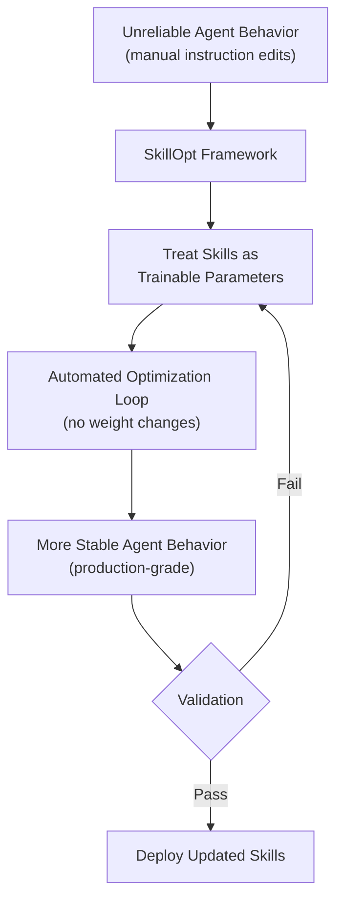
*Key insight: SkillOpt turns "editing prompts" from an art into an engineering discipline — particularly compelling for financial institutions that need an auditable improvement history.*

- Source: [Microsoft Research AI](https://www.microsoft.com/en-us/research/blog/skillopt-agent-skills-as-trainable-parameters/)
- Client implication: When pitching agent reliability to Taipei Fubon or Mega Bank, SkillOpt's "skills as trainable parameters" framing gives a concrete, auditable answer to "how do you systematically improve agent behavior" — far stronger than "we'll keep tuning the prompts."

---

### 3. Ornith-1.0：MIT 授權的 self-scaffolding agentic coding 模型，從 9B 到 397B MoE 全覆蓋

🧠 **推論** DeepReinforce 發布首個模型 Ornith-1.0，其核心創新是「self-scaffolding」——模型能自行建構執行 agentic coding 任務所需的腳手架，而非依賴外部 orchestration 框架。模型基於 Gemma 4 和 Qwen 3.5 預訓練權重建構，涵蓋 9B Dense、31B Dense、35B MoE、397B MoE 四個規格，MIT 授權。

🧠 **推論** 對 Livia 的 harness 工程組合而言，這個模型的意義在於：self-scaffolding 能力如果屬實，意味著可以大幅簡化 agentic coding pipeline 的 orchestration 層設計——這是目前企業部署中工程複雜度最高的部分之一。

⚠️ **假設** Simon Willison 的 excerpt 提到授權相容性（Gemma 4 和 Qwen 3.5 的底層授權與 MIT 相容），但在 Taiwan 金融機構的採購評估中，仍需要法務確認 derivative works 的授權鏈是否完整，特別是 Gemma 的使用條款包含 Google 的特定限制。

- 來源：[Simon Willison](https://simonwillison.net/2026/Jun/29/ornith/#atom-everything)
- 對客戶的具體含意：Ornith-1.0 的 MIT 授權和開放權重適合作為 Livia 向台灣銀行展示「可在行內自行部署的 agentic coding 能力」的技術基礎，但需先確認 Gemma 4 授權條款對金融機構的適用性。

---

**(English)** Ornith-1.0: MIT-Licensed Self-Scaffolding Agentic Coding Model, 9B to 397B MoE Coverage

🧠 **推論** DeepReinforce released its first model, Ornith-1.0, whose core innovation is "self-scaffolding" — the model constructs its own execution scaffolding for agentic coding tasks rather than relying on external orchestration frameworks. Built on Gemma 4 and Qwen 3.5 pretrained weights, it covers four size configurations (9B Dense, 31B Dense, 35B MoE, 397B MoE) under MIT license.

🧠 **推論** For Livia's harness engineering portfolio, the implication is significant: if self-scaffolding capability holds up under production conditions, it could substantially simplify the orchestration layer design in agentic coding pipelines — currently one of the highest-complexity engineering components in enterprise deployments.

⚠️ **假設** Simon Willison's excerpt notes license compatibility (Gemma 4 and Qwen 3.5 base licenses are compatible with MIT use), but Taiwan financial institution procurement processes will require legal review of the full derivative works license chain — specifically, Gemma's terms of use include Google-specific restrictions that need explicit confirmation.

- Source: [Simon Willison](https://simonwillison.net/2026/Jun/29/ornith/#atom-everything)
- Client implication: Ornith-1.0's MIT license and open weights make it a viable technical foundation for demonstrating "in-bank deployable agentic coding" to Taiwan bank clients — but validate Gemma 4 license terms for financial institution use before leading with it in procurement conversations.

---

## Watch list

繁中為主，每條一行：

- [NVIDIA Omniverse Vision AI](https://blogs.nvidia.com/blog/vision-ai-agent-skills-omniverse-metropolis/) — 製造業 vision AI agent 三種 workflow（synthetic data + fine-tuning）；Foxconn、Wistron 客戶對話的具體技術參考
- [Microsoft Memora](https://www.microsoft.com/en-us/research/blog/memora-a-harmonic-memory-representation-balancing-abstraction-and-specificity/) — agent 長期記憶架構，將「存什麼」與「怎麼取」解耦；harness 工程的記憶層設計參考
- [AI2 FlexOlmo / FlexMoRE](https://allenai.org/blog/flexmore) — 聯邦式模組化 LLM，機構貢獻 expert 但不共享敏感資料；台灣銀行聯盟模型訓練場景值得追蹤
- [Anthropic Claude on NVIDIA GB300 / Azure](https://blogs.nvidia.com/blog/anthropic-nvidia-gb300-blackwell-ultra-microsoft-azure/) — Claude 在 Azure Blackwell Ultra 正式 GA；台灣銀行評估 Azure 路線時的基礎設施參考
- [Simon Willison DSPy on Datasette Agent](https://simonwillison.net/2026/Jul/2/dspy-datasette-agent-prompts/#atom-everything) — 用 DSPy 評估並改善 SQL system prompt 的具體實作；prompt optimization 的可重複方法論範例
- [OpenAI GeneBench-Pro](https://openai.com/index/introducing-genebench-pro) — 研究級 AI 評測基準；對台灣銀行直接相關性低，但 eval 方法論（模糊條件下判斷能力）值得借鑑
- [Google TabFM](https://research.google/blog/introducing-tabfm-a-zero-shot-foundation-model-for-tabular-data/) — zero-shot 表格資料 foundation model；銀行核心業務大量依賴表格資料，需確認 excerpt 細節後評估
- [Latent Space: Open Ecosystem #22](https://www.interconnects.ai/p/artifacts-22-zyphra-cohere-and-poolside) — Lambert 對 Zyphra、Cohere、Poolside 的生態系評估；追蹤開源替代模型格局
- [OXMIQ OxCore 可授權 GPU 架構](https://technews.tw/2026/07/03/raja-koduris-oxmiq-raises-35-million-for-ai-chip-architecture/) — 三星領投，Intel 前架構師主導；對 TSMC/ASML 客戶有潛在架構競爭訊號，現階段太早
- [Cerebras + Gemma 4 即時語音 AI](https://huggingface.co/blog/cerebras-gemma4-voice-ai) — 模組化即時語音對話 pipeline demo；銀行客服語音 AI 場景參考，缺延遲數據
- [t0-alpha 時序預測 LLM](https://towardsdatascience.com/time-series-llms-explained-with-t0-alpha/) — 分位數預測的 patch transformer；銀行風險模型的時序預測替代方案，尚缺生產部署案例

---

## Verification hints

This briefing contains **6

🧠 **推論**** segments and **3

⚠️ **假設**** segments. Before citing in client conversations, verify these specific points (English for language-learning practice):

1. **Sonnet 5 cyber capability restriction** — The system card claim that Sonnet 5 is "significantly less capable at cyber tasks than Mythos" is cited via Simon Willison's reading of the card, not a direct Anthropic primary source link. Verify at [Anthropic's official Sonnet 5 system card](https://anthropic.com) and confirm whether "Mythos" is the internal codename for a non-public model, which would affect how you explain this to clients.
2. **SkillOpt's compatibility with locked/deployed models** — The claim that SkillOpt works without model weight changes and could apply to Azure OpenAI or Claude API deployments is

⚠️ **假設** inferred from the excerpt phrase "without changing model weights." The Microsoft Research blog may contain technical constraints (e.g., requires white-box access to logits, or specific adapter interfaces) that limit this inference. Check the [full SkillOpt paper or blog](https://www.microsoft.com/en-us/research/blog/skillopt-agent-skills-as-trainable-parameters/) for architecture requirements before claiming Azure OpenAI compatibility to clients.
3. **Ornith-1.0 license chain completeness** — The

⚠️ **假設** that MIT licensing is clean for Taiwan financial institution deployment needs explicit verification: Gemma 4's terms of use include Google-specific acceptable use provisions that sit beneath the MIT wrapper on Ornith. Check [Google's Gemma terms of use](https://ai.google.dev/gemma/terms) directly and confirm whether financial institution commercial deployment (especially for banking workflows) falls within permitted uses before citing this as a "freely deployable" option.2026-07-02 23:49:29,678 INFO pillar 4 (Harness Engineering 實作技藝): 40 high-signal items (min_signal=0.60)

---

<a id="pillar-4"></a>

## 🛠️ Pillar 4 — Harness Engineering 實作技藝
_40 items · $0.1033_

## Pulse — Top 3

### 1. Anthropic 的 Claude Code 暗中使用隱寫術偵測中國用戶，緊急回滾引爆信任危機

📖 **原文** Anthropic 的 Claude Code 技術主管 Thariq Shihipar 確認，一項實驗性防禦機制已於 2026-07-02 從 Claude Code 中移除。該機制會靜默偵測中國時區、網域及 AI 實驗室特徵，並透過 steganography（隱寫術）將結果嵌入 system prompt 回傳，目的是防範未授權轉售與 model distillation——但從未向開發者公開揭露。這是一個典型的 governance failure 案例：技術目的或許合理，但在零透明度下部署，等同於在 developer toolchain 中植入 covert channel，違反了 least-surprise 原則。對 Livia 正在評估 Anthropic 產品的台灣銀行客戶而言，這個事件的風險不在於隱寫術本身，而在於它揭示了 Anthropic 在未告知下可以修改工具行為的事實：任何 production harness 依賴 Claude Code 的輸出格式假設，都必須納入 vendor-side covert modification 為威脅模型。

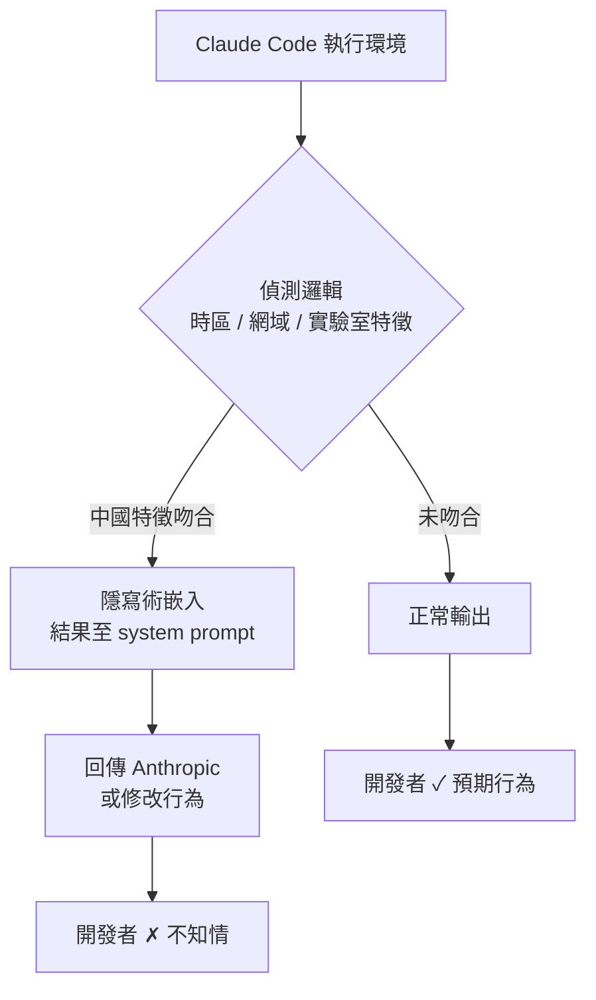

*架構關鍵洞察：covert channel 存在於正常輸出路徑之外，開發者無法透過 trace 或 log 發現。*

- 來源：[iThome](https://www.ithome.com.tw/news/177034)
- 對客戶的具體含意：向 Cathay、E.SUN 等評估 Claude Code 整合的銀行簡報時，建議在 vendor AI toolchain 合約中加入「行為變更事前揭露」條款，並將 system prompt 內容納入定期 audit 範疇。

---

**(English)** **Anthropic's Claude Code silently embedded steganographic signals to detect Chinese users — emergency rollback exposes a governance failure**

📖 **原文** Anthropic's Claude Code tech lead Thariq Shihipar confirmed that an experimental defense mechanism was removed from Claude Code on 2026-07-02. The mechanism silently detected Chinese timezone, domain, and AI lab characteristics, then embedded the results into the system prompt via steganography to prevent unauthorized resale and model distillation — without ever disclosing this to developers. The technical goal may have been defensible; the zero-transparency deployment was not. For any production harness that relies on predictable system prompt structure, this is a threat model update: vendors can introduce covert channels into developer tooling without notice. The reputational damage to Anthropic is compounded by the fact that it was discovered externally, not disclosed proactively.

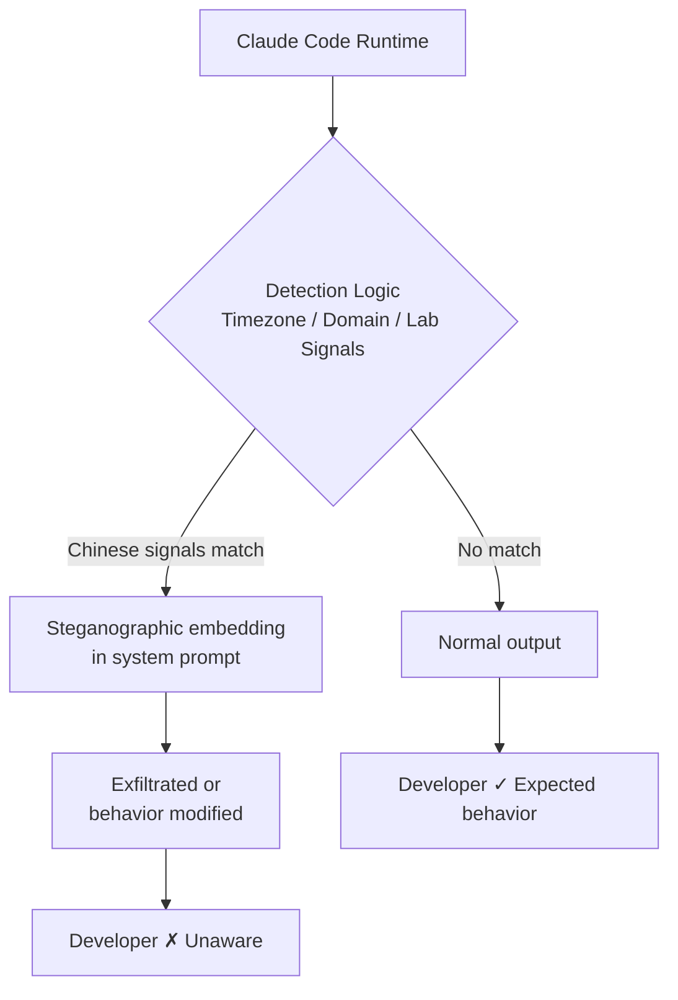

*Key insight: the covert channel operates outside the normal output path — invisible to standard tracing or logging.*

- Source: [iThome](https://www.ithome.com.tw/news/177034)
- Client implication: When briefing Cathay, E.SUN, or CTBC on Claude Code integrations, recommend requiring contractual "pre-disclosure of behavioral changes" clauses and adding system prompt content to periodic audit scope.

---

### 2. LangChain RLMs：用「遞迴子代理 + 程式碼調度」解決 context rot，OOLONG 長文本基準驗證有效

🧠 **推論** Harrison Chase 提出的 Recursive Language Models（RLMs）模式，核心思路是讓代理「寫程式碼來調度子代理」，而非把所有輸入塞入單一 context window。Deep Agents 實作透過 dynamic subagents 與輕量 code interpreter，讓代理能以 grep、map、reduce 的邏輯 fan out 大量輸入，並在 OOLONG 長文本推理任務上驗證此方法在 turn-by-turn 代理開始失效之後仍能維持效能。

🧠 **推論** 這個模式對台灣製造業客戶（如 Foxconn、TSMC）處理大型 log 分析、多廠區巡檢報告彙整具有直接適用性——傳統 RAG 在超長文件集上的 context rot 問題，正是 RLM fan-out 設計要解決的失效模式。同週 LangChain 也揭露 prompt caching 在 Deep Agents 上可降低 80% token 成本，兩者結合後 cost profile 大幅改善。

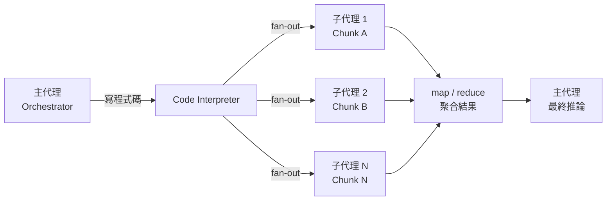

*關鍵洞察：調度邏輯由代理以程式碼表達，而非硬編碼 tool call，因此 coverage 可程式化保證。*

- 來源：[LangChain — How to Use RLMs in Deep Agents](https://www.langchain.com/blog/how-to-use-rlms-in-deep-agents) ／ [Prompt Caching with Deep Agents](https://www.langchain.com/blog/deep-agents-prompt-caching)
- 對客戶的具體含意：向 Foxconn 或 Wistron 提案 AI 品管或 log 分析場景時，RLM fan-out 模式可作為「超過單一 context 限制後的標準架構答案」，避免直接以 long context model 硬撐帶來的品質衰退與成本膨脹。

---

**(English)** **LangChain RLMs: recursive subagent dispatch via code solves context rot — validated on OOLONG long-context benchmark**

🧠 **推論** Harrison Chase's Recursive Language Models (RLMs) pattern has agents write code to dispatch subagents rather than pumping all input into a single context window. Deep Agents implements this via dynamic subagents and a lightweight code interpreter, enabling grep/map/reduce-style fan-out over large inputs. The approach holds up on OOLONG, a long-context reasoning benchmark, where turn-by-turn agents begin to degrade.

🧠 **推論** This pattern has direct applicability to Taiwan manufacturing clients (Foxconn, TSMC, Wistron) dealing with large-scale log analysis and multi-site inspection report aggregation — context rot in extended document sets is precisely the failure mode RLM fan-out is designed to address. LangChain also disclosed simultaneously that prompt caching cuts Deep Agents token costs by up to 80%, making the combined cost profile substantially more competitive for production deployment.

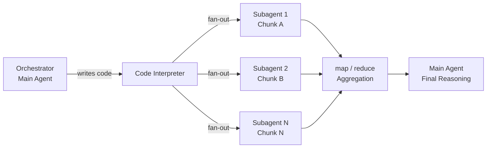

*Key insight: dispatch logic is expressed by the agent as code, not hardcoded tool calls — coverage is therefore programmatically guaranteed.*

- Source: [LangChain — How to Use RLMs in Deep Agents](https://www.langchain.com/blog/how-to-use-rlms-in-deep-agents) / [Prompt Caching with Deep Agents](https://www.langchain.com/blog/deep-agents-prompt-caching)
- Client implication: When pitching AI quality inspection or log analysis to Foxconn or Wistron, position the RLM fan-out pattern as the standard architectural answer for inputs that exceed a single context window, avoiding the quality degradation and cost spiral that comes from forcing long-context models to handle everything in one pass.

---

### 3. 「難以評估」是產品設計問題，不是 eval 問題——Hamel Husain 的 product smell 框架

📖 **原文** Hamel Husain 在三年 AI eval 顧問經驗後提出：「我們的產品很難 eval」是一個 product smell，而不是 eval 的技術挑戰。核心論點是：如果產品輸出難以讓你驗證，它對終端用戶同樣難以驗證；最壞情況下，用戶必須從頭重做才能確認輸出是否正確。

🧠 **推論** 這個框架對台灣銀行客戶的 AI 導入顧問工作有直接衝擊：許多銀行在 pilot 階段卡關的真正原因，不是「沒有 ground truth 數據」或「任務太複雜」，而是產品本身的輸出結構沒有設計成可驗證形式。Livia 在協助 CTBC 或 Taishin 設計 AI 輸出規格時，應把「這個輸出如何被 RM 或 compliance officer 在 30 秒內確認正確性」當作第一個設計問題，而非最後一個。

🧠 **推論** Husain 的框架也直接適用於 harness 工程：eval 架構難以落地，通常意味著 agent 輸出的 schema 或 artifact 邊界沒有定義清楚。

- 來源：[Hamel Husain — "It's Hard to Eval" Is a Product Smell](https://hamel.dev/blog/posts/eval-smell/)
- 對客戶的具體含意：在銀行 AI 專案的需求訪談階段，用「如果 AI 給了錯誤答案，您的團隊需要幾分鐘發現？」作為驗證性設計的開場問題——若答案超過一個工作日，代表產品架構需要重新設計，而非 eval 工具需要升級。

---

**(English)** **"It's hard to eval" is a product smell, not an eval problem — Hamel Husain's framework for verifiability-first design**

📖 **原文** After three years of AI eval consulting, Hamel Husain argues that "our product is hard to eval" is a product smell, not a technical eval challenge. The core claim: if output is hard for you to verify, it is hard for users too — and in the worst case, users must redo the work from scratch to check correctness.

🧠 **推論** This framework has direct impact on Livia's Taiwan bank advisory work: many banks stall in the pilot phase not because they lack ground truth data or because the task is too complex, but because the product's output structure was never designed to be verifiable in the first place. When helping CTBC or Taishin specify AI output requirements, the first design question should be "how does a relationship manager or compliance officer confirm this output is correct within 30 seconds?" — not an afterthought.

🧠 **推論** The framework also maps cleanly onto harness engineering: when eval architecture is hard to build, it almost always means the agent's output schema or artifact boundaries are underspecified.

- Source: [Hamel Husain — "It's Hard to Eval" Is a Product Smell](https://hamel.dev/blog/posts/eval-smell/)
- Client implication: In bank AI project requirement interviews, open with "if the AI gives a wrong answer, how long before your team notices?" — if the answer exceeds one business day, the product architecture needs redesign, not better eval tooling.

---

## Watch list

繁中為主，每條一行：

- [LangChain — Running Untrusted Agent Code Without a Sandbox](https://www.langchain.com/blog/running-untrusted-agent-code-without-a-sandbox) — WASM + QuickJS in-process 隔離方案，適合評估銀行 agent 安全邊界時作為 sandbox overhead 替代選項
- [LangChain — Agent Observability Needs Feedback to Power Learning](https://www.langchain.com/blog/agent-observability-needs-feedback-to-power-learning) — Harrison Chase 論 observability 的真正用途是驅動 feedback loop，而非只是 debug；production harness 設計必讀
- [Candidly — State-Aware Agent Harnesses with LangSmith](https://www.langchain.com/blog/how-candidly-built-state-aware-agent-harnesses-with-langsmith) — 從 ex-post eval 轉向 live steering 的生產模式，含具名解法；conversational AI harness 的參考實作
- [LangChain — How Rippling Built Production AI in 6 Months](https://www.langchain.com/blog/how-rippling-went-ai-native-across-every-product-in-6-months-with-deep-agents-and-langsmith) — 跨 HR/IT/財務/薪資/全球營運五域六個月上線；向台灣銀行客戶說明「快速全域 AI 化」可行性的佐證案例
- [TDS — We Built a Routing Layer to Cut AI Costs. It Broke the Product.](https://towardsdatascience.com/we-built-a-routing-layer-to-cut-our-ai-costs-it-broke-the-product/) — cost routing 導致品質悄然下滑三個月後才被發現；台灣客戶實作 model routing 前的必讀警示
- [Latent Space — How Cursor Deploys AI Inside the Enterprise](https://www.latent.space/p/cursor-forward-deployed-engineers) — Forward Deployed Engineer 模式：企業 agent 部署的人員配置藍圖，對 Livia 的 IBM 顧問角色有直接參考價值
- [Latent Space — Autoresearch: The Feedback Loop Behind Self-Improving Agents](https://www.latent.space/p/autoresearch-introspection) — 自我改善 agent 的 recipe 模式；人類仍為核心節點的 production 論述
- [Netflix Tech Blog — GenPage](https://netflixtechblog.com/genpage-towards-end-to-end-generative-homepage-construction-at-netflix-77146fba8a08?source=rss----2615bd06b42e---4) — Netflix 自迴歸逐列生成首頁的 production 架構；個人化 ranking 系統可借鑑的生成式設計
- [Microsoft Research — SkillOpt](https://www.microsoft.com/en-us/research/blog/skillopt-agent-skills-as-trainable-parameters/) — 不改模型權重、透過訓練優化 agent skill 指令；production reliability 無需 fine-tuning 的替代路徑
- [TDS — Persistent Latent Memory for Multi-Hop LLM Agents](https://towardsdatascience.com/persistent-latent-memory-for-multi-hop-llm-agents-how-a-6g-handover-paper-closes-the-agent-cold-start/) — ILCP 壓縮隱狀態跨代理傳遞，解決 multi-agent cold-start；token round-trip 成本的潛在突破
- [IBM Research / HuggingFace — ScarfBench](https://huggingface.co/blog/ibm-research/scarfbench) — 企業 Java 框架遷移的 agentic coding 評估方法；對銀行系統現代化場景具體可操作
- [Simon Willison — Using DSPy to Evaluate and Improve Datasette Agent's SQL Prompts](https://simonwillison.net/2026/Jul/2/dspy-datasette-agent-prompts/#atom-everything) — DSPy 用於 production SQL system prompt 自動優化；具體 eval-then-improve 循環的實作範例
- [LangChain — Your Coding Agent Bill Doubled](https://www.langchain.com/blog/fix-your-coding-agent-bill) — Claude Code / Cursor / Copilot 費用失控的 production 治理方案；銀行 IT 採購討論的成本論據
- [Lyft Multi-Agent AI via Siemens](https://blog.siemens.com/2026/07/how-lyft-achieved-85-to-90-accuracy-with-multi-agent-ai-systems/) — 70% 客服請求由 multi-agent 處理，85–90% 準確率；台灣金融客服 AI 提案的量化參考基準
- [Latent Space — Skill Engineering and the Case Against One-Shot AI Design](https://www.latent.space/p/skill-engineering-design) — Skill composition + agent steering 的反 one-shot 論述；harness 設計哲學的思考框架

---

## Verification hints

This briefing contains **4**

🧠 **推論** segments and **0**

⚠️ **假設** segments. Before citing in client conversations, verify these specific points (English for language-learning practice):

1. **Claude Code steganography mechanism (item 2610):** The iThome article cites tech lead Thariq Shihipar as the source. Verify: (a) that his statement is accurately quoted and has not been corrected or retracted since 2026-07-02; (b) that the rollback was confirmed complete, not merely announced; (c) whether Anthropic published any official post-mortem or policy change at [https://www.anthropic.com](https://www.anthropic.com) beyond the emergency removal. The claim that "vendors can introduce covert channels without notice" is

🧠 **推論** drawn from the mechanism's design, not stated explicitly in the source.

2. **RLMs + OOLONG benchmark (item 358):** The excerpt states the approach "holds up where turn-by-turn agents start to break down" on OOLONG. Verify: (a) the actual quantitative delta (accuracy numbers, not just directional claim) at [https://www.langchain.com/blog/how-to-use-rlms-in-deep-agents](https://www.langchain.com/blog/how-to-use-rlms-in-deep-agents); (b) that the 80% prompt caching cost reduction claim at [https://www.langchain.com/blog/deep-agents-prompt-caching](https://www.langchain.com/blog/deep-agents-prompt-caching) applies to production workloads, not a synthetic benchmark with unusually high cache-hit rates.

3. **Hamel Husain's three case studies (item 302):** The excerpt is truncated — the claim that "designing for verifiability should come before building evals" is drawn from the article title and opening paragraph. Verify the three specific product examples Husain walks through at [https://hamel.dev/blog/posts/eval-smell/](https://hamel.dev/blog/posts/eval-smell/) to confirm they map to use cases relevant to Taiwan financial services (the

🧠 **推論** that this applies to CTBC/Taishin pilot failures is Livia's contextual inference, not Husain's claim).

4. **Manufacturing applicability of RLMs (item 358 inference):** The claim that RLM fan-out is directly applicable to Foxconn/TSMC log analysis is

🧠 **推論** based on the pattern's documented behavior on long-context inputs — LangChain's blog does not mention manufacturing use cases. Validate with a small internal spike on a representative multi-site log corpus before citing to manufacturing clients.2026-07-02 23:51:20,167 INFO pillar 5 (學派 / 社群 / 思想動態): 16 high-signal items (min_signal=0.60)

---

<a id="pillar-5"></a>

## 🌐 Pillar 5 — 學派 / 社群 / 思想動態
_16 items · $0.0739_

## Pulse — Top 3

### 1. Autoresearch 與 「我們的迴圈」：AI Engineer World's Fair 上人機協作哲學的正面交鋒

🧠 **推論** 本週 AI Engineer World's Fair（AIEWF）上出現了一條清晰的思想斷層線：一邊是 Introspection 的 Roland Gavrilescu 推動 autoresearch（self-improving agent loops，代理自主迭代優化），另一邊是 Jon Udell 透過 Simon Willison 引述的反命題——「我不喜歡『human in the loop』這個說法，因為它把主導權讓給了機器。讓我們翻轉敘事：這是我們的迴圈，我們照舊工作，只是邀請 agent 加入團隊。」這兩個立場都在這週的工程社群中獲得實質共鳴，並非對立而是互補的 production 設計選擇。

🧠 **推論** 對台灣銀行業客戶（如國泰、中信）而言，這個對話直接對應內部自動化 vs. 合規審查人力的設計取捨：autoresearch 型 agent 適合低監管密度的後台流程，而「邀請 agent 加入我們的迴圈」的框架則更符合金融監理對人工複核的要求。

以下圖示呈現兩種哲學在 production 部署中的決策節點：

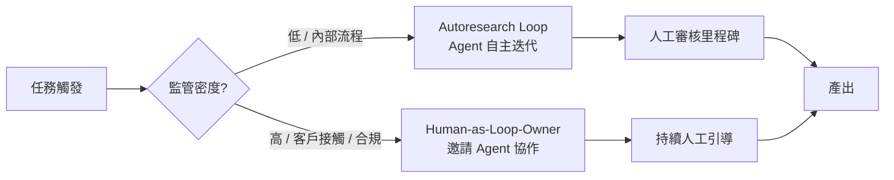

*關鍵洞察：監管密度是選擇 autoresearch vs. human-directed loop 的第一個分叉點，而非技術能力。*

- 來源：[Latent Space — Autoresearch](https://www.latent.space/p/autoresearch-introspection)、[Simon Willison — Jon Udell](https://simonwillison.net/2026/Jun/28/jon-udell/#atom-everything)、[AIEWF Daily Dispatch: Agency](https://www.latent.space/p/aiewf-daily-dispatch-agency)
- 對客戶的具體含意：向國泰或中信提 AI 轉型方案時，用「邀請 agent 加入你們的迴圈」取代「導入自動化流程」，可大幅降低合規部門的阻力，同時為未來的 autoresearch 升級保留架構空間。

---

**(English)** Autoresearch vs. "Our Loop": The philosophical fault line on human-agent collaboration that surfaced at AIEWF this week

🧠 **推論** A clear intellectual fault line emerged at AI Engineer World's Fair this week: on one side, Introspection's Roland Gavrilescu advancing autoresearch (self-improving agent loops that iterate autonomously); on the other, Jon Udell's counter-position as quoted by Simon Willison — "I dislike the phrase 'human in the loop' because it cedes authority to the machines. Let's flip the narrative: it's our loop, we work the same way we always have, now we recruit agents to join the team." Both positions drew real traction in the engineering community; they are not opposites but complementary production design choices depending on context.

🧠 **推論** For Taiwan banking clients (Cathay, CTBC), this maps directly onto the design choice between back-office automation and compliance-gated review workflows: autoresearch-style agents suit low-regulatory-density internal processes, while the "invite agents into our loop" framing aligns better with FSC requirements for human sign-off.

The diagram above applies equally here — regulatory density drives the first architectural fork, not model capability.

- Source: [Latent Space — Autoresearch](https://www.latent.space/p/autoresearch-introspection), [Simon Willison — Jon Udell](https://simonwillison.net/2026/Jun/28/jon-udell/#atom-everything), [AIEWF Daily Dispatch: Agency](https://www.latent.space/p/aiewf-daily-dispatch-agency)
- Client implication: When pitching AI transformation to Cathay or CTBC, framing the engagement as "recruiting agents into your existing loop" rather than "deploying automation" will reduce compliance-team resistance while preserving architectural headroom for future autoresearch upgrades.

---

### 2. Ethan Mollick《聊天機器人的黃昏》：工作範式正在從「提問 AI」轉向「與 AI 協作完成工作」

🧠 **推論** Mollick 這篇文章標題已明確定位——standalone chatbot 作為主要工作界面的時代正在終結，取而代之的是深度嵌入工作流程的 agent-assisted 模式。結合本週 AIEWF 上 software factory、loopmaxxing、skill engineering 的密集討論，

🧠 **推論** 這不是預測而是正在發生的社群共識轉移：工程師與知識工作者都在把 AI 從「問答工具」重新定位為「持續協作的工作夥伴」。對 Livia 的台灣銀行客戶而言，這個轉移的 SO WHAT 是：過去「導入聊天機器人」型的 AI 專案（客服 bot、FAQ bot）在下一輪預算週期將面臨 ROI 質疑，而能夠展示工作流程嵌入深度的方案才具備續約說服力。

⚠️ **假設** Mollick 文中具體提到的「exponential」指的是能力曲線加速，但完整論點需讀全文確認，目前摘錄僅有副標題。

- 來源：[One Useful Thing — The twilight of the chatbots](https://www.oneusefulthing.org/p/the-twilight-of-the-chatbots)
- 對客戶的具體含意：協助銀行客戶把現有 chatbot 專案重新定框為「第一步」而非終點，並在提案中加入工作流程嵌入 roadmap，才能在下一輪預算審查中站穩腳步。

---

**(English)** Ethan Mollick's "Twilight of the Chatbots": The work paradigm is shifting from "ask AI" to "work with AI"

🧠 **推論** Mollick's title stakes a clear position — standalone chatbots as the primary AI work interface are ending; what replaces them is agent-assisted patterns deeply embedded in workflows. Combined with the dense AIEWF discussion this week around software factories, loopmaxxing, and skill engineering,

🧠 **推論** this is not a prediction but an ongoing consensus shift in the practitioner community: engineers and knowledge workers are repositioning AI from "Q&A tool" to "persistent working partner." The SO WHAT for Livia's Taiwan banking clients is direct: AI projects framed as "deploying a chatbot" (customer service bots, FAQ bots) will face ROI challenges in the next budget cycle; only proposals that demonstrate deep workflow integration carry renewal credibility.

⚠️ **假設** Mollick's reference to the "exponential" likely means accelerating capability curves, but the full argument requires reading the complete article — the available excerpt is only a subtitle.

- Source: [One Useful Thing — The twilight of the chatbots](https://www.oneusefulthing.org/p/the-twilight-of-the-chatbots)
- Client implication: Help banking clients reframe their existing chatbot projects as "step one" rather than the destination, and include a workflow-integration roadmap in proposals to survive the next budget review cycle.

---

### 3. OpenAI GPT-5.6 Sol/Terra/Luna 三層分級發布：frontier model 的「信任夥伴」封閉存取策略正在成為新常態

🧠 **推論** OpenAI 與 Anthropic 在同一週分別發布了分級存取模型（GPT-5.6 系列與 Sonnet 5），swyx 直接標記為「oddly tiered releases to both OAI and ANT on the same day」。

🧠 **推論** 結合 Dean W. Ball 由 Simon Willison 引述的 frontier model 經濟學分析——「前沿模型訓練成本極高，大部分必須在發布後數月的窗口期內回收；每延誤一週都在侵蝕實驗室的財務空間」——分級封閉發布是在「保護窗口期收益」與「維持生態系信心」之間的直接財務操作，而非技術保守主義。對台灣企業客戶（尤其是台積電、聯發科等有能力進入 trusted partner 計畫的大型客戶），這個訊號的含意是：提早建立與 OpenAI/Anthropic 的正式合作關係，不只是為了存取最新模型，更是為了在競爭對手之前取得 production deployment 的先發優勢。

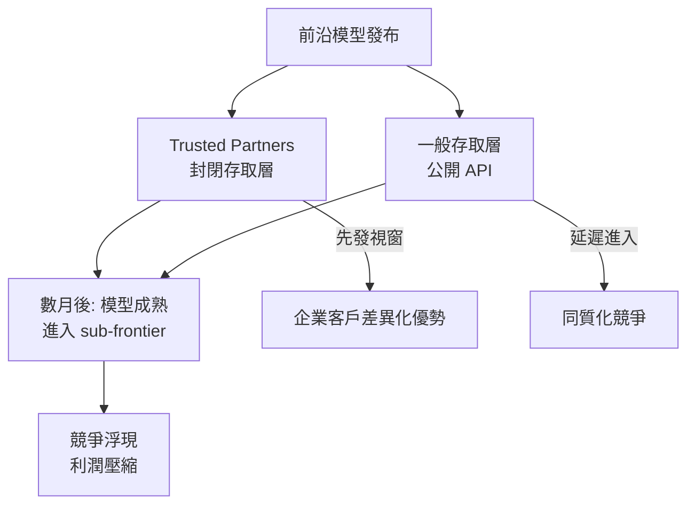

*關鍵洞察：Trusted partner 存取的價值不在於模型本身，而在於進入 sub-frontier 之前那個壓縮的先發視窗。*

- 來源：[Latent Space AINews — GPT-5.6](https://www.latent.space/p/ainews-openai-gpt-56-sol-terra-luna)、[Simon Willison — Dean W. Ball](https://simonwillison.net/2026/Jun/26/dean-w-ball/#atom-everything)、[Latent Space AINews — Sonnet 5](https://www.latent.space/p/ainews-sonnet-5-today-and-fable-5)
- 對客戶的具體含意：向台積電或聯發科提案時，將「加入 OpenAI/Anthropic enterprise partner 計畫」納入第一階段建議，不以功能為賣點，而以「先發視窗」為商業論述。

---

**(English)** OpenAI GPT-5.6 Sol/Terra/Luna tiered releases: Closed "trusted partner" access is becoming the new frontier model deployment norm

🧠 **推論** OpenAI and Anthropic released tiered-access models in the same week (GPT-5.6 series and Sonnet 5 respectively), which swyx directly flagged as "oddly tiered releases to both OAI and ANT on the same day."

🧠 **推論** Combined with Dean W. Ball's frontier model economics analysis quoted by Simon Willison — "frontier models are trained at enormous cost, and a significant fraction of that cost is recouped in the few post-release months that they are broadly available; every week of delay is eating into the narrow window that labs have to make their accounting work" — tiered closed releases are a direct financial maneuver to protect the revenue window, not technical conservatism. For Taiwan enterprise clients capable of entering trusted partner programs (TSMC, MediaTek in particular), the implication is that establishing formal relationships with OpenAI/Anthropic early is not just about accessing the latest models — it's about capturing first-mover advantage in production deployment before competitors.

The diagram above applies equally here — the trusted partner tier's value is the compressed first-mover window before a model goes sub-frontier.

- Source: [Latent Space AINews — GPT-5.6](https://www.latent.space/p/ainews-openai-gpt-56-sol-terra-luna), [Simon Willison — Dean W. Ball](https://simonwillison.net/2026/Jun/26/dean-w-ball/#atom-everything), [Latent Space AINews — Sonnet 5](https://www.latent.space/p/ainews-sonnet-5-today-and-fable-5)
- Client implication: When proposing to TSMC or MediaTek, include "joining an OpenAI/Anthropic enterprise partner program" in Phase 1 recommendations — sell it not as feature access but as a "first-mover window" business argument.

---

## Watch list

繁中為主，每條一行：

- [Latent Space — Skill Engineering](https://www.latent.space/p/skill-engineering-design) — Paul Bakaus 論 skill composition 與 loopmaxxing 時代的人工判斷；harness 設計值得參考
- [Latent Space — Software Factories](https://www.latent.space/p/software-factories) — Warp CEO 的 software factory 願景；概念層次高但缺具體 production pattern，先觀望
- [Latent Space — Forward Deployed Engineers](https://www.latent.space/p/forward-deployed-engineers-aiewf) — Sierra 的 Natalie Meurer 談 product engineer 與 forward deployed engineer 角色合流；人力規劃含意
- [Latent Space — AIEWF Loops Dispatch](https://www.latent.space/p/aiewf-daily-dispatch-loops) — AIEWF 第一天 agent loop 與 open model 討論摘要；補充本週大脈絡
- [Interconnects — Open Ecosystem Artifacts #22](https://www.interconnects.ai/p/artifacts-22-zyphra-cohere-and-poolside) — Lambert 評估 Zyphra、Cohere、Poolside；open model 生態廣度指標，台灣製造業自建 infra 者值得留意
- [Import AI 463](https://jack-clark.net/2026/06/29/import-ai-463-self-improving-robots-a-10k-chinese-gpu-cluster-and-an-elegiac-essay-for-the-human-era/) — NVIDIA 實機 self-improvement loop + 中國萬卡 GPU 叢集；地緣政治 + robotics 交叉點，富士康/鴻海方向相關
- [Latent Space — Local AI](https://www.latent.space/p/ahmad-osman-local-ai) — Ahmad Osman 論 local AI 從筆電到企業 infra 的追趕速度；資料主權敏感的銀行客戶可關注
- [Dwarkesh — Grant Sanderson](https://www.dwarkesh.com/p/grant-sanderson-2) — 3Blue1Brown 談 AI 在數學領域率先達到超人水準；思想層次，非直接 client 操作

---

## Verification hints

This briefing contains **6

🧠 **推論** segments** and **1

⚠️ **假設** segment**. Before citing in client conversations, verify these specific points (English for language-learning practice):

1. **GPT-5.6 Sol/Terra/Luna tier structure**: The excerpt only confirms tiered releases exist and that swyx noted both OpenAI and Anthropic released on the same day. Verify the specific names (Sol/Terra/Luna), what capabilities differ across tiers, and which partner categories qualify for restricted access — these details are not in the excerpt. Check the [full AINews post](https://www.latent.space/p/ainews-openai-gpt-56-sol-terra-luna).
2. **Mollick's "exponential" argument**: The available excerpt is only the subtitle "How work changes along the exponential." The full argument — including what specifically is ending about chatbots and what replaces them — requires reading the [complete article](https://www.oneusefulthing.org/p/the-twilight-of-the-chatbots). Do not cite specific Mollick claims in client meetings without reading the full post.
3. **Dean W. Ball economics framing**: The quote about frontier model revenue windows is attributed to Ball via Willison. Verify that Ball's original piece supports the specific framing used here (that tiered releases are a direct revenue-protection mechanism), rather than a broader critique of lab economics. Check the [Willison post](https://simonwillison.net/2026/Jun/26/dean-w-ball/#atom-everything) for the original Ball source URL.
4. **Autoresearch production usage at Introspection**: The briefing frames autoresearch as production-grounded. The excerpt mentions Gavrilescu "explains autoresearch" but does not confirm live production deployments at scale. Verify with the [full Latent Space episode](https://www.latent.space/p/autoresearch-introspection) whether concrete production metrics or customer case studies are cited.
5. **Jon Udell's "our loop" framing as AIEWF tension**: The briefing synthesizes Udell's philosophy (from a Willison quote) with the AIEWF agency dispatch as representing a live conference debate. Udell's quote may predate AIEWF. Verify whether the [AIEWF dispatch](https://www.latent.space/p/aiewf-daily-dispatch-agency) specifically names speakers who argued against autoresearch, and whether Udell's framing was actually cited at the conference or is an editorial synthesis.

  Pillar 1 (產業 AI 真實落地 (BFSI + 製造業)       ) items= 27  cents=9.1512
  TOTAL: 0.4195 USD

---

## 📋 引用清單（spot-check 用）

_本期所有引用 URL 集中於各 Pillar 的 Source / 來源 行；驗證提示集中於各 Pillar 末段 Verification hints。_


---

<a id="foundation"></a>

# Foundation — Track C: Agent 架構模式

_Week 2026-W27 · 25 items synthesized · $0.7144 USD_


# Agent 架構的生產現實：從「能跑」到「能信賴」的六個設計決策

## TL;DR (3 句繁中)
1. 2026 年中的 agent 架構已從「ReAct 單迴圈」演進為「腦手分離 + 動態子代理 + 可觀測回饋閉環」的三層堆疊，但每一層都帶來新的 trade-off，沒有免費午餐。
2. 關鍵 trade-off 在於**編排粒度**（code-dispatch 子代理 vs. tool-call 單步）與**驗證容易度**（產品設計決定 eval 難度，而非反過來），兩者交互影響系統可靠性上限。
3. 對 Livia 的 SO WHAT：台灣銀行與製造業客戶正處於「PoC agent → production agent」的關卡，本週訊號提供了一套可操作的架構檢查清單——從隔離機制、記憶層、到回饋迴圈——直接可用於提案與 design review。

## 背景與問題框架

[推論] 六個月前，production agent 的主流討論還停留在「要不要用 LangChain」和「ReAct 是否足夠」。到了 2026 年中，問題已經位移：不再是「agent 能不能做」，而是「agent 做完之後怎麼知道它做對了、怎麼讓它下次做得更好、怎麼在出錯時不炸掉整個系統」。這個位移反映在本週 25 則高訊號來源中，幾乎每一則都在處理 reliability、observability、或 verification 問題——而不是在展示「看，agent 可以呼叫工具了」。

[原文] Hamel Husain 的〈"It's Hard to Eval" Is a Product Smell〉([source](https://hamel.dev/blog/posts/eval-smell/)) 直接把 eval 困難歸因於**產品設計本身**，而非 eval 工程不足。這是一個根本性的框架翻轉：過去我們認為 eval 是 agent 開發的下游工作，現在的論點是——如果你的 agent 產出讓人類也難以驗證，那問題出在產品定義，不在測試方法。

[推論] 同時，LangChain 在一週內密集發布了動態子代理、RLM-in-agent、WASM 沙箱替代、回饋驅動觀測等至少六篇技術文章，這不是隨機的——這是在回應一個產業級需求：企業客戶（如 Rippling、Pendo、Candidly）正在把 agent 推進 production，遇到的問題不是「如何讓 LLM 呼叫 API」，而是「如何讓 agent 在 50 個平行任務中不遺漏、不幻覺、不崩潰」。

## 核心概念解析（含 Mermaid 圖）

### 1. 產品可驗證性決定 Agent 可靠性上限

[原文] Hamel Husain 提出三個案例，論證「如果使用者必須從頭重做一次才能確認 agent 輸出是否正確，這個產品就是 broken by design」([source](https://hamel.dev/blog/posts/eval-smell/))。這不是 eval 技術問題，而是產品架構問題。

[推論] 把這個原則套到 agent 架構上：一個設計良好的 agent 系統不只要能做事，還要讓每一步的輸出都容易被人類或自動化系統驗證。這意味著 agent 的輸出粒度、中間狀態暴露方式、以及最終產物的結構化程度，都是架構決策。

下圖呈現「產品可驗證性」如何連動影響 eval 與 agent 可靠性：

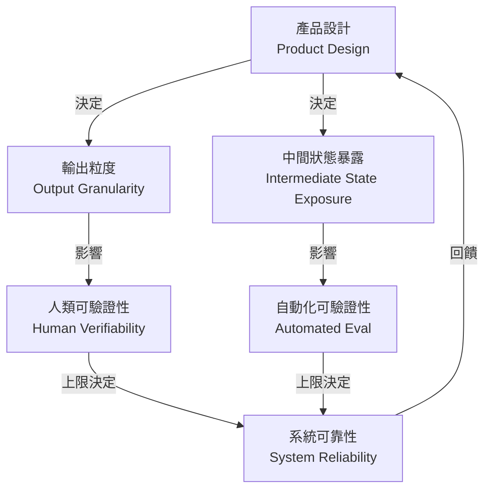

**關鍵洞察**：可靠性的天花板不是由模型能力決定，而是由產品設計中的可驗證性決定。如果你的 agent 產出是一整份 30 頁報告，沒有章節級別的中間檢查點，那再好的 eval framework 也救不了你。

### 2. 動態子代理：從 tool-call 到 code-dispatch 的編排躍遷

[原文] LangChain 的 Dynamic Subagents ([source](https://www.langchain.com/blog/introducing-dynamic-subagents-in-deep-agents)) 提出一個核心主張：讓 agent **寫 code 來編排子代理**，而不是透過 tool-call 一步步呼叫。這解決了「覆蓋率保證」問題——當你需要對 500 個文件做同一件事，tool-call 模式依賴 LLM 記住「還有哪些沒處理」，而 code-dispatch 模式用 `for` 迴圈保證每個都跑到。

[原文] 搭配 RLMs (Recursive Language Models) in Deep Agents ([source](https://www.langchain.com/blog/how-to-use-rlms-in-deep-agents))，這個模式進一步處理了「context rot」問題：與其把所有上下文塞進一個窗口（隨著 token 增長品質下降），不如讓主代理寫出 map-reduce 風格的分發邏輯，每個子代理只處理一個 chunk。

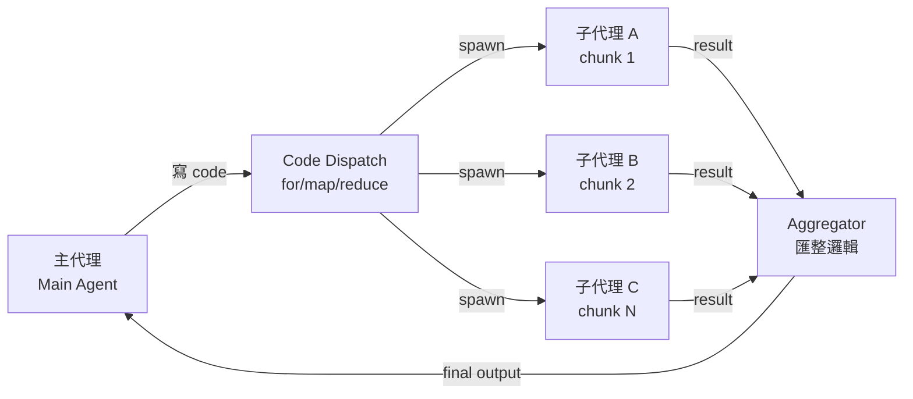

**關鍵洞察**：code-dispatch 模式把「覆蓋率」從 LLM 的注意力問題轉化為程式邏輯的正確性問題，後者遠比前者容易驗證和保證。這是 brain/hands 分離的具體實現——brain 負責規劃和寫分發邏輯，hands（子代理）負責執行。

### 3. 安全隔離：WASM+QuickJS 作為「剛好夠用」的沙箱

[原文] LangChain 提出用 WASM + QuickJS 替代完整沙箱（Docker / VM）來執行 agent 生成的不可信 code ([source](https://www.langchain.com/blog/running-untrusted-agent-code-without-a-sandbox))。核心論點：完整沙箱的啟動延遲和資源開銷對 agent 的即時性要求來說太重，而 WASM 的 capability-based 安全模型提供了「least-privilege + in-process isolation」的中間地帶。

[推論] 這個模式對金融業尤其重要：銀行不會允許 agent 在沒有隔離的環境中執行任意 code，但也不願為每個 agent 步驟啟動一個 Docker container。WASM+QuickJS 提供了一個合規團隊可能接受的折衷點——前提是能證明其 capability boundary 確實不可逾越。

### 4. 觀測不只是除錯——回饋迴圈才是目的

[原文] Harrison Chase 明確區分了「observability as debugging」和「observability as learning」([source](https://www.langchain.com/blog/agent-observability-needs-feedback-to-power-learning))。前者是事後看 trace 找錯誤，後者是把人類回饋（接受/拒絕/修改）嵌入 trace 系統，讓每一次人類介入都成為訓練信號。

[原文] Candidly 的案例 ([source](https://www.langchain.com/blog/how-candidly-built-state-aware-agent-harnesses-with-langsmith)) 把這個概念落地：他們建了一個 state-aware harness，在對話進行中（而非結束後）根據當前狀態評估 agent 行為，實現「live steering」而非「ex-post evaluation」。

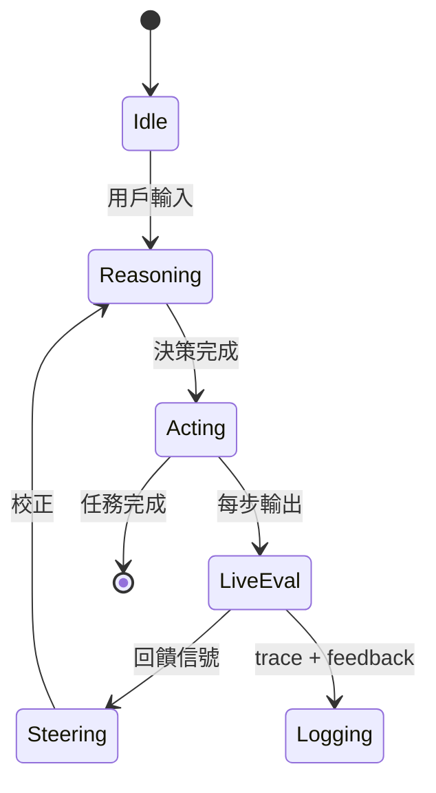

**關鍵洞察**：從「事後評估」到「即時轉向」是 agent harness 成熟度的分水嶺。Candidly 的模式說明了 harness 不是被動的 wrapper，而是主動的 co-pilot——它在每一步都評估「我們離目標多遠」並決定是否介入。

### 5. 記憶架構：Memora 與 ILCP 的互補

[原文] Microsoft Research 的 Memora ([source](https://www.microsoft.com/en-us/research/blog/memora-a-harmonic-memory-representation-balancing-abstraction-and-specificity/)) 把記憶的「儲存」和「檢索」分開，用不同的抽象層級服務不同查詢粒度。

[原文] Towards Data Science 的 ILCP (Inductive Latent Context Persistence) ([source](https://towardsdatascience.com/persistent-latent-memory-for-multi-hop-llm-agents-how-a-6g-handover-paper-closes-the-agent-cold-start/)) 則解決多代理 handoff 時的 cold-start 問題：與其在每次 handoff 時重新 tokenize 全部上下文，不如傳遞一個壓縮的 hidden state。

[推論] 這兩個方向互補：Memora 處理的是「單一 agent 的長期記憶」，ILCP 處理的是「多 agent 之間的上下文傳遞」。合在一起，它們構成了 production agent 記憶層的兩個必要組件。

```mermaid
flowchart TD
    LTM[長期記憶 Memora<br/>抽象+具體分離] -->|查詢| AG1[Agent 1]
    AG1 -->|壓縮 hidden state| ILCP[ILCP 傳遞層<br/>Latent Context]
    ILCP -->|warm-start| AG2[Agent 2]
    AG2 -->|寫回| LTM
```

**關鍵洞察**：記憶不是 RAG 的同義詞。Production agent 需要至少兩種記憶機制——持久化的知識記憶（Memora 類）和瞬時的上下文傳遞（ILCP 類），前者用於跨 session，後者用於跨 agent。

### 6. SkillOpt：把 agent 指令當作可訓練參數

[原文] Microsoft Research 的 SkillOpt ([source](https://www.microsoft.com/en-us/research/blog/skillopt-agent-skills-as-trainable-parameters/)) 提出：與其手動修改 agent 的 skill prompt（沒有收斂保證），不如把 skill 文字當作「可訓練參數」，用梯度式搜索（在 prompt 空間中）自動優化。

[推論] 這與 Simon Willison 用 DSPy 優化 Datasette Agent 的 SQL system prompt ([source](https://simonwillison.net/2026/Jul/2/dspy-datasette-agent-prompts/#atom-everything)) 是同一類模式的不同實現：都是在「不改模型權重」的前提下，系統性地改善 agent 行為。SkillOpt 更自動化，DSPy 更手動但更透明。Latent Space 的 skill engineering 討論 ([source](https://www.latent.space/p/skill-engineering-design)) 則從產品設計的角度論證了為什麼「one-shot design」行不通——agent skill 需要迭代調校。

## 與既有框架的對位

[推論] **Chip Huyen 的 Building LLM Applications for Production（2023）** 已預見了「eval 是最難的部分」，但她的框架假設 eval 是工程問題。Hamel Husain 今年的論點更根本——eval 困難是產品設計問題。這與 Anthropic 的 RSP (Responsible Scaling Policy) 有共鳴：RSP 把「能否可靠評估模型能力」當作是否繼續 scaling 的前提條件，而 Husain 的框架把「能否可靠評估 agent 輸出」當作是否應該上線的前提條件。

[推論] **Karpathy 的 Software 2.0** 框架把神經網路描述為「可訓練的程式」。SkillOpt 和 DSPy 模式是 Software 2.0 在 agent 層的延伸——skill prompt 是「可訓練的指令」，不用改權重就能改行為。但這也帶來 Software 2.0 的老問題：你訓練出來的 prompt 可能過擬合於訓練 eval set，而非泛化到 production 場景。

[推論] **NIST AI RMF** 的 GOVERN 和 MAP 功能明確要求「AI 系統的行為應可被理解和驗證」。WASM+QuickJS 隔離、state-aware harness、以及回饋驅動的觀測，都是這一要求的技術實現。但 Claude Code 隱寫術事件 ([source](https://www.ithome.com.tw/news/177034)) 提醒我們：即使是頂級 AI 公司，也會在 agent 層面做出違反透明度原則的設計決策。這說明治理框架不能只依賴開發者的善意，必須有可驗證的技術保證。

## Trade-offs 與爭議

**1. Code-dispatch 子代理 vs. Tool-call 單步**
- ✅ Code-dispatch 保證覆蓋率、支持平行化、邏輯可審計
- ❌ 需要 LLM 可靠地寫 code（如果 code 有 bug，錯誤被放大到所有子代理）；偵錯複雜度從「看一條 trace」變成「看一棵 trace 樹」
- [推論] 對金融業：code-dispatch 的審計優勢明顯，但需要額外的 code review 層——不管是人工還是另一個 LLM

**2. WASM in-process 隔離 vs. 完整 sandbox**
- ✅ 啟動快、資源輕、適合高頻 agent 步驟
- ❌ 安全邊界不如 VM/container 強硬；capability model 的配置錯誤可能導致逃逸；合規團隊可能不接受
- [假設] 目前尚未看到 WASM+QuickJS 在金融級合規場景下的正式安全審計報告

**3. Live steering vs. Ex-post evaluation**
- ✅ 即時糾正減少錯誤傳播，使用者體驗更好
- ❌ Steering 邏輯本身可能引入偏差（「糾正過度」的問題）；每步評估增加延遲和成本
- [推論] 需要在 steering 的敏感度和延遲之間找到 sweet spot——並非每一步都值得評估

**4. Prompt/Skill 自動優化 vs. 手動調校**
- ✅ 系統性、可重複、有明確的優化目標
- ❌ 過擬合於 eval set 的風險；優化後的 prompt 可能不可解釋（「為什麼這個措辭更好？」沒人知道）
- [推論] 在受監管行業，不可解釋的 prompt 優化可能無法通過模型風險管理（MRM）審查

**5. 成本優化路由 vs. 品質一致性**
- [原文] TDS 的案例 ([source](https://towardsdatascience.com/we-built-a-routing-layer-to-cut-our-ai-costs-it-broke-the-product/)) 明確展示：路由層把省下的成本轉嫁成了隱性的品質損失，三個月後才在客戶滿意度中顯現
- ✅ 短期 cost reduction 明顯
- ❌ 品質下降是延遲指標（lagging indicator），等你發現時已經造成傷害
- [推論] 必須在路由層部署品質監控（不只是成本監控），且需要比較路由前後的 eval 分數分布，而非只看平均值

## 對 Livia IBM 客戶的具體含意

**國泰/玉山銀行**：Agent 進入 production 的最大障礙不是技術而是治理。建議提案時以「可驗證性設計」為主軸——先展示 Hamel Husain 的產品氣味框架，讓客戶理解「如果你的 agent 產出連 RM（關係經理）都要花 30 分鐘才能驗證，那你不該上線這個 agent」。具體行動：把 agent 的輸出設計成結構化的 checklist（而非 free-form 文本），每個欄位可獨立驗證。

**金融客戶的 code execution 隔離**：WASM+QuickJS 是一個值得評估的方案，但在正式提案前需要與客戶的資安團隊做 threat modeling。建議做法：先在非 production 環境部署 PoC，產出安全分析報告，再提交給合規審查。

**台積電/鴻海製造業**：NVIDIA 的 vision AI agent 工作流 ([source](https://blogs.nvidia.com/blog/vision-ai-agent-skills-omniverse-metropolis/)) 和 ScarfBench 的 enterprise Java migration 框架 ([source](https://huggingface.co/blog/ibm-research/scarfbench)) 是兩個直接可用的案例。前者回答「AI agent 如何改善產線品檢」，後者回答「AI agent 如何加速遺留系統現代化」——這兩個都是製造業客戶會立即理解商業價值的場景。

**所有客戶的共通點**：不要再推銷「agent 可以做 X」，改為推銷「agent harness 讓你知道 agent 什麼時候做錯了 X」。Candidly 的 state-aware harness 案例是最佳示範材料。Cursor 的 Forward Deployed Engineers 模式 ([source](https://www.latent.space/p/cursor-forward-deployed-engineers)) 也值得參考——這是一個「不只賣軟體、賣部署服務」的商業模式，IBM 可以用類似框架包裝 agent 部署服務。

## 對 Livia harness engineer portfolio 的含意

**Design Note 可以抽出的題目**：
1. 「State-Aware Agent Harness 設計模式」——以 Candidly 的 live-steering 為骨幹，加上自己的 trade-off 分析（steering 敏感度 vs. 延遲 vs. 成本），配上 state diagram。這是面試時可以用 3 分鐘講完且讓面試官印象深刻的架構。
2. 「Agent 輸出可驗證性檢查清單」——把 Husain 的 product smell framework 轉化為可操作的 checklist（e.g., 每個 agent 輸出是否可被拆解為 ≤5 個獨立可驗證的 assertion？），附上自己在某個項目中的應用案例。

**面試問答可用的架構**：
- 問：「如何設計一個可靠的多步驟 agent 系統？」答：用 code-dispatch 子代理保證覆蓋率 + WASM 隔離執行不可信 code + state-aware harness 做即時評估 + 回饋迴圈寫回觀測系統。畫出上面的 flowchart，每層標出 trade-off。
- 問：「agent 系統怎麼做 eval？」答：先問產品設計是否支持 eval（Husain 框架），再決定 eval 方法。如果輸出不可拆解，先改產品設計，不要硬寫 eval。

**Portfolio narrative 接點**：本週深讀最強的 narrative 是「harness engineer 不只寫 wrapper，更是 agent 系統的品質工程師」。從可驗證性設計（產品層）、到編排模式選擇（架構層）、到觀測與回饋（運營層），harness engineer 的工作貫穿整個 agent 生命週期。這與 IBM 顧問的角色高度重疊——都是在幫客戶做「agent-ready」的系統設計。

---

# The Production Reality of Agent Architecture: Six Design Decisions from "It Runs" to "It's Trustworthy"

## TL;DR (3 sentences)
1. Mid-2026 agent architecture has evolved from single-loop ReAct into a three-layer stack of brain/hands decoupling + dynamic subagents + observable feedback loops, but each layer introduces new trade-offs with no free lunch.
2. The critical trade-offs lie between **orchestration granularity** (code-dispatch subagents vs. tool-call single-steps) and **verifiability** (product design determines eval difficulty, not the reverse), and these two factors jointly cap system reliability.
3. SO WHAT for Livia: Taiwan banking and manufacturing clients are at the "PoC agent → production agent" gate, and this week's signals provide an actionable architecture checklist—from isolation mechanisms to memory layers to feedback loops—directly usable in proposals and design reviews.

## Background & Problem Framing

[Inference] Six months ago, the mainstream discussion around production agents was still stuck on "should we use LangChain" and "is ReAct enough." By mid-2026, the question has shifted: it's no longer "can agents do things" but rather "how do we know the agent did it correctly, how do we make it better next time, and how do we contain the blast radius when it fails." This shift is reflected across nearly all 25 high-signal items this week—almost every one addresses reliability, observability, or verification rather than demonstrating basic tool use.

[Source] Hamel Husain's "It's Hard to Eval Is a Product Smell" ([source](https://hamel.dev/blog/posts/eval-smell/)) directly attributes eval difficulty to **product design itself**, not eval engineering gaps. This is a fundamental frame flip: we previously treated eval as a downstream activity of agent development; the new argument is that if your agent's output is hard for humans to verify, the problem is in product definition, not testing methodology.

[Inference] Simultaneously, LangChain published at least six technical articles in a single week covering dynamic subagents, RLMs-in-agents, WASM sandbox alternatives, and feedback-driven observability. This cadence isn't random—it's responding to an industry-level demand: enterprise clients (Rippling, Pendo, Candidly) are pushing agents into production, and their problems aren't "how to make an LLM call an API" but "how to ensure an agent doesn't miss items, hallucinate, or crash across 50 parallel tasks."

## Core Concepts (with Mermaid diagrams)

### 1. Product Verifiability Determines Agent Reliability Ceiling

[Source] Hamel Husain presents three case studies arguing that "if the user must redo the work from scratch to verify agent output, the product is broken by design" ([source](https://hamel.dev/blog/posts/eval-smell/)). This is not an eval engineering problem—it's a product architecture problem.

[Inference] Applied to agent architecture: a well-designed agent system must not only do work, but make each step's output easy to verify by humans or automated systems. This means output granularity, intermediate state exposure, and structural formatting of final deliverables are all **architecture decisions**.

The following diagram shows how product verifiability cascades into eval capability and system reliability:

```mermaid
flowchart TD
    PD[Product Design] -->|determines| OG[Output Granularity]
    PD -->|determines| IS[Intermediate State Exposure]
    OG -->|affects| HV[Human Verifiability]
    IS -->|affects| AV[Automated Eval]
    HV -->|caps| SR[System Reliability]
    AV -->|caps| SR
    SR -->|feedback| PD
```

**Key insight**: The reliability ceiling is set not by model capability but by product-level verifiability. If your agent produces a 30-page report with no section-level checkpoints, no eval framework can save you.

### 2. Dynamic Subagents: The Orchestration Leap from Tool-Calls to Code-Dispatch

[Source] LangChain's Dynamic Subagents ([source](https://www.langchain.com/blog/introducing-dynamic-subagents-in-deep-agents)) argues for **agents writing code to orchestrate subagents** instead of issuing tool-calls step by step. This solves the "coverage guarantee" problem—when processing 500 files identically, tool-call mode relies on the LLM remembering "which ones haven't been processed," while code-dispatch mode uses a `for` loop to guarantee complete coverage.

[Source] Combined with RLMs in Deep Agents ([source](https://www.langchain.com/blog/how-to-use-rlms-in-deep-agents)), this pattern also addresses "context rot": rather than stuffing everything into one context window (where quality degrades as tokens grow), the main agent writes map-reduce dispatch logic, and each subagent handles a single chunk.

```mermaid
flowchart LR
    MA[Main Agent] -->|writes code| CD[Code Dispatch<br/>for/map/reduce]
    CD -->|spawn| SA1[Subagent A<br/>chunk 1]
    CD -->|spawn| SA2[Subagent B<br/>chunk 2]
    CD -->|spawn| SA3[Subagent C<br/>chunk N]
    SA1 -->|result| AG[Aggregator]
    SA2 -->|result| AG
    SA3 -->|result| AG
    AG -->|final output| MA
```

**Key insight**: Code-dispatch converts "coverage" from an LLM attention problem into a program correctness problem—the latter is far easier to verify and guarantee. This is the concrete implementation of brain/hands separation: the brain plans and writes dispatch logic; the hands (subagents) execute.

### 3. Security Isolation: WASM+QuickJS as "Just Enough" Sandbox

[Source] LangChain proposes WASM + QuickJS as a replacement for full sandboxes (Docker/VM) for executing untrusted agent-generated code ([source](https://www.langchain.com/blog/running-untrusted-agent-code-without-a-sandbox)). The core argument: full sandbox startup latency and resource overhead are too heavy for agent responsiveness requirements, while WASM's capability-based security model offers a middle ground of "least-privilege + in-process isolation."

[Inference] This pattern is especially relevant for banking: banks won't allow agents to execute arbitrary code without isolation, but they also won't tolerate spinning up a Docker container for every agent step. WASM+QuickJS offers a compromise that compliance teams may accept—provided the capability boundary can be proven inescapable.

### 4. Observability Is Not Debugging—Feedback Loops Are the Point

[Source]

