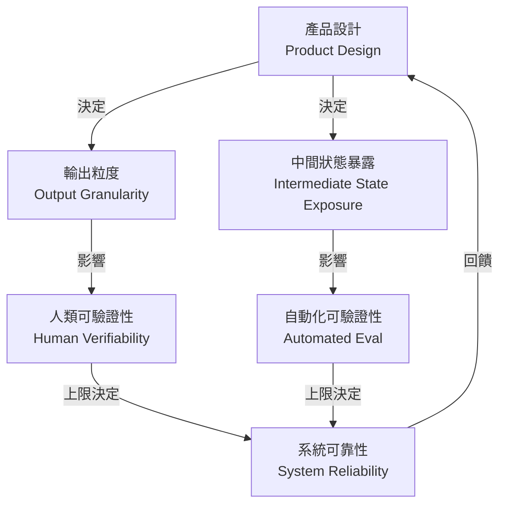
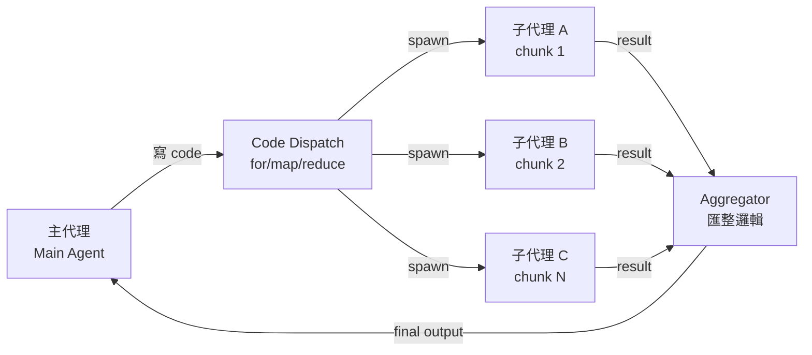
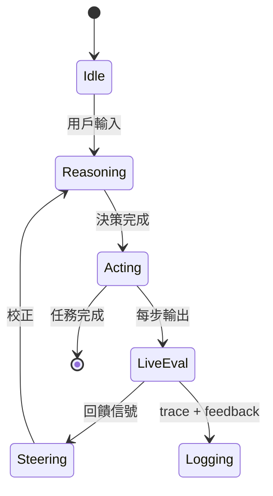
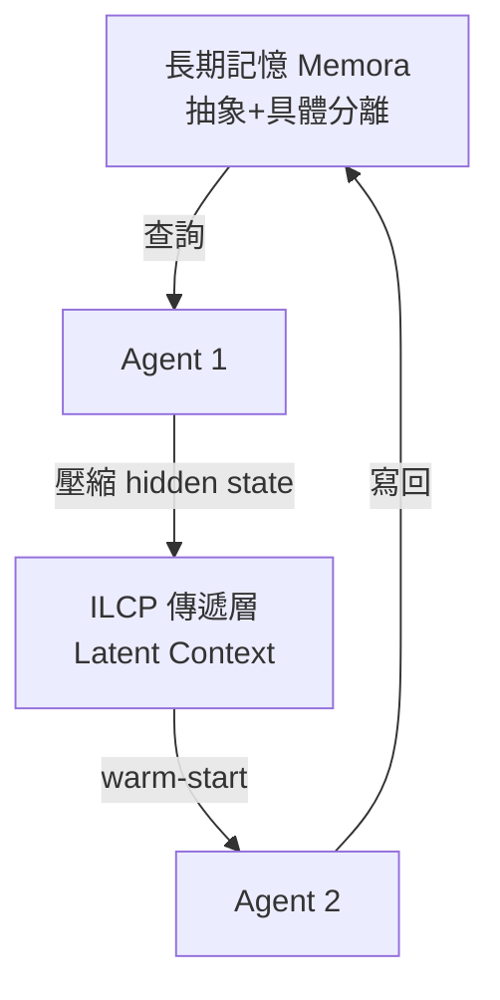
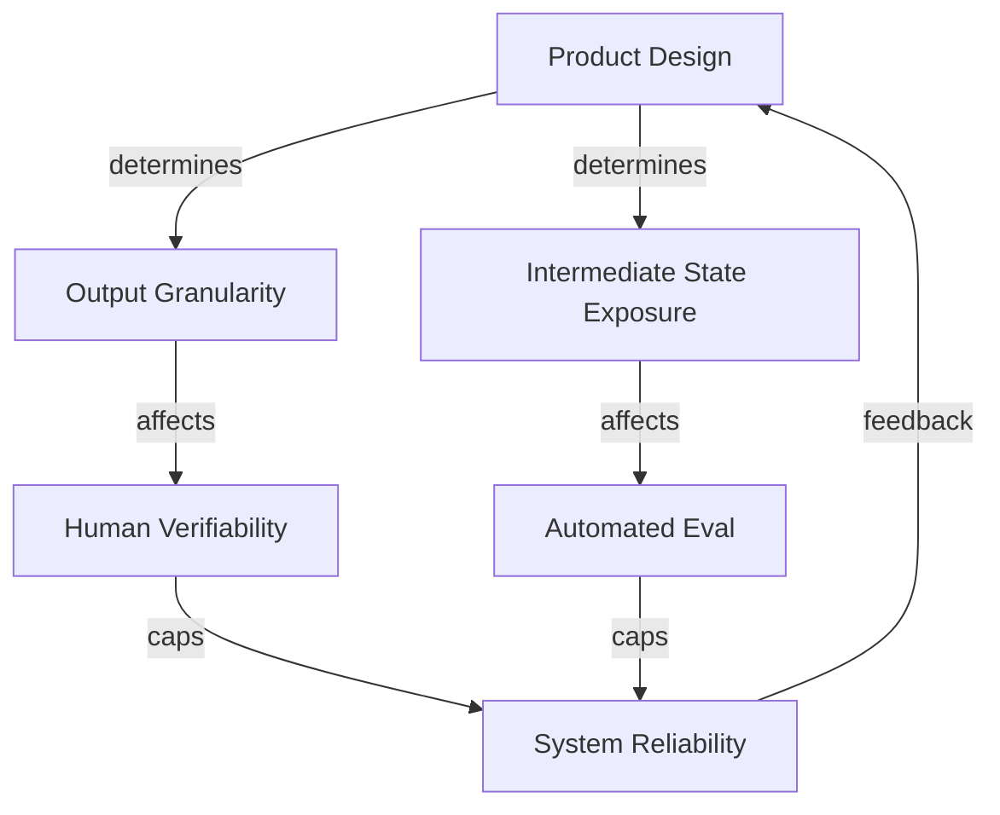
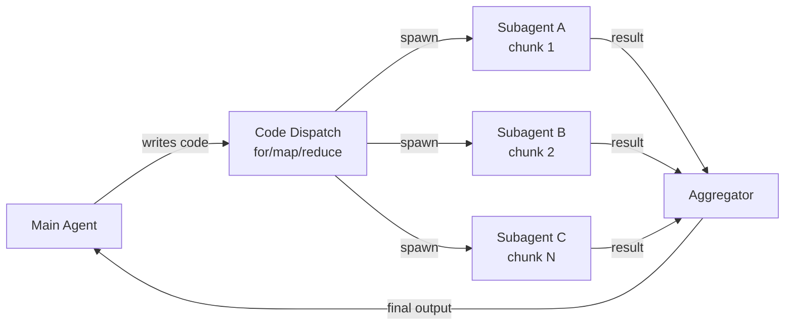

# Foundation — Track C: Agent 架構模式

_Week 2026-W27 · 25 items synthesized · $0.7144 USD_

# Agent 架構的生產現實：從「能跑」到「能信賴」的六個設計決策

## TL;DR (3 句繁中)
1. 2026 年中的 agent 架構已從「ReAct 單迴圈」演進為「腦手分離 + 動態子代理 + 可觀測回饋閉環」的三層堆疊，但每一層都帶來新的 trade-off，沒有免費午餐。
2. 關鍵 trade-off 在於**編排粒度**（code-dispatch 子代理 vs. tool-call 單步）與**驗證容易度**（產品設計決定 eval 難度，而非反過來），兩者交互影響系統可靠性上限。
3. 對 Livia 的 SO WHAT：台灣銀行與製造業客戶正處於「PoC agent → production agent」的關卡，本週訊號提供了一套可操作的架構檢查清單——從隔離機制、記憶層、到回饋迴圈——直接可用於提案與 design review。

## 背景與問題框架

[推論] 六個月前，production agent 的主流討論還停留在「要不要用 LangChain」和「ReAct 是否足夠」。到了 2026 年中，問題已經位移：不再是「agent 能不能做」，而是「agent 做完之後怎麼知道它做對了、怎麼讓它下次做得更好、怎麼在出錯時不炸掉整個系統」。這個位移反映在本週 25 則高訊號來源中，幾乎每一則都在處理 reliability、observability、或 verification 問題——而不是在展示「看，agent 可以呼叫工具了」。

[原文] Hamel Husain 的〈"It's Hard to Eval" Is a Product Smell〉([source](https://hamel.dev/blog/posts/eval-smell/)) 直接把 eval 困難歸因於**產品設計本身**，而非 eval 工程不足。這是一個根本性的框架翻轉：過去我們認為 eval 是 agent 開發的下游工作，現在的論點是——如果你的 agent 產出讓人類也難以驗證，那問題出在產品定義，不在測試方法。

[推論] 同時，LangChain 在一週內密集發布了動態子代理、RLM-in-agent、WASM 沙箱替代、回饋驅動觀測等至少六篇技術文章，這不是隨機的——這是在回應一個產業級需求：企業客戶（如 Rippling、Pendo、Candidly）正在把 agent 推進 production，遇到的問題不是「如何讓 LLM 呼叫 API」，而是「如何讓 agent 在 50 個平行任務中不遺漏、不幻覺、不崩潰」。

## 核心概念解析（含 Mermaid 圖）

### 1. 產品可驗證性決定 Agent 可靠性上限

[原文] Hamel Husain 提出三個案例，論證「如果使用者必須從頭重做一次才能確認 agent 輸出是否正確，這個產品就是 broken by design」([source](https://hamel.dev/blog/posts/eval-smell/))。這不是 eval 技術問題，而是產品架構問題。

[推論] 把這個原則套到 agent 架構上：一個設計良好的 agent 系統不只要能做事，還要讓每一步的輸出都容易被人類或自動化系統驗證。這意味著 agent 的輸出粒度、中間狀態暴露方式、以及最終產物的結構化程度，都是架構決策。

下圖呈現「產品可驗證性」如何連動影響 eval 與 agent 可靠性：

**關鍵洞察**：可靠性的天花板不是由模型能力決定，而是由產品設計中的可驗證性決定。如果你的 agent 產出是一整份 30 頁報告，沒有章節級別的中間檢查點，那再好的 eval framework 也救不了你。

### 2. 動態子代理：從 tool-call 到 code-dispatch 的編排躍遷

[原文] LangChain 的 Dynamic Subagents ([source](https://www.langchain.com/blog/introducing-dynamic-subagents-in-deep-agents)) 提出一個核心主張：讓 agent **寫 code 來編排子代理**，而不是透過 tool-call 一步步呼叫。這解決了「覆蓋率保證」問題——當你需要對 500 個文件做同一件事，tool-call 模式依賴 LLM 記住「還有哪些沒處理」，而 code-dispatch 模式用 `for` 迴圈保證每個都跑到。

[原文] 搭配 RLMs (Recursive Language Models) in Deep Agents ([source](https://www.langchain.com/blog/how-to-use-rlms-in-deep-agents))，這個模式進一步處理了「context rot」問題：與其把所有上下文塞進一個窗口（隨著 token 增長品質下降），不如讓主代理寫出 map-reduce 風格的分發邏輯，每個子代理只處理一個 chunk。

**關鍵洞察**：code-dispatch 模式把「覆蓋率」從 LLM 的注意力問題轉化為程式邏輯的正確性問題，後者遠比前者容易驗證和保證。這是 brain/hands 分離的具體實現——brain 負責規劃和寫分發邏輯，hands（子代理）負責執行。

### 3. 安全隔離：WASM+QuickJS 作為「剛好夠用」的沙箱

[原文] LangChain 提出用 WASM + QuickJS 替代完整沙箱（Docker / VM）來執行 agent 生成的不可信 code ([source](https://www.langchain.com/blog/running-untrusted-agent-code-without-a-sandbox))。核心論點：完整沙箱的啟動延遲和資源開銷對 agent 的即時性要求來說太重，而 WASM 的 capability-based 安全模型提供了「least-privilege + in-process isolation」的中間地帶。

[推論] 這個模式對金融業尤其重要：銀行不會允許 agent 在沒有隔離的環境中執行任意 code，但也不願為每個 agent 步驟啟動一個 Docker container。WASM+QuickJS 提供了一個合規團隊可能接受的折衷點——前提是能證明其 capability boundary 確實不可逾越。

### 4. 觀測不只是除錯——回饋迴圈才是目的

[原文] Harrison Chase 明確區分了「observability as debugging」和「observability as learning」([source](https://www.langchain.com/blog/agent-observability-needs-feedback-to-power-learning))。前者是事後看 trace 找錯誤，後者是把人類回饋（接受/拒絕/修改）嵌入 trace 系統，讓每一次人類介入都成為訓練信號。

[原文] Candidly 的案例 ([source](https://www.langchain.com/blog/how-candidly-built-state-aware-agent-harnesses-with-langsmith)) 把這個概念落地：他們建了一個 state-aware harness，在對話進行中（而非結束後）根據當前狀態評估 agent 行為，實現「live steering」而非「ex-post evaluation」。

**關鍵洞察**：從「事後評估」到「即時轉向」是 agent harness 成熟度的分水嶺。Candidly 的模式說明了 harness 不是被動的 wrapper，而是主動的 co-pilot——它在每一步都評估「我們離目標多遠」並決定是否介入。

### 5. 記憶架構：Memora 與 ILCP 的互補

[原文] Microsoft Research 的 Memora ([source](https://www.microsoft.com/en-us/research/blog/memora-a-harmonic-memory-representation-balancing-abstraction-and-specificity/)) 把記憶的「儲存」和「檢索」分開，用不同的抽象層級服務不同查詢粒度。

[原文] Towards Data Science 的 ILCP (Inductive Latent Context Persistence) ([source](https://towardsdatascience.com/persistent-latent-memory-for-multi-hop-llm-agents-how-a-6g-handover-paper-closes-the-agent-cold-start/)) 則解決多代理 handoff 時的 cold-start 問題：與其在每次 handoff 時重新 tokenize 全部上下文，不如傳遞一個壓縮的 hidden state。

[推論] 這兩個方向互補：Memora 處理的是「單一 agent 的長期記憶」，ILCP 處理的是「多 agent 之間的上下文傳遞」。合在一起，它們構成了 production agent 記憶層的兩個必要組件。

**關鍵洞察**：記憶不是 RAG 的同義詞。Production agent 需要至少兩種記憶機制——持久化的知識記憶（Memora 類）和瞬時的上下文傳遞（ILCP 類），前者用於跨 session，後者用於跨 agent。

### 6. SkillOpt：把 agent 指令當作可訓練參數

[原文] Microsoft Research 的 SkillOpt ([source](https://www.microsoft.com/en-us/research/blog/skillopt-agent-skills-as-trainable-parameters/)) 提出：與其手動修改 agent 的 skill prompt（沒有收斂保證），不如把 skill 文字當作「可訓練參數」，用梯度式搜索（在 prompt 空間中）自動優化。

[推論] 這與 Simon Willison 用 DSPy 優化 Datasette Agent 的 SQL system prompt ([source](https://simonwillison.net/2026/Jul/2/dspy-datasette-agent-prompts/#atom-everything)) 是同一類模式的不同實現：都是在「不改模型權重」的前提下，系統性地改善 agent 行為。SkillOpt 更自動化，DSPy 更手動但更透明。Latent Space 的 skill engineering 討論 ([source](https://www.latent.space/p/skill-engineering-design)) 則從產品設計的角度論證了為什麼「one-shot design」行不通——agent skill 需要迭代調校。

## 與既有框架的對位

[推論] **Chip Huyen 的 Building LLM Applications for Production（2023）** 已預見了「eval 是最難的部分」，但她的框架假設 eval 是工程問題。Hamel Husain 今年的論點更根本——eval 困難是產品設計問題。這與 Anthropic 的 RSP (Responsible Scaling Policy) 有共鳴：RSP 把「能否可靠評估模型能力」當作是否繼續 scaling 的前提條件，而 Husain 的框架把「能否可靠評估 agent 輸出」當作是否應該上線的前提條件。

[推論] **Karpathy 的 Software 2.0** 框架把神經網路描述為「可訓練的程式」。SkillOpt 和 DSPy 模式是 Software 2.0 在 agent 層的延伸——skill prompt 是「可訓練的指令」，不用改權重就能改行為。但這也帶來 Software 2.0 的老問題：你訓練出來的 prompt 可能過擬合於訓練 eval set，而非泛化到 production 場景。

[推論] **NIST AI RMF** 的 GOVERN 和 MAP 功能明確要求「AI 系統的行為應可被理解和驗證」。WASM+QuickJS 隔離、state-aware harness、以及回饋驅動的觀測，都是這一要求的技術實現。但 Claude Code 隱寫術事件 ([source](https://www.ithome.com.tw/news/177034)) 提醒我們：即使是頂級 AI 公司，也會在 agent 層面做出違反透明度原則的設計決策。這說明治理框架不能只依賴開發者的善意，必須有可驗證的技術保證。

## Trade-offs 與爭議

**1. Code-dispatch 子代理 vs. Tool-call 單步**
- ✅ Code-dispatch 保證覆蓋率、支持平行化、邏輯可審計
- ❌ 需要 LLM 可靠地寫 code（如果 code 有 bug，錯誤被放大到所有子代理）；偵錯複雜度從「看一條 trace」變成「看一棵 trace 樹」
- [推論] 對金融業：code-dispatch 的審計優勢明顯，但需要額外的 code review 層——不管是人工還是另一個 LLM

**2. WASM in-process 隔離 vs. 完整 sandbox**
- ✅ 啟動快、資源輕、適合高頻 agent 步驟
- ❌ 安全邊界不如 VM/container 強硬；capability model 的配置錯誤可能導致逃逸；合規團隊可能不接受
- [假設] 目前尚未看到 WASM+QuickJS 在金融級合規場景下的正式安全審計報告

**3. Live steering vs. Ex-post evaluation**
- ✅ 即時糾正減少錯誤傳播，使用者體驗更好
- ❌ Steering 邏輯本身可能引入偏差（「糾正過度」的問題）；每步評估增加延遲和成本
- [推論] 需要在 steering 的敏感度和延遲之間找到 sweet spot——並非每一步都值得評估

**4. Prompt/Skill 自動優化 vs. 手動調校**
- ✅ 系統性、可重複、有明確的優化目標
- ❌ 過擬合於 eval set 的風險；優化後的 prompt 可能不可解釋（「為什麼這個措辭更好？」沒人知道）
- [推論] 在受監管行業，不可解釋的 prompt 優化可能無法通過模型風險管理（MRM）審查

**5. 成本優化路由 vs. 品質一致性**
- [原文] TDS 的案例 ([source](https://towardsdatascience.com/we-built-a-routing-layer-to-cut-our-ai-costs-it-broke-the-product/)) 明確展示：路由層把省下的成本轉嫁成了隱性的品質損失，三個月後才在客戶滿意度中顯現
- ✅ 短期 cost reduction 明顯
- ❌ 品質下降是延遲指標（lagging indicator），等你發現時已經造成傷害
- [推論] 必須在路由層部署品質監控（不只是成本監控），且需要比較路由前後的 eval 分數分布，而非只看平均值

## 對 Livia IBM 客戶的具體含意

**國泰/玉山銀行**：Agent 進入 production 的最大障礙不是技術而是治理。建議提案時以「可驗證性設計」為主軸——先展示 Hamel Husain 的產品氣味框架，讓客戶理解「如果你的 agent 產出連 RM（關係經理）都要花 30 分鐘才能驗證，那你不該上線這個 agent」。具體行動：把 agent 的輸出設計成結構化的 checklist（而非 free-form 文本），每個欄位可獨立驗證。

**金融客戶的 code execution 隔離**：WASM+QuickJS 是一個值得評估的方案，但在正式提案前需要與客戶的資安團隊做 threat modeling。建議做法：先在非 production 環境部署 PoC，產出安全分析報告，再提交給合規審查。

**台積電/鴻海製造業**：NVIDIA 的 vision AI agent 工作流 ([source](https://blogs.nvidia.com/blog/vision-ai-agent-skills-omniverse-metropolis/)) 和 ScarfBench 的 enterprise Java migration 框架 ([source](https://huggingface.co/blog/ibm-research/scarfbench)) 是兩個直接可用的案例。前者回答「AI agent 如何改善產線品檢」，後者回答「AI agent 如何加速遺留系統現代化」——這兩個都是製造業客戶會立即理解商業價值的場景。

**所有客戶的共通點**：不要再推銷「agent 可以做 X」，改為推銷「agent harness 讓你知道 agent 什麼時候做錯了 X」。Candidly 的 state-aware harness 案例是最佳示範材料。Cursor 的 Forward Deployed Engineers 模式 ([source](https://www.latent.space/p/cursor-forward-deployed-engineers)) 也值得參考——這是一個「不只賣軟體、賣部署服務」的商業模式，IBM 可以用類似框架包裝 agent 部署服務。

## 對 Livia harness engineer portfolio 的含意

**Design Note 可以抽出的題目**：
1. 「State-Aware Agent Harness 設計模式」——以 Candidly 的 live-steering 為骨幹，加上自己的 trade-off 分析（steering 敏感度 vs. 延遲 vs. 成本），配上 state diagram。這是面試時可以用 3 分鐘講完且讓面試官印象深刻的架構。
2. 「Agent 輸出可驗證性檢查清單」——把 Husain 的 product smell framework 轉化為可操作的 checklist（e.g., 每個 agent 輸出是否可被拆解為 ≤5 個獨立可驗證的 assertion？），附上自己在某個項目中的應用案例。

**面試問答可用的架構**：
- 問：「如何設計一個可靠的多步驟 agent 系統？」答：用 code-dispatch 子代理保證覆蓋率 + WASM 隔離執行不可信 code + state-aware harness 做即時評估 + 回饋迴圈寫回觀測系統。畫出上面的 flowchart，每層標出 trade-off。
- 問：「agent 系統怎麼做 eval？」答：先問產品設計是否支持 eval（Husain 框架），再決定 eval 方法。如果輸出不可拆解，先改產品設計，不要硬寫 eval。

**Portfolio narrative 接點**：本週深讀最強的 narrative 是「harness engineer 不只寫 wrapper，更是 agent 系統的品質工程師」。從可驗證性設計（產品層）、到編排模式選擇（架構層）、到觀測與回饋（運營層），harness engineer 的工作貫穿整個 agent 生命週期。這與 IBM 顧問的角色高度重疊——都是在幫客戶做「agent-ready」的系統設計。

---

# The Production Reality of Agent Architecture: Six Design Decisions from "It Runs" to "It's Trustworthy"

## TL;DR (3 sentences)
1. Mid-2026 agent architecture has evolved from single-loop ReAct into a three-layer stack of brain/hands decoupling + dynamic subagents + observable feedback loops, but each layer introduces new trade-offs with no free lunch.
2. The critical trade-offs lie between **orchestration granularity** (code-dispatch subagents vs. tool-call single-steps) and **verifiability** (product design determines eval difficulty, not the reverse), and these two factors jointly cap system reliability.
3. SO WHAT for Livia: Taiwan banking and manufacturing clients are at the "PoC agent → production agent" gate, and this week's signals provide an actionable architecture checklist—from isolation mechanisms to memory layers to feedback loops—directly usable in proposals and design reviews.

## Background & Problem Framing

[Inference] Six months ago, the mainstream discussion around production agents was still stuck on "should we use LangChain" and "is ReAct enough." By mid-2026, the question has shifted: it's no longer "can agents do things" but rather "how do we know the agent did it correctly, how do we make it better next time, and how do we contain the blast radius when it fails." This shift is reflected across nearly all 25 high-signal items this week—almost every one addresses reliability, observability, or verification rather than demonstrating basic tool use.

[Source] Hamel Husain's "It's Hard to Eval Is a Product Smell" ([source](https://hamel.dev/blog/posts/eval-smell/)) directly attributes eval difficulty to **product design itself**, not eval engineering gaps. This is a fundamental frame flip: we previously treated eval as a downstream activity of agent development; the new argument is that if your agent's output is hard for humans to verify, the problem is in product definition, not testing methodology.

[Inference] Simultaneously, LangChain published at least six technical articles in a single week covering dynamic subagents, RLMs-in-agents, WASM sandbox alternatives, and feedback-driven observability. This cadence isn't random—it's responding to an industry-level demand: enterprise clients (Rippling, Pendo, Candidly) are pushing agents into production, and their problems aren't "how to make an LLM call an API" but "how to ensure an agent doesn't miss items, hallucinate, or crash across 50 parallel tasks."

## Core Concepts (with Mermaid diagrams)

### 1. Product Verifiability Determines Agent Reliability Ceiling

[Source] Hamel Husain presents three case studies arguing that "if the user must redo the work from scratch to verify agent output, the product is broken by design" ([source](https://hamel.dev/blog/posts/eval-smell/)). This is not an eval engineering problem—it's a product architecture problem.

[Inference] Applied to agent architecture: a well-designed agent system must not only do work, but make each step's output easy to verify by humans or automated systems. This means output granularity, intermediate state exposure, and structural formatting of final deliverables are all **architecture decisions**.

The following diagram shows how product verifiability cascades into eval capability and system reliability:

**Key insight**: The reliability ceiling is set not by model capability but by product-level verifiability. If your agent produces a 30-page report with no section-level checkpoints, no eval framework can save you.

### 2. Dynamic Subagents: The Orchestration Leap from Tool-Calls to Code-Dispatch

[Source] LangChain's Dynamic Subagents ([source](https://www.langchain.com/blog/introducing-dynamic-subagents-in-deep-agents)) argues for **agents writing code to orchestrate subagents** instead of issuing tool-calls step by step. This solves the "coverage guarantee" problem—when processing 500 files identically, tool-call mode relies on the LLM remembering "which ones haven't been processed," while code-dispatch mode uses a `for` loop to guarantee complete coverage.

[Source] Combined with RLMs in Deep Agents ([source](https://www.langchain.com/blog/how-to-use-rlms-in-deep-agents)), this pattern also addresses "context rot": rather than stuffing everything into one context window (where quality degrades as tokens grow), the main agent writes map-reduce dispatch logic, and each subagent handles a single chunk.

**Key insight**: Code-dispatch converts "coverage" from an LLM attention problem into a program correctness problem—the latter is far easier to verify and guarantee. This is the concrete implementation of brain/hands separation: the brain plans and writes dispatch logic; the hands (subagents) execute.

### 3. Security Isolation: WASM+QuickJS as "Just Enough" Sandbox

[Source] LangChain proposes WASM + QuickJS as a replacement for full sandboxes (Docker/VM) for executing untrusted agent-generated code ([source](https://www.langchain.com/blog/running-untrusted-agent-code-without-a-sandbox)). The core argument: full sandbox startup latency and resource overhead are too heavy for agent responsiveness requirements, while WASM's capability-based security model offers a middle ground of "least-privilege + in-process isolation."

[Inference] This pattern is especially relevant for banking: banks won't allow agents to execute arbitrary code without isolation, but they also won't tolerate spinning up a Docker container for every agent step. WASM+QuickJS offers a compromise that compliance teams may accept—provided the capability boundary can be proven inescapable.

### 4. Observability Is Not Debugging—Feedback Loops Are the Point

[Source]
