# 🗞️ AI Intel Digest — 2026-W28

_Generated 2026-07-10 00:01 UTC · 126 high-signal items synthesized · $0.4694 USD cost · ~113 分鐘讀完_


## ⚡ 本週 TL;DR — 5 Pillar 各一句
- 🏦 **P1**: 台灣法務部三層主權 AI 平台：算力 + 法務 LLM + AI Agent 年底成形
- 📊 **P2**: 數發部正式公布 AI 風險分類框架：3大類20子類，配合《人工智慧基本法》落地
- 🚀 **P3**: BAIR：推論成本崩跌 50×/年，agent 系統設計正在被迫重寫
- 🛠️ **P4**: Harrison Chase：改善 Agent = 資料探勘問題，用 trace 找失敗、fine-tune 評審、以 eval 爬坡
- 🌐 **P5**: METR 量化 Anthropic 研究員生產力提升：合併程式碼量 8×，實際研究員效能可能 >2×

## 📊 本期 provenance 分布（合成證據強度）

_本期合成共 96 段，標記為：_

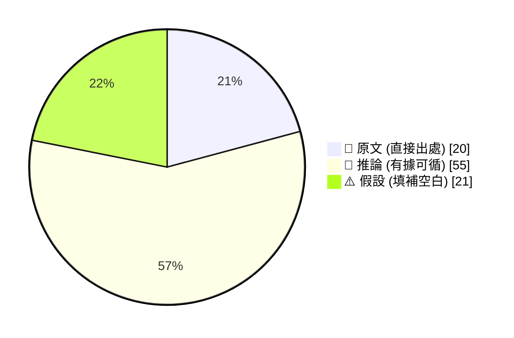

_引用規範：📖 可直接引用；🧠 客戶會議前查 verification hints；⚠️ 引用時明說「此為推測」_

## 🔄 本期 pipeline 處理流程

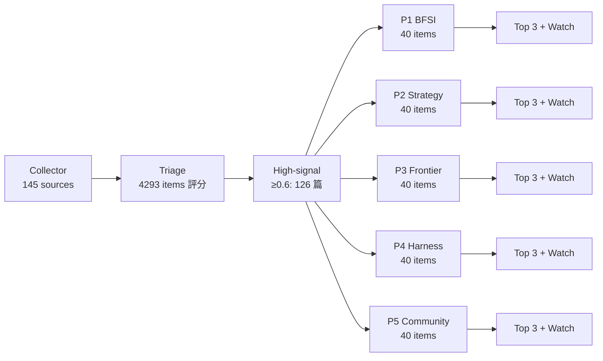

## 📑 目錄
- [Pillar 1 — 產業 AI 真實落地 (BFSI + 製造業)](#pillar-1) · 25 items · $0.0977
- [Pillar 2 — AI 戰略 / 治理 / 董事會層級論述](#pillar-2) · 16 items · $0.0803
- [Pillar 3 — Frontier 能力 + 模型動向](#pillar-3) · 32 items · $0.1020
- [Pillar 4 — Harness Engineering 實作技藝](#pillar-4) · 40 items · $0.1195
- [Pillar 5 — 學派 / 社群 / 思想動態](#pillar-5) · 13 items · $0.0699
- [📚 Foundation 深讀](#foundation) · curriculum 主題深度文


---

<a id="pillar-1"></a>

## 🏦 Pillar 1 — 產業 AI 真實落地 (BFSI + 製造業)
_25 items · $0.0977_

## Pulse — Top 3

### 1. 台灣法務部三層主權 AI 平台：算力 + 法務 LLM + AI Agent 年底成形

📖 **原文** 台灣法務部宣布啟動法務領域專屬 LLM 計畫，以三層架構串聯算力層、法務 LLM 層與 AI Agent 應用層，目標是建立可持續擴充的 AI 共用平台，讓各業務單位共用基礎算力與模型，首波應用預計年底前成形。

🧠 **推論** 此案與金管會聯手 16 家金融業者啟動的金融 LLM 專案性質相近，代表台灣政府正在複製「產業垂直 LLM + 共用平台」模式；對 Cathay、E.SUN、CTBC 等銀行而言，金融 LLM 的 governance 框架設計與法務部案例高度互通，尤其在 multi-tenant 算力共用、domain-specific fine-tuning 和 agent orchestration 三層拆解上。

🧠 **推論** 法務部選擇不自建 LLM 而是建立共用平台，意味著 IBM watsonx 這類 platform-of-platforms 定位在台灣政府場景有直接類比空間。

下圖描述法務部三層架構的元件關係；關鍵洞察：算力層與模型層分離，讓各業務單位可在共用基礎上獨立演化 agent 應用，避免重複建置。

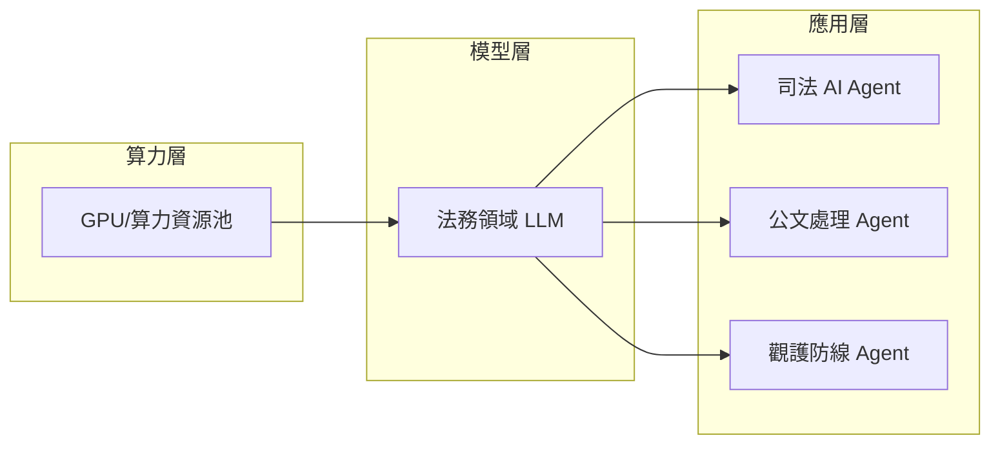

- 來源：[iThome](https://www.ithome.com.tw/news/177202)
- 對客戶的具體含意：向 Cathay、E.SUN 等銀行簡報金融 LLM 專案時，可以法務部三層架構為對照，具體說明「共用算力 + 垂直 LLM + 多 agent 應用」模式如何降低各業務單位重複建置成本，並以 IBM watsonx 承接平台治理角色。

**(English)** Taiwan Ministry of Justice Three-Layer Sovereign AI Platform: Compute + Legal LLM + AI Agent to Launch by Year-End

📖 **原文** Taiwan's Ministry of Justice (MOJ) has announced a dedicated legal-domain LLM initiative, structured as a three-layer architecture connecting a compute layer, a legal LLM layer, and an AI Agent application layer. The goal is a sustainably extensible shared AI platform so individual business units can share foundational compute and models — with the first wave of applications taking shape before year-end.

🧠 **推論** This mirrors the Financial Supervisory Commission's joint financial LLM project with 16 banks: Taiwan's government is replicating the "vertical domain LLM + shared platform" model. For Cathay, E.SUN, and CTBC, the governance framework design of the financial LLM project is highly interoperable with the MOJ case, especially in three areas: multi-tenant compute sharing, domain-specific fine-tuning, and three-layer agent orchestration.

🧠 **推論** The MOJ's deliberate choice not to build its own LLM but instead establish a shared platform creates a direct analogy for IBM watsonx's platform-of-platforms positioning in Taiwan government contexts.

The diagram above illustrates the MOJ's three-layer component relationships. Key insight: separating the compute layer from the model layer lets individual business units evolve their own agent applications independently on shared infrastructure, avoiding duplicated build-out.

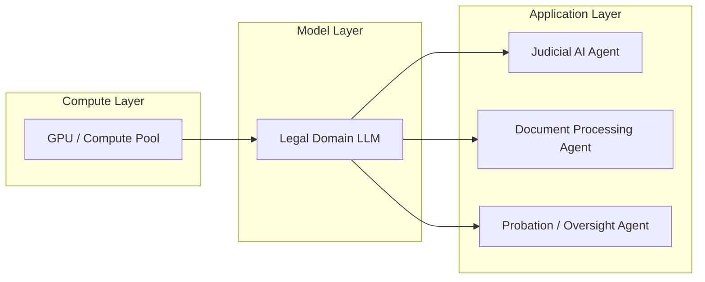

- Source: [iThome](https://www.ithome.com.tw/news/177202)
- Client implication: When briefing Cathay, E.SUN, or other banks on financial LLM projects, use the MOJ three-layer architecture as a reference to concretely illustrate how a "shared compute + vertical LLM + multi-agent applications" model reduces duplicated costs across business units — and how IBM watsonx fits as the platform governance layer.

---

### 2. MUFG × OpenAI：日本最大銀行以 ChatGPT Enterprise 推進 AI-native 組織轉型

📖 **原文** 三菱 UFJ 金融集團（MUFG）宣布與 OpenAI 合作，全行部署 ChatGPT Enterprise，目標是成為 AI-native 組織，改善工作流程並推出 AI 驅動的金融服務。

🧠 **推論** MUFG 是全球資產規模前五大銀行，此案的意義不在於「又一家銀行用 ChatGPT」，而在於 AI-native 的組織定義：從工具採用（tool adoption）躍升至流程重設計（workflow re-engineering），這正是台灣銀行業客戶目前卡關的第二階段。

🧠 **推論** 對 Cathay 或 Taishin 的 AI 轉型簡報而言，MUFG 案例可作為同文化圈（亞太金融機構）的 benchmark，說明 governance 框架、員工 AI 能力建構與 ChatGPT Enterprise 的 data residency 設定如何同步推進，而不是先 pilot 再等待。

- 來源：[OpenAI Blog](https://openai.com/index/mufg)
- 對客戶的具體含意：向 Cathay、Taipei Fubon 等銀行高層說明時，MUFG 案例可作為「亞太同規模銀行已走到哪一步」的現實參照，推動客戶從 ChatGPT 個人試用升級為企業級 governance 部署討論。

**(English)** MUFG × OpenAI: Japan's Largest Bank Deploys ChatGPT Enterprise to Become AI-Native

📖 **原文** Mitsubishi UFJ Financial Group (MUFG) has announced a partnership with OpenAI for bank-wide deployment of ChatGPT Enterprise, with the explicit goal of becoming an AI-native organization — improving internal workflows and launching AI-powered financial services.

🧠 **推論** MUFG is a top-five global bank by assets. The significance here is not "another bank using ChatGPT" — it's the organizational definition of AI-native: moving from tool adoption to workflow re-engineering. That is precisely the second-stage bottleneck Taiwan banks are currently stuck at.

🧠 **推論** For Cathay or Taishin AI transformation pitches, MUFG serves as a culturally proximate benchmark (Asia-Pacific financial institution at scale), demonstrating how governance framework design, employee AI capability building, and ChatGPT Enterprise data residency configuration need to proceed in parallel — not sequentially after an indefinite pilot phase.

- Source: [OpenAI Blog](https://openai.com/index/mufg)
- Client implication: When presenting to C-suite at Cathay or Taipei Fubon, use MUFG as a "here is where an Asia-Pacific bank of comparable scale already is" reality anchor to drive the conversation from individual ChatGPT trials toward enterprise-grade governance deployment decisions.

---

### 3. Lyft 多 Agent 系統處理 70% 客服請求，準確率達 85–90%

📖 **原文** Lyft 透過多 agent AI 系統在 production 環境中自主處理 70% 的客服請求，準確率達 85–90%，同時提升客戶滿意度評分。AWS Generative AI Innovation Center 的 Sri Elaprolu 明確指出，這不是 pilot，是在 production 全自主運作。

🧠 **推論** 此案的關鍵數字是「70% containment rate + 85–90% accuracy」的組合——這個配對直接可轉化為台灣銀行業客服 ROI 試算模型。以 E.SUN 或 Taishin 每年數百萬通客服電話量估算，70% 的自動化處理率即使僅達 80% accuracy，省下的 FTE 成本已足以支撐完整的 agent 建置費用。

⚠️ **假設** 原文出自 Siemens 供應商部落格，Lyft 自身並未直接發布，數字可信度需驗證；但 AWS Innovation Center 掛名背書使可信度略高於純廠商 PR。

下圖描述 Lyft 多 agent 客服系統的請求分流邏輯；關鍵洞察：70% 由 agent 自主處理，30% 轉人工，準確率與轉接率的平衡點是 production 調校的核心。

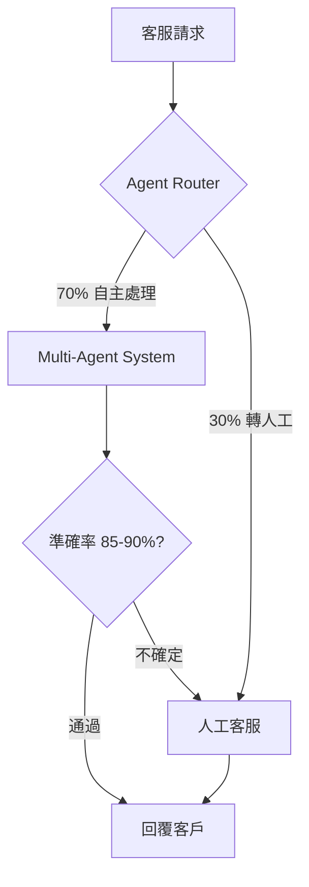

- 來源：[Siemens Digital Industries Blog](https://blog.siemens.com/2026/07/how-lyft-achieved-85-to-90-accuracy-with-multi-agent-ai-systems/)
- 對客戶的具體含意：向 E.SUN、Taishin 或 TCB 提案客服 agent 時，以 Lyft「70% containment + 85–90% accuracy」為 benchmark 建立 ROI 試算，並說明 IBM watsonx Orchestrate 如何在不犧牲 accuracy 的前提下提升 containment rate。

**(English)** Lyft Multi-Agent System Handles 70% of Customer Support Requests at 85–90% Accuracy

📖 **原文** Lyft's multi-agent AI system autonomously handles 70% of customer support requests in production, achieving 85–90% accuracy while improving customer satisfaction scores. AWS Generative AI Innovation Center director Sri Elaprolu explicitly states: this is not a pilot — agents are operating autonomously at scale in production.

🧠 **推論** The critical signal here is the combination of "70% containment rate + 85–90% accuracy" — this pairing translates directly into an ROI calculation model for Taiwan bank customer service operations. Using E.SUN or Taishin's annual call volume of millions of interactions as a baseline, even an 80% accuracy floor at 70% automation rate yields FTE cost savings sufficient to fund a full agent deployment.

⚠️ **假設** The source is a Siemens vendor blog — Lyft has not published these figures directly. The numbers require independent verification; however, the AWS Innovation Center co-authorship lends marginally more credibility than pure vendor PR.

The diagram above illustrates Lyft's multi-agent customer service request routing logic. Key insight: the balance point between containment rate and accuracy is the central production tuning challenge — not just getting agents to answer, but knowing when to route to humans.

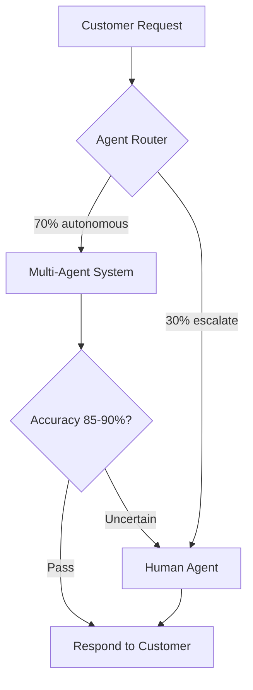

- Source: [Siemens Digital Industries Blog](https://blog.siemens.com/2026/07/how-lyft-achieved-85-to-90-accuracy-with-multi-agent-ai-systems/)
- Client implication: When proposing customer service agents to E.SUN, Taishin, or TCB, use Lyft's "70% containment + 85–90% accuracy" as the benchmark to anchor an ROI model, and position IBM watsonx Orchestrate as the orchestration layer that raises containment rate without sacrificing accuracy.

---

## Watch list

繁中為主，每條一行：

- [iThome](https://www.ithome.com.tw/news/177208) — 台灣法務部第一線人員過載實況：百萬案件量 + 觀護斷線危機，AI Agent 落地的真實驅動力，可作為製作政府 AI 轉型投影片的素材
- [iThome](https://www.ithome.com.tw/news/177212) — 中國 NVDB 將 Claude Code 反蒸餾機制定性為「安全後門」，台灣企業使用 Anthropic 工具時的地緣政治合規風險值得追蹤
- [iThome](https://www.ithome.com.tw/news/177213) — 惡意工具 DEBULL 繞過 Microsoft 365 MFA，BFSI 客戶 Microsoft 環境的 zero-trust 部署需立即評估 OAuth device code flow 風險
- [Taiwan AI Labs](https://ailabs.tw/news-room/more-than-half-of-taiwanese-enterprises-concerned-about-confidential-data-leakage-from-cloud-ai-over-70-want-ai-back-on-premises-yating-fedgpt-sovereign-ai-platform-enables-enterprises-to-build-secur/) — 台灣超過 50% 企業擔心雲端 AI 資料外洩、70% 希望 on-premises 部署，可作為說服保守型銀行接受私有雲 AI 提案的市場數據佐證
- [Databricks](https://www.databricks.com/blog/scaling-security-alert-triage-specialized-agents-databricks) — Databricks 以 specialized agent 自動化 security alert triage，BFSI SOC 場景可參考此架構
- [LangChain](https://www.langchain.com/blog/how-schneider-electric-built-their-llmops-foundations-at-enterprise-scale-with-langsmith) — Schneider Electric 企業級 LLMOps 落地：observability + eval + governance 三層，製造業客戶（Foxconn、Wistron）導入 AI 時的治理框架參考
- [iThome](https://www.ithome.com.tw/news/177195) — CISA 部署 Anthropic Mythos 掃描政府程式碼庫漏洞，AI 用於主動式資安防禦的政府案例，可作為台灣金融監管機構類比
- [AWS](https://aws.amazon.com/blogs/industries/scaling-ml-in-production-how-bbva-accelerated-delivery-with-mlops/) — BBVA MLOps 轉型：標準化 ML workflow + governance 模板加速交付，銀行 AI 治理架構設計的可參考藍圖
- [Google Cloud Blog](https://blog.google/innovation-and-ai/infrastructure-and-cloud/google-cloud/alphaevolve-on-cloud/) — AlphaEvolve 開放 Google Cloud 客戶使用，晶片設計與物流路由優化場景，TSMC、MediaTek 客戶對話的潛在話題
- [iThome](https://www.ithome.com.tw/news/177189) — Claude Cowork（Anthropic 企業 agent）推出 Web + 手機版，競品動態，IBM 提案時需說明差異化定位
- [CIO Taiwan](https://www.cio.com.tw/116267/) — 萬里雲以 Apigee 為 AI Agent 建立零信任 API 治理防線，台灣本地 agent governance 實作案例
- [科技新報](https://technews.tw/2026/07/10/hbm-supply-demand-imbalance-unresolved-how-long-taiwanese-firms-handle-overflow-orders/) — 韓國 HBM 擴產衝擊台灣記憶體產業，TSMC/Foxconn 供應鏈客戶需了解短期供需失衡風險

---

## Verification hints

This briefing contains **4**

🧠 **推論** segments and **2**

⚠️ **假設** segments. Before citing in client conversations, verify these specific points (English for language-learning practice):

1. **MOJ three-layer architecture specifics**

🧠 **推論**: The iThome article describes the three-layer concept but may not confirm all three layers are operational simultaneously by year-end — verify whether the compute layer is new-build or contracted (e.g., NCHC), and whether "首波應用年底前成形" means full production or limited pilot. URL: [https://www.ithome.com.tw/news/177202](https://www.ithome.com.tw/news/177202)

2. **MUFG deployment scope**

🧠 **推論**: The OpenAI announcement confirms the partnership and "AI-native" direction, but does not specify how many employees have ChatGPT Enterprise access, which business lines are in scope, or what the data residency configuration is for Japan's financial regulatory requirements. URL: [https://openai.com/index/mufg](https://openai.com/index/mufg)

3. **Lyft 70% / 85–90% figures**

⚠️ **假設**: These numbers appear in a Siemens vendor blog, not a Lyft-authored publication. Before citing in a client proposal, verify whether Lyft has independently confirmed these figures (e.g., in earnings calls, press releases, or AWS case study pages). The AWS Innovation Center attribution is the only third-party signal. URL: [https://blog.siemens.com/2026/07/how-lyft-achieved-85-to-90-accuracy-with-multi-agent-ai-systems/](https://blog.siemens.com/2026/07/how-lyft-achieved-85-to-90-accuracy-with-multi-agent-ai-systems/)

4. **Taiwan enterprise AI survey data**

⚠️ **假設**: The Taiwan AI Labs survey (50% cloud data leakage concern, 70% on-premises preference) was released by Taiwan AI Labs, which is also selling the FedGPT on-premises platform — potential selection bias in survey methodology. Verify sample size, industry breakdown, and whether financial sector respondents are separately reported before using as BFSI client evidence. URL: [https://ailabs.tw/news-room/more-than-half-of-taiwanese-enterprises-concerned...](https://ailabs.tw/news-room/more-than-half-of-taiwanese-enterprises-concerned-about-confidential-data-leakage-from-cloud-ai-over-70-want-ai-back-on-premises-yating-fedgpt-sovereign-ai-platform-enables-enterprises-to-build-secur/)

5. **Financial LLM ↔ MOJ LLM governance interoperability**

🧠 **推論**: The claim that the FSC financial LLM governance framework is "highly interoperable" with the MOJ platform is an inference based on structural similarity (both are domain LLM + shared platform models). No public document confirms shared standards, APIs, or governance protocols between the two initiatives.

6. **Claude Code "backdoor" characterization**

🧠 **推論**: China's NVDB classifies the anti-distillation mechanism as a security backdoor; Anthropic has not publicly confirmed whether the described behavior (transmitting geolocation/identity data without user consent) is accurate or whether it has been removed in post-2.1.196 versions. Do not cite the Chinese government's characterization as fact in client conversations without checking Anthropic's official response. URL: [https://www.ithome.com.tw/news/177212](https://www.ithome.com.tw/news/177212)2026-07-09 23:51:12,355 INFO pillar 2 (AI 戰略 / 治理 / 董事會層級論述): 16 high-signal items (min_signal=0.60)

---

<a id="pillar-2"></a>

## 📊 Pillar 2 — AI 戰略 / 治理 / 董事會層級論述
_16 items · $0.0803_

## Pulse — Pillar 2｜AI 戰略 / 治理 / 董事會層級論述

---

## Pulse — Top 3

### 1. 數發部正式公布 AI 風險分類框架：3大類20子類，配合《人工智慧基本法》落地

📖 **原文** 數位發展部於 2026 年 7 月正式發布「人工智慧風險分類框架」，將 AI 風險歸納為 3 大類、20 項子類別，並提供 4 大建議步驟，供各目的事業主管機關（衛福部、NCC 已率先行動）及企業參考。

🧠 **推論** 《人工智慧基本法》今年 1 月上路後，這套框架等同為各主管機關提供共同基準語言——銀行、保險受金管會監管，預期金管會將在此框架基礎上發布金融業專屬 AI 治理指引，Cathay、E.SUN、CTBC 等大型行庫的 AI 治理文件需在年底前對齊。

🧠 **推論** 對 Livia 的 IBM 客戶而言，能否把現有 AI 專案映射至這 20 項子類別，將直接決定 regulatory review 的通過速度，也是董事會 AI 治理報告的最低門檻語言。

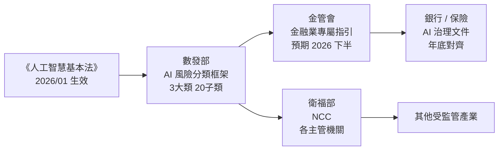
*關鍵洞察：數發部框架是「上游基準」，金管會指引才是銀行業的直接合規觸發點。*

- 來源：[iThome](https://www.ithome.com.tw/news/177184)
- 對客戶的具體含意：建議 Cathay / E.SUN 的 AI 治理工作小組立即以這 20 項子類別做 gap analysis，在金管會正式發指引前搶先完成內部映射，可在董事會報告中展示主動合規姿態。

---

**(English)** **Taiwan MDDI releases official AI Risk Classification Framework: 3 categories, 20 sub-types, aligned with the AI Basic Act**

📖 **原文** Taiwan's Ministry of Digital Affairs (MDDI) officially released its AI Risk Classification Framework in July 2026, organizing AI risks into 3 major categories and 20 sub-types, with 4 recommended implementation steps for reference by sector regulators (FSC, NCC, and the Ministry of Health and Welfare have already begun acting).

🧠 **推論** With the AI Basic Act in force since January, this framework effectively establishes a shared regulatory vocabulary across ministries — banks and insurers supervised by the FSC should anticipate sector-specific AI governance guidelines built on top of this framework, requiring major institutions like Cathay, E.SUN, and CTBC to align their internal AI governance documentation before year-end.

🧠 **推論** For Livia's IBM clients, the ability to map existing AI projects onto these 20 sub-types will directly determine the speed of regulatory review and constitutes the minimum baseline language for board-level AI governance reporting.


*Key insight: MDDI's framework is the upstream baseline; FSC's forthcoming sector guidelines are the direct compliance trigger for banks.*

- Source: [iThome](https://www.ithome.com.tw/news/177184)
- Client implication: Recommend that Cathay / E.SUN AI governance working groups immediately run a gap analysis against the 20 sub-types — completing internal mapping before FSC issues its sector guidelines lets them demonstrate proactive compliance posture at the next board reporting cycle.

---

### 2. 台灣 AI Labs 調查：逾半台灣企業憂心雲端 AI 資料外洩，逾七成傾向地端部署

📖 **原文** 台灣 AI Labs（聯發科技投資）於 2026 年 6 月 30 日發布調查，指出超過 50% 台灣企業擔憂公有雲 AI 服務的機密資料外洩風險，逾 70% 希望將 AI 部署於 on-premises 環境，主要顧慮包括資料隱私、使用者權限管控不足、模型版本不可預測更新。

🧠 **推論** 這份數字與金融業的實際監管要求高度一致——金管會對個人資料境外傳輸有明確限制，CTBC、Taishin 等行庫若使用公有雲 LLM API，每次 prompt 傳輸都可能觸發個資法及金融監理合規疑慮。

🧠 **推論** 對 IBM 的 watsonx 銷售而言，這是可直接引用的本土市場需求數據：「70% 台灣企業要 on-premises AI」可作為 Livia 向銀行 CIO 推薦 watsonx.ai on-prem 或 hybrid deployment 的量化依據，但需注意此調查由 AI Labs 自行發布，存在 自我服務偏誤（self-serving bias）的風險，建議搭配第三方數據佐證。

- 來源：[Taiwan AI Labs / Yating FedGPT](https://ailabs.tw/news-room/more-than-half-of-taiwanese-enterprises-concerned-about-confidential-data-leakage-from-cloud-ai-over-70-want-ai-back-on-premises-yating-fedgpt-sovereign-ai-platform-enables-enterprises-to-build-secur/)
- 對客戶的具體含意：向 Mega、First、TCB 等公股行庫 CIO 簡報時，可直接引用「逾 70% 台灣企業傾向地端」作為 hybrid AI 架構採購的同儕壓力論點，但口頭說明數據來源為廠商調查，以維護顧問公信力。

---

**(English)** **Taiwan AI Labs survey: Over 50% of Taiwan enterprises fear cloud AI data leakage; over 70% prefer on-premises deployment**

📖 **原文** Taiwan AI Labs (a MediaTek-backed entity) published a survey on June 30, 2026, finding that over 50% of Taiwan enterprises are concerned about confidential data leakage in public cloud AI services, and over 70% prefer on-premises AI deployment, citing data privacy, insufficient permission controls, and unpredictable model version updates as primary barriers.

🧠 **推論** These figures align closely with actual FSC regulatory constraints — FSC places explicit limits on cross-border transfer of personal data, meaning every LLM API prompt sent to a public cloud by CTBC or Taishin could implicate Personal Data Protection Act and financial supervisory compliance.

🧠 **推論** For IBM's watsonx sales motion, this is locally sourced demand data that can be cited directly: "70% of Taiwan enterprises want on-premises AI" provides a quantified hook for Livia recommending watsonx.ai on-prem or hybrid deployment to bank CIOs — however, this survey was self-published by AI Labs and carries self-serving bias risk; pair it with third-party data before using it as a sole citation.

- Source: [Taiwan AI Labs / Yating FedGPT](https://ailabs.tw/news-room/more-than-half-of-taiwanese-enterprises-concerned-about-confidential-data-leakage-from-cloud-ai-over-70-want-ai-back-on-premises-yating-fedgpt-sovereign-ai-platform-enables-enterprises-to-build-secur/)
- Client implication: When briefing CIOs at Mega, First, or Taiwan Cooperative Bank, cite "70%+ Taiwan enterprises prefer on-premises" as a peer-pressure data point for hybrid AI architecture procurement, but verbally flag it as a vendor-commissioned survey to protect consulting credibility.

---

### 3. 中國將 Claude Code 反蒸餾機制定性為「安全後門」，要求全面排查下架

📖 **原文** 中國工業和信息化部旗下 NVDB（網絡安全威脅和漏洞信息共享平臺）於 7 月 8 日發布風險提示，指 Anthropic 的 Claude Code（版本 2.1.91 至 2.1.196）內建監控機制，未經用戶同意向遠端伺服器傳送地域及身分識別等敏感資訊，並將此定性為「安全後門隱患」，要求相關單位全面排查並立即卸載或升級至已移除該程式碼的最新版。

🧠 **推論** Anthropic 的立場是這是 anti-distillation 的使用條款執法機制，而非惡意後門；中國監管機構的定性是政治性的，但指控本身（未明示的遠端資料傳輸）在 GDPR 及台灣個資法框架下也構成合規問題，值得任何在生產環境使用 Claude Code 的組織進行確認。

🧠 **推論** 對 TSMC、Foxconn、MediaTek 等製造業客戶而言，若開發人員在 IP-sensitive 的程式碼環境中使用 Claude Code，此事件是一個具體的 supply chain AI governance 觸發點：應要求供應商提供資料傳輸白皮書，並在 AI 工具採購規範中加入 data residency 條款。

- 來源：[iThome](https://www.ithome.com.tw/news/177212)
- 對客戶的具體含意：建議 TSMC / MediaTek 的資安長在下次董事會前盤點開發環境中所有第三方 AI coding 工具的資料傳輸行為，將 data residency 審查納入 AI 工具採購標準流程。

---

**(English)** **China labels Claude Code's anti-distillation mechanism a "security backdoor," orders immediate uninstall**

📖 **原文** China's MIIT-affiliated NVDB (Network Security Threat and Vulnerability Information Sharing Platform) issued a risk advisory on July 8, 2026, characterizing Anthropic's Claude Code (versions 2.1.91 through 2.1.196) as containing a built-in monitoring mechanism that transmits geolocation and identity-sensitive information to remote servers without user consent, labeling it a "security backdoor risk" and ordering affected organizations to immediately uninstall or upgrade to the latest version with the code removed.

🧠 **推論** Anthropic's position is that the mechanism is an anti-distillation terms-of-service enforcement tool, not a malicious backdoor; China's characterization is politically motivated — but the underlying allegation (undisclosed remote data transmission) constitutes a compliance issue under GDPR and Taiwan's Personal Data Protection Act frameworks regardless of intent, and merits verification by any organization running Claude Code in production.

🧠 **推論** For manufacturing clients like TSMC, Foxconn, and MediaTek, where developers may use Claude Code in IP-sensitive codebases, this incident is a concrete supply chain AI governance trigger: require vendors to provide a data transmission whitepaper and insert data residency clauses into AI tool procurement standards.

- Source: [iThome](https://www.ithome.com.tw/news/177212)
- Client implication: Recommend that TSMC / MediaTek CISOs audit all third-party AI coding tools in the development environment for data transmission behavior before the next board meeting, and formally add data residency review to standard AI tool procurement criteria.

---

## Watch list

繁中為主，每條一行：

- [iThome](https://www.ithome.com.tw/news/177202) — 法務部三層平台（算力 + 法務 LLM + AI Agent）架構，是繼金管會金融 LLM 後第二個政府主權 AI 具體案例，值得追蹤年底交付進度作為政府 AI 採購參考
- [McKinsey QuantumBlack](https://www.mckinsey.com/capabilities/quantumblack/our-insights/cost-versus-value-managing-agentic-ai-system-performance) — per-token 定價已不適用於 agentic AI 成本核算，McKinsey 提出新的 cost vs. value 框架，董事會資本配置討論的潛在工具
- [openai.com](https://openai.com/index/mufg) — MUFG 與 OpenAI 合作打造 AI-native 組織，是日本大型銀行規模部署 ChatGPT Enterprise 的公開案例，可用於說服台灣銀行 CIO 同儕效應
- [CIO Taiwan](https://www.cio.com.tw/116267/) — 萬里雲以 Google Apigee 為 AI Agent 建置 zero-trust API 治理防線，台灣本土 agent governance 實作案例
- [INSIDE 硬塞](https://www.inside.com.tw/article/41775-google-cloud-day-taipei-ed-chi) — Google DeepMind 研究副總裁紀懷新在台灣提出「大型推理機器」定義，可用於客戶 AI 策略簡報的框架語言
- [TLDR Tech](https://tldr.tech/tech/2026-07-02) — OpenAI 提議給美國政府 5% 股權（約 $42.6B），作為政治壓力緩解手段；對台灣客戶說明 AI 治理的地緣政治維度有參考價值
- [Platformer](https://www.platformer.news/ai-backlash-data-centers-jobs-inflation/) — AI 外部性（就業、能源、通膨）的輿論反彈速度快於產業回應速度，董事會 ESG/公關風險的預警信號
- [AI Snake Oil / normaltech.ai](https://www.normaltech.ai/p/up-the-stack-how-ais-escape-from) — AI 商品化與企業 vendor lock-in 風險的策略框架，採購決策中立場有用
- [INSIDE 硬塞](https://www.inside.com.tw/article/41782-china-plans-let-top-ai-firms-buy-limited-amount-nvidia-h200-chips) — 中國傳將放行 H200 晶片給阿里、字節、DeepSeek，若屬實將影響中國 AI 算力格局，間接影響台灣供應鏈客戶的競爭環境
- [AWS / BBVA Part 1](https://aws.amazon.com/blogs/industries/scaling-ml-in-production-how-bbva-accelerated-delivery-with-mlops/) + [Part 2](https://aws.amazon.com/blogs/industries/inside-bbvas-mlops-transformation-from-data-platform-to-scalable-ml-on-aws/) — BBVA 以可複用 MLOps template 加速 ML delivery 並維持治理彈性，vendor-authored 但有具體架構模式，製造業客戶 MLOps 治理參考

---

## Verification hints

This briefing contains **4

🧠 **推論** segments** and **0

⚠️ **假設** segments**. Before citing in client conversations, verify these specific points (English for language-learning practice):

1. **MDDI framework scope and FSC follow-on timing**: The iThome article confirms the MDDI framework release with 3 categories and 20 sub-types, but does not specify whether FSC has committed to a timeline for issuing sector-specific financial AI guidelines on top of it. Verify at [https://www.ithome.com.tw/news/177184](https://www.ithome.com.tw/news/177184) and cross-check FSC's official announcements before telling bank clients to expect year-end guidance.

2. **Taiwan AI Labs survey methodology**: The "50%+ concerned about data leakage / 70%+ prefer on-premises" figures come from a survey self-published by Taiwan AI Labs (the vendor selling FedGPT). The source article at [https://ailabs.tw/news-room/...](https://ailabs.tw/news-room/more-than-half-of-taiwanese-enterprises-concerned-about-confidential-data-leakage-from-cloud-ai-over-70-want-ai-back-on-premises-yating-fedgpt-sovereign-ai-platform-enables-enterprises-to-build-secur/) does not disclose sample size, survey methodology, or respondent industry breakdown. Do not cite as independent market research without finding a corroborating third-party source.

3. **Claude Code data transmission: Anthropic's official response**: The iThome article at [https://www.ithome.com.tw/news/177212](https://www.ithome.com.tw/news/177212) reports China's NVDB characterization, but Anthropic's official explanation of the mechanism (anti-distillation enforcement vs. malicious collection) should be verified directly in Anthropic's documentation or public statements before advising clients on whether the behavior constitutes a compliance risk under Taiwan's Personal Data Protection Act.

4. **MUFG deployment scale and governance specifics**: The OpenAI blog at [https://openai.com/index/mufg](https://openai.com/index/mufg) is vendor-authored and does not disclose the number of ChatGPT Enterprise seats deployed, the governance framework applied, or measurable productivity outcomes. Treat it as a directional signal rather than a benchmarkable case study until independent confirmation (e.g., MUFG investor relations or earnings disclosures) is available.2026-07-09 23:52:49,502 INFO pillar 3 (Frontier 能力 + 模型動向): 32 high-signal items (min_signal=0.60)

---

<a id="pillar-3"></a>

## 🚀 Pillar 3 — Frontier 能力 + 模型動向
_32 items · $0.1020_

## Pulse — Top 3

### 1. BAIR：推論成本崩跌 50×/年，agent 系統設計正在被迫重寫

🧠 **推論** GPT-4 等級能力的推論成本，從 2023 年初的 $30/M tokens 已跌破 $1，部分供應商更低於 $0.10；Berkeley AI Research 指出跨 benchmark 的推論價格年跌中位數約 50×（範圍 9×–900×）。這不只是成本優化問題——當 intelligence 趨近免費，原本因 token 成本受限的 multi-agent、long-context、parallel reasoning 架構都重新變得可行。

🧠 **推論** 對台灣銀行客戶（如國泰、玉山、中信）而言，這意味著過去「too expensive to run at scale」的 agentic workflow（如全自動 KYC review、即時法遵文件比對）現在值得重新評估 ROI。Livia 在 harness 建構上的含義是：tiered model routing 的核心假設（貴 = 少用）需要隨成本曲線持續校準。

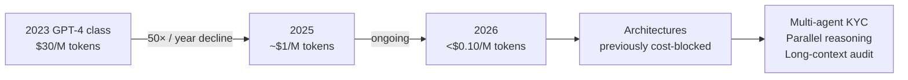
*成本曲線每年 50× 下降，等比放大的不只是省錢，而是原本被成本扼殺的整類 agent 架構*

- 來源：[Berkeley AI Research (BAIR)](http://bair.berkeley.edu/blog/2026/07/07/intelligence-is-free-now-what/)
- 對客戶的具體含意：與台灣銀行客戶討論 agentic AI ROI 時，應以「推論成本年跌 50×」為基準重算 2025 年拒絕過的 use case 的新 break-even 點。

**(English)** **BAIR: Inference cost collapsing 50× per year forces a redesign of agent system architecture**

🧠 **推論** GPT-4-class inference has dropped from $30/M tokens in early 2023 to under $1 today, with some providers below $0.10; Berkeley AI Research reports a median annual decline of ~50× across benchmarks (range: 9×–900×). This is not merely a cost optimization story — as intelligence approaches free, multi-agent, long-context, and parallel-reasoning architectures that were previously cost-blocked become viable again.

🧠 **推論** For Taiwan bank clients (Cathay, E.SUN, CTBC), this means agentic workflows previously dismissed as "too expensive to scale" — full-automated KYC review, real-time compliance document matching — deserve fresh ROI analysis. For Livia's harness engineering, the core assumption behind tiered model routing (expensive = use sparingly) needs continuous recalibration against the cost curve.


*The 50× annual cost decline doesn't just save money — it resurrects entire classes of agent architecture that were previously killed by economics.*

- Source: [Berkeley AI Research (BAIR)](http://bair.berkeley.edu/blog/2026/07/07/intelligence-is-free-now-what/)
- Client implication: When revisiting agentic AI ROI with Taiwan bank clients, use "inference cost declining 50× per year" as the baseline to recalculate break-even points for use cases rejected in 2025.

---

### 2. Claude Opus 4.8 發現 schema mismatch bug：frontier model 在 production tool-calling 中捏造欄位

📖 **原文** 開發者 Armin 回報，較新的 Claude 模型（包括 Opus 4.8）在呼叫 Pi 編輯器的 `edit` tool 時，會在 `edits[]` 陣列中發明不存在的 key，導致 tool call 被拒絕並觸發重試循環。Simon Willison 的紀錄顯示這不是小模型的問題，Opus 4.8 同樣會發生。

🧠 **推論** 這個 failure mode 的危險性在於：edit 本身通常是正確的，只有 schema 不符——在 production pipeline 中若沒有嚴格的 JSON schema validation，錯誤會被靜默吞噬或無限重試，而非明確失敗。

🧠 **推論** 對 Livia 的 harness 實作而言，這直接說明為何每個 tool definition 都應包含 `additionalProperties: false` 且 output 需過 schema validator，而非信任 model 自我約束；對 TSMC、Foxconn 等製造業客戶的 agentic automation 提案，這是一個具體的風險點需列入 deployment checklist。

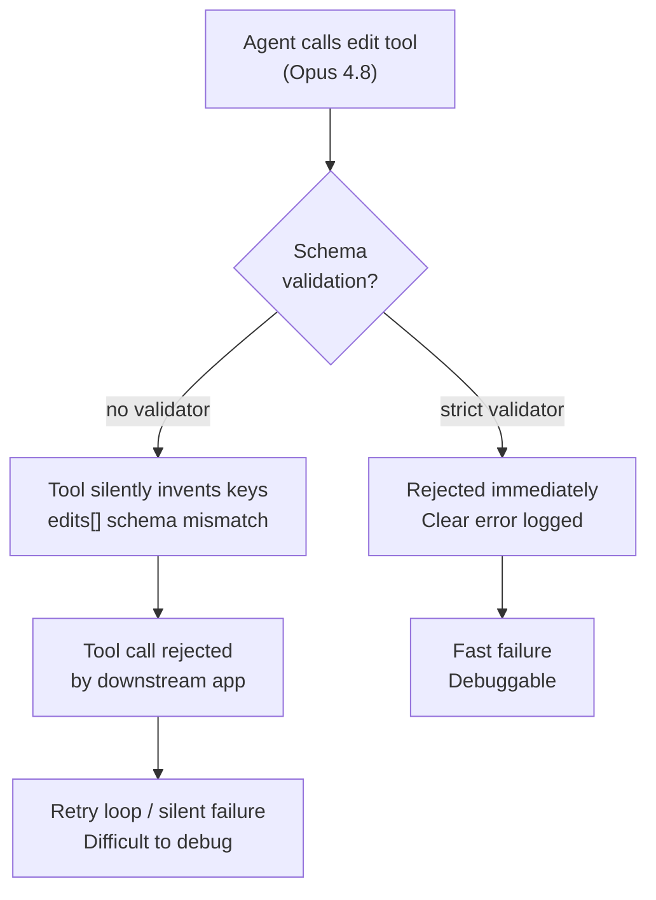
*沒有 schema validator 的 tool-calling pipeline，frontier model 的 schema hallucination 會變成靜默的無限重試地獄*

- 來源：[Simon Willison](https://simonwillison.net/2026/Jul/4/better-models-worse-tools/#atom-everything)
- 對客戶的具體含意：所有 production agentic system 的 tool schema 必須加上 `additionalProperties: false` 並在 harness 層做 validator，這是比 prompt engineering 更可靠的防護。

**(English)** **Claude Opus 4.8 caught inventing tool arguments in production: frontier model schema hallucination is a real failure mode**

📖 **原文** Developer Armin reported that newer Claude models, including Opus 4.8, call Pi editor's `edit` tool with invented keys inside the `edits[]` array — fields that don't exist in the schema — causing the tool call to be rejected and triggering retry loops. Simon Willison's write-up makes clear this is not a small-model regression; Opus 4.8 exhibits the same behaviour.

🧠 **推論** The insidious part of this failure mode: the edit content itself is usually correct, only the schema is wrong — in production pipelines without strict JSON schema validation, errors are silently swallowed or loop indefinitely rather than failing cleanly.

🧠 **推論** For Livia's harness engineering, this is a direct argument for `additionalProperties: false` on every tool definition plus a schema validator at the output layer, rather than trusting model self-restraint; for manufacturing clients (TSMC, Foxconn) evaluating agentic automation, this is a concrete risk that belongs on every deployment checklist.


*Without a schema validator in the tool-calling pipeline, frontier model schema hallucination becomes a silent infinite-retry hell.*

- Source: [Simon Willison](https://simonwillison.net/2026/Jul/4/better-models-worse-tools/#atom-everything)
- Client implication: Every production agentic system's tool schema must enforce `additionalProperties: false` with a harness-layer validator — this is more reliable protection than prompt engineering alone.

---

### 3. FlexOlmo / FlexMoRE：聯邦式模組 LLM 讓各機構在不共享敏感資料下貢獻專業 expert

📖 **原文** Allen Institute for AI (AI2) 記錄 Danish Foundation Models 以 FlexOlmo 為基礎建構 FlexMoRE——一個模組化 LLM 架構，允許各機構在**不共享資料**的前提下，訓練並貢獻各自的 domain expert，最終合併成共用模型，且可在「高度普及的硬體」上執行。

🧠 **推論** 這個架構對台灣金融機構有直接對應的場景：國泰、富邦、中信、台新等銀行各自擁有不可外流的客戶交易資料，但共同面對相同的法遵、風控、KYC 問題——FlexMoRE 式的架構理論上允許它們聯合訓練一個金融 expert 而不用把資料交給對方或交給雲端。

🧠 **推論** 對 Livia 的 IBM 顧問定位，這是一個「私有 AI + 聯合能力」的敘事框架，比「送資料給 OpenAI/Anthropic」更容易在台灣監管環境下過審。需注意：目前僅有丹麥案例，台灣金融業的實際可行性（授權、監管沙盒、基礎設施）仍是

⚠️ **假設**。

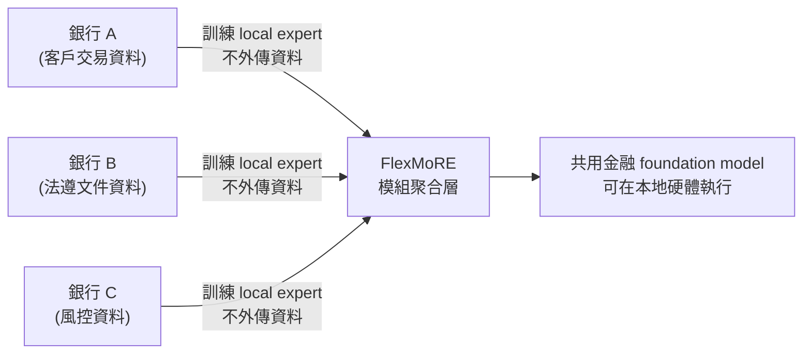
*各機構只貢獻 expert weights，不貢獻原始資料——這是突破台灣金融資料主權困境的關鍵設計*

- 來源：[Allen Institute for AI (AI2)](https://allenai.org/blog/flexmore)
- 對客戶的具體含意：與國泰、中信、富邦等大型行庫討論 AI 戰略時，FlexMoRE 架構可作為「不用送資料上雲」的聯合能力建構方案，值得在 proof-of-concept 提案中列入評估。

**(English)** **FlexOlmo / FlexMoRE: federated modular LLMs let institutions pool domain expertise without pooling sensitive data**

📖 **原文** The Allen Institute for AI (AI2) documents Danish Foundation Models building FlexMoRE on top of FlexOlmo — a modular LLM architecture that lets institutions train and contribute their own domain experts without sharing underlying data, then merge them into a shared model runnable on "highly accessible hardware."

🧠 **推論** This architecture has a direct analogue for Taiwan's financial institutions: Cathay, Fubon, CTBC, and Taishin each hold customer transaction data that cannot leave their walls, yet they face identical compliance, risk, and KYC challenges — a FlexMoRE-style approach would theoretically allow them to jointly train a financial expert model without handing data to each other or to a cloud provider.

🧠 **推論** For Livia's IBM consulting positioning, this is a "private AI + pooled capability" narrative that clears Taiwan's regulatory bar far more easily than "send your data to OpenAI/Anthropic." Caveat: only a Danish pilot exists so far; Taiwan financial sector feasibility — licensing, regulatory sandbox, infrastructure — remains

⚠️ **假設**.

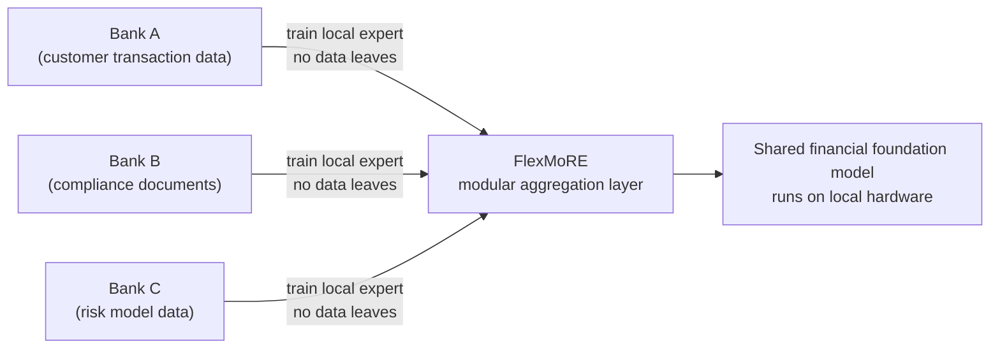
*Each institution contributes only expert weights, not raw data — the key design that breaks through Taiwan's financial data sovereignty impasse.*

- Source: [Allen Institute for AI (AI2)](https://allenai.org/blog/flexmore)
- Client implication: When discussing AI strategy with Cathay, CTBC, and Fubon, FlexMoRE is worth including in proof-of-concept proposals as a "no data leaves the building" path to pooled domain capability.

---

## Watch list

繁中為主，每條一行：

- [Lilian Weng — Harness Engineering for Self-Improvement](https://lilianweng.github.io/posts/2026-07-04-harness/) — 前 OpenAI、現 Thinking Machines Lab 對 recursive self-improvement (RSI) 的系統性整理，harness 工程師必讀的概念框架
- [Import AI 464: Fables writes GPU kernels](https://jack-clark.net/2026/07/06/import-ai-464-fables-writes-gpu-kernels-ai-automation-and-analog-computation/) — Fable 模型生成第一個真正的 megakernel，RSI loop 的早期訊號，Jack Clark 解讀值得關注
- [METR: Anthropic researcher uplift >2×](https://metr.org/notes/2026-07-08-anthropic-researcher-uplift/) — METR 嘗試從「代碼合併量 8×」推算研究者實際生產力提升倍數，方法論有爭議但框架有用
- [OpenAI: SWE-Bench Pro benchmark critique](https://openai.com/index/separating-signal-from-noise-coding-evaluations) — OpenAI 自揭主流 coding benchmark 的可靠性問題，影響所有以 SWE-Bench 為依據的能力宣稱
- [GPT-5.6 Luna/Terra/Sol family](https://simonwillison.net/2026/Jul/9/gpt-5-6/#atom-everything) — 三層定價結構（$1/$2.5/$5 per M input tokens）與 Claude Opus/Fable 直接競爭，需要 benchmark 數據才能評估
- [Muse Spark 1.1 with agentic tool-calling](https://simonwillison.net/2026/Jul/9/muse-spark-1-1/#atom-everything) — Meta 第一個有 API 的 Spark 模型，標榜 computer-use 能力提升，詳細評估報告值得查閱
- [NVIDIA Nemotron + LangChain Deep Agents](https://blogs.nvidia.com/blog/nemotron-langchain-agents-open-stack/) — 開源模型中最高 agent benchmark 準確率聲稱，缺成本/延遲細節，適合作為 open-stack 提案的參考數據點
- [Leanstral 1.5: formal verification, Apache-2.0](https://mistral.ai/news/leanstral-1-5/) — 6B 參數模型在 PutnamBench 解 587/672 題，對需要 code correctness 保證的製造業 CI/CD pipeline 有潛力
- [Grok 4.5 with Cursor co-training](https://www.ithome.com.tw/news/177190) — SpaceXAI 首款與 Cursor 共同訓練的模型，主打 agentic 開發，需要獨立評估才能超越行銷說法
- [LeRobot v0.6.0: world models + VLAs](https://huggingface.co/blog/lerobot-release-v060) — Hugging Face robotics stack 大版本更新，對 Foxconn、和碩等製造業客戶的 physical AI 路線圖有參考價值
- [AlphaEvolve on Google Cloud](https://blog.google/innovation-and-ai/infrastructure-and-cloud/google-cloud/alphaevolve-on-cloud/) — 算法優化引擎開放給雲端客戶，晶片設計與物流路由優化場景與台灣製造業直接相關，但具體客戶數字仍不透明
- [Nvidia Kyber rack-scale architecture delayed >12 months to 2028](https://tldr.tech/tech/2026-07-07) — Rubin Ultra 144-chip 機架系統延至 2028，影響大型模型訓練基礎設施規劃，TSMC 客戶需注意供應鏈含義
- [GPT-Live voice model with GPT-5.5 delegation](https://simonwillison.net/2026/Jul/8/introducing-gptlive/#atom-everything) — voice mode 升級並可將複雜任務 delegate 給 GPT-5.5，task routing 架構值得記錄
- [HuggingFace: Data for Agents (Nemotron Post-Training v3)](https://huggingface.co/blog/nvidia/open-data-for-agents) — 從 agent failure recovery 角度討論 post-training data 策略，「autocompleter with tools vs. real agent」的框架有說服力

---

## Verification hints

This briefing contains **4

🧠 **推論**** segments and **1

⚠️ **假設**** segment. Before citing in client conversations, verify these specific points (English for language-learning practice):

1. **BAIR cost figures (Top 3, Item 1):** The blog post states GPT-4-class costs fell from ~$30/M tokens in early 2023 to under $1 today with some providers below $0.10, and a median annual decline of ~50×. Verify the current lowest-cost provider actually delivers GPT-4-class quality at $0.10/M — "GPT-4-class capabilities" is not uniformly defined across providers. Check the BAIR post's footnotes for which specific models and providers were benchmarked: [http://bair.berkeley.edu/blog/2026/07/07/intelligence-is-free-now-what/](http://bair.berkeley.edu/blog/2026/07/07/intelligence-is-free-now-what/)

2. **Opus 4.8 schema hallucination (Top 3, Item 2):** The report is from a single developer (Armin) writing to Pi's specific edit tool schema, relayed via Simon Willison. Before citing this as a general Opus 4.8 failure mode to clients, check whether Anthropic has acknowledged the regression or whether it's schema-specific (e.g., nested array + extra keys pattern). The original report may be at Simon Willison's linked source: [https://simonwillison.net/2026/Jul/4/better-models-worse-tools/](https://simonwillison.net/2026/Jul/4/better-models-worse-tools/)

3. **FlexMoRE hardware accessibility claim (Top 3, Item 3):** The excerpt says the merged model runs on "highly accessible hardware" — verify what this means concretely (consumer GPU? edge device? specific VRAM requirement?) before using it as a selling point for on-premise Taiwan bank deployment. The AI2 blog post is the primary source: [https://allenai.org/blog/flexmore](https://allenai.org/blog/flexmore)

4. **FlexMoRE Taiwan financial applicability (Top 3, Item 3 — marked

⚠️ **假設**):** The only documented deployment is Danish Foundation Models in Denmark. Taiwan FSC regulatory treatment of federated model weights (as opposed to raw data) has not been confirmed. Do not present this as a proven regulatory workaround without consulting FSC guidance or legal counsel.

5. **METR researcher uplift math (Watch list):** The METR note explicitly states "the math was checked by Claude but not a second human" and that "others at METR disagree" with the conclusion. The 8× code merge → >2× researcher uplift inference is Thomas Kwa's personal opinion. Do not cite the ">2×" figure as a METR organizational finding: [https://metr.org/notes/2026-07-08-anthropic-researcher-uplift/](https://metr.org/notes/2026-07-08-anthropic-researcher-uplift/)2026-07-09 23:54:39,342 INFO pillar 4 (Harness Engineering 實作技藝): 40 high-signal items (min_signal=0.60)

---

<a id="pillar-4"></a>

## 🛠️ Pillar 4 — Harness Engineering 實作技藝
_40 items · $0.1195_

## Pulse — Top 3

### 1. Harrison Chase：改善 Agent = 資料探勘問題，用 trace 找失敗、fine-tune 評審、以 eval 爬坡

🧠 **推論** LangChain 的 Harrison Chase 在兩篇連發文章中提出一個框架：agent 的效能瓶頸不在模型本身，而在 harness——具體而言是在 trace mining（從生產軌跡中挖失敗模式）、judge model fine-tuning（比 frontier LLM 評審便宜）、以及 eval-driven hill-climbing。第二篇以 Nemotron 3 Ultra 為案例，聲稱透過純 scaffolding 調整（不改動模型權重）達到與 Claude Opus 4.8 最佳 agent run 相當的成果，成本降低約 8 倍。

⚠️ **假設** 8× 成本差距數字尚未獨立驗證，且依賴特定工作負載組合——在銀行 compliance workflow 或製造業品質檢核情境下，實際節省幅度可能差距甚大。對 Livia 在構建 AI harness portfolio 而言，這兩篇文章合在一起提供了一條完整的方法論鏈：trace → failure taxonomy → judge → eval → config selection，值得直接對應到實作流程。

以下圖示說明 LangChain 所描述的 harness 改善迴路：

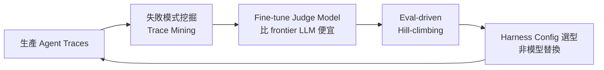

*關鍵洞見：效能瓶頸在 scaffolding 配置，而非模型本身——這讓 harness engineer 成為成本槓桿點。*

- 來源：[Harrison Chase — Improving Agents is a Data Mining Problem](https://www.langchain.com/blog/improving-agents-is-a-data-mining-problem)、[Tuning the Harness, Not the Model](https://www.langchain.com/blog/tuning-the-harness-not-the-model-a-nemotron-3-ultra-playbook)
- 對客戶的具體含意：向台灣銀行客戶（如國泰、玉山）提案 agent 專案時，可直接引用「harness tuning 而非換模型」框架，將 LLMOps 投資定位為持續的 trace mining 工程，而非一次性的模型採購。

**(English)** Harrison Chase: Improving agents is a data-mining problem — mine traces, fine-tune judges, hill-climb with evals

🧠 **推論** In two back-to-back posts, LangChain's Harrison Chase lays out a framework: agent performance bottlenecks live in the harness, not the model — specifically in trace mining (surfacing failure patterns from production runs), judge-model fine-tuning (cheaper than frontier LLM grading), and eval-driven hill-climbing. The second post uses Nemotron 3 Ultra as a case study, claiming that scaffolding-only changes — no model weight updates — matched Claude Opus 4.8's best agent run at roughly 8× lower cost.

⚠️ **假設** The 8× cost delta is unverified independently and depends on specific workload mix — for bank compliance workflows or manufacturing QA scenarios the realized savings could differ substantially. For Livia's harness engineering portfolio, the two posts together provide a complete methodological chain: trace → failure taxonomy → judge → eval → config selection — directly mappable to a real implementation roadmap.

The diagram above (see 繁中 section) illustrates the harness improvement loop as described by LangChain.

- Source: [Harrison Chase — Improving Agents is a Data Mining Problem](https://www.langchain.com/blog/improving-agents-is-a-data-mining-problem); [Tuning the Harness, Not the Model](https://www.langchain.com/blog/tuning-the-harness-not-the-model-a-nemotron-3-ultra-playbook)
- Client implication: When pitching agent projects to Taiwan banks (Cathay, E.SUN), frame "harness tuning instead of model swaps" as the LLMOps investment thesis — continuous trace-mining engineering rather than one-time model procurement.

---

### 2. 中國將 Claude Code 的反蒸餾機制定性為「安全後門」，要求全面卸載

📖 **原文** 中國工業和信息化部旗下的 NVDB（網路安全威脅和漏洞信息共享平臺）於 7 月 8 日發布風險提示，指稱 Claude Code 2.1.91 至 2.1.196 版本內建監控機制，「未經用戶同意即向遠端伺服器傳送地域及身分識別等敏感資訊」，並要求相關單位立即卸載或升級。

🧠 **推論** Anthropic 將此機制定位為 anti-distillation（反蒸餾）保護與使用條款執行工具，並非後門；但中國監管機關的定性一旦成立，即構成在中國大陸使用 Claude Code 的合規障礙，與此同時也為其他司法管轄區的監管機關提供了一個先例。對於在台灣協助銀行或製造商導入 Claude Code 作為開發工具的 Livia 而言，這個事件提供了一個具體的 vendor lock-in 與 regulatory risk 討論切入點——尤其是有兩岸業務往來的客戶（如台灣銀行、合庫、中信等）。

⚠️ **假設** 台灣金管會目前尚無類似定性跡象，但此事件值得持續追蹤。

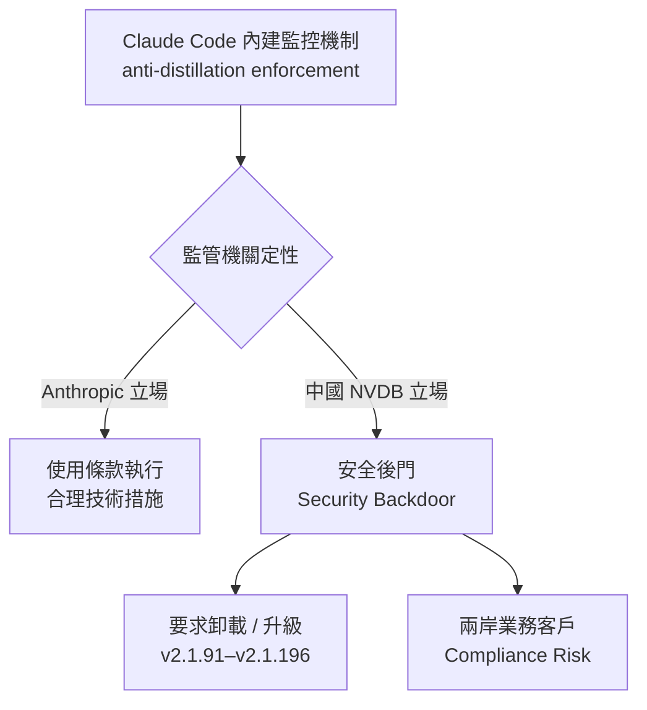

*關鍵洞見：同一段程式碼在不同監管框架下的法律定性可以截然相反——這是 production deployment 必須事先評估的 jurisdictional risk。*

- 來源：[iThome — 中國政府將 Claude Code 反蒸餾機制定性為安全後門](https://www.ithome.com.tw/news/177212)
- 對客戶的具體含意：輔導台灣銀行或製造商（如台積電、鴻海）評估 Claude Code 採購時，需明確詢問跨境資料傳輸政策，並在合約中要求 Anthropic 提供技術文件說明監控機制範疇，以應對潛在的監管查核。

**(English)** China classifies Claude Code's anti-distillation mechanism as a "security backdoor," orders immediate uninstall

📖 **原文** China's Ministry of Industry and Information Technology's NVDB (Network Security Threat and Vulnerability Information Sharing Platform) issued a risk advisory on July 8th stating that Claude Code versions 2.1.91 through 2.1.196 contain a built-in monitoring mechanism that "transmits sensitive information including geolocation and identity data to remote servers without user consent," demanding immediate uninstallation or upgrade.

🧠 **推論** Anthropic positions this mechanism as an anti-distillation protection and terms-of-service enforcement tool, not a backdoor; but once a Chinese regulatory body formalizes this classification, it creates a compliance barrier for Claude Code use on the Chinese mainland, and sets a precedent other jurisdictions could follow. For Livia advising Taiwan banks or manufacturers adopting Claude Code as a dev toolchain, this event provides a concrete vendor lock-in and regulatory risk discussion anchor — especially for clients with cross-strait operations (e.g., Bank of Taiwan, First Bank, CTBC).

⚠️ **假設** Taiwan FSC shows no similar classification signals at this time, but warrants monitoring.

The diagram above (see 繁中 section) illustrates the divergent regulatory framing of the same technical mechanism.

- Source: [iThome — China classifies Claude Code anti-distillation as security backdoor](https://www.ithome.com.tw/news/177212)
- Client implication: When evaluating Claude Code procurement for Taiwan banks or manufacturers (TSMC, Foxconn), explicitly request Anthropic's technical documentation on the monitoring mechanism's scope, and build cross-border data transfer policy review into the contract — before a regulator asks.

---

### 3. Lilian Weng 梳理 35 篇論文：Harness Engineering for Self-Improvement 成為獨立研究領域

🧠 **推論** Lilian Weng（前 OpenAI 研究主管，現 Thinking Machines Lab）發表了一篇深度部落格文章，系統整理 recursive self-improvement（RSI）的 harness engineering 模式，追溯從 I. J. Good（1965）到現代 AI 的理論脈絡，並彙整 35 篇相關論文。這篇文章的信號意義在於：RSI 從 AI safety 的思想實驗正式進入 production engineering 的方法論討論——Latent Space 的 AI News 摘要（7 月 4 日）進一步確認這是當週最受 AI 工程師關注的文章之一。

⚠️ **假設** 文章的完整內容（excerpt 僅提供引言段落）目前無法獨立核實 35 篇論文的具體建議與 production harness 設計的對應關係，需直接閱讀原文才能確認適用性。對 Livia 構建 harness portfolio 而言，這篇文章是一份難得的 credibility anchor：當客戶詢問「你們的 agent 架構基於什麼研究基礎？」時，可引用此文作為 due diligence 的理論依據。

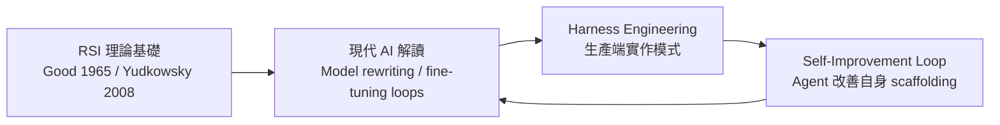

*關鍵洞insight：RSI 已從 AI safety 的哲學討論降落為 harness engineer 的實作議題，這是 production AI 成熟度的標誌。*

- 來源：[Lilian Weng — Harness Engineering for Self-Improvement](https://lilianweng.github.io/posts/2026-07-04-harness/)、[Latent Space AINews 摘要](https://www.latent.space/p/ainews-lilian-weng-summarizes-35)
- 對客戶的具體含意：在向銀行或製造商提案 AI agent 長期路線圖時，可引用此框架說明「第一階段是 harness tuning，第二階段才是讓 agent 參與優化自身 pipeline」，讓客戶理解 AI 投資的複利結構。

**(English)** Lilian Weng synthesizes 35 papers: Harness Engineering for Self-Improvement becomes a standalone research domain

🧠 **推論** Lilian Weng (former OpenAI research director, now Thinking Machines Lab) published a substantive blog post systematically mapping recursive self-improvement (RSI) harness engineering patterns, tracing the lineage from I. J. Good (1965) to modern AI, and synthesizing 35 papers. The signal here is that RSI is formally transitioning from AI safety thought experiment to production engineering methodology — Latent Space's AI News summary (July 4) confirms this was among the most-read pieces in the AI engineering community that week.

⚠️ **假設** The full content of the article (excerpt only provides the introduction) cannot be independently verified against all 35 papers' specific recommendations and their mapping to production harness design — direct reading required before citing specifics in client meetings.

For Livia's harness portfolio, this post is a rare credibility anchor: when clients ask "what's the research foundation behind your agent architecture?", this serves as a citable due-diligence reference from a source no Taiwan bank CTO will dismiss.

The diagram above (see 繁中 section) illustrates the RSI feedback loop as it maps from theory to production harness.

- Source: [Lilian Weng — Harness Engineering for Self-Improvement](https://lilianweng.github.io/posts/2026-07-04-harness/); [Latent Space AINews Summary](https://www.latent.space/p/ainews-lilian-weng-summarizes-35)
- Client implication: When pitching long-horizon AI agent roadmaps to banks or manufacturers, cite this framework to explain "Phase 1 is harness tuning, Phase 2 is letting the agent participate in optimizing its own pipeline" — helping clients understand AI investment as a compounding structure, not a point purchase.

---

## Watch list

繁中為主，每條一行：

- [LangChain — Deep Agents Code on NVIDIA NemoClaw](https://www.langchain.com/blog/deep-agents-code-on-nvidia-nemoclaw-a-governed-blueprint-for-your-most-sensitive-code) — deny-by-default 網路 + 人工審核 + audit log 的 governed agent 架構藍圖，製造業敏感程式碼現代化場景直接適用
- [LangChain — Fix Your Coding Agent Bill](https://www.langchain.com/blog/fix-your-coding-agent-bill) — 追蹤 Claude Code / Cursor / Copilot 跨工具花費失控的 tracing 方法，LLMOps 成本治理必讀
- [Towards Data Science — Stop Ranking Agent Configs by Average Score](https://towardsdatascience.com/stop-ranking-agent-configs-by-average-score/) — MaxDiff 風格的 Plackett-Luce 評分取代平均分，agent config 選型的 eval 方法論升級
- [Towards Data Science — Loop Engineering for Hierarchical Retrieval](https://towardsdatascience.com/loop-engineering-for-hierarchical-retrieval-reading-a-long-document-by-its-table-of-contents/) — TOC 路由取代 top-k 全頁檢索，492 頁文件場景節省 token 並提升精確度，法規文件 RAG 直接可用
- [Simon Willison — Better Models: Worse Tools](https://simonwillison.net/2026/Jul/4/better-models-worse-tools/#atom-everything) — Opus 4.8 在 tool call 中自行發明 schema 外欄位的具體失效模式，harness schema validation 必要性的反面教材
- [Simon Willison — Kenton Varda on AI commit messages](https://simonwillison.net/2026/Jul/8/kenton-varda/#atom-everything) — Cloudflare 工程主管對 AI 生成 PR 描述的禁用令：缺乏 higher-level framing，製造 code review cognitive debt
- [LangChain — Auditable VC Research Agent](https://www.langchain.com/blog/build-an-auditable-vc-research-agent-with-the-perplexity-agent-api-langgraph-and-langsmith) — Perplexity + LangGraph + LangSmith 三層審計鏈的研究 agent，可作為銀行 due diligence workflow 的架構參考
- [Schneider Electric LLMOps with LangSmith](https://www.langchain.com/blog/how-schneider-electric-built-their-llmops-foundations-at-enterprise-scale-with-langsmith) — 製造業大廠企業級 LLMOps 部署案例，觀測性 + eval + governance 三層架構，向台灣製造商客戶提案時的同業參照
- [iThome — 法務部三層主權 AI 平臺](https://www.ithome.com.tw/news/177202) — 台灣政府算力 + 法務 LLM + AI Agent 三層架構，與金融 LLM 專案並行，台灣 sovereign AI 生態系的架構全貌
- [Microsoft Agent Skills for .NET](https://www.ithome.com.tw/news/177187) — 企業技能封裝 + 人工核准 + 快取 + 腳本執行控管，Microsoft 生態系客戶的 agent governance 現成方案
- [Databricks — Benchmarking Coding Agents on Multi-Million Line Codebase](https://www.databricks.com/blog/benchmarking-coding-agents-databricks-multi-million-line-codebase) — 真實百萬行程式庫上的 coding agent eval 方法，比 SWE-Bench 更接近製造業遺產系統現代化場景
- [Latent Space — Vercel's eve Agent Framework](https://www.latent.space/p/vercel-agents-new-software) — skills + sandboxes + agent-readable websites 三元素，Vercel CTO 對 agent-as-new-software 的架構立場
- [Modal CTO on Agent Infrastructure](https://www.latent.space/p/modal2026) — Agent Experience（AX）為何需要新雲端基礎設施，兩年實戰經驗的生產模式總結
- [Latent Space — Skill Engineering vs One-Shot Design](https://www.latent.space/p/skill-engineering-design) — loopmaxxing 時代人工判斷的不可或缺性，human-in-loop steering 的生產案例
- [AI2 FlexOlmo / FlexMoRE](https://allenai.org/blog/flexmore) — 敏感資料不出場的聯邦模組化 LLM，台灣銀行跨行 LLM 合作（參考金融 LLM 專案）的技術路線參考
- [Practical AI — Building Durable AI Agents (ZenML Kitaru)](https://share.transistor.fm/s/facb92e2) — replay mechanics + agent fleet observability，MLOps 原則遷移到 agent harness 的完整討論
- [Lyft Multi-Agent 85–90% Accuracy](https://blog.siemens.com/2026/07/how-lyft-achieved-85-to-90-accuracy-with-multi-agent-ai-systems/) — 處理 70% 客服請求、85–90% 準確率，vendor blog 但指標具體，可作為銀行客服 agent 商業論證參考
- [CISA 使用 Anthropic Mythos 掃描政府程式碼](https://www.ithome.com.tw/news/177195) — 政府級 AI 漏洞掃描部署，對 BFSI 資安防禦工程有政策信號意義
- [DEBULL 繞過 MFA 攻擊 Microsoft 365](https://www.ithome.com.tw/news/177213) — OAuth Device Code 釣魚新手法，生產 harness 若依賴 M365 需立即評估防禦
- [OpenAI SWE-Bench Pro 評測問題分析](https://openai.com/index/separating-signal-from-noise-coding-evaluations) — 主流 coding benchmark 可靠性存疑，harness engineer 在引用 eval 數字時需注意方法論缺陷
- [Leanstral 1.5 — Formal Verification Model](https://mistral.ai/news/leanstral-1-5/) — Apache-2.0、6B 參數，PutnamBench 587/672，agentic proof engineering + 真實 bug 發現，金融合規形式驗證的未來選項
- [Hugging Face / NVIDIA — Data for Agents](https://huggingface.co/blog/nvidia/open-data-for-agents) — agent robustness 的 post-training 資料策略：failure recovery + tool-use failures，「autocompleter with tools」到真正 agent 的資料工程路徑
- [Import AI 464 — Fables 生成 GPU Kernel](https://jack-clark.net/2026/07/06/import-ai-464-fables-writes-gpu-kernels-ai-automation-and-analog-computation/) — AI 生成首個 megakernel，RSI 循環起點的早期信號，TSMC / MediaTek 生態系的長期觀察點

---

## Verification hints

This briefing contains **5

🧠 **推論**** segments and **3

⚠️ **假設**** segments. Before citing in client conversations, verify these specific points (English for language-learning practice):

1. **LangChain 8× cost claim**: The Nemotron 3 Ultra playbook ([URL](https://www.langchain.com/blog/tuning-the-harness-not-the-model-a-nemotron-3-ultra-playbook)) claims harness-only changes matched Opus 4.8 at ~8× lower cost. Verify: (a) what specific task/benchmark was used, (b) whether "best agent run" for Opus 4.8 was cherry-picked vs. average, and (c) whether the cost calculation includes fine-tuning the judge model.
2. **Claude Code monitoring mechanism scope**: The iThome article ([URL](https://www.ithome.com.tw/news/177212)) cites NVDB's claim that versions 2.1.91–2.1.196 transmit geolocation and identity data without consent. Verify directly with Anthropic's release notes and changelog for those versions — NVDB's characterization as "backdoor" vs. Anthropic's likely "terms enforcement" framing is a legal/technical distinction that matters enormously for client procurement advice.
3. **Lilian Weng's 35-paper synthesis**: The excerpt ([URL](https://lilianweng.github.io/posts/2026-07-04-harness/)) only shows the introduction. Before citing specific RSI harness patterns in client presentations, read the full post to verify which production-deployment recommendations are empirically grounded vs. theoretical extrapolations.
4. **CISA Mythos deployment**: The iThome article ([URL](https://www.ithome.com.tw/news/177195)) cites Reuters citing 3 unnamed sources. Verify whether any official CISA or Anthropic statement confirms this deployment before using it as a "government-grade validation" argument in security-sensitive client conversations.
5. **Lyft 85–90% accuracy figure**: The Siemens blog ([URL](https://blog.siemens.com/2026/07/how-lyft-achieved-85-to-90-accuracy-with-multi-agent-ai-systems/)) is a vendor-produced case study. Verify the accuracy metric's definition (what task, what ground truth, what error-tolerance window) before quoting it to Taiwan bank clients as a customer-service agent benchmark.
6. **SWE-Bench Pro reliability**: The OpenAI analysis ([URL](https://openai.com/index/separating-signal-from-noise-coding-evaluations)) raises methodology concerns about a benchmark OpenAI's own models are evaluated against — verify the specific issues identified (contamination? label noise? task ambiguity?) before citing SWE-Bench numbers as evidence for or against any model's coding capability in client proposals.
7. **Leanstral 1.5 bug discovery claim**: The Mistral excerpt states the model "uncovered 5 previously unknown bugs across 57…" (excerpt truncated). Verify the full claim: 57 what (projects? files? repos?), whether the bugs were independently confirmed, and whether the Apache-2.0 license has any usage restrictions for commercial financial applications before recommending it for Taiwan bank formal verification use cases.
8. **FlexMoRE sensitive data claim**: The AI2 FlexOlmo post ([URL](https://allenai.org/blog/flexmore2026-07-09 23:56:48,737 INFO pillar 5 (學派 / 社群 / 思想動態): 13 high-signal items (min_signal=0.60)

---

<a id="pillar-5"></a>

## 🌐 Pillar 5 — 學派 / 社群 / 思想動態
_13 items · $0.0699_

## Pulse — Top 3

### 1. METR 量化 Anthropic 研究員生產力提升：合併程式碼量 8×，實際研究員效能可能 >2×

🧠 **推論** METR 研究員 Thomas Kwa 分析 Anthropic 的 RSI（Recursive Self-Improvement）部落格數據——Q2 2026 Anthropic 貢獻者每日合併程式碼量是 2021–2024 基準期的 8 倍——並推導出因為 8 ≈ e²，serial researcher uplift（串行研究員效能提升倍數）可能超過 2×。注意：此為個人推論，METR 內部有人持異議，且數學僅由 Claude 驗算，未經第二位人類確認。對 Livia 的 harness 建置工作而言，這個框架提供了一個可操作的衡量維度：不只是「產出更多 code」，而是「研究員每單位時間能推進多少復雜決策」。對台灣銀行客戶，這是一個有力的 ROI 敘事起點——但需要強調測量框架本身的不確定性，避免被競爭對手反駁。

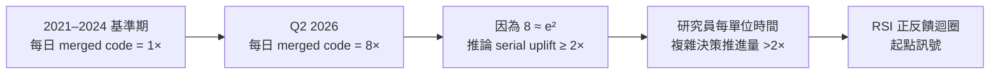
*圖示因果鏈：程式碼合併量的 8× 增幅如何透過對數運算映射至研究員效能估算，關鍵洞察是「code velocity ≠ research velocity」，折扣係數本身就是風險所在。*

- 來源：[METR](https://metr.org/notes/2026-07-08-anthropic-researcher-uplift/)
- 對客戶的具體含意：向 Cathay 或 E.SUN 高層提 AI ROI 時，可引用「研究員效能 2× 起跳」框架，但必須同步說明這是對數推論而非直接量測，以建立可信度而非過度承諾。

**(English)** METR Quantifies Anthropic Researcher Uplift: 8× Code Merge Rate Implies Plausibly >2× Researcher Productivity

🧠 **推論** METR researcher Thomas Kwa analyzed data from Anthropic's RSI blog post — which reported that Anthropic contributors merged 8× as much code per day in Q2 2026 versus the 2021–2024 baseline — and derived that because 8 ≈ e², the serial researcher uplift (how much more effective output a single researcher produces per unit time) is plausibly greater than 2×. Critical caveat: this is Kwa's personal opinion, others at METR disagree, and the math was checked by Claude rather than a second human. For Livia's harness engineering work, this framework surfaces a meaningful measurement dimension: not just "more code shipped" but "how far can a researcher advance complex decisions per unit time." For Taiwan bank clients, it's a compelling ROI narrative anchor — but the measurement framework's uncertainty must be foregrounded to survive pushback.

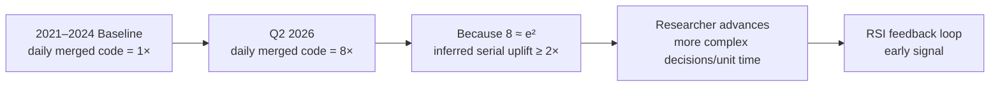
*Key insight: code velocity is not research velocity — the discount factor between the two is precisely where the risk lives.*

- Source: [METR](https://metr.org/notes/2026-07-08-anthropic-researcher-uplift/)
- Client implication: When pitching AI ROI to Cathay or E.SUN leadership, the ">2× researcher productivity" frame is usable — but pair it immediately with "this is a log-derived inference, not a direct measurement" to build credibility rather than invite rebuttal.

---

### 2. Berkeley BAIR：「Intelligence is Free」——推論成本崩潰正在重塑 agent 資料系統設計

📖 **原文** Berkeley AI Research Blog 指出，GPT-4 級推論能力的 token 成本從 2023 年初的每百萬 token $30 已跌至低於 $1，部分供應商甚至低於 $0.10；跨 benchmark 的推論價格每年下降 9× 至 900×，中位數接近 50×。

🧠 **推論** BAIR 的論點核心是：當 intelligence 接近免費，系統設計的瓶頸從「如何負擔得起推論」轉移到「如何設計 data systems 來支撐大量 agent 並發操作」——包括 agent-aware 資料庫、provenance tracking、跨 agent 的一致性保證。對 Livia 的 harness 工程，這直接指向一個架構選擇點：現在開始投資 agent-native 資料層，而不是把現有 DB 強行接 agent。對台灣銀行客戶，成本崩潰意味著原本「試點期」的推論預算假設需要重新校準——值得在 proposal 中明確點出這個趨勢，以避免客戶用過時的成本模型否決更大型的 agent 部署。

- 來源：[Berkeley BAIR Blog](http://bair.berkeley.edu/blog/2026/07/07/intelligence-is-free-now-what/)
- 對客戶的具體含意：對 TSMC 或 Foxconn 這類有大量製程資料的製造業客戶，「推論接近免費」意味著他們應該重新評估過去因成本而擱置的 AI 應用場景，瓶頸已從算力轉移到資料治理架構。

**(English)** Berkeley BAIR: "Intelligence is Free" — Inference Cost Collapse Is Reshaping Agent Data System Design

📖 **原文** The Berkeley AI Research Blog reports that GPT-4-class inference has dropped from roughly $30 per million tokens in early 2023 to under $1 today, with some providers pushing below $0.10; inference prices have fallen between 9× and 900× per year across benchmarks, with a median decline near 50×.

🧠 **推論** BAIR's central argument is that as intelligence approaches free, the bottleneck in system design shifts from "can we afford inference" to "how do we design data systems that support large-scale concurrent agent operations" — including agent-aware databases, provenance tracking, and cross-agent consistency guarantees. For Livia's harness engineering, this points directly to an architectural decision point: invest now in an agent-native data layer rather than forcing existing databases to accommodate agents. For Taiwan bank clients, the cost collapse means that inference budget assumptions from pilot proposals need recalibration — worth surfacing explicitly so clients don't veto larger agent deployments using outdated cost models.

- Source: [Berkeley BAIR Blog](http://bair.berkeley.edu/blog/2026/07/07/intelligence-is-free-now-what/)
- Client implication: For data-rich manufacturing clients like TSMC or Foxconn, "inference approaching free" means it's time to revisit AI use cases previously shelved on cost grounds — the bottleneck has shifted from compute to data governance architecture.

---

### 3. Lilian Weng（OpenAI）整理 35 篇 Harness Engineering 論文用於 RSI——這是 Livia pipeline 的直接參考書單

🧠 **推論** Latent Space 報導 OpenAI 安全研究主管 Lilian Weng 整理了 35 篇關於 harness engineering 的論文，聚焦於支撐 Recursive Self-Improvement（RSI）的工程基礎設施。Weng 是 AI 社群中少數兼具研究深度與工程視角的聲音，她主動策展這份書單本身就是訊號：RSI harness 的工程模式已從學術討論進入 production-grounded 閱讀清單階段。

⚠️ **假設** 書單內容可能涵蓋 agent scaffolding、evaluation harness、loop 設計與 human-in-loop checkpointing 等主題（原文摘錄未列出具體論文），但需要確認實際內容。對 Livia 正在建置的 harness pipeline，這份書單是值得本週優先閱讀的素材，也是向客戶證明方法論有學術根基的佐證。

- 來源：[Latent Space / AINews](https://www.latent.space/p/ainews-lilian-weng-summarizes-35)
- 對客戶的具體含意：在向台灣銀行提案 AI 工程能力時，引用 Lilian Weng 的策展清單可作為方法論背書，說明所採用的 harness 設計有 frontier lab 研究支撐，而非自行摸索。

**(English)** Lilian Weng (OpenAI) Curates 35 Papers on Harness Engineering for RSI — A Direct Reference List for Livia's Pipeline

🧠 **推論** Latent Space reports that Lilian Weng, OpenAI's head of safety research, has curated 35 papers on harness engineering focused on the infrastructure supporting Recursive Self-Improvement (RSI). Weng is one of the few voices in the AI community who combines research depth with an engineering lens — the act of curating this list is itself a signal that harness engineering patterns for RSI have moved from academic discussion into production-grounded reading list territory.

⚠️ **假設** The list likely covers topics such as agent scaffolding, evaluation harnesses, loop design, and human-in-loop checkpointing (the excerpt does not enumerate specific papers), but the actual contents need verification. For Livia's harness pipeline work, this reading list is high-priority material for this week, and it provides academic grounding when making the methodology case to clients.

- Source: [Latent Space / AINews](https://www.latent.space/p/ainews-lilian-weng-summarizes-35)
- Client implication: When pitching AI engineering capability to Taiwan banks, citing Weng's curated list serves as methodological endorsement — it signals that the harness design choices being made are backed by frontier lab research, not invented from scratch.

---

## Watch list

繁中為主，每條一行：

- [Latent Space — Vercel's eve framework](https://www.latent.space/p/vercel-agents-new-software) — Vercel 的 agent 框架 eve 引入 skills / sandboxes / agent-readable websites 概念，架構師在設計 agent deployment 時值得參考其模組化思路
- [Latent Space — Modal CTO on Agent Experience](https://www.latent.space/p/modal2026) — Modal CTO 談 agent cloud 基礎設施演化，對評估 production agent infra 選型有參考價值
- [Latent Space — AIEWF Loops Debate](https://www.latent.space/p/aiewf-daily-dispatch-locomotives) — AI Engineer World's Fair 閉幕辯論聚焦「loops vs. linear pipelines」，捕捉當前社群對 agent 設計的主要分歧
- [Latent Space — Skill Engineering & Loopmaxxing](https://www.latent.space/p/skill-engineering-design) — 「loopmaxxing」時代下 human-in-loop steering 的實務主張，適合評估 harness 中人機介面設計
- [Latent Space — AIEWF Agency Debate](https://www.latent.space/p/aiewf-daily-dispatch-agency) — 軟體工廠願景與人類理解/控制需求之間的張力，對 AI 治理敘事有用但摘錄過薄需讀原文
- [Normal Tech / AI Snake Oil — AI Commodity Trap & Enterprise Lock-in](https://www.normaltech.ai/p/up-the-stack-how-ais-escape-from) — 批評者與支持者都看錯方向？對台灣銀行採購策略中的 vendor lock-in 風險評估有參考價值
- [Latent Space — Grok 4.5 Launch](https://www.latent.space/p/ainews-spacexai-launches-grok-45) — SpaceXAI Grok 4.5 發布聲稱 Opus 級能力，能力宣稱需獨立驗證後才能引用
- [Latent Space — Agentic Sites (Adobe)](https://www.latent.space/p/the-website-of-the-future) — Adobe 實驗每用戶意圖驅動的頁面自動生成，概念有趣但缺乏 production 細節
- [INSIDE — Google DeepMind 紀懷新「大型推理機器」](https://www.inside.com.tw/article/41775-google-cloud-day-taipei-ed-chi) — 在 Google Cloud Day Taipei 發表的 frontier 敘事框架，適合作為向台灣客戶解釋模型演化方向的話語素材
- [Import AI 464 — Fables GPU Kernel Generation](https://jack-clark.net/2026/07/06/import-ai-464-fables-writes-gpu-kernels-ai-automation-and-analog-computation/) — AI 自動撰寫 GPU kernel 是 R&D 自動化的早期訊號，對評估 AI 在晶片設計輔助的可能性（MediaTek、TSMC）有長期參考價值

---

## Verification hints

This briefing contains **4

🧠 **推論** segments** and **1

⚠️ **假設** segment**. Before citing in client conversations, verify these specific points (English for language-learning practice):

1. **METR uplift math (Item 1):** The ">2× researcher uplift" claim rests on Thomas Kwa's personal logarithmic inference (8 ≈ e²) and was math-checked by Claude, not a second human. Verify at [metr.org](https://metr.org/notes/2026-07-08-anthropic-researcher-uplift/) whether METR has since published a consensus position, and whether Anthropic's RSI blog post itself (linked from that page) defines "merged code" in a way that supports the productivity interpretation.
2. **BAIR cost figures (Item 2):** The $30 → <$1 → <$0.10 per million token figures and the "9×–900× per year" decline range are stated in the BAIR blog excerpt. Verify at [bair.berkeley.edu](http://bair.berkeley.edu/blog/2026/07/07/intelligence-is-free-now-what/) that these figures cite primary sources (e.g., Epoch AI pricing data or specific provider APIs) rather than being editorial estimates — clients may ask for the benchmark methodology.
3. **Lilian Weng paper list contents (Item 3):** The

⚠️ **假設** that the 35-paper list covers scaffolding, evaluation harnesses, loop design, and human-in-loop checkpointing is speculative — the Latent Space excerpt does not enumerate specific papers. Read the actual Latent Space post at [latent.space](https://www.latent.space/p/ainews-lilian-weng-summarizes-35) (and Weng's original source, likely her X/Twitter thread or a linked document) to confirm the actual paper topics before citing in a methodology pitch.
4. **Grok 4.5 "Opus-class" capability claim (Watch list):** The claim that Grok 4.5 is "Opus-class" comes from the Latent Space headline and SpaceXAI marketing language. Before citing in competitive landscape discussions with clients, verify against independent third-party benchmarks (e.g., LMSYS Chatbot Arena, ARC-AGI leaderboard) rather than taking the launch announcement at face value.
5. **Import AI — "first genuine megakernel" claim (Watch list):** Fable's claim to have written "the first genuine (and fastest) megakernel" is a strong superlative from the company's own framing as reported by Jack Clark. Verify whether an independent GPU performance benchmark or third-party reproducibility check supports this before using it in conversations with MediaTek or TSMC contacts.

  Pillar 1 (產業 AI 真實落地 (BFSI + 製造業)       ) items= 25  cents=9.7746
  TOTAL: 0.4695 USD

---

## 📋 引用清單（spot-check 用）

_本期所有引用 URL 集中於各 Pillar 的 Source / 來源 行；驗證提示集中於各 Pillar 末段 Verification hints。_


---

<a id="foundation"></a>

# Foundation — Track C: Agent 架構模式

_Week 2026-W28 · 25 items synthesized · $0.7161 USD_


# 生產級 Agent 架構的三重解耦：Harness、Brain、Hands 在 2026 年中的設計收斂

## TL;DR (3 句繁中)
1. 2026 年中，production agent 架構已從「選哪個模型」的思維收斂到「調校 harness 而非模型」的設計範式，harness 工程（scaffolding、prompt、tool schema、failure recovery pipeline）成為主要 ROI 槓桿。
2. 核心 trade-off 在於 harness 彈性 vs. 可審計性：越多的自主 loop（ReAct、Reflexion、RSI）帶來越高的 capability ceiling，但也帶來認知債務（cognitive debt）、schema 漂移、以及不可預測的 failure mode。
3. 對 Livia 而言，這意味著向台灣金融與製造業客戶銷售 AI 轉型時，架構提案的重心應從「模型選型」轉移到「harness 設計 + 可觀測性 + 治理封裝」，這才是 enterprise 實際付費的能力。

## 背景與問題框架

[推論] 六個月前（2025 年底至 2026 年初），production agent 的討論焦點還在「ReAct vs. Plan-and-Execute」、「single agent vs. multi-agent」這類架構選型問題上。當時的隱含假設是：選對架構模式，agent 就能跑起來。但本週的多條訊號共同揭示了一個不同的現實：**架構模式本身已經商品化，真正的差異化來自 harness 層的工程實踐**——包括 prompt 調校、tool schema 治理、failure trace 挖掘、人工核准流程、以及 agent 可觀測性。

[原文] LangChain 的 Harrison Chase 本週明確提出「[Tuning the harness, not the model](https://www.langchain.com/blog/tuning-the-harness-not-the-model-a-nemotron-3-ultra-playbook)」這一操作原則：他們用 Nemotron 3 Ultra（一個 cost-efficient 模型）透過純 scaffolding 調校，達到了 Opus 4.8 最佳 agent run 的效能，成本降低約 8 倍。同時，[Simon Willison 記錄了 Opus 4.8 反而在 tool-calling 上出現 schema 幻覺](https://simonwillison.net/2026/Jul/4/better-models-worse-tools/)——模型更強，但 tool 使用品質更差。這兩個訊號交叉指向同一結論：**模型能力與 agent 品質之間的關係不是線性的，harness 是調節變數**。

[推論] 與此同時，Lilian Weng 的 [Harness Engineering for Self-Improvement](https://lilianweng.github.io/posts/2026-07-04-harness/) 從 RSI（Recursive Self-Improvement）角度建立了 harness 概念的理論框架，將 agent harness 定位為「模型自我改進循環中的外部結構」。NVIDIA 的 [Nemotron Post-Training Data for Agents](https://huggingface.co/blog/nvidia/open-data-for-agents) 則從 data pipeline 角度論證「agent 的穩健性是 post-training data 問題」。三條路徑——scaffolding 調校、self-improvement harness、post-training data engineering——在本週同時成熟，構成了 production agent 架構的新共識。

## 核心概念解析（含 Mermaid 圖）

### 一、三層解耦架構：Brain / Hands / Harness

[推論] 綜合本週訊號，production agent 的組件可以解耦為三個清晰的層次：**Brain**（LLM 推理核心）、**Hands**（tool-calling、API 交互、file 操作）、**Harness**（orchestration、prompt engineering、failure recovery、governance、observability）。關鍵洞見：**大多數 enterprise 的工程投入應集中在 Harness 層**，因為 Brain 層正在快速商品化（inference 成本年降 50x），而 Hands 層由 MCP、Agent Skills 等標準逐漸收斂。

下圖展示三層解耦模型與各層的主要工程關注點：

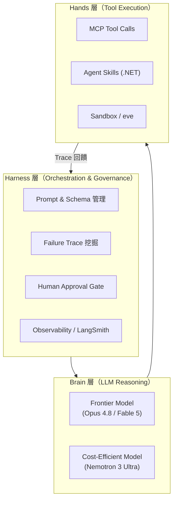

**關鍵洞見**：trace 回饋迴路（Hands → Harness）才是持續改進的引擎。LangChain 的 [failure mining pipeline](https://www.langchain.com/blog/improving-agents-is-a-data-mining-problem) 正是這條迴路的具體實作。

### 二、Harness Tuning 的量化論證

[原文] Harrison Chase 的 Nemotron playbook 提供了一個可量化的案例：在 agent coding task 上，Nemotron 3 Ultra + 調校過的 harness ≈ Opus 4.8 + 預設 harness，而成本差距約 8x。[來源](https://www.langchain.com/blog/tuning-the-harness-not-the-model-a-nemotron-3-ultra-playbook)

[原文] 同時，Simon Willison 記錄了 [Opus 4.8 的 tool-calling regression](https://simonwillison.net/2026/Jul/4/better-models-worse-tools/)：模型在 nested `edits[]` array 中「發明」了不存在於 schema 的欄位。tool call 本身語意正確，但 schema 驗證失敗導致 retry loop。

[推論] 這揭示了一個反直覺的 pattern：**frontier model 的 capability ceiling 提升，可能同時降低 tool-calling 的 schema compliance**。較強的模型有更強的「自主填充」傾向，會在 structured output 中插入它認為「有幫助」但 schema 未定義的欄位。這意味著 harness 層必須包含嚴格的 schema validation + graceful retry，而非假設「更強模型 = 更好 tool use」。

以下圖展示 harness tuning 與 model capability 之間的非線性關係：

```mermaid
flowchart LR
    A["弱模型 + 弱 Harness"] -->|"低品質"| D["Agent Output"]
    B["強模型 + 弱 Harness"] -->|"Schema 漂移\n高成本"| D
    C["中等模型 + 強 Harness"] -->|"高品質\n低成本"| D
    E["強模型 + 強 Harness"] -->|"最高品質\n高成本"| D
    style C fill:#2d6,stroke:#333,color:#fff
```

**關鍵洞見**：路徑 C（中等模型 + 強 harness）在 cost/quality Pareto frontier 上往往優於路徑 B（強模型 + 弱 harness）。Enterprise 客戶的預設選項應是 C。

### 三、Agent 改善是資料挖掘問題

[原文] Harrison Chase 的另一篇文章 「[Improving Agents is a Data Mining Problem](https://www.langchain.com/blog/improving-agents-is-a-data-mining-problem)」將 agent 的持續改善定義為一個 closed-loop data pipeline：收集 agent traces → 識別 failure patterns → fine-tune 輕量 judge model（而非 frontier LLM）→ 用 eval 做 hill-climbing。

[推論] 這個 pattern 與 NVIDIA 的 [open data for agents](https://huggingface.co/blog/nvidia/open-data-for-agents) 形成互補。NVIDIA 論證「agent 穩健性始於 post-training data」——包括 tool-use failure traces、multi-step reasoning logs、recovery scenarios。兩者共同指向一個結論：**production agent 的真正護城河不是模型，而是 failure trace 的累積與利用**。

```mermaid
flowchart LR
    A["Agent 執行"] --> B["Trace 收集\n(LangSmith)"]
    B --> C["Failure 挖掘\n(pattern 分群)"]
    C --> D["Judge Model\n微調"]
    D --> E["Eval Suite\n更新"]
    E --> F["Harness 調校"]
    F --> A
```

**關鍵洞見**：這是一個 flywheel，而非一次性設計。Schneider Electric 的 [LLMOps 案例](https://www.langchain.com/blog/how-schneider-electric-built-their-llmops-foundations-at-enterprise-scale-with-langsmith) 佐證了這個 flywheel 在 enterprise scale 的可行性——他們的 observability 基礎建設正是為了驅動這個循環。

### 四、認知債務與人機協作的邊界

[原文] Geoffrey Litt（經 [Simon Willison 引述](https://simonwillison.net/2026/Jul/2/understand-to-participate/)）提出「Understand to Participate」原則：開發者必須維持對 agent 產出的理解深度，否則累積的認知債務（cognitive debt）會導致無法有效參與後續迭代。Kenton Varda 則從另一角度呼應，[宣布禁止 AI 撰寫 commit message](https://simonwillison.net/2026/Jul/8/kenton-varda/)，因為 AI 產出的變更描述「worse than useless」——列出了看代碼就能知道的細節，卻遺漏了高階語意框架。

[推論] 這兩個訊號指向同一個 agent 架構設計原則：**agent loop 中必須有「語意還原」步驟**——不只是 summarize what was done，而是 explain why in a frame the human can use to participate further。這不是 nice-to-have，而是架構層面的 requirement。沒有這一步，human-in-the-loop 會退化為 human-rubber-stamping-the-loop。

### 五、治理封裝：Agent Skills 與 Federated Expertise

[原文] Microsoft 釋出的 [Agent Skills for .NET](https://www.ithome.com.tw/news/177187) 將政策、文件、腳本封裝為可重複使用的「技能」，並內建人工核准、篩選、快取、腳本執行控管機制。[AI2 的 FlexMoRE 架構](https://allenai.org/blog/flexmore) 則從模型架構層解決 federated expertise pooling——讓各機構貢獻 domain expert modules，無需共享原始資料。

[推論] 這兩者共同指向 enterprise agent 的一個核心需求：**能力封裝 + 存取治理**。台灣法務部的 [三層平臺架構](https://www.ithome.com.tw/news/177202)（算力層 → 法務 LLM → AI Agent）正是這個 pattern 的政府部門實踐，與金管會的金融 LLM 專案形成對照。

```mermaid
flowchart TD
    subgraph Gov["治理封裝層"]
        G1["Skills Registry\n(核准/篩選/快取)"]
        G2["Human Approval Gate"]
    end
    subgraph Domain["領域專家層"]
        D1["法務 Expert Module"]
        D2["金融 Expert Module"]
        D3["製造 Expert Module"]
    end
    subgraph Infra["算力與模型層"]
        I1["共用 LLM Base"]
        I2["Federated Training"]
    end
    Gov --> Domain
    Domain --> Infra
    Infra -->|"Inference"| Domain
    Domain -->|"Audit Trail"| Gov
```

**關鍵洞見**：治理封裝層是 enterprise 願意付費的差異化功能。沒有 audit trail 和 approval gate，agent 在受監管產業無法上線。

## 與既有框架的對位

[推論] 本週的 harness-centric 設計範式可以對位到幾個 canonical 框架：

**1. Chip Huyen 的 ML 系統設計框架**：Chip Huyen 在 *Designing Machine Learning Systems*（2022）中將 ML 系統分為 data layer、model layer、serving layer。今天的 agent 架構可以視為在 serving layer 之上新增了 harness layer。Huyen 強調的 data flywheel（production data → retraining）在 agent 領域變成了 trace flywheel（agent traces → harness tuning）。LangChain 的 failure mining pipeline 是這個 flywheel 的直接實作。

**2. NIST AI RMF（風險管理框架）**：NIST RMF 的 Govern → Map → Measure → Manage 四環，在 agent 架構中分別對應到：Skills governance（Govern）→ tool schema mapping（Map）→ eval/observability（Measure）→ harness tuning（Manage）。Microsoft 的 Agent Skills for .NET 提供的核准/篩選/快取機制，是 Govern 環的具體技術實作。對受監管的台灣金融業，這個 mapping 有直接的 compliance 價值。

**3. Anthropic RSP / METR 的 researcher uplift 量化**：[METR 的分析](https://metr.org/notes/2026-07-08-anthropic-researcher-uplift/) 指出 Anthropic 報告的「8x code merge 量」不等於「8x researcher output」，因為 code 量與 research output 的關係是非線性的（8 ≈ e²，plausible researcher uplift 可能只有 ~2x）。這個分析框架對 agent ROI 估算極為重要：企業不應把 agent 的 task completion rate 等同於 business value uplift。兩者之間的 conversion factor 取決於 task 的 business criticality distribution，這是 harness 層需要度量的。

**4. Karpathy 的 "Software 2.0" 論述（2017）**：Karpathy 認為神經網路是新的 runtime，data 是新的 code。Agent 時代的更新版：**harness 是新的 software engineering surface，traces 是新的 codebase**。模型權重是 commodity，harness configuration + accumulated traces 才是 IP。

## Trade-offs 與爭議

**1. Harness Complexity vs. Model Capability Investment**
- **正方**：LangChain 的 Nemotron playbook 證明 harness tuning 可以在 8x 成本節省下達到同等品質。對 budget-constrained 的 enterprise 客戶，這是明確的 ROI。
- **反方**：harness 是 brittle engineering——高度依賴 specific model behavior。當底層模型 API 更新（如 Opus 4.8 的 schema 幻覺），精心調校的 harness 可能瞬間失效。模型能力投資（直接用更強模型）提供更穩健的 baseline。
- **立場**：[推論] 兩者不是 either/or。正確的策略是 **harness-first, model-upgrade-when-harness-saturates**。但 harness 設計必須包含 model migration abstraction layer。

**2. Agent Autonomy vs. Cognitive Debt**
- **正方**：更長的 agent loop（hours-long sessions，如 [ChatGPT Work](https://openai.com/index/chatgpt-for-your-most-ambitious-work/)）能完成更複雜的多步驟任務。
- **反方**：Geoffrey Litt 的「Understand to Participate」警告：human oversight 的有效性隨 loop 長度指數衰減。Kenton Varda 的 commit message 禁令是認知債務具體化的案例。
- **立場**：[推論] 每個 agent loop 需要 **structured checkpoints** 產出 human-readable semantic summaries，而非 task logs。這是架構 requirement，不是 UX feature。

**3. Federated Expertise Pooling vs. Data Sovereignty**
- **正方**：FlexMoRE 式的 modular expert architecture 讓機構共享能力而不共享資料，完美匹配台灣的主權 AI 需求（法務部、金管會案例）。
- **反方**：expert module 本身可能 leak training data distribution information（membership inference、model inversion attack）。「不共享資料」不等於「不暴露資料特徵」。
- **立場**：[推論] 需要配套的 differential privacy 或 secure aggregation 機制。台灣客戶應要求 vendor 提供隱私保證的技術證明，而非僅靠架構宣稱。

**4. Eval Benchmark 信度**
- **正方**：OpenAI 的 [SWE-Bench Pro 批判](https://openai.com/index/separating-signal-from-noise-coding-evaluations/) 揭示了 popular benchmark 的 noise 問題，推動更嚴謹的 eval methodology。
- **反方**：frontier lab 批判自家表現不佳的 benchmark 存在動機偏差。需要獨立第三方 eval 治理。
- **立場**：[推論] Enterprise 客戶不應直接引用 public benchmark 數據做採購決策。應建立 domain-specific eval suite（如金融法規 QA、製造 SOP 遵循），這本身就是 harness engineering 的一部分。

## 對 Livia IBM 客戶的具體含意

**1. 國泰 / 玉山金控：Harness-First 提案策略**
[推論] 台灣金融機構常見的 RFP 思路是「選最強的模型」。本週的證據支持一個反向提案：先定義 harness architecture（含 tool schema governance、failure trace pipeline、human approval gate），再論證「在這個 harness 下，中等模型（如 Nemotron 3 Ultra、Llama 系列）已可達到 frontier 水準，成本低 8x」。這個提案同時解決合規問題（audit trail 內建）和預算問題（低成本模型）。

**2. 法務部 / 金管會：三層平臺的 IBM 角色**
[原文] 法務部的三層架構（算力 → 法務 LLM → AI Agent）與 IBM 的 watsonx 平台（watsonx.ai → watsonx.data → watsonx.governance）有結構性對應。Livia 可以提案：IBM 提供 governance 層（watsonx.governance 的 factsheet、bias detection、audit trail）+ 開放模型 base（Granite），讓法務部在 sovereign infra 上建構 domain agent。

**3. 台積電 / 鴻海：Agent Skills 封裝製造知識**
[推論] Microsoft 的 Agent Skills for .NET 模式直接適用於製造業知識封裝：將 SOP、品質規範、設備參數封裝為 skill modules，由 agent 按需調用，配合人工核准 gate 確保關鍵操作有 human oversight。IBM 可以用 watsonx.ai 的 function calling + watsonx.governance 的 approval workflow 提供類似能力，避免客戶鎖死在 Microsoft 生態。

**4. 通用警示：不要賣 "autonomous agent"，賣 "governed agent with trace flywheel"**
[推論] 台灣金融監管環境（金管會 AI 指引）要求可解釋性與可審計性。任何「autonomous agent」的提案都會撞牆。正確的定位是「governed agent」——有 approval gates、有 trace 可供事後審查、有 eval 持續度量品質。trace flywheel 還提供持續改善的故事，讓客戶看到長期價值而非一次性 POC。

## 對 Livia harness engineer portfolio 的含意

**1. Design Note 提取：「Harness-First Agent Architecture」**
本週深讀的核心論點可以直接轉化為一份 design note：「為什麼 production agent 的 ROI 槓桿在 harness 而非 model，以及如何設計 harness 以達到 model-agnostic robustness」。這份 note 展示了系統思維，而非只是「我會用 LangChain」。

**2. 面試問答框架：「Better Models, Worse Tools 的解法」**
Opus 4.8 的 schema 幻覺問題是一個完美的面試 scenario answer：「Tell me about a time you dealt with an unexpected system failure.」答案結構：frontier model 升級導致 tool-calling regression → root cause 是 schema compliance 問題 → 解法是 harness 層加入 strict schema validation + structured retry with schema re-injection → 設計原則是 defensive harness design，不假設 model upgrade 是 monotonic improvement。

**3. Portfolio Narrative 連結**
Livia 的 portfolio 故事線應該是：「我不只是會串 API 的 builder，我理解 production agent system 的架構層次、trade-offs、以及治理需求——這正是 enterprise AI 轉型需要的 harness engineering 思維。」本週深讀提供了具體的 canonical references（LangChain Nemotron playbook、Geoffrey Litt 的 cognitive debt 框架、METR 的 uplift 量化方法）來支撐這個 narrative。

**4. 可以建構的 Demo**
用 LangGraph + LangSmith 建一個 mini agent（例如簡易 VC memo generator，參考 [Perplexity + LangGraph 案例](https://www.langchain.com/blog/build-an-auditable-vc-research-agent-with-the-perplexity-agent-api-langgraph-and-langsmith)），但重點不是 agent 功能，而是展示 harness 層的三個治理元素：(a) tool schema validation with retry，(b) structured checkpoint summaries for human review，(c) failure trace 收集與分析 dashboard。這三個元素才是面試時讓人眼睛一亮的東西。

---

# (English) The Triple Decoupling of Production Agent Architecture: Harness, Brain, and Hands Converge in Mid-2026

## TL;DR (3 sentences)
1. By mid-2026, production agent architecture has converged from "which model to pick" toward "tune the harness, not the model" — scaffolding, prompt management, tool schema governance, and failure recovery pipelines are now the primary ROI lever.
2. The core trade-off is harness flexibility vs. auditability: deeper autonomous loops (ReAct, Reflexion, RSI) raise the capability ceiling but also introduce cognitive debt, schema drift, and unpredictable failure modes.
3. For Livia, this means that when selling AI transformation to Taiwan banks and manufacturers, the proposal center of gravity should shift from model selection to harness design + observability + governance encapsulation — this is the capability enterprises actually pay for.

## Background & Problem Framing

[Inference] Six months ago, the production agent conversation centered on architectural pattern selection: "ReAct vs. Plan-and-Execute," "single agent vs. multi-agent." The implicit assumption was that choosing the right architecture pattern would make agents work. This week's signals collectively reveal a different reality: **architecture patterns are commoditizing; the true differentiator is harness-layer engineering** — including prompt tuning, tool schema governance, failure trace mining, human approval workflows, and agent observability.

[Source] LangChain's Harrison Chase this week explicitly articulated "[Tuning the harness, not the model](https://www.langchain.com/blog/tuning-the-harness-not-the-model-a-nemotron-3-ultra-playbook)" as an operating principle: they tuned Nemotron 3 Ultra's harness to match Opus 4.8's best agent run at ~8x lower cost, changing only the scaffolding. Meanwhile, [Simon Willison documented Opus 4.8's tool-calling regression](https://simonwillison.net/2026/Jul/4/better-models-worse-tools/) — the model invented non-existent fields in nested tool call schemas. Stronger model, worse tool use. Both signals converge on the same conclusion: **the relationship between model capability and agent quality is non-linear; the harness is the moderating variable**.

[Inference] Simultaneously, Lilian Weng's [Harness Engineering for Self-Improvement](https://lilianweng.github.io/posts/2026-07-04-harness/) established a theoretical framework for the harness concept from an RSI (Recursive Self-Improvement) perspective, positioning the agent harness as "external structure in the model's self-improvement loop." NVIDIA's [open data for agents](https://huggingface.co/blog/nvidia/open-data-for-agents) argued from a data pipeline angle that "agent robustness is a post-training data problem." Three converging paths — scaffolding tuning, self-improvement harness theory, post-training data engineering — matured simultaneously this week, forming the new consensus for production agent architecture.

## Core Concepts (with Mermaid diagrams)

### 1. The Three-Layer Decoupling: Brain / Hands / Harness

[Inference] Synthesizing this week's signals, production agent components decouple into three clear layers: **Brain** (LLM reasoning core), **Hands** (tool-calling, API interaction, file operations), and **Harness** (orchestration, prompt engineering, failure recovery, governance, observability). The key insight: **most enterprise engineering effort should concentrate on the Harness layer**, because Brain is rapidly commoditizing (inference costs dropping ~50x/year per [BAIR analysis](http://bair.berkeley.edu/blog/2026/07/07/intelligence-is-free-now-what/)), and Hands are converging toward standards like MCP and Agent Skills.

```mermaid
flowchart TD
    subgraph Harness["Harness Layer (Orchestration & Governance)"]
        H1["Prompt & Schema Mgmt"]
        H2["Failure Trace Mining"]
        H3["Human Approval Gate"]
        H4["Observability (LangSmith)"]
    end
    subgraph Brain["Brain Layer (LLM Reasoning)"]
        B1["Frontier Model\n(Opus 4.8 / Fable 5)"]
        B2["Cost-Efficient Model\n(Nemotron 3 Ultra)"]
    end
    subgraph Hands["Hands Layer (Tool Execution)"]
        T1["MCP Tool Calls"]
        T2["Agent Skills (.NET)"]
        T3["Sandbox / eve"]
    end
    Harness --> Brain
    Brain --> Hands
    Hands -->|"Trace Feedback"| Harness
```

**Key insight**: The trace feedback loop (Hands → Harness) is the engine of continuous improvement. LangChain's [failure mining pipeline](https://www.langchain.com/blog/improving-agents-is-a-data-mining-problem) is the concrete implementation of this loop.

### 2. The Harness Tuning Argument, Quantified

[Source] Harrison Chase's Nemotron playbook provides a quantifiable case: on agent coding tasks, Nemotron 3 Ultra + tuned harness ≈ Opus 4.8 + default harness, at ~8x lower cost. [Source](https://www.langchain.com/blog/tuning-the-harness-not-the-model-a-nemotron-3-ultra-playbook)

[Source] Meanwhile, Willison documents [Opus 4.8's tool-calling regression](https://simonwillison.net/2026/Jul/4/better-models-worse-tools/): the model "invented" fields not in the schema within nested `edits[]` arrays. The tool call was semantically correct, but schema validation failures triggered retry loops.

[Inference] This reveals a counter-intuitive pattern: **frontier model capability improvements can simultaneously degrade tool-calling schema compliance**. Stronger models have stronger "helpful completion" tend

