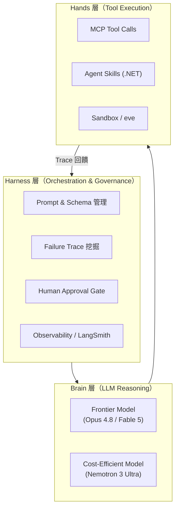
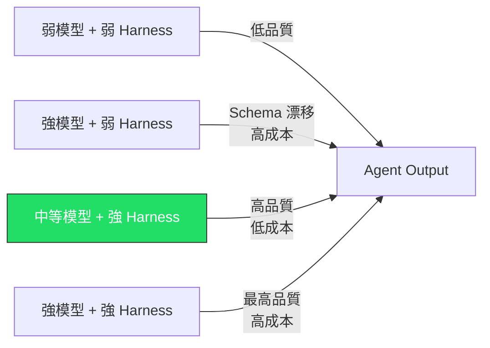
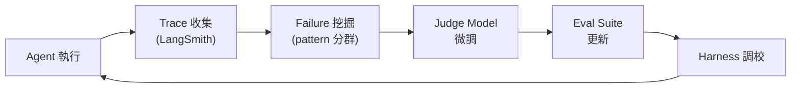
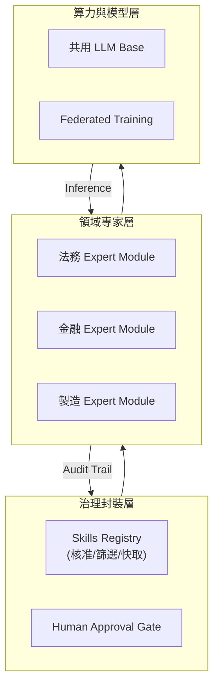
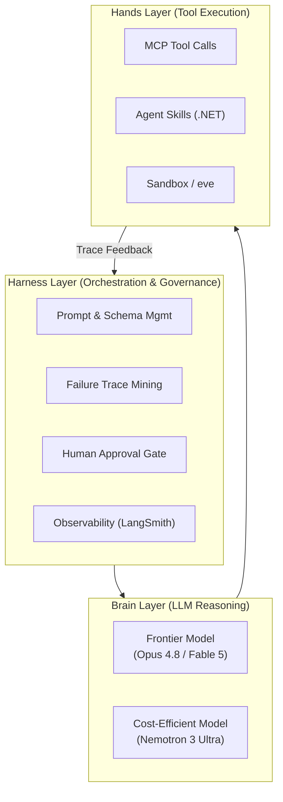

# Foundation — Track C: Agent 架構模式

_Week 2026-W28 · 25 items synthesized · $0.7161 USD_

# 生產級 Agent 架構的三重解耦：Harness、Brain、Hands 在 2026 年中的設計收斂

## TL;DR (3 句繁中)
1. 2026 年中，production agent 架構已從「選哪個模型」的思維收斂到「調校 harness 而非模型」的設計範式，harness 工程（scaffolding、prompt、tool schema、failure recovery pipeline）成為主要 ROI 槓桿。
2. 核心 trade-off 在於 harness 彈性 vs. 可審計性：越多的自主 loop（ReAct、Reflexion、RSI）帶來越高的 capability ceiling，但也帶來認知債務（cognitive debt）、schema 漂移、以及不可預測的 failure mode。
3. 對 Livia 而言，這意味著向台灣金融與製造業客戶銷售 AI 轉型時，架構提案的重心應從「模型選型」轉移到「harness 設計 + 可觀測性 + 治理封裝」，這才是 enterprise 實際付費的能力。

## 背景與問題框架

[推論] 六個月前（2025 年底至 2026 年初），production agent 的討論焦點還在「ReAct vs. Plan-and-Execute」、「single agent vs. multi-agent」這類架構選型問題上。當時的隱含假設是：選對架構模式，agent 就能跑起來。但本週的多條訊號共同揭示了一個不同的現實：**架構模式本身已經商品化，真正的差異化來自 harness 層的工程實踐**——包括 prompt 調校、tool schema 治理、failure trace 挖掘、人工核准流程、以及 agent 可觀測性。

[原文] LangChain 的 Harrison Chase 本週明確提出「[Tuning the harness, not the model](https://www.langchain.com/blog/tuning-the-harness-not-the-model-a-nemotron-3-ultra-playbook)」這一操作原則：他們用 Nemotron 3 Ultra（一個 cost-efficient 模型）透過純 scaffolding 調校，達到了 Opus 4.8 最佳 agent run 的效能，成本降低約 8 倍。同時，[Simon Willison 記錄了 Opus 4.8 反而在 tool-calling 上出現 schema 幻覺](https://simonwillison.net/2026/Jul/4/better-models-worse-tools/)——模型更強，但 tool 使用品質更差。這兩個訊號交叉指向同一結論：**模型能力與 agent 品質之間的關係不是線性的，harness 是調節變數**。

[推論] 與此同時，Lilian Weng 的 [Harness Engineering for Self-Improvement](https://lilianweng.github.io/posts/2026-07-04-harness/) 從 RSI（Recursive Self-Improvement）角度建立了 harness 概念的理論框架，將 agent harness 定位為「模型自我改進循環中的外部結構」。NVIDIA 的 [Nemotron Post-Training Data for Agents](https://huggingface.co/blog/nvidia/open-data-for-agents) 則從 data pipeline 角度論證「agent 的穩健性是 post-training data 問題」。三條路徑——scaffolding 調校、self-improvement harness、post-training data engineering——在本週同時成熟，構成了 production agent 架構的新共識。

## 核心概念解析（含 Mermaid 圖）

### 一、三層解耦架構：Brain / Hands / Harness

[推論] 綜合本週訊號，production agent 的組件可以解耦為三個清晰的層次：**Brain**（LLM 推理核心）、**Hands**（tool-calling、API 交互、file 操作）、**Harness**（orchestration、prompt engineering、failure recovery、governance、observability）。關鍵洞見：**大多數 enterprise 的工程投入應集中在 Harness 層**，因為 Brain 層正在快速商品化（inference 成本年降 50x），而 Hands 層由 MCP、Agent Skills 等標準逐漸收斂。

下圖展示三層解耦模型與各層的主要工程關注點：

**關鍵洞見**：trace 回饋迴路（Hands → Harness）才是持續改進的引擎。LangChain 的 [failure mining pipeline](https://www.langchain.com/blog/improving-agents-is-a-data-mining-problem) 正是這條迴路的具體實作。

### 二、Harness Tuning 的量化論證

[原文] Harrison Chase 的 Nemotron playbook 提供了一個可量化的案例：在 agent coding task 上，Nemotron 3 Ultra + 調校過的 harness ≈ Opus 4.8 + 預設 harness，而成本差距約 8x。[來源](https://www.langchain.com/blog/tuning-the-harness-not-the-model-a-nemotron-3-ultra-playbook)

[原文] 同時，Simon Willison 記錄了 [Opus 4.8 的 tool-calling regression](https://simonwillison.net/2026/Jul/4/better-models-worse-tools/)：模型在 nested `edits[]` array 中「發明」了不存在於 schema 的欄位。tool call 本身語意正確，但 schema 驗證失敗導致 retry loop。

[推論] 這揭示了一個反直覺的 pattern：**frontier model 的 capability ceiling 提升，可能同時降低 tool-calling 的 schema compliance**。較強的模型有更強的「自主填充」傾向，會在 structured output 中插入它認為「有幫助」但 schema 未定義的欄位。這意味著 harness 層必須包含嚴格的 schema validation + graceful retry，而非假設「更強模型 = 更好 tool use」。

以下圖展示 harness tuning 與 model capability 之間的非線性關係：

**關鍵洞見**：路徑 C（中等模型 + 強 harness）在 cost/quality Pareto frontier 上往往優於路徑 B（強模型 + 弱 harness）。Enterprise 客戶的預設選項應是 C。

### 三、Agent 改善是資料挖掘問題

[原文] Harrison Chase 的另一篇文章 「[Improving Agents is a Data Mining Problem](https://www.langchain.com/blog/improving-agents-is-a-data-mining-problem)」將 agent 的持續改善定義為一個 closed-loop data pipeline：收集 agent traces → 識別 failure patterns → fine-tune 輕量 judge model（而非 frontier LLM）→ 用 eval 做 hill-climbing。

[推論] 這個 pattern 與 NVIDIA 的 [open data for agents](https://huggingface.co/blog/nvidia/open-data-for-agents) 形成互補。NVIDIA 論證「agent 穩健性始於 post-training data」——包括 tool-use failure traces、multi-step reasoning logs、recovery scenarios。兩者共同指向一個結論：**production agent 的真正護城河不是模型，而是 failure trace 的累積與利用**。

**關鍵洞見**：這是一個 flywheel，而非一次性設計。Schneider Electric 的 [LLMOps 案例](https://www.langchain.com/blog/how-schneider-electric-built-their-llmops-foundations-at-enterprise-scale-with-langsmith) 佐證了這個 flywheel 在 enterprise scale 的可行性——他們的 observability 基礎建設正是為了驅動這個循環。

### 四、認知債務與人機協作的邊界

[原文] Geoffrey Litt（經 [Simon Willison 引述](https://simonwillison.net/2026/Jul/2/understand-to-participate/)）提出「Understand to Participate」原則：開發者必須維持對 agent 產出的理解深度，否則累積的認知債務（cognitive debt）會導致無法有效參與後續迭代。Kenton Varda 則從另一角度呼應，[宣布禁止 AI 撰寫 commit message](https://simonwillison.net/2026/Jul/8/kenton-varda/)，因為 AI 產出的變更描述「worse than useless」——列出了看代碼就能知道的細節，卻遺漏了高階語意框架。

[推論] 這兩個訊號指向同一個 agent 架構設計原則：**agent loop 中必須有「語意還原」步驟**——不只是 summarize what was done，而是 explain why in a frame the human can use to participate further。這不是 nice-to-have，而是架構層面的 requirement。沒有這一步，human-in-the-loop 會退化為 human-rubber-stamping-the-loop。

### 五、治理封裝：Agent Skills 與 Federated Expertise

[原文] Microsoft 釋出的 [Agent Skills for .NET](https://www.ithome.com.tw/news/177187) 將政策、文件、腳本封裝為可重複使用的「技能」，並內建人工核准、篩選、快取、腳本執行控管機制。[AI2 的 FlexMoRE 架構](https://allenai.org/blog/flexmore) 則從模型架構層解決 federated expertise pooling——讓各機構貢獻 domain expert modules，無需共享原始資料。

[推論] 這兩者共同指向 enterprise agent 的一個核心需求：**能力封裝 + 存取治理**。台灣法務部的 [三層平臺架構](https://www.ithome.com.tw/news/177202)（算力層 → 法務 LLM → AI Agent）正是這個 pattern 的政府部門實踐，與金管會的金融 LLM 專案形成對照。

**關鍵洞見**：治理封裝層是 enterprise 願意付費的差異化功能。沒有 audit trail 和 approval gate，agent 在受監管產業無法上線。

## 與既有框架的對位

[推論] 本週的 harness-centric 設計範式可以對位到幾個 canonical 框架：

**1. Chip Huyen 的 ML 系統設計框架**：Chip Huyen 在 *Designing Machine Learning Systems*（2022）中將 ML 系統分為 data layer、model layer、serving layer。今天的 agent 架構可以視為在 serving layer 之上新增了 harness layer。Huyen 強調的 data flywheel（production data → retraining）在 agent 領域變成了 trace flywheel（agent traces → harness tuning）。LangChain 的 failure mining pipeline 是這個 flywheel 的直接實作。

**2. NIST AI RMF（風險管理框架）**：NIST RMF 的 Govern → Map → Measure → Manage 四環，在 agent 架構中分別對應到：Skills governance（Govern）→ tool schema mapping（Map）→ eval/observability（Measure）→ harness tuning（Manage）。Microsoft 的 Agent Skills for .NET 提供的核准/篩選/快取機制，是 Govern 環的具體技術實作。對受監管的台灣金融業，這個 mapping 有直接的 compliance 價值。

**3. Anthropic RSP / METR 的 researcher uplift 量化**：[METR 的分析](https://metr.org/notes/2026-07-08-anthropic-researcher-uplift/) 指出 Anthropic 報告的「8x code merge 量」不等於「8x researcher output」，因為 code 量與 research output 的關係是非線性的（8 ≈ e²，plausible researcher uplift 可能只有 ~2x）。這個分析框架對 agent ROI 估算極為重要：企業不應把 agent 的 task completion rate 等同於 business value uplift。兩者之間的 conversion factor 取決於 task 的 business criticality distribution，這是 harness 層需要度量的。

**4. Karpathy 的 "Software 2.0" 論述（2017）**：Karpathy 認為神經網路是新的 runtime，data 是新的 code。Agent 時代的更新版：**harness 是新的 software engineering surface，traces 是新的 codebase**。模型權重是 commodity，harness configuration + accumulated traces 才是 IP。

## Trade-offs 與爭議

**1. Harness Complexity vs. Model Capability Investment**
- **正方**：LangChain 的 Nemotron playbook 證明 harness tuning 可以在 8x 成本節省下達到同等品質。對 budget-constrained 的 enterprise 客戶，這是明確的 ROI。
- **反方**：harness 是 brittle engineering——高度依賴 specific model behavior。當底層模型 API 更新（如 Opus 4.8 的 schema 幻覺），精心調校的 harness 可能瞬間失效。模型能力投資（直接用更強模型）提供更穩健的 baseline。
- **立場**：[推論] 兩者不是 either/or。正確的策略是 **harness-first, model-upgrade-when-harness-saturates**。但 harness 設計必須包含 model migration abstraction layer。

**2. Agent Autonomy vs. Cognitive Debt**
- **正方**：更長的 agent loop（hours-long sessions，如 [ChatGPT Work](https://openai.com/index/chatgpt-for-your-most-ambitious-work/)）能完成更複雜的多步驟任務。
- **反方**：Geoffrey Litt 的「Understand to Participate」警告：human oversight 的有效性隨 loop 長度指數衰減。Kenton Varda 的 commit message 禁令是認知債務具體化的案例。
- **立場**：[推論] 每個 agent loop 需要 **structured checkpoints** 產出 human-readable semantic summaries，而非 task logs。這是架構 requirement，不是 UX feature。

**3. Federated Expertise Pooling vs. Data Sovereignty**
- **正方**：FlexMoRE 式的 modular expert architecture 讓機構共享能力而不共享資料，完美匹配台灣的主權 AI 需求（法務部、金管會案例）。
- **反方**：expert module 本身可能 leak training data distribution information（membership inference、model inversion attack）。「不共享資料」不等於「不暴露資料特徵」。
- **立場**：[推論] 需要配套的 differential privacy 或 secure aggregation 機制。台灣客戶應要求 vendor 提供隱私保證的技術證明，而非僅靠架構宣稱。

**4. Eval Benchmark 信度**
- **正方**：OpenAI 的 [SWE-Bench Pro 批判](https://openai.com/index/separating-signal-from-noise-coding-evaluations/) 揭示了 popular benchmark 的 noise 問題，推動更嚴謹的 eval methodology。
- **反方**：frontier lab 批判自家表現不佳的 benchmark 存在動機偏差。需要獨立第三方 eval 治理。
- **立場**：[推論] Enterprise 客戶不應直接引用 public benchmark 數據做採購決策。應建立 domain-specific eval suite（如金融法規 QA、製造 SOP 遵循），這本身就是 harness engineering 的一部分。

## 對 Livia IBM 客戶的具體含意

**1. 國泰 / 玉山金控：Harness-First 提案策略**
[推論] 台灣金融機構常見的 RFP 思路是「選最強的模型」。本週的證據支持一個反向提案：先定義 harness architecture（含 tool schema governance、failure trace pipeline、human approval gate），再論證「在這個 harness 下，中等模型（如 Nemotron 3 Ultra、Llama 系列）已可達到 frontier 水準，成本低 8x」。這個提案同時解決合規問題（audit trail 內建）和預算問題（低成本模型）。

**2. 法務部 / 金管會：三層平臺的 IBM 角色**
[原文] 法務部的三層架構（算力 → 法務 LLM → AI Agent）與 IBM 的 watsonx 平台（watsonx.ai → watsonx.data → watsonx.governance）有結構性對應。Livia 可以提案：IBM 提供 governance 層（watsonx.governance 的 factsheet、bias detection、audit trail）+ 開放模型 base（Granite），讓法務部在 sovereign infra 上建構 domain agent。

**3. 台積電 / 鴻海：Agent Skills 封裝製造知識**
[推論] Microsoft 的 Agent Skills for .NET 模式直接適用於製造業知識封裝：將 SOP、品質規範、設備參數封裝為 skill modules，由 agent 按需調用，配合人工核准 gate 確保關鍵操作有 human oversight。IBM 可以用 watsonx.ai 的 function calling + watsonx.governance 的 approval workflow 提供類似能力，避免客戶鎖死在 Microsoft 生態。

**4. 通用警示：不要賣 "autonomous agent"，賣 "governed agent with trace flywheel"**
[推論] 台灣金融監管環境（金管會 AI 指引）要求可解釋性與可審計性。任何「autonomous agent」的提案都會撞牆。正確的定位是「governed agent」——有 approval gates、有 trace 可供事後審查、有 eval 持續度量品質。trace flywheel 還提供持續改善的故事，讓客戶看到長期價值而非一次性 POC。

## 對 Livia harness engineer portfolio 的含意

**1. Design Note 提取：「Harness-First Agent Architecture」**
本週深讀的核心論點可以直接轉化為一份 design note：「為什麼 production agent 的 ROI 槓桿在 harness 而非 model，以及如何設計 harness 以達到 model-agnostic robustness」。這份 note 展示了系統思維，而非只是「我會用 LangChain」。

**2. 面試問答框架：「Better Models, Worse Tools 的解法」**
Opus 4.8 的 schema 幻覺問題是一個完美的面試 scenario answer：「Tell me about a time you dealt with an unexpected system failure.」答案結構：frontier model 升級導致 tool-calling regression → root cause 是 schema compliance 問題 → 解法是 harness 層加入 strict schema validation + structured retry with schema re-injection → 設計原則是 defensive harness design，不假設 model upgrade 是 monotonic improvement。

**3. Portfolio Narrative 連結**
Livia 的 portfolio 故事線應該是：「我不只是會串 API 的 builder，我理解 production agent system 的架構層次、trade-offs、以及治理需求——這正是 enterprise AI 轉型需要的 harness engineering 思維。」本週深讀提供了具體的 canonical references（LangChain Nemotron playbook、Geoffrey Litt 的 cognitive debt 框架、METR 的 uplift 量化方法）來支撐這個 narrative。

**4. 可以建構的 Demo**
用 LangGraph + LangSmith 建一個 mini agent（例如簡易 VC memo generator，參考 [Perplexity + LangGraph 案例](https://www.langchain.com/blog/build-an-auditable-vc-research-agent-with-the-perplexity-agent-api-langgraph-and-langsmith)），但重點不是 agent 功能，而是展示 harness 層的三個治理元素：(a) tool schema validation with retry，(b) structured checkpoint summaries for human review，(c) failure trace 收集與分析 dashboard。這三個元素才是面試時讓人眼睛一亮的東西。

---

# (English) The Triple Decoupling of Production Agent Architecture: Harness, Brain, and Hands Converge in Mid-2026

## TL;DR (3 sentences)
1. By mid-2026, production agent architecture has converged from "which model to pick" toward "tune the harness, not the model" — scaffolding, prompt management, tool schema governance, and failure recovery pipelines are now the primary ROI lever.
2. The core trade-off is harness flexibility vs. auditability: deeper autonomous loops (ReAct, Reflexion, RSI) raise the capability ceiling but also introduce cognitive debt, schema drift, and unpredictable failure modes.
3. For Livia, this means that when selling AI transformation to Taiwan banks and manufacturers, the proposal center of gravity should shift from model selection to harness design + observability + governance encapsulation — this is the capability enterprises actually pay for.

## Background & Problem Framing

[Inference] Six months ago, the production agent conversation centered on architectural pattern selection: "ReAct vs. Plan-and-Execute," "single agent vs. multi-agent." The implicit assumption was that choosing the right architecture pattern would make agents work. This week's signals collectively reveal a different reality: **architecture patterns are commoditizing; the true differentiator is harness-layer engineering** — including prompt tuning, tool schema governance, failure trace mining, human approval workflows, and agent observability.

[Source] LangChain's Harrison Chase this week explicitly articulated "[Tuning the harness, not the model](https://www.langchain.com/blog/tuning-the-harness-not-the-model-a-nemotron-3-ultra-playbook)" as an operating principle: they tuned Nemotron 3 Ultra's harness to match Opus 4.8's best agent run at ~8x lower cost, changing only the scaffolding. Meanwhile, [Simon Willison documented Opus 4.8's tool-calling regression](https://simonwillison.net/2026/Jul/4/better-models-worse-tools/) — the model invented non-existent fields in nested tool call schemas. Stronger model, worse tool use. Both signals converge on the same conclusion: **the relationship between model capability and agent quality is non-linear; the harness is the moderating variable**.

[Inference] Simultaneously, Lilian Weng's [Harness Engineering for Self-Improvement](https://lilianweng.github.io/posts/2026-07-04-harness/) established a theoretical framework for the harness concept from an RSI (Recursive Self-Improvement) perspective, positioning the agent harness as "external structure in the model's self-improvement loop." NVIDIA's [open data for agents](https://huggingface.co/blog/nvidia/open-data-for-agents) argued from a data pipeline angle that "agent robustness is a post-training data problem." Three converging paths — scaffolding tuning, self-improvement harness theory, post-training data engineering — matured simultaneously this week, forming the new consensus for production agent architecture.

## Core Concepts (with Mermaid diagrams)

### 1. The Three-Layer Decoupling: Brain / Hands / Harness

[Inference] Synthesizing this week's signals, production agent components decouple into three clear layers: **Brain** (LLM reasoning core), **Hands** (tool-calling, API interaction, file operations), and **Harness** (orchestration, prompt engineering, failure recovery, governance, observability). The key insight: **most enterprise engineering effort should concentrate on the Harness layer**, because Brain is rapidly commoditizing (inference costs dropping ~50x/year per [BAIR analysis](http://bair.berkeley.edu/blog/2026/07/07/intelligence-is-free-now-what/)), and Hands are converging toward standards like MCP and Agent Skills.

**Key insight**: The trace feedback loop (Hands → Harness) is the engine of continuous improvement. LangChain's [failure mining pipeline](https://www.langchain.com/blog/improving-agents-is-a-data-mining-problem) is the concrete implementation of this loop.

### 2. The Harness Tuning Argument, Quantified

[Source] Harrison Chase's Nemotron playbook provides a quantifiable case: on agent coding tasks, Nemotron 3 Ultra + tuned harness ≈ Opus 4.8 + default harness, at ~8x lower cost. [Source](https://www.langchain.com/blog/tuning-the-harness-not-the-model-a-nemotron-3-ultra-playbook)

[Source] Meanwhile, Willison documents [Opus 4.8's tool-calling regression](https://simonwillison.net/2026/Jul/4/better-models-worse-tools/): the model "invented" fields not in the schema within nested `edits[]` arrays. The tool call was semantically correct, but schema validation failures triggered retry loops.

[Inference] This reveals a counter-intuitive pattern: **frontier model capability improvements can simultaneously degrade tool-calling schema compliance**. Stronger models have stronger "helpful completion" tend
