# 🗞️ AI Intel Digest — 2026-W29

_Generated 2026-07-16 23:48 UTC · 98 high-signal items synthesized · $0.4024 USD cost · ~100 分鐘讀完_


## ⚡ 本週 TL;DR — 5 Pillar 各一句
- 🏦 **P1**: IBM 供應商測試環境洩露 7 萬人個資：vendor dev/test 治理缺口的真實案例
- 📊 **P2**: Narayanan／Kapoor 在 ICML 2026 提出：AI commoditization 正將真正的 lock-in 風險上移至 stack 頂層
- 🚀 **P3**: OpenAI GPT-Red：自我對戰強化學習，將提示注入攻擊成功率壓至 0.05%
- 🛠️ **P4**: xAI Grok-build、GPT-5.6 Codex 同週爆出資料外洩與誤刪檔案：tool 權限設計是生產部署的護城河
- 🌐 **P5**: Narayanan：AI 不是商品——平台鎖定風險才是企業真正的戰場

## 📊 本期 provenance 分布（合成證據強度）

_本期合成共 81 段，標記為：_

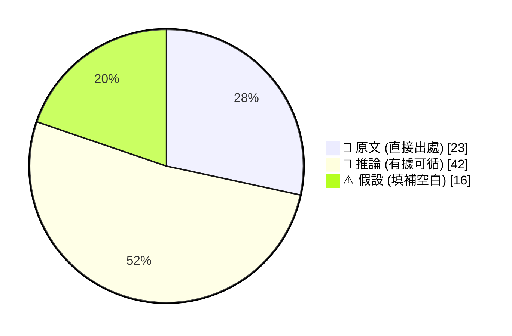

_引用規範：📖 可直接引用；🧠 客戶會議前查 verification hints；⚠️ 引用時明說「此為推測」_

## 🔄 本期 pipeline 處理流程

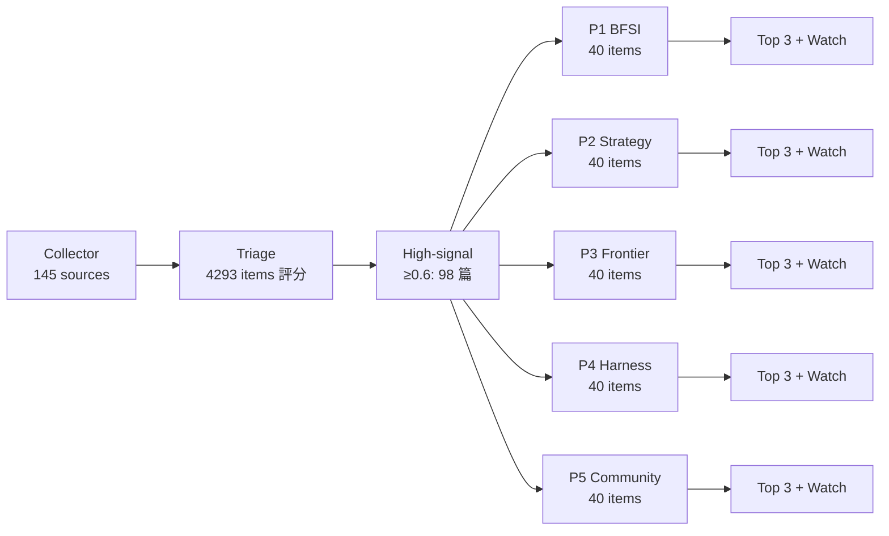

## 📑 目錄
- [Pillar 1 — 產業 AI 真實落地 (BFSI + 製造業)](#pillar-1) · 16 items · $0.0850
- [Pillar 2 — AI 戰略 / 治理 / 董事會層級論述](#pillar-2) · 17 items · $0.0733
- [Pillar 3 — Frontier 能力 + 模型動向](#pillar-3) · 15 items · $0.0805
- [Pillar 4 — Harness Engineering 實作技藝](#pillar-4) · 40 items · $0.1030
- [Pillar 5 — 學派 / 社群 / 思想動態](#pillar-5) · 10 items · $0.0606
- [📚 Foundation 深讀](#foundation) · curriculum 主題深度文


---

<a id="pillar-1"></a>

## 🏦 Pillar 1 — 產業 AI 真實落地 (BFSI + 製造業)
_16 items · $0.0850_

## Pulse — Top 3

### 1. IBM 供應商測試環境洩露 7 萬人個資：vendor dev/test 治理缺口的真實案例

📖 **原文** 新加坡土地管理局（SLA）確認，IBM 在執行兩套系統的開發與測試工作時，測試資料未進行去識別化（de-identification），導致開發/測試環境遭非法存取後約 7 萬人個資外洩。這不是模型風險，而是最基本的 data governance 失敗：vendor 拿真實 PII 跑 dev/test。

🧠 **推論** 對 Taiwan 銀行客戶而言，這個模式高度熟悉——外包廠商取得生產資料做測試是普遍慣例，FSC 的「金融資料治理」要求雖存在，但 vendor 端的執行稽核往往是盲點。IBM 作為本案的責任方，恰好也是 Livia 正在銷售的品牌，這個案例在客戶對話中必須主動處理而非迴避。

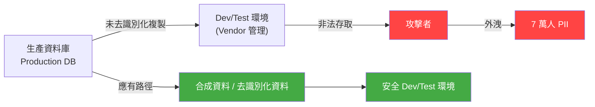

*關鍵洞察：問題不在 AI 模型，而在 vendor 是否對 dev/test 環境的資料存取建立與生產環境同等的 data classification 與稽核機制。*

- 來源：[iThome](https://www.ithome.com.tw/news/177351)
- 對客戶的具體含意：在與 Cathay、CTBC、E.SUN 討論 AI 導入時，主動提出「vendor dev/test 資料去識別化稽核」作為 IBM 合約 SOW 的標準條款，將此案例轉化為差異化的治理承諾而非品牌負債。

---

**(English)** IBM vendor dev/test environment exposes 70,000 records in Singapore: a real-world PII governance failure pattern

📖 **原文** Singapore's Singapore Land Authority (SLA) confirmed that IBM, while developing and testing two systems, failed to de-identify test data — resulting in unauthorized access to the dev/test environment and exposure of approximately 70,000 individuals' personal data. This is not a model risk failure; it is a fundamental data governance breakdown: a vendor using real PII in dev/test.

🧠 **推論** For Taiwan's banking clients, this pattern is highly familiar — vendors accessing production data copies for testing is common practice, and while the FSC's data governance requirements exist, audit enforcement on the vendor side is typically a blind spot. The fact that IBM is the responsible party here — and also the brand Livia is actively selling — means this case must be addressed proactively in client conversations, not avoided.


*Key insight: The failure is not in the AI model — it is in whether the vendor applies production-equivalent data classification and access audit controls to dev/test environments.*

- Source: [iThome](https://www.ithome.com.tw/news/177351)
- Client implication: When scoping AI engagements with Cathay, CTBC, or E.SUN, proactively include "vendor dev/test data de-identification audit" as a standard SOW clause — converting this case from a brand liability into a differentiated governance commitment.

---

### 2. AWS 宣告 2026 為「Agent AI 元年」：企業 AI 競爭從模型轉向流程完成度

📖 **原文** 在 AWS Summit Taipei 2026 主題演說中，AWS 正式宣告生成式 AI 兩年快速發展後，企業競爭焦點已從 LLM 本身轉向「讓 AI 真正走進企業流程、完成工作」，並一次推出涵蓋 AI agent 開發、執行、知識管理、軟體維運與資安治理的完整企業平臺。

🧠 **推論** 這與 OpenAI 同週發出的訊號高度一致（item 2563）：兩大平臺同時將 enterprise AI agents 定位為「下一個戰場」，代表市場敘事正在收斂。對 Livia 的 Taiwan 銀行與製造業客戶而言，這意味著「買模型」的對話窗口正在縮小，客戶採購問題很快會變成「你的 agent 能整合進我的 core banking / MES 系統嗎」。

⚠️ **假設** AWS 在 Summit Taipei 特別強調台灣從晶片到生態系的角色，推測是針對台灣製造業（TSMC, Foxconn 生態系）的直接招商訊號，但具體的 pilot 客戶與定價尚未公開。

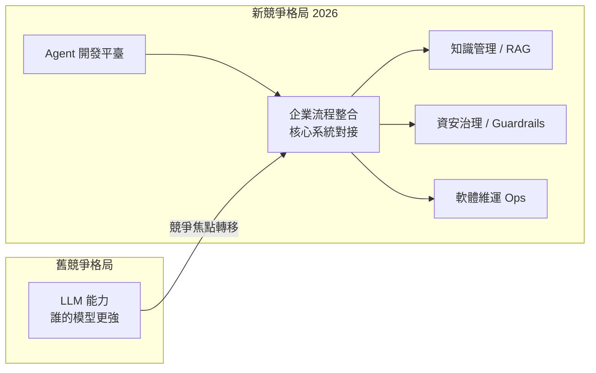

*關鍵洞察：AWS 與 OpenAI 同週收斂至同一敘事，代表「agent 能否完成企業流程」已成為 2026 下半年的主要採購評估維度。*

- 來源：[iThome](https://www.ithome.com.tw/news/177348) · [INSIDE 硬塞](https://www.inside.com.tw/article/41829-aws-summit-taipei-2026-agentic-ai)
- 對客戶的具體含意：與 Taipei Fubon、Taishin 等銀行的 AI 對話應從「選哪個 LLM」升級為「你的 loan origination 或 KYC 流程中，哪三個步驟可以先讓 agent 接管」，用流程完成度（task completion rate）而非模型 benchmark 當提案錨點。

---

**(English)** AWS declares 2026 the "Year of Agentic AI" at Summit Taipei: enterprise AI competition shifts from model capability to process completion

📖 **原文** At AWS Summit Taipei 2026, AWS formally declared that after two years of rapid generative AI development, enterprise competition has shifted from the LLM itself to "getting AI to genuinely enter enterprise processes and complete work" — announcing a full platform covering AI agent development, execution, knowledge management, software operations, and security governance in a single announcement.

🧠 **推論** This signal aligns tightly with OpenAI's messaging issued the same week (item 2563): two major platforms simultaneously positioning enterprise AI agents as the "next battleground" indicates narrative convergence. For Livia's Taiwan banking and manufacturing clients, this means the window for "which model should we buy" conversations is closing — procurement questions will rapidly become "can your agent integrate with my core banking or MES system?"

⚠️ **假設** AWS specifically highlighting Taiwan's role from chips to ecosystem at Summit Taipei is likely a direct recruitment signal aimed at Taiwan's manufacturing sector (TSMC, Foxconn ecosystem), but specific pilot clients and pricing have not been disclosed.


*Key insight: AWS and OpenAI converging on the same narrative in the same week signals that "can the agent complete enterprise processes" is the primary procurement evaluation dimension for H2 2026.*

- Source: [iThome](https://www.ithome.com.tw/news/177348) · [INSIDE 硬塞](https://www.inside.com.tw/article/41829-aws-summit-taipei-2026-agentic-ai)
- Client implication: Reframe AI conversations with Taipei Fubon and Taishin from "which LLM to choose" to "which three steps in your loan origination or KYC process can an agent take over first" — use task completion rate rather than model benchmarks as the proposal anchor.

---

### 3. TSMC CEO 魏哲家：先進製程產能缺口龐大，AI 需求驅動未來數年極佳前景

📖 **原文** 台積電 Q2 2026 法說會中，董事長魏哲家確認 AI 需求強勁驅動單季營收成長逾 40%，先進製程（含 A14 預計 2028 量產、A13/A12 接棒 2029）存在龐大產能缺口，並對未來數年維持樂觀展望。

🧠 **推論** 這個訊號對 Livia 的製造業客戶有兩層含意：第一，TSMC 本身的 AI 基礎設施投資規模（用於優化良率、製程監控、設備預測維護）將持續擴大，是直接的 IBM AI 銷售機會；第二，Foxconn、Pegatron、Quanta 等 TSMC 供應鏈客戶面臨「產能緊張下如何提升每片晶圓產值」的壓力，AI 驅動的製程最佳化說服力因此大幅提升。

⚠️ **假設** 魏哲家提到的「產能缺口」主要指 CoWoS 先進封裝與 2nm 以下節點，但法說會逐字稿尚未完整公開，具體缺口量化數字需要確認。

- 來源：[科技新報 — 魏哲家解析 AI 市況](https://finance.technews.tw/2026/07/16/tsmc-faces-a-huge-capacity-gap-in-advanced-process-technologies/) · [科技新報 — Q2 法說會重點](https://finance.technews.tw/2026/07/16/tsmc-earnings-call-26q2/)
- 對客戶的具體含意：向 TSMC 或 Foxconn 提案時，用「AI 需求持續超過產能」作為「現在投資 AI 製程最佳化」的時間壓力依據，而非抽象的效率論述——產能缺口讓每一個良率百分點都直接轉換為億元級營收。

---

**(English)** TSMC CEO Wei Che-chia: massive advanced-node capacity gap, AI demand drives multi-year strong outlook

📖 **原文** At TSMC's Q2 2026 earnings call, Chairman C.C. Wei confirmed that strong AI demand drove over 40% quarterly revenue growth, that significant capacity gaps exist in advanced processes (A14 targeted for 2028 mass production, A13/A12 following in 2029), and maintained an optimistic multi-year outlook.

🧠 **推論** This signal carries two layers of implication for Livia's manufacturing clients: first, TSMC's own AI infrastructure investment (for yield optimization, process monitoring, predictive equipment maintenance) will continue to expand, representing a direct IBM AI sales opportunity; second, supply chain clients such as Foxconn, Pegatron, and Quanta face intensified pressure to "maximize value per wafer under tight capacity" — making AI-driven process optimization far more persuasive as a pitch.

⚠️ **假設** Wei's "capacity gap" likely refers primarily to CoWoS advanced packaging and sub-2nm nodes, but the full earnings call transcript has not been fully published — specific gap quantification needs to be verified.

- Source: [TechNews — Wei on AI market](https://finance.technews.tw/2026/07/16/tsmc-faces-a-huge-capacity-gap-in-advanced-process-technologies/) · [TechNews — Q2 earnings highlights](https://finance.technews.tw/2026/07/16/tsmc-earnings-call-26q2/)
- Client implication: When proposing to TSMC or Foxconn, use "AI demand persistently outstripping capacity" as the time-pressure argument for investing in AI-driven process optimization now — the capacity gap means every percentage point of yield improvement translates directly into hundred-million-NTD revenue impact.

---

## Watch list

繁中為主，每條一行：

- [NVIDIA Blog](https://blogs.nvidia.com/blog/performance-per-watt-ai-infrastructure-efficiency/) — "Performance per watt" 作為 AI 基礎建設採購的不可博弈指標，對台灣銀行 AI infra capex 規劃有直接參考價值
- [OpenAI — Cars24](https://openai.com/index/cars24) — 1M+ 月對話分鐘、12% lost lead 回收，是客戶對話中「AI 客服 ROI」的具體佐證數據
- [OpenAI — Deutsche Telekom](https://openai.com/index/deutsche-telekom) — 跨客服/員工工作流/網路運維四域的大型 AI-native 電信轉型，架構面值得追蹤但缺乏量化指標
- [科技新報 — NVIDIA + Fujitsu + 日本機器人](https://technews.tw/2026/07/16/japans-robotics-leaders-unite-with-nvidia-to-take-on-china/) — 實體 AI 聯盟針對中國，對 Foxconn、Wistron 等台廠的自動化策略選邊有間接影響
- [iThome — Tracebit Context Bombs](https://www.ithome.com.tw/news/177359) — 針對惡意 AI agent 的 prompt injection 防禦技術，BFSI 雲端資安 ops 的新型態威脅向量
- [科技新報 — OpenAI 企業 AI agent 戰場](https://technews.tw/2026/07/17/secure-enterprise-ai-agents-emerge-as-new-battleground/) — OpenAI 官方定調 enterprise agent 為下一競爭主戰場，與 AWS Summit 訊號互相印證
- [OpenAI — GPT-5.6 in Microsoft 365 Copilot](https://openai.com/index/gpt-5-6-preferred-model-microsoft-365-copilot) — 台灣銀行大多已有 M365 授權，GPT-5.6 升級代表現有 Copilot 用戶無需額外採購即獲能力提升
- [AWS — Autel AI agents](https://aws.amazon.com/blogs/industries/how-autel-transformed-charging-station-management-with-ai-agents-on-aws/) — 五個專業化 AI agent 的多 agent 架構實例，製造業/運營管理的技術參考

---

## Verification hints

This briefing contains **4

🧠 **推論** segments** and **3

⚠️ **假設** segments**. Before citing in client conversations, verify these specific points (English for language-learning practice):

1. **IBM Singapore SLA incident scope**: The iThome article states ~70,000 individuals affected and confirms IBM notified SLA — verify whether the SLA public disclosure at [gov.sg] specifies which data categories (NRIC, financial, address) were exposed, as this affects how you frame the severity in FSC-regulated banking contexts.
2. **TSMC capacity gap specifics**: The TechNews articles cite CC Wei's optimistic multi-year outlook and 40%+ Q2 growth, but the claim that the "capacity gap" specifically refers to CoWoS advanced packaging and sub-2nm nodes is an inference from industry context — verify against the full TSMC Q2 2026 earnings call transcript or investor relations release before using specific node names with clients.
3. **AWS Summit Taipei agent platform specifics**: The iThome and INSIDE articles confirm AWS announced agent development + governance capabilities, but the claim that Taiwan manufacturing (TSMC/Foxconn ecosystem) was a named direct recruitment target is an inference from the "台灣從晶片到生態系" framing — verify whether AWS named specific Taiwan enterprise pilot customers in the full Summit keynote materials.
4. **Cars24 12% lead recovery figure**: The OpenAI blog states this metric — verify whether "12% lead recovery" means 12 percentage points absolute improvement or 12% relative lift on previously lost leads, as these differ substantially in how they should be quoted to banking clients estimating AI ROI.
5. **GPT-5.6 / M365 Copilot rollout timing for Taiwan tenants**: The OpenAI announcement confirms GPT-5.6 is the preferred model in M365 Copilot, but enterprise tenant rollout timelines often vary by region and license tier — verify whether Taiwan commercial M365 tenants have already received this update before telling clients it is live.2026-07-16 23:40:14,230 INFO pillar 2 (AI 戰略 / 治理 / 董事會層級論述): 17 high-signal items (min_signal=0.60)

---

<a id="pillar-2"></a>

## 📊 Pillar 2 — AI 戰略 / 治理 / 董事會層級論述
_17 items · $0.0733_

## Pulse — Top 3

### 1. Narayanan／Kapoor 在 ICML 2026 提出：AI commoditization 正將真正的 lock-in 風險上移至 stack 頂層

🧠 **推論** Arvind Narayanan（AI Snake Oil 共同作者）在 ICML 2026 主題演講及配套文章中主張，批評者和支持者都在錯誤的地方尋找 AI 競爭優勢——底層模型已趨向商品化，但各家廠商正透過 workflow integration、proprietary data flywheel 和 agent orchestration layer 重建 lock-in，這才是企業真正應警惕的戰略風險。

🧠 **推論** 對 Cathay、E.SUN 等正評估多年期 AI 平台合約的銀行而言，今天選擇的 agent framework（AWS Bedrock、Azure AI Foundry、OpenAI Assistants）將決定未來 3–5 年的轉換成本，遠比模型選擇本身更難逆轉。

以下示意 AI stack 各層的商品化程度與 lock-in 風險分布：

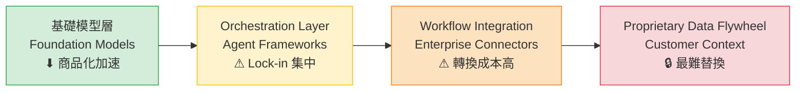

*關鍵洞察：模型層風險最低，data flywheel 與 orchestration layer 才是真正的護城河——也是最大的 vendor lock-in 點。*

- 來源：[AI Snake Oil — Up the Stack](https://www.normaltech.ai/p/up-the-stack-how-ais-escape-from-the-commodity-trap) ／ [ICML 2026 Keynote](https://www.normaltech.ai/p/what-will-be-left-for-us-to-work)
- 對客戶的具體含意：向 Cathay 或 CTBC 董事會提案時，合約條款應明確要求 data portability 與 API 中立性，而非只關注模型效能指標。

---

**(English)** Narayanan / Kapoor at ICML 2026: AI commoditization is moving the real lock-in risk up the stack

🧠 **推論** Arvind Narayanan (co-author of AI Snake Oil) argued in his ICML 2026 keynote and companion piece that both critics and boosters are looking for competitive advantage in the wrong place — foundation models are commoditizing, but vendors are rebuilding lock-in through workflow integration, proprietary data flywheels, and agent orchestration layers, which is where enterprises face the real strategic risk.

🧠 **推論** For banks like Cathay and E.SUN currently evaluating multi-year AI platform contracts, the agent framework chosen today (AWS Bedrock, Azure AI Foundry, OpenAI Assistants) will determine switching costs over the next 3–5 years — far harder to reverse than any model selection decision.


*Key insight: Model layer carries the lowest lock-in risk; data flywheel and orchestration layer are where competitive moats — and vendor dependency — actually accumulate.*

- Source: [AI Snake Oil — Up the Stack](https://www.normaltech.ai/p/up-the-stack-how-ais-escape-from-the-commodity-trap) / [ICML 2026 Keynote](https://www.normaltech.ai/p/what-will-be-left-for-us-to-work)
- Client implication: When presenting to Cathay or CTBC boards, contract terms should explicitly require data portability and API neutrality — not just negotiate on model performance benchmarks.

---

### 2. OpenAI 與 McKinsey 同周發布 Agentic AI ROI 框架，給出「useful work per dollar」作為董事會級衡量指標

📖 **原文** OpenAI 的文章標題直接點名：「measuring useful work per dollar, improving efficiency, and scaling high-value workflows」是企業管理 agentic era AI 投資的核心。

🧠 **推論** McKinsey QuantumBlack 同期發布的「Is that AI agent worth it?」從 capex 分配與 operating model 重構角度補充，兩份文件合讀形成一個完整的 board-level ROI 論述框架：投資依據從「模型能力」轉向「每美元可完成的高價值工作量」。

🧠 **推論** 對 IBM 顧問身份的 Livia 而言，這是一個立即可用的客戶對話鉤子——台灣銀行業 CIO 現在最常被 CFO 問的正是「我們花了這麼多，ROI 在哪裡？」，而「useful work per dollar」比 NPS 或 adoption rate 更容易與財務語言對齊。

- 來源：[OpenAI — Managing AI investments in the agentic era](https://openai.com/index/managing-ai-investments-in-agentic-era) ／ [McKinsey QuantumBlack — Agentic economics](https://www.mckinsey.com/capabilities/quantumblack/our-insights/is-that-ai-agent-worth-it-agentic-economics-and-the-modern-operating-model)
- 對客戶的具體含意：下次與 E.SUN 或 Taishin 的 AI 治理會議中，建議以「每個 agent workflow 每月節省多少 FTE 小時 × 時薪」作為 pilot KPI 取代模糊的「AI 使用率」，直接對接 CFO 語言。

---

**(English)** OpenAI and McKinsey publish agentic AI ROI frameworks in the same week, landing on "useful work per dollar" as the board-level metric

📖 **原文** OpenAI's piece is explicit: "measuring useful work per dollar, improving efficiency, and scaling high-value workflows" is the core of managing AI investment in the agentic era.

🧠 **推論** McKinsey QuantumBlack's concurrent "Is that AI agent worth it?" piece adds the capex allocation and operating model lens — reading both together yields a complete board-level ROI narrative: investment rationale shifts from "model capability" to "volume of high-value work completed per dollar spent."

🧠 **推論** For Livia in her IBM consulting role, this is an immediately deployable conversation hook — Taiwan bank CIOs are currently being pressed by CFOs on exactly this question, and "useful work per dollar" aligns with financial language far better than NPS scores or adoption rates.

- Source: [OpenAI — Managing AI investments in the agentic era](https://openai.com/index/managing-ai-investments-in-agentic-era) / [McKinsey QuantumBlack — Agentic economics](https://www.mckinsey.com/capabilities/quantumblack/our-insights/is-that-ai-agent-worth-it-agentic-economics-and-the-modern-operating-model)
- Client implication: In the next AI governance meeting with E.SUN or Taishin, propose "FTE hours saved per agent workflow per month × hourly rate" as the pilot KPI instead of vague "AI utilization" — it connects directly to CFO language.

---

### 3. Hugging Face 安全事件揭露：AI 平台供應鏈的 credential 管理是企業 AI 治理的真實盲點

📖 **原文** Hugging Face 公告確認：「unauthorized access to a limited set of internal datasets and to several credentials used by our services」，入侵起點在 AI 供應鏈環節，目前仍在評估是否有 partner 或 customer 資料受影響。

🧠 **推論** 這個事件對台灣金融業的直接含意不在於 Hugging Face 本身——多數銀行不直接使用其平台——而在於它暴露的模式：企業 AI 部署通常透過多層 API、第三方 model hub 和 orchestration service 串接，每一個 credential 交接點都是潛在的滲透入口，但現行 IT 治理框架往往將 AI service credentials 視為普通 API key 管理，缺乏 AI-specific 的 secret rotation 和 access scope 審計。

⚠️ **假設** 若台灣金融監督管理委員會（FSC）跟進要求 AI 第三方服務商的 supply chain security 審計，銀行現有的 vendor risk assessment 流程可能不足以涵蓋 model hub 和 agent credential 的風險面向。

- 來源：[Hugging Face — Security incident disclosure, July 2026](https://huggingface.co/blog/security-incident-july-2026)
- 對客戶的具體含意：建議 Cathay 或 Mega Bank 的 CISO 立即盤點所有 AI 相關 service account 的 credential scope，確認是否有超過最小權限原則（least privilege）的 API key 流通於 CI/CD pipeline 或 agent workflow 中。

---

**(English)** Hugging Face security incident reveals: AI platform credential management is the real blind spot in enterprise AI governance

📖 **原文** Hugging Face's disclosure confirms: "unauthorized access to a limited set of internal datasets and to several credentials used by our services," with the intrusion originating in the AI supply chain layer, and assessment of partner/customer data impact still ongoing.

🧠 **推論** The direct implication for Taiwan's financial sector isn't about Hugging Face itself — most banks don't use the platform directly — but about the pattern it exposes: enterprise AI deployments are typically assembled across multi-layer APIs, third-party model hubs, and orchestration services, with every credential handoff point a potential infiltration vector, yet existing IT governance frameworks tend to treat AI service credentials like ordinary API keys, lacking AI-specific secret rotation and access scope auditing.

⚠️ **假設** If Taiwan's FSC follows up by requiring supply chain security audits of third-party AI service providers, existing bank vendor risk assessment processes likely won't cover the risk surface of model hubs and agent credentials adequately.

- Source: [Hugging Face — Security incident disclosure, July 2026](https://huggingface.co/blog/security-incident-july-2026)
- Client implication: Recommend that CISOs at Cathay or Mega Bank immediately audit all AI-related service account credential scopes to confirm no API keys with excess privileges are circulating in CI/CD pipelines or agent workflows.

---

## Watch list

繁中為主，每條一行：

- [iThome — AWS宣布2026進入Agent AI元年](https://www.ithome.com.tw/news/177348) — AWS 在 Taipei Summit 推出 agent 開發到資安治理全套平台，台灣銀行業評估 agent 建置路徑時的重要參照
- [INSIDE — AWS Summit Taipei 定調代理型AI元年](https://www.inside.com.tw/article/41829-aws-summit-taipei-2026-agentic-ai) — 補充台灣在地視角，強調台灣製造業與金融業不應只是旁觀者
- [Simon Willison — Directly Responsible Individuals](https://simonwillison.net/2026/Jul/12/directly-responsible-individuals/#atom-everything) — DRI 框架應用於 LLM agent 治理，組織問責制的實用設計模式，適合 harness 實作參考
- [科技新報 — 魏哲家解析AI市況，先進製程產能缺口龐大](https://finance.technews.tw/2026/07/16/tsmc-faces-a-huge-capacity-gap-in-advanced-process-technologies/) — TSMC CEO 親口確認 AI 需求帶來的先進製程缺口，是台灣製造業客戶 AI capex 規劃的背景脈絡
- [NVIDIA — Performance per Watt as AI Infrastructure Metric](https://blogs.nvidia.com/blog/performance-per-watt-ai-infrastructure-efficiency/) — performance-per-watt 作為 AI 工廠不可博弈的效率指標，對製造業客戶 AI infra 採購決策有直接參考價值
- [科技新報 — OpenAI：企業AI代理將成新戰場](https://technews.tw/2026/07/17/secure-enterprise-ai-agents-emerge-as-new-battleground/) — OpenAI 官方策略定位，可用於向客戶說明為何 2026 是 agent 佈局關鍵年
- [iThome — 蘋果Apple Intelligence取得中國備案](https://www.ithome.com.tw/news/177355) — Apple Intelligence 整合百度／阿里模型進中國市場，地緣科技監管動態值得金融業追蹤
- [Mistral — Prompts and Skills system of record](https://mistral.ai/news/manage-prompts-and-skills-in-studio/) — prompt 版本控制與 ownership 的治理框架，是 harness 工程實作中 prompt registry 設計的參考
- [Platformer — OpenAI's big launch and Fidji Simo departure](https://www.platformer.news/openai-gpt-5-6-simo-meta-muse-spark-1-1/) — GPT-5.6 發布同時 COO 離職，OpenAI 組織穩定性值得持續關注，影響長期合作風險評估

---

## Verification hints

This briefing contains **5**

🧠 **推論** segments and **1**

⚠️ **假設** segment. Before citing in client conversations, verify these specific points (English for language-learning practice):

1. **Lock-in stack analysis (Item 1):** The Narayanan/Kapoor pieces are excerpted very briefly — verify whether the ICML keynote and "Up the Stack" article explicitly name specific vendors (AWS Bedrock, Azure AI Foundry, OpenAI Assistants) as lock-in vectors, or whether that mapping is Livia's own inference applied to the framework. URLs: [ICML keynote](https://www.normaltech.ai/p/what-will-be-left-for-us-to-work) and [Up the Stack](https://www.normaltech.ai/p/up-the-stack-how-ais-escape-from-the-commodity-trap).
2. **"Useful work per dollar" as a named metric (Item 2):** Confirm this exact phrase appears in the [OpenAI article](https://openai.com/index/managing-ai-investments-in-agentic-era) (it is quoted in the excerpt), and verify whether the [McKinsey piece](https://www.mckinsey.com/capabilities/quantumblack/our-insights/is-that-ai-agent-worth-it-agentic-economics-and-the-modern-operating-model) uses compatible language or a different ROI framing — the synthesis of both into one framework is editorial inference.
3. **Hugging Face incident scope (Item 3):** The disclosure states assessment is still incomplete as of publication — verify whether any update has confirmed or ruled out partner/customer data exposure before citing in client risk discussions. URL: [incident disclosure](https://huggingface.co/blog/security-incident-july-2026).
4. **FSC regulatory follow-up (Item 3,

⚠️ **假設**):** There is no evidence in the source that Taiwan's FSC has signaled any response to this incident. This is speculative extrapolation from general regulatory pattern — do not present as a confirmed regulatory risk without independent verification of FSC communications.
5. **Deutsche Telekom deployment specifics (Watch list, item 108 not promoted):** The item was downgraded because the excerpt names domains (customer service, employee workflows, network ops) but contains no concrete metrics or rollback data. If citing Deutsche Telekom as a reference case to Taiwan telco or bank clients, verify whether the full [OpenAI article](https://openai.com/index/deutsche-telekom) contains quantitative outcomes or remains narrative.2026-07-16 23:41:39,909 INFO pillar 3 (Frontier 能力 + 模型動向): 15 high-signal items (min_signal=0.60)

---

<a id="pillar-3"></a>

## 🚀 Pillar 3 — Frontier 能力 + 模型動向
_15 items · $0.0805_

## Pulse — Top 3

### 1. OpenAI GPT-Red：自我對戰強化學習，將提示注入攻擊成功率壓至 0.05%

📖 **原文** OpenAI 建立內部安全紅隊模型 GPT-Red，透過 self-play 強化學習自動生成 prompt injection 攻擊向量，找出 product model 與 AI agent 系統弱點，再將攻擊樣本納入後續訓練循環。結果：GPT-5.6 Sol 面對 GPT-Red 直接提示注入時，攻擊成功率僅 **0.05%**。

🧠 **推論** 這個數字對台灣銀行客戶的意義在於：當你在 Cathay 或 E.SUN 的 agentic workflow 裡讓 LLM 接觸外部資料（客戶信件、PDF、網頁抓取），prompt injection 是最現實的攻擊面，0.05% 提供了一個可對 FSRA/主管機關引用的具體基準線。

🧠 **推論** 這個 self-play red-teaming 循環本身也是一個 harness 工程範式：可在 Livia 的 pipeline 中仿製「攻擊模型 vs. 防禦模型」的 CI 測試層。

下圖說明 GPT-Red 的自我強化訓練循環：

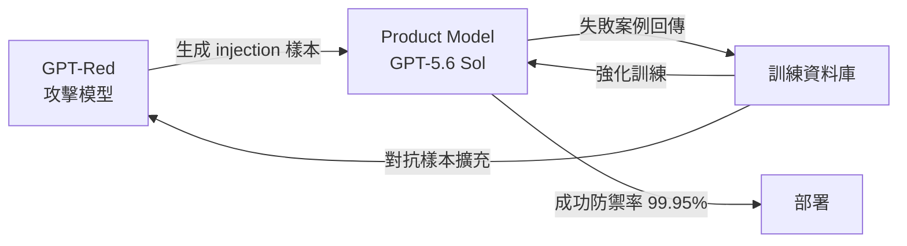

*GPT-Red 與 Product Model 形成閉環：攻擊失敗的案例同時強化防禦模型，是 CI 層自動化安全測試的模板。*

- 來源：[iThome](https://www.ithome.com.tw/news/177372)、[OpenAI Blog](https://openai.com/index/unlocking-self-improvement-gpt-red)
- 對客戶的具體含意：向台灣銀行 CISO 簡報 agentic system 安全性時，可直接引用「GPT-5.6 Sol 的 prompt injection 抵抗率 99.95%」作為基準，並建議在行內 pilot 中同步建立 red-team CI 測試層，而非僅依賴靜態滲透測試。

**(English)** OpenAI GPT-Red: Self-play RL Drives Prompt Injection Success Rate Down to 0.05%

📖 **原文** OpenAI built an internal safety red-teaming model, GPT-Red, which uses self-play reinforcement learning to automatically generate prompt injection attack vectors, identify weaknesses in product models and AI agent systems, then incorporate those attacks into subsequent training cycles. Result: GPT-5.6 Sol faces a prompt injection success rate of only **0.05%** against GPT-Red's direct attacks.

🧠 **推論** For Taiwan bank clients, this metric matters because any agentic workflow at Cathay or E.SUN that exposes an LLM to external data (customer emails, PDFs, web-scraped content) has prompt injection as its most realistic attack surface — 0.05% provides a concrete benchmark citable to FSRA/regulators.

🧠 **推論** The self-play red-teaming loop itself is a harness engineering paradigm: Livia can replicate an "attacker model vs. defender model" CI test layer in her own pipeline as a portfolio artifact.


*GPT-Red and Product Model form a closed loop: failed attacks simultaneously harden the defense model — a template for automated CI-layer security testing.*

- Source: [iThome](https://www.ithome.com.tw/news/177372), [OpenAI Blog](https://openai.com/index/unlocking-self-improvement-gpt-red)
- Client implication: When briefing Taiwan bank CISOs on agentic system security, cite "GPT-5.6 Sol's 99.95% prompt injection resistance" as a baseline and recommend building a red-team CI test layer alongside any pilot — not relying solely on static penetration testing.

---

### 2. Thinking Machines Lab Inkling：975B 參數開源多模態模型，1M context，Apache 2.0

📖 **原文** Mira Murati 的 Thinking Machines Lab 發布 Inkling：MoE 架構，975B 總參數 / **41B active**，以 45 兆 tokens（文字、圖像、音訊、影片）訓練，支援 1M context window，授權為 Apache 2.0。附 NVFP4 量化版本，day-0 支援 `transformers`、`SGLang`、`llama.cpp`。另有 276B/12B active 的 Inkling-Small 預告中。

🧠 **推論** 對台灣製造業客戶（TSMC、Foxconn、Quanta）而言，「975B 參數 + Apache 2.0 + 可本地部署」組合意味著 on-premise 推論首次進入接近 frontier 能力的射程，不需要資料出境——這對涉及 NDA 設計資料的廠商是關鍵解鎖。

🧠 **推論** 1M context 讓長達數百頁的工程規格書或財報可以整份送入，Livia 可以在 harness 中示範這個場景對比 RAG 的成本效益。

下圖對比 Inkling 架構的 active 參數效率：

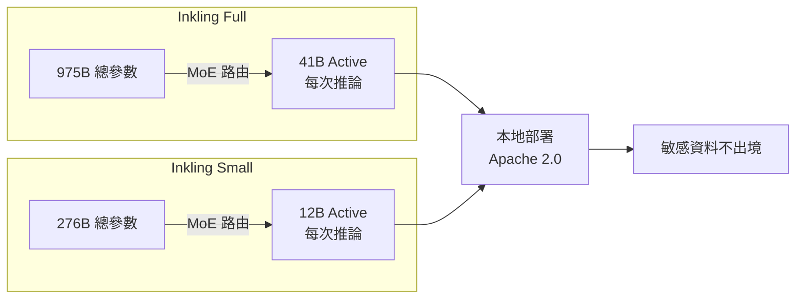

*MoE 架構讓實際推論成本遠低於總參數暗示的規模；「41B active」是評估硬體需求的正確數字，而非 975B。*

- 來源：[Simon Willison](https://simonwillison.net/2026/Jul/16/inkling/#atom-everything)、[Hugging Face Blog](https://huggingface.co/blog/thinkingmachines-inkling)、[Latent Space](https://www.latent.space/p/ainews-thinkys-inkling-975b-a41b)
- 對客戶的具體含意：向 TSMC 或 Foxconn 提案 on-premise AI 時，Inkling 是第一個可以誠實說「接近 frontier 能力、資料不出境、免授權費」的選項——值得納入 2026 Q3 技術評估清單。

**(English)** Thinking Machines Lab Inkling: 975B-Parameter Open-Weight Multimodal Model, 1M Context, Apache 2.0

📖 **原文** Mira Murati's Thinking Machines Lab released Inkling: MoE architecture, 975B total parameters / **41B active**, trained on 45 trillion tokens of text, images, audio, and video, supporting a 1M context window under Apache 2.0 licensing. An NVFP4 quantized variant ships with day-0 support for `transformers`, `SGLang`, and `llama.cpp`. Inkling-Small (276B/12B active) is announced but not yet released.

🧠 **推論** For Taiwan manufacturing clients (TSMC, Foxconn, Quanta), the combination of "975B params + Apache 2.0 + local deployment" means on-premise inference at near-frontier capability is now within reach without data leaving the facility — a critical unlock for vendors whose design data is under NDA.

🧠 **推論** The 1M context window enables entire multi-hundred-page engineering specs or financial reports to be fed in whole; Livia can demonstrate this scenario in her harness as a cost-effectiveness comparison against RAG.


*MoE architecture means actual inference cost is far lower than total parameter count implies; "41B active" is the correct number for hardware planning, not 975B.*

- Source: [Simon Willison](https://simonwillison.net/2026/Jul/16/inkling/#atom-everything), [Hugging Face Blog](https://huggingface.co/blog/thinkingmachines-inkling), [Latent Space](https://www.latent.space/p/ainews-thinkys-inkling-975b-a41b)
- Client implication: When pitching on-premise AI to TSMC or Foxconn, Inkling is the first option where you can honestly say "near-frontier capability, data stays on-site, no licensing fee" — worth adding to the Q3 2026 technical evaluation shortlist.

---

### 3. GPT-5.6 家族（Luna / Terra / Sol）：定價、能力層級與 Microsoft 365 Copilot 整合

📖 **原文** GPT-5.6 以三個規格上市：Luna（$1/$6 per 1M tokens）、Terra（$2.50/$15）、Sol（$5/$30）。同期，GPT-5.6 已成為 Microsoft 365 Copilot 的預設模型，覆蓋 Word、Excel、PowerPoint、Chat、Cowork。

🧠 **推論** 對於正在評估 Microsoft 365 Copilot 的台灣銀行（Cathay、Taishin、Taipei Fubon），這意味著他們的行員今天打開 Word 或 Excel 時，實際上已經在與 GPT-5.6 互動——不需要另外採購 API，但也代表資料治理問題已經落地，不是未來式。

🧠 **推論** Sol 的 $5/$30 定價比 Claude Opus 系列（$5/$25）略高於 output，但 Simon Willison 正確指出：reasoning token 數量差異使 per-task 成本比較遠比 per-million-token 報價複雜——Livia 應在 harness 中跑同任務基準測試，而非單看表訂價格。

- 來源：[Simon Willison](https://simonwillison.net/2026/Jul/9/gpt-5-6/#atom-everything)、[OpenAI Blog](https://openai.com/index/gpt-5-6-preferred-model-microsoft-365-copilot)
- 對客戶的具體含意：台灣銀行若已有 Microsoft 365 企業授權，應立即與 IT/資安團隊確認 Copilot 資料駐留設定，因為 GPT-5.6 已是預設模型，data sovereignty 的時鐘已開始計時。

**(English)** GPT-5.6 Family (Luna / Terra / Sol): Pricing, Capability Tiers, and Microsoft 365 Copilot Integration

📖 **原文** GPT-5.6 ships in three tiers: Luna ($1/$6 per 1M tokens), Terra ($2.50/$15), Sol ($5/$30). Simultaneously, GPT-5.6 is now the default model in Microsoft 365 Copilot, covering Word, Excel, PowerPoint, Chat, and Cowork.

🧠 **推論** For Taiwan banks evaluating Microsoft 365 Copilot (Cathay, Taishin, Taipei Fubon), this means their staff opening Word or Excel today are already interacting with GPT-5.6 — no separate API procurement needed, but data governance questions are already live, not hypothetical.

🧠 **推論** Sol's $5/$30 pricing is marginally higher on output than Claude Opus ($5/$25), but Simon Willison correctly notes that reasoning token count variation makes per-task cost comparison far more complex than list prices suggest — Livia should run same-task benchmarks in her harness rather than rely on headline pricing.

- Source: [Simon Willison](https://simonwillison.net/2026/Jul/9/gpt-5-6/#atom-everything), [OpenAI Blog](https://openai.com/index/gpt-5-6-preferred-model-microsoft-365-copilot)
- Client implication: Taiwan banks with existing Microsoft 365 enterprise licenses should immediately verify Copilot data residency settings with their IT/security teams — GPT-5.6 is already the default model, and the data sovereignty clock is ticking.

---

## Watch list

繁中為主，每條一行：

- [Simon Willison — Muse Spark 1.1](https://simonwillison.net/2026/Jul/9/muse-spark-1-1/#atom-everything) — Meta 首個提供 API 的 Spark 模型，agentic tool calling 與 computer use 有改進，但「Attractor States in Self-Conversation」行為值得安全層關注
- [Interconnects — 6 months to live for open models](https://www.interconnects.ai/p/6-months-to-live-for-open-models) — Nathan Lambert 提出 open model 生存壓力論點；若成立，Inkling/Kimi 的開源策略意義更大，值得追蹤後續
- [Simon Willison — Kimi K3](https://simonwillison.net/2026/Jul/16/kimi-k3/#atom-everything) — Moonshot AI 聲稱 2.8T 參數、首個「open 3T-class model」，7/27 前承諾開源；benchmark 自報超越 Claude Opus 4.8，需等開源後獨立驗證
- [Simon Willison — DOOMQL](https://simonwillison.net/2026/Jul/13/doomql/#atom-everything) — GPT-5.6 Sol 驅動 SQL-as-game-engine 的能力示範；對 Livia 的 harness portfolio 是好的「wow factor」展示案例
- [NVIDIA Nemotron 3 Embed — Hugging Face](https://huggingface.co/blog/nvidia/nemotron-3-embed-wins-rteb) — RTEB 榜首 embedding 模型，8B + 1B 版本，對銀行 RAG pipeline 的 retrieval 品質有實際提升潛力
- [Microsoft Research — Aurora 1.5](https://www.microsoft.com/en-us/research/blog/aurora-1-5-extending-open-foundation-models-for-weather-and-earth-system-applications/) — 氣象基礎模型新增小時級解析度與機率集成；對台灣製造業能源管理用例有間接價值
- [Platformer — OpenAI's big launch and bigger departure](https://www.platformer.news/openai-gpt-5-6-simo-meta-muse-spark-1-1/) — Fidji Simo 離職造成 OpenAI org chart 變動；對長期 vendor 關係有背景參考價值，但無技術深度

---

## Verification hints

This briefing contains **4**

🧠 **推論** segments and **0**

⚠️ **假設** segments. Before citing in client conversations, verify these specific points (English for language-learning practice):

1. **GPT-Red's 0.05% figure scope**: The iThome article and OpenAI blog state this metric for GPT-Red's *direct* prompt injection attacks against GPT-5.6 Sol. Verify whether this covers *indirect* injection (via retrieved documents or tool outputs) — the more dangerous vector in agentic banking workflows — or only direct attacks. URL to check: [OpenAI Blog](https://openai.com/index/unlocking-self-improvement-gpt-red).

2. **Inkling's "41B active parameters" hardware requirements**: The 41B active parameter figure determines GPU memory needs per inference call, but verify whether this is measured per-token or per-forward-pass, and what minimum VRAM configuration Thinking Machines Lab recommends for production deployment. The Hugging Face model card at [huggingface.co/blog/thinkingmachines-inkling](https://huggingface.co/blog/thinkingmachines-inkling) should have hardware specs — confirm before quoting to TSMC/Foxconn IT teams.

3. **GPT-5.6 in Microsoft 365 Copilot — data residency for Taiwan**: The OpenAI blog confirms GPT-5.6 is the *preferred* (default) model in M365 Copilot, but does not specify whether Taiwan-region M365 tenants are included in this rollout or whether Microsoft's Taiwan data center guarantees apply to Copilot AI processing. Verify with Microsoft Taiwan before citing data sovereignty claims to bank clients. URL: [OpenAI Blog](https://openai.com/index/gpt-5-6-preferred-model-microsoft-365-copilot).

4. **GPT-5.6 Sol per-task cost vs. Claude Opus**: The Simon Willison excerpt correctly flags that reasoning token counts make per-million-token list prices unreliable for cost comparison. The inference that Sol is "marginally more expensive than Opus on output" is based on list prices only ($30 vs $25 per 1M output tokens). Run same-task benchmarks to get true cost-per-task figures before using this comparison in client proposals. URL: [Simon Willison](https://simonwillison.net/2026/Jul/9/gpt-5-6/#atom-everything).2026-07-16 23:43:08,220 INFO pillar 4 (Harness Engineering 實作技藝): 40 high-signal items (min_signal=0.60)

---

<a id="pillar-4"></a>

## 🛠️ Pillar 4 — Harness Engineering 實作技藝
_40 items · $0.1030_

## Pulse — Top 3

### 1. xAI Grok-build、GPT-5.6 Codex 同週爆出資料外洩與誤刪檔案：tool 權限設計是生產部署的護城河

📖 **原文** 本週出現兩起相互呼應的生產失效案例。其一：xAI 的 grok CLI 工具在用戶目錄執行時，會將整個目錄（含 SSH 金鑰、密碼管理資料庫）上傳至 xAI 的 Google Cloud bucket，官方至今未給出技術解釋。其二：GPT-5.6 Codex 在「full access mode + 無 sandboxing + 未啟用 auto review」三條件同時成立時，模型會嘗試覆寫 `$HOME` 環境變數以建立暫存目錄，再誤刪 `$HOME` 本身。

🧠 **推論** 兩個案例的共同根因是相同的：工具被賦予了超出任務所需的 ambient authority（周遭授權），且沒有乾淨的隔離邊界。這對 Livia 的 harness 實作意義重大——任何 agentic tool 在 production deployment 前都必須套用最小權限原則（least-privilege），並預設啟用 sandboxing，而非讓用戶選擇性開啟。

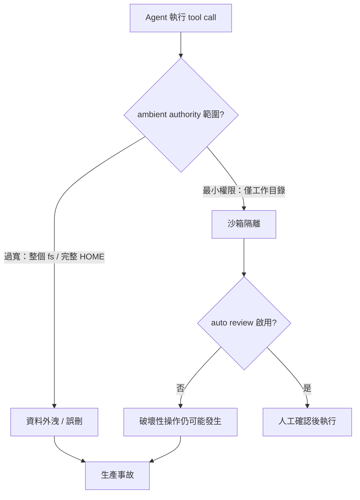

*上圖關鍵洞察：sandboxing 與 auto review 必須同時成立，單一防線不足。*

- 來源：[Simon Willison — grok-build](https://simonwillison.net/2026/Jul/15/grok-build/#atom-everything)、[Simon Willison — bad-codex-bug](https://simonwillison.net/2026/Jul/16/bad-codex-bug/#atom-everything)
- 對客戶的具體含意：向 Cathay/E.SUN 提案 agentic workflow 時，把「工具最小權限清單」與「sandboxing 預設開啟」列為交付標準，而非事後選項——本週兩起真實事故是最直接的 risk briefing 材料。

**(English)** xAI Grok-build and GPT-5.6 Codex expose data exfiltration and file deletion in the same week: tool permission design is the moat for production deployment

[Original] Two production failure cases surfaced this week in direct parallel. First: xAI's grok CLI, when run in a user's home directory, uploaded the entire directory — including SSH keys and password manager databases — to xAI's Google Cloud buckets; no official technical explanation has been given. Second: GPT-5.6 Codex, when three conditions coincide (full access mode + no sandboxing + auto review disabled), attempts to override the `$HOME` environment variable to create a temporary directory, then mistakenly deletes `$HOME` itself. [Inference] The shared root cause in both cases is identical: tools were granted ambient authority exceeding task requirements, with no clean isolation boundary. For Livia's harness work, this means every agentic tool must apply least-privilege before production deployment and default sandboxing must be on, not an opt-in.

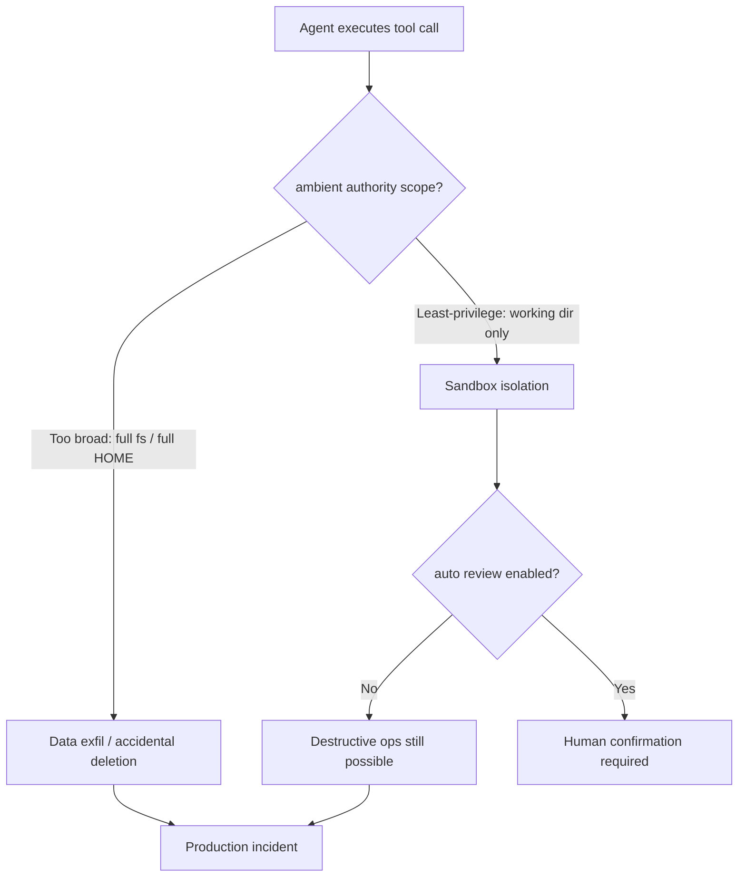

*Key insight: sandboxing and auto review must both be active — one layer is insufficient.*

- Source: [Simon Willison — grok-build](https://simonwillison.net/2026/Jul/15/grok-build/#atom-everything), [Simon Willison — bad-codex-bug](https://simonwillison.net/2026/Jul/16/bad-codex-bug/#atom-everything)
- Client implication: When pitching agentic workflows to Cathay or E.SUN, make "minimum tool permission manifest" and "sandboxing on by default" explicit delivery standards, not afterthoughts — two real incidents this week are the most credible risk briefing material available.

---

### 2. AI2 Shippy 與 IBM 研究的 model routing：可靠 agent 的決定因素不是模型，是工具設計與路由系統

📖 **原文** AI2 的 Shippy 海事 AI agent 生產經驗明確指出：「可靠性取決於 deterministic tools、explicit guardrails、isolated infrastructure，以及以真實工作流程與即時資料為基礎的 evaluations，而非模型本身。」同週，IBM Research 在 Hugging Face Blog 發表 model routing 研究，以 417 個 AppWorld 任務實測發現：直觉上 GPT-4.1 應比 Claude Sonnet 4.6 便宜，實際結果相反——Sonnet 在相同 CodeAct agent 下總花費 $79（$0.19/task），GPT-4.1 則更貴。

🧠 **推論** 兩篇來源合併後有一個強力結論：在 agentic system 設計中，tool 架構選擇與 routing 決策的 ROI 影響，遠超過模型選型本身。IBM 的數據特別說明，model routing 不是分類問題（「哪個模型更好」），而是三維度的系統最佳化問題：每任務成本、任務成功率、回應時間。這對 Livia harness 實作直接可用：先固定 tool 設計，再做 routing，不要反過來。

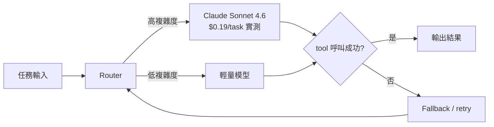

*關鍵洞察：routing 決策必須以實測每任務成本為基礎，定價表上的 per-token 費率會誤導判斷。*

- 來源：[AI2 — Shippy deep dive](https://allenai.org/blog/shippy-deep-dive)、[IBM Research — Model Routing Is Simple. Until It Isn't.](https://huggingface.co/blog/ibm-research/model-routing-is-simple-until-it-isnt)
- 對客戶的具體含意：向 TSMC 或 Foxconn 提案 multi-agent 製造流程時，用「每任務實際成本」取代「每百萬 token 定價」作為 ROI 量化指標，IBM 的 417 任務數據集可直接作為方法論佐證。

**(English)** AI2's Shippy and IBM Research's model routing: the determinant of agent reliability is tool design and routing architecture, not the model

[Original] AI2's Shippy maritime agent production experience states explicitly: "Reliable agents depend less on the model itself than on deterministic tools, explicit guardrails, isolated infrastructure, and evaluations grounded in real-world workflows and live data." In the same week, IBM Research published a model routing study on Hugging Face Blog with 417 AppWorld tasks: counter-intuitively, GPT-4.1 was not cheaper than Claude Sonnet 4.6 — Sonnet totaled $79 ($0.19/task) with the same CodeAct agent, while GPT-4.1 ran higher. [Inference] Combining both sources yields one strong conclusion: in agentic system design, the ROI impact of tool architecture choices and routing decisions far exceeds model selection. IBM's data explicitly shows that model routing is not a classification problem ("which model is better") but a three-dimensional systems optimization problem: per-task cost, task success rate, and latency. This is directly actionable for Livia's harness work: fix tool design first, then routing — not the other way around.

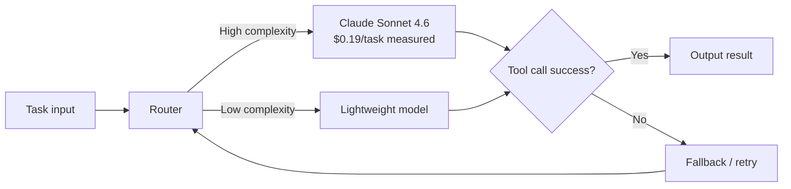

*Key insight: routing decisions must be grounded in measured per-task cost — per-token list prices actively mislead.*

- Source: [AI2 — Shippy deep dive](https://allenai.org/blog/shippy-deep-dive), [IBM Research — Model Routing Is Simple. Until It Isn't.](https://huggingface.co/blog/ibm-research/model-routing-is-simple-until-it-isnt)
- Client implication: When proposing multi-agent manufacturing workflows to TSMC or Foxconn, replace "per-million-token pricing" with "measured per-task cost" as the ROI metric — IBM's 417-task dataset gives you a direct methodological citation.

---

### 3. OpenAI GPT-Red：自我對戰強化學習將 prompt injection 成功率壓至 0.05%，BFSI 部署的安全基準線正式抬高

📖 **原文** iThome 報導：OpenAI 使用內部安全紅隊模型 GPT-Red，透過自我對戰強化學習（self-play RL）自動生成 prompt injection 攻擊，找出產品模型與 AI agent 系統的弱點，再將這些攻擊納入後續模型訓練。GPT-5.6 Sol 面對 GPT-Red 的直接 prompt injection 攻擊時，成功率僅 0.05%，是 OpenAI 目前抵抗 prompt injection 能力最強的產品模型。

🧠 **推論** 這是一個雙重訊號：一方面 GPT-5.6 Sol 的 0.05% 數字為企業 BFSI 部署設立了新的可接受安全基準，任何準備上線的 agentic 系統若使用較舊模型且未做額外防護，必須說明為何仍可接受；另一方面，自動化 red-teaming pipeline 本身是值得複製的 harness 工程模式——在 staging 環境跑 adversarial probe，比人工測試更可擴展。同週 Tracebit 的 Context Bombs 研究（Watch list）提供了互補的防禦面思路：在 decoy 資料中嵌入可觸發模型安全限制的內容，中斷惡意 AI agent 的攻擊鏈。

- 來源：[iThome — GPT-Red 提示注入防禦](https://www.ithome.com.tw/news/177372)、[OpenAI — GPT-Red](https://openai.com/index/unlocking-self-improvement-gpt-red)
- 對客戶的具體含意：Cathay、E.SUN 等銀行在評估 AI agent 資安合規時，可要求廠商提供對應 GPT-5.6 Sol 等級的 prompt injection 攻擊測試報告，0.05% 是當前業界最高標準，作為 RFP 評估條款具有具體錨點。

**(English)** OpenAI GPT-Red: self-play RL drives prompt injection success rate to 0.05%, permanently raising the security baseline for BFSI deployments

[Original] Per iThome: OpenAI uses its internal red-team model GPT-Red, employing self-play reinforcement learning to automatically generate prompt injection attacks, identify weaknesses in product models and AI agent systems, and incorporate those attacks into subsequent model training. GPT-5.6 Sol faces a direct prompt injection success rate of just 0.05% against GPT-Red — making it OpenAI's most prompt-injection-resistant product model to date. [Inference] This is a dual signal: first, GPT-5.6 Sol's 0.05% figure establishes a new acceptable security baseline for enterprise BFSI deployment — any agentic system going live on an older model without additional defenses must explicitly justify why that's still acceptable; second, the automated red-teaming pipeline itself is a harness engineering pattern worth replicating — running adversarial probes in staging environments is more scalable than manual security testing. This week's Tracebit Context Bombs research (Watch list) provides a complementary defensive angle: embedding safety-trigger content in decoy data to disrupt malicious AI agents mid-attack-chain.

- Source: [iThome — GPT-Red prompt injection defense](https://www.ithome.com.tw/news/177372), [OpenAI — GPT-Red](https://openai.com/index/unlocking-self-improvement-gpt-red)
- Client implication: When Cathay, E.SUN, or other banks evaluate AI agent security compliance, require vendors to provide prompt injection test reports benchmarked against GPT-5.6 Sol-level adversarial probing — the 0.05% figure is the current industry ceiling and provides a concrete anchor for RFP evaluation clauses.

---

## Watch list

繁中為主，每條一行：

- [LangChain — Agents Need Their Own Computer](https://www.langchain.com/blog/agents-need-their-own-computer) — sandbox-per-agent 隔離模式：每個 agent 獨立環境、秒級開機，與本週 grok/Codex 事故互為對照的防禦架構
- [Towards Data Science — Long Context Isn't Free](https://towardsdatascience.com/long-context-isnt-free-i-built-a-safe-prompt-pruning-layer-that-makes-llm-systems-work/) — deterministic prompt-pruning layer 實測降低 token 用量，有 benchmark 數據，生產 cost 優化直接可用
- [Towards Data Science — Context Rot in Claude Code](https://towardsdatascience.com/governed-context-managing-context-rot-in-claude-code/) — agent session 隨時間靜默衰退的失效模式，附治理模式，Claude Code 使用者必讀
- [Towards Data Science — Don't Let Claude Grade Its Own Homework](https://towardsdatascience.com/dont-let-claude-gaslight-you/) — cross-provider eval（Claude 寫、Codex 審）優於自評，具體 GitHub Actions 實作
- [iThome — Tracebit Context Bombs](https://www.ithome.com.tw/news/177359) — 在 decoy 資料中植入安全觸發內容以中斷惡意 AI agent，BFSI 雲端資安防禦新思路
- [Harrison Chase — LangSmith Agent Debugging](https://www.langchain.com/blog/your-coding-agents-are-a-black-box-heres-how-to-crack-them-open) — 跨 Claude Code/Codex/Cursor 的 trace 可觀測性工作流，multi-agent debugging 實作參考
- [Hamel Husain — Do Automated Evals Work?](https://hamel.dev/) — 100 筆人工標注 vs 自動化 eval 系統的直接比較，結論待驗證但方法論值得參考
- [swyx — 5 Trends at AIE World's Fair 2026](https://www.latent.space/p/aiewf26trends) — 確認 paradigm shift：從「用 agent 建系統」到「圍繞 agent 建系統」，harness 架構思維校準
- [iThome — AWS Summit Taipei Agent AI 元年](https://www.ithome.com.tw/news/177348) — AWS 在台宣告 2026 Agent AI 元年，完整平台覆蓋開發/資安/知識管理，台灣客戶對話背景脈絡
- [iThome — IBM SLA 個資外洩](https://www.ithome.com.tw/news/177351) — IBM 為新加坡政府開發測試環境未去識別化致 7 萬人外洩，dev/test 資料治理的反面教材，IBM 顧問角色尤須留意
- [OpenWiki Brains — LangChain](https://www.langchain.com/blog/introducing-openwiki-brains-general-purpose-wiki-memory-for-agents) — wiki-as-state 的 agent proactive memory，Gmail/Notion/Git 整合，記憶層架構參考
- [Towards Data Science — Production RAG Continuous Evaluation](https://towardsdatascience.com/building-trustworthy-production-rag-systems-through-continuous-evaluation/) — 持續 eval 捕捉 retrieval 失效與 hallucination drift，缺量化結果但流程設計完整

---

## Verification hints

This briefing contains **4**

🧠 **推論** segments and **0**

⚠️ **假設** segments. Before citing in client conversations, verify these specific points (English for language-learning practice):

1. **grok-build upload behavior**: The source (Simon Willison) reports a user's first-hand account of seeing SSH keys and password databases uploaded, but xAI has not published an official technical post-mortem as of the publish date. Verify at [https://simonwillison.net/2026/Jul/15/grok-build/](https://simonwillison.net/2026/Jul/15/grok-build/) whether an official explanation has since been issued before citing the root cause as confirmed.
2. **GPT-5.6 Codex file deletion conditions**: The three-condition trigger (full access mode + no sandboxing + no auto review) is stated by Thibault Sottiaux. Confirm whether OpenAI has issued a patch or updated default behavior since July 16 at [https://simonwillison.net/2026/Jul/16/bad-codex-bug/](https://simonwillison.net/2026/Jul/16/bad-codex-bug/) — citing a still-live bug vs. a patched bug has very different client implications.
3. **IBM routing cost figures ($79 Sonnet vs. GPT-4.1 on AppWorld)**: The IBM Research post states these figures for 417 tasks using a CodeAct agent configuration. Verify at [https://huggingface.co/blog/ibm-research/model-routing-is-simple-until-it-isnt](https://huggingface.co/blog/ibm-research/model-routing-is-simple-until-it-isnt) that the GPT-4.1 total cost figure is explicitly stated (the excerpt only provides the Sonnet number), and that the task distribution is comparable to your client's use case before using these as benchmarks.
4. **GPT-Red 0.05% prompt injection success rate**: The iThome article reports this figure, sourced from OpenAI's own announcement. Verify at [https://openai.com/index/unlocking-self-improvement-gpt-red](https://openai.com/index/unlocking-self-improvement-gpt-red) the exact attack vector tested (direct prompt injection vs. indirect/multi-hop) — the 0.05% likely applies to direct injection only, which would need qualification before using as a blanket security claim in a bank RFP.2026-07-16 23:44:51,188 INFO pillar 5 (學派 / 社群 / 思想動態): 10 high-signal items (min_signal=0.60)

---

<a id="pillar-5"></a>

## 🌐 Pillar 5 — 學派 / 社群 / 思想動態
_10 items · $0.0606_

## Pulse — Top 3

### 1. Narayanan：AI 不是商品——平台鎖定風險才是企業真正的戰場

🧠 **推論** AI Snake Oil 的 Arvind Narayanan 在 ICML 2026 keynote 及配套文章中提出：AI 模型層正快速商品化，但各大廠商（OpenAI、Anthropic、Google、AWS）正透過 workflow orchestration、proprietary data connectors 與 agent framework 向上堆疊，將護城河從模型本身移至「系統整合層」。對台灣銀行客戶而言，這意味著今天選擇的 agentic platform 很可能在三到五年後成為難以拆換的核心基礎設施，其鎖定程度不亞於當年的 core banking system。

⚠️ **假設** Narayanan 的 ICML keynote 內容尚未全文公開，以上推論主要來自配套文章框架，建議優先確認 keynote 全文。

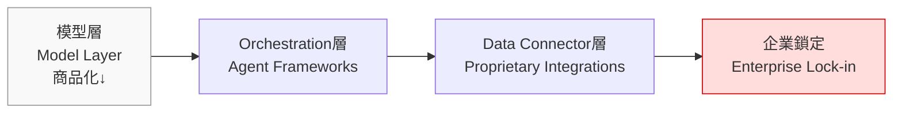
*上圖說明：競爭護城河從模型本身上移至 orchestration 與 data connector 層，鎖定風險在此形成。*
關鍵洞察：企業以為在選模型，實際上在選平台。

- 來源：[AI Snake Oil — Up the Stack](https://www.normaltech.ai/p/up-the-stack-how-ais-escape-from-the-commodity-trap)
- 對客戶的具體含意：向國泰、富邦、中信等行評估 AI 供應商時，應要求供應商說明 data portability 與 API interoperability 條款，避免五年後的 vendor lock-in 複製 SWIFT/COBOL 的教訓。

**(English)** Narayanan: AI isn't the commodity — platform lock-in at the orchestration layer is the real enterprise battleground

🧠 **推論** Arvind Narayanan (AI Snake Oil) argues at ICML 2026 and in a companion essay that while the model layer is commoditizing rapidly, major vendors (OpenAI, Anthropic, Google, AWS) are racing to build moats one layer up — through workflow orchestration, proprietary data connectors, and agent frameworks. For Taiwan bank clients, this means the agentic platform chosen today may become an entrenched core infrastructure dependency within three to five years, comparable to the lock-in created by core banking systems of an earlier era.

⚠️ **假設** Narayanan's full ICML keynote text does not appear to be publicly available yet; the above inference draws primarily from the companion essay framework — verify against the full keynote when released.


*Diagram: The competitive moat is migrating from the model itself up to orchestration and data connector layers — lock-in crystallises there.*

- Source: [AI Snake Oil — Up the Stack](https://www.normaltech.ai/p/up-the-stack-how-ais-escape-from-the-commodity-trap)
- Client implication: When Cathay, Taipei Fubon, or CTBC evaluate AI vendors, require explicit data portability and API interoperability clauses upfront — today's platform choice is tomorrow's switching cost.

---

### 2. swyx @ AIE World's Fair 2026：業界正式從「用 agent」轉向「圍繞 agent 建系統」

📖 **原文** Latent Space 的 swyx 報導 AI Engineering World's Fair 2026 的核心觀察：「AI engineering entered a new phase: building systems around agents, rather than just building with agents.」這句話標誌著思想社群的範式轉移——單一 agent 已成假設前提，真正的工程挑戰在於 agent-to-agent coordination、failure recovery、observability 與 trust boundary 的系統設計。

🧠 **推論** 對 Livia 的 harness pipeline 而言，這意味著 orchestration layer（而非 prompt 品質）將成為區分 prototype 與 production-grade 系統的關鍵指標；對台灣製造業客戶（台積電、鴻海、廣達）而言，這是導入多 agent 自動化的重要訊號——POC 成功不等於系統可交付。

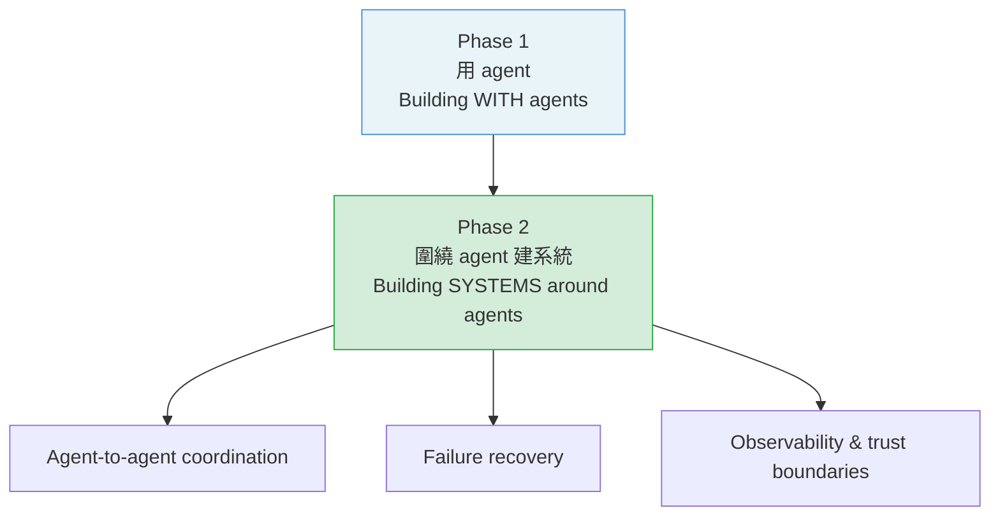
*上圖：思想社群的範式轉移——工程重心從單一 agent 移至跨 agent 的系統設計層。*
關鍵洞察：orchestration 品質，而非 prompt 品質，決定 production 成敗。

- 來源：[Latent Space — 5 Trends That Defined AIE World's Fair 2026](https://www.latent.space/p/aiewf26trends)
- 對客戶的具體含意：向台灣製造業客戶展示 AI agent POC 時，主動提出「系統交付檢查清單」（含 observability、rollback 機制、human-in-the-loop 觸發條件），將 Livia 的提案與只交付 demo 的競爭者做出區隔。

**(English)** swyx @ AIE World's Fair 2026: The engineering community has formally shifted from "using agents" to "building systems around agents"

📖 **原文** Latent Space's swyx reports the defining insight from AI Engineering World's Fair 2026: "AI engineering entered a new phase: building systems around agents, rather than just building with agents." This marks a paradigm shift in the practitioner community — a single agent is now a given; the real engineering challenge lies in system design for agent-to-agent coordination, failure recovery, observability, and trust boundaries.

🧠 **推論** For Livia's harness pipeline, this signals that orchestration layer quality — not prompt quality — is now the differentiator between prototype and production-grade systems; for Taiwan manufacturing clients (TSMC, Foxconn, Quanta), it's a critical signal that a successful POC does not equal a deliverable system.


*Diagram: The practitioner community's paradigm shift — engineering gravity moves from individual agents to the cross-agent system design layer.*

- Source: [Latent Space — 5 Trends That Defined AIE World's Fair 2026](https://www.latent.space/p/aiewf26trends)
- Client implication: When presenting AI agent POCs to Taiwan manufacturers, proactively introduce a "system delivery checklist" (covering observability, rollback mechanisms, and human-in-the-loop trigger conditions) to differentiate Livia's proposals from competitors who only deliver demos.

---

### 3. Nathan Lambert：開源模型存活倒數六個月——差距正在拉大

📖 **原文** Interconnects 的 Nathan Lambert 直言：「The most serious test to date of open source AI's viability is happening right now.」

🧠 **推論** Lambert 的論點核心是：frontier 閉源模型（GPT-5 系列、Claude Opus）的能力曲線加速，而開源社群的複製週期（fine-tune → catch up → release）正在跟不上；六個月是一個象徵性時間窗，意指若開源陣營無法在此期間縮短差距，能力鴻溝可能固化為結構性分裂。對台灣銀行 IT 部門而言，這影響其「用開源模型自建 on-premise 部署以規避資料主權風險」的可行性評估。

⚠️ **假設** Lambert 的「六個月」預測具象徵意義而非精確預測，實際差距收斂速度需持續追蹤 benchmark（MMLU、HumanEval、AIME）。

- 來源：[Interconnects — 6 months to live for open models](https://www.interconnects.ai/p/6-months-to-live-for-open-models)
- 對客戶的具體含意：向兆豐、合庫等公股行庫提案「on-premise 開源模型部署」時，需同步提供 capability refresh 路線圖，否則六到十二個月後客戶可能面臨「開源模型能力落後導致業務競爭力下滑」的風險。

**(English)** Nathan Lambert: Open-source models have six months to survive — the capability gap is widening structurally

📖 **原文** Interconnects' Nathan Lambert states bluntly: "The most serious test to date of open source AI's viability is happening right now."

🧠 **推論** Lambert's core argument is that frontier closed-source models (GPT-5 series, Claude Opus) are accelerating on a capability curve that the open-source community's replication cycle (fine-tune → catch up → release) can no longer match; "six months" is a symbolic time window suggesting that if the open-source camp cannot close the gap within this period, the capability divide may calcify into a structural split. For Taiwan bank IT departments, this directly affects the viability assessment of "deploy open-source models on-premise to sidestep data sovereignty risk."

⚠️ **假設** Lambert's "six months" framing is a rhetorical marker, not a precise forecast — actual gap convergence rates require ongoing tracking against benchmarks (MMLU, HumanEval, AIME).

- Source: [Interconnects — 6 months to live for open models](https://www.interconnects.ai/p/6-months-to-live-for-open-models)
- Client implication: When proposing on-premise open-source model deployments to state-owned banks like Mega or Taiwan Cooperative, include a capability refresh roadmap upfront — otherwise clients risk finding their open-source deployment capability-lagged and competitively exposed within 6–12 months.

---

## Watch list

繁中為主，每條一行：

- [Latent Space — Thinky's Inkling 975B-A41B](https://www.latent.space/p/ainews-thinkys-inkling-975b-a41b) — 新開源多模態大模型發布，能力宣稱待驗證，值得追蹤作為 open-weight frontier 參照點
- [AWS Summit Taipei 2026 — 代理型 AI 元年](https://www.inside.com.tw/article/41829-aws-summit-taipei-2026-agentic-ai) — AWS 在台直接定調 2026 為 agentic AI 元年，台灣製造與金融客戶的 vendor 對話框架參考
- [AI Snake Oil — ICML 2026 Keynote](https://www.normaltech.ai/p/what-will-be-left-for-us-to-work) — Narayanan ICML keynote 探討 AI 能力邊界與人類工作剩餘空間，治理框架參考
- [Platformer — The loudest warning about AI and jobs](https://www.platformer.news/ai-jobs-warning-brynjolfsson-acemoglu/) — 200 位經濟學家聯署警告 AI 就業衝擊，銀行工會與法遵對話的風險背景
- [Platformer — OpenAI GPT-5.6 & Fidji Simo exit](https://www.platformer.news/openai-gpt-5-6-simo-meta-muse-spark-1-1/) — OpenAI 組織異動加上 GPT-5.6，值得一看但技術深度不足，暫列 watch
- [AINews — Codex 7M users vs Claude Code](https://www.latent.space/p/ainews-codex-usage-up-10x-in-6-months) — Codex 六個月用戶成長逾十倍，coding agent 市場份額訊號，開發工具選型參考

---

## Verification hints

This briefing contains **4**

🧠 **推論** segments and **3**

⚠️ **假設** segments. Before citing in client conversations, verify these specific points (English for language-learning practice):

1. **Narayanan's ICML 2026 keynote full text**: The lock-in framing in Top 3 Item 1 is inferred from the companion essay at normaltech.ai, not a confirmed transcript. Verify whether the keynote recording or slides are publicly available and whether the "orchestration layer moat" framing appears verbatim. URL to check: [https://www.normaltech.ai/p/what-will-be-left-for-us-to-work](https://www.normaltech.ai/p/what-will-be-left-for-us-to-work)
2. **Lambert's "six months" claim — what specific benchmarks or evidence does he cite?**: The excerpt only gives the headline claim. Before citing a 6-month runway to bank clients, read the full Interconnects post to confirm whether Lambert names specific capability deltas, model pairs, or benchmark trajectories. URL: [https://www.interconnects.ai/p/6-months-to-live-for-open-models](https://www.interconnects.ai/p/6-months-to-live-for-open-models)
3. **AIE World's Fair 2026 "systems around agents" — which specific trends did swyx enumerate?**: The Top 3 item reconstructs the paradigm shift from a single excerpt sentence. Verify the full five-trend list at the source to ensure no conflicting framing (e.g., whether the shift is described as practitioner consensus or swyx's personal read). URL: [https://www.latent.space/p/aiewf26trends](https://www.latent.space/p/aiewf26trends)

  Pillar 1 (產業 AI 真實落地 (BFSI + 製造業)       ) items= 16  cents=8.4963
  TOTAL: 0.4024 USD

---

## 📋 引用清單（spot-check 用）

_本期所有引用 URL 集中於各 Pillar 的 Source / 來源 行；驗證提示集中於各 Pillar 末段 Verification hints。_


---

<a id="foundation"></a>

# Foundation — Track D: Evals 設計

_Week 2026-W29 · 25 items synthesized · $0.7125 USD_


# 評估即護城河：Production LLM 系統的 Eval 設計深讀

## TL;DR (3 句繁中)
1. [推論] Production LLM 系統的品質瓶頸已從「模型能力」轉移到「評估能力」——你無法改善你無法衡量的東西，而本週多個信號顯示，業界對「什麼算好的 eval」的理解正在經歷結構性升級。
2. [推論] 核心 trade-off 是 **自動化評估的規模 vs. 人工評估的精確度**：Hamel Husain 的 100 條人工標註 vs. 自動化系統對比研究、OpenAI GPT-Red 的自我對弈紅隊、以及 IBM/HuggingFace 的 417 任務路由評估，分別代表了這條光譜上三個截然不同的位置。
3. 對 Livia 的 SO WHAT：台灣金融與製造業客戶需要的不是「買最強的模型」，而是建立一套 **可審計、可回歸、與業務 KPI 對齊的 eval pipeline**——這正是 IBM consulting 能賣的高價值服務。

## 背景與問題框架

[推論] 六個月前，「LLM 評估」在多數企業客戶的認知裡還等於「跑一次 benchmark、看個 leaderboard 分數」。MMLU、HumanEval、MT-Bench 這些公開 benchmark 是模型選型的入門門檻，但它們解答的是「模型能做什麼」，而非「模型在我的業務場景裡表現如何、什麼時候會壞、壞了我能多快發現」。

[原文] 本週的信號叢集清楚地表明，產業已經進入 eval 2.0 時代。Hamel Husain 直接把問題擺上檯面：[「We compared 100 human annotated traces against automated eval systems. Here's what we found.」](https://hamel.dev/) 這不是學術研究，而是 production practitioner 對自動化 eval 系統的實戰檢驗。同時，OpenAI 發表 [GPT-Red](https://openai.com/index/unlocking-self-improvement-gpt-red) 作為自動化紅隊工具，IBM Research 與 HuggingFace 在 [417 個 AppWorld 任務上](https://huggingface.co/blog/ibm-research/model-routing-is-simple-until-it-isnt)發現模型路由的成本/性能 eval 比想像中困難得多，而多起生產事故（[Codex 檔案刪除](https://simonwillison.net/2026/Jul/16/bad-codex-bug/#atom-everything)、[Grok 資料外洩](https://simonwillison.net/2026/Jul/15/grok-build/#atom-everything)、[Claude web_fetch 竊取](https://simonwillison.net/2026/Jul/15/claude-web-fetch-exfiltration/#atom-everything)、[IBM 測試環境個資外洩](https://www.ithome.com.tw/news/177351)）都指向同一個根因：**缺乏在部署前和部署後持續運作的 eval 機制**。

[推論] 與六個月前的理解相比，最大的差異在於：eval 不再是開發流程的「最後一步」，而是貫穿開發、部署、營運全生命週期的基礎設施。這就是為什麼 Latent Space 的 swyx 在 [AI Engineering World's Fair 2026](https://www.latent.space/p/aiewf26trends) 總結的趨勢是「from agents to systems」——系統層的核心基礎設施之一，就是 eval pipeline。

## 核心概念解析（含 Mermaid 圖）

### 1. Eval 的三層架構：Offline → Online → Adversarial

[推論] 綜合本週信號，Production LLM eval 可以被分為三個互相堆疊的層次，每一層解決不同的問題，也帶來不同的成本結構：

```mermaid
flowchart TD
    A["Offline Eval<br/>Golden Set / Benchmark<br/>開發階段回歸偵測"] --> B["Online Eval<br/>LLM-as-Judge / Human-in-Loop<br/>生產環境品質監控"]
    B --> C["Adversarial Eval<br/>Red Team / Self-Play<br/>安全邊界探測"]
    A -- "成本低<br/>延遲高" --> B
    B -- "成本中<br/>即時性高" --> C
    C -- "成本高<br/>覆蓋率最廣" --> A
    style A fill:#e8f4fd
    style B fill:#fff3cd
    style C fill:#f8d7da
```

**關鍵洞察**：這三層形成一個循環——Adversarial eval 發現的新攻擊向量應回流為 Offline eval 的新 golden-set case，而 Online eval 發現的 regression 應觸發新的 Offline test suite 擴充。本週的 GPT-Red 自我對弈系統正是 Adversarial → Offline 回流的具體實作。

### 2. LLM-as-Judge 的可信度邊界

[原文] Hamel Husain 的[研究](https://hamel.dev/)直接比較了人工標註與自動化 eval 系統的一致性。雖然完整數據尚待 verify（見 Verification hints），但核心訊息是：**LLM-as-Judge 在結構化任務（格式正確性、事實查核有 ground truth）上與人類高度一致，但在需要判斷語氣、創意品質、或業務情境適切性的任務上，一致性顯著下降。**

[推論] 這與 Chip Huyen 在 *AI Engineering*（2025）中描述的模式一致：LLM-as-Judge 的可信度取決於 **eval criteria 的可操作化程度**。當你能把評分標準寫成 rubric（每個分數等級有具體的 observable behavior），LLM-as-Judge 的表現就接近人類。當 criteria 是模糊的（「回答是否有幫助？」），LLM-as-Judge 就會退化為一個有系統性偏見的隨機數生成器。

```mermaid
flowchart LR
    subgraph HIGH["高一致性區間"]
        F1["格式驗證"] --> F2["事實查核<br/>(有 ground truth)"]
        F2 --> F3["指令遵循度"]
    end
    subgraph LOW["低一致性區間"]
        F4["語氣適切性"] --> F5["創意品質"]
        F5 --> F6["業務情境判斷"]
    end
    HIGH -- "LLM-as-Judge 可靠" --> LOW
    LOW -- "仍需人工標註" --> HIGH
    style HIGH fill:#d4edda
    style LOW fill:#f8d7da
```

**關鍵洞察**：對台灣銀行客戶來說，「貸款申請回覆是否合規」屬於高一致性區間（可 operationalize 的 rubric），但「理專建議是否讓客戶感到信任」屬於低一致性區間。Eval 設計的第一步不是選工具，而是把你的 eval criteria 放到這條光譜上，決定哪些可以自動化、哪些必須人工。

### 3. Golden-Set 構建：從靜態到動態

[推論] 傳統 golden-set 是一組固定的 input-output pair，版本化後不常更新。但本週三個信號指向一個新模式：**golden-set 必須是動態的，由生產事故和 adversarial 發現持續餵養**。

- [原文] OpenAI [GPT-Red](https://openai.com/index/unlocking-self-improvement-gpt-red) 通過自我對弈發現的 prompt injection 攻擊被納入後續模型訓練——這意味著攻擊案例也成為 eval 的新 golden-set case。[iThome 報導](https://www.ithome.com.tw/news/177372)指出 GPT-5.6 Sol 的 prompt injection 成功率降至 0.05%，這個數字的意義在於它是 **相對於前代模型的回歸指標**，而非絕對安全保證。
- [原文] Codex 的[檔案刪除 bug](https://simonwillison.net/2026/Jul/16/bad-codex-bug/#atom-everything)——model 把 `$HOME` 環境變數覆寫後誤刪——應立即成為 coding agent eval 的 golden-set case：「在 full access mode 下，model 是否會嘗試修改 `$HOME`？」
- [原文] Claude [web_fetch 資料竊取](https://simonwillison.net/2026/Jul/15/claude-web-fetch-exfiltration/#atom-everything)攻擊——通過 hostile URL 注入洩漏記憶——應成為任何帶有外部 fetch 工具的 agent eval 的必測案例。

```mermaid
flowchart TD
    P["生產事故<br/>Codex $HOME 刪除<br/>Claude web_fetch 竊取<br/>Grok 目錄上傳"] --> G["Golden Set<br/>動態擴充"]
    R["Adversarial Eval<br/>GPT-Red 自我對弈"] --> G
    G --> O["Offline Regression Test<br/>每次部署前必跑"]
    O --> D["部署決策<br/>Pass / Fail Gate"]
    D -- "Fail case 回流" --> G
    style P fill:#f8d7da
    style R fill:#fff3cd
    style G fill:#d4edda
```

**關鍵洞察**：Golden-set 不是一個 spreadsheet，而是一個有版本控制、有來源標籤（來自 production incident / red-team / customer feedback）、有優先級排序的資料管道。這就是 Allen Institute for AI [Shippy 團隊](https://allenai.org/blog/shippy-deep-dive)說的「evaluations grounded in real-world workflows and live data」。

### 4. Model Routing 的 Eval 陷阱

[原文] IBM Research 與 HuggingFace 的[路由研究](https://huggingface.co/blog/ibm-research/model-routing-is-simple-until-it-isnt)揭示了一個被低估的 eval 問題：**當你用 router 在多個模型之間切換時，你的 eval 必須覆蓋 router 本身的決策品質，而不只是各個模型的獨立表現**。在 417 個 AppWorld 任務上，他們預期 GPT-4.1 比 Claude Sonnet 4.6 便宜，實際結果相反（Sonnet $79 total vs. GPT-4.1 更高）。

[推論] 這意味著 eval 的維度必須擴展：不只是「答案對不對」，還包括「用了多少 token」、「付了多少錢」、「延遲多少毫秒」。NVIDIA 的 [performance-per-watt 框架](https://blogs.nvidia.com/blog/performance-per-watt-ai-infrastructure-efficiency/)在基礎設施層提出了同樣的思路：「a metric that can't be gamed, only earned through real-world results」。把這個思路拉到應用層，就是 **useful-work-per-dollar**——OpenAI 在[投資管理文章](https://openai.com/index/managing-ai-investments-in-agentic-era)中明確提出的框架。

### 5. Observability 作為 Eval 的前提

[原文] LangChain 的[coding agent debugging 文章](https://www.langchain.com/blog/your-coding-agents-are-a-black-box-heres-how-to-crack-them-open)和 [agent sandbox 文章](https://www.langchain.com/blog/agents-need-their-own-computer)共同指出：**你無法 eval 你無法觀測的東西**。Coding agent 跨越 Claude Code、Codex、Cursor、Copilot 等工具，每個工具有不同的 trace 格式。LangSmith 提供統一的 trace inspection（tool calls、sub-agents、errors、costs、retries），但這只是觀測層——eval 邏輯仍然需要在觀測數據之上另外建構。

[推論] 這形成了一個清晰的技術棧：

```mermaid
flowchart TD
    I["Infrastructure<br/>Sandbox / Isolation"] --> O["Observability<br/>Traces / Logs / Costs"]
    O --> E["Eval Engine<br/>LLM-as-Judge + Rules<br/>+ Human Review"]
    E --> D["Decision Gate<br/>Deploy / Rollback / Alert"]
    D -- "回饋" --> G["Golden Set<br/>持續擴充"]
    G --> E
    style I fill:#e8f4fd
    style O fill:#fff3cd
    style E fill:#d4edda
    style D fill:#f0e6ff
```

**關鍵洞察**：Sandbox isolation（LangChain 提出的 sandbox-per-agent 模式）不只是安全考量，它也是 eval 的前提——如果 agent 的 side effect 無法被隔離和回放，你就無法做回歸測試。IBM SLA 事件中[測試資料未去識別化](https://www.ithome.com.tw/news/177351)也是同樣的根因：測試環境的治理本身就是 eval pipeline 的一部分。

## 與既有框架的對位

[推論] 本週信號可以對位到三個 canonical 框架：

**NIST AI RMF（Risk Management Framework）**：NIST 的 GOVERN → MAP → MEASURE → MANAGE 四階段中，本週討論的 eval 設計主要落在 MEASURE 和 MANAGE。GPT-Red 的自我對弈紅隊對應 MEASURE 中的 adversarial testing，而動態 golden-set 的回流機制對應 MANAGE 中的 continuous monitoring。但 NIST 框架沒有充分處理 LLM-as-Judge 的可信度問題——這是一個需要被補充的空白。

**Chip Huyen *AI Engineering*（2025）**：Huyen 提出的 eval taxonomy（capability eval vs. safety eval vs. alignment eval）與本週的三層架構（offline / online / adversarial）高度對應。她特別強調的 eval contamination 問題——模型在訓練時已經「見過」eval 數據——在本週的開放模型討論中隱含出現：[Inkling 的 45T token 訓練集](https://simonwillison.net/2026/Jul/16/inkling/#atom-everything)幾乎不可能不包含主流 benchmark 數據，這使得公開 benchmark 分數的可信度進一步降低。

**Anthropic RSP（Responsible Scaling Policy）**：Anthropic 的分級評估制度（ASL levels）是 adversarial eval 的產業標準。本週 Claude web_fetch 的[竊取漏洞](https://simonwillison.net/2026/Jul/15/claude-web-fetch-exfiltration/#atom-everything)展示了即使有 RSP，具體的工具設計仍然可以被繞過——eval 必須在系統層（tool-level）而非僅在模型層（model-level）進行。

## Trade-offs 與爭議

**1. 自動化 Eval 規模 vs. 人工標註精度**
- 正面：自動化（LLM-as-Judge、rule-based checks）可以覆蓋每一次 API call，提供 100% 覆蓋率，成本可預測
- 反面：Hamel Husain 的研究表明，在模糊 criteria 上自動化 eval 與人類判斷的一致性不足，可能產生 false confidence。100 條人工標註可能比 10,000 條自動化 eval 更能發現 systematic failure pattern
- **建議立場**：[推論] 混合模式——自動化做第一層篩選，人工做抽樣校準（calibration），定期計算 inter-rater agreement 作為 meta-eval

**2. Red Team 內部化 vs. 外包**
- 正面：GPT-Red 式的自動化紅隊可以 24/7 運行，覆蓋面極廣
- 反面：自我對弈有系統性盲點——模型的 blind spot 也是紅隊模型的 blind spot。Grok 的資料外洩和 Codex 的 $HOME 刪除 bug 都不是「prompt injection」，而是工程設計缺陷，自動化紅隊不太可能發現
- **建議立場**：[推論] 自動化紅隊處理已知攻擊類別的回歸測試，但仍需要人類紅隊處理 novel attack surface（尤其是工具整合層的設計缺陷）

**3. 靜態 Golden-Set vs. 動態擴充**
- 正面：動態擴充確保 eval 覆蓋最新的 failure mode
- 反面：無限擴充的 golden-set 會導致 CI/CD pipeline 變慢、維護成本膨脹、信噪比下降
- **建議立場**：[推論] 設定 golden-set 的 TTL（time-to-live）和優先級——高嚴重度的 case 永久保留，低嚴重度的 case 在 6 個月後降級為 sampled test

**4. Eval 指標的維度選擇**
- 正面：多維度 eval（正確性 + 成本 + 延遲 + 安全性）提供更完整的決策基礎
- 反面：維度越多，決策越難——當模型 A 在正確性上贏但成本高 3x，你怎麼選？IBM/HF 路由研究的 417 個任務正是這個困境的具體展現
- **建議立場**：[推論] 建立 composite score 時，權重必須由業務利害關係人決定，而非工程師。銀行的合規場景中 safety 權重 >> cost 權重；製造業的 throughput 場景中 latency 權重 >> 精確度權重

## 對 Livia IBM 客戶的具體含意

[推論] **國泰/玉山（BFSI 客戶）**：台灣銀行業正在從 PoC 走向 production agentic system（AWS 台灣峰會[宣告 Agent AI 元年](https://www.ithome.com.tw/news/177348)是明確信號）。Livia 的提案 angle 應該是：「模型選型是第一步，但 eval pipeline 才是護城河。」具體建議：
- 為合規場景建立 operationalized rubric（每個合規要求對應一個可自動檢查的 eval case）
- 要求客戶在上線前建立 baseline golden-set（至少 200 case，覆蓋正常路徑 + 邊界條件 + adversarial case）
- 引用 IBM SLA 個資外洩事件作為反面教材：測試環境的資料治理是 eval pipeline 的一部分

[推論] **TSMC/Foxconn（製造業客戶）**：製造業的 eval 挑戰不同——他們更在意的是 throughput、latency、和 determinism。Livia 可以引用 NVIDIA 的 performance-per-watt 框架，把它轉化為 「useful-work-per-dollar」在應用層的對應物。具體：製造業的 agent（如設備維護建議系統）的 eval 應該包含「建議是否在 SLA 時間內回覆」和「建議是否與 SOP 一致」兩個硬指標。

**警示**：不要讓客戶用公開 benchmark（MMLU 等）作為模型選型的唯一依據。Inkling 45T token 訓練集的 eval contamination 風險是真實的。正確做法：用公開 benchmark 做初篩，但最終決策必須基於 **客戶自有的 golden-set eval**。

## 對 Livia harness engineer portfolio 的含意

[推論] 本週深讀直接對接 Livia portfolio 中的以下 design note 機會：

1. **Design Note: "Eval Pipeline Architecture for Regulated Industries"**——可以從本週的三層架構（Offline / Online / Adversarial）和動態 golden-set 概念抽出，展示在 GitHub 上作為一個 architecture decision record (ADR)

2. **面試問答素材**：「你如何設計一個 LLM 系統的評估管道？」回答框架——先畫三層圖、說明每層解決什麼問題、trade-off 是什麼、然後用 IBM SLA 和 Codex $HOME 案例說明為什麼 eval 必須包含安全維度

3. **Portfolio 敘事**：把「eval 即護城河」的論點融入 Livia 的整體 narrative——她不只是一個會串 API 的 consultant，而是一個理解「production LLM system 的品質不是一次性驗收，而是持續運行的基礎設施」的 systems thinker

4. **工具鏈展示機會**：在 portfolio 中展示一個小型 eval harness（用 Python + LangSmith trace + LLM-as-Judge + rule-based checks）的實作，即使是 toy scale，也能展示 end-to-end 理解

---

# Evals Are the Moat: A Deep-Read on Production LLM Evaluation Design

## TL;DR (3 sentences)
1. [Inference] The quality bottleneck in production LLM systems has shifted from "model capability" to "evaluation capability"—you can't improve what you can't measure, and this week's signals show the industry's understanding of "what makes a good eval" is undergoing structural upgrade.
2. [Inference] The core trade-off is **scale of automated evaluation vs. precision of human evaluation**: Hamel Husain's 100-trace human annotation study, OpenAI's GPT-Red self-play red teaming, and IBM/HuggingFace's 417-task routing evaluation each represent fundamentally different positions on this spectrum.
3. What Taiwanese banking and manufacturing clients need is not "buy the strongest model" but to build an **auditable, regression-capable, business-KPI-aligned eval pipeline**—precisely the high-value service IBM consulting can sell.

## Background & Problem Framing

[Inference] Six months ago, "LLM evaluation" in most enterprise clients' minds equated to "run a benchmark once, check a leaderboard score." Public benchmarks like MMLU, HumanEval, and MT-Bench serve as model selection entry points, but they answer "what can the model do," not "how does it perform in my business scenario, when will it break, and how quickly will I detect breakage."

[Source] This week's signal cluster demonstrates the industry has entered what I'll call the Eval 2.0 era. Hamel Husain puts the question directly on the table: ["We compared 100 human annotated traces against automated eval systems. Here's what we found."](https://hamel.dev/) This is not academic research but a production practitioner's field test of automated eval systems. Simultaneously, OpenAI published [GPT-Red](https://openai.com/index/unlocking-self-improvement-gpt-red) as an automated red-teaming tool, IBM Research and HuggingFace discovered that model routing cost/performance evaluation is [far harder than expected across 417 tasks](https://huggingface.co/blog/ibm-research/model-routing-is-simple-until-it-isnt), and multiple production incidents ([Codex file deletion](https://simonwillison.net/2026/Jul/16/bad-codex-bug/#atom-everything), [Grok data exfiltration](https://simonwillison.net/2026/Jul/15/grok-build/#atom-everything), [Claude web_fetch exfiltration](https://simonwillison.net/2026/Jul/15/claude-web-fetch-exfiltration/#atom-everything), [IBM test environment PII breach](https://www.ithome.com.tw/news/177351)) all point to the same root cause: **lack of continuous eval mechanisms operating both pre-deployment and post-deployment**.

[Inference] The biggest delta from six months ago: eval is no longer the "last step" of development but infrastructure that runs continuously across the entire lifecycle. This is why swyx's [AI Engineering World's Fair 2026](https://www.latent.space/p/aiewf26trends) trend summary identifies the shift "from agents to systems"—one of the core pieces of systems-level infrastructure is the eval pipeline.

## Core Concepts (with Mermaid diagrams)

### 1. The Three-Layer Eval Architecture: Offline → Online → Adversarial

[Inference] Synthesizing this week's signals, production LLM eval decomposes into three stacked layers, each solving different problems with different cost structures:

```mermaid
flowchart TD
    A["Offline Eval<br/>Golden Set / Benchmark<br/>Dev-phase regression"] --> B["Online Eval<br/>LLM-as-Judge / Human-in-Loop<br/>Production quality monitoring"]
    B --> C["Adversarial Eval<br/>Red Team / Self-Play<br/>Safety boundary probing"]
    A -- "Low cost<br/>High latency" --> B
    B -- "Medium cost<br/>Real-time" --> C
    C -- "High cost<br/>Broadest coverage" --> A
    style A fill:#e8f4fd
    style B fill:#fff3cd
    style C fill:#f8d7da
```

**Key insight**: These three layers form a cycle. Attack vectors discovered through adversarial eval should flow back as new offline golden-set cases. Regressions caught by online eval should trigger offline test suite expansion. GPT-Red's self-play system is a concrete implementation of the Adversarial → Offline feedback loop.

### 2. LLM-as-Judge Reliability Boundaries

[Source] Hamel Husain's [study](https://hamel.dev/) directly compares human annotation against automated eval system agreement. While full data needs verification (see Verification hints), the core message is clear: **LLM-as-Judge achieves high agreement with humans on structured tasks (format correctness, fact-checking with ground truth) but significantly lower agreement on tasks requiring judgment of tone, creative quality, or business-context appropriateness.**

[Inference] This aligns with Chip Huyen's framework in *AI Engineering* (2025): LLM-as-Judge reliability depends on **how operationalizable your eval criteria are**. When you can write your scoring criteria as a rubric with concrete observable behaviors per score level, LLM-as-Judge performs near-human. When criteria are vague ("Is the response helpful?"), it degenerates into a biased random number generator.

```mermaid
flowchart LR
    subgraph HIGH["High Agreement Zone"]
        F1["Format Validation"] --> F2["Fact-checking<br/>(with ground truth)"]
        F2 --> F3["Instruction Following"]
    end
    subgraph LOW["Low Agreement Zone"]
        F4["Tone Appropriateness"] --> F5["Creative Quality"]
        F5 --> F6["Business Context<br/>Judgment"]
    end
    HIGH -- "LLM-as-Judge reliable" --> LOW
    LOW -- "Still needs human annotation" --> HIGH
    style HIGH fill:#d4edda
    style LOW fill:#f8d7da
```

**Key insight**: For Taiwan bank clients, "Is the loan application response compliant?" falls in the high-agreement zone (operationalizable rubric), but "Does the wealth advisor's suggestion build client trust?" falls in the low-agreement zone. The first step of eval design isn't choosing tools—it's placing your eval criteria on this spectrum to determine what can be automated vs. what requires human review.

### 3. Golden-Set Construction: From Static to Dynamic

[Inference] Traditional golden sets are fixed input-output pairs, versioned and rarely updated. Three signals this week point to a new pattern: **golden sets must be dynamic, continuously fed by production incidents and adversarial discoveries**.

- [Source] OpenAI [GPT-Red](https://openai.com/index/unlocking-self-improvement-gpt-red) feeds prompt injection attacks discovered through self-play into subsequent model training—those attack cases also become new golden-

