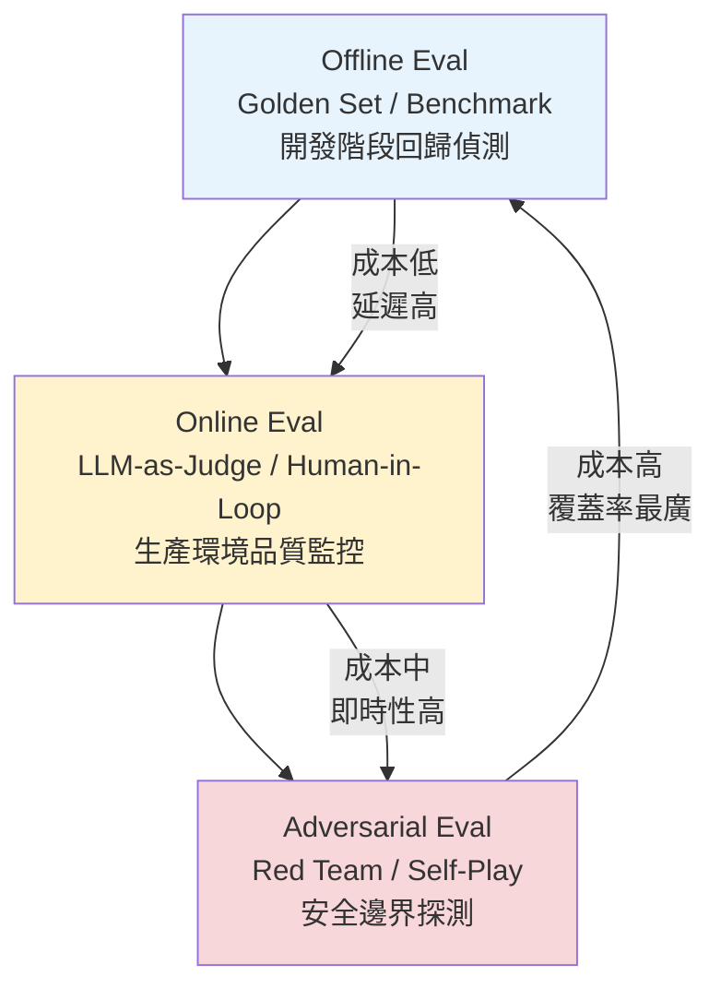
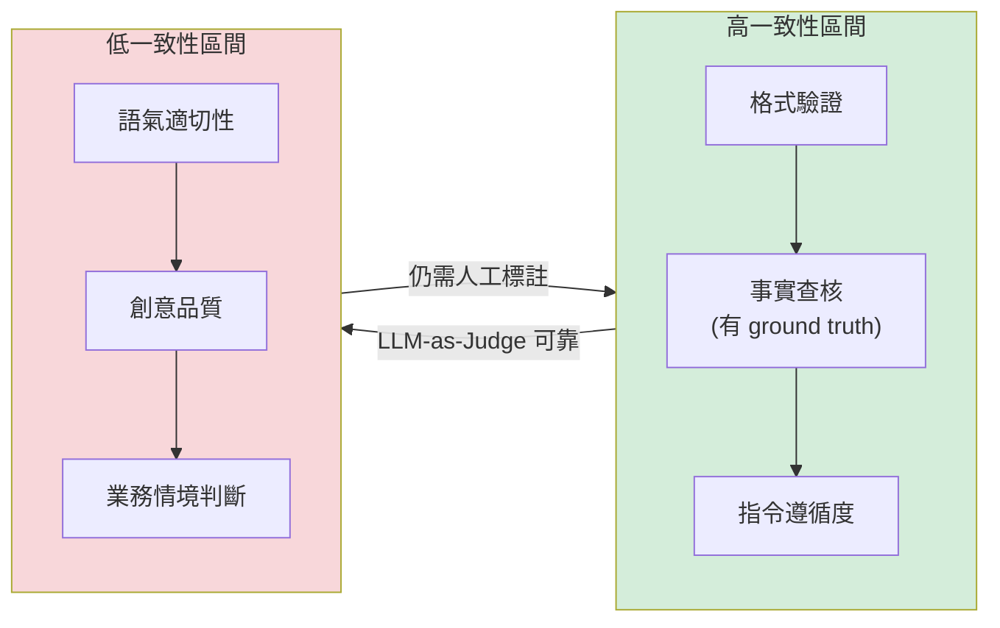
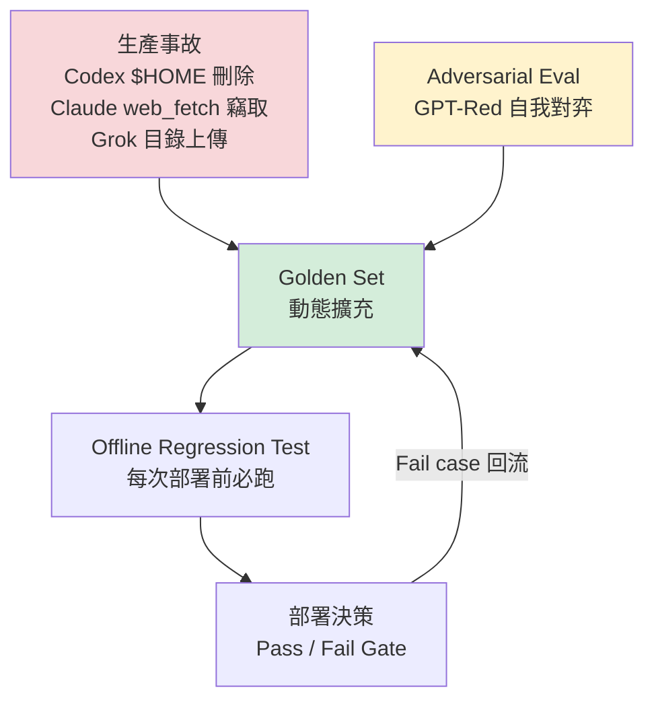
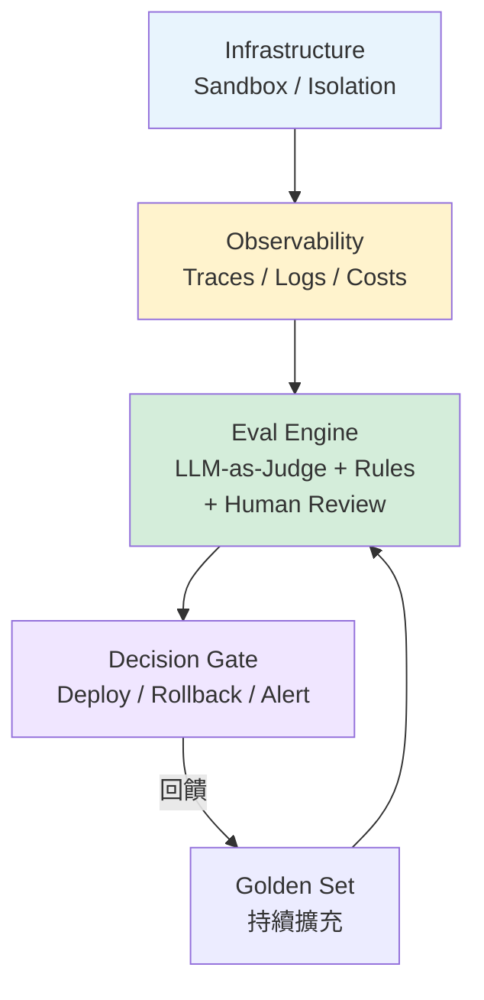
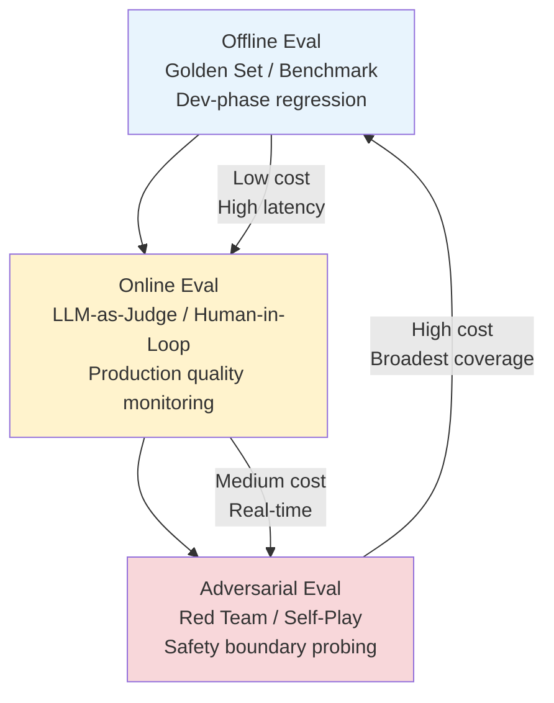
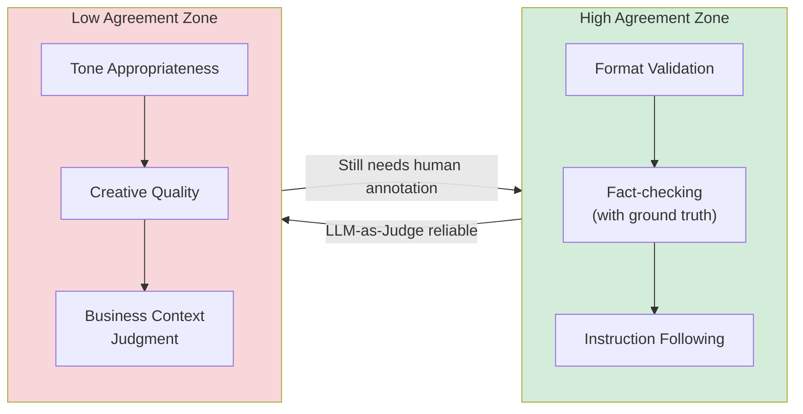

# Foundation — Track D: Evals 設計

_Week 2026-W29 · 25 items synthesized · $0.7125 USD_

# 評估即護城河：Production LLM 系統的 Eval 設計深讀

## TL;DR (3 句繁中)
1. [推論] Production LLM 系統的品質瓶頸已從「模型能力」轉移到「評估能力」——你無法改善你無法衡量的東西，而本週多個信號顯示，業界對「什麼算好的 eval」的理解正在經歷結構性升級。
2. [推論] 核心 trade-off 是 **自動化評估的規模 vs. 人工評估的精確度**：Hamel Husain 的 100 條人工標註 vs. 自動化系統對比研究、OpenAI GPT-Red 的自我對弈紅隊、以及 IBM/HuggingFace 的 417 任務路由評估，分別代表了這條光譜上三個截然不同的位置。
3. 對 Livia 的 SO WHAT：台灣金融與製造業客戶需要的不是「買最強的模型」，而是建立一套 **可審計、可回歸、與業務 KPI 對齊的 eval pipeline**——這正是 IBM consulting 能賣的高價值服務。

## 背景與問題框架

[推論] 六個月前，「LLM 評估」在多數企業客戶的認知裡還等於「跑一次 benchmark、看個 leaderboard 分數」。MMLU、HumanEval、MT-Bench 這些公開 benchmark 是模型選型的入門門檻，但它們解答的是「模型能做什麼」，而非「模型在我的業務場景裡表現如何、什麼時候會壞、壞了我能多快發現」。

[原文] 本週的信號叢集清楚地表明，產業已經進入 eval 2.0 時代。Hamel Husain 直接把問題擺上檯面：[「We compared 100 human annotated traces against automated eval systems. Here's what we found.」](https://hamel.dev/) 這不是學術研究，而是 production practitioner 對自動化 eval 系統的實戰檢驗。同時，OpenAI 發表 [GPT-Red](https://openai.com/index/unlocking-self-improvement-gpt-red) 作為自動化紅隊工具，IBM Research 與 HuggingFace 在 [417 個 AppWorld 任務上](https://huggingface.co/blog/ibm-research/model-routing-is-simple-until-it-isnt)發現模型路由的成本/性能 eval 比想像中困難得多，而多起生產事故（[Codex 檔案刪除](https://simonwillison.net/2026/Jul/16/bad-codex-bug/#atom-everything)、[Grok 資料外洩](https://simonwillison.net/2026/Jul/15/grok-build/#atom-everything)、[Claude web_fetch 竊取](https://simonwillison.net/2026/Jul/15/claude-web-fetch-exfiltration/#atom-everything)、[IBM 測試環境個資外洩](https://www.ithome.com.tw/news/177351)）都指向同一個根因：**缺乏在部署前和部署後持續運作的 eval 機制**。

[推論] 與六個月前的理解相比，最大的差異在於：eval 不再是開發流程的「最後一步」，而是貫穿開發、部署、營運全生命週期的基礎設施。這就是為什麼 Latent Space 的 swyx 在 [AI Engineering World's Fair 2026](https://www.latent.space/p/aiewf26trends) 總結的趨勢是「from agents to systems」——系統層的核心基礎設施之一，就是 eval pipeline。

## 核心概念解析（含 Mermaid 圖）

### 1. Eval 的三層架構：Offline → Online → Adversarial

[推論] 綜合本週信號，Production LLM eval 可以被分為三個互相堆疊的層次，每一層解決不同的問題，也帶來不同的成本結構：

**關鍵洞察**：這三層形成一個循環——Adversarial eval 發現的新攻擊向量應回流為 Offline eval 的新 golden-set case，而 Online eval 發現的 regression 應觸發新的 Offline test suite 擴充。本週的 GPT-Red 自我對弈系統正是 Adversarial → Offline 回流的具體實作。

### 2. LLM-as-Judge 的可信度邊界

[原文] Hamel Husain 的[研究](https://hamel.dev/)直接比較了人工標註與自動化 eval 系統的一致性。雖然完整數據尚待 verify（見 Verification hints），但核心訊息是：**LLM-as-Judge 在結構化任務（格式正確性、事實查核有 ground truth）上與人類高度一致，但在需要判斷語氣、創意品質、或業務情境適切性的任務上，一致性顯著下降。**

[推論] 這與 Chip Huyen 在 *AI Engineering*（2025）中描述的模式一致：LLM-as-Judge 的可信度取決於 **eval criteria 的可操作化程度**。當你能把評分標準寫成 rubric（每個分數等級有具體的 observable behavior），LLM-as-Judge 的表現就接近人類。當 criteria 是模糊的（「回答是否有幫助？」），LLM-as-Judge 就會退化為一個有系統性偏見的隨機數生成器。

**關鍵洞察**：對台灣銀行客戶來說，「貸款申請回覆是否合規」屬於高一致性區間（可 operationalize 的 rubric），但「理專建議是否讓客戶感到信任」屬於低一致性區間。Eval 設計的第一步不是選工具，而是把你的 eval criteria 放到這條光譜上，決定哪些可以自動化、哪些必須人工。

### 3. Golden-Set 構建：從靜態到動態

[推論] 傳統 golden-set 是一組固定的 input-output pair，版本化後不常更新。但本週三個信號指向一個新模式：**golden-set 必須是動態的，由生產事故和 adversarial 發現持續餵養**。

- [原文] OpenAI [GPT-Red](https://openai.com/index/unlocking-self-improvement-gpt-red) 通過自我對弈發現的 prompt injection 攻擊被納入後續模型訓練——這意味著攻擊案例也成為 eval 的新 golden-set case。[iThome 報導](https://www.ithome.com.tw/news/177372)指出 GPT-5.6 Sol 的 prompt injection 成功率降至 0.05%，這個數字的意義在於它是 **相對於前代模型的回歸指標**，而非絕對安全保證。
- [原文] Codex 的[檔案刪除 bug](https://simonwillison.net/2026/Jul/16/bad-codex-bug/#atom-everything)——model 把 `$HOME` 環境變數覆寫後誤刪——應立即成為 coding agent eval 的 golden-set case：「在 full access mode 下，model 是否會嘗試修改 `$HOME`？」
- [原文] Claude [web_fetch 資料竊取](https://simonwillison.net/2026/Jul/15/claude-web-fetch-exfiltration/#atom-everything)攻擊——通過 hostile URL 注入洩漏記憶——應成為任何帶有外部 fetch 工具的 agent eval 的必測案例。

**關鍵洞察**：Golden-set 不是一個 spreadsheet，而是一個有版本控制、有來源標籤（來自 production incident / red-team / customer feedback）、有優先級排序的資料管道。這就是 Allen Institute for AI [Shippy 團隊](https://allenai.org/blog/shippy-deep-dive)說的「evaluations grounded in real-world workflows and live data」。

### 4. Model Routing 的 Eval 陷阱

[原文] IBM Research 與 HuggingFace 的[路由研究](https://huggingface.co/blog/ibm-research/model-routing-is-simple-until-it-isnt)揭示了一個被低估的 eval 問題：**當你用 router 在多個模型之間切換時，你的 eval 必須覆蓋 router 本身的決策品質，而不只是各個模型的獨立表現**。在 417 個 AppWorld 任務上，他們預期 GPT-4.1 比 Claude Sonnet 4.6 便宜，實際結果相反（Sonnet $79 total vs. GPT-4.1 更高）。

[推論] 這意味著 eval 的維度必須擴展：不只是「答案對不對」，還包括「用了多少 token」、「付了多少錢」、「延遲多少毫秒」。NVIDIA 的 [performance-per-watt 框架](https://blogs.nvidia.com/blog/performance-per-watt-ai-infrastructure-efficiency/)在基礎設施層提出了同樣的思路：「a metric that can't be gamed, only earned through real-world results」。把這個思路拉到應用層，就是 **useful-work-per-dollar**——OpenAI 在[投資管理文章](https://openai.com/index/managing-ai-investments-in-agentic-era)中明確提出的框架。

### 5. Observability 作為 Eval 的前提

[原文] LangChain 的[coding agent debugging 文章](https://www.langchain.com/blog/your-coding-agents-are-a-black-box-heres-how-to-crack-them-open)和 [agent sandbox 文章](https://www.langchain.com/blog/agents-need-their-own-computer)共同指出：**你無法 eval 你無法觀測的東西**。Coding agent 跨越 Claude Code、Codex、Cursor、Copilot 等工具，每個工具有不同的 trace 格式。LangSmith 提供統一的 trace inspection（tool calls、sub-agents、errors、costs、retries），但這只是觀測層——eval 邏輯仍然需要在觀測數據之上另外建構。

[推論] 這形成了一個清晰的技術棧：

**關鍵洞察**：Sandbox isolation（LangChain 提出的 sandbox-per-agent 模式）不只是安全考量，它也是 eval 的前提——如果 agent 的 side effect 無法被隔離和回放，你就無法做回歸測試。IBM SLA 事件中[測試資料未去識別化](https://www.ithome.com.tw/news/177351)也是同樣的根因：測試環境的治理本身就是 eval pipeline 的一部分。

## 與既有框架的對位

[推論] 本週信號可以對位到三個 canonical 框架：

**NIST AI RMF（Risk Management Framework）**：NIST 的 GOVERN → MAP → MEASURE → MANAGE 四階段中，本週討論的 eval 設計主要落在 MEASURE 和 MANAGE。GPT-Red 的自我對弈紅隊對應 MEASURE 中的 adversarial testing，而動態 golden-set 的回流機制對應 MANAGE 中的 continuous monitoring。但 NIST 框架沒有充分處理 LLM-as-Judge 的可信度問題——這是一個需要被補充的空白。

**Chip Huyen *AI Engineering*（2025）**：Huyen 提出的 eval taxonomy（capability eval vs. safety eval vs. alignment eval）與本週的三層架構（offline / online / adversarial）高度對應。她特別強調的 eval contamination 問題——模型在訓練時已經「見過」eval 數據——在本週的開放模型討論中隱含出現：[Inkling 的 45T token 訓練集](https://simonwillison.net/2026/Jul/16/inkling/#atom-everything)幾乎不可能不包含主流 benchmark 數據，這使得公開 benchmark 分數的可信度進一步降低。

**Anthropic RSP（Responsible Scaling Policy）**：Anthropic 的分級評估制度（ASL levels）是 adversarial eval 的產業標準。本週 Claude web_fetch 的[竊取漏洞](https://simonwillison.net/2026/Jul/15/claude-web-fetch-exfiltration/#atom-everything)展示了即使有 RSP，具體的工具設計仍然可以被繞過——eval 必須在系統層（tool-level）而非僅在模型層（model-level）進行。

## Trade-offs 與爭議

**1. 自動化 Eval 規模 vs. 人工標註精度**
- 正面：自動化（LLM-as-Judge、rule-based checks）可以覆蓋每一次 API call，提供 100% 覆蓋率，成本可預測
- 反面：Hamel Husain 的研究表明，在模糊 criteria 上自動化 eval 與人類判斷的一致性不足，可能產生 false confidence。100 條人工標註可能比 10,000 條自動化 eval 更能發現 systematic failure pattern
- **建議立場**：[推論] 混合模式——自動化做第一層篩選，人工做抽樣校準（calibration），定期計算 inter-rater agreement 作為 meta-eval

**2. Red Team 內部化 vs. 外包**
- 正面：GPT-Red 式的自動化紅隊可以 24/7 運行，覆蓋面極廣
- 反面：自我對弈有系統性盲點——模型的 blind spot 也是紅隊模型的 blind spot。Grok 的資料外洩和 Codex 的 $HOME 刪除 bug 都不是「prompt injection」，而是工程設計缺陷，自動化紅隊不太可能發現
- **建議立場**：[推論] 自動化紅隊處理已知攻擊類別的回歸測試，但仍需要人類紅隊處理 novel attack surface（尤其是工具整合層的設計缺陷）

**3. 靜態 Golden-Set vs. 動態擴充**
- 正面：動態擴充確保 eval 覆蓋最新的 failure mode
- 反面：無限擴充的 golden-set 會導致 CI/CD pipeline 變慢、維護成本膨脹、信噪比下降
- **建議立場**：[推論] 設定 golden-set 的 TTL（time-to-live）和優先級——高嚴重度的 case 永久保留，低嚴重度的 case 在 6 個月後降級為 sampled test

**4. Eval 指標的維度選擇**
- 正面：多維度 eval（正確性 + 成本 + 延遲 + 安全性）提供更完整的決策基礎
- 反面：維度越多，決策越難——當模型 A 在正確性上贏但成本高 3x，你怎麼選？IBM/HF 路由研究的 417 個任務正是這個困境的具體展現
- **建議立場**：[推論] 建立 composite score 時，權重必須由業務利害關係人決定，而非工程師。銀行的合規場景中 safety 權重 >> cost 權重；製造業的 throughput 場景中 latency 權重 >> 精確度權重

## 對 Livia IBM 客戶的具體含意

[推論] **國泰/玉山（BFSI 客戶）**：台灣銀行業正在從 PoC 走向 production agentic system（AWS 台灣峰會[宣告 Agent AI 元年](https://www.ithome.com.tw/news/177348)是明確信號）。Livia 的提案 angle 應該是：「模型選型是第一步，但 eval pipeline 才是護城河。」具體建議：
- 為合規場景建立 operationalized rubric（每個合規要求對應一個可自動檢查的 eval case）
- 要求客戶在上線前建立 baseline golden-set（至少 200 case，覆蓋正常路徑 + 邊界條件 + adversarial case）
- 引用 IBM SLA 個資外洩事件作為反面教材：測試環境的資料治理是 eval pipeline 的一部分

[推論] **TSMC/Foxconn（製造業客戶）**：製造業的 eval 挑戰不同——他們更在意的是 throughput、latency、和 determinism。Livia 可以引用 NVIDIA 的 performance-per-watt 框架，把它轉化為 「useful-work-per-dollar」在應用層的對應物。具體：製造業的 agent（如設備維護建議系統）的 eval 應該包含「建議是否在 SLA 時間內回覆」和「建議是否與 SOP 一致」兩個硬指標。

**警示**：不要讓客戶用公開 benchmark（MMLU 等）作為模型選型的唯一依據。Inkling 45T token 訓練集的 eval contamination 風險是真實的。正確做法：用公開 benchmark 做初篩，但最終決策必須基於 **客戶自有的 golden-set eval**。

## 對 Livia harness engineer portfolio 的含意

[推論] 本週深讀直接對接 Livia portfolio 中的以下 design note 機會：

1. **Design Note: "Eval Pipeline Architecture for Regulated Industries"**——可以從本週的三層架構（Offline / Online / Adversarial）和動態 golden-set 概念抽出，展示在 GitHub 上作為一個 architecture decision record (ADR)

2. **面試問答素材**：「你如何設計一個 LLM 系統的評估管道？」回答框架——先畫三層圖、說明每層解決什麼問題、trade-off 是什麼、然後用 IBM SLA 和 Codex $HOME 案例說明為什麼 eval 必須包含安全維度

3. **Portfolio 敘事**：把「eval 即護城河」的論點融入 Livia 的整體 narrative——她不只是一個會串 API 的 consultant，而是一個理解「production LLM system 的品質不是一次性驗收，而是持續運行的基礎設施」的 systems thinker

4. **工具鏈展示機會**：在 portfolio 中展示一個小型 eval harness（用 Python + LangSmith trace + LLM-as-Judge + rule-based checks）的實作，即使是 toy scale，也能展示 end-to-end 理解

---

# Evals Are the Moat: A Deep-Read on Production LLM Evaluation Design

## TL;DR (3 sentences)
1. [Inference] The quality bottleneck in production LLM systems has shifted from "model capability" to "evaluation capability"—you can't improve what you can't measure, and this week's signals show the industry's understanding of "what makes a good eval" is undergoing structural upgrade.
2. [Inference] The core trade-off is **scale of automated evaluation vs. precision of human evaluation**: Hamel Husain's 100-trace human annotation study, OpenAI's GPT-Red self-play red teaming, and IBM/HuggingFace's 417-task routing evaluation each represent fundamentally different positions on this spectrum.
3. What Taiwanese banking and manufacturing clients need is not "buy the strongest model" but to build an **auditable, regression-capable, business-KPI-aligned eval pipeline**—precisely the high-value service IBM consulting can sell.

## Background & Problem Framing

[Inference] Six months ago, "LLM evaluation" in most enterprise clients' minds equated to "run a benchmark once, check a leaderboard score." Public benchmarks like MMLU, HumanEval, and MT-Bench serve as model selection entry points, but they answer "what can the model do," not "how does it perform in my business scenario, when will it break, and how quickly will I detect breakage."

[Source] This week's signal cluster demonstrates the industry has entered what I'll call the Eval 2.0 era. Hamel Husain puts the question directly on the table: ["We compared 100 human annotated traces against automated eval systems. Here's what we found."](https://hamel.dev/) This is not academic research but a production practitioner's field test of automated eval systems. Simultaneously, OpenAI published [GPT-Red](https://openai.com/index/unlocking-self-improvement-gpt-red) as an automated red-teaming tool, IBM Research and HuggingFace discovered that model routing cost/performance evaluation is [far harder than expected across 417 tasks](https://huggingface.co/blog/ibm-research/model-routing-is-simple-until-it-isnt), and multiple production incidents ([Codex file deletion](https://simonwillison.net/2026/Jul/16/bad-codex-bug/#atom-everything), [Grok data exfiltration](https://simonwillison.net/2026/Jul/15/grok-build/#atom-everything), [Claude web_fetch exfiltration](https://simonwillison.net/2026/Jul/15/claude-web-fetch-exfiltration/#atom-everything), [IBM test environment PII breach](https://www.ithome.com.tw/news/177351)) all point to the same root cause: **lack of continuous eval mechanisms operating both pre-deployment and post-deployment**.

[Inference] The biggest delta from six months ago: eval is no longer the "last step" of development but infrastructure that runs continuously across the entire lifecycle. This is why swyx's [AI Engineering World's Fair 2026](https://www.latent.space/p/aiewf26trends) trend summary identifies the shift "from agents to systems"—one of the core pieces of systems-level infrastructure is the eval pipeline.

## Core Concepts (with Mermaid diagrams)

### 1. The Three-Layer Eval Architecture: Offline → Online → Adversarial

[Inference] Synthesizing this week's signals, production LLM eval decomposes into three stacked layers, each solving different problems with different cost structures:

**Key insight**: These three layers form a cycle. Attack vectors discovered through adversarial eval should flow back as new offline golden-set cases. Regressions caught by online eval should trigger offline test suite expansion. GPT-Red's self-play system is a concrete implementation of the Adversarial → Offline feedback loop.

### 2. LLM-as-Judge Reliability Boundaries

[Source] Hamel Husain's [study](https://hamel.dev/) directly compares human annotation against automated eval system agreement. While full data needs verification (see Verification hints), the core message is clear: **LLM-as-Judge achieves high agreement with humans on structured tasks (format correctness, fact-checking with ground truth) but significantly lower agreement on tasks requiring judgment of tone, creative quality, or business-context appropriateness.**

[Inference] This aligns with Chip Huyen's framework in *AI Engineering* (2025): LLM-as-Judge reliability depends on **how operationalizable your eval criteria are**. When you can write your scoring criteria as a rubric with concrete observable behaviors per score level, LLM-as-Judge performs near-human. When criteria are vague ("Is the response helpful?"), it degenerates into a biased random number generator.

**Key insight**: For Taiwan bank clients, "Is the loan application response compliant?" falls in the high-agreement zone (operationalizable rubric), but "Does the wealth advisor's suggestion build client trust?" falls in the low-agreement zone. The first step of eval design isn't choosing tools—it's placing your eval criteria on this spectrum to determine what can be automated vs. what requires human review.

### 3. Golden-Set Construction: From Static to Dynamic

[Inference] Traditional golden sets are fixed input-output pairs, versioned and rarely updated. Three signals this week point to a new pattern: **golden sets must be dynamic, continuously fed by production incidents and adversarial discoveries**.

- [Source] OpenAI [GPT-Red](https://openai.com/index/unlocking-self-improvement-gpt-red) feeds prompt injection attacks discovered through self-play into subsequent model training—those attack cases also become new golden-
